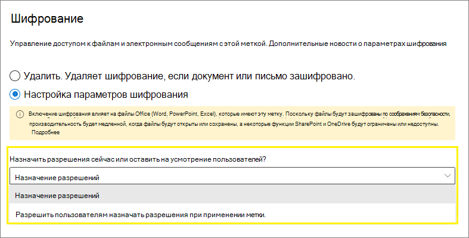

# Ограничение доступа к содержимому с помощью меток конфиденциальности для применения шифрования

>*[Руководство по лицензированию Microsoft 365 для обеспечения безопасности и соответствия требованиям](https://aka.ms/ComplianceSD).*

При создании метки конфиденциальности можно ограничить доступ к содержимому, которому будет присвоена метка. Например параметры шифрования метки конфиденциальности позволяют обеспечить защиту содержимого, чтобы:

- только пользователи организации могли открывать конфиденциальные документы или сообщения электронной почты;
- только пользователи в отделе маркетинга могли редактировать и выводить на печать документы рекламных объявлений или сообщения электронной почты, а всем остальным пользователям вашей организации они были доступны только для чтения;
- пользователи не могли пересылать сообщения электронной почты или копировать данные из них, если в них содержатся новости о внутренней реорганизации;
- текущий список цен, отправляемый бизнес-партнерам, нельзя было открыть после определенной даты.

Если документ или сообщение электронной почты шифруются, доступ к содержимому ограничивается, чтобы:

- его могли расшифровать только пользователи, которым были предоставлены соответствующие права доступа с помощью параметров шифрования метки;
- оно оставалось зашифрованным независимо от того, где находится, в вашей организации или за ее пределами, даже если файл будет переименован;
- оно оставалось зашифрованным во время хранения (например, в учетной записи OneDrive) и при передаче (например, когда почта передается по Интернету).

Наконец, являясь администратором, при настройке метки конфиденциальности для применения шифрования вы можете по своему усмотрению выбрать одно из действий ниже.

- **Назначить разрешения**, чтобы указать конкретных пользователей и разрешения, которые они получат на содержимое с такой меткой.
- **Разрешить пользователям назначать разрешения** при применении метки к содержимому. Таким образом, вы обеспечите пользователям вашей организации определенную гибкость, которая может быть необходима для совместной работы и выполнения рабочих задач.

Параметры шифрования доступны при [создании метки конфиденциальности](create-sensitivity-labels.md) в Центре соответствия требованиям Microsoft 365, Центре безопасности Microsoft 365 и Центре безопасности и соответствия требованиям.

## Как осуществляется шифрование

При шифровании используется служба управления правами Azure (Azure RMS) из Azure Information Protection. Это решение защиты использует политики шифрования, удостоверений и авторизации. Дополнительные сведения см. в статье [Управление правами Azure](https://docs.microsoft.com/azure/information-protection/what-is-azure-rms) из документации по Azure Information Protection. 

При использовании этого решения шифрования функция **суперпользователей** гарантирует, что авторизованные пользователи и службы всегда смогут считывать и проверять данные, зашифрованные для вашей организации. При необходимости шифрование затем можно удалить или изменить. Дополнительные сведения см. в статье [Настройка суперпользователей для Azure Information Protection и служб обнаружения или восстановления данных](https://docs.microsoft.com/azure/information-protection/configure-super-users).

## Настройка метки для шифрования

[Создайте или измените метку конфиденциальности](create-sensitivity-labels.md#create-and-configure-sensitivity-labels), а затем на странице **Шифрование** мастера выберите один из следующих параметров:

- **Нет**. Параметр по умолчанию для новой метки. Новое шифрование не применяется.
- **Применить**. Включает шифрование, после чего вы указываете параметры шифрования.
- **Удалить**. Удаляет шифрование, если документ или письмо зашифровано.

> [!NOTE]
> Параметр **Удалить** поддерживается только клиентом унифицированных меток Azure Information Protection. При использовании встроенной маркировки метка с этим параметром отображается в приложениях и службах Office, и, если она выбрана, режим шифрования такой же, как и у **Нет**.

Настройка параметров шифрования:

### Что происходит с существующим шифрованием при применении метки

Если к незашифрованному содержимому применяется метка конфиденциальности, результат доступных параметров шифрования можно понять без объяснений. Например, если для шифрования выбран параметр **Нет**, содержимое остается незашифрованным.

Но содержимое может быть уже зашифрованным. Например, другой пользователь мог применить:

- Собственные разрешения, включающие определяемые пользователем разрешения при запросе меткой, настраиваемые разрешения клиента Azure Information Protection и защиту документа **Ограниченный доступ** из приложения Office.
- Шаблон защиты службы управления правами Azure, шифрующий содержимое независимо от метки. В эту категорию входят правила потока обработки почты, применяющие шифрование с помощью защиты прав.
- Метку, применяющую шифрование с разрешениями, назначенными администратором.

В следующей таблице указано, что происходит с существующим шифрованием при применении к содержимому метки конфиденциальности.

| |**Шифрование: Нет**|**Шифрование: Применить**|**Шифрование: Удалить**|
|:-----|:-----|:-----|:-----|
|**Разрешения, указанные пользователем**|Исходное шифрование сохраняется|Применяется новое шифрование|Исходное шифрование удаляется|
|**Шаблон защиты**|Исходное шифрование сохраняется|Применяется новое шифрование|Исходное шифрование удаляется|
|**Метка с разрешениями, определенными администратором**|Исходное шифрование удаляется|Применяется новое шифрование|Исходное шифрование удаляется|

Обратите внимание, что в случаях применения нового шифрования с меткой или удаления исходного шифрования эти действия выполняются, только если у пользователя, применяющего метку, есть право на использование или роль, поддерживающие это действие:

- [Право на использование](https://docs.microsoft.com/azure/information-protection/configure-usage-rights#usage-rights-and-descriptions) экспорта или полного доступа.
- Роль [издателя в службе управления правами или владельца в службе управления правами](https://docs.microsoft.com/azure/information-protection/configure-usage-rights#rights-management-issuer-and-rights-management-owner) или [суперпользователя](https://docs.microsoft.com/azure/information-protection/configure-super-users).

Если у пользователя нет одного из этих прав или ролей, метка не может быть применена и поэтому сохраняется исходное шифрование. Для пользователя отображается следующее сообщение: **У вас нет разрешения на внесение изменений в метку конфиденциальности. Обратитесь к владельцу содержимого.**

Например, пользователь, применяющий параметр "Не пересылать" к сообщению электронной почты, может изменить метку цепочки, чтобы заменить шифрование или удалить его, так как он является владельцем в службе управления правами для электронной почты. Но за исключением суперпользователей получатели этого сообщения не могут изменять его метку, так как у них нет необходимых прав на использование.

#### Вложения электронной почты для зашифрованных писем

Если сообщение электронной почты зашифровано любым способом, все незашифрованные документы Office, вложенные в письмо, автоматически наследуют те же параметры шифрования.

Предварительно зашифрованные документы, добавленные в качестве вложений, всегда сохраняют исходное шифрование.

## Настройка параметров шифрования

При использовании параметра **Применить** на странице **Шифрование** мастера создания или изменения метки конфиденциальности укажите, нужно ли выполнять следующее:

- **Назначить разрешения сразу**, чтобы указать конкретных пользователей и разрешения, которые они получат на содержимое с примененной меткой. Дополнительные сведения см. в следующем разделе [Назначение разрешений](#assign-permissions-now).
- **Разрешить пользователям назначать разрешения**, когда они применяют метку к содержимому. С помощью этого параметра вы обеспечите пользователям вашей организации определенную гибкость, которая может быть необходима для совместной работы и выполнения рабочих задач. Дополнительные сведения см. в разделе [Предоставление пользователям возможности назначать разрешения](#let-users-assign-permissions) на этой странице.

Например, если у вас метка конфиденциальности с именем **Строго конфиденциально**, которая будет применяться к данным самого высокого уровня конфиденциальности, вам может понадобиться сразу указать пользователей, которые получат разрешение на такое содержимое, а также тип разрешений.

Кроме того, если у вас метка конфиденциальности с именем **Деловые контракты**, а рабочий процесс вашей организации требует, чтобы пользователи по мере необходимости работали над таким содержимым совместно с разными специалистами, вы можете позволить пользователям самостоятельно указывать, кто получит разрешения, при назначении метки. Такая гибкость способствует продуктивной работе пользователей и сокращает количество обращений к администраторам с просьбой обновить или создать новые метки конфиденциальности в соответствии с определенными сценариями.

Выбор, нужно ли назначать разрешения сразу или разрешить пользователям назначать разрешения:

## Назначение разрешений

С помощью следующих вариантов можно выбрать пользователей, получающих доступ к электронной почте или документам, которым присваивается эта метка. Вы можете выполнить указанные ниже действия.

- **Разрешение ограничения срока действия доступа к содержимому с присвоенной меткой** до определенной даты или по истечении определенного количества дней после применения метки. После этого пользователи не смогут открывать элемент с меткой. Если указать дату, действительным сроком ее наступления будет считаться полночь соответствующего дня в вашем текущем часовом поясе. (Обратите внимание, что некоторые почтовые клиенты могут не применять срок действия и отображают письма по истечении срока их действия из-за механизмов кэширования.)

- **Разрешение доступа в режиме автономной работы** с вариантами "никогда", "всегда" или "на определенное количество дней", после того как метка будет присвоена. Если вы ограничиваете доступ в режиме автономной работы вариантом "никогда" или "на определенное количество дней", при достижении соответствующего порогового значения пользователи должны повторить аутентификацию, а сведения об их доступе записываются в журнал. Дополнительные сведения см. следующем разделе о лицензии на использование службы управления правами.

Параметры для управления доступом к зашифрованному содержимому:

### Служба управления правами использует лицензию для доступа в режиме автономной работы

Когда пользователь открывает документ или сообщение электронной почты, защищенное с помощью шифрования службы управления правами Azure, ему предоставляется лицензия на использование этой службы для соответствующего содержимого. Эта лицензия на использование является сертификатом, содержащим права пользователя на использование документа или сообщения электронной почты, а также ключ шифрования, примененный для шифрования содержимого. Лицензия на использование также содержит дату окончания срока действия, если она установлена, и срок действия лицензии на использование.

Если дата окончания срока действия не задана, срок действия лицензии на использование для клиента по умолчанию составляет 30 дней. На протяжении срока действия лицензии на использование пользователь не проходит повторные проверки подлинности и прав доступа. Этот процесс позволяет пользователю открывать защищенный документ или электронную почту без подключения к Интернету. По истечении срока действия лицензии на использование, когда в следующий раз пользователь будет выполнять доступ к защищенному документу или электронной почте, ему потребуется повторно пройти проверку подлинности и прав доступа.

Помимо повторной проверки подлинности переоцениваются параметры шифрования и принадлежность пользователя к группе. Это означает, что результаты доступа к одну и тому же документу или сообщению для пользователей могут быть разными, если изменены параметры шифрования или участие в группе со времени последнего доступа к содержимому.

Чтобы узнать, как изменить стандартный параметр 30-дневного срока действия, см. раздел [Лицензия на использования службы Microsoft Azure AD Rights Management](https://docs.microsoft.com/azure/information-protection/configure-usage-rights#rights-management-use-license).

### Назначение разрешений определенным пользователям или группам

Вы можете предоставить разрешения определенным людям, чтобы только они могли работать с содержимым, которому присвоена метка:

1. Сначала добавьте пользователей или группы, которым будут назначены разрешения в отношении содержимого с присвоенной меткой.

2. Затем выберите, какие разрешения должны быть у этих пользователей в отношении содержимого с присвоенной меткой.

Назначение разрешений:

#### Добавление пользователей или групп

Когда вы назначаете разрешения, вы можете выбрать один из приведенных ниже вариантов.

- Все сотрудники вашей организации (все участники клиента). Этот параметр исключает гостевые учетные записи.

- Все прошедшие проверку подлинности пользователи. Изучите [требования и ограничения](#requirements-and-limitations-for-add-any-authenticated-users) этого параметра перед его выбором.

- Любой определенный пользователь, группа безопасности с поддержкой электронной почты, группа рассылки или группа Microsoft 365 ([прежнее название — группа Office 365](https://techcommunity.microsoft.com/t5/microsoft-365-blog/office-365-groups-will-become-microsoft-365-groups/ba-p/1303601)) в Azure AD. В группах Microsoft 365 может быть статическое или [динамическое членство](https://docs.microsoft.com/azure/active-directory/users-groups-roles/groups-create-rule). Обратите внимание, что вы не можете использовать [динамическую группу рассылки из Exchange](https://docs.microsoft.com/Exchange/recipients/dynamic-distribution-groups/dynamic-distribution-groups), поскольку этот тип группы не синхронизируется с Azure AD, и вы не можете использовать группу безопасности, для которой не включена поддержка электронной почты.

- Любой адрес электронной почты или домен. Используйте этот вариант, чтобы указать всех пользователей из другой организации, использующих Azure AD, путем ввода любого доменного имени из этой организации. Вы также можете использовать этот вариант для поставщиков социальных служб, указав их доменное имя, например **gmail.com**, **hotmail.com** или **outlook.com**.

    > [!NOTE]
    > Если указать домен из организации, использующей Azure AD, невозможно ограничить доступ к этому определенному домену. Вместо этого все проверенные домены в Azure AD автоматически включаются для клиента, которому принадлежит указанное доменное имя.

Если вы выбираете всех пользователей и группы в своей организации или указываете каталог, пользователи или группы должны иметь адрес электронной почты.

Оптимальной практикой является использование групп, а не отдельных пользователей. Такая стратегия позволяет упростить всю конфигурацию.

##### Требования и ограничения для параметра "Добавление всех пользователей, прошедших проверку подлинности"

Этот параметр не ограничивает список пользователей, которым доступно содержимое, зашифрованное меткой, при этом он шифрует содержимое и предоставляет возможности ограничить использование содержимого (разрешения) и доступ к нему (срок действия и автономный доступ). Однако приложение, открывающее зашифрованное содержимое, должно поддерживать используемую проверку подлинности. По этой причине федеративные поставщики социальных служб, такие как Google, и проверка подлинности с одноразовым секретным кодом поддерживаются только для электронной почты и только при использовании Exchange Online. Учетные записи Майкрософт можно использовать в приложениях Office 365 и [средстве просмотра Azure Information Protection](https://portal.azurerms.com/#/download).

Некоторые типичные сценарии для параметра добавления всех пользователей, прошедших проверку подлинности:

- Вы разрешаете всем пользователям просматривать содержимое, но хотите ограничить способ его использования. Например, вы не хотите, чтобы содержимое изменялось, копировалось или распечатывалось.
- Вам не нужно ограничивать получателей доступа к содержимому, но требуется возможность подтверждения тех, кто его открывает.
- Вам требуется, чтобы содержимое было зашифровано при хранении и перемещении, но нет необходимости в элементах управления доступом.

#### Выбор разрешений

При выборе того, какие разрешения следует предоставить определенным пользователям или группам, вы можете выбрать один из приведенных ниже вариантов.

- [Заранее определенный уровень разрешений](https://docs.microsoft.com/azure/information-protection/configure-usage-rights#rights-included-in-permissions-levels) с предварительно заданной группой прав, например "Соавтор" или "Рецензент".
- Настраиваемые разрешения, в которых можно выбрать одно или несколько прав использования.

Дополнительные сведения о выборе соответствующих разрешений см. в разделе [Права на использование и их описание](https://docs.microsoft.com/azure/information-protection/configure-usage-rights#usage-rights-and-descriptions).  

Обратите внимание, что одна и та же метка может предоставлять разные разрешения для разных пользователей. Например, одна метка может назначить некоторых пользователей как проверяющих, а одного — как соавтора, как показано на следующем снимке экрана.

Чтобы сделать это, добавьте пользователей или группы, назначьте им разрешения и сохраните эти параметры. Затем повторите эти действия — добавление пользователей и назначение им разрешений, каждый раз сохраняя параметры. Эту настройку можно повторять столько раз, сколько требуется, чтобы определить разные разрешения для разных пользователей.

#### У издателя в службе управления правами (пользователь, применяющий метку конфиденциальности) всегда остается полный контроль

Шифрование для метки конфиденциальности использует службу управления правами Azure из Azure Information Protection. Когда пользователь применяет метку конфиденциальности для защиты документа или электронной почты с помощью шифрования, он становится издателем в службе управления правами для такого содержимого.

Издателю в службе управления правами всегда предоставляются разрешения на полный доступ для документа или электронной почты, а также приведенные ниже полномочия.

- Если в параметрах шифрования есть дата окончания срока действия, издатель в службе управления правами по-прежнему может открывать и редактировать документ или сообщения электронной почты после этой даты.
- Издатель в службе управления правами всегда может получить доступ к документу или электронной почте в режиме автономной работы.
- Издатель в службе управления правами по-прежнему может открывать документ после того, как тот будет отозван.

Дополнительные сведения см. в статье [Издатель в службе управления правами и владелец в службе управления правами](https://docs.microsoft.com/azure/information-protection/configure-usage-rights#rights-management-issuer-and-rights-management-owner).

### Шифрование с двойным ключом

> [!NOTE]
> Эта функция в настоящее время поддерживается только клиентом унифицированных меток Azure Information Protection.

Выбирайте этот параметр, только если вы настроили службу шифрования с двойным ключом и вам необходимо использовать это шифрование для файлов с этой меткой.

Дополнительные сведения, предварительные требования и инструкции по настройке см. в статье [Шифрование с двойным ключом (DKE)](double-key-encryption.md).

## Предоставление пользователям возможности назначать разрешения

Вы можете использовать варианты, описанные ниже, чтобы позволить пользователям назначать разрешения, когда они вручную применяют метку конфиденциальности к содержимому.

- В Outlook пользователь может выбрать ограничения, эквивалентные параметру [Не пересылать](https://docs.microsoft.com/azure/information-protection/configure-usage-rights#do-not-forward-option-for-emails) для определенных получателей.

- В Word, PowerPoint и Excel пользователю предлагается выбрать собственные разрешения для определенных пользователей, групп или организаций.

    > [!NOTE]
    > Этот параметр для Word, PowerPoint и Excel поддерживается клиентом унифицированных меток Azure Information Protection. Для использования встроенных меток в приложениях [нужно узнать, в каких приложениях они поддерживаются](sensitivity-labels-office-apps.md#sensitivity-label-capabilities-in-word-excel-and-powerpoint).
    >
    > Если этот параметр выбран, но не поддерживается в пользовательском приложении, эта метка либо не показывается пользователю, либо она отображается для единообразия, но ее нельзя применить, а пользователи получают сообщение с разъяснением.

Если параметры поддерживаются, используйте следующую таблицу, чтобы определить, когда пользователям будет отображаться метка конфиденциальности:

|Параметр |Метка отображается в Outlook|Метка отображается в Word, Excel, PowerPoint|
|:-----|:-----|:-----|:-----|
|**В Outlook применить ограничения, эквивалентные параметру "Не пересылать"**|Да |Нет |
|**В Word, PowerPoint и Excel предлагать пользователям задать разрешения**|Нет |Да|

При выборе обоих параметров метка будет отображаться как в Outlook, так и в Word, Excel и PowerPoint.

Метку конфиденциальности, которая позволяет пользователям назначать разрешения, можно применять к содержимому только вручную; она не может применяться автоматически или использоваться в качестве рекомендуемой метки.

Настройка назначаемых пользователем разрешений:

### Ограничения для Outlook

В Outlook, когда пользователь применяет метку конфиденциальности, которая позволяет ему назначать разрешения сообщению, ограничения соответствуют параметру "Не пересылать". Пользователь видит имя и описание метки в верхней части сообщения, что указывает на защиту содержимого. В отличие от Word, PowerPoint и Excel (см. [следующий раздел](#word-powerpoint-and-excel-permissions)), пользователям не предлагается выбрать определенные разрешения.

Если к сообщению электронной почты применяется параметр "Не пересылать", оно зашифровано, а получатели будут должны пройти проверку подлинности. В этом случае получатели не смогут пересылать или печатать сообщение, а также копировать из него фрагменты. Например, в клиенте Outlook кнопка "Переслать", пункты меню "Сохранить как" и "Печать" будут недоступны, и вы не сможете добавить или изменить получателей в полях "Кому", "Копия" или "СК".

Незашифрованные документы Office, вложенные в сообщение электронной почты, автоматически наследуют такие же ограничения. Права на использование, применяемые к таким документам, — "Редактировать содержимое", "Редактировать", "Сохранить", "Просмотреть", "Открыть", "Прочесть" и "Разрешить макросы". Если пользователю необходимы другие права на использование для вложения, или вложение не является документом Office и не поддерживает наследование защиты, пользователю нужно будет защитить файл, прежде чем вложить его в сообщение электронной почты.

### Разрешения для Word, PowerPoint и Excel

В Word, PowerPoint и Excel, когда пользователь применяет метку конфиденциальности, которая позволяет назначать разрешения документу, ему предлагается выбрать пользователей и разрешения при применении шифрования.

Например, при использовании клиента унифицированных меток Azure Information Protection пользователи могут:

- Выбрать уровень разрешения, например "Пользователь с правом на просмотр" (при этом назначается разрешение "Только просмотр") или "Совместное редактирование" (при этом назначаются разрешения на просмотр, редактирование, копирование и печать).
- Выбрать пользователей, группы или организации. Сюда могут входить пользователи внутри организации или за ее пределами.
- Задать срок действия, после которого выбранные пользователи не смогут получить доступ к содержимому. Дополнительные сведения см. в разделе выше [Лицензия на использование службы управления правами для доступа в режиме автономной работы](#rights-management-use-license-for-offline-access).

При использовании встроенных меток для пользователей отображается такое же диалоговое окно, если они выбирают следующее:

- Windows: вкладка **Файл** > **Сведения** > **Защитить документ** > **Ограничить доступ** > **Ограниченный доступ**

- MacOS: вкладка **Рецензирование** > **Защита** > **Разрешения** > **Ограниченный доступ**

## Примеры настроек параметров шифрования

В каждом из следующих примеров настройка выполняется на странице **Шифрование** мастера [создания или изменения метки конфиденциальности](create-sensitivity-labels.md#create-and-configure-sensitivity-labels). Сначала убедитесь, что параметру **Шифрование** присвоено значение **Применить**:

### Пример 1. Метка, применяющая параметр "Не пересылать" при отправке зашифрованного письма в учетную запись Gmail

Эта метка отображается только в Outlook и Outlook в Интернете, и необходимо использовать Exchange Online. Проинструктируйте пользователей о необходимости выбора этой метки, когда требуется отправить зашифрованное письмо пользователю, применяющему учетную запись Gmail (или другую учетную запись электронной почты за пределами вашей организации).

Ваши пользователи вводят адрес электронной почты Gmail в поле **Кому**.  Затем они выбирают метку, и параметр "Не пересылать" автоматически добавляется в письмо. В результате получатели не смогут переслать письмо или распечатать его, копировать из него, а также сохранить письмо за пределами своего почтового ящика с помощью параметра **Сохранить как**.

1. На странице **Шифрование** для параметра **Назначить разрешения сейчас или оставить на усмотрение пользователей?** выберите **Разрешить пользователям назначать разрешения при применении метки**.

2. Установите флажок **В Outlook применить ограничения, эквивалентные параметру "Не пересылать"**.

3. Если установлен флажок **В Word, PowerPoint и Excel предлагать пользователям задать разрешения**, снимите его.

4. Нажмите **Далее** и завершите работу мастера.

### Пример 2. Метка, допускающая разрешения только для чтения для всех пользователей из другой организации

Эта метка подходит для предоставления общего доступа к конфиденциальным документам с разрешением только для чтения, и для просмотра документов всегда требуется подключение к Интернету.

Эта метка не подходит для сообщений электронной почты.

1. На странице **Шифрование** для параметра **Назначить разрешения сейчас или оставить на усмотрение пользователей?** выберите **Назначение разрешений**.

2. Для параметра **Разрешить автономный доступ** выберите **Никогда**.

3. Щелкните **Назначить разрешения**.

4. В области **Назначение разрешений** выберите **Добавить конкретные адреса электронной почты или домены**.

5. В текстовом поле введите имя домена из другой организации, например **fabrikam.com**. Затем нажмите **Добавить**.

6. Нажмите кнопку **Выбрать разрешения**.

7. В области **Выбор разрешений** щелкните раскрывающийся список, выберите **Пользователь с правом просмотра** и нажмите **Сохранить**.

8. В области **Назначить разрешения** нажмите **Сохранить**.

9. На странице **Шифрование** нажмите **Далее** и завершите работу мастера.

### Пример 3. Добавление внешних пользователей в существующую метку, шифрующую содержимое

Добавляемые новые пользователи смогут открывать документы и сообщения электронной почты, уже защищенные с помощью этой метки. Разрешения, предоставляемые этим пользователям, могут отличаться от разрешений существующих пользователей.

1. На странице **Шифрование** проверьте, что для параметра **Назначить разрешения сейчас или оставить на усмотрение пользователей?** выбрано **Назначение разрешений**.

2. Щелкните **Назначить разрешения**.

3. В области **Назначение разрешений** выберите **Добавить конкретные адреса электронной почты или домены**.

4. В текстовом поле введите адрес электронной почты первого пользователя (или группы) для добавления и нажмите **Добавить**.

5. Нажмите кнопку **Выбрать разрешения**.

6. В области **Выбор разрешений** выберите разрешения для этого пользователя (или группы) и нажмите **Сохранить**.

7. В области **Назначить разрешения** повторите действия 3–6 для каждого пользователя (или группы), которого нужно добавить в эту метку. Затем нажмите кнопку **Сохранить**.

8. На странице **Шифрование** нажмите **Далее** и завершите работу мастера.

### Пример 4. Метка, шифрующая содержимое, но не ограничивающая доступ к нему

Преимущество этой настройки состоит в том, что вам не требуется указывать пользователей, группы или домены, чтобы зашифровать сообщение электронной почты или документ. Содержимое будет зашифровано, и вы по-прежнему указываете права на использование, срок действия и возможность автономного доступа.

Используйте эту настройку только в том случае, если вам не требуется ограничивать, кто может открывать защищенный документ или сообщение электронной почты. [Дополнительные сведения об этом параметре](#requirements-and-limitations-for-add-any-authenticated-users)

1. На странице **Шифрование** проверьте, что для параметра **Назначить разрешения сейчас или оставить на усмотрение пользователей?** выбрано **Назначение разрешений**.

2. Настройте параметры **Срок действия прав пользователей на доступ к содержимому истекает** и **Разрешить автономный доступ** в соответствии с требованиями.

3. Щелкните **Назначить разрешения**.

4. В области **Назначить разрешения** выберите **Добавить пользователей, прошедших проверку подлинности**.

    В области **Пользователи и группы** автоматически добавится раздел **Пользователи, прошедшие проверку подлинности**. Вы не можете изменить это значение. Его можно только удалить, что отменяет выбор параметра **Добавить пользователей, прошедших проверку подлинности**.

5. Нажмите кнопку **Выбрать разрешения**.

6. В области **Выбор разрешений** щелкните раскрывающийся список, выберите нужные разрешения и нажмите **Сохранить**.

7. В области **Назначить разрешения** нажмите **Сохранить**.

8. На странице **Шифрование** нажмите **Далее** и завершите работу мастера.

## Сведения для зашифрованного содержимого

Шифрование наиболее конфиденциальных документов и писем позволяет гарантировать, что только авторизованные пользователи смогут получить доступ к этим данным. Однако следует учитывать некоторые моменты:

- Если в вашей организации не [включены метки конфиденциальности для файлов Office в SharePoint и OneDrive](sensitivity-labels-sharepoint-onedrive-files.md):

  - Поиск, обнаружение электронных данных и Delve не будут поддерживать зашифрованные файлы.
  - Политики защиты от потери данных применяются к метаданным этих зашифрованных файлов, включая сведения о метках хранения (но не к содержимому файлов, например номерам кредитных карт).
  - Пользователи не могут открывать зашифрованные файлы с помощью Office в Интернете. Если метки конфиденциальности для файлов Office в SharePoint и OneDrive включены, пользователи могут использовать Office в Интернете для открытия зашифрованных файлов с некоторыми [ограничениями](sensitivity-labels-sharepoint-onedrive-files.md#limitations), включающими шифрование, примененное с помощью локального ключа (другое название — "собственный ключ" или HYOK), [шифрование с двойным ключом](#double-key-encryption) и шифрование, примененное независимо от метки конфиденциальности.

- Чтобы несколько пользователей могли одновременно редактировать зашифрованный файл, они все должны использовать Office в Интернете. В противном случае, если файл уже открыт:

  - В приложениях Office (Windows, Mac, Android и iOS) для пользователей отобразится сообщение **Файл используется** с именем пользователя, который извлек файл. После этого они смогут просмотреть копию файла, предназначенную только для чтения, или сохранить и изменить копию файла, а также получать уведомления о доступности файла.
  - В Office в Интернете пользователям выводится ошибка с сообщением о том, что они не могут редактировать документ с другими людьми. После этого они смогут выбрать команду **Открыть в режиме чтения**.

- Функция [автосохранения](https://support.office.com/article/what-is-autosave-6d6bd723-ebfd-4e40-b5f6-ae6e8088f7a5) в приложениях Office (Windows, Mac, Android и iOS) отключена для зашифрованных файлов. Для пользователей отображается сообщение о том, что в файле есть ограниченные разрешения, которые требуется удалить, чтобы можно было включить автосохранение.

- Открытие зашифрованных файлов в приложениях Office (Windows, Mac, Android и iOS) может выполняться дольше.

- Следующие действия с зашифрованными файлами не поддерживаются в приложениях Office (Windows, Mac, Android и iOS), а для пользователей отображается сообщение об ошибке. Однако в качестве альтернативы можно использовать возможности SharePoint:

  - Просмотр, восстановление и сохранение копий предыдущих версий. В качестве альтернативы пользователи могут выполнять эти действия с помощью Office в Интернете, если [включено и настроено управление версиями для списка или библиотеки](https://support.office.com/article/enable-and-configure-versioning-for-a-list-or-library-1555d642-23ee-446a-990a-bcab618c7a37).
  - Изменение имени или расположения файлов. В качестве альтернативы пользователи могут [переименовать файл, папку или ссылку в библиотеке документов](https://support.microsoft.com/office/rename-a-file-folder-or-link-in-a-document-library-bc493c1a-921f-4bc1-a7f6-985ce11bb185) в SharePoint.

Для оптимальной совместной работы над файлами, зашифрованными с помощью меток конфиденциальности, рекомендуется использовать [метки конфиденциальности для файлов Office в SharePoint и OneDrive](sensitivity-labels-sharepoint-onedrive-files.md) и Office в Интернете.

## Важные предварительные условия

Прежде чем вы сможете использовать шифрование, вам может понадобиться выполнить некоторые задачи настройки.

### Активация защиты из Azure Information Protection

Чтобы метки конфиденциальности применяли шифрование, в вашем клиенте должна быть активирована служба защиты (Azure Rights Management) из Azure Information Protection. В новых клиентах этот параметр используется по умолчанию, но вам может потребоваться активировать службу вручную. Дополнительные сведения см. в статье [Активация службы защиты из Azure Information Protection](https://docs.microsoft.com/azure/information-protection/activate-service).

### Настройка Exchange для Microsoft Azure Information Protection

Не требуется настройка Exchange для Azure Information Protection, чтобы пользователи смогли применять метки в Outlook для шифрования своих сообщений электронной почты. Однако пока служба Exchange не настроена для Azure Information Protection, будет недоступна полная функциональность при использование защиты службы управления правами Azure с Exchange.

Например, пользователи не могут просматривать зашифрованную электронную почту с мобильных телефонов или с помощью Outlook в Интернете, зашифрованные сообщения электронной почты нельзя проиндексировать для поиска, а также невозможно настроить Exchange Online DLP для защиты службы управления правами.

Чтобы убедиться в том, что служба Exchange сможет поддерживать такие дополнительные сценарии, см. ниже.

- Для Exchange Online см. инструкции для [Exchange Online: настройка IRM](https://docs.microsoft.com/azure/information-protection/configure-office365#exchangeonline-irm-configuration).
- Для использования Exchange в локальной среде необходимо развертывание [соединителя RMS и настройка серверов Exchange](https://docs.microsoft.com/azure/information-protection/deploy-rms-connector).
