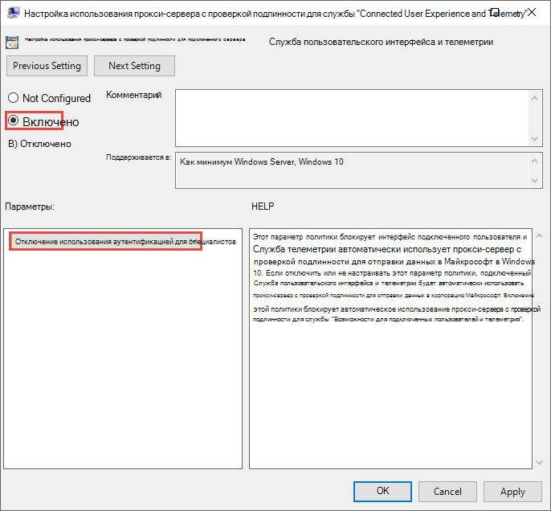
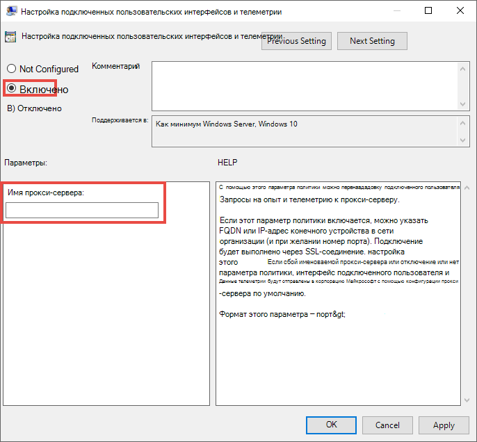

# <a name="configure-device-proxy-and-internet-connection-settings-for-endpoint-dlp"></a>Настройка параметров прокси-сервера и подключения к Интернету для DLP в конечной точке

Microsoft Endpoint DLP использует Microsoft Windows HTTP (WinHTTP) для создания отчетов данных и обмена данными с облачной службой конечных точек Microsoft. Внедренная защита от потери данных в конечной точке в контексте системы работает с учетной записью LocalSystem.

> [!TIP]
> В организациях, в которых прокси-серверы переадресации используются в качестве шлюза в Интернет, можно использовать защиту сети для изучения прокси-сервера. Дополнительные сведения см. в статье [Исследование событий подключения, происходящих за прокси-серверами переадресации](/windows/security/threat-protection/microsoft-defender-atp/investigate-behind-proxy).

Параметр конфигурации WinHTTP не зависит от параметров прокси-сервера Интернет-браузера Windows (WinINet) и может обнаруживать прокси-сервер только с использованием следующих методов автоматического обнаружения:

- Прозрачный прокси
- Протокол автоматического обнаружения веб-прокси (WPAD)

> [!NOTE]
> При использовании прозрачного прокси или WPAD в топологии сети, не нужно использовать специальные параметры конфигурации. Дополнительные сведения об исключениях URL-адресов Защитника для конечных точек в прокси-сервере см. в статье [Разрешение доступа к URL-адресам облачной службы Endpoint DLP на прокси-сервере](#enable-access-to-endpoint-dlp-cloud-service-urls-in-the-proxy-server).

- Конфигурация статического прокси вручную:
  - Конфигурация на основе реестра
  - WinHTTP, настроенный с помощью команды netsh, подходит только для настольных компьютеров в стабильной топологии (например: настольный компьютер в корпоративной сети за тем же прокси-сервером)

## <a name="configure-the-proxy-server-manually-using-a-registry-based-static-proxy"></a>Настройка прокси-сервера вручную с использованием статического прокси-сервера на основе реестра

Для устройств конечных точек, которым не разрешено подключаться к Интернету, необходимо настроить статический прокси на основе реестра. Необходимо настроить этот параметр, чтобы разрешить только Microsoft Endpoint DLP создавать отчеты о диагностических данных и обмениваться сообщениями с облачной службой конечных точек Microsoft.

Статический прокси-сервер можно настроить с помощью групповой политики (GP). Групповые политики можно найти в следующих статьях:

1. Откройте **Административные шаблоны > Компоненты Windows > Сборки для сбора данных и предварительные сборки > Настройка использования прокси-службы для подключенных пользователей и службы телеметрии**

2. Установите для этого параметра значение **Включено** и выберите пункт **Отключить использование прокси с проверкой подлинности**:

   

3. Откройте **Административные шаблоны > Компоненты Windows > Сборки для сбора данных и предварительные сборки > Настройка телеметрии и функциональных возможностей подключенных пользователей**:

   Настройка прокси-сервера

   

   Политика устанавливает два значения реестра: `TelemetryProxyServer` как REG_SZ и `DisableEnterpriseAuthProxy` как REG_DWORD в разделе реестра `HKLM\Software\Policies\Microsoft\Windows\DataCollection`.

   Значение реестра TelemetryProxyServer имеет формат \<server name or ip\>:\<port\>. Например, **10.0.0.6:8080**

   Следует назначить значение реестра `DisableEnterpriseAuthProxy` — 1.

## <a name="configure-the-proxy-server-manually-using-netsh-command"></a>Настройка прокси-сервера вручную с помощью команды "netsh"

Используйте команду netsh для настройки статического прокси на уровне системы.

> [!NOTE]
> Это повлияет на все приложения, в том числе службы Windows, которые используют WinHTTP с прокси по умолчанию. — Ноутбуки, которые изменяют топологию (например, с офисной на домашнюю), не будут работать при использовании команды netsh. Используйте настройку статических прокси-серверов на основе реестра.

1. Откройте командную строку с повышенными правами:
    1. В меню **Пуск** введите **cmd**
    2. Щелкните правой кнопкой мыши пункт **Командная строка** и выберите команду **Запуск от имени администратора**.

2. Введите следующую команду и нажмите клавишу **ВВОД**:

   `netsh winhttp set proxy <proxy>:<port>`

   Например, **netsh winhttp set proxy 10.0.0.6:8080**

3. Чтобы сбросить прокси winhttp, введите следующую команду и нажмите клавишу **ВВОД**:

   `netsh winhttp reset proxy`

Дополнительные сведения см. в статье [Синтаксис команд, контексты и форматирование Netsh](/windows-server/networking/technologies/netsh/netsh-contexts).

## <a name="enable-access-to-endpoint-dlp-cloud-service-urls-in-the-proxy-server"></a>Разрешение доступа к URL-адресам облачной службы Endpoint DLP на прокси-сервере

Если прокси-сервер или брандмауэр блокирует весь трафик по умолчанию и пропускает только определенные домены, добавьте домены, перечисленные в загружаемой электронной таблице, в список разрешенных доменов.

Эта [загружаемая электронная таблица](https://download.microsoft.com/download/8/a/5/8a51eee5-cd02-431c-9d78-a58b7f77c070/mde-urls.xlsx) содержит список служб и связанных с ними URL-адресов, которые должны быть доступны вашей сети. Убедитесь, что правила брандмауэра или сетевой фильтрации, которые запрещали бы доступ к этим URL-адресам, отсутствуют, или вам может потребоваться создать разрешающее правило специально для них.

Если на прокси-сервере или брандмауэре включено сканирование HTTPS (проверка SSL), исключите домены, перечисленные в приведенной выше таблице, из сканирования HTTPS.
Если прокси-сервер или брандмауэр блокирует анонимный трафик, поскольку DLP конечной точки подключается из системного контекста, убедитесь, что анонимный трафик разрешен в ранее перечисленных URL-адресах.

## <a name="verify-client-connectivity-to-microsoft-cloud-service-urls"></a>Проверка подключения клиента к URL-адресам облачных служб Майкрософт

Убедитесь в том, что настройка прокси-сервера выполнена успешно, служба WinHTTP может обнаружить и передать данные через прокси-сервер в вашей среде, а прокси-сервер разрешает трафик на URL-адреса службы Защитника для конечных точек.

1. Скачайте [средство MDATP Client Analyzer](https://aka.ms/mdatpanalyzer) на компьютер, на котором запущена защита от потери данных в конечной точке.
2. Извлеките содержимое MDATPClientAnalyzer.zip на устройство.
3. Откройте командную строку с повышенными правами:
    1. В меню **Пуск** введите **cmd**.
    1. Щелкните правой кнопкой мыши пункт **Командная строка** и выберите команду **Запуск от имени администратора**.
4. Введите следующую команду и нажмите клавишу **ВВОД**:

   `HardDrivePath\MDATPClientAnalyzer.cmd`

   Замените *HardDrivePath* на путь, по которому был загружен инструмент MDATPClientAnalyzer, например

   **C:\Work\tools\MDATPClientAnalyzer\MDATPClientAnalyzer.cmd**

5. Извлеките файл **MDATPClientAnalyzerResult.zip** _, созданный с помощью средства, в папку, используемую в _HardDrivePath*.

6. Откройте **MDATPClientAnalyzerResult.txt** и убедитесь в том, что вы выполнили действия по настройке прокси-сервера, чтобы включить обнаружение сервера и доступ к URL-адресам службы.  Средство проверяет возможность подключения URL-адресов службы Защитника для конечной точки, которые настроены для работы службы Защитника для конечной точки с клиентом. Затем результаты выводятся в файл **MDATPClientAnalyzerResult.txt** для каждого URL-адреса, который потенциально можно использоваться для общения с Защитником для служб конечных точек. Пример:

   ```DOS
   Testing URL: https://xxx.microsoft.com/xxx
   1 - Default proxy: Succeeded (200)
   2 - Proxy auto discovery (WPAD): Succeeded (200)
   3 - Proxy disabled: Succeeded (200)
   4 - Named proxy: Doesn't exist
   5 - Command-line proxy: Doesn't exist
   ```

Если по крайней мере один из вариантов подключения возвращает состояние (200), то клиент Defender для конечной точки может правильно взаимодействовать с проверенным URL-адресом, используя этот метод подключения.

Однако, если результаты проверки подключения указывают на сбой, отображается ошибка HTTP (см. Коды состояния HTTP). Затем вы можете использовать URL-адреса в таблице, приведенной в статья [Разрешение доступа к URL-адресам облачной службы Endpoint DLP на прокси-сервере](#enable-access-to-endpoint-dlp-cloud-service-urls-in-the-proxy-server). Используемые URL будут зависеть от региона, выбранного во время процедуры подключения.

> [!NOTE]
>
> Анализатор подключений несовместим с правилом ASR — [Блокировка создания процессов, исходящих от команд PSExec и WMI](/windows/security/threat-protection/windows-defender-exploit-guard/attack-surface-reduction#attack-surface-reduction-rules). Необходимо временно отключить это правило, чтобы запустить средство подключения.
>
> Если задано значение TelemetryProxyServer (в реестре или с помощью групповой политики), Defender для конечной точки вернется к прямому варианту, если не сможет получить доступ к определенному прокси. Статьи по теме:
>
> - Подключение устройств Windows 10
> - Устранение неполадок с подключением к DLP в конечной точке (Майкрософт)

## <a name="see-also"></a>См. также

- [Сведения о защите от потери данных в конечной точке](endpoint-dlp-learn-about.md)
- [Использование защиты от потери данных в конечной точке](endpoint-dlp-using.md)
- [Сведения о защите от потери данных](dlp-learn-about-dlp.md)
- [Создание, тестирование и настройка политики защиты от потери данных](create-test-tune-dlp-policy.md)
- [Начало работы с обозревателем действий](data-classification-activity-explorer.md)
- [Microsoft Defender для конечной точки](/windows/security/threat-protection/)
- [Средства и методы подключения для компьютеров с Windows 10](/windows/security/threat-protection/microsoft-defender-atp/configure-endpoints)
- [Подписка на Microsoft 365](https://www.microsoft.com/microsoft-365/compare-microsoft-365-enterprise-plans?rtc=1)
- [Устройства, подключенные к Azure AD](/azure/active-directory/devices/concept-azure-ad-join)
- [Загрузка нового браузера Microsoft Edge на основе Chromium](https://support.microsoft.com/help/4501095/download-the-new-microsoft-edge-based-on-chromium)
