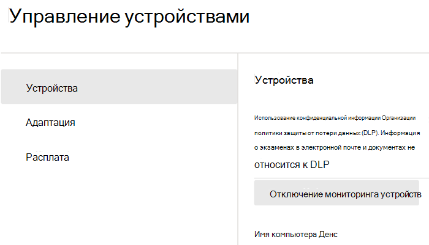
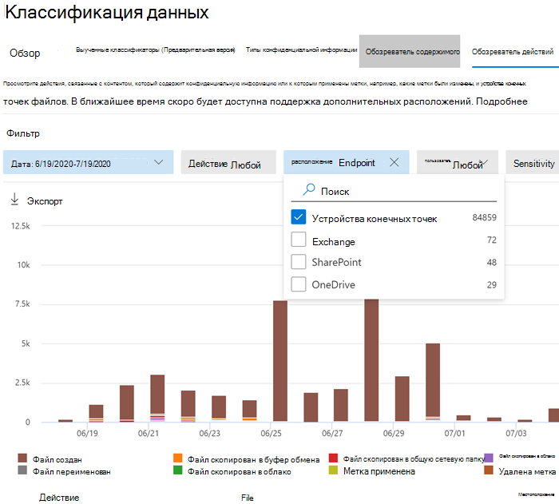

# Начало работы с функцией защиты от потери данных в конечной точкеGet started with Endpoint data loss prevention

Защита от потери данных в конечной точке Майкрософт (DLP в конечной точке) является частью набора функций защиты от потери данных Microsoft 365 (DLP), которые можно использовать для обнаружения и защиты конфиденциальных элементов в службах Microsoft 365. Дополнительные сведения обо всех предложениях защиты от потери данных Microsoft см. в статье [Обзор политик защиты от потери данных](data-loss-prevention-policies.md). Дополнительные сведения о защите от потери данных в конечной точке см. в статье [Сведения о защите от потери данных в конечной точке (предварительная версия)](endpoint-dlp-learn-about.md)Microsoft Endpoint data loss prevention (Endpoint DLP) is part of the Microsoft 365 data loss prevention (DLP) suite of features you can use to discover and protect sensitive items across Microsoft 365 services. For more information about all of Microsoft’s DLP offerings, see [Overview of data loss prevention](data-loss-prevention-policies.md). To learn more about Endpoint DLP, see [Learn about Endpoint data loss prevention (preview)](endpoint-dlp-learn-about.md)

Защита от потери данных в конечной точке Майкрософт позволяет отслеживать устройства с Windows 10, а также определять, когда используются и распространяются конфиденциальные элементы. Это обеспечивает необходимый уровень контроля и видимости для их правильного использования и защиты, а также для предотвращения рискованного поведения, которое может поставить их под угрозу.Microsoft Endpoint DLP allows you to monitor Windows 10 devices and detect when sensitive items are used and shared. This gives you the visibility and control you need to ensure that they are used and protected properly, and to help prevent risky behavior that might compromise them.

## Перед началом работыBefore you begin

### Лицензирование SKU/подпискиSKU/subscriptions licensing

Прежде чем приступить к управлению службой защиты от потери данных в конечной точке, подтвердите [подписку Microsoft 365](https://www.microsoft.com/microsoft-365/compare-microsoft-365-enterprise-plans?rtc=1) и любые дополнительные надстройки. Чтобы использовать функции защиты от потери данных в конечной точке, необходимо иметь одну из этих подписок или надстроек.Before you get started with Endpoint DLP, you should confirm your [Microsoft 365 subscription](https://www.microsoft.com/microsoft-365/compare-microsoft-365-enterprise-plans?rtc=1) and any add-ons. To access and use Endpoint DLP functionality, you must have one of these subscriptions or add-ons.

- Microsoft 365 E5Microsoft 365 E5
- Microsoft 365 A5 (для учебных заведений)Microsoft 365 A5 (EDU)
- Соответствие требованиям Microsoft 365 E5Microsoft 365 E5 compliance
- Соответствие требованиям Microsoft 365 A5Microsoft 365 A5 compliance
- Защита информации и управление данными в Microsoft 365 E5Microsoft 365 E5 information protection and governance
- Защита информации и управление данными в Microsoft 365 A5Microsoft 365 A5 information protection and governance

### РазрешенияPermissions

Чтобы включить управление устройствами, используемая учетная запись должна входить в любую из этих ролей:To enable device management, the account you use must be a member of any one of these roles:

- Глобальный администраторGlobal admin
- Администратор безопасностиSecurity admin
- Администратор соответствия требованиямCompliance admin

Если вы хотите использовать настраиваемую учетную запись для просмотра параметров управления устройствами, она должна иметь одну из следующих ролей:If you want to use a custom account to view the device management settings, it must be in one of these roles:

- Глобальный администраторGlobal admin
- Администратор соответствия требованиямCompliance admin
- Администратор данных соответствия требованиямCompliance data admin
- Глобальный читательGlobal reader

Если вы хотите использовать настраиваемую учетную запись для доступа к страницам подключения или отключения, она должна иметь одну из следующих ролей:If you want to use a custom account to access the onboarding/offboarding page, it must be in one of these roles:

- Глобальный администраторGlobal admin
- Администратор соответствия требованиямCompliance admin

Если вы хотите использовать настраиваемую учетную запись для отслеживания включения и отключения устройств, она должна иметь одну из следующих ролей:If you want to use a custom account to turn on/off device monitoring, it must be in one of these roles:

- Глобальный администраторGlobal admin
- Администратор соответствия требованиямCompliance admin

Данные из службы защиты от потери данных в конечной точке доступны в [Обозревателе действий](data-classification-activity-explorer.md). Существует четыре роли, которые предоставляют разрешения обозревателю действий. Учетная запись, которую вы используете для доступа к данным, должна входить в любую из этих ролей.Data from Endpoint DLP can be viewed in [Activity explorer](data-classification-activity-explorer.md). There are four roles that grant permission to activity explorer, the account you use for accessing the data must be a member of any one of them.

- Глобальный администраторGlobal admin
- Администратор соответствия требованиямCompliance admin
- Администратор безопасностиSecurity admin
- Администратор данных соответствия требованиямCompliance data admin

### Подготовка конечных точекPrepare your endpoints

Убедитесь, что устройства с Windows 10, на которых вы планируете развертывание защиты от потери данных в конечных точках, соответствуют следующим требованиям.Make sure that the Windows 10 devices that you plan on deploying Endpoint DLP to meet these requirements.

1. Устройство работает под управлением Windows 10 (64-разрядная) сборки 1809 или более поздней версии.Must be running Windows 10 x64 build 1809 or later.

2. Версия клиента антивредоносной программы: 4.18.2009.7 или более поздняя. Проверьте свою текущую версию, открыв приложение "Безопасность Windows", щелкнув значок "Параметры" и выбрав "О программе". Номер версии указан в строке "Версия клиента антивредоносной программы". Перейдите на последнюю версию клиента антивредоносной программы, установив обновление Windows KB4052623. Примечание. Не требуется запускать никакие компоненты Безопасности Windows. Вы можете запускать DLP в конечной точке независимо от состояния Безопасности Windows.Antimalware Client Version is 4.18.2009.7 or newer. Check your current version by opening Windows Security app, select the Settings icon, and then select About. The version number is listed under Antimalware Client Version. Update to the latest Antimalware Client Version by installing Windows Update KB4052623. Note: None of Windows Security components need to be active, you can run Endpoint DLP independent of Windows Security status.

3. Устанавливаются следующие обновления Windows. Примечание. Эти обновления не являются предварительным условием для подключения устройства к DLP в конечной точке. Но они содержат важные исправления проблем, поэтому их требуется установить перед использованием продукта.The following Windows Updates are installed. Note: These updates are not a pre-requisite to onboard a device to Endpoint DLP, but contain fixes for important issues thus must be installed before using the product.

    - Для Windows 10 версии 1809 — KB4559003, KB4577069, KB4580390For Windows 10 1809 - KB4559003, KB4577069, KB4580390
    - Для Windows 10 версии 1903 или 1909 — KB4559004, KB4577062, KB4580386For Windows 10 1903 or 1909 - KB4559004, KB4577062, KB4580386
    - Для Windows 10 версии 2004 — KB4568831, KB4577063For Windows 10 2004 - KB4568831, KB4577063
    - Для устройств с Office 2016 (но не других версий Office) — KB4577063For devices running Office 2016 (and not any other Office version) - KB4577063 

4. Все устройства должны быть подключены к [Azure Active Directory (Azure AD)](https://docs.microsoft.com/azure/active-directory/devices/concept-azure-ad-join) или иметь гибридное присоединение к Azure AD.All devices must be [Azure Active Directory (Azure AD) joined](https://docs.microsoft.com/azure/active-directory/devices/concept-azure-ad-join), or Hybrid Azure AD joined.

5. Установите браузер Microsoft Chromium Edge на устройство конечной точки для применения действий политики к отправке в облако. См. статью [Скачивание нового браузера Microsoft Edge на основе Chromium](https://support.microsoft.com/help/4501095/download-the-new-microsoft-edge-based-on-chromium).Install Microsoft Chromium Edge browser on the endpoint device to enforce policy actions for the upload to cloud activity. See, [Download the new Microsoft Edge based on Chromium](https://support.microsoft.com/help/4501095/download-the-new-microsoft-edge-based-on-chromium).

6. Если вы используете Ежемесячный канал (корпоративный) для Приложений Microsoft 365 версий 2004–2008, в них существует известная проблема с классификацией контента Office функцией защиты от потери данных в конечной точке и вам требуется обновиться до версии 2009 или более поздней. Текущие версии см. в [журнале обновлений для Приложений Microsoft 365 (по дате)](https://docs.microsoft.com/officeupdates/update-history-microsoft365-apps-by-date). Дополнительные сведения об этой проблеме см. в разделе "Набор Office" [заметок о выпусках Актуального канала в 2020 г.](https://docs.microsoft.com/officeupdates/current-channel#version-2010-october-27)If you are on Monthly Enterprise Channel of Microsoft 365 Apps versions 2004-2008, there is a known issue with Endpoint DLP classifying Office content and you need to update to version 2009 or later. See [Update history for Microsoft 365 Apps (listed by date)](https://docs.microsoft.com/officeupdates/update-history-microsoft365-apps-by-date) for current versions. To learn more about this issue, see the Office Suite section of [Release notes for Current Channel releases in 2020](https://docs.microsoft.com/officeupdates/current-channel#version-2010-october-27).

## Интеграция устройств в управление устройствамиOnboarding devices into device management

Перед тем как отслеживать и защищать конфиденциальные элементы на устройстве, необходимо включить отслеживание устройств и подключить конечные точки. Это можно сделать на портале соответствия требованиям Microsoft 365.You must enable device monitoring and onboard your endpoints before you can monitor and protect sensitive items on a device. Both of these actions are done in the Microsoft 365 Compliance portal.

Если вы хотите подключить устройства, которые еще не были подключены, скачайте соответствующий сценарий и разверните его на этих устройствах. Выполните действия, описанные в разделе [Подключение устройств](endpoint-dlp-getting-started.md#onboarding-devices).When you want to onboard devices that haven't been onboarded yet, you'll download the appropriate script and deploy it to those devices. Follow the [Onboarding devices procedure](endpoint-dlp-getting-started.md#onboarding-devices).

Если у вас уже есть устройства, подключенные к [Microsoft Defender для конечной точки](https://docs.microsoft.com/windows/security/threat-protection/), они будут отображаться в списке управляемых устройств. Выполните действия, описанные в разделе [Процедура с устройствами подключенными к Microsoft Defender для конечной точки](endpoint-dlp-getting-started.md#with-devices-onboarded-into-microsoft-defender-for- endpoint).If you already have devices onboarded into [Microsoft Defender for Endpoint](https://docs.microsoft.com/windows/security/threat-protection/), they will already appear in the managed devices list. Follow the [With devices onboarded into Microsoft Defender for Endpoint procedure](endpoint-dlp-getting-started.md#with-devices-onboarded-into-microsoft-defender-for- endpoint).

### Подключение устройствOnboarding devices

В этом сценарии развертывания подключаются устройства, которые еще не были подключены, а вам необходимо только отслеживать и защищать конфиденциальные элементы от непреднамеренного распространения на устройствах с Windows 10.In this deployment scenario, you'll onboard devices that have not been onboarded yet, and you just want to monitor and protect sensitive items from unintentional sharing on Windows 10 devices.

1. Откройте [Центр соответствия требованиям Microsoft](https://compliance.microsoft.com).Open the [Microsoft compliance center](https://compliance.microsoft.com).

2. Откройте параметры Центра соответствия требованиям и выберите **Подключение устройств**.Open the Compliance Center settings page and choose **Onboard devices**. 

   > [!div class="mx-imgBorder"]
   > 

   > [!NOTE]
   > Обычно подключение устройств занимает около 60 секунд, но перед обращением в службу поддержки Майкрософт подождите около 30 минут.While it usually takes about 60 seconds for device onboarding to be enabled, please allow up to 30 minutes before engaging with Microsoft support.

3. Выберите **Управление устройствами** , чтобы открыть список **Устройства**. Список будет пустым, пока устройства не будут подключены.Choose **Device management** to open the **Devices** list. The list will be empty until you onboard devices.

4. Нажмите **Подключение** , чтобы начать процесс.Choose **Onboarding** to begin the onboarding process.

5. Выберите способ развертывания для дополнительных устройств в списке **Способ развертывания** , а затем **загрузите пакет**.Choose the way you want to deploy to these additional devices from the **Deployment method** list and then **download package**.

   > [!div class="mx-imgBorder"]
   > 
   
6. Выполните действия, описанные в разделе [Средства и методы подключения для компьютеров с Windows 10](https://docs.microsoft.com/windows/security/threat-protection/microsoft-defender-atp/configure-endpoints). Эта ссылка открывает страницу доступа к процедурам с Microsoft Defender для конечной точки, соответствующим пакету развертывания, который вы выбрали на этапе 5:Follow the appropriate procedures in [Onboarding tools and methods for Windows 10 machines](https://docs.microsoft.com/windows/security/threat-protection/microsoft-defender-atp/configure-endpoints). This link take you to a landing page where you can access Microsoft Defender for Endpoint procedures that match the deployment package you selected in step 5:

    - Подключение компьютеров с Windows 10 с помощью групповой политикиOnboard Windows 10 machines using Group Policy
    - Подключение компьютеров с Windows с помощью Microsoft Endpoint Configuration ManagerOnboard Windows machines using Microsoft Endpoint Configuration Manager
    - Подключение компьютеров с Windows 10 с помощью инструментов управления мобильными устройствамиOnboard Windows 10 machines using Mobile Device Management tools
    - Подключение компьютеров с Windows 10 с помощью локального сценарияOnboard Windows 10 machines using a local script
    - Подключение временных компьютеров инфраструктуры виртуальных рабочих столов (VDI).Onboard non-persistent virtual desktop infrastructure (VDI) machines.

После подключения конечная точка будет отображаться в списке устройств, а также начнет отправлять отчеты о действиях аудита в обозреватель действий.Once done and endpoint is onboarded, it should be visible in the devices list and also start reporting audit activity logs to Activity explorer.

> [!NOTE]
> Эта возможность включает принудительное применение лицензий. Без необходимой лицензии данные не будут видимы или доступны.This experience is under license enforcement. Without the required license, data will not be visible or accessible.

### Процедура с устройствами подключенными к Microsoft Defender для конечной точкиWith devices onboarded into Microsoft Defender for Endpoint

В этом случае Microsoft Defender для конечной точки уже развернут, а также присутствуют отчеты о конечных точках. Все конечные точки будут отображаться в списке управляемых устройств. Вы можете продолжать подключать новые устройства к DLP в конечной точке, чтобы расширить охват с помощью [Процедуры подключения устройств](endpoint-dlp-getting-started.md#onboarding-devices).In this scenario, Microsoft Defender for Endpoint is already deployed and there are endpoints reporting in. All these endpoints will appear in the managed devices list. You can continue to onboard new devices into Endpoint DLP to expand coverage by using the [Onboarding devices procedure](endpoint-dlp-getting-started.md#onboarding-devices).

1. Откройте [Центр соответствия требованиям Microsoft](https://compliance.microsoft.com).Open the [Microsoft compliance center](https://compliance.microsoft.com).

2. Откройте параметры Центра соответствия требованиям и выберите **Включить отслеживание устройств**.Open the Compliance Center settings page and choose **Enable device monitoring**.

3. Выберите **Управление устройствами** , чтобы открыть список **Устройства**. Отобразится список устройств, которые уже отправляют отчеты в Microsoft Defender для конечной точки.Choose **Device management** to open the **Devices** list. You should see the list of devices that are already reporting in to Microsoft Defender for Endpoint.

   > [!div class="mx-imgBorder"]
   > 
   
4. Чтобы подключить дополнительные устройства, выберите **Подключение**.Choose **Onboarding** if you need to onboard additional devices.

5. Выберите способ развертывания для дополнительных устройств в списке **Способ развертывания** , а затем **загрузите пакет**.Choose the way you want to deploy to these additional devices from the **Deployment method** list and then **Download package**.

6. Выполните действия, описанные в разделе [Средства и методы подключения для компьютеров с Windows 10](https://docs.microsoft.com/windows/security/threat-protection/microsoft-defender-atp/configure-endpoints). Эта ссылка открывает страницу доступа к процедурам с Microsoft Defender для конечной точки, соответствующим пакету развертывания, который вы выбрали на этапе 5:Follow the appropriate procedures in [Onboarding tools and methods for Windows 10 machines](https://docs.microsoft.com/windows/security/threat-protection/microsoft-defender-atp/configure-endpoints). This link take you to a landing page where you can access Microsoft Defender for Endpoint procedures that match the deployment package you selected in step 5:

    - Подключение компьютеров с Windows 10 с помощью групповой политикиOnboard Windows 10 machines using Group Policy
    - Подключение компьютеров с Windows с помощью Microsoft Endpoint Configuration ManagerOnboard Windows machines using Microsoft Endpoint Configuration Manager
    - Подключение компьютеров с Windows 10 с помощью инструментов управления мобильными устройствамиOnboard Windows 10 machines using Mobile Device Management tools
    - Подключение компьютеров с Windows 10 с помощью локального сценарияOnboard Windows 10 machines using a local script
    - Подключение временных компьютеров инфраструктуры виртуальных рабочих столов (VDI).Onboard non-persistent virtual desktop infrastructure (VDI) machines.

После подключения конечная точка будет отображаться в таблице **Устройства** , а также начнет отправлять отчеты из журнала аудита в **обозреватель действий**.Once done and endpoint is onboarded, it should be visible under the **Devices** table and also start reporting audit logs to the **Activity Explorer**.

> [!NOTE]
>Эта возможность включает принудительное применение лицензий. Без необходимой лицензии данные не будут видимы или доступны.This experience is under license enforcement. Without the required license, data will not be visible or accessible.

### Просмотр оповещений защиты от потери данных в конечной точке на панели управления оповещениями защиты от потери данныхViewing Endpoint DLP alerts in DLP Alerts Management dashboard

1. Откройте страницу защиты от потери данных в Центре соответствия требованиям Microsoft 365 и выберите "Оповещения".Open the Data loss prevention page in the Microsoft 365 Compliance center and choose Alerts.

2. Используйте процедуры из статьи [Настройка и просмотр оповещений для политик защиты от потери данных](dlp-configure-view-alerts-policies.md), чтобы просмотреть оповещения для своих политик защиты от потери данных в конечной точке.Refer to the procedures in [How to configure and view alerts for your DLP policies](dlp-configure-view-alerts-policies.md) to view alerts for your Endpoint DLP policies.

### Просмотр данных защиты от потери данных в конечной точке с помощью обозревателя действийViewing Endpoint DLP data in activity explorer

1. Откройте страницу [классификации данных](https://compliance.microsoft.com/dataclassification?viewid=overview) для своего домена в Центре соответствия требованиям Microsoft 365 и выберите обозреватель действий.Open the [Data classification page](https://compliance.microsoft.com/dataclassification?viewid=overview) for your domain in the Microsoft 365 Compliance center and choose Activity explorer.

2. Выполните действия, описанные в статье [Начало работы с обозревателем действий](data-classification-activity-explorer.md), чтобы получить доступ к данным и отфильтровать их на своих устройствах конечной точки.Refer to the procedures in [Get started with Activity explorer](data-classification-activity-explorer.md) to access and filter all the data for your Endpoint devices.

   > [!div class="mx-imgBorder"]
   > 

## Дальнейшие действияNext steps
После того, как вы подключили устройства, вы можете просмотреть данные об активности в обозревателе действий и перейти к этапу создания политик защиты от потери данных для конфиденциальных элементов.Now that you have onboarded devices and can view the activity data in Activity explorer, you are ready to move on to your next step where you create DLP policies that protect your sensitive items.

- [Использование функции защиты от потери данных в конечной точке (предварительная версия)Using Endpoint data loss prevention (preview)](endpoint-dlp-using.md)

## См. такжеSee also

- [Сведения о защите от потери данных в конечной точке (предварительная версия)Learn about Endpoint data loss prevention (preview)](endpoint-dlp-learn-about.md)
- [Использование функции защиты от потери данных в конечной точке (предварительная версия)Using Endpoint data loss prevention (preview)](endpoint-dlp-using.md)
- [Общие сведения о защите от потери данныхOverview of data loss prevention](data-loss-prevention-policies.md)
- [Создание, тестирование и настройка политики защиты от потери данныхCreate, test, and tune a DLP policy](create-test-tune-dlp-policy.md)
- [Начало работы с обозревателем действийGet started with Activity explorer](data-classification-activity-explorer.md)
- [Microsoft Defender для конечной точкиMicrosoft Defender for Endpoint](https://docs.microsoft.com/windows/security/threat-protection/)
- [Средства и методы подключения для компьютеров с Windows 10Onboarding tools and methods for Windows 10 machines](https://docs.microsoft.com/windows/security/threat-protection/microsoft-defender-atp/configure-endpoints)
- [Подписка на Microsoft 365Microsoft 365 subscription](https://www.microsoft.com/microsoft-365/compare-microsoft-365-enterprise-plans?rtc=1)
- [Устройства, подключенные к Azure ADAzure AD joined devices](https://docs.microsoft.com/azure/active-directory/devices/concept-azure-ad-join)
- [Загрузка нового браузера Microsoft Edge на основе ChromiumDownload the new Microsoft Edge based on Chromium](https://support.microsoft.com/help/4501095/download-the-new-microsoft-edge-based-on-chromium)
