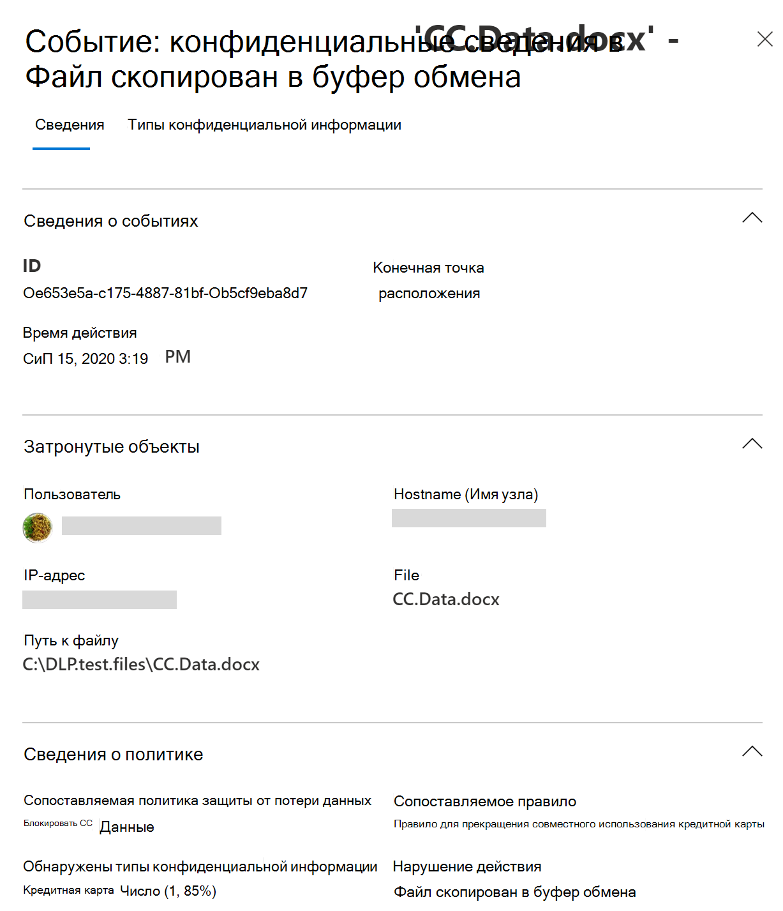

# Сведения о защите от потери данных в конечной точке Microsoft 365

Защиту от потери данных (DLP) в Microsoft 365 можно использовать для отслеживания действий, принятых в отношении элементов, которые были определены как конфиденциальные, и для защиты от непреднамеренного обмена этими элементами. Подробная информация приведена в статье [Обзор защиты от потери данных](data-loss-prevention-policies.md).

**Защита от потери данных в конечной точке (DLP в конечной точке)** расширяет возможности отслеживания действий и защиты от потери данных для конфиденциальных элементов на устройствах с Windows 10. После того как устройства будут подключены к решениям по обеспечению соответствия требованиям Microsoft 365, сведения о действиях пользователей с конфиденциальными элементами становятся видимыми в [обозревателе действий](data-classification-activity-explorer.md) и вы можете принудительно применять защитные действия к ним с помощью [политик защиты от потери данных](create-test-tune-dlp-policy.md).

## Действия в конечных точках, которые вы можете отслеживать и реагировать на них

Защита от потери данных в конечной точке от Майкрософт позволяет проверять и управлять следующими типами действий, выполняемыми пользователями в отношении конфиденциальных элементов на устройствах с Windows 10. К ним относятся:

|действие с элементом |проверяемое/ограниченное  |
|---------|---------|
|создано    | проверяемое      |
|переименовано    |  проверяемое       |
|скопировано на съемные носители или созданное на них     |     проверяемое и ограниченное|
|скопировано в общую сетевую папку, например \\my-server\fileshare   |     проверяемое и ограниченное    |
|напечатано |    проверяемое и ограниченное       |
|скопировано в облако с помощью Chromium Edge    |   проверяемое и ограниченное        |
|получен доступ посредством неразрешенных приложений и браузеров    |  проверяемое и ограниченное       |

## Чем отличается защита от потери данных в конечной точке

Перед началом глубокой работы с защитой от потери данных в конечной точке необходимо учитывать ряд дополнительных понятий.

### Включение управления мобильными устройствами

Управление устройствами — это функция, позволяющая осуществлять сбор данных телеметрии с устройств и преобразование их в решения для обеспечения соответствия требованиям Microsoft 365, такие как Защита от потери данных в конечной точке и [Управление рисками в рамках программы предварительной оценки](insider-risk-management.md). Вам потребуется подключить все устройства, которые вы хотите использовать в качестве расположений в политиках защиты от потери данных.

> [!div class="mx-imgBorder"]
> 

Подключение и отключение выполняется с помощью сценариев, скачанных из Центра управления устройствами. В центре есть настраиваемые сценарии для каждого из этих методов развертывания:

- локальный сценарий (до 10 компьютеров)
- Групповая политика
- System Center Configuration Manager (версия 1610 или более поздняя)
- Управление мобильными устройствами/Microsoft Intune
- Сценарии подключения в инфраструктуре виртуальных рабочих столов (VDI) для временных компьютеров

> [!div class="mx-imgBorder"]
> 

 Для подключения устройств используйте процедуры, описанные в статье [Начало работы с Защитой от потери данных в конечной точке в Microsoft 365](endpoint-dlp-getting-started.md).

Если вы подключили устройства с помощью [Microsoft Defender для конечной точки](https://docs.microsoft.com/windows/security/threat-protection/), эти устройства будут автоматически отображаться в списке устройств.

> [!div class="mx-imgBorder"]
> 

### Просмотр данных защиты от потери данных в конечной точке

 Защита от потери данных в конечной точке зависит от типа MIME, поэтому действия будут записываться даже при изменении расширения файла. В настоящее время поддерживаются следующие типы файлов:

- Файлы Word
- Файлы PowerPoint
- Файлы Excel
- PDF-файлы
- CSV-файлы
- ТSV-файлы
- TXT-файлы
- RTF-файлы
- С-файлы
- CLASS-файлы
- CPP-файлы
- CS-файлы
- H-файлы
- JAVA-файлы

> [!NOTE]
> Защита от потери данных в конечной точке оценивает файлы всех указанных выше типов на соответствие политике защиты от потери данных и применяет соответствующие защитные действия. Все файлы, соответствующие политике защиты от потери данных, подвергаются аудиту для всех поддерживаемых действий, даже если они не заблокированы. Кроме того, по умолчанию аудит выполняется для всех файлов Word, PowerPoint, Excel, PDF и CSV, независимо от наличия политики защиты от потери данных или ее соответствия этим файлам.

Вы можете просмотреть оповещения, связанные с политиками защиты от потери данных, примененными на устройствах конечных точек, перейдя на [панель мониторинга для управления оповещениями защиты от потери данных](dlp-configure-view-alerts-policies.md).

Вы также можете просматривать сведения о связанном событии с расширенными метаданными на той же панели мониторинга.

После подключения устройства сведения о действиях, прошедших аудит, передаются в обозреватель действий даже до настройки и развертывания любой политики защиты от потери данных с устройствами в качестве расположения.

> [!div class="mx-imgBorder"]
> 

Защита от потери данных в конечной точке собирает подробную информацию о действиях, прошедших аудит.

Например, если файл копируется на съемный USB-носитель, то в подробных сведениях о действиях будут отображаться указанные ниже атрибуты:

- тип действия
- IP-адрес клиента
- путь к целевому файлу
- временная метка события
- имя файла
- пользователь
- расширение файла
- размер файла
- типы конфиденциальной информации (если применимо)
- значение SHA1
- значение SHA256
- предыдущее имя файла
- расположение
- родитель
- путь к файлу
- тип исходного расположения
- платформа
- имя устройства
- тип конечного расположения
- приложение, которое выполнило копирование
- ИД устройства Microsoft Defender для конечной точки (если применимо)
- производитель съемного носителя
- модель съемного носителя
- серийный номер съемного носителя

> [!div class="mx-imgBorder"]
> 

## Дальнейшие действия

Теперь, когда вы узнали о защите от потери данных в конечной точке, ознакомьтесь со следующим:

1) [Начало работы с защитой от потери данных в конечной точке Майкрософт](endpoint-dlp-getting-started.md)
2) [Использование защиты от потери данных в конечной точке Майкрософт](endpoint-dlp-using.md)

## См. также

- [Начало работы с защитой от потери данных в конечной точке Майкрософт](endpoint-dlp-getting-started.md)
- [Использование защиты от потери данных в конечной точке Майкрософт](endpoint-dlp-using.md)
- [Общие сведения о защите от потери данных](data-loss-prevention-policies.md)
- [Создание, тестирование и настройка политики защиты от потери данных](create-test-tune-dlp-policy.md)
- [Начало работы с обозревателем действий](data-classification-activity-explorer.md)
- [Microsoft Defender для конечной точки](https://docs.microsoft.com/windows/security/threat-protection/)
- [Управление рисками в рамках программы предварительной оценки](insider-risk-management.md)
