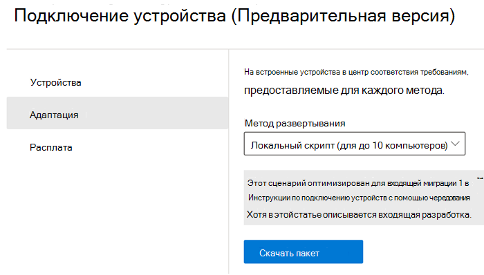
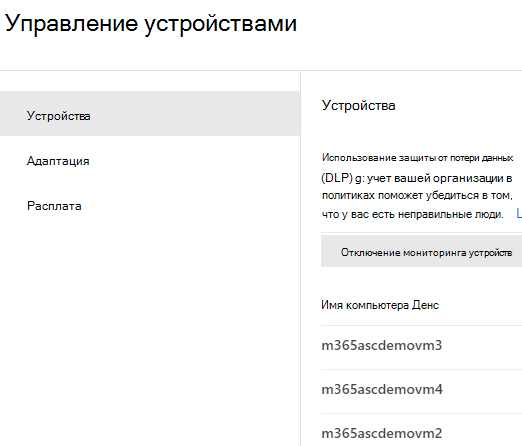
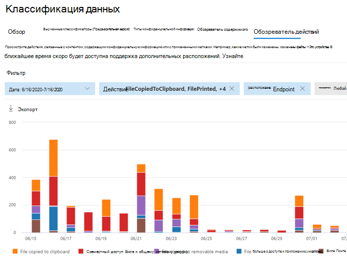
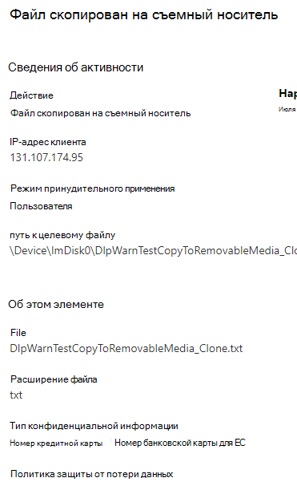

# Узнайте о защите от потери данных в конечной точке Microsoft 365 (предварительная версия)Learn about Microsoft 365 Endpoint data loss prevention (preview)

Защиту от потери данных (DLP) в Microsoft 365 можно использовать для отслеживания действий, принятых в отношении элементов, которые были определены как конфиденциальные, и для защиты от непреднамеренного обмена этими элементами.You can use Microsoft 365 data loss prevention (DLP) to monitor the actions that are being taken on items you've determined to be sensitive and to help prevent the unintentional sharing of those items. Подробная информация приведена в статье [Обзор защиты от потери данных](data-loss-prevention-policies.md).For more information on DLP, see [Overview of data loss prevention](data-loss-prevention-policies.md).

**Защита от потери данных в конечной точке (DLP в конечной точке)** расширяет возможности отслеживания действий и защиты от потери данных для конфиденциальных элементов на устройствах с Windows 10.**Endpoint data loss prevention** (Endpoint DLP) extends the activity monitoring and protection capabilities of DLP to sensitive items that are on Windows 10 devices. После того как устройства будут подключены к решениям по обеспечению соответствия требованиям Microsoft 365, сведения о действиях пользователей с конфиденциальными элементами становятся видимыми в [обозревателе действий](data-classification-activity-explorer.md) и вы можете принудительно применять защитные действия к ним с помощью [политик защиты от потери данных](create-test-tune-dlp-policy.md).Once devices are onboarded into the Microsoft 365 compliance solutions, the information about what users are doing with sensitive items is made visible in [activity explorer](data-classification-activity-explorer.md) and you can enforce protective actions on those items via [DLP policies](create-test-tune-dlp-policy.md).

## Действия в конечных точках, которые вы можете отслеживать и реагировать на нихEndpoint activities you can monitor and take action on

Защита от потери данных в конечной точке от Майкрософт позволяет проверять и управлять следующими типами действий, выполняемыми пользователями в отношении конфиденциальных элементов на устройствах с Windows 10.Microsoft Endpoint DLP enables you to audit and manage the following types of activities users take on sensitive items on devices running Windows 10. К ним относятся:This includes:

|действие с элементомactivity on item |проверяемое/ограниченноеauditable/restrictable  |
|---------|---------|
|созданоcreated    | проверяемоеauditable      |
|переименованоrenamed    |  проверяемоеauditable       |
|скопировано на съемные носители или созданное на нихcopied to or created on removable media     |     проверяемое и ограниченноеauditable and restrictable|
|скопировано в общую сетевую папку, например \\my-server\filesharecopied to network share, e.g. \\my-server\fileshare   |     проверяемое и ограниченноеauditable and restrictable    |
|напечатаноprinted |    проверяемое и ограниченноеauditable and restrictable       |
|скопировано в облако с помощью Chromium Edgecopied to cloud via Chromium Edge    |   проверяемое и ограниченноеauditable and restrictable        |
|получен доступ посредством неразрешенных приложений и браузеровaccessed by unallowed apps and browsers    |  проверяемое и ограниченноеauditable and restrictable       |

## Чем отличается защита от потери данных в конечной точкеWhat's different in Endpoint DLP

Перед началом глубокой работы с защитой от потери данных в конечной точке необходимо учитывать ряд дополнительных понятий.There are a few extra concepts that you need to be aware of before you dig into Endpoint DLP.

### Включение управления мобильными устройствамиEnabling Device management

Управление устройствами — это функция, позволяющая осуществлять сбор данных телеметрии с устройств и преобразование их в решения для обеспечения соответствия требованиям Microsoft 365, такие как Защита от потери данных в конечной точке и [Управление рисками в рамках программы предварительной оценки](insider-risk-management.md).Device management is the functionality that enables the collection of telemetry from devices and brings it into Microsoft 365 compliance solutions like Endpoint DLP and [Insider Risk management](insider-risk-management.md). Вам потребуется подключить все устройства, которые вы хотите использовать в качестве расположений в политиках защиты от потери данных.You'll need to onboard all devices you want to use as locations in DLP policies.

Подключение и отключение выполняется с помощью сценариев, скачанных из Центра управления устройствами.Onboarding and offboarding are handled via scripts you download from the Device management center. В центре есть настраиваемые сценарии для каждого из этих методов развертывания:The center has custom scripts for each of these deployment methods:

- локальный сценарий (до 10 компьютеров)local script (up to 10 machines)
- Групповая политикаGroup policy
- System Center Configuration Manager (версия 1610 или более поздняя)System Center Configuration Manager (version 1610 or later)
- Управление мобильными устройствами/Microsoft IntuneMobile Device Management/Microsoft Intune
- Сценарии подключения в инфраструктуре виртуальных рабочих столов (VDI) для временных компьютеровVDI onboarding scripts for non-persistent machines

 Для подключения устройств используйте процедуры, описанные в статье [Начало работы с Защитой от потери данных в конечной точке в Microsoft 365](endpoint-dlp-getting-started.md).Use the procedures in [Getting started with Microsoft 365 Endpoint DLP](endpoint-dlp-getting-started.md) to onboard devices.

При наличии подключенных устройств с помощью [службы Advanced Threat Protection (ATP в Microsoft Defender)](https://docs.microsoft.com/windows/security/threat-protection/) эти устройства будут автоматически отображаться в списке устройств.If you have onboarded devices through [Microsoft Defender Advanced Threat Protection (Microsoft Defender ATP)](https://docs.microsoft.com/windows/security/threat-protection/), those devices will automatically show up in the list of devices.

### Просмотр данных защиты от потери данных в конечной точкеViewing Endpoint DLP data

 Защита от потери данных в конечной точке зависит от типа MIME, поэтому действия будут записываться даже при изменении расширения файла.Endpoint DLP monitors activity based om MIME type, so activities will be captured even if the file extension is changed. В общедоступном предварительном просмотре просматривается все:At public preview it watches all:

- Файлы WordWord files
- Файлы PowerPointPowerPoint files
- Файлы ExcelExcel files
- PDF-файлыPDF files
- CSV-файлы.csv files
- ТSV-файлы.tsv files
- С-файлыc files
- Файлы классовclass files
- CPP-файлыcpp files
- CS-файлыcs files
- H-файлыh files
- Файлы Javajava files

> [!NOTE]
> Файлы. txt и исходного кода не подлежат аудиту по умолчанию, а система защиты от потери данных оценивает их согласно применяемым политикам, после чего выполняет аудит или блокировку действий пользователя, соответственно..txt and source code files are not audited by default, DLP evaluates them against the applied policies and then user actions are audited or blocked accordingly.

После подключения устройства сведения о действиях, прошедших аудит, передаются в обозреватель действий даже до настройки и развертывания любой политики защиты от потери данных с устройствами в качестве расположения.Once a device is onboarded, information about audited activities flows into Activity explorer even before you configure and deploy any DLP policies that have devices as a location.

Защита от потери данных в конечной точке собирает подробную информацию о действиях, прошедших аудит.Endpoint DLP collects extensive information on audited activity.

Например, если файл копируется на съемный USB-носитель, то в подробных сведениях о действиях будут отображаться указанные ниже атрибуты:For example, if a file is copied to removable USB media, you'd see these attributes in the activity details:

- тип действияactivity type
- IP-адрес клиентаclient IP
- путь к целевому файлуtarget file path
- временная метка событияhappened timestamp
- имя файлаfile name
- пользовательuser
- расширение файлаfile extension
- размер файлаfile size
- типы конфиденциальной информации (если применимо)sensitive information type (if applicable)
- значение SHA1sha1 value
- значение SHA256sha256 value
- предыдущее имя файлаprevious file name
- расположениеlocation
- родительparent
- путь к файлуfilepath
- тип исходного расположенияsource location type
- платформаplatform
- имя устройстваdevice name
- тип конечного расположенияdestination location type
- приложение, которое выполнило копированиеapplication that performed the copy
- ИД устройства Microsoft Defender для конечной точки (если применимо)Microsoft Defender for Endpoint device ID (if applicable)
- производитель съемного носителяremovable media device manufacturer
- модель съемного носителяremovable media device model
- серийный номер съемного носителяremovable media device serial number

## Дальнейшие действияNext steps

Теперь, когда вы узнали о защите от потери данных в конечной точке, ознакомьтесь со следующим:Now that you've learned about Endpoint DLP, your next steps are:

1) [Начало работы с защитой от потери данных в конечной точке от Майкрософт (предварительная версия)Getting started with Microsoft Endpoint data loss prevention (preview)](endpoint-dlp-getting-started.md)
2) [Использование защиты от потери данных в конечной точке от Майкрософт (предварительная версия)Using Microsoft Endpoint data loss prevention (preview)](endpoint-dlp-using.md)

## См. такжеSee also

- [Начало работы с защитой от потери данных в конечной точке от Майкрософт (предварительная версия)Getting started with Microsoft Endpoint data loss prevention (preview)](endpoint-dlp-getting-started.md)
- [Использование защиты от потери данных в конечной точке от Майкрософт (предварительная версия)Using Microsoft Endpoint data loss prevention (preview)](endpoint-dlp-using.md)
- [Общие сведения о защите от потери данныхOverview of data loss prevention](data-loss-prevention-policies.md)
- [Создание, тестирование и настройка политики защиты от потери данныхCreate, test, and tune a DLP policy](create-test-tune-dlp-policy.md)
- [Начало работы с обозревателем действийGet started with Activity explorer](data-classification-activity-explorer.md)
- [Microsoft Defender Advanced Threat Protection (ATP в Microsoft Defender)Microsoft Defender Advanced Threat Protection (Microsoft Defender ATP)](https://docs.microsoft.com/windows/security/threat-protection/)
- [Управление рисками в рамках программы предварительной оценкиInsider Risk management](insider-risk-management.md)