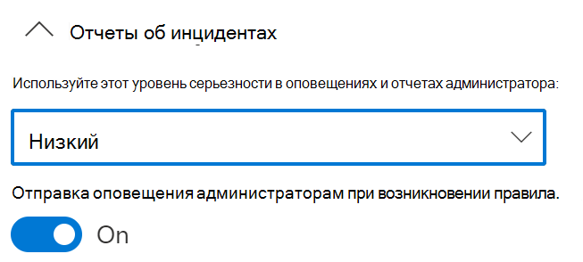
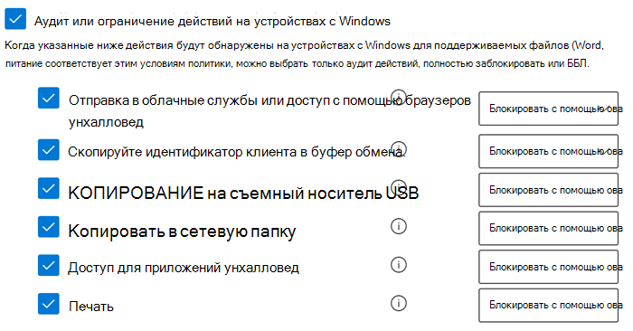
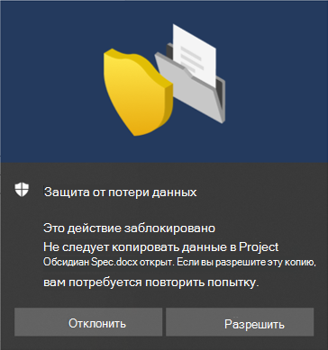

# Использование защиты от потери данных в конечной точке

В этой статье описаны три сценария создания и изменения политики защиты от потери данных, которая использует устройства как расположение.

## Параметры защиты от потери данных

Прежде чем приступить к работе, настройте параметры защиты от потери данных для всех соответствующих политик устройств. Это необходимо сделать, если вы планируете создавать политики, которые предполагают:

- ограничения для выхода в облако
- ограничения для запрещенных приложений

или

- Если вы хотите исключить пути к шумным файлам

  > [!div class="mx-imgBorder"]
  > 

### Исключения путей к файлам

При необходимости вы можете исключить пути к некоторым файлам из мониторинга, оповещений и политик защиты от потери данных на своих устройствах, так как они слишком шумные или не содержат нужных файлов. Файлы, расположенные в этих местах, не будут подвергаться аудиту, а файлы, созданные или измененные в них, не будут проверяться политикой защиты от потери данных. Исключения путей можно настраивать в параметрах защиты от потери данных.

Для создания путей исключения можно использовать эту логику:

- Допустимый путь к файлу, заканчивающийся на "\", обозначает файлы, находящиеся в папке.  Например: C:\Temp\

- Допустимый путь к файлу, заканчивающийся на "\*", обозначает файлы, находящиеся во вложенных папках.  Например: C:\Temp\*

- Допустимый путь к файлу, который не заканчивается на "\" или "\*", обозначает все файлы в папке и во вложенных папках.  Например: C:\Temp

- Путь с подстановочными знаками между "\".  Например: C:\Users\*\Рабочий стол\

- Путь с подстановочными знаками между "\" с обеих сторон и "(число)" для предоставления точного числа вложенных папок.  Например: C:\Users\*(1) \Downloads\

- Путь с переменными СИСТЕМНОЙ среды.  Например:%SystemDrive%\Test\*

- Комбинация всех вышеуказанных элементов.  Например: %SystemDrive%\Users\*\Documents\*(2) \Sub\

### Запрещенные приложения

Если параметр **Доступ к неразрешенным приложениям и браузерам** включен, а пользователи попытаются получить доступ к защищенному файлу с помощью этих приложений, действие может быть разрешено, заблокировано полностью или с возможностью переопределить это ограничение. Все действия будут подвержены аудиту и доступны для просмотра в обозревателе действий.

> [!IMPORTANT]
> Путь к исполняемому файлу указывать не нужно, следует только задать имя исполняемого файла (например, browser.exe).

### Неразрешенные приложения Bluetooth

Запретите пользователям перенос файлов, защищенных вашими политиками, с помощью определенных приложений Bluetooth.

### Ограничения браузера и домена
Запретите отправку конфиденциальных файлов, соответствующих вашим политикам, в домены служб, для которых отсутствуют ограничения.

#### Домены служб

Вы можете управлять возможностью отправки конфиденциальных файлов, защищенных вашими политиками, в определенные домены служб из Microsoft Edge.

Если для режима списка задано значение **Блокировать**, пользователь не сможет отправлять конфиденциальные данные в эти домены. Если действие отправки заблокировано, потому что элемент подпадает под политику защиты от потери данных, то при этом создается предупреждение или блокируется отправка конфиденциального элемента.

Если для режима списка задан параметр **Разрешить**, пользователи смогут отправлять конфиденциальные данные **_только_** в эти домены, но доступ к отправке в другие домены будет запрещен.

> [!IMPORTANT]
> Если для режима ограничения службы установлено "Разрешить", перед применением ограничений необходимо настроить хотя бы один домен службы.

#### Запрещенные браузеры

Вы можете добавить браузеры, которые определяются по именам исполняемых файлов и которым будет заблокирован доступ к файлам, соответствующим условиям принудительного применения политики защиты от потери данных. В таком случае загрузка данных в облачные сервисы блокируется полностью или с возможностью переопределения. Если доступ к файлу заблокирован в этих браузерах, пользователи увидят всплывающее уведомление о том, что им нужно открыть файл через Microsoft Edge Chromium.

### Деловое обоснование в Подсказках политики

Вы можете управлять тем, как пользователи взаимодействуют с параметром делового обоснования в уведомлениях подсказки политики защиты от потери данных. Он отображается, когда пользователи выполняют действия, защищенные параметром **Блокировать с возможностью переопределения** в политике защиты от потери данных. Вы можете выбрать один из вариантов:

- По умолчанию пользователи могут выбирать встроенное обоснование или вводить собственный текст.
- Пользователи могут выбрать только встроенное обоснование.
- Пользователи могут вводить только собственное обоснование.

### Всегда контролировать действия с файлами для устройств

По умолчанию при подключении устройств, действия для файлов Office, PDF и CSV автоматически проверяются и доступны для просмотра в обозревателе действий. Отключите эту функцию, если вы хотите, чтобы эти действия проверялись только в том случае, если в активную политику включены подключенные устройства.

Действия с файлами для подключенных устройств всегда будут контролироваться, независимо от того, включены ли они в активную политику.

## Установка привязки параметров защиты от потери данных

Благодаря защите от потери данных в конечной точке и браузеру Edge Chromium можно ограничить случайный общий доступ к конфиденциальным элементам для неразрешенных облачных приложений и служб. Edge Chromium понимает, что элемент ограничен политикой защиты от потери данных и применяет ограничения доступа.

Когда вы используете защиту от потери данных в конечной точке в правильно настроенной политике и браузере Edge Chromium, неразрешенные браузеры, определенные в этих параметрах, не смогут получить доступ к конфиденциальным элементам, соответствующим вашей политике защиты от потери данных. Вместо этого пользователи будут перенаправляться в Edge Chromium, а он благодаря ограничениям защиты от потери данных может заблокировать или ограничить действия, если они подпадают под данные ограничения.

Чтобы использовать это ограничение, нужно настроить три важных параметра:

1. Укажите места расположения (сервисы, домены, IP-адреса), которым вы хотите запретить доступ к конфиденциальным элементам.

2. Добавьте браузеры, которым не разрешено получать доступ к определенным конфиденциальным элементам при совпадении с политикой защиты от потери данных.

3. Настройте политики защиты от потери данных, чтобы определить типы конфиденциальных элементов, которые нельзя загружать, включив параметры **Загрузка в облачные службы** и **Доступ из запрещенного браузера**.

Вы можете продолжить добавление новых служб, приложений и политик, расширив свои ограничения, чтобы они соответствовали вашим потребностям и защищали конфиденциальные данные. 

Эта конфигурация обеспечит надежную защиту данных, а также поможет избежать ненужных ограничений, которые не позволяют пользователям получать доступ к общедоступным элементам.

## Сценарии политики защиты от потери данных в конечной точке

Чтобы помочь вам ознакомиться с функциями защиты от потери данных и их возможностями, мы составили для вас несколько сценариев.

> [!IMPORTANT]
> Эти сценарии защиты от потери данных — не официальные процедуры для создания и настройки политик защиты. Если вам нужно использовать политики защиты от потери данных в общих ситуациях, прочитайте эти статьи:

>- [Сведения о защите от потери данных](dlp-learn-about-dlp.md)
>- [Начало работы со стандартной политикой защиты от потери данных](get-started-with-the-default-dlp-policy.md)
>- [Создание политики защиты от потери данных на основе шаблона](create-a-dlp-policy-from-a-template.md)
>- [Создание, тестирование и настройка политики защиты от потери данных](create-test-tune-dlp-policy.md)

### Сценарий 1. Создание политики на основе шаблона, только аудит

Для использования этого сценария необходимо, чтобы ваши устройства были подключены и доступны в обозревателе действий. Если вы еще не настроили устройства, прочитайте статью [Начало работы с функцией защиты от потери данных](endpoint-dlp-getting-started.md).

1. Откройте страницу [Защита от потери данных](https://compliance.microsoft.com/datalossprevention?viewid=policies).

2. Выберите **Создать политику**.

3. Для этого сценария выберите **Конфиденциальность**, потом — **Личные сведения, США** и нажмите **Далее**.

4. Переключите поле **Статус** в режим "Выкл." для всех расположений кроме **Устройства**. Нажмите кнопку **Далее**.

5. Примите значение по умолчанию **Проверка и настройка параметров из шаблона** и нажмите **Далее**.

6. Примите значение по умолчанию **Защита** и выберите **Далее**.

7. Выберите **Аудит или ограничение действий на устройствах Windows**, а затем выберите набор действий **Только аудит**. Нажмите кнопку **Далее**.

8. Примите значение по умолчанию **Я хочу сначала протестировать** и выберите **Показывать подсказки политики в режиме тестирования**. Нажмите кнопку **Далее**.

9. Проверьте параметры и выберите **Отправить**.

10. Новая политика защиты от потери данных появится в списке политик.

11. Проверьте, есть ли в обозревателе активности данные из наблюдаемых конечных точек. Настройте фильтр расположения устройств, добавьте политику, а затем выполните фильтрацию по имени политики, чтобы увидеть, как она работает. С дополнительными сведениями можно ознакомиться здесь [Начало работы с обозревателем действий](data-classification-activity-explorer.md).

12. Попробуйте отправить тестовый файл, содержащий личные сведения, человеку, не входящему в вашу организацию. Это активирует политику.

13. Проверьте, отображается ли действие в обозревателе.

### Сценарий 2. Изменение существующей политики, настройка оповещения

1. Откройте страницу [Защита от потери данных](https://compliance.microsoft.com/datalossprevention?viewid=policies).

2. Выберите политику **Личные сведения, США**, созданную в сценарии 1.

3. Нажмите кнопку **Изменить политику**.

4. Перейдите на страницу **Расширенные правила защиты от потери данных** и измените пункт **Обнаружен небольшой объем личных данных, США**.

5. Прокрутите страницу вниз до раздела **Отчеты об инцидентах** и переключите параметр **Отправлять оповещения администраторам при возникновении соответствия правилам** на значение **Вкл.**. Сообщения электронной почты автоматически отправляются администратору и другим пользователям, которых вы добавите в список получателей. 

   > [!div class="mx-imgBorder"]
   > 
   
6. В этом случае выберите **Отправлять оповещения каждый раз, когда действие будет соответствовать правилу**.

7. Выберите **Сохранить**.

8. Сохраните все прежние параметры, выбрав **Далее**, а затем **Отправить**.

9. Попробуйте отправить тестовый файл, содержащий личные сведения, человеку, не входящему в вашу организацию. Это активирует политику.

10. Проверьте, отображается ли действие в обозревателе.

### Сценарий 3. Изменение существующей политики, блокировка действия, разрешающая переопределение

1. Откройте страницу [Защита от потери данных](https://compliance.microsoft.com/datalossprevention?viewid=policies).

2. Выберите политику **Личные сведения, США**, созданную в сценарии 1.

3. Нажмите кнопку **Изменить политику**.

4. Перейдите на страницу **Расширенные правила защиты от потери данных** и измените пункт **Обнаружен небольшой объем личных данных, США**.

5. Прокрутите страницу вниз до раздела **Аудит или ограничение действий на устройстве Windows** и для каждого действия задайте соответствующую команду **Блокировать с возможностью переопределения**.

   > [!div class="mx-imgBorder"]
   > 
   
6. Выберите **Сохранить**.

7. Повторите действия 4–7 для параметра **Большой объем личных данных для США**.

8. Сохраните все прежние параметры, выбрав **Далее**, а затем **Отправить**.

9. Попробуйте отправить тестовый файл, содержащий личные сведения, человеку, не входящему в вашу организацию. Это активирует политику.

   Вы увидите такое всплывающее окно на устройстве клиента:

   > [!div class="mx-imgBorder"]
   > 

10. Проверьте, отображается ли действие в обозревателе.

## См. также

- [Сведения о защите от потери данных в конечной точке](endpoint-dlp-learn-about.md)
- [Начало работы с функцией защиты от потери данных в конечной точке](endpoint-dlp-getting-started.md)
- [Сведения о защите от потери данных](dlp-learn-about-dlp.md)
- [Создание, тестирование и настройка политики защиты от потери данных](create-test-tune-dlp-policy.md)
- [Начало работы с обозревателем действий](data-classification-activity-explorer.md)
- [Microsoft Defender для конечной точки](/windows/security/threat-protection/)
- [Средства и методы подключения для компьютеров с Windows 10](/microsoft-365/compliance/dlp-configure-endpoints)
- [Подписка на Microsoft 365](https://www.microsoft.com/microsoft-365/compare-microsoft-365-enterprise-plans?rtc=1)
- [Подключено к Azure Active Directory (AAD)](/azure/active-directory/devices/concept-azure-ad-join)
- [Загрузка нового браузера Microsoft Edge на основе Chromium](https://support.microsoft.com/help/4501095/download-the-new-microsoft-edge-based-on-chromium)
- [Начало работы со стандартной политикой защиты от потери данных](get-started-with-the-default-dlp-policy.md)
- [Создание политики защиты от потери данных на основе шаблона](create-a-dlp-policy-from-a-template.md)
