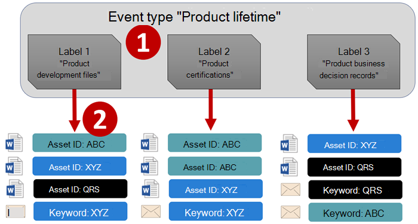
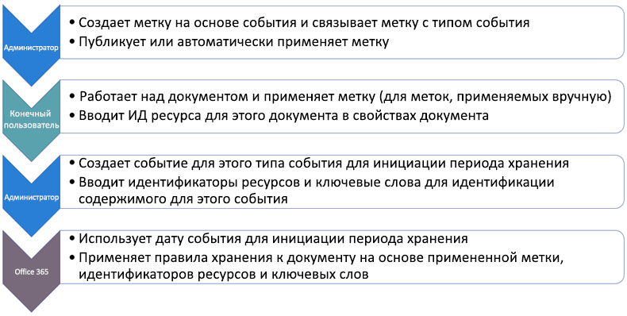
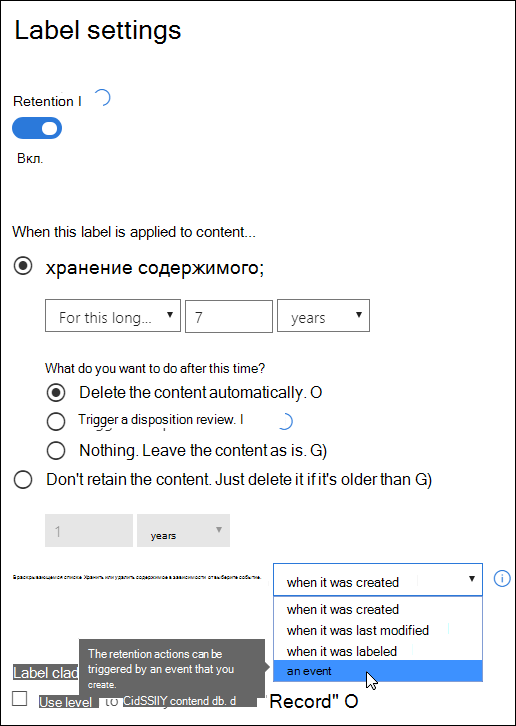
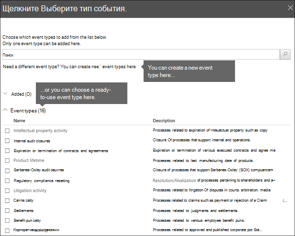
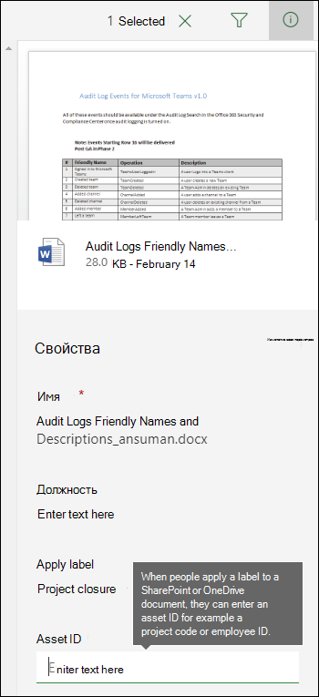
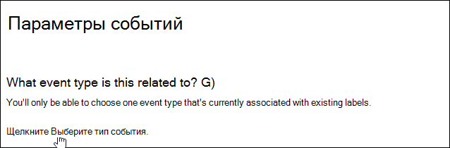
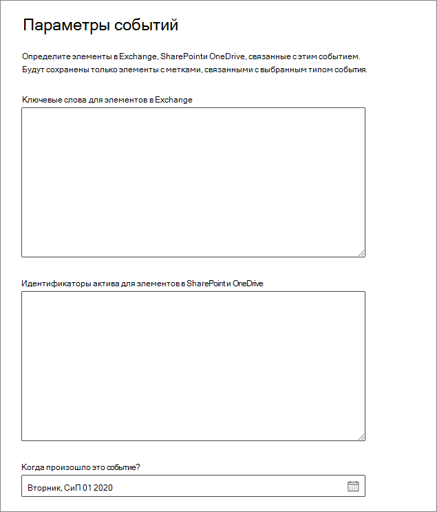

# <a name="start-retention-when-an-event-occurs"></a>Общие сведения о хранении, зависящем от возникновения события

>*[Руководство по лицензированию Microsoft 365 для обеспечения безопасности и соответствия требованиям](https://aka.ms/ComplianceSD).*

Срок хранения контента часто определяется его возрастом. Например, вы можете хранить документы в течение семи лет после их создания, а затем удалять их. Однако, настроив [метки хранения](labels.md), вы также можете задать период хранения исходя из того, когда происходит событие определенного типа. Событие становится началом периода хранения, а ко всему контенту с меткой, относящейся к этому типу события, применяются предусмотренные ею действия.
  
Примеры использования хранения на основе событий.
  
- **Сотрудники, покидающие организацию**. Предположим, что записи сотрудников нужно хранить в течение 10 лет с того момента, когда они покинули организацию. По истечении 10 лет все документы, связанные с наймом, результатами работы и увольнением сотрудника необходимо ликвидировать. Событием, которое активирует 10-летний период хранения, является уход сотрудника из организации. 
    
- **Окончание срока действия договора**. Предположим, что все записи, связанные с договорами, нужно хранить в течение пяти лет с момента окончания срока действия договора. Событием, активирующим пятилетний период хранения, будет окончание срока действия договора. 
    
- **Время существования продукта.** У вашей организации могут быть требования к хранению, связанные с датой последнего выпуска продуктов, в отношении такого контента, как технические спецификации. В таком случае последний выпуск — это событие, активирующее начало периода хранения. 
    
Хранение, зависящее от возникновения события, обычно используется в процессе управления записями. Это означает следующее:
  
- Метки на основе события также обычно определяют контент как запись. Дополнительную информацию см. в статье [Сведения о записях](records.md).

- Документ, который был обозначен как запись, но для которого активирующее событие еще не наступило, хранится в течение неограниченного времени (окончательно удалить записи невозможно), пока некоторое событие не активирует период его хранения.
    
- Метки хранения на основе события в конце периода хранения обычно активируют проверку перед ликвидацией, что позволяет лицу, ответственному за управление записями, вручную просмотреть и ликвидировать контент. Дополнительные сведения см. в статье [Ликвидация контента](disposition.md).
    

Метки на основе событий обладают теми же возможностями, что и другие метки хранения в Microsoft 365. Дополнительные сведения см. в статье [Сведения о политиках и метках хранения](retention.md).

## <a name="understanding-the-relationship-between-event-types-labels-events-and-asset-ids"></a>Взаимосвязь между типами событий, метками, событиями и идентификаторами ресурсов

Чтобы успешно использовать управляемое событиями хранение, важно понимать взаимосвязь между типами событий, метками хранения, событиями и идентификаторами активов, как показано на диаграммах и в следующем пояснении: 
  

  

  
1. Вы создаете метки хранения для разных типов контента, а затем связываете их с типом события. Например, метки хранения для различных типов файлов и записей продукта связаны с типом события с именем Product Lifetime, поскольку эти записи должны храниться в течение 10 лет с момента окончания срока действия продукта.
    
2. Пользователи (обычно менеджеры записей) применяют эти метки хранения к контенту и (для документов SharePoint и OneDrive) вводят идентификатор ресурса для каждого элемента. В этом примере идентификатор актива - это название продукта или код, используемый организацией. Таким образом, каждой записи продукта присваивается метка хранения, и каждая запись имеет свойство, которое содержит идентификатор актива. Диаграмма представляет **весь контент** для всех записей продукта в организации, и каждый элемент имеет идентификатор актива продукта, чья запись это. 
    
3. "Время существования продукта" — это тип события, которое наступает при завершении существования продукта. Когда возникает такого рода события, т. е. когда время существования продукта заканчивается, создается событие, для которого указывается следующее:
    
   - Идентификатор ресурса (для документов SharePoint и OneDrive).
    
   - Ключевые слова (для элементов Exchange). В этом примере организация использует код продукта в сообщениях, содержащих записи продукта, поэтому ключевое слово для элементов Exchange совпадает с идентификатором ресурса для документов SharePoint и OneDrive.
    
   - Дата возникновения события. С этой даты начинается период хранения, она может быть текущей, прошедшей или будущей.

4. После создания события эта дата события синхронизируется со всем контентом, который имеет метку хранения этого типа и которая содержит указанный идентификатор актива или ключевое слово. Как и в случае любой другой метки хранения, эта синхронизация может занять до 7 дней. На предыдущей схеме все элементы, обведенные красным, имеют период хранения, активированный этим событием. Другими словами, когда срок действия этого продукта истекает, это событие запускает период хранения для записей этого продукта.

Важно понимать, что если вы не укажете идентификатор ресурса или ключевые слова для события, у **всего содержимого**, которому присвоена метка события такого типа, будет период хранения, определяемый событием. Это означает, что на предыдущей диаграмме все содержимое начало бы сохраняться. Это может быть не то, что вы намерены. 

Наконец, помните, что каждая метка хранения имеет свои собственные настройки хранения. В этом примере все они указывают 10 лет, но для события возможно инициировать метки хранения, где каждая метка имеет свой период хранения.
  
## <a name="how-to-set-up-event-driven-retention"></a>Настройка хранения, зависящего от возникновения события

Рабочий процесс высокого уровня для удержания на основе событий:
  

  
> [!TIP]
> Подробный сценарий использования управляемых свойств в SharePoint для автоматического применения меток хранения и реализации хранения, зависящего от возникновения события, см. в статье [Управление жизненным циклом документов SharePoint с метками хранения](auto-apply-retention-labels-scenario.md).

### <a name="step-1-create-a-label-whose-retention-period-is-based-on-an-event"></a>Шаг 1. Создайте метку, период хранения которой зависит от возникновения события

Чтобы создать и настроить метку хранения, следуйте инструкциям, приведенным в статье [Создание и настройка меток хранения](create-retention-labels.md#create-and-configure-retention-labels), а при включении хранения выберите вариант действия с контентом исходя из события — сохранение или удаление. Этот параметр означает, что параметры хранения вступят в силу только после создания вами на шаге 5 события на странице **События**. 
  
Хранение на основе событий обычно используется для контента, обозначенного как запись, поэтому рекомендуется также проверить, не нужно ли выбрать параметр, помечающий контент как запись.
  
Для хранения на основе событий требуются настройки хранения, согласно которым будет выполняться следующее:
  
- хранение содержимого;
    
- автоматическое удаление содержимого или активация проверки перед ликвидацией в конце периода хранения.
    


### <a name="step-2-choose-an-event-type-for-that-label"></a>Шаг 2. Выберите тип события для такой метки

После того как вы выберете для метки параметр, позволяющий связать ее с **событием**, вы увидите команду **Выбрать тип события**. Тип события — это просто общее описание события, которое нужно связать с меткой.
  
Например, если вы создадите тип события с именем Product Lifetime, вы создадите метки хранения на основе событий с именами, которые описывают, к каким типам контента вы хотите применить метки, например «Файлы разработки продукта» или «Бизнес продукта». записи решений ".

Выберите один из встроенных типов событий или создайте собственный тип и выберите его.

После выбора типа события и создания метки хранения тип события не изменить нельзя.
  

  
### <a name="step-3-publish-or-auto-apply-the-event-based-retention-labels"></a>Шаг 3. Публикация или автоматическое применение меток хранения на основе событий

Метку хранения на основе события, как и любую другую метку хранения, необходимо автоматически применить к событию или опубликовать, чтобы ее можно было вручную или автоматически применять.
- [Создание меток хранения и их применение в приложениях](create-apply-retention-labels.md)
- [Автоматическое применение метки хранения к контенту](apply-retention-labels-automatically.md)


> [!NOTE]
> Если выбрать метку хранения на основе событий на вкладке **Управление записями** > **План хранения** или **Управление данными** > **Метки**, то кнопка **Автоматически применить метку** будет недоступна.
> 
> Вместо этой кнопки используйте параметр **Автоматически применить метку**, расположенный над списком меток или политик в одном из следующих расположений:
> - **Управление записями** >  вкладка **Политики меток**
> - **Управление информацией** >  вкладка **Метки** или вкладка **Политики меток**


### <a name="step-4-enter-an-asset-id"></a>Шаг 4. Введите идентификатор ресурса

После применения метки на основе событий к содержимому можно ввести ИД ресурса для каждого элемента. Например, в вашей организации могут использоваться:
  
- коды продуктов для хранения содержимого, касающегося только определенного продукта;
    
- коды проектов для хранения содержимого, касающегося только определенного проекта;
    
- идентификаторы сотрудников для хранения содержимого, касающегося только конкретного лица.
    
Идентификатор ресурса — это еще одно свойство документа, доступное в SharePoint и OneDrive. Ваша организация может уже использовать другие свойства и идентификаторы документов для классификации содержимого. В этом случае также можно использовать эти свойства и значения при создании события — см. следующий шаг 6. Важно использовать какое-либо сочетание*свойство:значение* в свойствах документа, чтобы сопоставить элемент с каким-либо типом событий.
  

  
### <a name="step-5-create-an-event"></a>Шаг 5. Создайте событие

Когда возникнет конкретное событие такого типа (например, когда завершится срок службы продукта), перейдите на страницу **Управление записями** > **События** в Центре соответствия требованиям Microsoft 365 и создайте событие. Можно инициировать событие, создав его.
  
### <a name="step-6-choose-the-same-event-type-used-by-the-label-in-step-2"></a>Шаг 6. Выберите тип события, который использовался для метки из описания шага 2

Когда вы создаете событие, выберите тот же тип события, который используется меткой хранения на шаге 2, например "Время существования продукта". Период хранения будет инициирован только для контента с метками хранения, примененными к нему с таким типом события.
  

  
### <a name="step-7-enter-keywords-or-an-asset-id"></a>Шаг 7. Введите ключевые слова или идентификатор ресурса

Теперь можно ограничить область содержимого, указав идентификаторы ресурсов для содержимого SharePoint и OneDrive или ключевые слова для содержимого Exchange. Для идентификаторов ресурсов хранение будет применяться только к содержимому, для которого указана пара *свойство:значение*. Если идентификатор ресурса не указан, ко всему содержимому с метками для такого типа событий будет применена одна и та же дата хранения.

Например, если используется свойство "ИД ресурса", введите `ComplianceAssetID:<value>` в поле идентификаторов ресурсов, показанное ниже.
  
Возможно, к документам, связанным с этим типом события, в вашей организации применяются другие идентификаторы и свойства. Например, если вам нужно найти записи, относящиеся к конкретному продукту, вы можете использовать в качестве идентификатора сочетание настраиваемого свойства ProductID и значения XYZ. В этом случае следует ввести `ProductID:XYZ` в поле идентификаторов ресурсов, показанное на следующем рисунке.
  
Для элементов Exchange нужно использовать ключевые слова. Можно использовать запрос с логическими операторами поиска, такими как "И", "ИЛИ" или "НЕ". Дополнительные сведения см. в статье [Запросы по ключевым словам и условия для поиска содержимого](keyword-queries-and-search-conditions.md).
  
Наконец, выберите дату, когда произошло событие; эта дата используется как начало срока хранения. После создания события эта дата события синхронизируется со всем содержимым с меткой хранения этого типа события, идентификатором ресурса и ключевыми словами. Такая синхронизация, как и для любых других меток хранения, может занять до 7 дней.
  


После создания события параметры хранения вступят в силу для контента, который уже снабжен метками и индексирован. Если метка хранения добавляется к новому контенту после создания события, необходимо создать другое событие с теми же данными.

Удаление события не отменяет параметры хранения, которые вступили в действие в отношении контента, который уже снабжен меткой. Чтобы сделать это, создайте событие с теми же данными, но оставьте поле даты пустым. 

## <a name="use-content-search-to-find-all-content-with-a-specific-label-or-asset-id"></a>Использование средства "Поиск контента" для поиска всего контента с определенной меткой или определенным идентификатором ресурса

После назначения меток хранения контенту можно использовать поиск контента, чтобы найти весь контент, обозначенный определенной меткой хранения или содержащий определенный идентификатор ресурса.
  
- Чтобы найти весь контент с определенной меткой хранения, выберите условие **Метка хранения**, а затем введите полное имя метки или его часть с использованием подстановочного знака. 
    
- Чтобы найти весь контент с определенным идентификатором ресурса, введите свойство **ComplianceAssetID** и значение, используя формат `ComplianceAssetID:<value>`. 
    
Дополнительные сведения см. в статье [Запросы по ключевым словам и условия для средства "Поиск контента"](keyword-queries-and-search-conditions.md).
  
## <a name="permissions"></a>Разрешения

Чтобы получить доступ к странице **События**, проверяющие должны быть членами группы ролей, включающей роли **Управление ликвидацией** и **Журналы аудита только для просмотра**. Рекомендуем создать новую группу ролей под названием "Проверяющие ликвидацию" и добавить в нее сначала эти две роли, а затем членов. 
  
Дополнительные сведения см. в статье [Предоставление пользователям доступа к Центру безопасности и соответствия требованиям Office 365](../security/office-365-security/grant-access-to-the-security-and-compliance-center.md).
  
## <a name="automate-events-by-using-powershell"></a>Автоматизация событий с помощью PowerShell

Для автоматизации хранения на основе событий в бизнес-приложениях можно использовать сценарий PowerShell. Командлеты PowerShell, доступные для хранения на основе событий:
  
- [Get-ComplianceRetentionEventType](https://go.microsoft.com/fwlink/?linkid=873002)
    
- [New-ComplianceRetentionEventType](https://go.microsoft.com/fwlink/?linkid=873004)
    
- [Remove-ComplianceRetentionEventType](https://go.microsoft.com/fwlink/?linkid=873005)
    
- [Set-ComplianceRetentionEventType](https://go.microsoft.com/fwlink/?linkid=873006)
    
- [Get-ComplianceRetentionEvent](https://go.microsoft.com/fwlink/?linkid=873001)
    
- [New-ComplianceRetentionEvent](https://go.microsoft.com/fwlink/?linkid=873003)
    

## <a name="automate-events-by-using-a-rest-api"></a>Автоматизация событий с помощью REST API

Можно использовать REST API для автоматического создания событий, инициирующих начало срока хранения.

REST API — это конечная точка службы, поддерживающая наборы операций HTTP (методы), которые обеспечивают создание, получение, обновление и удаление доступа к ресурсам службы. Дополнительные сведения см. в статье [Компоненты запросов и откликов REST API](https://docs.microsoft.com/rest/api/gettingstarted/#components-of-a-rest-api-requestresponse). С помощью REST API Microsoft 365 можно создавать и получать события методами POST и GET.

Существует два способа использования REST API:

- **Microsoft Power Automate или аналогичное приложение** для автоматического запуска события. Microsoft Power Automate — это оркестратор для подключения к другим системам, поэтому не потребуется создавать собственное настраиваемое решение. Дополнительные сведения см. на [веб-сайте Power Automate](https://flow.microsoft.com/ru-RU/).

- **PowerShell или HTTP-клиент, вызывающий REST API** для создания событий с помощью PowerShell (версии 6 или более поздней), входящего в состав настраиваемого решения.

Перед использованием REST API пользователю, имеющему права глобального администратора, необходимо подтвердить URL-адрес, используемый для вызова события хранения. Для этого выполните вызов события хранения GET, используя URL-адрес REST API:

```console
https://ps.compliance.protection.outlook.com/psws/service.svc/ComplianceRetentionEvent
```

Проверьте код отклика. Если это 302, получите перенаправленный URL-адрес в свойстве "Location" заголовка отклика и используйте этот URL-адрес вместо `https://ps.compliance.protection.outlook.com/psws/service.svc/ComplianceRetentionEvent` в приведенных ниже инструкциях.

События, создающиеся автоматически, можно проверить: откройте Центр соответствия требованиям Microsoft 365 > **Управление записями** >  **События**.

### <a name="use-microsoft-power-automate-to-create-the-event"></a>Используйте Microsoft Power Automate для создания события

Создайте процесс, создающий событие с помощью REST API Microsoft 365:


#### <a name="create-an-event"></a>Создание события

Пример кода для вызова REST API:

- **Метод**: POST
- **URL-адрес**: `https://ps.compliance.protection.outlook.com/psws/service.svc/ComplianceRetentionEvent`
- **Заголовки**: Key = Content-Type, Value = application/atom+xml
- **Текст**:
    
    ```xml
    <?xml version='1.0' encoding='utf-8' standalone='yes'?>
    
    <entry xmlns:d='http://schemas.microsoft.com/ado/2007/08/dataservices'
    
    xmlns:m='http://schemas.microsoft.com/ado/2007/08/dataservices/metadata'
    
    xmlns='http://www.w3.org/2005/Atom'>
    
    <category scheme='http://schemas.microsoft.com/ado/2007/08/dataservices/scheme' term='Exchange.ComplianceRetentionEvent' />
    
    <updated>9/9/2017 10:50:00 PM</updated>
    
    <content type='application/xml'>
    
    <m:properties>
    
    <d:Name>Employee Termination </d:Name>
    
    <d:EventType>99e0ae64-a4b8-40bb-82ed-645895610f56</d:EventType>
    
    <d:SharePointAssetIdQuery>1234</d:SharePointAssetIdQuery>
    
    <d:EventDateTime>2018-12-01T00:00:00Z </d:EventDateTime>
    
    </m:properties>
    
    </content>
    
    </entry>
    ```
    
- **Проверка подлинности**: обычная
- **Имя пользователя**: "Complianceuser"
- **Пароль**: "Compliancepassword"


##### <a name="available-parameters"></a>Доступные параметры


|Параметры|Описание|Примечания|
|--- |--- |--- |
|<d:Name></d:Name>|Указание уникального имени события.|Нельзя использовать конечные пробелы и следующие символы: % * \ & < \> \| # ? , : ;|
|<d:EventType></d:EventType>|Введите название типа события (или Guid).|Пример: "Увольнение сотрудника". Тип событий должен быть связан с меткой хранения.|
|<d:SharePointAssetIdQuery></d:SharePointAssetIdQuery>|Введите "ComplianceAssetId:" + идентификатор сотрудника|Пример: "ComplianceAssetId:12345"|
|<d:EventDateTime></d:EventDateTime>|Дата и время события|Формат: ГГГГ-ММ-ДДTчч:мм:ссZ. Пример: 2018-12-01T00:00:00Z
|

###### <a name="response-codes"></a>Коды ответа

| Код ответа | Описание       |
| ----------------- | --------------------- |
| 302               | Перенаправление              |
| 201               | Создано               |
| 403               | Сбой авторизации  |
| 401               | Сбой проверки подлинности |

##### <a name="get-events-based-on-a-time-range"></a>Получение событий на основе диапазона времени

- **Метод**: GET

- **URL-адрес**: `https://ps.compliance.protection.outlook.com/psws/service.svc/ComplianceRetentionEvent?BeginDateTime=2019-01-11&EndDateTime=2019-01-16`

- **Заголовки**: Key = Content-Type, Value = application/atom+xml

- **Проверка подлинности**: обычная

- **Имя пользователя**: "Complianceuser"

- **Пароль**: "Compliancepassword"


###### <a name="response-codes"></a>Коды ответа

| Код ответа | Описание                   |
| ----------------- | --------------------------------- |
| 200               | Все в порядке, список событий в формате atom+xml |
| 404               | Не найдено                         |
| 302               | Перенаправление                          |
| 401               | Сбой авторизации              |
| 403               | Сбой проверки подлинности             |

##### <a name="get-an-event-by-id"></a>Получение события по идентификатору

- **Метод**: GET

- **URL-адрес**: `https://ps.compliance.protection.outlook.com/psws/service.svc/ComplianceRetentionEvent('174e9a86-74ff-4450-8666-7c11f7730f66')`

- **Заголовки**: Key = Content-Type, Value = application/atom+xml

- **Проверка подлинности**: обычная

- **Имя пользователя**: "Complianceuser"

- **Пароль**: "Compliancepassword"

###### <a name="response-codes"></a>Коды ответа

| Код ответа | Описание                                      |
| ----------------- | ---------------------------------------------------- |
| 200               | Все в порядке, текст ответа содержит событие в формате atom+xml |
| 404               | Не найдено                                            |
| 302               | Перенаправление                                             |
| 401               | Сбой авторизации                                 |
| 403               | Сбой проверки подлинности                                |

##### <a name="get-an-event-by-name"></a>Получение события по имени

- **Метод**: GET

- **URL-адрес**: `https://ps.compliance.protection.outlook.com/psws/service.svc/ComplianceRetentionEvent`

- **Заголовки**: Key = Content-Type, Value = application/atom+xml

- **Проверка подлинности**: обычная

- **Имя пользователя**: "Complianceuser"

- **Пароль**: "Compliancepassword"


###### <a name="response-codes"></a>Коды ответа

| Код ответа | Описание                                      |
| ----------------- | ---------------------------------------------------- |
| 200               | Все в порядке, текст ответа содержит событие в формате atom+xml |
| 404               | Не найдено                                            |
| 302               | Перенаправление                                             |
| 401               | Сбой авторизации                                 |
| 403               | Сбой проверки подлинности                                |

### <a name="use-powershell-or-any-http-client-to-create-the-event"></a>Используйте PowerShell или любой HTTP-клиент для создания события

Требуется PowerShell версии 6 или более поздней.

В сеансе PowerShell выполните следующий сценарий:

```powershell
param([string]$baseUri)

$userName = "UserName"

$password = "Password"

$securePassword = ConvertTo-SecureString $password -AsPlainText -Force

$credentials = New-Object System.Management.Automation.PSCredential($userName, $securePassword)

$EventName="EventByRESTPost-$(([Guid]::NewGuid()).ToString('N'))"

Write-Host "Start to create an event with name: $EventName"

$body = "<?xml version='1.0' encoding='utf-8' standalone='yes'?>

<entry xmlns:d='http://schemas.microsoft.com/ado/2007/08/dataservices'

xmlns:m='http://schemas.microsoft.com/ado/2007/08/dataservices/metadata'

xmlns='http://www.w3.org/2005/Atom'>

<category scheme='http://schemas.microsoft.com/ado/2007/08/dataservices/scheme' term='Exchange.ComplianceRetentionEvent' />

<updated>7/14/2017 2:03:36 PM</updated>

<content type='application/xml'>

<m:properties>

<d:Name>$EventName</d:Name>

<d:EventType>e823b782-9a07-4e30-8091-034fc01f9347</d:EventType>

<d:SharePointAssetIdQuery>'ComplianceAssetId:123'</d:SharePointAssetIdQuery>

</m:properties>

</content>

</entry>"

$event = $null

try

{

$event = Invoke-RestMethod -Body $body -Method 'POST' -Uri "$baseUri/ComplianceRetentionEvent" -ContentType "application/atom+xml" -Authentication Basic -Credential $credentials -MaximumRedirection 0

}

catch

{

$response = $_.Exception.Response

if($response.StatusCode -eq "Redirect")

{

$url = $response.Headers.Location

Write-Host "redirected to $url"

$event = Invoke-RestMethod -Body $body -Method 'POST' -Uri $url -ContentType "application/atom+xml" -Authentication Basic -Credential $credentials -MaximumRedirection 0

}

}

$event | fl *

```

