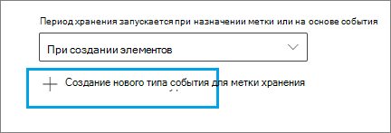

# <a name="start-retention-when-an-event-occurs"></a><span data-ttu-id="adc04-103">Общие сведения о хранении, зависящем от возникновения события</span><span class="sxs-lookup"><span data-stu-id="adc04-103">Start retention when an event occurs</span></span>

><span data-ttu-id="adc04-104">*[Руководство по лицензированию Microsoft 365 для обеспечения безопасности и соответствия требованиям](/office365/servicedescriptions/microsoft-365-service-descriptions/microsoft-365-tenantlevel-services-licensing-guidance/microsoft-365-security-compliance-licensing-guidance).*</span><span class="sxs-lookup"><span data-stu-id="adc04-104">*[Microsoft 365 licensing guidance for security & compliance](/office365/servicedescriptions/microsoft-365-service-descriptions/microsoft-365-tenantlevel-services-licensing-guidance/microsoft-365-security-compliance-licensing-guidance).*</span></span>

<span data-ttu-id="adc04-p101">Срок хранения контента часто определяется его возрастом. Например, вы можете хранить документы в течение семи лет после их создания, а затем удалять их. Однако, настроив [метки хранения](retention.md#retention-labels), вы также можете задать период хранения исходя из того, когда происходит событие определенного типа. Событие становится началом периода хранения, а ко всему контенту с меткой, относящейся к этому типу события, применяются предусмотренные ею действия.</span><span class="sxs-lookup"><span data-stu-id="adc04-p101">When you retain content, the retention period is often based on the age of the content. For example, you might retain documents for seven years after they're created and then delete them. But when you configure [retention labels](retention.md#retention-labels), you can also base a retention period on when a specific type of event occurs. The event triggers the start of the retention period, and all content with a retention label applied for that type of event get the label's retention actions enforced on them.</span></span>
  
<span data-ttu-id="adc04-109">Примеры использования хранения на основе событий</span><span class="sxs-lookup"><span data-stu-id="adc04-109">Examples for using event-based retention:</span></span>
  
- <span data-ttu-id="adc04-110">**Сотрудники, покидающие организацию**. Предположим, что записи сотрудников нужно хранить в течение 10 лет с того момента, когда они покинули организацию.</span><span class="sxs-lookup"><span data-stu-id="adc04-110">**Employees leaving the organization** Suppose that employee records must be retained for 10 years from the time an employee leaves the organization.</span></span> <span data-ttu-id="adc04-111">По истечении 10 лет все документы, связанные с наймом, результатами работы и увольнением сотрудника необходимо ликвидировать.</span><span class="sxs-lookup"><span data-stu-id="adc04-111">After 10 years elapse, all documents related to the hiring, performance, and termination of that employee must be disposed.</span></span> <span data-ttu-id="adc04-112">Событием, которое активирует 10-летний период хранения, является уход сотрудника из организации.</span><span class="sxs-lookup"><span data-stu-id="adc04-112">The event that triggers the 10-year retention period is the employee leaving the organization.</span></span> 
    
- <span data-ttu-id="adc04-113">**Окончание срока действия договора**. Предположим, что все записи, связанные с договорами, нужно хранить в течение пяти лет с момента окончания срока действия договора.</span><span class="sxs-lookup"><span data-stu-id="adc04-113">**Contract expiration** Suppose that all records related to contracts must be retained for five years from the time the contract expires.</span></span> <span data-ttu-id="adc04-114">Событием, активирующим пятилетний период хранения, будет окончание срока действия договора.</span><span class="sxs-lookup"><span data-stu-id="adc04-114">The event that triggers the five-year retention period is the expiration of the contract.</span></span> 
    
- <span data-ttu-id="adc04-p104">**Время существования продукта.** У вашей организации могут быть требования к хранению, связанные с датой последнего выпуска продуктов, в отношении такого контента, как технические спецификации. В таком случае последний выпуск — это событие, активирующее начало периода хранения.</span><span class="sxs-lookup"><span data-stu-id="adc04-p104">**Product lifetime** Your organization might have retention requirements related to the last manufacturing date of products for content such as technical specifications. In this case, the last manufacturing date is the event that triggers the retention period.</span></span> 
    
<span data-ttu-id="adc04-p105">Хранение на основе событий обычно используется в процессе управления записями. Это означает следующее:</span><span class="sxs-lookup"><span data-stu-id="adc04-p105">Event-based retention is typically used as part of a records-management process. This means that:</span></span>
  
- <span data-ttu-id="adc04-119">Метки хранения на основе событий также обычно помечают содержимое как запись в рамках решения управления записями.</span><span class="sxs-lookup"><span data-stu-id="adc04-119">Retention labels based on events also usually mark items as a record, as a part of a records management solution.</span></span> <span data-ttu-id="adc04-120">Дополнительную информацию см. в статье [Сведения об управлении записями](records-management.md).</span><span class="sxs-lookup"><span data-stu-id="adc04-120">For more information, see [Learn about records management](records-management.md).</span></span>

- <span data-ttu-id="adc04-121">Документ, который был объявлен записью, но для которого событие-триггер еще не наступило, хранится в течение неограниченного времени (окончательно удалить записи невозможно), пока событие не активирует период его хранения.</span><span class="sxs-lookup"><span data-stu-id="adc04-121">A document that's been declared a record but whose event trigger has not yet happened is retained indefinitely (records can't be permanently deleted), until an event triggers that document's retention period.</span></span>
    
- <span data-ttu-id="adc04-122">Метки хранения на основе события в конце периода хранения обычно активируют проверку перед ликвидацией, что позволяет лицу, ответственному за управление записями, вручную просмотреть и ликвидировать контент.</span><span class="sxs-lookup"><span data-stu-id="adc04-122">Retention labels based on events usually trigger a disposition review at the end of the retention period, so that a records manager can manually review and dispose of the content.</span></span> <span data-ttu-id="adc04-123">Дополнительные сведения см. в статье [Ликвидация контента](disposition.md).</span><span class="sxs-lookup"><span data-stu-id="adc04-123">For more information, see [Disposition of content](disposition.md).</span></span>
    

<span data-ttu-id="adc04-124">Метки хранения на основе события имеют те же возможности, что и все остальные метки хранения в Microsoft 365.</span><span class="sxs-lookup"><span data-stu-id="adc04-124">A retention label based on an event has the same capabilities as any retention label in Microsoft 365.</span></span> <span data-ttu-id="adc04-125">Дополнительные сведения см. в статье [Сведения о политиках и метках хранения](retention.md).</span><span class="sxs-lookup"><span data-stu-id="adc04-125">For more information, see [Learn about retention policies and retention labels](retention.md).</span></span>

## <a name="understanding-the-relationship-between-event-types-labels-events-and-asset-ids"></a><span data-ttu-id="adc04-126">Взаимосвязь между типами событий, метками, событиями и идентификаторами ресурсов</span><span class="sxs-lookup"><span data-stu-id="adc04-126">Understanding the relationship between event types, labels, events, and asset IDs</span></span>

<span data-ttu-id="adc04-127">Чтобы успешно использовать управляемое хранение на основе событий, важно понимать взаимосвязь между типами событий, метками хранения, событиями и идентификаторами активов, как показано на диаграммах и в следующем пояснении:</span><span class="sxs-lookup"><span data-stu-id="adc04-127">To successfully use event-based retention, it's important to understand the relationship between event types, retention labels, events, and asset IDs as illustrated in the diagrams and the explanation that follows:</span></span> 
  

  

  
1. <span data-ttu-id="adc04-p109">Сначала нужно создать метки хранения для разных типов содержимого, а затем связать их с типом события. Например, метки хранения для разных типов записей и материалов по продуктам связываются с типом события "Время существования продукта", так как эти записи необходимо хранить 10 лет с момента прекращения существования продукта.</span><span class="sxs-lookup"><span data-stu-id="adc04-p109">You create retention labels for different types of content and then associate them with a type of event. For example, retention labels for different types of product files and records are associated with an event type named Product Lifetime because those records must be retained for 10 years from the time the product reaches its end of life.</span></span>
    
2. <span data-ttu-id="adc04-132">Пользователи (обычно менеджеры записей) применяют эти метки хранения к контенту и (для документов в SharePoint и OneDrive) вводят идентификатор ресурса для каждого элемента.</span><span class="sxs-lookup"><span data-stu-id="adc04-132">Users (typically records managers) apply those retention labels to content and (for documents in SharePoint and OneDrive) enter an asset ID for each item.</span></span> <span data-ttu-id="adc04-133">В этом примере идентификатор актива - это название продукта или код, используемый организацией.</span><span class="sxs-lookup"><span data-stu-id="adc04-133">In this example, the asset ID is a product name or code used by the organization.</span></span> <span data-ttu-id="adc04-134">Затем каждой записи продукта присваивается метка хранения, и каждая запись имеет свойство, которое содержит идентификатор актива.</span><span class="sxs-lookup"><span data-stu-id="adc04-134">Then, each product's records are assigned a retention label, and each record has a property that contains an asset ID.</span></span> <span data-ttu-id="adc04-135">Диаграмма представляет **весь контент** для всех записей продукта в организации, и каждый элемент имеет идентификатор актива продукта, чья запись это.</span><span class="sxs-lookup"><span data-stu-id="adc04-135">The diagram represents **all the content** for all product records in an organization, and each item bears the asset ID of the product whose record it is.</span></span> 
    
3. <span data-ttu-id="adc04-p111">"Время существования продукта" — это тип события, которое наступает при завершении существования продукта. Когда возникает такого рода события, т. е. когда время существования продукта заканчивается, создается событие, для которого указывается следующее:</span><span class="sxs-lookup"><span data-stu-id="adc04-p111">Product Lifetime is the event type; a specific product reaching end of life is an event. When an event of that event type occurs—in this case, when a product reaches its end of life—you create an event that specifies:</span></span>
    
   - <span data-ttu-id="adc04-138">Идентификатор ресурса (для документов SharePoint и OneDrive).</span><span class="sxs-lookup"><span data-stu-id="adc04-138">An asset ID (for SharePoint and OneDrive documents)</span></span>
    
   - <span data-ttu-id="adc04-p112">Ключевые слова (для элементов Exchange). В этом примере организация использует код продукта в сообщениях, содержащих записи продукта, поэтому ключевое слово для элементов Exchange функционально совпадает с идентификатором ресурса для документов SharePoint и OneDrive.</span><span class="sxs-lookup"><span data-stu-id="adc04-p112">Keywords (for Exchange items). In this example, the organization uses a product code in messages containing product records, so the keyword for Exchange items is functionally the same as the asset ID for SharePoint and OneDrive documents.</span></span>
    
   - <span data-ttu-id="adc04-p113">Дата возникновения события. С этой даты начинается период хранения, она может быть текущей, прошедшей или будущей.</span><span class="sxs-lookup"><span data-stu-id="adc04-p113">The date when the event occurred. This date is used as the start of the retention period. This date can be the current, a past, or a future date.</span></span>

4. <span data-ttu-id="adc04-p114">После создания события его дата синхронизируется со всем содержимым, у которого есть метка хранения такого типа события и указанный идентификатор ресурса или ключевое слово. Как и для любой другой метки хранения, эта синхронизация может выполняться до семи дней. На предыдущей схеме все элементы, обведенные красным, имеют свой период хранения, который отсчитывается с даты наступления этого события-триггера. Иными словами, когда время существования продукта подходит к концу, такое событие активирует период хранения для записей, касающихся этого продукта.</span><span class="sxs-lookup"><span data-stu-id="adc04-p114">After you create an event, that event date is synchronized to all the content that has a retention label of that event type and that contains the specified asset ID or keyword. Like any retention label, this synchronization can take up to seven days. In the previous diagram, all the items circled in red have their retention period triggered by this event. In other words, when this product reaches its end of life, that event triggers the retention period for that product's records.</span></span>

<span data-ttu-id="adc04-148">Важно понимать, что если вы не укажете идентификатор ресурса или ключевые слова для события, то для **всего содержимого** с меткой хранения этого типа будет иметься период хранения, инициируемый событием.</span><span class="sxs-lookup"><span data-stu-id="adc04-148">It's important to understand that if you don't specify an asset ID or keywords for an event, **all content** with a retention label of that event type will have its retention period triggered by the event.</span></span> <span data-ttu-id="adc04-149">Это означает, что на предыдущей диаграмме все содержимое начало бы сохраняться.</span><span class="sxs-lookup"><span data-stu-id="adc04-149">This means that in the previous diagram, all content would start being retained.</span></span> <span data-ttu-id="adc04-150">Это может быть не то, что вы намерены.</span><span class="sxs-lookup"><span data-stu-id="adc04-150">This might not be what you intend.</span></span>

<span data-ttu-id="adc04-p116">Наконец, не забывайте, что у каждой метки хранения свои параметры хранения. В данном примере во всех случаях указан 10-летний период, но событие может стать триггером для меток хранения, имеющих разный период хранения.</span><span class="sxs-lookup"><span data-stu-id="adc04-p116">Finally, remember that each retention label has its own retention settings. In this example, they all specify 10 years, but it's possible for an event to trigger retention labels where each label has a different retention period.</span></span>
  
## <a name="how-to-set-up-event-driven-retention"></a><span data-ttu-id="adc04-153">Настройка хранения, зависящего от возникновения события</span><span class="sxs-lookup"><span data-stu-id="adc04-153">How to set up event-driven retention</span></span>

<span data-ttu-id="adc04-154">Рабочий процесс высокого уровня для удержания на основе событий:</span><span class="sxs-lookup"><span data-stu-id="adc04-154">High-level workflow for event-driven retention:</span></span>
  

  
> [!TIP]
> <span data-ttu-id="adc04-156">Подробный сценарий использования управляемых свойств в SharePoint для автоматического применения меток хранения и реализации хранения, зависящего от возникновения события, см. в статье [Управление жизненным циклом хранящихся в SharePoint документов с помощью меток хранения](auto-apply-retention-labels-scenario.md).</span><span class="sxs-lookup"><span data-stu-id="adc04-156">See [Use retention labels to manage the lifecycle of documents stored in SharePoint](auto-apply-retention-labels-scenario.md) for a detailed scenario about using managed properties in SharePoint to auto-apply retention labels and implement event-driven retention.</span></span>

### <a name="step-1-create-a-label-whose-retention-period-is-based-on-an-event"></a><span data-ttu-id="adc04-157">Шаг 1. Создайте метку, период хранения которой зависит от возникновения события</span><span class="sxs-lookup"><span data-stu-id="adc04-157">Step 1: Create a label whose retention period is based on an event</span></span>

<span data-ttu-id="adc04-158">Чтобы создать и настроить метку хранения, воспользуйтесь инструкциями из раздела [Создание меток хранения](./create-apply-retention-labels.md#step-1-create-retention-labels).</span><span class="sxs-lookup"><span data-stu-id="adc04-158">To create and configure your retention label, see the instructions for [Create retention labels](./create-apply-retention-labels.md#step-1-create-retention-labels).</span></span> <span data-ttu-id="adc04-159">Но специально для хранения на основе событий на странице **Определение параметров хранения** в мастере создания меток хранения, после **Запуска срока хранения на основе**, выберите один из типов событий по умолчанию в раскрывающемся списке или создайте свой собственный, выбрав **Создать новый тип событий**:</span><span class="sxs-lookup"><span data-stu-id="adc04-159">But specific to event-based retention, on the **Define retention settings** page of the Create retention label wizard, after **Start the retention period based on**, select one of the default event types from the dropdown list, or create your own by selecting **Create new event type**:</span></span>



<span data-ttu-id="adc04-161">Тип события — это просто общее описание события, которое нужно связать с меткой хранения.</span><span class="sxs-lookup"><span data-stu-id="adc04-161">An event type is simply a general description of an event that you want to associate with a retention label.</span></span>

<span data-ttu-id="adc04-162">Типы событий по умолчанию имеют **(тип события)** после своего имени в раскрывающемся списке для более легкой идентификации. Вы также можете просмотреть и создать тип события на вкладке **Управление записями** > **События** > **Управление типами событий**.</span><span class="sxs-lookup"><span data-stu-id="adc04-162">The default event types have **(event type)** after their name in the dropdown list for easier identification, and you can also see and create event type from the **Records management** > **Events** tab > **Manage event types**.</span></span>

<span data-ttu-id="adc04-163">Для хранения на основе событий требуются настройки хранения, согласно которым будет выполняться следующее:</span><span class="sxs-lookup"><span data-stu-id="adc04-163">Event-based retention requires retention settings that:</span></span>
  
- <span data-ttu-id="adc04-164">хранение содержимого;</span><span class="sxs-lookup"><span data-stu-id="adc04-164">Retain the content.</span></span>
    
- <span data-ttu-id="adc04-165">автоматическое удаление содержимого или активация проверки перед ликвидацией в конце периода хранения.</span><span class="sxs-lookup"><span data-stu-id="adc04-165">Delete the content automatically or trigger a disposition review at the end of the retention period.</span></span>
  
<span data-ttu-id="adc04-166">Хранение на основе событий обычно используется для контента, обозначенного как запись, поэтому рекомендуется также проверить, не нужно ли выбрать параметр, помечающий контент как [запись](records-management.md#records)</span><span class="sxs-lookup"><span data-stu-id="adc04-166">Event-based retention is typically used for content that's declared a record, so this is a good time to check whether you also need to select the option that marks content as a [record](records-management.md#records).</span></span>

<span data-ttu-id="adc04-167">Если вы используете существующий тип события, а не создаете новый тип события, перейдите к шагу 3.</span><span class="sxs-lookup"><span data-stu-id="adc04-167">If you're using an existing event type rather than creating a new event type, skip to step 3.</span></span>

> [!NOTE]
> <span data-ttu-id="adc04-168">После выбора типа события и создания метки хранения тип события не изменить нельзя.</span><span class="sxs-lookup"><span data-stu-id="adc04-168">After you choose an event type and save the retention label, the event type cannot be changed.</span></span>

### <a name="step-2-create-a-new-event-type-for-your-label"></a><span data-ttu-id="adc04-169">Шаг 2: Создание нового типа события для вашей метки</span><span class="sxs-lookup"><span data-stu-id="adc04-169">Step 2: Create a new event type for your label</span></span>

<span data-ttu-id="adc04-170">Для параметров хранения, если вы выбрали **Создать новый тип события**, введите имя и описание для вашего типа события.</span><span class="sxs-lookup"><span data-stu-id="adc04-170">For the retention settings, if you selected **Create new event type**, enter a name and description for your event type.</span></span> <span data-ttu-id="adc04-171">Нажмите кнопку **Далее**, **Отправить**, и **Готово**.</span><span class="sxs-lookup"><span data-stu-id="adc04-171">Then select **Next**, **Submit**, and **Done**.</span></span>

<span data-ttu-id="adc04-172">Вернитесь назад на страницу **Определение параметров хранения**, чтобы **Запустить срок хранения на основе**, используйте выпадающий список для выбора типа события, которое вы создали.</span><span class="sxs-lookup"><span data-stu-id="adc04-172">Back on the **Define retention settings** page, for **Start the retention period based on**, use the dropdown list to select the event type that you created.</span></span>

  
### <a name="step-3-publish-or-auto-apply-the-event-based-retention-labels"></a><span data-ttu-id="adc04-173">Шаг 3. Публикация или автоматическое применение меток хранения на основе событий</span><span class="sxs-lookup"><span data-stu-id="adc04-173">Step 3: Publish or auto-apply the event-based retention labels</span></span>

<span data-ttu-id="adc04-174">Метку хранения на основе события, как и любую другую метку хранения, необходимо автоматически применить к событию или опубликовать, чтобы ее можно было вручную или автоматически применять.</span><span class="sxs-lookup"><span data-stu-id="adc04-174">Just like any retention label, you need to publish or auto-apply an event-based label, for it to be manually or automatically applied to content:</span></span>
- [<span data-ttu-id="adc04-175">Создание меток хранения и их применение в приложениях</span><span class="sxs-lookup"><span data-stu-id="adc04-175">Create retention labels and apply them in apps</span></span>](create-apply-retention-labels.md)
- [<span data-ttu-id="adc04-176">Автоматическое применение метки хранения к контенту</span><span class="sxs-lookup"><span data-stu-id="adc04-176">Apply a retention label to content automatically</span></span>](apply-retention-labels-automatically.md)

### <a name="step-4-enter-an-asset-id"></a><span data-ttu-id="adc04-177">Шаг 4. Введите идентификатор ресурса</span><span class="sxs-lookup"><span data-stu-id="adc04-177">Step 4: Enter an asset ID</span></span>

<span data-ttu-id="adc04-p119">После применения к содержимому метки на основе события можно ввести идентификатор ресурса для каждого элемента. Например, ваша организация может использовать следующее:</span><span class="sxs-lookup"><span data-stu-id="adc04-p119">After an event-based label is applied to content, you can enter an asset ID for each item. For example, your organization might use:</span></span>
  
- <span data-ttu-id="adc04-180">коды продуктов для хранения содержимого, касающегося только определенного продукта;</span><span class="sxs-lookup"><span data-stu-id="adc04-180">Product codes that you can use to retain content for only a specific product.</span></span>
    
- <span data-ttu-id="adc04-181">коды проектов для хранения содержимого, касающегося только определенного проекта;</span><span class="sxs-lookup"><span data-stu-id="adc04-181">Project codes that you can use to retain content for only a specific project.</span></span>
    
- <span data-ttu-id="adc04-182">идентификаторы сотрудников для хранения содержимого, касающегося только конкретного лица.</span><span class="sxs-lookup"><span data-stu-id="adc04-182">Employee IDs that you can use to retain content for only a specific person.</span></span>
    
<span data-ttu-id="adc04-183">Идентификатор ресурса — это еще одно свойство документа, доступное в SharePoint и OneDrive.</span><span class="sxs-lookup"><span data-stu-id="adc04-183">Asset ID is simply another document property that's available in SharePoint and OneDrive.</span></span> <span data-ttu-id="adc04-184">Ваша организация может уже использовать другие свойства и идентификаторы документов для классификации содержимого.</span><span class="sxs-lookup"><span data-stu-id="adc04-184">Your organization might already use other document properties and IDs to classify content.</span></span> <span data-ttu-id="adc04-185">В этом случае также можно использовать эти свойства и значения при создании события — см. следующий шаг 6.</span><span class="sxs-lookup"><span data-stu-id="adc04-185">If so, you can also use those properties and values when you create an event—see step 6 that follows.</span></span> <span data-ttu-id="adc04-186">Важно использовать какое-либо сочетание *свойство:значение* в свойствах документа, чтобы сопоставить элемент с каким-либо типом событий.</span><span class="sxs-lookup"><span data-stu-id="adc04-186">The important point is that you must use some *property:value* combination in the document properties to associate that item with an event type.</span></span>
  

  
### <a name="step-5-create-an-event"></a><span data-ttu-id="adc04-188">Шаг 5. Создайте событие</span><span class="sxs-lookup"><span data-stu-id="adc04-188">Step 5: Create an event</span></span>

<span data-ttu-id="adc04-189">Когда возникнет конкретное событие такого типа (например, когда завершится срок службы продукта), перейдите на страницу **Управление записями** > **События** в Центре соответствия требованиям Microsoft 365 и нажмите **+ Создать** , чтобы создать событие.</span><span class="sxs-lookup"><span data-stu-id="adc04-189">When a particular instance of that event type occurs, such as a product reaches its end of life, go to the **Records management** > **Events** page in the Microsoft 365 compliance center, and select **+ Create** to create an event.</span></span> <span data-ttu-id="adc04-190">Можно инициировать событие, создав его здесь.</span><span class="sxs-lookup"><span data-stu-id="adc04-190">You trigger the event by creating it, here.</span></span>


<span data-ttu-id="adc04-192">Для одного клиента поддерживается до одного миллиона событий.</span><span class="sxs-lookup"><span data-stu-id="adc04-192">Up to one million events are supported per tenant.</span></span>

### <a name="step-6-choose-the-same-event-type-used-by-the-label-in-step-2"></a><span data-ttu-id="adc04-193">Шаг 6. Выберите тип события, который использовался для метки из описания шага 2</span><span class="sxs-lookup"><span data-stu-id="adc04-193">Step 6: Choose the same event type used by the label in step 2</span></span>

<span data-ttu-id="adc04-194">Когда вы создаете событие, выберите тот же тип события, который был указан в настройках метки сохранения в шаге 2.</span><span class="sxs-lookup"><span data-stu-id="adc04-194">When you create the event, choose the same event type specified in the retention label settings in step 2.</span></span> <span data-ttu-id="adc04-195">Например, если в качестве типа события для настроек метки вы выбрали **Срок службы продукта**, выберите **Срок службы продукта** при создании события.</span><span class="sxs-lookup"><span data-stu-id="adc04-195">For example, if you selected **Product Lifetime** as your event type for the label settings, select **Product Lifetime** when you create the event.</span></span> <span data-ttu-id="adc04-196">Период хранения будет инициирован только для контента с метками хранения, примененными к нему с таким типом события.</span><span class="sxs-lookup"><span data-stu-id="adc04-196">Only content with retention labels applied to it of that event type will have its retention period triggered.</span></span>


<span data-ttu-id="adc04-198">В противном случае, если вам нужно создать событие для нескольких меток хранения с различными типами событий, выберите параметр **Выбрать существующие метки**.</span><span class="sxs-lookup"><span data-stu-id="adc04-198">Alternatively, if you need to create an event for multiple retention labels that have different event types, select the **Choose Existing Labels** option.</span></span> <span data-ttu-id="adc04-199">Затем выберите метки, настроенные для типов событий, которые нужно связать с этим событием.</span><span class="sxs-lookup"><span data-stu-id="adc04-199">Then, select the labels that are configured for the event types you want to associate with this event.</span></span>

### <a name="step-7-enter-keywords-or-query-for-exchange-asset-id-for-sharepoint-and-onedrive"></a><span data-ttu-id="adc04-200">Шаг 7. Введите ключевые слова или запрос для Exchange, идентификатор ресурса для SharePoint и OneDrive</span><span class="sxs-lookup"><span data-stu-id="adc04-200">Step 7: Enter keywords or query for Exchange, asset ID for SharePoint and OneDrive</span></span>

<span data-ttu-id="adc04-201">Теперь вы сузили область содержимого.</span><span class="sxs-lookup"><span data-stu-id="adc04-201">Now you narrow the scope of the content.</span></span> <span data-ttu-id="adc04-202">Для содержимого Exchange это можно сделать, указав ключевые слова или запрос.</span><span class="sxs-lookup"><span data-stu-id="adc04-202">For Exchange content, you do this by specifying keywords or a query.</span></span> <span data-ttu-id="adc04-203">Для содержимого SharePoint и OneDrive это можно сделать, указав идентификаторы ресурсов.</span><span class="sxs-lookup"><span data-stu-id="adc04-203">For SharePoint and OneDrive content, you do this by specifying asset IDs.</span></span>

<span data-ttu-id="adc04-204">Для элементов Exchange используйте ключевые слова или запрос, в котором применяется язык запросов по ключевым словам (KQL).</span><span class="sxs-lookup"><span data-stu-id="adc04-204">For Exchange items, use keywords or a query that uses Keyword Query Language (KQL).</span></span> <span data-ttu-id="adc04-205">Больше информации о синтаксисе запросов см. в [Справочнике по синтаксису языка запросов по ключевым словам (KQL)](/sharepoint/dev/general-development/keyword-query-language-kql-syntax-reference).</span><span class="sxs-lookup"><span data-stu-id="adc04-205">For more information about the query syntax, see [Keyword Query Language (KQL) syntax reference](/sharepoint/dev/general-development/keyword-query-language-kql-syntax-reference).</span></span> <span data-ttu-id="adc04-206">Дополнительные сведения о доступных для поиска свойствах, которые можно использовать для Exchange, см. в статье [Запросы с ключевыми словами и условия для поиска содержимого](keyword-queries-and-search-conditions.md).</span><span class="sxs-lookup"><span data-stu-id="adc04-206">For more information about the searchable properties that you can use for Exchange, see [Keyword queries and search conditions for Content Search](keyword-queries-and-search-conditions.md).</span></span>

<span data-ttu-id="adc04-207">Для идентификаторов ресурсов хранение будет применяться только к содержимому, для которого указана пара *свойство:значение*.</span><span class="sxs-lookup"><span data-stu-id="adc04-207">For asset IDs, retention will be enforced only on content with the specified *property:value* pair.</span></span> <span data-ttu-id="adc04-208">Например, если используется свойство "Идентификатор ресурса", введите `ComplianceAssetID:<value>` в поле идентификаторов ресурсов, показанное на изображении ниже.</span><span class="sxs-lookup"><span data-stu-id="adc04-208">For example, if you're using the Asset ID property, enter `ComplianceAssetID:<value>` in the box for asset IDs shown in the following picture.</span></span>

<span data-ttu-id="adc04-209">Если идентификатор ресурса не указан, ко всему содержимому с метками для такого типа событий будет применена одна и та же дата хранения.</span><span class="sxs-lookup"><span data-stu-id="adc04-209">If an asset ID is not entered, all content with labels of that event type get the same retention date applied to them.</span></span>

<span data-ttu-id="adc04-210">Возможно, к документам, связанным с этим типом события, в вашей организации применяются другие идентификаторы и свойства.</span><span class="sxs-lookup"><span data-stu-id="adc04-210">Your organization might have applied other properties and IDs to the documents related to this event type.</span></span> <span data-ttu-id="adc04-211">Например, если вам нужно найти записи, относящиеся к конкретному продукту, вы можете использовать в качестве идентификатора сочетание настраиваемого свойства ProductID и значения XYZ.</span><span class="sxs-lookup"><span data-stu-id="adc04-211">For example, if you need to detect a specific product's records, the ID might be a combination of your custom property ProductID and the value "XYZ".</span></span> <span data-ttu-id="adc04-212">В этом случае следует ввести `ProductID:XYZ` в поле идентификаторов ресурсов, показанное на следующем рисунке.</span><span class="sxs-lookup"><span data-stu-id="adc04-212">In this case, you'd enter `ProductID:XYZ` in the box for asset IDs shown in the following picture.</span></span>

<span data-ttu-id="adc04-p128">В заключение выберите дату возникновения события. С этой даты начнется период хранения. После создания события дата события синхронизируется со всем содержимым, имеющим метку хранения такого типа события, идентификатор ресурса и ключевые слова. Как и в случае с любой другой меткой хранения, такая синхронизация может длиться до семи дней.</span><span class="sxs-lookup"><span data-stu-id="adc04-p128">Finally, choose the date when the event occurred; this date is used as the start of the retention period. After you create an event, that event date is synchronized to all the content with a retention label of that event type, asset ID, and keywords or queries. As with any retention label, this synchronization can take up to seven days.</span></span>
  


<span data-ttu-id="adc04-217">После создания события параметры хранения вступят в силу для контента, который уже снабжен метками и индексирован.</span><span class="sxs-lookup"><span data-stu-id="adc04-217">After creating an event, the retention settings take effect for the content that's already labeled and indexed.</span></span> <span data-ttu-id="adc04-218">Если метка хранения добавляется к новому контенту после создания события, необходимо создать другое событие с теми же данными.</span><span class="sxs-lookup"><span data-stu-id="adc04-218">If the retention label is added to new content after the event is created, you must create a new event with the same details.</span></span>

<span data-ttu-id="adc04-219">Удаление события не отменяет параметры хранения, которые вступили в действие в отношении контента, который уже снабжен меткой.</span><span class="sxs-lookup"><span data-stu-id="adc04-219">Deleting an event doesn't cancel the retention settings that are now in effect for the content that's already labeled.</span></span> <span data-ttu-id="adc04-220">Чтобы сделать это, создайте событие с теми же данными, но оставьте поле даты пустым.</span><span class="sxs-lookup"><span data-stu-id="adc04-220">To do that, create a new event with the same details, but leave the date blank.</span></span> 

## <a name="use-content-search-to-find-all-content-with-a-specific-label-or-asset-id"></a><span data-ttu-id="adc04-221">Использование средства "Поиск контента" для поиска всего контента с определенной меткой или определенным идентификатором ресурса</span><span class="sxs-lookup"><span data-stu-id="adc04-221">Use Content Search to find all content with a specific label or asset ID</span></span>

<span data-ttu-id="adc04-222">После назначения меток хранения контенту можно использовать поиск контента, чтобы найти весь контент, обозначенный определенной меткой хранения или содержащий определенный идентификатор ресурса.</span><span class="sxs-lookup"><span data-stu-id="adc04-222">After retention labels are assigned to content, you can use content search to find all content that's classified with a specific retention label or that contains a specific asset ID:</span></span>
  
- <span data-ttu-id="adc04-223">Чтобы найти весь контент с определенной меткой хранения, выберите условие **Метка хранения**, а затем введите полное имя метки или его часть с использованием подстановочного знака.</span><span class="sxs-lookup"><span data-stu-id="adc04-223">To find all content with a specific retention label, choose the **Retention label** condition, and then enter the complete label name or part of the label name and use a wildcard.</span></span> 
    
- <span data-ttu-id="adc04-224">Чтобы найти весь контент с определенным идентификатором ресурса, введите свойство **ComplianceAssetID** и значение, используя формат `ComplianceAssetID:<value>`.</span><span class="sxs-lookup"><span data-stu-id="adc04-224">To find all content with a specific asset ID, enter the **ComplianceAssetID** property and a value, using the format `ComplianceAssetID:<value>`.</span></span> 
    
<span data-ttu-id="adc04-225">Дополнительные сведения см. в статье [Запросы по ключевым словам и условия для средства "Поиск контента"](keyword-queries-and-search-conditions.md).</span><span class="sxs-lookup"><span data-stu-id="adc04-225">For more information, see [Keyword queries and search conditions for Content Search](keyword-queries-and-search-conditions.md).</span></span>

## <a name="automate-events-by-using-powershell"></a><span data-ttu-id="adc04-226">Автоматизация событий с помощью PowerShell</span><span class="sxs-lookup"><span data-stu-id="adc04-226">Automate events by using PowerShell</span></span>

<span data-ttu-id="adc04-227">Для автоматизации хранения на основе событий в бизнес-приложениях можно использовать сценарий PowerShell.</span><span class="sxs-lookup"><span data-stu-id="adc04-227">You can use a PowerShell script to automate event-based retention from your business applications.</span></span> <span data-ttu-id="adc04-228">Командлеты PowerShell, доступные для хранения на основе событий:</span><span class="sxs-lookup"><span data-stu-id="adc04-228">The PowerShell cmdlets available for event-based retention:</span></span>
  
- [<span data-ttu-id="adc04-229">Get-ComplianceRetentionEventType</span><span class="sxs-lookup"><span data-stu-id="adc04-229">Get-ComplianceRetentionEventType</span></span>](/powershell/module/exchange/get-complianceretentioneventtype)
    
- [<span data-ttu-id="adc04-230">New-ComplianceRetentionEventType</span><span class="sxs-lookup"><span data-stu-id="adc04-230">New-ComplianceRetentionEventType</span></span>](/powershell/module/exchange/new-complianceretentioneventtype)
    
- [<span data-ttu-id="adc04-231">Remove-ComplianceRetentionEventType</span><span class="sxs-lookup"><span data-stu-id="adc04-231">Remove-ComplianceRetentionEventType</span></span>](/powershell/module/exchange/remove-complianceretentioneventtype)
    
- [<span data-ttu-id="adc04-232">Set-ComplianceRetentionEventType</span><span class="sxs-lookup"><span data-stu-id="adc04-232">Set-ComplianceRetentionEventType</span></span>](/powershell/module/exchange/set-complianceretentioneventtype)
    
- [<span data-ttu-id="adc04-233">Get-ComplianceRetentionEvent</span><span class="sxs-lookup"><span data-stu-id="adc04-233">Get-ComplianceRetentionEvent</span></span>](/powershell/module/exchange/get-complianceretentionevent)
    
- [<span data-ttu-id="adc04-234">New-ComplianceRetentionEvent</span><span class="sxs-lookup"><span data-stu-id="adc04-234">New-ComplianceRetentionEvent</span></span>](/powershell/module/exchange/new-complianceretentionevent)
    

## <a name="automate-events-by-using-a-rest-api"></a><span data-ttu-id="adc04-235">Автоматизация событий с помощью REST API</span><span class="sxs-lookup"><span data-stu-id="adc04-235">Automate events by using a REST API</span></span>

<span data-ttu-id="adc04-236">Можно использовать REST API для автоматического создания событий, инициирующих начало срока хранения.</span><span class="sxs-lookup"><span data-stu-id="adc04-236">You can use a REST API to automatically create the events that trigger the start of the retention time.</span></span>

<span data-ttu-id="adc04-237">REST API — это конечная точка службы, поддерживающая наборы операций HTTP (методы), которые обеспечивают создание, получение, обновление и удаление доступа к ресурсам службы.</span><span class="sxs-lookup"><span data-stu-id="adc04-237">A REST API is a service endpoint that supports sets of HTTP operations (methods), which provide create/retrieve/update/delete access to the service's resources.</span></span> <span data-ttu-id="adc04-238">Дополнительные сведения см. в статье [Компоненты запросов и откликов REST API](/rest/api/gettingstarted/#components-of-a-rest-api-requestresponse).</span><span class="sxs-lookup"><span data-stu-id="adc04-238">For more information, see [Components of a REST API request/response](/rest/api/gettingstarted/#components-of-a-rest-api-requestresponse).</span></span> <span data-ttu-id="adc04-239">С помощью REST API Microsoft 365 можно создавать и получать события методами POST и GET.</span><span class="sxs-lookup"><span data-stu-id="adc04-239">By using the Microsoft 365 REST API, events can be created and retrieved using the POST and GET methods.</span></span>

<span data-ttu-id="adc04-240">Существует два способа использования REST API:</span><span class="sxs-lookup"><span data-stu-id="adc04-240">There are two options for using the REST API:</span></span>

- <span data-ttu-id="adc04-241">**Microsoft Power Automate или аналогичное приложение** для автоматического запуска события.</span><span class="sxs-lookup"><span data-stu-id="adc04-241">**Microsoft Power Automate or a similar application** to trigger the occurrence of an event automatically.</span></span> <span data-ttu-id="adc04-242">Microsoft Power Automate — это оркестратор для подключения к другим системам, поэтому не потребуется создавать собственное настраиваемое решение.</span><span class="sxs-lookup"><span data-stu-id="adc04-242">Microsoft Power Automate is an orchestrator for connecting to other systems, so you don't need to write a custom solution.</span></span> <span data-ttu-id="adc04-243">Дополнительные сведения см. на [веб-сайте Power Automate](https://flow.microsoft.com/ru-RU/).</span><span class="sxs-lookup"><span data-stu-id="adc04-243">For more information, see the [Power Automate website](https://flow.microsoft.com/ru-RU/).</span></span>

- <span data-ttu-id="adc04-244">**PowerShell или HTTP-клиент, вызывающий REST API** для создания событий с помощью PowerShell (версии 6 или более поздней), входящего в состав настраиваемого решения.</span><span class="sxs-lookup"><span data-stu-id="adc04-244">**PowerShell or an HTTP client to call the REST API** to create events by using PowerShell (version 6 or later), which is part of a custom solution.</span></span>

<span data-ttu-id="adc04-245">Перед использованием REST API пользователю, имеющему права глобального администратора, необходимо подтвердить URL-адрес, используемый для вызова события хранения.</span><span class="sxs-lookup"><span data-stu-id="adc04-245">Before you use the REST API, as a global administrator, confirm the URL to use for the retention event call.</span></span> <span data-ttu-id="adc04-246">Для этого выполните вызов события хранения GET, используя URL-адрес REST API:</span><span class="sxs-lookup"><span data-stu-id="adc04-246">To do this, run a GET retention event call by using the REST API URL:</span></span>

```http
https://ps.compliance.protection.outlook.com/psws/service.svc/ComplianceRetentionEvent
```

<span data-ttu-id="adc04-247">Проверьте код отклика.</span><span class="sxs-lookup"><span data-stu-id="adc04-247">Check the response code.</span></span> <span data-ttu-id="adc04-248">Если это 302, получите перенаправленный URL-адрес в свойстве "Location" заголовка отклика и используйте этот URL-адрес вместо `https://ps.compliance.protection.outlook.com/psws/service.svc/ComplianceRetentionEvent` в приведенных ниже инструкциях.</span><span class="sxs-lookup"><span data-stu-id="adc04-248">If it's 302, get the redirected URL from the Location property of the response header and use that URL instead of `https://ps.compliance.protection.outlook.com/psws/service.svc/ComplianceRetentionEvent` in the instructions that follow.</span></span>

<span data-ttu-id="adc04-249">События, создающиеся автоматически, можно проверить: откройте Центр соответствия требованиям Microsoft 365 > **Управление записями** >  **События**.</span><span class="sxs-lookup"><span data-stu-id="adc04-249">The events that get automatically created can be confirmed by viewing them in the Microsoft 365 compliance center > **Records management** >  **Events**.</span></span>

### <a name="use-microsoft-power-automate-to-create-the-event"></a><span data-ttu-id="adc04-250">Используйте Microsoft Power Automate для создания события</span><span class="sxs-lookup"><span data-stu-id="adc04-250">Use Microsoft Power Automate to create the event</span></span>

<span data-ttu-id="adc04-251">Создайте процесс, создающий событие с помощью REST API Microsoft 365:</span><span class="sxs-lookup"><span data-stu-id="adc04-251">Create a flow that creates an event using the Microsoft 365 REST API:</span></span>


#### <a name="create-an-event"></a><span data-ttu-id="adc04-254">Создание события</span><span class="sxs-lookup"><span data-stu-id="adc04-254">Create an event</span></span>

<span data-ttu-id="adc04-255">Пример кода для вызова REST API:</span><span class="sxs-lookup"><span data-stu-id="adc04-255">Sample code to call the REST API:</span></span>

- <span data-ttu-id="adc04-256">**Метод**: POST</span><span class="sxs-lookup"><span data-stu-id="adc04-256">**Method**: POST</span></span>
- <span data-ttu-id="adc04-257">**URL-адрес**: `https://ps.compliance.protection.outlook.com/psws/service.svc/ComplianceRetentionEvent`</span><span class="sxs-lookup"><span data-stu-id="adc04-257">**URL**: `https://ps.compliance.protection.outlook.com/psws/service.svc/ComplianceRetentionEvent`</span></span>
- <span data-ttu-id="adc04-258">**Заголовки**: Key = Content-Type, Value = application/atom+xml</span><span class="sxs-lookup"><span data-stu-id="adc04-258">**Headers**: Key = Content-Type, Value = application/atom+xml</span></span>
- <span data-ttu-id="adc04-259">**Текст**:</span><span class="sxs-lookup"><span data-stu-id="adc04-259">**Body**:</span></span>

    ```xml
    <?xml version='1.0' encoding='utf-8' standalone='yes'?>
    
    <entry xmlns:d='http://schemas.microsoft.com/ado/2007/08/dataservices'
    
    xmlns:m='http://schemas.microsoft.com/ado/2007/08/dataservices/metadata'
    
    xmlns='http://www.w3.org/2005/Atom'>
    
    <category scheme='http://schemas.microsoft.com/ado/2007/08/dataservices/scheme' term='Exchange.ComplianceRetentionEvent' />
    
    <updated>9/9/2017 10:50:00 PM</updated>
    
    <content type='application/xml'>
    
    <m:properties>
    
    <d:Name>Employee Termination </d:Name>
    
    <d:EventType>99e0ae64-a4b8-40bb-82ed-645895610f56</d:EventType>
    
    <d:SharePointAssetIdQuery>1234</d:SharePointAssetIdQuery>
    
    <d:EventDateTime>2018-12-01T00:00:00Z </d:EventDateTime>
    
    </m:properties>
    
    </content>
    
    </entry>
    ```

- <span data-ttu-id="adc04-260">**Проверка подлинности**: обычная</span><span class="sxs-lookup"><span data-stu-id="adc04-260">**Authentication**: Basic</span></span>
- <span data-ttu-id="adc04-261">**Имя пользователя**: "Complianceuser"</span><span class="sxs-lookup"><span data-stu-id="adc04-261">**Username**: "Complianceuser"</span></span>
- <span data-ttu-id="adc04-262">**Пароль**: "Compliancepassword"</span><span class="sxs-lookup"><span data-stu-id="adc04-262">**Password**: "Compliancepassword"</span></span>


##### <a name="available-parameters"></a><span data-ttu-id="adc04-263">Доступные параметры</span><span class="sxs-lookup"><span data-stu-id="adc04-263">Available parameters</span></span>


|<span data-ttu-id="adc04-264">Параметры</span><span class="sxs-lookup"><span data-stu-id="adc04-264">Parameters</span></span>|<span data-ttu-id="adc04-265">Описание</span><span class="sxs-lookup"><span data-stu-id="adc04-265">Description</span></span>|<span data-ttu-id="adc04-266">Примечания</span><span class="sxs-lookup"><span data-stu-id="adc04-266">Notes</span></span>|
|--- |--- |--- |
|<span data-ttu-id="adc04-267"><d:Name></d:Name></span><span class="sxs-lookup"><span data-stu-id="adc04-267"><d:Name></d:Name></span></span>|<span data-ttu-id="adc04-268">Указание уникального имени события.</span><span class="sxs-lookup"><span data-stu-id="adc04-268">Provide a unique name for the event,</span></span>|<span data-ttu-id="adc04-269">Нельзя использовать конечные пробелы и следующие символы: % \* \ & < \> \| # ?</span><span class="sxs-lookup"><span data-stu-id="adc04-269">Cannot contain trailing spaces or the following characters: % \* \ & < \> \| # ?</span></span> <span data-ttu-id="adc04-270">, : ;</span><span class="sxs-lookup"><span data-stu-id="adc04-270">, : ;</span></span>|
|<span data-ttu-id="adc04-271"><d:EventType></d:EventType></span><span class="sxs-lookup"><span data-stu-id="adc04-271"><d:EventType></d:EventType></span></span>|<span data-ttu-id="adc04-272">Введите название типа события (или Guid).</span><span class="sxs-lookup"><span data-stu-id="adc04-272">Enter event type name (or Guid),</span></span>|<span data-ttu-id="adc04-p137">Пример: "Увольнение сотрудника". Тип события должен быть связан с меткой хранения.</span><span class="sxs-lookup"><span data-stu-id="adc04-p137">Example: "Employee termination". Event type has to be associated with a retention label.</span></span>|
|<span data-ttu-id="adc04-275"><d:SharePointAssetIdQuery></d:SharePointAssetIdQuery></span><span class="sxs-lookup"><span data-stu-id="adc04-275"><d:SharePointAssetIdQuery></d:SharePointAssetIdQuery></span></span>|<span data-ttu-id="adc04-276">Введите "ComplianceAssetId:" + идентификатор сотрудника</span><span class="sxs-lookup"><span data-stu-id="adc04-276">Enter "ComplianceAssetId:" + employee ID</span></span>|<span data-ttu-id="adc04-277">Пример: "ComplianceAssetId:12345"</span><span class="sxs-lookup"><span data-stu-id="adc04-277">Example: "ComplianceAssetId:12345"</span></span>|
|<span data-ttu-id="adc04-278"><d:EventDateTime></d:EventDateTime></span><span class="sxs-lookup"><span data-stu-id="adc04-278"><d:EventDateTime></d:EventDateTime></span></span>|<span data-ttu-id="adc04-279">Дата и время события</span><span class="sxs-lookup"><span data-stu-id="adc04-279">Event Date and Time</span></span>|<span data-ttu-id="adc04-280">Формат: ГГГГ-ММ-ДДTчч:мм:ссZ. Пример: 2018-12-01T00:00:00Z</span><span class="sxs-lookup"><span data-stu-id="adc04-280">Format: yyyy-MM-ddTHH:mm:ssZ, Example: 2018-12-01T00:00:00Z</span></span>
|

###### <a name="response-codes"></a><span data-ttu-id="adc04-281">Коды ответа</span><span class="sxs-lookup"><span data-stu-id="adc04-281">Response codes</span></span>

| <span data-ttu-id="adc04-282">Код ответа</span><span class="sxs-lookup"><span data-stu-id="adc04-282">Response Code</span></span> | <span data-ttu-id="adc04-283">Описание</span><span class="sxs-lookup"><span data-stu-id="adc04-283">Description</span></span>       |
| ----------------- | --------------------- |
| <span data-ttu-id="adc04-284">302</span><span class="sxs-lookup"><span data-stu-id="adc04-284">302</span></span>               | <span data-ttu-id="adc04-285">Перенаправление</span><span class="sxs-lookup"><span data-stu-id="adc04-285">Redirect</span></span>              |
| <span data-ttu-id="adc04-286">201</span><span class="sxs-lookup"><span data-stu-id="adc04-286">201</span></span>               | <span data-ttu-id="adc04-287">Создано</span><span class="sxs-lookup"><span data-stu-id="adc04-287">Created</span></span>               |
| <span data-ttu-id="adc04-288">403</span><span class="sxs-lookup"><span data-stu-id="adc04-288">403</span></span>               | <span data-ttu-id="adc04-289">Сбой авторизации</span><span class="sxs-lookup"><span data-stu-id="adc04-289">Authorization Failed</span></span>  |
| <span data-ttu-id="adc04-290">401</span><span class="sxs-lookup"><span data-stu-id="adc04-290">401</span></span>               | <span data-ttu-id="adc04-291">Сбой проверки подлинности</span><span class="sxs-lookup"><span data-stu-id="adc04-291">Authentication Failed</span></span> |

##### <a name="get-events-based-on-a-time-range"></a><span data-ttu-id="adc04-292">Получение событий на основе диапазона времени</span><span class="sxs-lookup"><span data-stu-id="adc04-292">Get events based on a time range</span></span>

- <span data-ttu-id="adc04-293">**Метод**: GET</span><span class="sxs-lookup"><span data-stu-id="adc04-293">**Method**: GET</span></span>

- <span data-ttu-id="adc04-294">**URL-адрес**: `https://ps.compliance.protection.outlook.com/psws/service.svc/ComplianceRetentionEvent?BeginDateTime=2019-01-11&EndDateTime=2019-01-16`</span><span class="sxs-lookup"><span data-stu-id="adc04-294">**URL**: `https://ps.compliance.protection.outlook.com/psws/service.svc/ComplianceRetentionEvent?BeginDateTime=2019-01-11&EndDateTime=2019-01-16`</span></span>

- <span data-ttu-id="adc04-295">**Заголовки**: Key = Content-Type, Value = application/atom+xml</span><span class="sxs-lookup"><span data-stu-id="adc04-295">**Headers**: Key = Content-Type, Value = application/atom+xml</span></span>

- <span data-ttu-id="adc04-296">**Проверка подлинности**: обычная</span><span class="sxs-lookup"><span data-stu-id="adc04-296">**Authentication**: Basic</span></span>

- <span data-ttu-id="adc04-297">**Имя пользователя**: "Complianceuser"</span><span class="sxs-lookup"><span data-stu-id="adc04-297">**Username**: "Complianceuser"</span></span>

- <span data-ttu-id="adc04-298">**Пароль**: "Compliancepassword"</span><span class="sxs-lookup"><span data-stu-id="adc04-298">**Password**: "Compliancepassword"</span></span>

###### <a name="response-codes"></a><span data-ttu-id="adc04-299">Коды ответа</span><span class="sxs-lookup"><span data-stu-id="adc04-299">Response codes</span></span>

| <span data-ttu-id="adc04-300">Код ответа</span><span class="sxs-lookup"><span data-stu-id="adc04-300">Response Code</span></span> | <span data-ttu-id="adc04-301">Описание</span><span class="sxs-lookup"><span data-stu-id="adc04-301">Description</span></span>                   |
| ----------------- | --------------------------------- |
| <span data-ttu-id="adc04-302">200</span><span class="sxs-lookup"><span data-stu-id="adc04-302">200</span></span>               | <span data-ttu-id="adc04-303">Все в порядке, список событий в формате atom+xml</span><span class="sxs-lookup"><span data-stu-id="adc04-303">OK, A list of events in atom+ xml</span></span> |
| <span data-ttu-id="adc04-304">404</span><span class="sxs-lookup"><span data-stu-id="adc04-304">404</span></span>               | <span data-ttu-id="adc04-305">Не найдено</span><span class="sxs-lookup"><span data-stu-id="adc04-305">Not found</span></span>                         |
| <span data-ttu-id="adc04-306">302</span><span class="sxs-lookup"><span data-stu-id="adc04-306">302</span></span>               | <span data-ttu-id="adc04-307">Перенаправление</span><span class="sxs-lookup"><span data-stu-id="adc04-307">Redirect</span></span>                          |
| <span data-ttu-id="adc04-308">401</span><span class="sxs-lookup"><span data-stu-id="adc04-308">401</span></span>               | <span data-ttu-id="adc04-309">Сбой авторизации</span><span class="sxs-lookup"><span data-stu-id="adc04-309">Authorization Failed</span></span>              |
| <span data-ttu-id="adc04-310">403</span><span class="sxs-lookup"><span data-stu-id="adc04-310">403</span></span>               | <span data-ttu-id="adc04-311">Сбой проверки подлинности</span><span class="sxs-lookup"><span data-stu-id="adc04-311">Authentication Failed</span></span>             |

##### <a name="get-an-event-by-id"></a><span data-ttu-id="adc04-312">Получение события по идентификатору</span><span class="sxs-lookup"><span data-stu-id="adc04-312">Get an event by ID</span></span>

- <span data-ttu-id="adc04-313">**Метод**: GET</span><span class="sxs-lookup"><span data-stu-id="adc04-313">**Method**: GET</span></span>

- <span data-ttu-id="adc04-314">**URL-адрес**: `https://ps.compliance.protection.outlook.com/psws/service.svc/ComplianceRetentionEvent('174e9a86-74ff-4450-8666-7c11f7730f66')`</span><span class="sxs-lookup"><span data-stu-id="adc04-314">**URL**: `https://ps.compliance.protection.outlook.com/psws/service.svc/ComplianceRetentionEvent('174e9a86-74ff-4450-8666-7c11f7730f66')`</span></span>

- <span data-ttu-id="adc04-315">**Заголовки**: Key = Content-Type, Value = application/atom+xml</span><span class="sxs-lookup"><span data-stu-id="adc04-315">**Headers**: Key = Content-Type, Value = application/atom+xml</span></span>

- <span data-ttu-id="adc04-316">**Проверка подлинности**: обычная</span><span class="sxs-lookup"><span data-stu-id="adc04-316">**Authentication**: Basic</span></span>

- <span data-ttu-id="adc04-317">**Имя пользователя**: "Complianceuser"</span><span class="sxs-lookup"><span data-stu-id="adc04-317">**Username**: "Complianceuser"</span></span>

- <span data-ttu-id="adc04-318">**Пароль**: "Compliancepassword"</span><span class="sxs-lookup"><span data-stu-id="adc04-318">**Password**: "Compliancepassword"</span></span>

###### <a name="response-codes"></a><span data-ttu-id="adc04-319">Коды ответа</span><span class="sxs-lookup"><span data-stu-id="adc04-319">Response codes</span></span>

| <span data-ttu-id="adc04-320">Код ответа</span><span class="sxs-lookup"><span data-stu-id="adc04-320">Response Code</span></span> | <span data-ttu-id="adc04-321">Описание</span><span class="sxs-lookup"><span data-stu-id="adc04-321">Description</span></span>                                      |
| ----------------- | ---------------------------------------------------- |
| <span data-ttu-id="adc04-322">200</span><span class="sxs-lookup"><span data-stu-id="adc04-322">200</span></span>               | <span data-ttu-id="adc04-323">Все в порядке, текст ответа содержит событие в формате atom+xml</span><span class="sxs-lookup"><span data-stu-id="adc04-323">OK, The response body contains the event in atom+xml</span></span> |
| <span data-ttu-id="adc04-324">404</span><span class="sxs-lookup"><span data-stu-id="adc04-324">404</span></span>               | <span data-ttu-id="adc04-325">Не найдено</span><span class="sxs-lookup"><span data-stu-id="adc04-325">Not found</span></span>                                            |
| <span data-ttu-id="adc04-326">302</span><span class="sxs-lookup"><span data-stu-id="adc04-326">302</span></span>               | <span data-ttu-id="adc04-327">Перенаправление</span><span class="sxs-lookup"><span data-stu-id="adc04-327">Redirect</span></span>                                             |
| <span data-ttu-id="adc04-328">401</span><span class="sxs-lookup"><span data-stu-id="adc04-328">401</span></span>               | <span data-ttu-id="adc04-329">Сбой авторизации</span><span class="sxs-lookup"><span data-stu-id="adc04-329">Authorization Failed</span></span>                                 |
| <span data-ttu-id="adc04-330">403</span><span class="sxs-lookup"><span data-stu-id="adc04-330">403</span></span>               | <span data-ttu-id="adc04-331">Сбой проверки подлинности</span><span class="sxs-lookup"><span data-stu-id="adc04-331">Authentication Failed</span></span>                                |

##### <a name="get-an-event-by-name"></a><span data-ttu-id="adc04-332">Получение события по имени</span><span class="sxs-lookup"><span data-stu-id="adc04-332">Get an event by name</span></span>

- <span data-ttu-id="adc04-333">**Метод**: GET</span><span class="sxs-lookup"><span data-stu-id="adc04-333">**Method**: GET</span></span>

- <span data-ttu-id="adc04-334">**URL-адрес**: `https://ps.compliance.protection.outlook.com/psws/service.svc/ComplianceRetentionEvent`</span><span class="sxs-lookup"><span data-stu-id="adc04-334">**URL**: `https://ps.compliance.protection.outlook.com/psws/service.svc/ComplianceRetentionEvent`</span></span>

- <span data-ttu-id="adc04-335">**Заголовки**: Key = Content-Type, Value = application/atom+xml</span><span class="sxs-lookup"><span data-stu-id="adc04-335">**Headers**: Key = Content-Type, Value = application/atom+xml</span></span>

- <span data-ttu-id="adc04-336">**Проверка подлинности**: обычная</span><span class="sxs-lookup"><span data-stu-id="adc04-336">**Authentication**: Basic</span></span>

- <span data-ttu-id="adc04-337">**Имя пользователя**: "Complianceuser"</span><span class="sxs-lookup"><span data-stu-id="adc04-337">**Username**: "Complianceuser"</span></span>

- <span data-ttu-id="adc04-338">**Пароль**: "Compliancepassword"</span><span class="sxs-lookup"><span data-stu-id="adc04-338">**Password**: "Compliancepassword"</span></span>

###### <a name="response-codes"></a><span data-ttu-id="adc04-339">Коды ответа</span><span class="sxs-lookup"><span data-stu-id="adc04-339">Response codes</span></span>

| <span data-ttu-id="adc04-340">Код ответа</span><span class="sxs-lookup"><span data-stu-id="adc04-340">Response Code</span></span> | <span data-ttu-id="adc04-341">Описание</span><span class="sxs-lookup"><span data-stu-id="adc04-341">Description</span></span>                                      |
| ----------------- | ---------------------------------------------------- |
| <span data-ttu-id="adc04-342">200</span><span class="sxs-lookup"><span data-stu-id="adc04-342">200</span></span>               | <span data-ttu-id="adc04-343">Все в порядке, текст ответа содержит событие в формате atom+xml</span><span class="sxs-lookup"><span data-stu-id="adc04-343">OK, The response body contains the event in atom+xml</span></span> |
| <span data-ttu-id="adc04-344">404</span><span class="sxs-lookup"><span data-stu-id="adc04-344">404</span></span>               | <span data-ttu-id="adc04-345">Не найдено</span><span class="sxs-lookup"><span data-stu-id="adc04-345">Not found</span></span>                                            |
| <span data-ttu-id="adc04-346">302</span><span class="sxs-lookup"><span data-stu-id="adc04-346">302</span></span>               | <span data-ttu-id="adc04-347">Перенаправление</span><span class="sxs-lookup"><span data-stu-id="adc04-347">Redirect</span></span>                                             |
| <span data-ttu-id="adc04-348">401</span><span class="sxs-lookup"><span data-stu-id="adc04-348">401</span></span>               | <span data-ttu-id="adc04-349">Сбой авторизации</span><span class="sxs-lookup"><span data-stu-id="adc04-349">Authorization Failed</span></span>                                 |
| <span data-ttu-id="adc04-350">403</span><span class="sxs-lookup"><span data-stu-id="adc04-350">403</span></span>               | <span data-ttu-id="adc04-351">Сбой проверки подлинности</span><span class="sxs-lookup"><span data-stu-id="adc04-351">Authentication Failed</span></span>                                |

### <a name="use-powershell-or-any-http-client-to-create-the-event"></a><span data-ttu-id="adc04-352">Используйте PowerShell или любой HTTP-клиент для создания события</span><span class="sxs-lookup"><span data-stu-id="adc04-352">Use PowerShell or any HTTP client to create the event</span></span>

<span data-ttu-id="adc04-353">Требуется PowerShell версии 6 или более поздней.</span><span class="sxs-lookup"><span data-stu-id="adc04-353">PowerShell must be version 6 or later.</span></span>

<span data-ttu-id="adc04-354">В сеансе PowerShell выполните следующий сценарий:</span><span class="sxs-lookup"><span data-stu-id="adc04-354">In a PowerShell session, run the following script:</span></span>

```powershell
param([string]$baseUri)

$userName = "UserName"

$password = "Password"

$securePassword = ConvertTo-SecureString $password -AsPlainText -Force

$credentials = New-Object System.Management.Automation.PSCredential($userName, $securePassword)

$EventName="EventByRESTPost-$(([Guid]::NewGuid()).ToString('N'))"

Write-Host "Start to create an event with name: $EventName"

$body = "<?xml version='1.0' encoding='utf-8' standalone='yes'?>

<entry xmlns:d='http://schemas.microsoft.com/ado/2007/08/dataservices'

xmlns:m='http://schemas.microsoft.com/ado/2007/08/dataservices/metadata'

xmlns='http://www.w3.org/2005/Atom'>

<category scheme='http://schemas.microsoft.com/ado/2007/08/dataservices/scheme' term='Exchange.ComplianceRetentionEvent' />

<updated>7/14/2017 2:03:36 PM</updated>

<content type='application/xml'>

<m:properties>

<d:Name>$EventName</d:Name>

<d:EventType>e823b782-9a07-4e30-8091-034fc01f9347</d:EventType>

<d:SharePointAssetIdQuery>'ComplianceAssetId:123'</d:SharePointAssetIdQuery>

</m:properties>

</content>

</entry>"

$event = $null

try

{

$event = Invoke-RestMethod -Body $body -Method 'POST' -Uri "$baseUri/ComplianceRetentionEvent" -ContentType "application/atom+xml" -Authentication Basic -Credential $credentials -MaximumRedirection 0

}

catch

{

$response = $_.Exception.Response

if($response.StatusCode -eq "Redirect")

{

$url = $response.Headers.Location

Write-Host "redirected to $url"

$event = Invoke-RestMethod -Body $body -Method 'POST' -Uri $url -ContentType "application/atom+xml" -Authentication Basic -Credential $credentials -MaximumRedirection 0

}

}

$event | fl *
```
