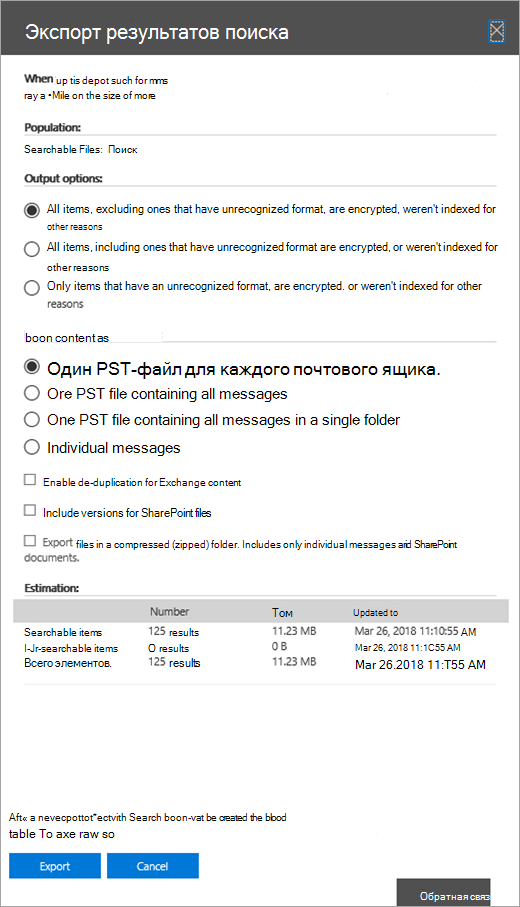

# Экспорт контента из основного дела eDiscoveryExport content from a Core eDiscovery case

После успешного запуска поиска можно экспортировать результаты поиска.After a search is successfully run, you can export the search results. При экспорте результатов поиска элементы почтового ящика загружаются в PST-файлы или в качестве отдельных сообщений.When you export search results, mailbox items are downloaded in PST files or as individual messages. При экспорте контента с сайтов SharePoint и OneDrive для бизнеса экспортируются копии документов Office и других документов.When you export content from SharePoint and OneDrive for Business sites, copies of native Office documents and other documents are exported. Также Results.csv файл, содержащий сведения о каждом экспортируемом элементе, и файл манифеста (в формате XML), содержащий сведения о каждом результате поиска.A Results.csv file that contains information about every item that's exported and a manifest file (in XML format) that contains information about every search result is also exported.
  
Вы можете экспортировать  результаты одного поиска, связанного с делом, или можно экспортировать результаты нескольких поисковых запросов, связанных [с делом.](#export-the-results-of-multiple-searches)You can export the results of a [single search associated with a case](#export-the-results-of-a-single-search) or you can export the results of [multiple searches associated with a case](#export-the-results-of-multiple-searches).
  
## Экспорт результатов одного поискаExport the results of a single search

1. Войдите и войдите, используя учетные данные для учетной записи пользователя, которая имеет соответствующие разрешения на [https://compliance.microsoft.com](https://compliance.microsoft.com) eDiscovery.Go to [https://compliance.microsoft.com](https://compliance.microsoft.com) and sign in using the credentials for user account that has been assigned the appropriate eDiscovery permissions.

2. В левой области навигации Центра соответствия требованиям Microsoft 365 щелкните "Показать **все",** а затем выберите "> основные электронные **> основные".**In the left navigation pane of the Microsoft 365 compliance center, click **Show all**, and then click **eDiscovery > Core**.

3. На странице **"Основное eDiscovery"** выберите дело, из которое нужно экспортировать результаты поиска, и нажмите кнопку **"Открыть дело".**On the **Core eDiscovery** page, select the case that you want to export search results from, and then click **Open case**.

4. На **домашней странице** дела щелкните вкладку **"Поиск".**On the **Home** page for the case, click the **Searches** tab.

5. В списке поисков по делу щелкните поиск, из который нужно экспортировать результаты поиска, а затем щелкните "Экспорт **результатов"** во flyout.In the list of searches for the case, click the search that you want to export search results from, and then click **Export results** on the flyout.

    Отображается **страница результатов** экспорта.The **Export results** page is displayed. 

    
  
    Рабочий процесс экспорта результатов поиска, связанного с основным делом eDiscovery, такой же, как экспорт результатов поиска на странице поиска **контента.**The workflow to export the results of a search associated with a Core eDiscovery case is that same as exporting the search results for a search on the **Content search** page. Пошаговая инструкция см. в [подшагове "Экспорт результатов поиска контента".](export-search-results.md)For step-by-step instructions, see [Export content search results](export-search-results.md).

    > [!NOTE]
    > При экспорте результатов поиска можно включить дублирование, чтобы экспортировать только одну копию сообщения электронной почты, даже если в почтовых ящиках, в которые был отправлен поиск, было найдено несколько экземпляров одного и того же сообщения.When you export search results, you have the option to enable de-duplication so that only one copy of an email message is exported even though multiple instances of the same message might have been found in the mailboxes that were searched. Дополнительные сведения о дублировании и обнаружении дублирующихся элементов см. в документе [De-duplication in eDiscovery search results.](de-duplication-in-ediscovery-search-results.md)For more information about de-duplication and how duplicate items are identified, see [De-duplication in eDiscovery search results](de-duplication-in-ediscovery-search-results.md).

    После начала экспорта результаты поиска будут готовы к загрузке, то есть они будут загружены в предоставленное Корпорацией Майкрософт хранилище Azure в Microsoft Cloud.After you start the export, the search results are prepared for downloading, which means they are uploaded to a Microsoft-provided Azure Storage location in the Microsoft cloud.
  
6. Щелкните **вкладку** "Экспорт", чтобы отобразить список заданий экспорта для дела.Click the **Export** tab to display the list of export jobs for the case.
  
    Может потребоваться  нажать кнопку "Обновить", чтобы обновить список заданий экспорта, чтобы в нем отображалось созданное задание экспорта.You may have to click **Refresh** to update the list of export jobs so that it shows the export job you created. Задания экспорта имеют то же имя, что и соответствующий поиск, **_Export** к имени поиска.Export jobs have the same name as the corresponding search with **_Export** appended to the search name.

7. Щелкните созданное задание экспорта, чтобы отобразить сведения о состоянии на странице flyout.Click the export job you created to display status information on the flyout page. Эти сведения включают процент элементов, которые были переданы в хранилище Azure.This information includes the percentage of items that have been transferred to the Azure Storage location.

8. После переноса всех элементов нажмите кнопку **"Скачать результаты",** чтобы скачать результаты поиска на локальный компьютер.After all items have been transferred, click **Download results** to download the search results to your local computer. Дополнительные сведения о скачии результатов поиска см. в шаге 2 ["Экспорт результатов поиска контента"](export-search-results.md#step-2-download-the-search-results)For more information downloading search results, see Step 2 in [Export content search results](export-search-results.md#step-2-download-the-search-results)

## Экспорт результатов нескольких поисковExport the results of multiple searches

В качестве альтернативы экспорту результатов одного поиска, связанного с делом, можно экспортировать результаты нескольких поисковых запросов из одного и того же случая в одном задание экспорта.As an alternative to exporting the results of a single search associated with a case, you can export the results of multiple searches from the same case in a single export job. Экспорт результатов нескольких поисковых запросов выполняется быстрее и проще, чем экспорт результатов по одному.Exporting the results of multiple searches is faster and easier than exporting the results one search at a time.
  
> [!NOTE]
> Вы не можете экспортировать результаты нескольких поисков, если один из этих поисковых запросов был настроен для поиска в расположениях на удержании.You can't export the results of multiple searches if one of those searches was configured to search locations on hold.

1. Войдите и войдите, используя учетные данные для учетной записи пользователя, которая имеет соответствующие разрешения на [https://compliance.microsoft.com](https://compliance.microsoft.com) eDiscovery.Go to [https://compliance.microsoft.com](https://compliance.microsoft.com) and sign in using the credentials for user account that has been assigned the appropriate eDiscovery permissions.

2. В левой области навигации Центра соответствия требованиям Microsoft 365 щелкните "Показать **все",** а затем выберите "> основные электронные **> основные".**In the left navigation pane of the Microsoft 365 compliance center, click **Show all**, and then click **eDiscovery > Core**.

3. На странице **"Основное eDiscovery"** выберите дело, из которое нужно экспортировать результаты поиска, и нажмите кнопку **"Открыть дело".**On the **Core eDiscovery** page, select the case that you want to export search results from, and then click **Open case**.

4. На **домашней странице** дела щелкните вкладку **"Поиск".**On the **Home** page for the case, click the **Searches** tab.
    
5. В списке поисковых запросов по этому делу выберите этот список рядом с двумя или более поисковыми запросами, из них будут экспортироваться результаты поиска.In the list of searches for the case, select the checkbox next to two or more searches you want to export search results from. 

   Появится **страница** "Массовые действия".The **Bulk actions** flyout page appears. 

    
  
6. Нажмите **кнопку "Экспорт результатов".**Click **Export results**.

   Отображается **страница результатов** экспорта.The **Export results** page is displayed. 

    
  
    На этом этапе рабочий процесс экспорта результатов нескольких поисков, связанных с основным делом eDiscovery, такой же, как экспорт результатов поиска для одного поиска.At this point, the workflow to export the results of multiple searches associated with a Core eDiscovery case is that same as exporting the search results for a single search. См. шаг 5 в предыдущем разделе.See step 5 in the previous section.

### Дополнительные сведения об экспорте результатов нескольких поисковMore information about exporting the results of multiple searches

- При экспорте результатов нескольких поисков поисковые запросы из всех поисковых запросов объединяются с помощью операторов **OR,** после чего начинается объединенный поиск.When you export the results of multiple searches, the search queries from all the searches are combined by using **OR** operators, and then the combined search is started. Предполагаемые результаты объединенного поиска отображаются на странице flyout выбранного задания экспорта.The estimated results of the combined search are displayed in the flyout page of the selected export job. Затем результаты поиска копируется в хранилище Azure в Microsoft Cloud.The search results are then copied to the Azure Storage location in the Microsoft cloud. Состояние задания копирования также отображается на странице flyout.The status of the copy job is also displayed on the flyout page. Как было сказано ранее, после копирования всех результатов поиска их можно скачать на локальный компьютер.As previously stated, after all the search results have been copied, you can download them to a local computer.

- Максимальное число ключевых слов из запросов для всех поисковых запросов, которые нужно экспортировать, составляет 500.The maximum number of keywords from queries for all searches that you want to export is 500. Это то же ограничение для одного поиска.This is the same limit for a single search. Это потому, что задание экспорта объединяет все поисковые запросы с помощью оператора **OR.**That's because the export job combines all the search queries by using the **OR** operator. Если вы превысите это ограничение, будет возвращена ошибка.If you exceed this limit, an error will be returned. В этом случае необходимо экспортировать результаты из меньшего количества поисковых запросов или упростить поисковые запросы исходных поисковых запросов, которые вы хотите экспортировать.In this case, you have to export the results from fewer searches or simplify the search queries of the original searches that you want to export.

- Экспортируемые результаты поиска у организованы по расположению контента, в которое был найден элемент.The search results that are exported are organized by the content location the item was found in. Это означает, что в расположении контента в результатах экспорта могут возвращаться элементы, возвращенные в результате различных поисковых запросов.That means a content location in the export results may have items returned by different searches. Например, если вы решите экспортировать сообщения электронной почты в один PST-файл для каждого почтового ящика, PST-файл может иметь результаты нескольких поисков.For example, if you choose to export email messages in one PST file for each mailbox, the PST file might have results from multiple searches.

- Если один и тот же элемент электронной почты или документ из одного расположения контента возвращается в ходе одного из экспортируемого поиска, экспортируется только одна копия элемента.If the same email item or document from the same content location is returned by more than one of the searches that you export, only one copy of the item will be exported.

- Вы не сможете изменить экспорт для нескольких поисковых запросов после его создания.You can't edit an export for multiple searches after you create it. Например, нельзя добавить или удалить поиск из задания экспорта.For example, you can't add or remove searches from the export job. Чтобы изменить экспорт результатов поиска, необходимо создать задание экспорта.You have to create an export job to change which search results are exported. После создания задания экспорта можно загрузить результаты только на компьютер, перезапустить экспорт или удалить задание экспорта.After an export job is created, you only can download the results to a computer, restart the export, or delete the export job.

- Если перезапустить экспорт, любые изменения в запросах поисковых запросов, которые составляют задание экспорта, не повлияют на полученные результаты поиска.If you restart the export, any changes to the queries of the searches that make up the export job won't affect the search results that are retrieved. При перезапуске экспорта будет снова запускаться то же комбинированное задание поискового запроса, которое было создано при его запуске.When you restart an export, the same combined search query job that was run when the export job was created will be run again.

- Кроме того, если перезапустить экспорт, результаты поиска, скопированные в хранилище Azure, будут перезаписывать предыдущие результаты.Also, if you restart an export, the search results that are copied to the Azure Storage location overwrites the previous results. Предыдущие скопированные результаты будут недоступны для скачивания.The previous results that were copied won't be available to be downloaded.
