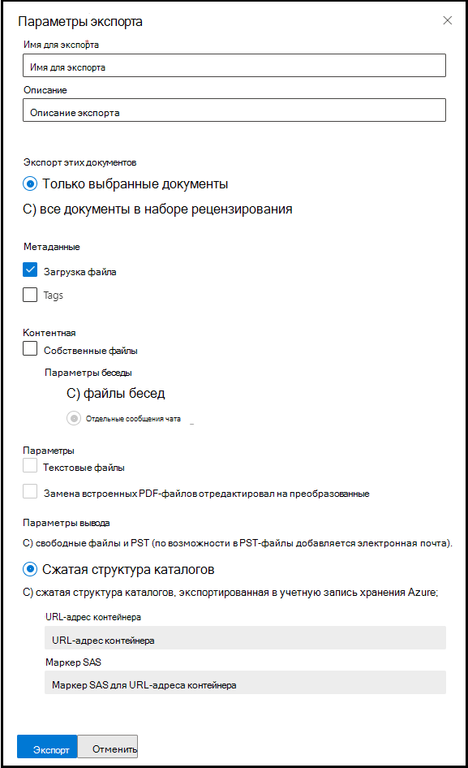

# Экспорт документов из набора обзоров в Advanced eDiscoveryExport documents from a review set in Advanced eDiscovery

Экспорт позволяет пользователям настраивать контент, включенный в пакет загрузки при экспорте документа из набора отзывов в Advanced eDiscovery.Export allows users to customize the content that is included in the download package when you export document from a review set in Advanced eDiscovery.

Экспорт документов из набора обзоров:To export documents from a review set:

1. В Центр соответствия требованиям Microsoft 365 откройте Advanced eDiscovery, выберите вкладку **Наборы** обзоров и выберите набор отзывов, который необходимо экспортировать.In the Microsoft 365 compliance center, open the Advanced eDiscovery case, select the **Review sets** tab, and then select the review set that you want to export.

2. В наборе обзоров щелкните **Действие**  >  **Экспорт**.In the review set, click **Action** > **Export**.

   Средство Экспорт отображает страницу вылетов с настройками экспорта.The Export tool displays the flyout page with the settings to configure the export. Некоторые параметры выбираются по умолчанию, но их можно изменить.Some options are selected by default, but you can change these. В следующем разделе описаны параметры экспорта, которые можно настроить.See the following section for descriptions of the export options that you can configure.

   

3. После настройки экспорта щелкните **Экспорт,** чтобы запустить процесс экспорта.After you configure the export, click **Export** to start the export process. В зависимости от выбранного в разделе **Параметры** вывода параметры, вы можете получить доступ к файлам экспорта путем прямой загрузки или в служба хранилища Azure учетной записи организации.Depending on the option that you selected in **Output options** section, you can access the export files by direct download or in your organization's Azure Storage account.

> [!NOTE]
> Рабочие места экспорта сохраняются в течение всего дела.Export jobs are retained for the life of the case. Однако необходимо скачать содержимое из задания экспорта в течение 30 дней после завершения задания экспорта.However, you must download the content from an export job within 30 days after the export job is complete.

## Параметры экспортаExport options

Чтобы настроить экспорт, используйте следующие параметры.Use the following options to configure the export. Не все параметры разрешены для некоторых выходных параметров, в частности, экспорт текстовых файлов и отредактировали PDF не допускается при экспорте в формат PST.Not all options are allowed for some output options, most notably, export of text files and redacted PDFs are not allowed when exporting to the PST format.

- **Имя экспорта.** Имя задания экспорта.**Export name**: Name of the export job. Это будет использоваться для имени файлов ZIP, которые будут загружены.This will be used to name the ZIP files that will be downloaded.

- **Описание.** Поле для свободного текста для добавления описания.**Description**: Free-text field for you to add a description.

- **Экспорт этих документов****Export these documents**

  - Только выбранные документы. Этот параметр экспортирует только выбранные документы.Selected documents only: This option exports only the documents that are currently selected. Этот параметр доступен только при выборе элементов в наборе отзывов.This option is only available when items are selected in a review set.
  
  - Все отфильтрованные документы. Этот параметр экспортирует документы в активном фильтре.All filtered documents: This option exports the documents in an active filter. Этот параметр доступен только при применении фильтра к набору отзывов.This option is only available when a filter is applied to the review set.
  
  - Все документы в наборе обзоров. Этот параметр экспортирует все документы в наборе обзоров.All documents in the review set: This option exports all documents in the review set.

- **Параметры** вывода. Экспортируемая информация доступна для скачивания непосредственно через веб-браузер или может быть отправлена в служба хранилища Azure учетную запись.**Output options**: Exported content is either available for download directly through a web browser or can be sent to an Azure Storage account. Первые два варианта позволяют напрямую скачивать.The first two options enable direct download.
  
  - Только отчеты. Создается только сводка и файл нагрузки.Reports only: Only the summary and load file are created.
  
  - Свободные файлы и PSTs (по возможности электронная почта добавляется в PSTs): Файлы экспортируются в формате, напоминаемом исходной структуре каталогов, которую пользователи видели в своих родных приложениях.Loose files and PSTs (email is added to PSTs when possible): Files are exported in a format that resembles the original directory structure seen by users in their native applications.  Дополнительные сведения см. в разделе [Loose files and PST export structure.](#loose-files-and-pst-export-structure)For more information, see the [Loose files and PST export structure](#loose-files-and-pst-export-structure) section.
  
  - Структура сжатого каталога. Файлы экспортируются и включаются в загрузку.Condensed directory structure: Files are exported and included in the download.
  
  - Структура сжатого каталога, экспортируемая в служба хранилища Azure учетную запись: файлы экспортируются в служба хранилища Azure учетную запись организации.Condensed directory structure exported to your Azure Storage account: Files are exported to your organization's Azure Storage account. Для этого параметра необходимо предоставить URL-адрес контейнера в служба хранилища Azure учетной записи для экспорта файлов.For this option, you have to provide the URL for the container in your Azure Storage account to export the files to. Вы также должны предоставить маркер подписи общего доступа (SAS) для служба хранилища Azure учетной записи.You also have to provide the shared access signature (SAS) token for your Azure Storage account. Дополнительные сведения см. [в статью Экспорт документов в наборе отзывов к служба хранилища Azure учетной записи.](download-export-jobs.md)For more information, see [Export documents in a review set to an Azure Storage account](download-export-jobs.md).

- **Include****Include**
  
  - Теги. При выборе в файл нагрузки включаются сведения о тегах.Tags: When selected, tagging information is included in the load file.
  
  - Текстовые файлы. Этот параметр включает извлеченные текстовые версии родных файлов в экспорте.Text files: This option includes the extracted text versions of native files in the export.
  
  - Замените отредактируемые туземцы преобразованными файлами PDF. Если во время проверки создаются отредактируемые ФАЙЛЫ PDF, эти файлы доступны для экспорта.Replace redacted natives with converted PDFs: If redacted PDF files are generated during review, these files are available for export. Вы можете экспортировать только личные файлы, которые были отредактировали (не выбрав этот параметр), или вы можете выбрать этот параметр для экспорта pdf-файлов, содержащих фактические отредактации.You can choose to export only the native files that were redacted (by not selecting this option) or you can select this option to export the PDF files that contain the actual redactions.

В следующих разделах описывается структура папок для свободных файлов и параметры структуры каталогов.The following sections describe the folder structure for loose files and condensed directory structure options. Экспорт разделяется на почтовые файлы с максимальным размером некомпрессируемого контента в 75 ГБ.Exports are partitioned into ZIP files with a maximum size of uncompressed content of 75 GB. Если размер экспорта меньше 75 ГБ, экспорт будет состоять из сводного файла и одного zip-файла.If the export size is less than 75 GB, the export will consist of a summary file and a single ZIP file. Для экспорта, объемом более 75 ГБ некомпрессивных данных, будет создано несколько почтовых файлов.For exports larger than 75 GB of uncompressed data, multiple ZIP files will be created. После загрузки zip-файлы можно отпечатать в одном расположении, чтобы воссоздать полный экспорт.Once downloaded, the ZIP files can be uncompressed into a single location to recreate the full export.

### Свободные файлы и структура экспорта PSTLoose files and PST export structure

При выборе этого варианта экспорта экспортируемого контента организовано в следующей структуре:If you select this export option, the exported content is organized in the following structure:

- Summary.csv: включает сводку контента, экспортируемого из набора отзывовSummary.csv: Includes a summary of the content exported from the review set

- Корневая папка. Эта папка с именем [Экспортное имя] x z.zip и будет повторяться для каждого раздела файла ZIP.Root folder: This folder in named [Export Name] x of z.zip and will be repeated for each ZIP file partition.
  
  - Export_load_file_x z.csv: файл метаданных.Export_load_file_x of z.csv: The metadata file.
  
  - Предупреждения и ошибки x из z.csv. Этот файл содержит сведения об ошибках, с которыми сталкиваются при попытке экспорта из набора отзывов.Warnings and errors x of z.csv: This file includes information about errors encountered when trying to export from the review set.
  
  - Exchange. Эта папка содержит все содержимое из Exchange, хранимые в PST-файлах.Exchange: This folder contains all content from Exchange stored in PST files. Отредактировали PDF-файлы не могут быть включены в этот параметр.Redacted PDF files cannot be included with this option. Если в наборе отзывов выбрано вложение, родительское письмо будет экспортироваться с присоединенным вложением.If an attachment is selected in the review set, the parent email will be exported with the attachment attached.
  
  - SharePoint. Эта папка содержит все родной контент из SharePoint в формате родного файла.SharePoint: This folder contains all native content from SharePoint in a native file format. Отредактировали PDF-файлы не могут быть включены в этот параметр.Redacted PDF files cannot be included with this option.

### Структура сжатого каталогаCondensed directory structure

- Summary.csv: включает сводку контента, экспортируемого из набора отзывовSummary.csv: Includes a summary of the content exported from the review set

- Корневая папка. Эта папка с именем [Экспортное имя] x z.zip и будет повторяться для каждого раздела файла ZIP.Root folder: This folder in named [Export Name] x of z.zip and will be repeated for each ZIP file partition.
  
  - Export_load_file_x z.csv: файл метаданных, а также расположение каждого файла, хранимого в файле ZIP.Export_load_file_x of z.csv: The metadata file and also includes the location of each file that is stored in the ZIP file.
  
  - Предупреждения и ошибки x из z.csv. Этот файл содержит сведения об ошибках, с которыми сталкиваются при попытке экспорта из набора отзывов.Warnings and errors x of z.csv: This file includes information about errors encountered when trying to export from the review set.

  - NativeFiles. Эта папка содержит все личные файлы, которые были экспортируются.NativeFiles: This folder contains all the native files that were exported. Файлы natives заменяются отредактируемыми PDF, если выбран параметр *Replace redacted natives с преобразованным вариантом PDFs.*Natives files are replaced with redacted PDFs if you selected the *Replace redacted natives with converted PDFs* option.
  
  - Error_files. Эта папка содержит файлы, которые имели либо извлечение, либо другую ошибку обработки.Error_files: This folder contains files that had either extraction or other processing error. Файлы будут помещаются в отдельные папки, как ExtractionError, так и ProcessingError.The files will be placed into separate folders, either ExtractionError or ProcessingError. Эти файлы перечислены в файле нагрузки.These files are listed in the load file.

  - Extracted_text_files. Эта папка содержит все извлеченные текстовые файлы, созданные при обработке.Extracted_text_files: This folder contains all of the extracted text files that were generated at processing.

### Структура сжатого каталога, экспортируемая в служба хранилища Azure учетную записьCondensed directory structure exported to your Azure Storage Account

Этот параметр использует ту же общую структуру, что и структура сжатых каталогов, однако содержимое не зажато и данные сохраняются в вашей служба хранилища Azure учетной записи.This option uses the same general structure as the *Condensed directory structure*, however the contents is not zipped and the data is saved to your Azure Storage account. Этот параметр обычно используется при работе с сторонним поставщиком электронных данных.This option is generally used when working with a third-party eDiscovery provider. Дополнительные сведения об использовании этого параметра см. в материале [Export documents in a review set to an служба хранилища Azure account.](download-export-jobs.md)For details about how to use this option, see [Export documents in a review set to an Azure Storage account](download-export-jobs.md).
