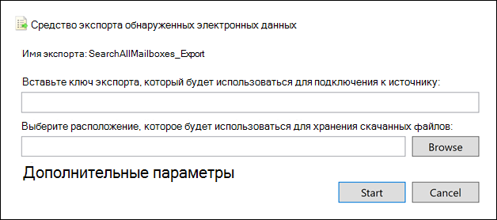

# <a name="export-content-search-results"></a>Экспорт результатов поиска контента

После успешного выполнения поиска контента можно экспортировать результаты поиска на локальный компьютер. При экспорте результатов для почты они будут скачаны на ваш компьютер в виде PST-файлов. При экспорте контента из сайтов SharePoint и OneDrive для бизнеса экспортируются копии собственных документов Office. В результаты экспортированного поиска включены другие документы и отчеты.
  
При экспорте результатов поиска контента включается подготовка результатов, а затем они загружаются на локальный компьютер.
  
## <a name="before-you-export-content-search-results"></a>Перед экспортом результатов поиска контента

- Для экспорта результатов поиска необходимо назначить роль управления экспортом в центре безопасности & соответствия требованиям. Эта роль назначается встроенной группе ролей "Руководитель службы обнаружения электронных данных". По умолчанию эта роль не назначена группе ролей "Управление организацией". Дополнительные сведения см. в статье [Назначение разрешений на обнаружение электронных данных](assign-ediscovery-permissions.md).

- Компьютер, используемый для экспорта результатов поиска, должен соответствовать указанным ниже требованиям к системе.
  
  - 32 — разрядная или 64 – разрядная версия Windows 7 и более поздних версий
  
  - Microsoft .NET Framework 4.7
  
- Для запуска средства экспорта eDiscovery<sup>1</sup>необходимо использовать один из следующих поддерживаемых браузеров:

  - Microsoft Edge <sup>2</sup>
  
    OR

  - Microsoft Internet Explorer 10 и более поздние версии
  
  > [!NOTE]
  > <sup>1</sup> . Корпорация Майкрософт не производит сторонние расширения или надстройки для приложений ClickOnce. Экспорт результатов поиска с использованием неподдерживаемого браузера со сторонними расширениями или надстройками не поддерживается.<br/>
  > <sup>2</sup> в результате последних изменений в Microsoft EDGE поддержка ClickOnce больше не включена по умолчанию. Инструкции по включению поддержки ClickOnce в пограничных пограничных приложений можно найти [в разделе Использование средства экспорта eDiscovery в Microsoft Edge](configure-edge-to-export-search-results.md).
  
- При загрузке результатов поиска (описанных в шаге 2) можно увеличить скорость загрузки, настроив параметр реестра Windows на компьютере, используемом для экспорта результатов поиска. Более подробную информацию можно узнать [в статье увеличение скорости скачивания при экспорте результатов поиска eDiscovery из Office 365](increase-download-speeds-when-exporting-ediscovery-results.md).
  
- При экспорте результатов поиска данные временно хранятся в расположении хранилища Azure в Microsoft Cloud перед его загрузкой на локальный компьютер. Убедитесь, что ваша организация может подключаться к конечной точке в Azure, т **\* . е. BLOB.Core.Windows.NET** (подстановочный знак представляет уникальный идентификатор для экспорта). Данные результатов поиска удаляются из места хранения Azure через две недели после ее создания. 
  
- Если в Организации для обмена данными с Интернетом используется прокси-сервер, необходимо определить параметры прокси-сервера на компьютере, который будет использоваться для экспорта результатов поиска (поэтому средство экспорта может пройти проверку подлинности прокси-сервером). Для этого откройте файл  *machine.config*  в расположении, соответствующем вашей версии Windows. 
  
  - **32 бит:**`%windir%\Microsoft.NET\Framework\[version]\Config\machine.config`
  
  - **64 бит:**`%windir%\Microsoft.NET\Framework64\[version]\Config\machine.config`
  
    Добавьте следующие строки в файл  *machine.config*  , расположенный между  `<configuration>`  `</configuration>` тегами и. Обязательно замените и укажите  `ProxyServer`  `Port` правильные значения для вашей организации, например  `proxy01.contoso.com:80` . 
  
    ```xml
    <system.net>
       <defaultProxy enabled="true" useDefaultCredentials="true">
         <proxy proxyaddress="https://ProxyServer :Port " 
                usesystemdefault="False" 
                bypassonlocal="True" 
                autoDetect="False" />
       </defaultProxy>
    </system.net>
    ```

## <a name="step-1-prepare-search-results-for-export"></a>Шаг 1. Подготовка результатов поиска к экспорту

Прежде всего необходимо подготовить результаты поиска для экспорта. При подготовке результатов они передаются в предоставленное Майкрософт место хранения Azure в облаке Майкрософт. Содержимое почтовых ящиков и сайтов отправляются с максимальным количеством в 2 ГБ в час.
  
1. Перейдите по ссылке [https://protection.office.com](https://protection.office.com).
  
2. Выполните вход с помощью рабочей или учебной учетной записи.
  
3. В левой области центра безопасности & соответствия **требованиям выберите Поиск** \> **контента** поиска.
  
4. На странице **Поиск контента** выберите Поиск. 
  
5. В области сведений в разделе **Экспорт результатов на компьютер** щелкните **Начать экспорт**.
  
    > [!NOTE]
    > Если результаты поиска сформированы более 7 дней назад, вам будет предложено обновить их. В этом случае отмените экспорт, в области сведений щелкните **Обновить результаты поиска** для выбранного поиска. После обновления результатов еще раз запустите экспорт.  
  
6. На странице " **Экспорт результатов поиска"** в разделе **Параметры вывода** выберите один из следующих параметров:
  
    - Все элементы, кроме тех, которые имеют неопознанный формат, шифруются или не индексируются по другим причинам
  
    - Все элементы, в том числе имеющие неопознанный формат, шифруются или не индексируются по другим причинам
  
    - Только элементы с нераспознанным форматом шифруются или не индексируются по другим причинам
  
    В разделе [More Information](#more-information) представлено описание экспорта частично индексированных элементов. Для получения дополнительных сведений об частично индексированных элементах просмотрите раздел " [частично индексированные элементы в поиске контента](partially-indexed-items-in-content-search.md)".
  
7. В разделе **Экспорт контента Exchange как** выберите один из следующих параметров:
  
    - **Один PST-файл для каждого почтового ящика:** Экспортирует один PST-файл для каждого почтового ящика пользователя, который содержит результаты поиска. Все результаты из архивного почтового ящика пользователя включаются в один и тот же PST-файл. При выборе этого варианта структура папок почтовых ящиков передается из исходного почтового ящика.
  
    - **Один PST-файл со всеми сообщениями:** Экспортирует один PST-файл (с именем *Exchange. pst*), который содержит результаты поиска из всех исходных почтовых ящиков, включенных в поиск. Этот параметр создает структуру папок почтового ящика для каждого сообщения.
  
    - **Один PST-файл, содержащий все сообщения в одной папке:** Экспортирует результаты поиска в один PST-файл, в котором все сообщения находятся в одной папке верхнего уровня. Этот параметр позволяет рецензентам просматривать элементы в хронологическом порядке (элементы сортируются по дате отправки) без необходимости перемещаться по исходной структуре папок почтовых ящиков для каждого элемента.
  
    - **Отдельные сообщения:** Экспортирует результаты поиска как отдельные сообщения электронной почты, используя формат MSG. Если выбран этот параметр, результаты поиска электронной почты экспортируются в папку в файловой системе. Путь к папке для отдельных сообщений такой же, какой использовался при экспорте результатов в PST-файлы.
  
      > [!IMPORTANT]
      > Для расшифровки сообщений, защищенных службой управления правами, при экспорте необходимо экспортировать результаты поиска по электронной почте в виде отдельных сообщений. Зашифрованные сообщения останутся зашифрованными, если вы экспортируете результаты поиска в PST-файл. Дополнительные сведения приведены в разделе [Расшифровка сообщений электронной почты, защищенных службой управления правами, и вложенных вложенных файлов](#decrypting-rms-protected-email-messages-and-encrypted-file-attachments) в этой статье.
  
8. Установите флажок **включить дедупликацию** , чтобы исключить повторяющиеся сообщения. Этот параметр отображается только в том случае, если источники контента поиска включают почтовые ящики Exchange или общедоступные папки. 
  
    При выборе этого параметра будет экспортирована только одна копия сообщения, даже если в почтовых ящиках, в которых выполнялся поиск, обнаружено несколько копий одного и того же сообщения. Отчет по результатам экспорта (Results.csv) будет содержать строку для каждой копии повторяющегося сообщения, чтобы можно было определить почтовые ящики (или общедоступные папки), содержащие копию повторяющегося сообщения. Дополнительные сведения о дедупликации и способе определения дубликатов элементов приведены в статье отмена [дублирования в результатах поиска обнаружения электронных](de-duplication-in-ediscovery-search-results.md)данных.
  
9. Установите флажок **включить версии для документов SharePoint** , чтобы экспортировать все версии документов SharePoint. Этот параметр отображается только в том случае, если в качестве источников контента для сайтов SharePoint и OneDrive для бизнеса указан Поиск. 
  
10. Чтобы экспортировать результаты поиска в сжатые папки, установите флажок **экспортировать файлы в сжатой ZIP-папке** . Этот параметр доступен только в том случае, если вы решили экспортировать элементы Exchange как отдельные сообщения, а в результаты поиска входят документы SharePoint или OneDrive. Этот параметр используется в основном для обхода ограничения числа знаков 260 в пути к файлам Windows при экспорте элементов. В разделе [Дополнительные сведения](#more-information) отображается раздел "имена файлов для экспортированных элементов". 
  
11. Нажмите кнопку **Начать экспорт**. Результаты поиска подготавливаются для загрузки, что означает, что они передаются в хранилище Azure в облаке Майкрософт. Это может занять несколько минут.

В следующем разделе приведены инструкции по загрузке экспортированных результатов поиска.
  
## <a name="step-2-download-the-search-results"></a>Шаг 2. Скачивание результатов поиска

Следующий шаг — скачать результаты поиска из места хранения Azure на локальный компьютер.
  
Как описывалось ранее, вы можете увеличить скорость загрузки, настроив параметр реестра Windows на компьютере, используемом для экспорта результатов поиска. Более подробную информацию можно узнать [в статье увеличение скорости скачивания при экспорте результатов поиска eDiscovery из Office 365](increase-download-speeds-when-exporting-ediscovery-results.md).
  
1. На странице " **Поиск контента** " перейдите на вкладку **экспорты** . 
  
   Возможно, потребуется нажать кнопку **Обновить** , чтобы обновить список заданий экспорта, чтобы отобразить созданное задание экспорта. Задания экспорта имеют то же имя, что и соответствующий поиск с **_Export** добавлен к имени поиска.
  
2. Выберите задание экспорта, созданное в шаге 1.

3. На всплывающей странице в разделе **Экспорт ключа** нажмите кнопку **Копировать в буфер обмена**. Используйте этот ключ, чтобы скачать результаты поиска.
  
4. Нажмите кнопку **Скачать результаты**.

5. Если вам будет предложено установить **средство экспорта eDiscovery**, нажмите кнопку **установить**.

6. В **средстве экспорта обнаружения электронных** данных выполните следующие действия:

   

   1. Вставьте ключ экспорта, скопированный в шаге 3, в соответствующее поле.
  
   2. Нажмите кнопку **Обзор** и укажите расположение, в которое вы хотите скачать файлы результатов поиска.
  
      > [!NOTE]
      > В связи с большим объемом дискового действия (чтения и записи) необходимо скачать результаты поиска на локальный диск. не скачивать их на сопоставленный сетевой диск или другое сетевое расположение. 
  
6. Нажмите кнопку **Пуск**, чтобы скачать результаты поиска на свой компьютер.
  
    **Средство экспорта службы обнаружения электронных данных** отображает сведения о состоянии процесса экспорта, в том числе о предполагаемом количестве (и размере) элементов, которые осталось скачать. По завершении процесса экспорта можно получить доступ к файлам в том расположении, в котором они были скачаны.

## <a name="more-information"></a>Дополнительные сведения

Ниже приведены дополнительные сведения об экспорте результатов поиска.
  
[Экспортные пределы](#export-limits)
  
[Экспорт отчетов](#export-reports)
  
[Экспорт элементов с частичным индексированием](#exporting-partially-indexed-items)

[Экспорт отдельных сообщений или PST-файлов](#exporting-individual-messages-or-pst-files)
  
[Экспорт результатов из более чем 100 000 почтовых ящиков](#exporting-results-from-more-than-100000-mailboxes)

[Расшифровка сообщений электронной почты, защищенных службой управления правами, и вложенных вложенных файлов](#decrypting-rms-protected-email-messages-and-encrypted-file-attachments)

[Имена файлов для экспортированных элементов](#filenames-of-exported-items)  
  
[Разное](#miscellaneous)
  
### <a name="export-limits"></a>Экспортные пределы
  
- Экспорт результатов поиска из центра безопасности & соответствия требованиям имеет следующие пределы:

  - Вы можете экспортировать не более 2 ТБ данных из одного поиска контента. Если результаты поиска превышают 2 ТБ, рассмотрите возможность использования диапазонов дат или других типов фильтров для уменьшения общего размера результатов поиска.
  
  - В течение одного дня Организация может экспортировать не более 2 ТБ данных.
  
  - В организации может выполняться не более 10 операций экспорта одновременно.

  - Один пользователь может одновременно выполнить не более трех операций экспорта.
  
  - Вы можете скачать результаты поиска из не более 100 000 почтовых ящиков с помощью средства экспорта eDiscovery в центре безопасности & безопасности Office 365 или в центре соответствия требованиям Microsoft 365. Чтобы скачать результаты поиска из более чем 100 000 почтовых ящиков, необходимо использовать оболочку безопасности & центре соответствия требованиям. Инструкции приведены в статье [Экспорт результатов из более чем 100 000 почтовых ящиков](#exporting-results-from-more-than-100000-mailboxes).

  > [!NOTE]
  > При экспорте только отчетов из поиска контента также учитывается число одновременно выполняемых операций экспорта, а также количество экспортируемых элементов, которые может выполнять один пользователь.
  
- Как отмечалось ранее, результаты поиска из почтовых ящиков и сайтов отправляются в предоставляемое корпорацией Майкрософт место хранения Azure (как описано в [шаге 1: подготовка результатов поиска для экспорта](#step-1-prepare-search-results-for-export)) с максимальной СКОРОСТЬЮ 2 ГБ в час.
  
- По умолчанию максимальный размер PST-файла, который можно экспортировать, составляет 10 ГБ. Это означает, что если результаты поиска из почтового ящика пользователя превышают 10 ГБ, результаты поиска для почтового ящика будут экспортированы в два (или несколько) отдельных PST-файлов. Если вы решили экспортировать все результаты поиска в один PST-файл, PST-файл будет Спилт в дополнительные PST-файлы, если общий размер результатов поиска превышает 10 ГБ. Если вы хотите изменить размер по умолчанию, вы можете изменить реестр Windows на компьютере, который будет использоваться для экспорта результатов поиска. [В разделе изменение размера PST-файлов при экспорте результатов поиска обнаружения электронных](change-the-size-of-pst-files-when-exporting-results.md)данных.
  
    Кроме того, результаты поиска из определенного почтового ящика не будут разделены на несколько PST-файлов, если только содержимое одного почтового ящика не превышает 10 ГБ. Если вы выбрали экспорт результатов поиска в один PST-файл, содержащий все сообщения в одной папке, а результаты поиска больше 10 ГБ, элементы по-прежнему организуются в хронологическом порядке, поэтому они будут Спилт в дополнительные PST-файлы на основе даты отправки.
  
### <a name="export-reports"></a>Экспорт отчетов
  
- При экспорте результатов поиска в дополнение к результатам поиска включаются следующие отчеты.
  
  - **Сводка по экспорту** Документ Excel, который содержит сводку по экспорту. Сюда входят такие сведения, как количество искомых источников контента, предполагаемый и загруженный объем результатов поиска, а также оценочное и загруженное число экспортированных элементов.
  
  - **Manifest** Файл манифеста (в формате XML), который содержит сведения о каждом элементе, включенном в результаты поиска.
  
  - **Результаты** Документ Excel, который содержит сведения о каждом элементе, загружаемом в виде результатов поиска. При выполнении поиска в почте журнал результатов содержит сведения о каждом сообщении, включая указанные ниже.
  
    - Расположение сообщения в исходном почтовом ящике (включая сведения о том, в каком почтовом ящике находится сообщение, в основном или в архивном).
  
    - Дата отправки или получения сообщения.

    - Тема сообщения.

    - Отправитель и получатели сообщения.

    - Указывает, является ли сообщение повторяющимся, если при экспорте результатов поиска включен параметр отмены дублирования. Повторяющиеся сообщения имеют значение в столбце " **дублировать в элемент** ", которое идентифицирует сообщение как повторяющееся. Значение в столбце " **дублировать в элемент** " содержит идентификатор элемента для экспортированного сообщения. Дополнительные сведения приведены в статье отмена [дублирования в результатах поиска обнаружения электронных](de-duplication-in-ediscovery-search-results.md)данных.

      Для документов из сайтов SharePoint и OneDrive для бизнеса журнал результатов содержит сведения о каждом документе, включая:

      - URL-адрес документа.

      - URL-адрес семейства веб-сайтов, в котором расположен документ.

      - Дата последнего изменения документа.

      - Имя документа (которое указано в столбце "Тема" журнала результатов).

  - **Неиндексированные элементы** Документ Excel, который содержит сведения об частично индексированных элементах, которые будут включены в результаты поиска. Если вы не включаете частично индексированные элементы при создании отчета по результатам поиска, этот отчет по-прежнему будет скачан, но будет пустым.

  - **Ошибки и предупреждения** Содержит ошибки и предупреждения для файлов, обнаруженных во время экспорта. В столбце сведения об ошибке представлены сведения об отдельных ошибках и предупреждениях.

  - **Пропущенные элементы** При экспорте результатов поиска из сайтов SharePoint и OneDrive для бизнеса в экспорте обычно включается отчет о пропущенных элементах (SkippedItems.csv). Элементы, упоминаемые в этом отчете, обычно не загружаются, например папка или набор документов. Не экспортировать эти типы элементов по проектированию. Для других элементов, которые были пропущены, в поле "тип ошибки" и "сведения об ошибке" в отчете пропущенные элементы отображается причина, по которой элемент был пропущен и не был загружен с другими результатами поиска.

  - **Журнал трассировки** Содержит подробные сведения о процессе экспорта и может помочь открывать проблемы при экспорте.
  
    > [!NOTE]
    > Вы можете просто экспортировать эти документы, не экспортируя фактических результатов поиска. Ознакомьтесь [со статьей экспорт отчета о поиске контента](export-a-content-search-report.md). 
  
### <a name="exporting-partially-indexed-items"></a>Экспорт элементов с частичным индексированием
  
- Если вы экспортируете элементы почтового ящика из поиска контента, возвращающего все элементы почтового ящика в результатах поиска (так как ключевые слова, включенные в поисковый запрос), частично индексированные элементы не будут скопированы в PST-файл, содержащий неиндексированные элементы. Это связано с тем, что все элементы, включая частично индексированные элементы, автоматически включаются в обычные результаты поиска. Это означает, что частично индексированные элементы будут включены в PST-файл (или как отдельные сообщения), которые содержат другие индексированные элементы.

    При экспорте индексированных и частично индексированных элементов, а также при экспорте только индексированных элементов из поиска контента, возвращающего все элементы, будет загружено такое же количество элементов. Это происходит даже несмотря на то, что оценочные результаты поиска контента (отображаемые в статистике поиска в центре безопасности & соответствия требованиям) будут по-прежнему содержать отдельную оценку количества частично индексированных элементов. Например, предположим, что оценка поиска, включающего все элементы (без ключевых слов в поисковом запросе), показывает, что найдены элементы 1 000, а также обнаружены 200 частично индексированных элементов. В этом случае элементы 1 000 содержат частично индексированные элементы, так как поиск возвращает все элементы. Другими словами, существует 1 000 элементов, возвращенных поиском, а не 1 200 элементов (как можно было бы ожидать). Если вы экспортируете результаты этого поиска и выбираете экспортировать индексированные и частично индексированные элементы (или экспортировать только частично индексированные элементы), то загрузится 1 000 элементов. Опять же, это связано с тем, что частично индексированные элементы включаются в обычные (индексированные) результаты при использовании пустого поискового запроса для возврата всех элементов. В этом же примере, если выбран экспорт только частично индексированных элементов, будут скачаны только неиндексированные элементы 200.

    Обратите внимание, что в предыдущем примере (при экспорте индексированных и частично индексированных элементов или при экспорте только индексированных элементов) **сводный отчет по экспорту** , включенный в результаты экспортированного поиска, 1 000 будет включать в себя оценочные элементы и 1 000 Скачанные элементы по тем же причинам, как описано выше. 

- Если при экспорте результатов выполняется поиск определенных расположений контента или всех расположений содержимого в Организации, будут экспортированы только частичные элементы из расположений контента, содержащих элементы, соответствующие условиям поиска. Другими словами, если результаты поиска не найдены в почтовом ящике или на сайте, то все частично индексированные элементы в этом почтовом ящике или на сайте не будут экспортированы. Причина этого заключается в том, что экспорт элементов с частичным индексированием из большого количества расположений в Организации может увеличить вероятность ошибок экспорта и увеличить время, необходимое для экспорта и загрузки результатов поиска.

    Чтобы экспортировать частично индексированные элементы из всех расположений содержимого для поиска, настройте поиск, чтобы вернуть все элементы (удалив все ключевые слова из поискового запроса), а затем экспортируйте только частично индексированные элементы при экспорте результатов поиска.

    
  
- При экспорте результатов поиска из сайтов SharePoint или OneDrive для бизнеса возможность экспорта неиндексированных элементов зависит от выбранного варианта экспорта, а также от того, содержит ли искомый сайт индексированный элемент, соответствующий условиям поиска. Например, если вы ищете конкретные сайты SharePoint или OneDrive для бизнеса, а результаты поиска не найдены, то Неиндексируемые элементы на этих сайтах будут экспортированы, если выбрать второй вариант экспорта для экспорта как индексированных, так и неиндексированных элементов. Если индексированный элемент сайта не отвечает критериям поиска, все неиндексированные элементы этого сайта будут экспортированы при экспорте индексированных и неиндексированных элементов. На следующем рисунке описываются варианты экспорта в зависимости от того, содержит ли сайт индексированный элемент, соответствующий условиям поиска.

    

    1. Экспортируются только индексированные элементы, которые отвечают условиям поиска. Частично индексированные элементы не экспортируются.

    2. Если ни один из индексируемых элементов сайта не соответствует критериям поиска, то частично индексированные элементы из этого сайта не экспортируются. Если в результатах поиска возвращаются индексированные элементы сайта, экспортируются частично индексированные элементы этого сайта. Другими словами, экспортируются только частично индексированные элементы из сайтов, содержащих элементы, которые отвечают условиям поиска.

    3. Все частично индексированные элементы со всех сайтов, в которых выполняется поиск, экспортируются независимо от того, содержит ли сайт элементы, удовлетворяющие условиям поиска.

    При экспорте частично индексированных элементов почтовые ящики с частичным индексированием экспортируются в отдельный PST-файл независимо от того, какой параметр выбран в разделе **Экспорт контента Exchange как**.

- Если в результатах поиска возвращаются частично индексированные элементы (так как другие свойства элементов с частичным индексированием соответствуют критериям поиска), то эти частично индексированные данные экспортируются с обычными результатами поиска. Таким образом, если вы решили экспортировать как индексированные элементы, так и элементы с частичным индексированием (выбрав **все элементы, в том числе те, которые имеют неопознанный формат, шифруются или не индексируются для других причин** экспорта), частично индексированные элементы, экспортированные с обычными результатами, будут перечислены в отчете о Results.csv. Они не будут отображаться в отчете о неиндексированных items.csv.
  
### <a name="exporting-individual-messages-or-pst-files"></a>Экспорт отдельных сообщений или PST-файлов
  
- Если имя пути к файлу сообщения превышает максимальное число символов для Windows, путь к файлу усекается. Кроме того, имя исходного пути будет указано в файле MANIFEST и Ресултслог.
  
- Как было сказано выше, результаты поиска по электронной почте экспортируются в папку в файловой системе. Путь к папке для отдельных сообщений реплицирует путь к папке в почтовом ящике пользователя. Например, для поиска по имени "ContosoCase101" сообщения в папке "Входящие" пользователя будут находиться в папке "путь"  `~ContosoCase101\\<date of export\Exchange\user@contoso.com (Primary)\Top of Information Store\Inbox` .

- Если вы решили экспортировать сообщения электронной почты в одном PST-файле, содержащем все сообщения в одной папке, папка " **Удаленные** " и папка " **папки поиска** " будут включены в верхний уровень папки PST. Эти папки пусты.

- Как было сказано ранее, необходимо экспортировать результаты поиска по электронной почте в виде отдельных сообщений для расшифровки сообщений, защищенных службой управления правами, при их экспорте. Зашифрованные сообщения останутся зашифрованными, если вы экспортируете результаты поиска по электронной почте в виде PST-файла.
  
### <a name="exporting-results-from-more-than-100000-mailboxes"></a>Экспорт результатов из более чем 100 000 почтовых ящиков

- Как описывалось ранее, для загрузки результатов поиска из более чем 100 000 почтовых ящиков необходимо использовать оболочку безопасности центра соответствия требованиям &. Чтобы скачать результаты поиска, можно выполнить следующий сценарий в этом разделе. При использовании этого сценария предполагается, что вы уже выполнили экспорт результатов поиска (задание экспорта отображается на вкладке **экспорты** средства поиска контента) и теперь необходимо скачать их.

   ```powershell
   $export=Get-ComplianceSearchAction SEARCHNAME_Export -IncludeCredential;
   $exportUrl=   [System.Uri]::EscapeDataString(($export.Results.Split(";") | ?{$_ -like '*Container url*'} | %{$_.Split(":",2)} | select -last 1).Trim());
   $exportToken=($export.Results.Split(";") | ?{$_ -like '*SAS Token*'} | %{$_.Split(":",2)} | select -last 1).Trim();
   ."$env:ProgramFiles\Internet Explorer\IEXPLORE.EXE" "https://complianceclientsdf.blob.core.windows.net/v16/Microsoft.Office.Client.Discovery.UnifiedExportTool.application?name=$($export.Name)&source=$exportUrl&zip=allow&trace=1";
   $exportToken | clip;
   ```

  В скрипте необходимо указать имя поиска, для которого требуется экспортировать результаты. Например, для поиска с именем `SearchAllMailboxes` замените SEARCHNAME_Export на `SearchAllMailboxes_Export` .

  После добавления имени поиска в скрипт можно скопировать его, а затем вставить в окно Windows PowerShell, [подключенное к системе безопасности & центра соответствия требованиям PowerShell](https://docs.microsoft.com/powershell/exchange/connect-to-scc-powershell). После вставки сценария отображается средство экспорта eDiscovery (например, при загрузке результатов поиска с помощью пользовательского интерфейса):

  

  Щелкните поле экспорт ключа, а затем нажмите, `CTRL + V` чтобы вставить ключ экспорта (сценарий копирует ключ экспорта в буфер обмена). Нажмите кнопку **Обзор** , чтобы указать расположение, в которое вы хотите скачать файлы, а затем начните загрузку.

  Как было сказано выше, мы рекомендуем загружать результаты поиска на локальный диск в связи с большим объемом дискового действия (чтение и запись). Не скачивать результаты поиска на сопоставленный сетевой диск или другое сетевое расположение.

### <a name="decrypting-rms-protected-email-messages-and-encrypted-file-attachments"></a>Расшифровка сообщений электронной почты, защищенных службой управления правами, и вложенных вложенных файлов

Любые сообщения электронной почты, защищенные с помощью службы управления правами (RMS), включенные в результаты поиска контента, будут расшифрованы при их экспорте. Кроме того, любой файл, зашифрованный с помощью [технологии шифрования Майкрософт](encryption.md) и присоединенный к сообщению электронной почты, включенному в результаты поиска, также будет расшифрован при экспорте. Эта возможность расшифровки включена по умолчанию для членов группы ролей "Диспетчер обнаружения электронных данных". Это связано с тем, что роль управления по расшифрованию службы управления правами по умолчанию назначается этой группе ролей. При экспорте зашифрованных сообщений электронной почты и вложений следует учитывать следующие моменты.
  
- Как описывалось ранее, для расшифровки сообщений, защищенных службой управления правами, при их экспорте необходимо экспортировать результаты поиска как отдельные сообщения. Если вы экспортируете результаты поиска в PST-файл, защищенные RMS сообщения будут зашифрованы.

- Расшифрованные сообщения определяются в отчете **ресултслог** . Этот отчет содержит столбец с именем " **состояние расшифровки**", а значение, которое **раскодируется** в этом столбце, определяет сообщения, которые были расшифрованы.

- В дополнение к расшифровке вложенных файлов при экспорте результатов поиска можно также выполнить предварительный просмотр расшифрованного файла при просмотре результатов поиска. Сообщение электронной почты, защищенное с помощью прав, можно просмотреть только после его экспорта.

- В настоящее время функция расшифровки при экспорте результатов поиска не включает зашифрованные данные из сайтов SharePoint и OneDrive для бизнеса. Однако поддержка скоро будет доступна для документов, зашифрованных с помощью технологий шифрования Майкрософт и хранящихся в SharePoint Online и OneDrive для бизнеса.

- Если необходимо предотвратить расшифровку сообщений, защищенных службой управления правами, и вложенных вложенных файлов, необходимо создать настраиваемую группу ролей (путем копирования встроенной группы ролей "Диспетчер eDiscovery"), а затем удалить роль управления расшифровкой RMS из настраиваемой группы ролей. Затем добавьте пользователя, которому не нужно расшифровывать сообщения в качестве члена настраиваемой группы ролей.
  
### <a name="filenames-of-exported-items"></a>Имена файлов для экспортированных элементов
  
- Длина полного пути для сообщений электронной почты и документов сайта, экспортированных на локальный компьютер, составляет 260 символов (накладывается операционной системой). Полное имя пути для экспортируемых элементов содержит исходное расположение элемента и расположение папки на локальном компьютере, в который были загружены результаты поиска. Например, если вы загружаете результаты поиска  `C:\Users\Admin\Desktop\SearchResults` в средство экспорта eDiscovery, то полный путь к скачанному элементу электронной почты будет иметь значение  `C:\Users\Admin\Desktop\SearchResults\ContentSearch1\03.15.2017-1242PM\Exchange\sarad@contoso.com (Primary)\Top of Information Store\Inbox\Insider trading investigation.msg` .

    Если превышено ограничение в 260 символов, полное имя пути для элемента будет усечено.

  - Если длина полного пути превышает 260 символов, имя файла будет укорочено, чтобы получить значение в пределах этого ограничения; Обратите внимание, что сокращенное имя файла (за исключением расширения файла) не может быть меньше восьми символов.

  - Если после сокращения имени файла полное имя пути по-прежнему слишком длинное, элемент перемещается из текущего расположения в родительскую папку. Если путь имеет слишком большую длину, процесс повторяется: Сократите имя файла и при необходимости переместите его в родительскую папку. Этот процесс повторяется до тех пор, пока длина полного пути не превышает 260 символов.

  - Если сокращенный полный путь уже существует, в конец имени добавляется номер версии. Пример:  `statusmessage(2).msg` .

    Чтобы устранить эту ошибку, рассмотрите возможность загрузки результатов поиска в расположение с кратким именем пути; Например, Загрузка результатов поиска в указанную папку  `C:\Results` приведет к уменьшению числа символов в именах путей экспортируемых элементов, чем загружать их в папку с именем  `C:\Users\Admin\Desktop\Results` .

- При экспорте документов сайта также может быть изменено исходное имя файла документа. Это происходит специально для документов, которые были удалены с сайта SharePoint или OneDrive для бизнеса, который был включен в удержание. После удаления документа, который находится на сайте, который находится на удержании, удаленный документ автоматически перемещается в библиотеку хранения хранения для сайта (который был создан, когда сайт был помещен на удержание). Когда удаленный документ перемещается в библиотеку хранения хранения, к исходному имени документа добавляется случайный и уникальный идентификатор. Например, если имя файла документа  `FY2017Budget.xlsx` и этот документ впоследствии удаляется и перемещается в библиотеку хранения хранения, имя файла документа, который перемещается в библиотеку хранения хранения, изменяется на что-то вроде  `FY2017Budget_DEAF727D-0478-4A7F-87DE-5487F033C81A2000-07-05T10-37-55.xlsx` . Если документ в библиотеке хранения хранения соответствует запросу поиска контента и вы экспортируете результаты этого поиска, экспортируемый файл будет иметь измененное имя файла; в этом примере имя файла экспортируемого документа —  `FY2017Budget_DEAF727D-0478-4A7F-87DE-5487F033C81A2000-07-05T10-37-55.xlsx` .

    При изменении документа на сайте, который находится на удержании (и при включении управления версиями для библиотеки документов на сайте), копия файла автоматически создается в библиотеке хранения хранения. В этом случае случайным образом созданный и уникальный идентификатор также добавляется в имя файла документа, который копируется в библиотеку хранения хранения.

    Причина, по которой имена файлов документов, которые перемещаются или копируются в библиотеку хранения хранения, запрещает конфликт имен файлов. Дополнительные сведения о размещении удержания на сайтах и в библиотеке хранения архивов приведены [в статье Обзор хранения на месте в SharePoint Server 2016](https://support.office.com/article/5e400d68-cd51-444a-8fe6-e4df1d20aa95).

### <a name="miscellaneous"></a>Разное
  
- Все результаты поиска и отчеты об экспорте содержатся в папке, имя которой совпадает с именем поиска контента. Экспортированные письма расположены в папке с именем **Exchange**. Документы расположены в папке с именем **SharePoint**.

- Метаданные файловой системы для документов на сайтах SharePoint и OneDrive для бизнеса поддерживаются при экспорте документов на локальный компьютер. Это означает, что при экспорте документов их свойства, например даты создания и последнего изменения, не изменяются.

- Если результаты поиска включают в себя элемент списка из SharePoint, который соответствует поисковому запросу, все строки в списке будут экспортированы в дополнение к элементу, соответствующему поисковому запросу и любому вложению в списке. Причина такого поведения состоит в том, чтобы предоставить контекст для элементов списка, возвращаемых в результатах поиска. Кроме того, обратите внимание, что дополнительные элементы списков и вложения могут привести к тому, что количество экспортированных элементов будет отличаться от первоначальной оценки результатов поиска.
