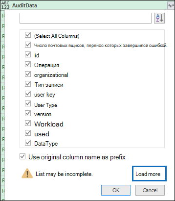

# <a name="export-configure-and-view-audit-log-records"></a><span data-ttu-id="c9275-105">Экспорт, настройка и просмотр записей журнала аудита</span><span class="sxs-lookup"><span data-stu-id="c9275-105">Export, configure, and view audit log records</span></span>

<span data-ttu-id="c9275-106">После поиска в журнале аудита и скачивания результатов поиска в CSV-файл он содержит столбец с именем **аудитдата**, который содержит дополнительные сведения о каждом событии.</span><span class="sxs-lookup"><span data-stu-id="c9275-106">After you search the audit log and download the search results to a CSV file, the file contains a column named **AuditData**, which contains additional information about each event.</span></span> <span data-ttu-id="c9275-107">Данные в этом столбце отформатированы как объект JSON, который содержит несколько свойств, которые настроены как пары *свойство: значение* , разделенные запятыми.</span><span class="sxs-lookup"><span data-stu-id="c9275-107">The data in this column is formatted as a JSON object, which contains multiple properties that are configured as *property:value* pairs separated by commas.</span></span> <span data-ttu-id="c9275-108">Можно использовать функцию преобразования JSON в редакторе Power Query в Excel, чтобы разделить каждое свойство в объекте JSON в столбце **аудитдата** на несколько столбцов, чтобы каждое свойство было иметь собственный столбец.</span><span class="sxs-lookup"><span data-stu-id="c9275-108">You can use the JSON transform feature in the Power Query Editor in Excel to split each property in the JSON object in the **AuditData** column into multiple columns so that each property has its own column.</span></span> <span data-ttu-id="c9275-109">Это позволяет сортировать и фильтровать по одному или нескольким из этих свойств, которые могут помочь быстро найти конкретные искомые данные аудита.</span><span class="sxs-lookup"><span data-stu-id="c9275-109">This lets you sort and filter on one or more of these properties, which can help you quickly locate the specific auditing data you're looking for.</span></span>

## <a name="step-1-export-audit-log-search-results"></a><span data-ttu-id="c9275-110">Шаг 1: экспорт результатов поиска в журнал аудита</span><span class="sxs-lookup"><span data-stu-id="c9275-110">Step 1: Export audit log search results</span></span>

<span data-ttu-id="c9275-111">Первый шаг — Поиск в журнале аудита, а затем Экспорт результатов в файл с разделителями-запятыми (CSV) на локальный компьютер.</span><span class="sxs-lookup"><span data-stu-id="c9275-111">The first step is to search the audit log and then export the results in a comma-separated value (CSV) file to your local computer.</span></span>
  
1. <span data-ttu-id="c9275-112">Выполните [Поиск по журналу аудита](search-the-audit-log-in-security-and-compliance.md#search-the-audit-log) и изменяйте критерии поиска, если это необходимо, до тех пор, пока не получите нужные результаты.</span><span class="sxs-lookup"><span data-stu-id="c9275-112">Run an [audit log search](search-the-audit-log-in-security-and-compliance.md#search-the-audit-log) and revise the search criteria if necessary until you have the desired results.</span></span>

2. <span data-ttu-id="c9275-113">Нажмите кнопку **Экспорт результатов** и выберите **скачать все результаты**.</span><span class="sxs-lookup"><span data-stu-id="c9275-113">Click **Export results** and select **Download all results**.</span></span> 

   

   <span data-ttu-id="c9275-115">Этот параметр экспортирует все записи аудита из поиска журнала аудита, выполненного на шаге 1, и загружает необработанные данные из журнала аудита в CSV-файл.</span><span class="sxs-lookup"><span data-stu-id="c9275-115">This option to exports all the audit records from the audit log search you ran in step 1, and downloads the raw data from the audit log to a CSV file.</span></span> 

   <span data-ttu-id="c9275-116">В нижней части окна отобразится сообщение с предложением открыть или сохранить CSV-файл.</span><span class="sxs-lookup"><span data-stu-id="c9275-116">A message is displayed at the bottom of the window that prompts you to open or save the CSV file.</span></span> 

3. <span data-ttu-id="c9275-117">Нажмите кнопку **сохранить > сохранить как** и сохраните CSV-файл на локальном компьютере.</span><span class="sxs-lookup"><span data-stu-id="c9275-117">Click **Save > Save as** and save the CSV file to your local computer.</span></span> <span data-ttu-id="c9275-118">Загрузка множества результатов поиска занимает некоторое время.</span><span class="sxs-lookup"><span data-stu-id="c9275-118">It takes a while to download many search results.</span></span> <span data-ttu-id="c9275-119">Обычно это относится к поиску всех действий или широкому диапазону дат.</span><span class="sxs-lookup"><span data-stu-id="c9275-119">This is typically the case when searching for all activities or a broad date range.</span></span> <span data-ttu-id="c9275-120">Сообщение в нижней части окна отображается после завершения загрузки CSV-файла.</span><span class="sxs-lookup"><span data-stu-id="c9275-120">A message at the bottom of the windows is displayed when the CSV file is finished downloading.</span></span>

   

> [!NOTE]
  > <span data-ttu-id="c9275-122">В CSV-файл можно загрузить до 50 000 записей результатов одной операции поиска по журналу аудита.</span><span class="sxs-lookup"><span data-stu-id="c9275-122">You can download a maximum of 50,000 entries to a CSV file from a single audit log search.</span></span> <span data-ttu-id="c9275-123">Если в CSV-файл загружено 50 000 записей, можно предположить, что условиям поиска соответствует более 50 000 событий.</span><span class="sxs-lookup"><span data-stu-id="c9275-123">If 50,000 entries are downloaded to the CSV file, you can probably assume there are more than 50,000 events that met the search criteria.</span></span> <span data-ttu-id="c9275-124">Чтобы экспортировать больше этого ограничения, попробуйте использовать диапазон дат, чтобы уменьшить количество записей в журнале аудита.</span><span class="sxs-lookup"><span data-stu-id="c9275-124">To export more than this limit, try using a date range to reduce the number of audit log records.</span></span> <span data-ttu-id="c9275-125">Чтобы экспортировать больше 50 000 записей, вы можете выполнить поиск несколько раз со смежными диапазонами дат.</span><span class="sxs-lookup"><span data-stu-id="c9275-125">You might have to run multiple searches with smaller date ranges to export more than 50,000 entries.</span></span>

## <a name="step-2-format-the-exported-audit-log-using-the-power-query-editor"></a><span data-ttu-id="c9275-126">Шаг 2: форматирование экспортированного журнала аудита с помощью редактора Power Query</span><span class="sxs-lookup"><span data-stu-id="c9275-126">Step 2: Format the exported audit log using the Power Query Editor</span></span>

<span data-ttu-id="c9275-127">Следующий шаг — использование функции преобразования JSON в редакторе Power Query в Excel, чтобы разделить каждое свойство в объекте JSON в столбце **аудитдата** на отдельный столбец.</span><span class="sxs-lookup"><span data-stu-id="c9275-127">The next step is to use the JSON transform feature in the Power Query Editor in Excel to split each property in the JSON object in the **AuditData** column into its own column.</span></span> <span data-ttu-id="c9275-128">Затем вы фильтруете столбцы, чтобы просматривать записи на основе значений определенных свойств.</span><span class="sxs-lookup"><span data-stu-id="c9275-128">Then you filter columns to view records based on the values of specific properties.</span></span> <span data-ttu-id="c9275-129">Это поможет быстро найти конкретные искомые данные аудита.</span><span class="sxs-lookup"><span data-stu-id="c9275-129">This can help you quickly locate the specific auditing data you're looking for.</span></span>

1. <span data-ttu-id="c9275-130">Откройте пустую книгу в Excel для Office 365, Excel 2019 или Excel 2016.</span><span class="sxs-lookup"><span data-stu-id="c9275-130">Open a blank workbook in Excel for Office 365, Excel 2019, or Excel 2016.</span></span>

2. <span data-ttu-id="c9275-131">На вкладке **данные** в группе " **Получение & преобразования данных** " щелкните **из текстового/CSV-** файла.</span><span class="sxs-lookup"><span data-stu-id="c9275-131">On the **Data** tab, in the **Get & Transform Data** ribbon group, click **From Text/CSV**.</span></span>

    

3. <span data-ttu-id="c9275-133">Откройте CSV-файл, скачанный в действии 1.</span><span class="sxs-lookup"><span data-stu-id="c9275-133">Open the CSV file that you downloaded in Step 1.</span></span>

4. <span data-ttu-id="c9275-134">В появившемся окне нажмите кнопку **преобразовать данные**.</span><span class="sxs-lookup"><span data-stu-id="c9275-134">In the window that's displayed, click **Transform Data**.</span></span>

   

   <span data-ttu-id="c9275-136">CSV-файл открывается в **редакторе запросов**.</span><span class="sxs-lookup"><span data-stu-id="c9275-136">The CSV file is opened in the **Query Editor**.</span></span> <span data-ttu-id="c9275-137">Существует четыре столбца: **CreationDate**, **UserID**, **Operations**и **аудитдата**.</span><span class="sxs-lookup"><span data-stu-id="c9275-137">There are four columns: **CreationDate**, **UserIds**, **Operations**, and **AuditData**.</span></span> <span data-ttu-id="c9275-138">Столбец **аудитдата** — это объект JSON, который содержит несколько свойств.</span><span class="sxs-lookup"><span data-stu-id="c9275-138">The **AuditData** column is a JSON object that contains multiple properties.</span></span> <span data-ttu-id="c9275-139">Следующий шаг — создание столбца для каждого свойства в объекте JSON.</span><span class="sxs-lookup"><span data-stu-id="c9275-139">The next step is to create a column for each property in the JSON object.</span></span>

5. <span data-ttu-id="c9275-140">Щелкните правой кнопкой мыши заголовок в столбце **аудитдата** , выберите команду **преобразовать**, а затем — **JSON**.</span><span class="sxs-lookup"><span data-stu-id="c9275-140">Right-click the title in the **AuditData** column, click **Transform**, and then click **JSON**.</span></span> 

   

6. <span data-ttu-id="c9275-142">В правом верхнем углу столбца **аудитдата** щелкните значок развернуть.</span><span class="sxs-lookup"><span data-stu-id="c9275-142">In the upper-right corner of the **AuditData** column, click the expand icon.</span></span>

   

   <span data-ttu-id="c9275-144">Отображается неполный список свойств в объектах JSON в столбце **аудитдата** .</span><span class="sxs-lookup"><span data-stu-id="c9275-144">A partial list of the properties in the JSON objects in the **AuditData** column is displayed.</span></span>

7. <span data-ttu-id="c9275-145">Нажмите кнопку **загрузить еще** , чтобы отобразить все свойства в объектах JSON в столбце **аудитдата** .</span><span class="sxs-lookup"><span data-stu-id="c9275-145">Click **Load more** to display all properties in the JSON objects in the **AuditData** column.</span></span>

   

   <span data-ttu-id="c9275-147">Вы можете снять флажок рядом со свойством, которое вы не хотите включать.</span><span class="sxs-lookup"><span data-stu-id="c9275-147">You can unselect the checkbox next to any property that you don't want to include.</span></span> <span data-ttu-id="c9275-148">Удаление столбцов, которые не подходят для расследования, — это хороший способ уменьшить объем данных, отображаемых в журнале аудита.</span><span class="sxs-lookup"><span data-stu-id="c9275-148">Eliminating columns that aren't useful for your investigation is a good way to reduce the amount of data displayed in the audit log.</span></span> 

   > [!NOTE]
   > <span data-ttu-id="c9275-149">Свойства JSON, отображаемые на предыдущем снимке экрана (после нажатия кнопки **загрузить больше**), основываются на свойствах, найденных в столбце **аудитдата** из первых 1 000 строк в CSV-файле.</span><span class="sxs-lookup"><span data-stu-id="c9275-149">The JSON properties displayed in the previous screenshot (after you click **Load more**) are based on the properties found in the **AuditData** column from the first 1,000 rows in the CSV file.</span></span> <span data-ttu-id="c9275-150">Если в записях есть различные свойства JSON в записях после первой строки 1 000, эти свойства (и соответствующий столбец) не будут включены при разбиении столбца **аудитдата** на несколько столбцов.</span><span class="sxs-lookup"><span data-stu-id="c9275-150">If there are different JSON properties in records after the first 1,000 rows, these properties (and a corresponding column) won't be included when the **AuditData** column is split into multiple columns.</span></span> <span data-ttu-id="c9275-151">Чтобы избежать этого, рассмотрите возможность повторного запуска поиска в журнале аудита и сужения критериев поиска, чтобы возвращалось меньше записей.</span><span class="sxs-lookup"><span data-stu-id="c9275-151">To help prevent this, consider re-running the audit log search and narrow the search criteria so that fewer records are returned.</span></span> <span data-ttu-id="c9275-152">Другим обходным решением является фильтрация элементов в столбце " **операции** " для сокращения числа строк (перед выполнением шага 5 перед преобразованием объекта JSON в столбец **аудитдата**</span><span class="sxs-lookup"><span data-stu-id="c9275-152">Another workaround is to filter items in the **Operations** column to reduce the number of rows (before you perform step 5 above) before transforming the JSON object in the **AuditData** column.</span></span>

8. <span data-ttu-id="c9275-153">Выполните одно из следующих действий, чтобы отформатировать название столбцов, добавляемых для каждого выбранного свойства JSON.</span><span class="sxs-lookup"><span data-stu-id="c9275-153">Do one of the following things to format the title of the columns that are added for each JSON property that's selected.</span></span>

    - <span data-ttu-id="c9275-154">Снимите флажок **использовать исходное имя столбца в качестве префикса** , чтобы использовать имя свойства JSON в качестве имен столбцов; Например, **RecordType** или **саурцефиленаме**.</span><span class="sxs-lookup"><span data-stu-id="c9275-154">Unselect the **Use original column name as prefix** checkbox to use the name of the JSON property as the column names; for example, **RecordType** or **SourceFileName**.</span></span>

    - <span data-ttu-id="c9275-155">Для добавления префикса Аудитдата в имена столбцов оставьте установленным флажок **использовать исходное имя столбца в качестве префикса** ; Например, **аудитдата. RecordType** или **аудитдата. саурцефиленаме**.</span><span class="sxs-lookup"><span data-stu-id="c9275-155">Leave the **Use original column name as prefix** checkbox selected to add the AuditData prefix to the column names; for example, **AuditData.RecordType** or **AuditData.SourceFileName**.</span></span>

9. <span data-ttu-id="c9275-156">Нажмите кнопку **ОК**.</span><span class="sxs-lookup"><span data-stu-id="c9275-156">Click **OK**.</span></span>

    <span data-ttu-id="c9275-157">Столбец **аудитдата** разделяется на несколько столбцов.</span><span class="sxs-lookup"><span data-stu-id="c9275-157">The **AuditData** column is split into multiple columns.</span></span> <span data-ttu-id="c9275-158">Каждый новый столбец соответствует свойству в объекте Аудитдата JSON.</span><span class="sxs-lookup"><span data-stu-id="c9275-158">Each new column corresponds to a property in the AuditData JSON object.</span></span> <span data-ttu-id="c9275-159">Каждая строка в столбце содержит значение свойства.</span><span class="sxs-lookup"><span data-stu-id="c9275-159">Each row in the column contains the value for the property.</span></span> <span data-ttu-id="c9275-160">Если свойство не содержит значение, отображается значение *null* .</span><span class="sxs-lookup"><span data-stu-id="c9275-160">If the property doesn't contain a value, the *null* value is displayed.</span></span> <span data-ttu-id="c9275-161">В Excel ячейки со значениями NULL пусты.</span><span class="sxs-lookup"><span data-stu-id="c9275-161">In Excel, cells with null values are empty.</span></span>
  
10. <span data-ttu-id="c9275-162">На вкладке **Главная** нажмите кнопку **Закрыть & загрузить** , чтобы закрыть редактор Power Query, и откройте преобразованный CSV-файл в книгу Excel.</span><span class="sxs-lookup"><span data-stu-id="c9275-162">On the **Home** tab, click **Close & Load** to close the Power Query Editor and open the transformed CSV file in an Excel workbook.</span></span>

## <a name="use-powershell-to-search-and-export-audit-log-records"></a><span data-ttu-id="c9275-163">Поиск и экспорт записей журнала аудита с помощью PowerShell</span><span class="sxs-lookup"><span data-stu-id="c9275-163">Use PowerShell to search and export audit log records</span></span>

<span data-ttu-id="c9275-164">Вместо использования средства поиска журнала аудита в центре безопасности & соответствия требованиям можно использовать командлет [Search-UnifiedAuditLog](https://docs.microsoft.com/powershell/module/exchange/policy-and-compliance-audit/search-unifiedauditlog) в Exchange Online PowerShell, чтобы экспортировать результаты поиска журнала аудита в CSV-файл.</span><span class="sxs-lookup"><span data-stu-id="c9275-164">Instead of using the audit log search tool in the Security & Compliance Center, you can use the [Search-UnifiedAuditLog](https://docs.microsoft.com/powershell/module/exchange/policy-and-compliance-audit/search-unifiedauditlog) cmdlet in Exchange Online PowerShell to export the results of an audit log search to a CSV file.</span></span> <span data-ttu-id="c9275-165">Затем вы можете выполнить процедуру, описанную в шаге 2, чтобы отформатировать журнал аудита с помощью редактора Power Query Editor.</span><span class="sxs-lookup"><span data-stu-id="c9275-165">Then you can follow the same procedure described in Step 2 to format the audit log using the Power Query editor.</span></span> <span data-ttu-id="c9275-166">Одним из преимуществ использования командлета PowerShell является то, что вы можете искать события из определенной службы с помощью параметра *RecordType* .</span><span class="sxs-lookup"><span data-stu-id="c9275-166">One advantage of using the PowerShell cmdlet is that you can search for events from a specific service by using the *RecordType* parameter.</span></span> <span data-ttu-id="c9275-167">Ниже приведено несколько примеров использования PowerShell для экспорта записей аудита в CSV-файл, чтобы можно было использовать редактор Power Query для преобразования объекта JSON в столбец **аудитдата** , как описано в шаге 2.</span><span class="sxs-lookup"><span data-stu-id="c9275-167">Here are few examples of using PowerShell to export audit records to a CSV file so you can use the Power Query editor to transform the JSON object in the **AuditData** column as described in Step 2.</span></span>

<span data-ttu-id="c9275-168">В этом примере выполните следующие команды, чтобы возвратить все записи, связанные с операциями общего доступа SharePoint.</span><span class="sxs-lookup"><span data-stu-id="c9275-168">In this example, run the following commands to return all records related to SharePoint sharing operations.</span></span>

```powershell
$auditlog = Search-UnifiedAuditLog -StartDate 06/01/2019 -EndDate 06/30/2019 -RecordType SharePointSharingOperation
```

```powershell
$auditlog | Select-Object -Property CreationDate,UserIds,RecordType,AuditData | Export-Csv -Path c:\AuditLogs\PowerShellAuditlog.csv -NoTypeInformation
```

<span data-ttu-id="c9275-169">Результаты поиска экспортируются в CSV-файл с именем *повершеллаудитлог* , содержащий четыре столбца: CreationDate, UserID, RecordType, аудитдата).</span><span class="sxs-lookup"><span data-stu-id="c9275-169">The search results are exported to a CSV file named *PowerShellAuditlog* that contains four columns: CreationDate, UserIds, RecordType, AuditData).</span></span>

<span data-ttu-id="c9275-170">Можно также использовать имя или значение перечисления для типа записи в качестве значения параметра *RecordType* .</span><span class="sxs-lookup"><span data-stu-id="c9275-170">You can also use the name or enum value for the record type as the value for the *RecordType* parameter.</span></span> <span data-ttu-id="c9275-171">Список имен типов записей и соответствующих им значений перечисления представлен в таблице *аудитлогрекордтипе* в [схеме API действий управления Office 365](https://docs.microsoft.com/office/office-365-management-api/office-365-management-activity-api-schema#enum-auditlogrecordtype---type-edmint32).</span><span class="sxs-lookup"><span data-stu-id="c9275-171">For a list of record type names and their corresponding enum values, see the *AuditLogRecordType* table in [Office 365 Management Activity API schema](https://docs.microsoft.com/office/office-365-management-api/office-365-management-activity-api-schema#enum-auditlogrecordtype---type-edmint32).</span></span>

<span data-ttu-id="c9275-172">В параметр *RecordType* можно включить только одно значение.</span><span class="sxs-lookup"><span data-stu-id="c9275-172">You can only include a single value for the *RecordType* parameter.</span></span> <span data-ttu-id="c9275-173">Для поиска записей аудита для других типов записей необходимо повторно выполнить две приведенные выше команды, чтобы указать другой тип записи и добавить эти результаты в исходный CSV-файл.</span><span class="sxs-lookup"><span data-stu-id="c9275-173">To search for audit records for other record types, you have to run the two previous commands again to specify a different record type and append those results to the original CSV file.</span></span> <span data-ttu-id="c9275-174">Например, чтобы добавить действия с файлами SharePoint из одного диапазона дат в файл Повершеллаудитлог. csv, выполните следующие две команды.</span><span class="sxs-lookup"><span data-stu-id="c9275-174">For example, you would run the following two commands to add SharePoint file activities from the same date range to the PowerShellAuditlog.csv file.</span></span>

```powershell
$auditlog = Search-UnifiedAuditLog -StartDate 06/01/2019 -EndDate 06/30/2019 -RecordType SharePointFileOperation
```

```powershell
$auditlog | Select-Object -Property CreationDate,UserIds,RecordType,AuditData | Export-Csv -Append -Path c:\AuditLogs\PowerShellAuditlog.csv -NoTypeInformation
```

## <a name="tips-for-exporting-and-viewing-the-audit-log"></a><span data-ttu-id="c9275-175">Советы по экспорту и просмотру журнала аудита</span><span class="sxs-lookup"><span data-stu-id="c9275-175">Tips for exporting and viewing the audit log</span></span>

<span data-ttu-id="c9275-176">Ниже приведено несколько советов и примеров экспорта и просмотра журнала аудита до и после использования функции преобразования JSON для разделения столбца **аудитдата** на несколько столбцов.</span><span class="sxs-lookup"><span data-stu-id="c9275-176">Here are some tips and examples of exporting and viewing the audit log before and after you use the JSON transform feature to split the **AuditData** column into multiple columns.</span></span>

- <span data-ttu-id="c9275-177">Отфильтровать столбец **RecordType** , чтобы отобразить только записи из определенной службы или функциональной области.</span><span class="sxs-lookup"><span data-stu-id="c9275-177">Filter the **RecordType** column to display only the records from a specific service or functional area.</span></span> <span data-ttu-id="c9275-178">Например, чтобы показать события, связанные с общим доступом к SharePoint, выберите **14** (значение перечисления для записей, инициированных действиями общего доступа к SharePoint).</span><span class="sxs-lookup"><span data-stu-id="c9275-178">For example, to show events related to SharePoint sharing, you would select **14** (the enum value for records triggered by SharePoint sharing activities).</span></span> <span data-ttu-id="c9275-179">Список служб, соответствующих значениям перечислений, отображаемым в столбце **RecordType** , можно посмотреть в разделе [подробные свойства в журнале аудита](detailed-properties-in-the-office-365-audit-log.md).</span><span class="sxs-lookup"><span data-stu-id="c9275-179">For a list of the services that correspond to the enum values displayed in the **RecordType** column, see [Detailed properties in the audit log](detailed-properties-in-the-office-365-audit-log.md).</span></span>

- <span data-ttu-id="c9275-180">Фильтрация столбца " **операции** " для отображения записей для определенных действий.</span><span class="sxs-lookup"><span data-stu-id="c9275-180">Filter the **Operations** column to display the records for specific activities.</span></span> <span data-ttu-id="c9275-181">Список большинства операций, соответствующих действиям поиска в средстве поиска журнала аудита в центре безопасности & соответствия требованиям, приведен в разделе "аудитные действия" в разделе [Поиск в журнале аудита в центре безопасности &](search-the-audit-log-in-security-and-compliance.md#audited-activities).</span><span class="sxs-lookup"><span data-stu-id="c9275-181">For a list of most operations that correspond to a searchable activity in the audit log search tool in the Security & Compliance Center, see the "Audited activities" section in [Search the audit log in the Security & Compliance Center](search-the-audit-log-in-security-and-compliance.md#audited-activities).</span></span>
