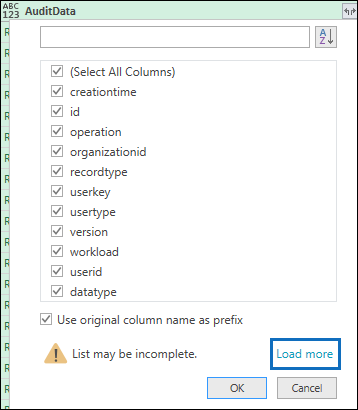

# <a name="export-configure-and-view-audit-log-records"></a><span data-ttu-id="3923f-103">Экспорт, настройка и просмотр записей журнала аудита</span><span class="sxs-lookup"><span data-stu-id="3923f-103">Export, configure, and view audit log records</span></span>

<span data-ttu-id="3923f-104">После поиска в журнале аудита и загрузки результатов поиска в CSV-файл файл содержит столбец **AuditData,** содержащий дополнительные сведения о каждом событии.</span><span class="sxs-lookup"><span data-stu-id="3923f-104">After you search the audit log and download the search results to a CSV file, the file contains a column named **AuditData**, which contains additional information about each event.</span></span> <span data-ttu-id="3923f-105">Данные в этом столбце отформатированы в виде объекта JSON, который содержит несколько свойств, настроенных как пары *property:value,* разделенных запятой.</span><span class="sxs-lookup"><span data-stu-id="3923f-105">The data in this column is formatted as a JSON object, which contains multiple properties that are configured as *property:value* pairs separated by commas.</span></span> <span data-ttu-id="3923f-106">Вы можете использовать функцию преобразования JSON в редакторе Power Query в Excel, чтобы разделить каждое свойство объекта JSON в столбце **AuditData** на несколько столбцов, чтобы каждое свойство было собственным столбцом.</span><span class="sxs-lookup"><span data-stu-id="3923f-106">You can use the JSON transform feature in the Power Query Editor in Excel to split each property in the JSON object in the **AuditData** column into multiple columns so that each property has its own column.</span></span> <span data-ttu-id="3923f-107">Это позволяет сортировать и фильтровать одно или несколько из этих свойств, что позволяет быстро находить конкретные данные аудита, которые вы ищете.</span><span class="sxs-lookup"><span data-stu-id="3923f-107">This lets you sort and filter on one or more of these properties, which can help you quickly locate the specific auditing data you're looking for.</span></span>

## <a name="step-1-export-audit-log-search-results"></a><span data-ttu-id="3923f-108">Шаг 1. Экспорт результатов поиска в журнале аудита</span><span class="sxs-lookup"><span data-stu-id="3923f-108">Step 1: Export audit log search results</span></span>

<span data-ttu-id="3923f-109">Первый шаг — поиск в журнале аудита и экспорт результатов в CSV-файле на локальный компьютер.</span><span class="sxs-lookup"><span data-stu-id="3923f-109">The first step is to search the audit log and then export the results in a comma-separated value (CSV) file to your local computer.</span></span>
  
1. <span data-ttu-id="3923f-110">Запустите [поиск в журнале аудита](search-the-audit-log-in-security-and-compliance.md#search-the-audit-log) и при необходимости исправите условия поиска до тех пор, пока не будут выявить нужные результаты.</span><span class="sxs-lookup"><span data-stu-id="3923f-110">Run an [audit log search](search-the-audit-log-in-security-and-compliance.md#search-the-audit-log) and revise the search criteria if necessary until you have the desired results.</span></span>

2. <span data-ttu-id="3923f-111">Щелкните **"Экспорт результатов"** и выберите **"Скачать все результаты".**</span><span class="sxs-lookup"><span data-stu-id="3923f-111">Click **Export results** and select **Download all results**.</span></span> 

   

   <span data-ttu-id="3923f-113">Этот параметр экспортирует все записи аудита из поиска в журнале аудита, который вы запустили на шаге 1, и скачивает необработанные данные из журнала аудита в CSV-файл.</span><span class="sxs-lookup"><span data-stu-id="3923f-113">This option to exports all the audit records from the audit log search you ran in step 1, and downloads the raw data from the audit log to a CSV file.</span></span> 

   <span data-ttu-id="3923f-114">В нижней части окна отображается сообщение с запросом на открытие или сохранение CSV-файла.</span><span class="sxs-lookup"><span data-stu-id="3923f-114">A message is displayed at the bottom of the window that prompts you to open or save the CSV file.</span></span> 

3. <span data-ttu-id="3923f-115">Нажмите **кнопку "> сохранить как"** и сохраните CSV-файл на локальном компьютере.</span><span class="sxs-lookup"><span data-stu-id="3923f-115">Click **Save > Save as** and save the CSV file to your local computer.</span></span> <span data-ttu-id="3923f-116">Скачивание множества результатов поиска занимает некоторое время.</span><span class="sxs-lookup"><span data-stu-id="3923f-116">It takes a while to download many search results.</span></span> <span data-ttu-id="3923f-117">Обычно это происходит при поиске всех действий или широкого диапазона дат.</span><span class="sxs-lookup"><span data-stu-id="3923f-117">This is typically the case when searching for all activities or a broad date range.</span></span> <span data-ttu-id="3923f-118">Сообщение в нижней части окна отображается, когда загрузка CSV-файла завершена.</span><span class="sxs-lookup"><span data-stu-id="3923f-118">A message at the bottom of the windows is displayed when the CSV file is finished downloading.</span></span>

   

> [!NOTE]
  > <span data-ttu-id="3923f-120">В CSV-файл можно загрузить до 50 000 записей результатов одной операции поиска по журналу аудита.</span><span class="sxs-lookup"><span data-stu-id="3923f-120">You can download a maximum of 50,000 entries to a CSV file from a single audit log search.</span></span> <span data-ttu-id="3923f-121">Если в CSV-файл загружено 50 000 записей, можно предположить, что условиям поиска соответствует более 50 000 событий.</span><span class="sxs-lookup"><span data-stu-id="3923f-121">If 50,000 entries are downloaded to the CSV file, you can probably assume there are more than 50,000 events that met the search criteria.</span></span> <span data-ttu-id="3923f-122">Чтобы экспортировать больше, чем это ограничение, попробуйте использовать диапазон дат, чтобы уменьшить количество записей журнала аудита.</span><span class="sxs-lookup"><span data-stu-id="3923f-122">To export more than this limit, try using a date range to reduce the number of audit log records.</span></span> <span data-ttu-id="3923f-123">Чтобы экспортировать больше 50 000 записей, вы можете выполнить поиск несколько раз со смежными диапазонами дат.</span><span class="sxs-lookup"><span data-stu-id="3923f-123">You might have to run multiple searches with smaller date ranges to export more than 50,000 entries.</span></span>

## <a name="step-2-format-the-exported-audit-log-using-the-power-query-editor"></a><span data-ttu-id="3923f-124">Шаг 2. Форматирование экспортируемой журнала аудита с помощью редактора Power Query</span><span class="sxs-lookup"><span data-stu-id="3923f-124">Step 2: Format the exported audit log using the Power Query Editor</span></span>

<span data-ttu-id="3923f-125">Следующим шагом является использование функции преобразования JSON в редакторе Power Query в Excel, чтобы разделить каждое свойство объекта JSON в столбце **AuditData** на собственный столбец.</span><span class="sxs-lookup"><span data-stu-id="3923f-125">The next step is to use the JSON transform feature in the Power Query Editor in Excel to split each property in the JSON object in the **AuditData** column into its own column.</span></span> <span data-ttu-id="3923f-126">Затем столбцы фильтруются для просмотра записей на основе значений определенных свойств.</span><span class="sxs-lookup"><span data-stu-id="3923f-126">Then you filter columns to view records based on the values of specific properties.</span></span> <span data-ttu-id="3923f-127">Это поможет вам быстро найти определенные данные аудита, которые вы ищете.</span><span class="sxs-lookup"><span data-stu-id="3923f-127">This can help you quickly locate the specific auditing data you're looking for.</span></span>

1. <span data-ttu-id="3923f-128">Откройте пустую книгу в Excel для Office 365, Excel 2019 или Excel 2016.</span><span class="sxs-lookup"><span data-stu-id="3923f-128">Open a blank workbook in Excel for Office 365, Excel 2019, or Excel 2016.</span></span>

2. <span data-ttu-id="3923f-129">На **вкладке "Данные"** **в группе ленты "&** преобразования данных" щелкните **"Из текста" или "CSV".**</span><span class="sxs-lookup"><span data-stu-id="3923f-129">On the **Data** tab, in the **Get & Transform Data** ribbon group, click **From Text/CSV**.</span></span>

    

3. <span data-ttu-id="3923f-131">Откройте CSV-файл, загруженный на шаге 1.</span><span class="sxs-lookup"><span data-stu-id="3923f-131">Open the CSV file that you downloaded in Step 1.</span></span>

4. <span data-ttu-id="3923f-132">В отображемом окне нажмите кнопку **"Преобразовать данные".**</span><span class="sxs-lookup"><span data-stu-id="3923f-132">In the window that's displayed, click **Transform Data**.</span></span>

   

   <span data-ttu-id="3923f-134">CSV-файл открывается в **редакторе запросов.**</span><span class="sxs-lookup"><span data-stu-id="3923f-134">The CSV file is opened in the **Query Editor**.</span></span> <span data-ttu-id="3923f-135">Существует четыре столбца: **CreationDate,** **UserIds,** **Operations** и **AuditData.**</span><span class="sxs-lookup"><span data-stu-id="3923f-135">There are four columns: **CreationDate**, **UserIds**, **Operations**, and **AuditData**.</span></span> <span data-ttu-id="3923f-136">Столбец **AuditData** — это объект JSON, содержащий несколько свойств.</span><span class="sxs-lookup"><span data-stu-id="3923f-136">The **AuditData** column is a JSON object that contains multiple properties.</span></span> <span data-ttu-id="3923f-137">Следующим шагом является создание столбца для каждого свойства в объекте JSON.</span><span class="sxs-lookup"><span data-stu-id="3923f-137">The next step is to create a column for each property in the JSON object.</span></span>

5. <span data-ttu-id="3923f-138">Щелкните правой кнопкой мыши заголовок в столбце **AuditData,** выберите **"Преобразование"** и щелкните **JSON.**</span><span class="sxs-lookup"><span data-stu-id="3923f-138">Right-click the title in the **AuditData** column, click **Transform**, and then click **JSON**.</span></span> 

   

6. <span data-ttu-id="3923f-140">В правом верхнем углу столбца **AuditData** щелкните значок расширения.</span><span class="sxs-lookup"><span data-stu-id="3923f-140">In the upper-right corner of the **AuditData** column, click the expand icon.</span></span>

   

   <span data-ttu-id="3923f-142">Отображается частичный список свойств объектов JSON в столбце **AuditData.**</span><span class="sxs-lookup"><span data-stu-id="3923f-142">A partial list of the properties in the JSON objects in the **AuditData** column is displayed.</span></span>

7. <span data-ttu-id="3923f-143">Нажмите **кнопку** "Загрузить", чтобы отобразить все свойства объектов JSON в столбце **AuditData.**</span><span class="sxs-lookup"><span data-stu-id="3923f-143">Click **Load more** to display all properties in the JSON objects in the **AuditData** column.</span></span>

   

   <span data-ttu-id="3923f-145">Вы можете отключить этот контрольный список рядом с любым свойством, которое не нужно включать.</span><span class="sxs-lookup"><span data-stu-id="3923f-145">You can unselect the checkbox next to any property that you don't want to include.</span></span> <span data-ttu-id="3923f-146">Удаление столбцов, которые не являются полезными для расследования, — это хороший способ уменьшить объем данных, отображаемого в журнале аудита.</span><span class="sxs-lookup"><span data-stu-id="3923f-146">Eliminating columns that aren't useful for your investigation is a good way to reduce the amount of data displayed in the audit log.</span></span> 

   > [!NOTE]
   > <span data-ttu-id="3923f-147">Свойства JSON, показанные на предыдущем снимке экрана (после нажатия кнопки "Загрузить больше"), основаны на свойствах, найденных в столбце **AuditData** из первых 1000 строк в CSV-файле.</span><span class="sxs-lookup"><span data-stu-id="3923f-147">The JSON properties displayed in the previous screenshot (after you click **Load more**) are based on the properties found in the **AuditData** column from the first 1,000 rows in the CSV file.</span></span> <span data-ttu-id="3923f-148">Если после первых 1000 строк в записях есть другие свойства JSON, эти свойства (и соответствующий столбец) не будут включены при разделении столбца **AuditData** на несколько столбцов.</span><span class="sxs-lookup"><span data-stu-id="3923f-148">If there are different JSON properties in records after the first 1,000 rows, these properties (and a corresponding column) won't be included when the **AuditData** column is split into multiple columns.</span></span> <span data-ttu-id="3923f-149">Чтобы предотвратить это, рассмотрите возможность повторного запуска поиска в журнале аудита и сужение критериев поиска, чтобы возвращалось меньше записей.</span><span class="sxs-lookup"><span data-stu-id="3923f-149">To help prevent this, consider re-running the audit log search and narrow the search criteria so that fewer records are returned.</span></span> <span data-ttu-id="3923f-150">Другим обходным решением является  фильтрация элементов в столбце "Операции", чтобы уменьшить число строк (перед выполнением шага 5 выше) перед преобразованием объекта JSON в столбце **AuditData.**</span><span class="sxs-lookup"><span data-stu-id="3923f-150">Another workaround is to filter items in the **Operations** column to reduce the number of rows (before you perform step 5 above) before transforming the JSON object in the **AuditData** column.</span></span>

8. <span data-ttu-id="3923f-151">Для формата заголовка столбцов, добавляемого для каждого выбранного свойства JSON, сделайте одно из следующих вещей.</span><span class="sxs-lookup"><span data-stu-id="3923f-151">Do one of the following things to format the title of the columns that are added for each JSON property that's selected.</span></span>

    - <span data-ttu-id="3923f-152">Unselect the **Use original column name as prefix** checkbox to use the name of the JSON property as the column names; например, **RecordType** или **SourceFileName.**</span><span class="sxs-lookup"><span data-stu-id="3923f-152">Unselect the **Use original column name as prefix** checkbox to use the name of the JSON property as the column names; for example, **RecordType** or **SourceFileName**.</span></span>

    - <span data-ttu-id="3923f-153">Оставьте **имя исходного столбца** в качестве выбранного префикса, чтобы добавить префикс AuditData к именам столбцов; например, **AuditData.RecordType** или **AuditData.SourceFileName.**</span><span class="sxs-lookup"><span data-stu-id="3923f-153">Leave the **Use original column name as prefix** checkbox selected to add the AuditData prefix to the column names; for example, **AuditData.RecordType** or **AuditData.SourceFileName**.</span></span>

9. <span data-ttu-id="3923f-154">Нажмите **ОК**.</span><span class="sxs-lookup"><span data-stu-id="3923f-154">Click **OK**.</span></span>

    <span data-ttu-id="3923f-155">Столбец **AuditData** разделен на несколько столбцов.</span><span class="sxs-lookup"><span data-stu-id="3923f-155">The **AuditData** column is split into multiple columns.</span></span> <span data-ttu-id="3923f-156">Каждый новый столбец соответствует свойству объекта AuditData JSON.</span><span class="sxs-lookup"><span data-stu-id="3923f-156">Each new column corresponds to a property in the AuditData JSON object.</span></span> <span data-ttu-id="3923f-157">Каждая строка в столбце содержит значение свойства.</span><span class="sxs-lookup"><span data-stu-id="3923f-157">Each row in the column contains the value for the property.</span></span> <span data-ttu-id="3923f-158">Если свойство не содержит значение, отображается значение *null.*</span><span class="sxs-lookup"><span data-stu-id="3923f-158">If the property doesn't contain a value, the *null* value is displayed.</span></span> <span data-ttu-id="3923f-159">В Excel ячейки со значениями NULL пусты.</span><span class="sxs-lookup"><span data-stu-id="3923f-159">In Excel, cells with null values are empty.</span></span>
  
10. <span data-ttu-id="3923f-160">На **вкладке "Главная"** **нажмите кнопку "& Загрузить",** чтобы закрыть редактор Power Query и открыть преобразованный CSV-файл в книге Excel.</span><span class="sxs-lookup"><span data-stu-id="3923f-160">On the **Home** tab, click **Close & Load** to close the Power Query Editor and open the transformed CSV file in an Excel workbook.</span></span>

## <a name="use-powershell-to-search-and-export-audit-log-records"></a><span data-ttu-id="3923f-161">Поиск и экспорт записей журнала аудита с помощью PowerShell</span><span class="sxs-lookup"><span data-stu-id="3923f-161">Use PowerShell to search and export audit log records</span></span>

<span data-ttu-id="3923f-162">Вместо использования средства поиска по журналу аудита в Центре безопасности и соответствия требованиям & можно использовать для экспорта результатов поиска в [CSV-файл](https://docs.microsoft.com/powershell/module/exchange/search-unifiedauditlog) результаты поиска в журнале аудита с помощью выполнения поиска в Exchange Online PowerShell.</span><span class="sxs-lookup"><span data-stu-id="3923f-162">Instead of using the audit log search tool in the Security & Compliance Center, you can use the [Search-UnifiedAuditLog](https://docs.microsoft.com/powershell/module/exchange/search-unifiedauditlog) cmdlet in Exchange Online PowerShell to export the results of an audit log search to a CSV file.</span></span> <span data-ttu-id="3923f-163">Затем можно использовать процедуру, описанную в шаге 2, для форматации журнала аудита с помощью редактора Power Query.</span><span class="sxs-lookup"><span data-stu-id="3923f-163">Then you can follow the same procedure described in Step 2 to format the audit log using the Power Query editor.</span></span> <span data-ttu-id="3923f-164">Одно из преимуществ использования powerShell заключается в том, что вы можете искать события из определенной службы с помощью *параметра RecordType.*</span><span class="sxs-lookup"><span data-stu-id="3923f-164">One advantage of using the PowerShell cmdlet is that you can search for events from a specific service by using the *RecordType* parameter.</span></span> <span data-ttu-id="3923f-165">Вот несколько примеров использования PowerShell для экспорта записей аудита в CSV-файл, чтобы с помощью редактора Power Query преобразовать объект JSON в столбце **AuditData,** как описано в шаге 2.</span><span class="sxs-lookup"><span data-stu-id="3923f-165">Here are few examples of using PowerShell to export audit records to a CSV file so you can use the Power Query editor to transform the JSON object in the **AuditData** column as described in Step 2.</span></span>

<span data-ttu-id="3923f-166">В этом примере запустите следующие команды, чтобы вернуть все записи, связанные с операциями общего доступа к SharePoint.</span><span class="sxs-lookup"><span data-stu-id="3923f-166">In this example, run the following commands to return all records related to SharePoint sharing operations.</span></span>

```powershell
$auditlog = Search-UnifiedAuditLog -StartDate 06/01/2019 -EndDate 06/30/2019 -RecordType SharePointSharingOperation
```

```powershell
$auditlog | Select-Object -Property CreationDate,UserIds,RecordType,AuditData | Export-Csv -Path c:\AuditLogs\PowerShellAuditlog.csv -NoTypeInformation
```

<span data-ttu-id="3923f-167">Результаты поиска экспортируются в CSV-файл *PowerShellAuditlog,* содержащий четыре столбца: CreationDate, UserIds, RecordType, AuditData.</span><span class="sxs-lookup"><span data-stu-id="3923f-167">The search results are exported to a CSV file named *PowerShellAuditlog* that contains four columns: CreationDate, UserIds, RecordType, AuditData).</span></span>

<span data-ttu-id="3923f-168">В качестве значения параметра *RecordType* можно также использовать имя или значение enum для типа записи.</span><span class="sxs-lookup"><span data-stu-id="3923f-168">You can also use the name or enum value for the record type as the value for the *RecordType* parameter.</span></span> <span data-ttu-id="3923f-169">Список имен типов записей и соответствующих им значений перечисляемого списка см. в таблице *AuditLogRecordType* схемы API действий управления [Office 365.](https://docs.microsoft.com/office/office-365-management-api/office-365-management-activity-api-schema#enum-auditlogrecordtype---type-edmint32)</span><span class="sxs-lookup"><span data-stu-id="3923f-169">For a list of record type names and their corresponding enum values, see the *AuditLogRecordType* table in [Office 365 Management Activity API schema](https://docs.microsoft.com/office/office-365-management-api/office-365-management-activity-api-schema#enum-auditlogrecordtype---type-edmint32).</span></span>

<span data-ttu-id="3923f-170">Параметр *RecordType* может включать только одно значение.</span><span class="sxs-lookup"><span data-stu-id="3923f-170">You can only include a single value for the *RecordType* parameter.</span></span> <span data-ttu-id="3923f-171">Чтобы найти записи аудита для других типов записей, необходимо снова выполнить две предыдущие команды, чтобы указать другой тип записи и ввести эти результаты в исходный CSV-файл.</span><span class="sxs-lookup"><span data-stu-id="3923f-171">To search for audit records for other record types, you have to run the two previous commands again to specify a different record type and append those results to the original CSV file.</span></span> <span data-ttu-id="3923f-172">Например, чтобы добавить действия с файлом SharePoint из одного диапазона дат в PowerShellAuditlog.csv, необходимо выполнить следующие две команды.</span><span class="sxs-lookup"><span data-stu-id="3923f-172">For example, you would run the following two commands to add SharePoint file activities from the same date range to the PowerShellAuditlog.csv file.</span></span>

```powershell
$auditlog = Search-UnifiedAuditLog -StartDate 06/01/2019 -EndDate 06/30/2019 -RecordType SharePointFileOperation
```

```powershell
$auditlog | Select-Object -Property CreationDate,UserIds,RecordType,AuditData | Export-Csv -Append -Path c:\AuditLogs\PowerShellAuditlog.csv -NoTypeInformation
```

## <a name="tips-for-exporting-and-viewing-the-audit-log"></a><span data-ttu-id="3923f-173">Советы по экспорту и просмотру журнала аудита</span><span class="sxs-lookup"><span data-stu-id="3923f-173">Tips for exporting and viewing the audit log</span></span>

<span data-ttu-id="3923f-174">Ниже представлены советы и примеры экспорта и просмотра журнала аудита до и после использования функции преобразования JSON для разделения столбца **AuditData** на несколько столбцов.</span><span class="sxs-lookup"><span data-stu-id="3923f-174">Here are some tips and examples of exporting and viewing the audit log before and after you use the JSON transform feature to split the **AuditData** column into multiple columns.</span></span>

- <span data-ttu-id="3923f-175">Отфильтруем **столбец RecordType,** чтобы отображались только записи из определенной службы или функциональной области.</span><span class="sxs-lookup"><span data-stu-id="3923f-175">Filter the **RecordType** column to display only the records from a specific service or functional area.</span></span> <span data-ttu-id="3923f-176">Например, чтобы показать события, связанные с совместным доступом SharePoint, выберите **14** (значение enum для записей, запускаемой действиями общего доступа SharePoint).</span><span class="sxs-lookup"><span data-stu-id="3923f-176">For example, to show events related to SharePoint sharing, you would select **14** (the enum value for records triggered by SharePoint sharing activities).</span></span> <span data-ttu-id="3923f-177">Список служб, соответствующих значениям перечисляемого списка, отображаемого в столбце **RecordType,** см. в подробном описании свойств в [журнале аудита.](detailed-properties-in-the-office-365-audit-log.md)</span><span class="sxs-lookup"><span data-stu-id="3923f-177">For a list of the services that correspond to the enum values displayed in the **RecordType** column, see [Detailed properties in the audit log](detailed-properties-in-the-office-365-audit-log.md).</span></span>

- <span data-ttu-id="3923f-178">**Отфильтруем столбец** "Операции", чтобы отобразить записи для определенных действий.</span><span class="sxs-lookup"><span data-stu-id="3923f-178">Filter the **Operations** column to display the records for specific activities.</span></span> <span data-ttu-id="3923f-179">Список большинства операций, которые соответствуют действию поиска в средстве поиска в журнале аудита в Центре безопасности и соответствия требованиям &, см. в разделе "Аудит действий" в журнале аудита в Центре безопасности [& соответствия](search-the-audit-log-in-security-and-compliance.md#audited-activities)требованиям.</span><span class="sxs-lookup"><span data-stu-id="3923f-179">For a list of most operations that correspond to a searchable activity in the audit log search tool in the Security & Compliance Center, see the "Audited activities" section in [Search the audit log in the Security & Compliance Center](search-the-audit-log-in-security-and-compliance.md#audited-activities).</span></span>
