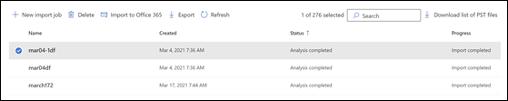
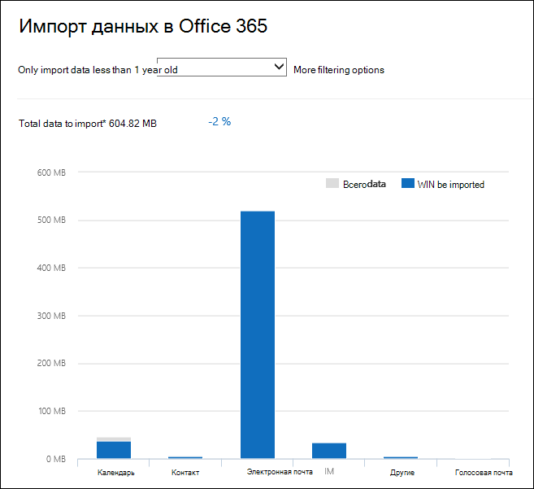
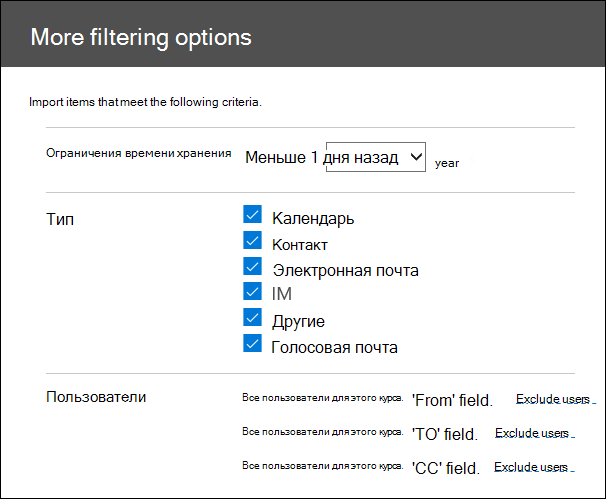

# Фильтрация данных при импорте PST-файловFilter data when importing PST files

Используйте новый компонент интеллектуального импорта в службе импорта Office 365, чтобы отфильтровать элементы в PST-файлах, которые фактически импортируются в целевые почтовые ящики.Use the new Intelligent Import feature in the Office 365 Import service to filter the items in PST files that actually get imported to the target mailboxes. Вот как это работает:Here's how it works:
  
- После создания и отправки задания импорта PST-файлов в область хранилища Azure в облаке Майкрософт.After you create and submit a PST import job, PST files are uploaded to an Azure storage area in the Microsoft cloud.
    
- Microsoft 365 анализирует данные в PST-файлах безопасным и безопасным способом, определяя возраст элементов почтового ящика и различные типы сообщений, включенные в PST-файлы.Microsoft 365 analyzes the data in the PST files, in a safe and secure manner, by identifying the age of the mailbox items and the different message types included in the PST files.
    
- После завершения анализа и данных, готовых к импорту, можно импортировать все данные в PST-файлах как есть или обрезать импортируемые данные, задав фильтры, которые контролируют, какие данные следует импортировать.When the analysis is complete and the data is ready to import, you have the option to import all data in the PST files as is or trim the data that's imported by setting filters that control what data gets imported. Например, можно выбрать один из следующих вариантов:For example, you can choose to:
    
  - Импортировать только элементы определенного возраста.Import only items of a certain age.
    
  - Импорт выбранных типов сообщений.Import selected message types.
    
  - Исключение сообщений, отправленных или полученных определенными пользователями.Exclude messages sent or received by specific people.
    
- После настройки параметров фильтра Microsoft 365 импортирует только те данные, которые соответствуют критериям фильтрации, с целевыми почтовыми ящиками, указанными в задании импорта.After you configure the filter settings, Microsoft 365 imports only the data that meets the filtering criteria to the target mailboxes specified in the import job.
    
На приведенном ниже рисунке показан процесс интеллектуального импорта, в котором выделены выполняемые задачи и задачи, выполняемые в Office 365.The following graphic shows the Intelligent Import process, and highlights the tasks you perform and the tasks performed by Office 365.
  

  
## Перед началом работыBefore you begin

- Действия, описанные в этом разделе, предполагают, что вы создали задание импорта PST в службе импорта Office 365, используя отправку по сети или доставку дисков.The steps in this topic assume that you've created a PST import job in the Office 365 Import service by using network upload or drive shipping. Пошаговые инструкции представлены в одном из следующих разделов:For step-by-step instructions, see one of the following topics:
    
  - [Импорт PST-файлов в Office 365 с помощью отправки по сетиUse network upload to import PST files to Office 365](use-network-upload-to-import-pst-files.md)
    
  - [Импорт PST-файлов в Office 365 с помощью отправки дисковUse drive shipping to import PST files to Office 365](use-drive-shipping-to-import-pst-files-to-office-365.md)
    
- После создания задания импорта с помощью команды "Отправка по сети" состояние задания импорта на странице "Импорт" центра соответствия требованиям & безопасности настроено на **анализ**, что означает, что Microsoft 365 анализирует данные в отправленных вами PST-файлах.After you create an import job by using network upload, the status for the import job on the Import page in the Security & Compliance Center is set to **Analysis in progress**, which means that Microsoft 365 is analyzing the data in the PST files that you uploaded. Нажмите **Refresh** обновление, чтобы обновить состояние задания импорта.Click **Refresh** to update the status for the import job. 
    
- Для заданий импорта доставки дисков данные анализируются Microsoft 365 после того, как сотрудники центра обработки данных Майкрософт получат жесткий диск и отправит PST-файлы в область хранилища Azure для вашей организации.For drive shipping import jobs, the data will be analyzed by Microsoft 365 after Microsoft datacenter personnel receive your hard drive and upload the PST files to the Azure storage area for your organization.
  
## Фильтрация данных, которые импортируются в почтовые ящикиFilter data that gets imported to mailboxes

После создания задания импорта PST-файла выполните следующие действия, чтобы отфильтровать данные перед их импортом в Office 365.After you've created a PST import job, follow these steps to filter the data before you import it to Office 365.
  
1. Перейдите к [https://protection.office.com/](https://protection.office.com/) учетной записи администратора в Организации и войдите в нее с помощью учетных данных.Go to [https://protection.office.com/](https://protection.office.com/) and sign in using the credentials for an administrator account in your organization. 
    
2. Щелкните **Import** \> **PST-файлы импорта**для управления **сведениями** \> .Click **Information governance** \> **Import** \> **Import PST files**.
    
    Задания импорта для Организации перечислены на странице " **Импорт PST-файлов** ".The import jobs for your organization are listed on the **Import PST files** page. Обратите внимание, что в столбце **состояние** **Завершено значение анализ** указывает, что задания импорта были проанализированы в Microsoft 365 и готовы к импорту.Note that the **Analysis completed** value in the **Status** column indicates the import jobs that have been analyzed by Microsoft 365 and are ready for you to import. 
    
    
  
3. Нажмите кнопку **Готово, чтобы импортировать в Office 365** для задания импорта, которое требуется выполнить.Click **Ready to import to Office 365** for the import job that you want to complete. 
    
    Появится страница со сведениями о PST-файлах и другой информацией о задании импорта.A fly out page is displayed with information about the PST files and other information about the import job.
    
4. Нажмите кнопку **Импорт в Office 365**.Click **Import to Office 365**.
    
    Откроется страница **Отфильтровать данные**.The **Filter your data** page is displayed. Он содержит сведения о данных в PST-файлах для задания импорта, в том числе сведения о сроке хранения данных.It contains data insights about the data in the PST files for the import job, including information about the age of the data. 
    
    
  
5. В зависимости от того, хотите ли вы обрезать данные, импортированные в Microsoft 365, в разделе вы **хотите отфильтровать данные?**, выполните одно из следующих действий:Based on whether or not you want to trim the data that's imported to Microsoft 365, under **Do you want to filter your data?**, do one of the following:
    
    а)a. Нажмите кнопку **Да, я хочу отфильтровать его перед импортом** , чтобы обрезать импортируемые данные, а затем нажмите кнопку **Далее**.Click **Yes, I want to filter it before importing** to trim the data that you import, and then click **Next**.
    
    На странице **Импорт данных в Office 365** отображается подробная информация об анализе данных, выполненном в анализе, выполненном корпорацией Microsoft 365.The **Import data to Office 365 page** page is displayed with detailed data insights from the analysis that Microsoft 365 performed. 
    
    
  
    На диаграмме на этой странице отображается объем данных, которые будут импортированы.The graph on this page shows the amount of data that will be imported. Сведения о каждом типе сообщений, обнаруженном в PST-файлах, отображаются на диаграмме.Information about each message type found in the PST files is displayed in the graph. Вы можете навести курсор на каждую панель, чтобы отобразить конкретные сведения об этом типе сообщения.You can hover the cursor over each bar to display specific information about that message type. Кроме того, существует раскрывающийся список с разными значениями возраста на основе анализа PST-файлов.There is also a drop-down list with different age values based on the analysis of the PST files. При выборе возраста в раскрывающемся списке диаграмма обновляется, чтобы показать, сколько данных будет импортировано для выбранного возраста.When you select an age in the drop-down list, the graph is updated to show how much data will be imported for the selected age. 
    
    б)b. Чтобы настроить фильтры сложения для уменьшения объема импортируемых данных, щелкните **Дополнительные параметры фильтрации**.To configure addition filters to reduce the amount of data that's imported, click **More filtering options**.
    
    
  
    Вы можете настроить эти фильтры:You can configure these filters:
    
      - **Age** — Выберите возраст, чтобы импортироваться только элементы новее указанного возраста.**Age** - Select an age so only items that are newer than the specified age will be imported. В разделе [More Information (Дополнительные сведения](#more-information) ) представлено описание того, как Microsoft 365 определяет периоды хранения для фильтра **возраста** .See the [More information](#more-information) section for a description about how Microsoft 365 determines the age buckets for the **Age** filter. 
    
      - **Type** — в этом разделе показаны все типы сообщений, обнаруженные в PST-файлах для задания импорта.**Type** - This section shows all the message types that were found in the PST files for the import job. Вы можете снять флажок рядом с типом сообщения, которое нужно исключить.You can uncheck a box next to a message type that you want to exclude. Обратите внимание, что вы не можете исключить другой тип сообщения.Note that you can't exclude the Other message type. Список элементов почтовых ящиков, включенных в другую категорию, представлен в разделе [Дополнительные сведения](#more-information) .See the [More information](#more-information) section for a list of mailbox items that are included in the Other category. 
    
      - **Пользователи** — вы можете исключить сообщения, отправленные или полученные определенными пользователями.**Users** - You can exclude messages that are sent or received by specific people. Чтобы исключить пользователей, которые отображаются в поле "от:", "Кому:" или "копия: сообщения", нажмите кнопку **исключить пользователей** рядом с этим типом получателя.To exclude people who appear in the From: field, To: field, or the Cc: field of messages, click **Exclude users** next to that recipient type. Введите адрес электронной почты (SMTP-адрес) пользователя, щелкните **Добавить** , чтобы добавить его в список исключенных пользователей для этого типа получателя, а затем нажмите кнопку **сохранить** , чтобы сохранить список исключенных пользователей.Type the email address (SMTP address) of the person, click **Add** to add them to the list of excluded users for that recipient type, and then click **Save** to save the list of excluded users. 
    
        > [!NOTE]
        > В Microsoft 365 не отображаются данные, которые появятся в результате настройки фильтра **людей** .Microsoft 365 doesn't show data insights that result from setting the **People** filter. Тем не менее, если вы настроили этот фильтр, чтобы исключить сообщения, отправленные или полученные определенными пользователями, эти сообщения будут исключены во время фактического процесса импорта.However, if you set this filter to exclude messages sent or received by specific people, those messages will be excluded during the actual import process. 
  
    в.c. Нажмите кнопку **Применить** на странице **Дополнительные параметры фильтрации** , чтобы сохранить параметры фильтра.Click **Apply** in the **More filtering options** fly out page to save your filter settings. 
    
    Сведения, содержащиеся на странице **Импорт данных в Office 365** , обновляются на основе параметров фильтра, в том числе общий объем данных, которые будут импортированы на основе параметров фильтра.The data insights on the **Import data to Office 365** page are updated based on your filter settings, including the total amount of data that will be imported based on the filter settings. Обратите внимание, что также отображается сводка по параметрам фильтра.Note that a summary of the filter settings is also shown. При необходимости можно нажать кнопку **изменить** рядом с фильтром, чтобы изменить значение.You can click **Edit** next to a filter to change the setting if necessary. 
    
    
  
    г.d. Нажмите кнопку **Далее**.Click **Next**.
    
    Отображается страница состояния, на которой показаны параметры фильтра.A status page is displayed showing your filter settings. Опять же, вы можете изменить любой из параметров фильтра.Again, you can edit any of the filter settings.
    
    д.e. Нажмите кнопку **Импорт данных** , чтобы начать импорт.Click **Import data** to start the import . Обратите внимание, что отображается общий объем данных, которые будут импортированы.Note that the total amount of data that will be imported is displayed. 
    
    илиOr
    
    а)a. Нажмите кнопку **нет, я хочу импортировать** все данные из PST-файлов в Office 365, а затем нажмите кнопку **Далее**.Click **No, I want to import everything** to import all data in the PST files to Office 365, and then click **Next**.
    
    б)b. На странице **Импорт данных в Office 365** щелкните **Импорт данных** , чтобы начать импорт.On the **Import data to Office 365** page, click **Import data** to start the import. Обратите внимание, что отображается общий объем данных, которые будут импортированы.Note that the total amount of data that will be imported is displayed. 
    
6. На странице " **Импорт PST-файлов** " нажмите кнопку](../media/165fb3ad-38a8-4dd9-9e76-296aefd96334.png) **Обновить** . Состояние задания импорта отображается в столбце **состояние** .The status for the import job is displayed in the **Status** column. 
    
7. Щелкните Импорт задания, чтобы отобразить более подробные сведения, такие как состояние каждого PST-файла и параметры фильтра, которые вы настроили.Click the import the job to display more detailed information, such as the status for each PST file and the filter settings that you configured.

  
## Дополнительные сведенияMore information

- Как Microsoft 365 определяет приращения для фильтра возраста?How does Microsoft 365 determine the increments for the age filter? Когда Microsoft 365 анализирует PST-файл, он анализирует отметку времени отправки или получения каждого элемента (если для элемента задана отметка времени отправки и получения, выбирается самая старая Дата).When Microsoft 365 analyzes a PST file, it looks at the sent or received time stamp of each item (if an item has both a sent and received timestamp, the oldest date is selected). Затем Microsoft 365 просматривает значение года для этой временной метки и сравнивает его с текущей датой для определения возраста элемента.Then Microsoft 365 looks at the year value for that timestamp and compares it to the current date to determine the age of the item. Эти простои используются в качестве значений в раскрывающемся списке для фильтра **возраста** .These ages are then used as the values in the drop-down list for the **Age** filter. Например, если PST-файл содержит сообщения от 2016, 2015 и 2014, то значения в фильтре **возраста** будут составлять **1 год**, **2 года**и **3 года**.For example, if a PST file has messages from 2016, 2015, and 2014, then values in the **Age** filter would be **1 year**, **2 years**, and **3 years**.
    
- В следующей таблице приведены типы сообщений, которые включены в категорию " **другие** " в поле " **тип** фильтра" на странице " **Дополнительные параметры** " на лету (см. шаг 5b в предыдущей процедуре).The following table lists the message types that are included in the **Other** category in the **Type** filter on the **More options** fly out page (see Step 5b in the previous procedure). В настоящее время вы не можете исключить элементы из категории "другие" при импорте PST в Office 365.Currently, you can't exclude items in the "Other" category when you import PSTs to Office 365. 
    
    |**Идентификатор класса сообщений****Message class ID**|**Элементы почтового ящика, которые используют этот класс сообщений****Mailbox items that use this message class**|
    |:-----|:-----|
    |IPM.ActivityIPM.Activity    |Записи журналаJournal entries    |
    |IPM.DocumentIPM.Document    |Документы и файлы (не вложенные в сообщение электронной почты)Documents and files (not attached to an email message)    |
    |Класс. ФайлуIPM.File    |(то же, что и IPM. Документов(same as IPM.Document)    |
    |IPM.Note.IMC.NotificationIPM.Note.IMC.Notification    |Отчеты, отправляемые службой почты Интернета, которая является шлюзом Exchange Server в ИнтернетReports sent by Internet Mail Connect, which is the Exchange Server gateway to the Internet    |
    |Класс. Note. Microsoft. FaxIPM.Note.Microsoft.Fax    |Факсимильные сообщенияFax messages    |
    |Класс. Note. rules. отсутствие на работе. Template. MicrosoftIPM.Note.Rules.Oof.Template.Microsoft    |Сообщения автоответа об отсутствии на местеOut-of-office auto-reply messages    |
    |IPM.Note.Rules.ReplyTemplate.MicrosoftIPM.Note.Rules.ReplyTemplate.Microsoft    |Ответы, отправленные правилом папки "Входящие"Replies sent by an inbox rule    |
    |IPM.OLE.ClassIPM.OLE.Class    |Исключения для повторяющихся рядовExceptions for a recurring series    |
    |IPM.Recall.ReportIPM.Recall.Report    |Отчеты об отзыве сообщенияMessage recall reports    |
    |IPM.RemoteIPM.Remote    |Удаленные сообщения электронной почтыRemote mail messages    |
    |IPM.ReportIPM.Report    |Отчеты о состоянии элементовItem status reports    |
