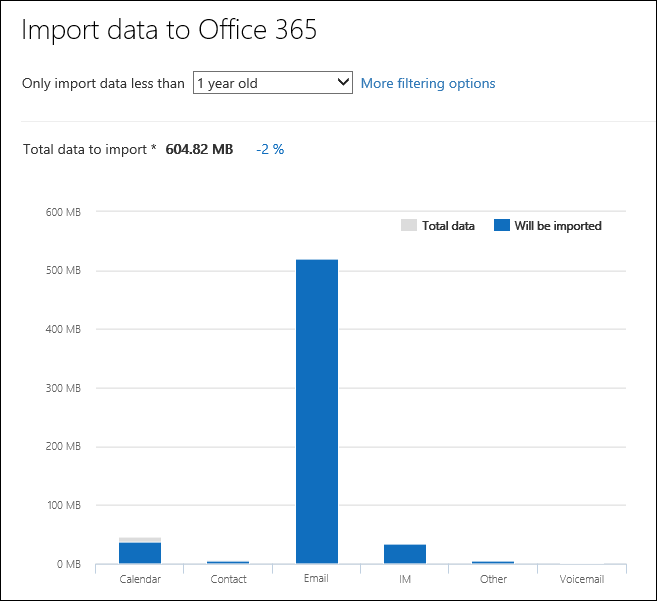

# Фильтрация данных при импорте PST-файловFilter data when importing PST files

Используйте новую функцию "Интеллектуальный импорт" в службе импорта Office 365 для фильтрации элементов в PST-файлах, импортируемых в целевые почтовые ящики.Use the new Intelligent Import feature in the Office 365 Import service to filter the items in PST files that actually get imported to the target mailboxes. Вот как это работает:Here's how it works:
  
- После создания и отправки задания импорта PST файлы PST загружаются в область хранения Azure в облаке Microsoft.After you create and submit a PST import job, PST files are uploaded to an Azure storage area in the Microsoft cloud.
  
- Microsoft 365 анализирует данные в PST-файлах безопасно и безопасно, определяя возраст элементов почтовых ящиков и различные типы сообщений, включенных в PST-файлы.Microsoft 365 analyzes the data in the PST files, in a safe and secure manner, by identifying the age of the mailbox items and the different message types included in the PST files.
  
- Когда анализ завершен и данные готовы к импорту, у вас есть возможность импортировать все данные в PST-файлах, как это есть, или обрезать импортируемые данные, установив фильтры, которые контролируют импортируемые данные.When the analysis is complete and the data is ready to import, you have the option to import all data in the PST files as is or trim the data that's imported by setting filters that control what data gets imported. Например, вы можете выбрать:For example, you can choose to:
  
  - Импортировать только элементы определенного возраста.Import only items of a certain age.
  
  - Импорт отдельных типов сообщений.Import selected message types.
  
  - Исключить сообщения, отправленные или полученные определенными людьми.Exclude messages sent or received by specific people.
  
- После настройки параметров фильтра Microsoft 365 импортировать только данные, отвечающие критериям фильтрации, в целевые почтовые ящики, указанные в заданиях импорта.After you configure the filter settings, Microsoft 365 imports only the data that meets the filtering criteria to the target mailboxes specified in the import job.
  
На следующем рисунке показан процесс интеллектуального импорта, а также выделены выполняемые задачи и задачи, выполняемые Office 365.The following graphic shows the Intelligent Import process, and highlights the tasks you perform and the tasks performed by Office 365.
  

  
## Создание задания импорта PSTCreate a PST import job

- Действия в этом разделе предполагают, что вы создали задание импорта PST в службе импорта Office 365 с помощью сетевой загрузки или доставки диска.The steps in this topic assume that you've created a PST import job in the Office 365 Import service by using network upload or drive shipping. Пошаговая инструкция см. в одном из следующих разделов:For step-by-step instructions, see one of the following topics:
    
  - [Импорт PST-файлов в Office 365 с помощью отправки по сетиUse network upload to import PST files to Office 365](use-network-upload-to-import-pst-files.md)
    
  - [Импорт PST-файлов в Office 365 с помощью отправки дисковUse drive shipping to import PST files to Office 365](use-drive-shipping-to-import-pst-files-to-office-365.md)
    
- После создания задания импорта с помощью сетевой загрузки состояние задания импорта на странице Импорт в Центре соответствия требованиям безопасности & за набором анализов, что означает, что Microsoft 365 анализирует данные в загруженных файлах PST.After you create an import job by using network upload, the status for the import job on the Import page in the Security & Compliance Center is set to **Analysis in progress**, which means that Microsoft 365 is analyzing the data in the PST files that you uploaded. Щелкните **Обновить**  обновление, чтобы обновить состояние задания импорта.Click **Refresh** to update the status for the import job. 
    
- Для импортных заданий для доставки дисков данные будут анализироваться Microsoft 365 после того, как сотрудники центра обработки данных Майкрософт получат жесткий диск и загрузят PST-файлы в область хранения Azure для вашей организации.For drive shipping import jobs, the data will be analyzed by Microsoft 365 after Microsoft datacenter personnel receive your hard drive and upload the PST files to the Azure storage area for your organization.
  
## Фильтрация данных, импортируемых в почтовые ящикиFilter data that gets imported to mailboxes

После создания задания импорта PST выполните следующие действия, чтобы отфильтровать данные, прежде чем импортировать их в Office 365.After you've created a PST import job, follow these steps to filter the data before you import it to Office 365.
  
1. Перейдите в <https://compliance.microsoft.com> и войдите в систему, используя учетные данные для учетной записи администратора в вашей организации.Go to <https://compliance.microsoft.com> and sign in using the credentials for an administrator account in your organization.
    
2. В левой области центра соответствия Microsoft 365 нажмите кнопку **Импорт управления** \> **информацией.**In the left pane of the Microsoft 365 compliance center, click **Information governance** \> **Import**.
    
    Задания импорта для организации перечислены на вкладке **Импорт.** Завершенное **значение Analysis** в столбце **Состояние** указывает задания импорта, которые были проанализированы Microsoft 365 и готовы к импорту.The import jobs for your organization are listed on the **Import** tab. The **Analysis completed** value in the **Status** column indicates the import jobs that have been analyzed by Microsoft 365 and are ready for you to import.
    
    
  
3. Выберите задание импорта, которое необходимо выполнить, и нажмите **кнопку Импорт для Office 365.**Select the import job that you want to complete and click **Import to Office 365**.
  
    Появится страница со сведениями о PST-файлах и другой информацией о задании импорта.A fly out page is displayed with information about the PST files and other information about the import job.

4. Нажмите **кнопку Импорт Office 365**.Click **Import to Office 365**.
    
    Откроется страница **Отфильтровать данные**.The **Filter your data** page is displayed. Он содержит сведения о данных в файлах PST для задания импорта, в том числе сведения о возрасте данных.It contains data insights about the data in the PST files for the import job, including information about the age of the data. 
    
    
  
5. На основании того, хотите ли вы обрезать данные, импортируемые в Microsoft 365, в соответствии с тем, хотите ли вы фильтровать **данные?**, сделать одно из следующих:Based on whether or not you want to trim the data that's imported to Microsoft 365, under **Do you want to filter your data?**, do one of the following:
  
    а)a. Нажмите **кнопку Да, я хочу отфильтровать его перед импортом,** чтобы обрезать импортируемые данные, а затем нажмите **кнопку Далее**.Click **Yes, I want to filter it before importing** to trim the data that you import, and then click **Next**.
  
    Импорт **данных для Office 365** страницы отображается с подробными сведениями о данных из анализа, Microsoft 365 выполнен.The **Import data to Office 365 page** page is displayed with detailed data insights from the analysis that Microsoft 365 performed. 
  
    
  
    На графике на этой странице показан объем импортируемых данных.The graph on this page shows the amount of data that will be imported. Сведения о каждом типе сообщений, найденных в PST-файлах, отображаются на графике.Information about each message type found in the PST files is displayed in the graph. Курсор можно навести на каждую планку, чтобы отобразить определенную информацию об этом типе сообщения.You can hover the cursor over each bar to display specific information about that message type. Существует также выпаданий список с различными значениями возраста на основе анализа PST-файлов.There is also a drop-down list with different age values based on the analysis of the PST files. При выборе возраста в выпадаемом списке график обновляется, чтобы показать, сколько данных будет импортироваться для выбранного возраста.When you select an age in the drop-down list, the graph is updated to show how much data will be imported for the selected age. 
  
    б)b. Чтобы настроить фильтры добавления, чтобы уменьшить объем импортируемых данных, нажмите кнопку **Дополнительные параметры фильтрации.**To configure addition filters to reduce the amount of data that's imported, click **More filtering options**.
  
    
  
    Можно настроить эти фильтры:You can configure these filters:
  
      - **Возраст** . Выберите возраст, поэтому импортировать будут только те элементы, которые являются более новыми, чем указанный возраст.**Age** - Select an age so only items that are newer than the specified age will be imported. Дополнительные [сведения см.](#more-information) в разделе Описание того, Microsoft 365 определяет возрастные ведра для **фильтра Age.**See the [More information](#more-information) section for a description about how Microsoft 365 determines the age buckets for the **Age** filter. 
  
      - **Тип** . В этом разделе показаны все типы сообщений, найденные в PST-файлах для задания импорта.**Type** - This section shows all the message types that were found in the PST files for the import job. Можно отсеять поле рядом с типом сообщения, который необходимо исключить.You can uncheck a box next to a message type that you want to exclude. Нельзя исключить другой тип сообщения.You can't exclude the Other message type. Дополнительные [сведения см.](#more-information) в разделе Дополнительные сведения о списке элементов почтовых ящиков, включенных в другую категорию.See the [More information](#more-information) section for a list of mailbox items that are included in the Other category.
  
      - **Пользователи** . Вы можете исключить сообщения, отправленные или полученные определенными людьми.**Users** - You can exclude messages that are sent or received by specific people. Чтобы исключить людей, которые отображаются в поле From: Field, To:  field или Cc: поле сообщений, нажмите кнопку Исключить пользователей рядом с этим типом получателя.To exclude people who appear in the From: field, To: field, or the Cc: field of messages, click **Exclude users** next to that recipient type. Введите адрес электронной почты (SMTP-адрес) пользователя, нажмите кнопку Добавить значок New, чтобы добавить их в список исключенных пользователей для этого типа получателя, а затем нажмите кнопку   **Сохранить,** чтобы сохранить список исключенных пользователей.Type the email address (SMTP address) of the person, click **Add** to add them to the list of excluded users for that recipient type, and then click **Save** to save the list of excluded users. 
  
        > [!NOTE]
        > Microsoft 365 не показывает данные, полученные в результате установки **фильтра People.**Microsoft 365 doesn't show data insights that result from setting the **People** filter. Однако, если установить этот фильтр, чтобы исключить сообщения, отправленные или полученные определенными людьми, эти сообщения будут исключены во время фактического процесса импорта.However, if you set this filter to exclude messages sent or received by specific people, those messages will be excluded during the actual import process. 
  
    В.c. Щелкните **Применить** на странице **Дополнительные параметры фильтрации,** чтобы сохранить параметры фильтра.Click **Apply** in the **More filtering options** fly out page to save your filter settings. 
  
    Сведения о данных на странице **Импорт** Office 365 обновляются на основе параметров фильтра, включая общий объем данных, которые будут импортироваться в зависимости от параметров фильтра.The data insights on the **Import data to Office 365** page are updated based on your filter settings, including the total amount of data that will be imported based on the filter settings. Также показан сводка параметров фильтра.A summary of the filter settings is also shown. Вы можете щелкнуть **Кнопку Изменить** рядом с фильтром, чтобы при необходимости изменить параметр.You can click **Edit** next to a filter to change the setting if necessary. 
  
    
  
    г.d. Нажмите **Далее**.Click **Next**.
  
    Отображается страница состояния с указанием параметров фильтра.A status page is displayed showing your filter settings. Опять же, вы можете изменить любой из параметров фильтра.Again, you can edit any of the filter settings.
  
    д.e. Нажмите **кнопку Импорт данных** для запуска импорта.Click **Import data** to start the import. Отображается общий объем импортируемых данных.The total amount of data that will be imported is displayed. 
  
    илиOr
  
    а)a. Нажмите **кнопку Нет,** я хочу импортировать все данные в PST-файлах для Office 365, а затем нажмите **кнопку Далее**.Click **No, I want to import everything** to import all data in the PST files to Office 365, and then click **Next**.
  
    б)b. На странице **Импорт данных Office 365** нажмите импорт **данных,** чтобы начать импорт.On the **Import data to Office 365** page, click **Import data** to start the import. Отображается общий объем импортируемых данных.The total amount of data that will be imported is displayed. 
  
6. На **вкладке Импорт** нажмите обновить **обновление**  .On the **Import** tab, click **Refresh** . Состояние задания импорта отображается в столбце **Состояние.**The status for the import job is displayed in the **Status** column.
  
7. Щелкните импорт задания, чтобы отобразить более подробные сведения, например состояние для каждого PST-файла и настроенные параметры фильтра.Click the import the job to display more detailed information, such as the status for each PST file and the filter settings that you configured.

## Дополнительные сведенияMore information

- Как Microsoft 365 определить приращения для возрастного фильтра?How does Microsoft 365 determine the increments for the age filter? Когда Microsoft 365 PST-файл, он смотрит на отправленный или полученный отпечаток времени каждого элемента (если элемент имеет как отправленный, так и полученный период времени, выбирается самая старая дата).When Microsoft 365 analyzes a PST file, it looks at the sent or received time stamp of each item (if an item has both a sent and received timestamp, the oldest date is selected). Затем Microsoft 365 значение года для этого периода времени и сравнивает его с текущей датой, чтобы определить возраст элемента.Then Microsoft 365 looks at the year value for that timestamp and compares it to the current date to determine the age of the item. Эти возрасты затем используются в качестве значений в списке выпаданий для **фильтра Age.**These ages are then used as the values in the drop-down list for the **Age** filter. Например, если в PST-файле есть сообщения от 2016, 2015 и 2014 г., то значения в фильтре **Age** будут **1 год,** **2** года и **3 года.**For example, if a PST file has messages from 2016, 2015, and 2014, then values in the **Age** filter would be **1 year**, **2 years**, and **3 years**.
  
- В следующей таблице перечислены типы сообщений, включенные в другую  категорию фильтра **Type** на странице Дополнительные параметры (см. шаг 5b в предыдущей процедуре). The following table lists the message types that are included in the **Other** category in the **Type** filter on the **More options** fly out page (see Step 5b in the previous procedure). В настоящее время нельзя исключать элементы из категории "Другие" при импорте PSTs в Office 365.Currently, you can't exclude items in the "Other" category when you import PSTs to Office 365. 
  
    |**Идентификатор класса сообщений****Message class ID**|**Элементы почтовых ящиков, которые используют этот класс сообщений****Mailbox items that use this message class**|
    |:-----|:-----|
    |IPM.ActivityIPM.Activity    |Записи журналаJournal entries    |
    |IPM.DocumentIPM.Document    |Документы и файлы (не присоединенные к сообщению электронной почты)Documents and files (not attached to an email message)    |
    |IPM. ФайлIPM.File    |(то же, IPM.Document)(same as IPM.Document)    |
    |IPM.Note.IMC.NotificationIPM.Note.IMC.Notification    |Отчеты, отправленные Подключение internet Mail, который является Exchange Server шлюзом в ИнтернетReports sent by Internet Mail Connect, which is the Exchange Server gateway to the Internet    |
    |IPM. Note.Microsoft.FaxIPM.Note.Microsoft.Fax    |Факс сообщенияFax messages    |
    |IPM. Note.Rules.Oof.Template.MicrosoftIPM.Note.Rules.Oof.Template.Microsoft    |Автоматические сообщения вне офисаOut-of-office autoreply messages    |
    |IPM.Note.Rules.ReplyTemplate.MicrosoftIPM.Note.Rules.ReplyTemplate.Microsoft    |Ответы, отправленные правилом "Входящие"Replies sent by an inbox rule    |
    |IPM.OLE.ClassIPM.OLE.Class    |Исключения для повторяющейся серииExceptions for a recurring series    |
    |IPM.Recall.ReportIPM.Recall.Report    |Отчеты об отзыве сообщенияMessage recall reports    |
    |IPM.RemoteIPM.Remote    |Удаленные сообщения почтыRemote mail messages    |
    |IPM.ReportIPM.Report    |Отчеты о состоянии элементаItem status reports    |
