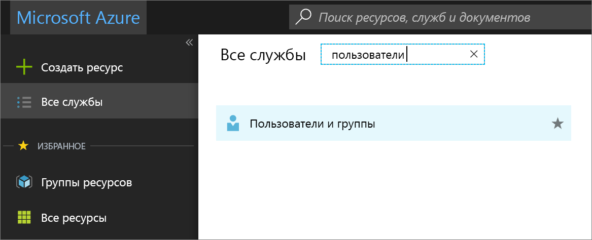
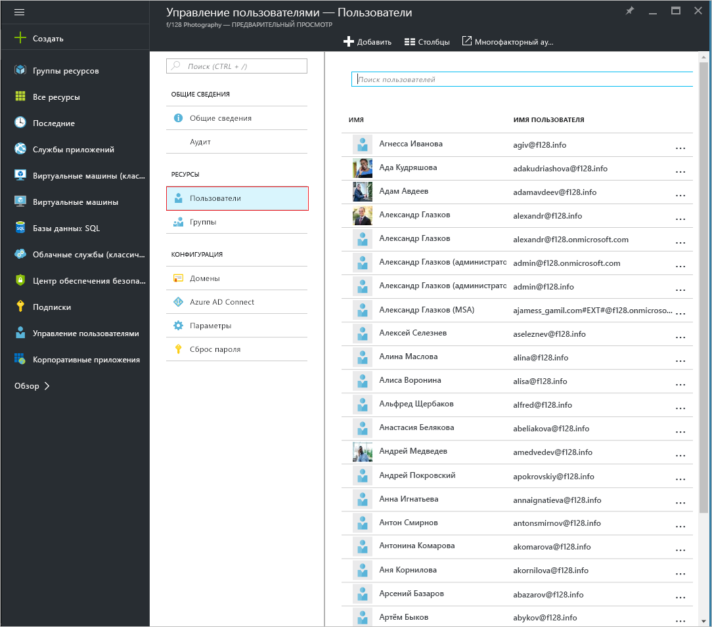
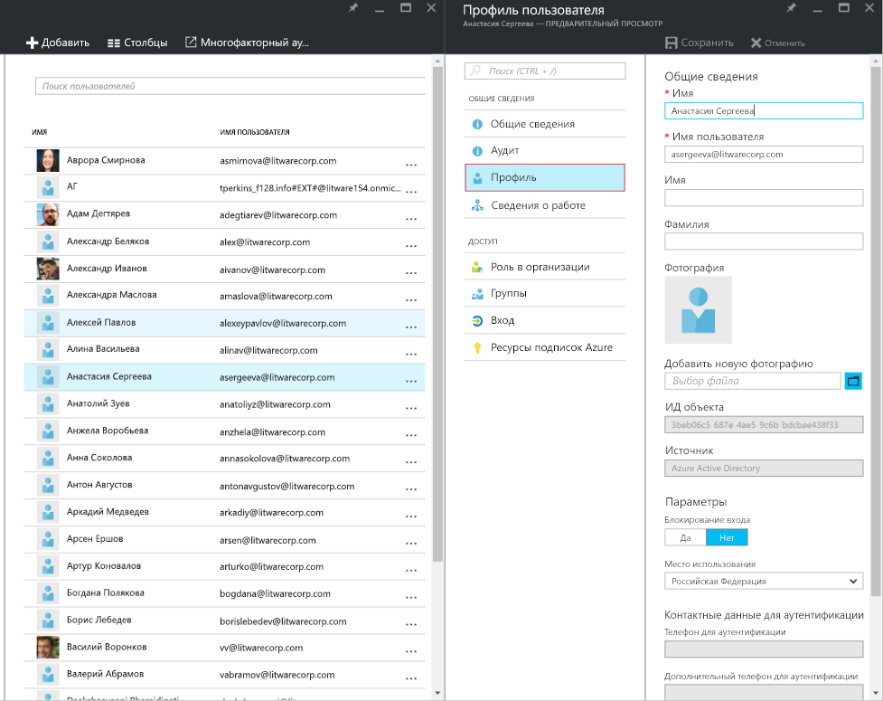
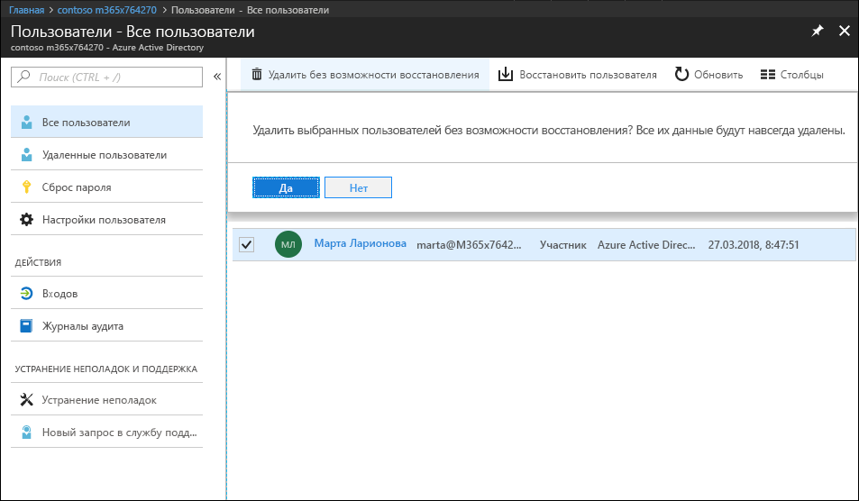
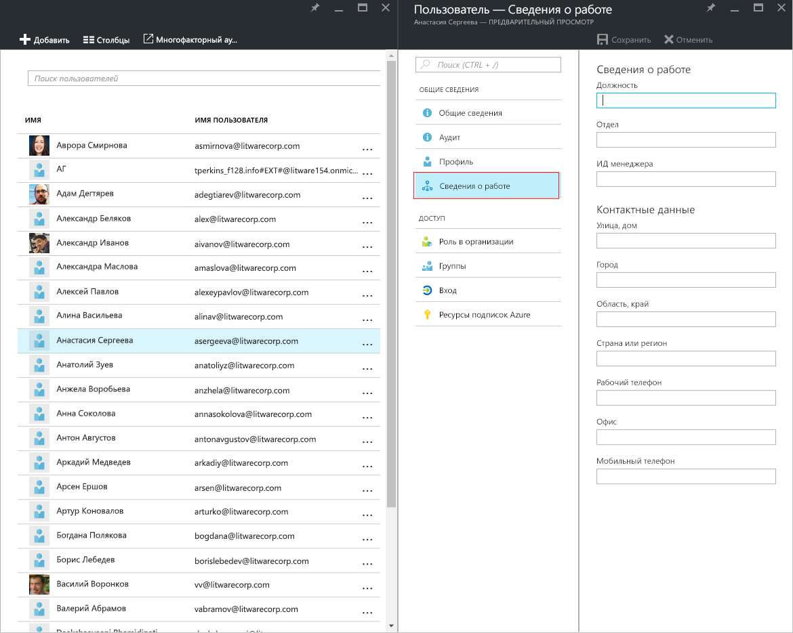
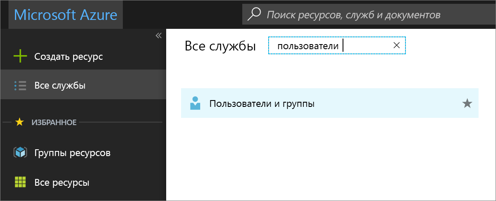
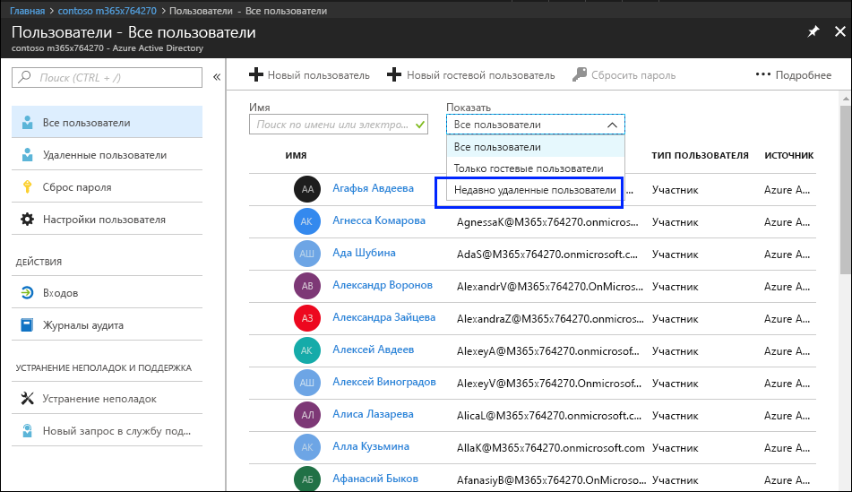
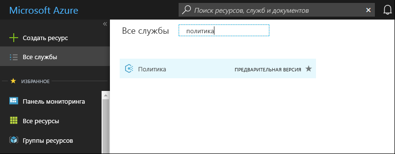
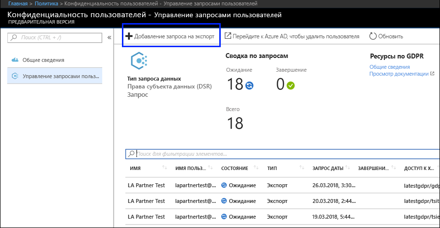
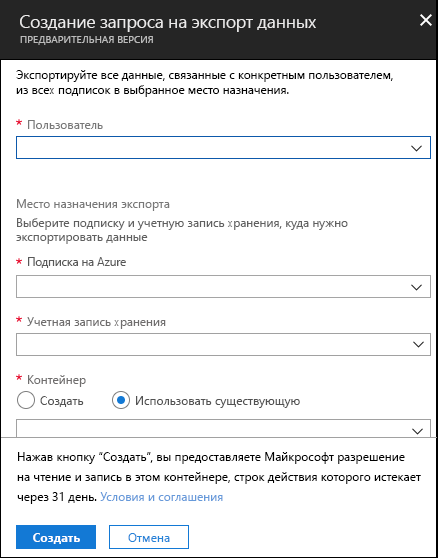

# Запросы субъектов данных Azure, определенные в GDPRAzure Data Subject Requests for the GDPR

## Общие сведения о запросах субъектов данных (Data Subject Request, DSR)Introduction to Data Subject Requests (DSRs)

Регламент ЕС по защите данных (GDPR) предоставляет лицам, упомянутым в регламенте как *субъекты данных*, право управлять персональными данными, собранными работодателем или другой организацией (так называемые *управляющие данными* или просто *управляющие*). Определение персональных данных в GDPR довольно широкое: они представляют собой любые данные, имеющие отношение к идентифицированному или идентифицируемому физическому лицу. GDPR предоставляет субъектам данных особые права в отношении их персональных данных. Они включают права на копирование персональных данных, запрос исправлений, ограничение обработки, удаление и получение данных в электронном формате для передачи другому управляющему. Официальный запрос, отправляемый субъектом данных управляющему для выполнения действия с персональными данными, называется *запросом субъекта данных* (DSR).The EU Data Protection Regulation (GDPR) gives rights to people (known in the regulation as *data subjects*) to manage the personal data that has been collected by an employer or other type of agency or organization (known as the *data controller* or just *controller*). Personal data is defined very broadly under the GDPR as any data that relates to an identified or identifiable natural person. The GDPR gives data subjects specific rights to their personal data; these rights include obtaining copies of personal data, requesting corrections to it, restricting the processing of it, deleting it, or receiving it in an electronic format so it can be moved to another controller. A formal request by a data subject to a controller to take an action on their personal data is called a *Data Subject Request* or DSR.

В этом руководстве рассказывается, как использовать продукты, службы и средства администрирования Майкрософт, чтобы помочь управляющим реагировать на запросы DSR. Это руководство включает инструкции по поиску персональных данных, хранящихся в облаке Майкрософт, получению доступа к ним и выполнению действий с ними. Ниже приведен краткий обзор процессов, описанных в данном руководстве.The guide discusses how to use Microsoft products, services and administrative tools to help our controller customers find and act on personal data to respond to DSRs. Specifically, this includes how to find, access, and act on personal data that reside in the Microsoft cloud. Here’s a quick overview of the processes outlined in this guide:

1.  ***Обнаружение***. C помощью средств поиска и обнаружения намного проще находить данные клиента, которые могут являться предметом DSR. После сбора потенциально конфиденциальных документов вы можете выполнить с ними одно или несколько действий DSR, описанных на последующих этапах, в ответ на запрос. Кроме того, вы можете определить, что запрос не соответствует рекомендациям по ответу на DSR, принятым в вашей организации.***Discover***—Use search and discovery tools to more easily find customer data that may be the subject of a DSR. Once potentially responsive documents are collected, you can perform one or more of the DSR actions described in the following steps to respond to the request. Alternatively, you may determine that the request doesn't meet your organization’s guidelines for responding to DSRs.

2.  ***Доступ.*** Получение персональных данных, размещенных в облаке Майкрософт и (по соответствующему запросу) создание копии этих данных, которая может быть доступна субъекту данных.***Access***—Retrieve personal data that resides in the Microsoft cloud and, if requested, make a copy of it that can be available to the data subject.

3.  ***Исправление.*** Внесение изменений или выполнение других требуемых действий с персональными данными (если это возможно).***Rectify***—Make changes or implement other requested actions on the personal data, where applicable.

4.  ***Ограничение.*** Ограничение обработки персональных данных путем удаления лицензий на использование различных служб Azure либо путем выключения соответствующих служб, если это возможно. Кроме того, вы можете удалить данные из облака Майкрософт и хранить их в локальной среде или другом месте.***Restrict***—Restrict the processing of personal data, either by removing licenses for various Azure services or turning off the desired services where possible. You can also remove data from the Microsoft cloud and retain it on-premises or at another location.

5.  ***Удаление.*** Безвозвратное удаление персональных данных, хранящихся в облаке Майкрософт.***Delete***—Permanently remove personal data that resided in the Microsoft cloud.

6.  ***Экспорт.*** Предоставление электронной копии персональных данных (в машиночитаемом формате) субъекту данных.***Export***—Provide an electronic copy (in a machine-readable format) of personal data to the data subject.

В каждом разделе этого руководства описываются методы, которыми управляющая данными организация может реагировать на запрос персональных данных в облаке Майкрософт.Each section in this guide outlines the technical procedures that a data controller organization can take to respond to a DSR for personal data in the Microsoft cloud.

### ТерминологияTerminology

Ниже представлены определения терминов, относящихся к данному руководству.The following provides definitions of terms that are relevant to this guide.

-   *Управляющий* — физическое или юридическое лицо, орган государственной власти, агентство или другое лицо, которое отдельно от других или вместе с ними определяет цели и средства обработки персональных данных; там, где цели и средства такой обработки данных определены законом Союза или государства-участника, в этом законе может быть указан управляющий или определенные критерии для его назначения.*Controller*—The natural or legal person, public authority, agency or other body which, alone or jointly with others, determines the purposes and means of the processing of personal data; where the purposes and means of such processing are determined by Union or Member State law, the controller or the specific criteria for its nomination may be provided for by Union or Member State law.

-   *Персональные данные* и *субъект данных* — любая информация, связанная с идентифицированным или идентифицируемым физическим лицом ("субъектом данных"). Идентифицируемым физическим лицом считается лицо, чью личность можно прямо или косвенно установить, в частности с помощью идентификатора, такого как имя, идентификационный номер, данные о местоположении, идентификатор в сети, либо с использованием одного или нескольких факторов, связанных с физическими, физиологическими, генетическими, ментальными, экономическими, культурными или социальными характеристиками этого физического лица.*Personal data* and *data subject*—Any information relating to an identified or identifiable natural person (‘data subject’); an identifiable natural person is one who can be identified, directly or indirectly, in particular by reference to an identifier such as a name, an identification number, location data, an online identifier or to one or more factors specific to the physical, physiological, genetic, mental, economic, cultural or social identity of that natural person.

-   *Обработчик* — физическое или юридическое лицо, орган государственной власти, агентство или другое лицо, которое обрабатывает персональные данные от лица управляющего.*Processor*—A natural or legal person, public authority, agency or other body which processes personal data on behalf of the controller.

-   *Данные клиента* — все данные (включая текст, звук, видео, изображения и программное обеспечение), предоставленные корпорации Майкрософт клиентом или от его имени через корпоративную службу. К данным клиента относятся (1) информация, позволяющая идентифицировать пользователей (например, их имена и контактные данные в Azure Active Directory) и контент клиента, отправляемый или создаваемый им в определенных службах (например, контент в учетной записи службы хранилища Azure либо базе данных Azure SQL или образ виртуальной машины Azure).*Customer Data*—All data, including all text, sound, video, or image files, and software, that are provided to Microsoft by, or on behalf of, a customer through use of the enterprise service. Customer Data includes both (1) identifiable information of end users (e.g., user names and contact information in Azure Active Directory) and Customer Content that a customer uploads into or creates in specific services (e.g., customer content in an Azure Storage account, customer content of an Azure SQL Database, or a customer’s virtual machine image in Azure Virtual Machines).

-   *Системные журналы* — журналы и связанные с ними данные, созданные корпорацией Майкрософт, которые помогают ей предоставлять пользователям корпоративные службы. Системные журналы в основном содержат анонимные данные, например уникальные идентификаторы (как правило, созданное системой число, по которому невозможно установить личность человека, но можно предоставлять пользователям корпоративные службы). Системные журналы также могут содержать информацию, позволяющую идентифицировать пользователя, например имя пользователя.*System-Generated Logs*—Logs and related data generated by Microsoft that help Microsoft provide enterprise services to users. System-generated logs contain primarily pseudonymized data, such as unique identifiers – typically a number generated by the system that cannot on its own identify an individual person but is used to deliver the enterprise services to users. System-generated logs may also contain identifiable information about end users, such as a user name.

### Как пользоваться руководствомHow to use this guide

Это руководство состоит из двух частей:This guide consists of two parts:

**Часть 1. Ответ на запросы данных клиента.** В 1-й части этого руководства описывается, как просматривать, исправлять, ограничивать, удалять и экспортировать данные из приложений, в которых вы создавали данные. В этом разделе подробно описывается выполнение DSR с контентом клиента, а также информацией, позволяющей идентифицировать пользователей.**Part 1: Responding to Data Subject Requests for Customer Data** — Part 1 of this guide discusses how to access, rectify, restrict, delete, and export data from applications in which you have authored data. This section details how to execute DSRs against both Customer Content and also identifiable information of end users.

**Часть 2. Ответ на запросы системных журналов**. Когда вы используете корпоративные службы, корпорация Майкрософт создает системные журналы. Во 2-й части этого руководства рассказывается, как просматривать, удалять и экспортировать такие сведения для Azure.**Part 2: Responding to Data Subject Requests for System-Generated Logs** — When you use Microsoft’s enterprise services, Microsoft generates some information, known as System-Generated Logs, in order to provide the service. Part 2 of this guide discusses how to access, delete and export such information for Azure.

### Общие сведения о запросах DSR для учетных записей Azure Active Directory и служб МайкрософтUnderstanding DSRs for Azure Active Directory and Microsoft Service Accounts

Рассматривая службы, предоставляемые корпоративным клиентам, выполнение запросов DSR всегда следует воспринимать в контексте определенного клиента Azure Active Directory (AAD). В частности, запросы DSR всегда выполняются в определенном клиенте AAD. Если пользователь участвует в нескольких клиентах, важно понимать, что тот или иной запрос DSR выполняется *только* в контексте конкретного клиента, в котором был получен запрос. Это важно понимать, так как это означает, что выполнение запроса DSR одним клиентом **не** повлияет на данные соседнего корпоративного клиента.When considering services provided to enterprise customers, execution of DSRs must always be understood within the context of a specific Azure Active Directory (AAD) tenant. Notably, DSRs are always executed within a given AAD tenant. If a user is participating in multiple tenants, it is important to emphasize that a given DSR is *only* executed within the context of the specific tenant the request was received within. This is critical to understand as it means the execution of a DSR by one enterprise customer **will not** impact the data of an adjacent enterprise customer.

То же относится и к учетным записям служб Майкрософт (MSA) в контексте служб, предоставляемых корпоративному клиенту: выполнение запроса DSR для учетной записи MSA, *связанной с клиентом AAD*, распространяется **только** на данные в клиенте. Кроме того, при работе с учетными записями MSA в клиенте важно понимать следующее:The same also applies for Microsoft Service Accounts (MSA) within the context of services provided to an enterprise customer: execution of a DSR against an MSA account *associated with an AAD tenant* **will only** pertain to data within the tenant. In addition, it is important to understand the following when handling MSA accounts within a tenant:

-   Если пользователь MSA создает подписку Azure, она будет рассматриваться как клиент AAD. Следовательно, запросы DSR применяются только к клиенту, как указывалось ранее.If an MSA user creates an Azure subscription, the subscription will be handled as if it were an AAD tenant. Consequently, DSRs are scoped within the tenant as described above.

-   Удаление подписки Azure, созданной с помощью учетной записи MSA, **не повлияет** на фактическую учетную запись MSA. Как упоминалось ранее, сфера применения запросов DSR, выполняемых в подписке Azure, ограничена самим клиентом.If an Azure subscription created via an MSA account is deleted, **it will not affect** the actual MSA account. Again, as noted above, DSRs executing within the Azure subscription are limited to the scope of the tenant itself.

Запросы информации из самой учетной записи MSA, **за пределами клиента**, выполняются на панели мониторинга конфиденциальности клиентов. Дополнительные сведения см. в руководстве по запросам субъектов данных Windows.DSRs against an MSA account itself, **outside a given tenant**, are executed via the Consumer Privacy Dashboard. Please refer to the Windows Data Subject Request Guide for further details.

## Часть 1. Руководство по запросам данных клиентаPart 1: DSR Guide for Customer Data

## Выполнение запросов данных клиентаExecuting DSRs against Customer Data

Корпорация Майкрософт предоставляет возможность просмотра, удаления и экспорта определенных данных клиента на портале Azure, а также напрямую через готовые программные интерфейсы (API) или пользовательские интерфейсы служб (другое название — *внутренние интерфейсы*). Подробные сведения о таких интерфейсах представлены в справочной документации по соответствующим службам.Microsoft provides the ability to access, delete, and export certain Customer Data through the Azure Portal and also directly via pre-existing application programming interfaces (APIs) or user interfaces (UIs) for specific services (also referred to as *in-product experiences*). Details regarding such in-product experiences are described in the respective services’ reference documentation.

>[Важно!][Important]  
> Службы, поддерживающие отправку DSR из продуктов, требуют непосредственного использования программного интерфейса (API) или пользовательского интерфейса (UI) службы, в котором описываются применимые операции CRUD (создание, чтение, обновление, удаление). Следовательно, DSR следует выполнять не только на портале Azure, но и в соответствующей службе, чтобы полностью выполнить запрос определенного субъекта данных. Дополнительные сведения см. в справочной документации по соответствующим службам.Services supporting in-product DSRs require direct usage of the service’s application programming interface (API) or user interface (UI), describing applicable CRUD (create, read, update, delete) operations. Consequently, execution of DSRs within a given service must be done in addition to execution of a DSR within the Azure Portal in order to complete a full request for a given data subject. Please refer to specific services’ reference documentation for further details.

## Шаг 1. ОбнаружениеStep 1: Discover

Прежде чем отвечать на DSR, необходимо найти персональные данные, к которым относится запрос. Обнаружив и изучив эти персональные данные, вы сможете определить, отвечает ли DSR требованиям вашей организации и следует ли выполнить или отклонить его. Например, ознакомившись с персональными данными, вы можете установить, что запрос не отвечает требованиям вашей организации, так как его выполнение отрицательно скажется на правах и свободах других лиц.The first step in responding to a DSR is to find the personal data that is the subject of the request. This first step - finding and reviewing the personal data at issue - will help you determine whether a DSR meets your organization's requirements for honoring or declining a DSR. For example, after finding and reviewing the personal data at issue, you may determine the request doesn’t meet your organization’s requirements because doing so may adversely affect the rights and freedoms of others.

После того как вы найдете необходимые данные, вы можете выполнить определенное действие, чтобы удовлетворить запрос от субъекта данных.After you find the data, you can then perform the specific action to satisfy the request by the data subject.

### Azure Active DirectoryAzure Active Directory

[Azure Active Directory](https://azure.microsoft.com/services/active-directory/) — это облачная мультитенантная служба Майкрософт для управления каталогами и удостоверениями. Вы можете находить информацию, позволяющую идентифицировать пользователей, например профили сотрудников и сведения о работе, которые содержат персональные данные, в вашей среде [Azure Active Directory](https://azure.microsoft.com/services/active-directory/) (AAD) с помощью [портала Azure](https://portal.azure.com/).[Azure Active Directory](https://azure.microsoft.com/services/active-directory/) is Microsoft’s cloud-based, multi-tenant directory and identity management service. You can locate identifiable information of end users, such as customer and employee user profiles and user work information that contain personal data in your [Azure Active Directory](https://azure.microsoft.com/services/active-directory/) (AAD) environment by using the [Azure portal](https://portal.azure.com/).

Это особенно полезно, если вам требуется найти или изменить персональные данные определенного пользователя. Вы также можете добавлять и редактировать профиль пользователя и сведения о работе. Необходимо войти, используя учетную запись глобального администратора каталога.This is particularly helpful if you want to find or change personal data for a specific user. You can also add or change user profile and work information. You must sign in with an account that’s a global admin for the directory.

#### Как найти или просмотреть профиль пользователя и сведения о работе?How do I locate or view user profile and work information?

1. Войдите на [портал Azure](https://portal.azure.com/), используя учетную запись глобального администратора каталога.Sign in to the [Azure portal](https://portal.azure.com/) with an account that's a global admin for the directory.

1. Выберите **Все службы**, введите в текстовом поле запрос **Пользователи и группы** и нажмите клавишу **ВВОД**.Select **All services**, enter **Users and groups** in the text box, and then select **Enter**.

     

3. В колонке **Пользователи и группы** выберите **Пользователи**.On the **Users and groups** blade, select **Users**.

     

4.  В колонке **Пользователи и группы — пользователи** выберите пользователя из списка, а затем в колонке соответствующего пользователя выберите **Профиль**, чтобы просмотреть данные профиля пользователя, которые могут содержать персональные данные.On the **Users and groups - Users** blade, select a user from the list, and then, on the blade for the selected user, select **Profile** to view user profile information that might contain personal data.

    

5. Если вам нужно добавить или изменить данные профиля пользователя, вы можете сделать это, а затем нажать на панели команд кнопку **Сохранить**.If you need to add or change user profile information, you can do so, and then, in the command bar, select **Save.**

<!-- steps 6 and 7 not in original 
6. On the blade for the selected user, select **Work Info** to view user work information that may contain personal data.

     

7. If you need to add or change user work information, you can do so, and then, in the command bar, select **Save.**

end of text to isolate -->

### Интерфейсы службService-Specific Interfaces

Корпорация Майкрософт предоставляет возможность находить данные клиента непосредственно через готовые программные интерфейсы (API) или пользовательские интерфейсы служб. Подробные сведения представлены в справочной документации по соответствующим службам, где описываются применимые операции CRUD (создание, чтение, обновление, удаление).Microsoft provides the ability to discover Customer Data directly via pre-existing application programming interfaces (APIs) or user interfaces (UIs) for specific services. Details are described in the respective services’ reference documentation, describing applicable CRUD (create, read, update, delete) operations.

## Шаг 2. ДоступStep 2: Access

После того как вы нашли данные клиента, содержащие персональные данные, которые, возможно, соответствуют DSR, только вы и ваша организация решаете, какие данные предоставить субъекту. Вы можете предоставить ему копию фактического документа, соответствующим образом отредактированную версию или снимки частей, которые, по вашему мнению, можно предоставить. Для каждого из таких ответов на запрос на доступ вам потребуется получить копию документа или другой элемент, который содержит необходимые данные.After you’ve found Customer Data containing personal data that is potentially responsive to a DSR, it is up to you and your organization to decide which data to provide to the data subject. You can provide them with a copy of the actual document, an appropriately redacted version, or a screenshot of the portions you have deemed appropriate to share. For each of these responses to an access request, you will have to retrieve a copy of the document or other item that contains the responsive data.

Когда вы предоставляете копию данных субъекту, вам может потребоваться удалить или отредактировать персональную информацию о других субъектах данных или конфиденциальные сведения.When providing a copy to the data subject, you may have to remove or redact personal information about other data subjects and any confidential information.

Ниже рассказывается, как получить копию данных в ответ на запрос доступа DSR.The following explains how to get a copy of data in response to a DSR access request.

### Azure Active DirectoryAzure Active Directory

Корпорация Майкрософт предоставляет как портал, так и внутренние интерфейсы, с помощью которых администратор клиента корпоративного пользователя может управлять запросами доступа DSR. С помощью запросов доступа DSR можно получать доступ к персональным данным пользователя, включая (а) информацию, позволяющую идентифицировать пользователя, и (б) системные журналы.Microsoft offers both a portal and in-product experiences providing the enterprise customer’s tenant administrator the capability to manage DSR access requests. DSR Access requests allow for access of the personal data of the user, including: (a) identifiable information about an end-user and (b) system-generated logs.

### Интерфейсы службService-Specific Interfaces

Корпорация Майкрософт предоставляет возможность находить данные клиента непосредственно через готовые программные интерфейсы (API) или пользовательские интерфейсы служб. Подробные сведения представлены в справочной документации по соответствующим службам, где описываются применимые операции CRUD (создание, чтение, обновление, удаление).Microsoft provides the ability to discover Customer Data directly via pre-existing application programming interfaces (APIs) or user interfaces (UIs) for specific services. Details are described in the respective services’ reference documentation, describing applicable CRUD (create, read, update, delete) operations.

## Шаг 3. ИсправлениеStep 3: Rectify

Если субъект попросил вас исправить персональные данные, хранящиеся в вашей организации, то вам и вашей организации необходимо определить, допустимо ли выполнение этого запроса. Для исправления данных может потребоваться редактировать, заменять или удалять персональные данные в документе или другом элементе. Ниже описывается наиболее эффективный способ сделать это для данных службы поддержки Майкрософт и FastTrack.If a data subject has asked you to rectify the personal data that resides in your organization’s data, you and your organization will have to determine whether it’s appropriate to honor the request. Rectifying the data may include taking actions such as editing, redacting, or removing personal data from a document or other type or item. The most expedient way to do this for Microsoft Support and FastTrack data is provided below.

### Azure Active DirectoryAzure Active Directory

Корпоративные клиенты могут управлять запросами DSR на исправление. Помимо прочего, им доступны ограниченные функции редактирования, соответствующие характеру конкретной службы Майкрософт. Как обработчик данных, корпорация Майкрософт не предоставляет возможность исправлять системные журналы, так как они отражают фактические действия и представляют собой хронологическую запись событий в службах Майкрософт. Что касается Azure Active Directory, ограниченные функции редактирования предназначены для исправления информации, позволяющей идентифицировать пользователя, как описывается ниже.Enterprise customers have the ability to manage DSR rectify requests, including limited editing features per the nature of a given Microsoft service. As a data processor, Microsoft does not offer the ability to correct system-generated logs as it reflects factual activities and constitutes a historical record of events within Microsoft services. With respect to Azure Active Directory, limited editing features exist to rectify identifiable information about an end-user, as described further below.

#### Azure Active Directory: исправление неправильных или неполных персональных данныхAzure Active Directory: rectify/correct inaccurate or incomplete personal data

Вы можете исправлять, обновлять и удалять информацию, позволяющую идентифицировать пользователей, например профили клиентов и сотрудников и сведения о работе, которые содержат персональные данные, такие как имя пользователя, должность, адрес или номер телефона, в среде [Azure Active Directory](https://azure.microsoft.com/services/active-directory/) (AAD) с помощью [портала Azure](https://portal.azure.com/). Необходимо войти, используя учетную запись глобального администратора каталога.You can correct, update, or delete identifiable information about end users, such as customer and employee user profiles and user work information that contain personal data, such as a user’s name, work title, address, or phone number, in your [Azure Active Directory](https://azure.microsoft.com/services/active-directory/) (AAD) environment by using the [Azure portal](https://portal.azure.com/). You must sign in with an account that’s a global admin for the directory.

##### Как исправить или обновить профиль пользователя и сведения о работе в Azure Active Directory?How do I correct or update user profile and work information in Azure Active Directory?

1.  Войдите на [портал Azure](https://portal.azure.com/), используя учетную запись глобального администратора каталога.Sign in to the [Azure portal](https://portal.azure.com/) with an account that's a global admin for the directory.

2.  Выберите **Все службы**, введите в текстовом поле запрос **Пользователи и группы** и нажмите клавишу **ВВОД**.Select **All services**, enter **Users and groups** in the text box, and then select **Enter**.

    

3.  В колонке **Пользователи и группы** выберите **Пользователи**.On the **Users and groups** blade, select **Users**.
         
    

4.  В колонке **Пользователи и группы — пользователи** выберите пользователя из списка, а затем в колонке соответствующего пользователя выберите **Профиль**, чтобы просмотреть данные профиля пользователя, которые требуется исправить или обновить.On the **Users and groups - Users** blade, select a user from the list, and then, on the blade for the selected user, select **Profile** to view the user profile information that needs to be corrected or updated.

    

5.  Исправьте или обновите сведения, а затем нажмите на панели команд кнопку **Сохранить**.Correct or update the information, and then, in the command bar, select **Save.**

6.  В колонке выбранного пользователя выберите **Сведения о работе**, чтобы просмотреть сведения о работе пользователя, которые требуется исправить или обновить.On the blade for the selected user, select **Work Info** to view user work information that needs to be corrected or updated.

    

7.  Исправьте или обновите сведения о работе пользователя, а затем нажмите на панели команд кнопку **Сохранить**.Correct or update the user work information, and then, in the command bar, select **Save.**

### Интерфейсы службService-Specific Interfaces

Корпорация Майкрософт предоставляет возможность находить данные клиента непосредственно через готовые программные интерфейсы (API) или пользовательские интерфейсы служб. Подробные сведения представлены в справочной документации по соответствующим службам, где описываются применимые операции CRUD (создание, чтение, обновление, удаление).Microsoft provides the ability to discover Customer Data directly via pre-existing application programming interfaces (APIs) or user interfaces (UIs) for specific services. Details are described in the respective services’ reference documentation, describing applicable CRUD (create, read, update, delete) operations.

## Шаг 4. ОграничениеStep 4: Restrict

Субъекты могут запрашивать ограничение обработки своих персональных данных. Мы предоставляем как портал Azure, так и готовые программные интерфейсы (API) и пользовательские интерфейсы. С их помощью администратор клиента корпоративного пользователя может управлять такими запросами DSR, экспортируя и/или удаляя данные. Клиент может (1) экспортировать электронную копию персональных данных пользователя, включая (а) учетные записи, (б) системные журналы и (в) связанные журналы, а затем (2) удалить учетную запись и связанные с нею данные, хранящиеся в системах Майкрософт.Data subjects may request that you restrict processing of their personal data. We provide both the Azure Portal and pre-existing application programming interfaces (APIs) or user interfaces (UIs). These experiences provide the enterprise customer’s tenant administrator the capability to manage such DSRs through a combination of data export and data deletion. A customer may (1) export an electronic copy of the personal data of the user, including (a) account(s), (b) system-generated logs, and (c) associated logs, followed with (2) deletion of the account and associated data residing within Microsoft systems.

## Шаг 5. УдалениеStep 5: Delete

"Право на стирание" путем удаления персональных данных из хранящихся в организации данных клиента — это ключевое право, предоставляемое GDPR. Оно включает удаление всех персональных данных и системных журналов. При **обратимом удалении** пользователя (см. подробности ниже), учетная запись отключается на 30 дней. Если в течение 30 дней больше не предпринимается никаких действий, пользователь **удаляется окончательно** (подробности также представлены ниже). Учетная запись, персональные данные и системные журналы пользователя стираются в течение 30 дней после **окончательного удаления**. Если администратор клиента сразу запрашивает **окончательное удаление**, то учетная запись, персональные данные и системные журналы пользователя стираются в течение 30 дней после запроса.The “right to erasure” by the removal of personal data from an organization’s Customer Data is a key protection in the GDPR. Removing personal data includes removing all personal data and system-generated logs, except audit log information. When a user is **soft deleted** (see details below), the account is disabled for 30 days. If no further action is taken during this 30 day period, the user is **permanently deleted** (again, see details below). Upon a **permanent delete**, the user’s account, personal data, and system-generated logs are expunged within an additional 30 days. If a tenant admin immediately issues a **permanent delete**, the user’s account, personal data, and system-generated logs are expunged within 30 days of issuance.

>[Важно!] Чтобы можно было удалить пользователя из клиента, необходимо быть администратором этого клиента.[Important] You must be a tenant administrator to delete a user from the tenant.

### Удаление пользователя и связанных с ним данных на портале AzureDelete a user and associated data through the Azure portal

Получив запрос на удаление от субъекта данных, вы можете использовать портал Azure, чтобы удалить как самого пользователя, так и соответствующие персональные данные, а также системные журналы.After you receive a delete request for a data subject, you can use the Azure portal to delete both a user and the associated personal information as well as system-generated logs.

При этом пользователь также удаляется из клиента. Сначала пользователи удаляются обратимо, то есть администратор клиента может восстановить учетную запись в течение 30 дней после удаления. Спустя 30 дней учетная запись автоматически (и безвозвратно) удаляется из клиента. До этого вы можете вручную удалить такого пользователя из корзины.Deleting this data also means deleting the user from the tenant. Users are initially soft-deleted, which means the account can be recovered by a tenant admin within 30 days of being marked for soft-delete. After 30 days, the account is automatically, and permanently, deleted from the tenant. Prior to that 30 days, you can manually delete a soft-deleted user from the recycle bin.

Ниже описывается высокоуровневый процесс удаления пользователей из клиента.Here’s the high-level process for deleting users from your tenant.

1.  Перейдите на портал Azure и найдите пользователя.Go to the Azure portal and locate the user.

2.  Удалите пользователя. При этом он сначала отправляется в корзину. **Это удаление обратимо, то есть учетная запись отключается, но не стирается из Azure Active Directory.**Delete the user. When you initially delete the user, the user’s account is sent to the Recycle Bin. **At this point, the user is soft deleted, meaning the account is disabled, but not expunged from Azure Active Directory.**

3.  Перейдите к списку "Недавно удаленные пользователи" и окончательно удалите пользователя. **При этом пользователь удаляется окончательно (это также называется необратимым удалением), то есть учетная запись стирается из Azure Active Directory**Go to the Recently deleted users list and permanently delete the user. **At this point the user is permanently deleted (also known as hard deleted), meaning the account has been expunged from Azure Active Directory**

##### Удаление пользователя из клиента AzureTo delete a user from an Azure tenant

1.  Откройте портал Azure, выберите колонку **Azure Active Directory**, а затем — **Пользователи**.Open the Azure portal, select the **Azure Active Directory** blade, and then select **Users**.

    Откроется колонка **Пользователи — все пользователи**.The **Users – All users** blade appears.

    

2.  Установите флажок рядом с нужным пользователем, выберите **Удалить пользователя**, а затем нажмите кнопку **Да** в окне подтверждения удаления пользователя.Check the box next to the user you want to delete, select **Delete user**, and then select **Yes** in the box asking if you want to delete the user.

    

3.  В раскрывающемся поле **Показать** выберите **Недавно удаленные пользователи**.In the **Show** drop-down box, select **Recently deleted users**.

    

4.  Снова выберите того же пользователя, щелкните **Удалить навсегда**, а затем нажмите кнопку **Да** в окне подтверждения.Select the same user again, select **Delete permanently**, and then select **Yes** in the box asking if you’re sure.

>[Важно!][Important]  
>Учтите, что при нажатии кнопки **Да** пользователь, связанные с ним данные и системные журналы окончательно и необратимо удаляются. Если это сделано по ошибке, потребуется вручную добавить пользователя в клиент. Соответствующие данные и системные журналы не подлежат восстановлению.Be aware that by clicking **Yes** you are permanently, and irrevocably, deleting the user and all associated data and system-generated logs. If you do this by mistake, you’ll have to manually add the user back to the tenant. The associated data and system-generated logs are non-recoverable.

   

### Интерфейсы службService-Specific Interfaces

Корпорация Майкрософт предоставляет возможность находить данные клиента непосредственно через готовые программные интерфейсы (API) или пользовательские интерфейсы служб. Подробные сведения представлены в справочной документации по соответствующим службам, где описываются применимые операции CRUD (создание, чтение, обновление, удаление).Microsoft provides the ability to discover Customer Data directly via pre-existing application programming interfaces (APIs) or user interfaces (UIs) for specific services. Details are described in the respective services’ reference documentation, describing applicable CRUD (create, read, update, delete) operations.

## Шаг 6. ЭкспортStep 6: Export

"Право на переносимость данных" позволяет субъекту запрашивать копию своих персональных данных в электронном формате (то есть "структурированном, широко применяемом, машиночитаемом и операционно совместимом формате"). Для этого в Azure реализована возможность экспорта данных в собственном формате JSON в указанный контейнер службы хранилища Azure.The “right of data portability” allows a data subject to request a copy of their personal data in an electronic format (that’s a “structured, commonly used, machine read-able and interoperable format”) that may be transmitted to another data controller. Azure supports this by enabling your organization to export the data in the native JSON format, to your specified Azure Storage Container.

>[Важно!] Чтобы можно было экспортировать данные пользователя из клиента, необходимо быть администратором этого клиента.[Important] You must be a tenant administrator to export user data from the tenant.

### Azure Active DirectoryAzure Active Directory

Что касается данных клиента, корпорация Майкрософт предоставляет портал и внутренние интерфейсы, с помощью которых администратор клиента может управлять запросами на экспорт информации, позволяющей идентифицировать пользователей.With respect to Customer Data, Microsoft offers both a portal and in-product experiences providing the enterprise customer’s tenant administrator the capability to manage export requests for identifiable information about an end-user.

### Интерфейсы службService-Specific Interfaces

Корпорация Майкрософт предоставляет возможность находить данные клиента непосредственно через готовые программные интерфейсы (API) или пользовательские интерфейсы служб. Подробные сведения представлены в справочной документации по соответствующим службам, где описываются применимые операции CRUD (создание, чтение, обновление, удаление).Microsoft provides the ability to discover Customer Data directly via pre-existing application programming interfaces (APIs) or user interfaces (UIs) for specific services. Details are described in the respective services’ reference documentation, describing applicable CRUD (create, read, update, delete) operations.

## Часть 2. Системные журналыPart 2: System-Generated Logs

Корпорация Майкрософт также предоставляет доступ к системным журналам, относящимся к работе пользователя с Azure, а также возможности их удаления и экспорта.Microsoft also provides you with the ability to access, delete and export certain system-generated logs associated with a user’s use of Azure.

>[!Important]
> Возможность ограничивать и исправлять системные журналы не предусмотрена. В системных журналах содержатся сведения о фактических действиях, выполненных в облаке Майкрософт, и диагностические данные. Изменение таких данных отрицательно скажется на хронологической записи действий, повышая риск мошенничества и нарушений безопасности.The ability to restrict or rectify system-generated logs is not supported. System-generated logs constitute factual actions conducted within the Microsoft cloud and diagnostic data, and modifications to such data would compromise the historical record of actions, increasing fraud and security risks.

## Выполнение запросов информации из системных журналовExecuting DSRs against System-Generated Logs

Корпорация Майкрософт предоставляет возможность просматривать, удалять и экспортировать определенные системные журналы на портале Azure Portal, а также напрямую через программные или пользовательские интерфейсы служб. Подробные сведения представлены в справочной документации по соответствующим службам.Microsoft provides the ability to access, delete, and export certain system-generated logs through the Azure Portal and also directly via programmatic interfaces or user interfaces for specific services. Details are described in the respective services’ reference documentation.

>[!Important]  
> Службы, поддерживающие внутреннее выполнение запросов DSR, требуют непосредственного использования программного интерфейса (API) или пользовательского интерфейса (UI) службы. Следовательно, DSR следует выполнять **не только на портале Azure, но и в продукте, чтобы полностью выполнить запрос определенного субъекта данных. Дополнительные сведения см. в справочной документации по соответствующим службам.**Services supporting in-product DSRs require direct usage of the service’s application programming interface (API) or user interface (UI). Consequently, execution of an in-product DSRs **must be done in addition to execution of a DSR within the Azure Portal in order to complete a full request for a given data subject. Please refer to specific services’ reference documentation for further details.**

## Шаг 1. ДоступStep 1: Access 

Администратор клиента — это единственный сотрудник организации, которому доступны системные журналы, относящиеся к работе пользователя с Azure. Данные, полученные по запросу доступа, будут предоставлены в машиночитаемом формате в виде файлов, с помощью которых пользователь сможет узнать, к каким службам относятся данные. Как упоминалось выше, полученные данные не будут включать данные, которые могут нарушить безопасность службы.The tenant admin is the only person within your organization who can access system-generated logs associated with a particular user’s use of Azure. The data retrieved for an access request will be provided in a machine-readable format and will be provided in files that will allow the user to know which services the data is associated with. As noted above, the data retrieved will not include data that may compromise the security of the service.

### Azure Active DirectoryAzure Active Directory

Корпорация Майкрософт предоставляет как портал, так и внутренние интерфейсы, с помощью которых администратор клиента корпоративного пользователя может управлять запросами доступа. С помощью запросов доступа можно получать доступ к персональным данным пользователя, включая (а) информацию, позволяющую идентифицировать пользователя, и (б) журналы служб. Этот процесс аналогичен описанному в подразделе, посвященном Azure Active Directory, раздела "Шаг 2. Доступ" (часть 1).Microsoft offers both a portal and in-product experiences providing the enterprise customer’s tenant administrator the capability to manage access requests. Access requests will allow for access of the personal data of the user, including: (a) identifiable information about an end-user and (b) service-generated logs. The process is identical to that described in the Azure Active Directory section of Part 1, Step 2: Access.

### Интерфейсы службService-Specific Interfaces

Корпорация Майкрософт предоставляет возможность находить данные клиента непосредственно через готовые программные интерфейсы (API) или пользовательские интерфейсы служб. Подробные сведения представлены в справочной документации по соответствующим службам, где описываются применимые операции CRUD (создание, чтение, обновление, удаление).Microsoft provides the ability to discover Customer Data directly via pre-existing application programming interfaces (APIs) or user interfaces (UIs) for specific services. Details are described in the respective services’ reference documentation, describing applicable CRUD (create, read, update, delete) operations.

## Шаг 2. УдалениеStep 2: Delete

Администратор клиента — единственный сотрудник организации, который может выполнить запрос DSR на удаление для определенного пользователя клиента Azure.The tenant admin is the only person within your organization who can execute a DSR delete request for a particular user within an Azure tenant.

### Azure Active DirectoryAzure Active Directory

Корпорация Майкрософт предоставляет портал и интерфейсы продуктов, с помощью которых администратор клиента может управлять запросами DSR на удаление. Запросы DSR на удаление работают так же, как описано в процедуре "Удаление пользователя и связанных с ними данных" в подразделе, посвященном порталу Azure, раздела "Шаг 5. Удаление" (часть 1).Microsoft offers both a portal and in-product experiences providing the enterprise customer’s tenant administrator the capability to manage DSR delete requests. DSR delete requests follow the same as described in the Delete a user and associated data through the Azure portal section of Part 1, Step 5: Delete.

### Интерфейсы службService-Specific Interfaces

Корпорация Майкрософт предоставляет возможность находить данные клиента непосредственно через готовые программные интерфейсы (API) или пользовательские интерфейсы служб. Подробные сведения представлены в справочной документации по соответствующим службам, где описываются применимые операции CRUD (создание, чтение, обновление, удаление).Microsoft provides the ability to discover Customer Data directly via pre-existing application programming interfaces (APIs) or user interfaces (UIs) for specific services. Details are described in the respective services’ reference documentation, describing applicable CRUD (create, read, update, delete) operations.

## Шаг 3. ЭкспортStep 3: Export

Администратор клиента — это единственный сотрудник организации, которому доступны системные журналы, относящиеся к работе пользователя с Azure. Данные, полученные по запросу на экспорт, будут предоставлены в машиночитаемом формате в виде файлов, с помощью которых пользователь сможет узнать, к каким службам относятся данные. Как упоминалось выше, полученные данные не будут включать данные, которые могут нарушить безопасность или стабильность службы.The tenant admin is the only person within your organization who can access system-generated logs associated with a particular user’s use of Azure. The data retrieved for an export request will be provided in a machine-readable format and will be provided in files that will allow the user to know which services the data is associated with. As noted above, the data retrieved will not include data that may compromise the security or stability of the service.

### Экспорт системных журналов с помощью портала AzureExport system-generated logs using the Azure portal

Получив запрос на экспорт от субъекта данных, вы можете экспортировать связанные с этим пользователем системные журналы с помощью портала Azure.After you receive an export request for a data subject, you can use the Azure portal to export system-generated logs associated with a given user.

Ниже представлен общий порядок экспорта данных из клиента.Here’s the high-level process for exporting data from your tenant.

1.  Перейдите на портал Azure и создайте запрос на экспорт от имени пользователя.Go to the Azure portal and create an export request on behalf of the user.

2.  Экспортируйте данные и отправьте файл пользователю.Export the data and send file to user.

##### Экспорт сведений о пользователе из клиента AzureTo export a user’s info from an Azure tenant

1.  Откройте портал Azure, выберите **Все службы**, введите в фильтре запрос *политика* и выберите **Политика**.Open the Azure portal, select **All services**, type *policy* into the filter, and then select **Policy**.

     

2.  В колонке **Политика** выберите **Конфиденциальность пользователя** > **Управление запросами пользователей** Ю **Добавить запрос на экспорт**.In the **Policy** blade, select **User privacy**, select **Manage User Requests**, and then select **Add export request**.

    

3.  Создайте **запрос на экспорт данных**:Complete the **Export data request**:

    

-   **Пользователь.** Введите электронный адрес пользователя Azure Active Directory, запросившего экспорт.**User.** Type the email address of the Azure Active Directory user that requested the export.

-   **Подписка.** Выберите учетную запись, используемую для создания отчетов об использовании ресурсов и выставления счетов за услуги. Кроме того, это расположение учетной записи хранилища Azure.**Subscription.** Select the account you use to report resource usage and to bill for services. This is also the location of your Azure storage account.

-   **Учетная запись хранения.** Выберите расположение службы хранилища Azure (для больших двоичных объектов). Дополнительные сведения см. в разделе "Хранилище BLOB-объектов" статьи [Общие сведения о службе хранилища Azure](https://docs.microsoft.com/azure/storage/common/storage-introduction#blob-storage).**Storage account.** Select the location of your Azure Storage (Blob). For more info, see the [Introduction to Microsoft Azure Storage – Blob storage](https://docs.microsoft.com/azure/storage/common/storage-introduction#blob-storage) article.

-   **Контейнер.** Создайте новый (или выберите существующий) контейнер в качестве места хранения экспортируемых конфиденциальных данных пользователя.**Container.** Create a new (or select an existing) container as the storage location for the user’s exported privacy data.

4.  Нажмите **Создать**.Select **Create**.

Запрос на экспорт перейдет в состояние **Ожидание**. Состояние отчета отображается в колонке **Конфиденциальность пользователей — обзор**.The export request goes into **Pending** status. You can view the report status on the **User privacy - Overview** blade.
>
>[Важно!][Important]  
>Так как персональные данные могут поступать из нескольких систем, экспорт может занять до одного месяца.Because personal data can come from multiple systems, it’s possible that the export process might take up to one month to complete.

### Интерфейсы службService-Specific Interfaces

Корпорация Майкрософт предоставляет возможность находить данные клиента непосредственно через готовые программные интерфейсы (API) или пользовательские интерфейсы служб. Подробные сведения представлены в справочной документации по соответствующим службам, где описываются применимые операции CRUD (создание, чтение, обновление, удаление).Microsoft provides the ability to discover Customer Data directly via pre-existing application programming interfaces (APIs) or user interfaces (UIs) for specific services. Details are described in the respective services’ reference documentation, describing applicable CRUD (create, read, update, delete) operations.

## Уведомление о проблемах при экспорте или удаленииNotify about exporting or deleting issues
Если при экспорте или удалении данных из портала Azure возникают проблемы, перейдите на портал Azure, выберите колонку **Справка и поддержка** и отправьте новый запрос в разделе **Управление подпиской > Другие запросы на обеспечение безопасности и соответствия > Конфиденциальность и запросы GDPR**.If you run into issues while exporting or deleting data from the Azure portal, go to the Azure portal **Help + Support** blade and submit a new ticket under **Subscription Management > Other Security and Compliance Request > Privacy Blade and GDPR Requests**.

#### Дополнительные сведенияLearn more
[Центр управления безопасностью (Майкрософт)Microsoft Trust Center](https://www.microsoft.com/TrustCenter/Privacy/gdpr/default.aspx)