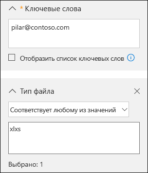
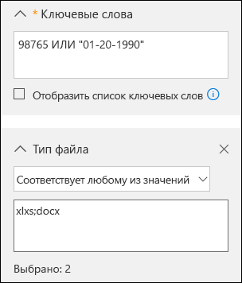

# <a name="office-365-data-subject-requests-for-the-gdpr"></a>Запросы субъектов данных Office 365 в рамках GDPR

## <a name="introduction-to-dsrs"></a>Общие сведения о запросах субъектов данных

Общий регламент по защите данных (General Data Protection Regulation, GDPR) предоставляет людям (называемым в регламенте *субъектами данных*) право управлять их персональными данными, собранными работодателем или организацией другого типа (*управляющим данными*, или *управляющим*). Определение персональных данных в GDPR довольно широкое: они представляют собой любые данные, имеющие отношение к идентифицированному физическому лицу или физическому лицу, которое можно идентифицировать. GDPR предоставляет субъектам данных особые права в отношении их персональных данных. Среди них права на копирование, внесение изменений, запрет на обработку, удаление, получение в электронном виде для перемещения к другому управляющему. Официальный запрос, отправляемый субъектом данных управляющему для выполнения действия над персональными данными, называется *запросом субъекта данных* (Data Subject Request, DSR). Управляющий обязан оперативно рассматривать все запросы субъектов данных и соответствующим образом реагировать на них: выполнять запрашиваемые действия либо сообщать причины, по которым не представляется возможным выполнить запрос субъекта данных. Управляющему следует консультироваться с советником по правовым вопросам либо по вопросам обеспечения соответствия требованиям в отношении каждого запроса субъекта данных.

В данном руководстве рассказывается, как c помощью продуктов, служб и средств администрирования Office 365 выполнять поиск персональных данных и действия над ними в ответ на запросы субъектов данных. Руководство содержит инструкции по поиску персональных данных, хранящихся в облаке Майкрософт, получению доступа к ним и выполнению действий над ними. Ниже изложены краткие сведения о процессах, описанных в данном руководстве.

1.  ***Обнаружение.*** Средства поиска и обнаружения (например, имеющиеся в Центре безопасности и соответствия требованиям Майкрософт) помогают находить контент клиентов, который может являться предметом запроса субъекта данных. После сбора потенциально релевантных документов вы можете выполнить с ними одно или несколько действий, описанных на последующих этапах, при подготовке ответа на запрос субъекта данных. Вы также можете решить, что запрос не соответствует рекомендациям по реагированию на запросы субъектов данных, принятым в вашей организации.

2.  ***Доступ.*** Получение персональных данных, размещенных в облаке Майкрософт и, по соответствующему запросу, предоставление их копии субъекту данных.

3.  ***Уточнение***. Внесение изменений или выполнение других запрошенных действий над персональными данными (если это возможно).

4.  ***Запрет.*** Ограничение обработки персональных данных путем удаления лицензий на использование различных служб Office 365 либо путем выключения соответствующих служб или функций, если это возможно. Кроме того, вы можете удалить данные из облака Майкрософт и хранить их в локальной среде или другом расположении.

5.  ***Удаление***. Безвозвратное удаление персональных данных, хранящихся в облаке Майкрософт.

6.  ***Экспорт***. Предоставление электронной копии персональных данных субъекту данных. В GDPR имеется понятие переносимости данных. Оно разрешает субъекту данных запрашивать электронную копию своих персональных данных в структурированном распространенном формате, пригодном для использования на компьютерах.

### <a name="terminology"></a>Терминология

Ниже приведены определения терминов из GDPR, релевантные для данного руководства.

- *Управляющий* — физическое или юридическое лицо, орган государственной власти, агентство или другое лицо, которое отдельно от других лиц или вместе с ними определяет цели и средства обработки персональных данных; если цели и средства такой обработки данных определены законом Европейского союза или государства-участника, в таком законе может быть указан управляющий или критерии для его назначения.

-   *Персональные данные* и *субъект данных* — любая информация, связанная с идентифицированным или идентифицируемым физическим лицом ("субъектом данных"). Идентифицируемым физическим лицом считается лицо, чью личность можно прямо или косвенно установить, в частности с помощью идентификатора, такого как имя, идентификационный номер, данные о местоположении, идентификатор в сети, либо с использованием одного или нескольких факторов, связанных с физическими, физиологическими, генетическими, ментальными, экономическими, культурными или социальными характеристиками этого физического лица.

-   *Обработчик* — физическое или юридическое лицо, орган государственной власти, агентство или другое лицо, которое обрабатывает персональные данные от имени управляющего.

### <a name="how-to-use-this-guide"></a>Как пользоваться руководством

Чтобы упростить поиск данных, относящихся к вашему варианту использования, данное руководство разделено на четыре части.

[Часть 1. Реагирование на запросы субъектов данных в отношении данных клиента.](#part-1-responding-to-dsrs-for-customer-data)  - * Данные клиента* – это данные, создаваемые и сохраняемые в Office 365 при ежедневных операциях, связанных с вашим бизнесом. К примерам широко используемых приложений Office 365, с помощью которых можно создавать данные, относятся Word, Excel, PowerPoint, Outlook и OneNote. Кроме того, в Office 365 имеются и другие приложения, например SharePoint Online, Teams и Forms, упрощающие совместную работу с другими пользователями. В части 1 данного руководства рассказывается, как обнаруживать, уточнять и удалять данные в приложениях Office 365, используемых для создания и хранения данных в веб-службах Office 365, а также экспортировать такие данные, предоставлять и запрещать доступ к ним. В этой части рассказывается о продуктах и службах, обработчиком данных которых для вашей организации является корпорация Майкрософт, благодаря чему у вашего администратора клиента появляется возможность обрабатывать запросы субъектов данных.

[Часть 2. Реагирование на запросы субъектов данных, относящиеся к аналитическим данным, созданным в Office 365](#part-2-responding-to-dsrs-with-respect-to-insights-generated-by-office-365). В Office 365 имеется ряд средств аналитики, доступных, например, в службах Delve, MyAnalytics и Workplace Analytics. В части 2 этого руководства рассказывается, как создаются эти аналитические данные и как реагировать на запросы субъектов данных, связанные с ними.

[Часть 3. Реагирование на запросы субъектов данных в части журналов, созданных системой.](#part-3-responding-to-dsrs-for-system-generated-logs) Когда вы используете корпоративные службы Office 365, корпорация Майкрософт создает определенную информацию, например журналы служб, в которые записываются сведения об использовании функций веб-служб и их работе. В большей части данных, созданных службами, содержатся идентификаторы-псевдонимы, созданные Майкрософт, и, таким образом, в данном документе эта категория в целом называется *журналами, созданными системой*. Несмотря на то что невозможно сопоставить эти данные с определенным субъектом данных без использования дополнительной информации, некоторые из этих данных могут считаться персональными согласно определению персональных данных в GDPR. В части 3 данного руководства рассказывается, как получать доступ к журналам, созданным системой, а также удалять и экспортировать их.

[Часть 4. Дополнительные ресурсы по работе с запросами субъектов данных](#part-4-additional-resources-to-assist-you-with-dsrs) - В части 4 данного руководства описан ряд сценариев, в которых корпорация Майкрософт выступает в роли управляющего данными при использовании определенных продуктов и служб Office 365.

> [!NOTE]
> В большинстве случаев, когда пользователи в вашей организации используют продукты и службы Microsoft Office 365, вы являетесь управляющим данными, а корпорация Майкрософт — обработчиком данных. Будучи управляющим данными, вы отвечаете за непосредственное реагирование на запросы субъектов данных. Чтобы помочь вам в этом, в частях 1–3 данного руководства описаны технические возможности, которые ваша организация может применять для реагирования на запросы субъектов данных. В ряде сценариев, когда пользователи используют определенные продукты и службы Office 365, управляющим данными является корпорация Майкрософт. Для этих случаев в части 4 рассказывается, каким образом субъекты данных могут отправлять запросы в корпорацию Майкрософт.


### <a name="office-365-national-clouds"></a>Национальные облачные развертывания Office 365

Службы Microsoft Office 365 также доступны в следующих национальных облачных средах: [Office 365 Germany](https://support.office.com/article/learn-about-office-365-germany-8a5a4bbc-667a-4cac-8769-d8ac9015db4c), [Office 365 под управлением 21Vianet (Китай)](https://support.office.com/article/Learn-about-Office-365-operated-by-21Vianet-A8AB5061-3346-4DA0-BB7C-5260822B53AE) и [Office 365 для государственных организаций США](https://technet.microsoft.com/library/mt774581.aspx). Большинство представленных в этом документе рекомендаций по управлению запросами субъектов данных применимы к этим национальным облачным средам. Однако в связи с изолированным характером этих сред существуют некоторые исключения. Если они существенны для того или иного подраздела, эти исключения указываются в соответствующем примечании.

### <a name="hybrid-deployments"></a>Гибридные развертывания

Ваша организация Office 365 может состоять из продуктов Майкрософт, представляющих собой сочетание облачных служб и локальных серверных продуктов. Как правило, в гибридном развертывании совместно используются учетные записи пользователей (управление удостоверениями) и ресурсы (например, почтовые ящики, веб-сайты и данные), находящиеся в облаке и локальной среде. К распространенным гибридным сценариям относятся:
- гибридные развертывания Exchange, где у одних пользователей почтовые ящики размещаются в локальной среде, а у других — в Exchange Online;
- гибридные развертывания SharePoint, где сайты и файловые серверы находятся в локальной среде, а учетные записи OneDrive для бизнеса — в Office 365;
- локальная система управления удостоверениями (Active Directory), синхронизированная с Azure Activity Directory — базовой службой каталогов в Office 365.

Отвечая на запрос DSR, вам может потребоваться определить, где находятся запрашиваемые данные — в Microsoft Cloud или в локальной организации, — а затем принять соответствующие меры по реагированию на этот запрос. Руководство по запросам субъектов данных Office 365 (данное руководство) содержит рекомендации по ответам в отношении облачных данных. Рекомендации касательно данных из локальной организации см. в статье [GDPR для локальных серверов Office](https://docs.microsoft.com/Office365/Enterprise/gdpr-for-office-servers). 


## <a name="part-1-responding-to-dsrs-for-customer-data"></a>Часть 1. Реагирование на запросы субъектов данных в отношении данных клиентов

Руководство по реагированию на запросы субъектов данных в отношении данных клиента разделено на четыре указанных ниже раздела.

- [Использование средства обнаружения электронных данных "Поиск контента" для реагирования на запросы субъектов данных](#using-the-content-search-ediscovery-tool-to-respond-to-dsrs)

- [Использование функций, имеющихся в приложениях, для реагирования на запросы субъектов данных](#using-in-app-functionality-to-respond-to-dsrs)

- [Реагирование на запросы субъектов данных на уточнение данных](#responding-to-dsr-rectification-requests)

- [Реагирование на запросы субъектов данных на запрет доступа к данным](#responding-to-dsr-restriction-requests)

### <a name="how-to-determine-the-office-365-applications-that-may-be-in-scope-for-a-dsr-for-customer-data"></a>Определение приложений Office 365, которые могут входить в область действия запросов субъектов данных в отношении данных клиента

Чтобы понять, где искать персональные данные или какие данные искать, необходимо определить приложения Office 365, которые пользователи в вашей организации могут использовать для создания и хранения данных в Office 365. Зная это, вы сузите круг приложений Office 365, попадающих в область действия запроса субъекта данных, и сможете определить, как выполнить поиск персональных данных, связанных с запросом субъекта данных, и получить доступ к ним. В частности, от этого зависит, можете ли вы использовать средство "Поиск контента" или вам придется использовать встроенные функции приложения, в котором были созданы данные.

Чтобы быстро понять, какие приложения Office 365 пользователи применяют для создания данных клиента, определите перечень приложений, входящих в Office 365 вашей организации. Чтобы сделать это, получите доступ к учетным записям пользователей на портале администрирования Office 365 и просмотрите сведения о лицензиях на продукты. См. статью [Назначение лицензий пользователям в Office 365 для бизнеса](https://docs.microsoft.com/office365/admin/subscriptions-and-billing/assign-licenses-to-users).

## <a name="using-the-content-search-ediscovery-tool-to-respond-to-dsrs"></a>Использование средства обнаружения электронных данных "Поиск контента" для реагирования на запросы субъектов данных

Когда вы ищете персональные данные в большом наборе данных, которые ваша организация создает и хранит с помощью Office 365, вам может сначала потребоваться проанализировать, какие приложения вероятнее всего использовались для создания данных, которые вы ищете. По оценкам Майкрософт более 90 % данных организаций, хранящихся в Office 365, созданы в Word, Excel, PowerPoint, OneNote и Outlook. Документы, созданные в этих приложениях Office (даже если приложения были приобретены через Office 365 профессиональный плюс или по бессрочной лицензии на Office), вероятнее всего, хранятся на сайтах SharePoint Online, в учетных записях OneDrive для бизнеса или в почтовых ящиках Exchange Online пользователей. Это означает, что вы можете использовать средство обнаружения электронных данных "Поиск контента" для поиска (и выполнения других действий, связанных с реагированием на запросы субъектов данных) на сайтах SharePoint Online, в учетных записях OneDrive для бизнеса и в почтовых ящиках Exchange Online (включая сайты и почтовые ящики, сопоставленные с Группами Office 365, Microsoft Teams, EDU Assignments и StaffHub), а также искать документы и элементы почтовых ящиков, которые могут относиться к выполняемым запросам субъектов данных. Кроме того, вы можете использовать средство "Поиск контента" для обнаружения данных клиента, созданных в других приложениях Office 365.

В таблице ниже перечислены приложения Office 365, применяемые для создания содержимого, которое можно обнаружить с помощью средства "Поиск контента". В этом разделе руководства по работе с запросами субъектов данных имеются рекомендации о том, как обнаруживать, экспортировать и удалять данные, созданные с помощью этих приложений Office 365, а также получать доступ к ним.

***Таблица 1. Приложения, в которых можно использовать средство "Поиск контента" для поиска данных клиента***

| | |
| :---: | :---:|
<br/>Календарь | <br />SharePoint Online |
| <br/>Excel |<br /> Skype для бизнеса|
| <br/>Office Lens |<br/> Задачи |
|<br/>OneDrive для бизнеса|<br />Teams|
| <br />OneNote| To-Do |
| <br />Outlook и Exchange Online | <br />Видео |
| <br />Люди|<br />Visio |
| <br />PowerPoint |  <br/> Word
||

<!-- end of table -->

> [!NOTE]
> Средство обнаружения электронных данных "Поиск контента" недоступно в [Office 365 под управлением 21Vianet (Китай)](https://support.office.com/article/Learn-about-Office-365-operated-by-21Vianet-A8AB5061-3346-4DA0-BB7C-5260822B53AE). Это означает, что данное средство не подходит для поиска и экспорта данных клиентов в приложениях Office 365, показанных в таблице 1. Однако вы можете использовать средство обнаружения электронных данных на месте в Exchange Online для поиска содержимого в почтовых ящиках пользователей. Вы также можете использовать центр обнаружения электронных данных в SharePoint Online для поиска контента на сайтах SharePoint и в учетных записях OneDrive. Кроме того, вы можете попросить владельца документа помочь вам найти, изменить, удалить либо экспортировать контент, если это требуется. Дополнительные сведения см. в следующих статьях:</br></br>&nbsp;&nbsp;• [Создание поискового запроса на локальное обнаружение электронных данных](https://technet.microsoft.com/library/dd353189(v=exchg.150).aspx)</br>&nbsp;&nbsp;• [Настройка центра обнаружения электронных данных в службе SharePoint Online](https://support.office.com/article/Set-up-an-eDiscovery-Center-in-SharePoint-Online-A18F8975-AA7F-43B4-A7D6-001D14744D8E)

### <a name="using-content-search-to-find-personal-data"></a>Поиск персональных данных с помощью средства "Поиск контента"

Первый этап при реагировании на запросы субъектов данных — поиск персональных данных, соответствующих запросу субъекта данных. Это подразумевает использование средств обнаружения электронных данных в Office 365 для поиска персональных данных (среди всех данных вашей организации в Office 365) или непосредственно приложения, в котором созданы эти данные. На этом этапе (поиск и проверка необходимых персональных данных) вы сможете определить, соответствует ли запрос субъекта данным требованиям вашей организации касательно принятия или отклонения запросов субъектов данных. Например, после того как вы нашли и проверили необходимые данные, вы, возможно, определили, что запрос не соответствует требованиям вашей организации, так как его выполнение может отрицательно сказаться на правах и свободах других лиц либо из-за того, что персональные данные содержатся в бизнес-записи, которую ваша организация заинтересована хранить, исходя из своих законных бизнес-интересов.

Как было сказано выше, по оценкам Майкрософт более 90 % данных организаций созданы с помощью приложений Office, например Word и Excel. Это означает, что вы можете находить данные, максимально соответствующие требованиям запросов субъектов данных, с помощью средства "Поиск контента" в Центре безопасности и соответствия требованиям.

В данном руководстве подразумевается, что вы или лицо, выполняющее поиск персональных данных, которые, возможно, соответствуют запросу субъекта данных, знакомы со средством "Поиск контента" в Центре безопасности и соответствия требованиям либо уже использовали его. Общие инструкции по использованию средства "Поиск контента" см. в статье [Поиск контента в Office 365](https://support.office.com/article/content-search-in-office-365-53390468-eec6-45cb-b6cd-7511f9c909e4). Убедитесь, что пользователю, выполняющему поиск, назначены необходимые разрешения в Центре безопасности и соответствия требованиям. Этого пользователя необходимо добавить в качестве участника группы ролей "Менеджер по обнаружению электронных данных" в Центре безопасности и соответствия требованиям. См. статью [Назначение разрешений для обнаружения электронных данных в Центре безопасности и соответствия требованиям Office 365](https://support.office.com/article/Assign-eDiscovery-permissions-in-the-Office-365-Security-Compliance-Center-5b9a067b-9d2e-4aa5-bb33-99d8c0d0b5d7). Рассмотрите возможность добавления других пользователей в вашей организации, которые участвуют в расследованиях, связанных с запросами субъектов данных, в группу ролей "Менеджер по обнаружению электронных данных", чтобы они могли выполнять необходимые действия в средстве "Поиск контента", например просматривать и экспортировать результаты поиска. Имейте в виду, что если вы не зададите границы соответствия (как описано [здесь](#set-up-compliance-boundaries-to-limit-the-scope-of-content-searches)), менеджер по обнаружению электронных данных сможет выполнять поиск во всех расположениях контента в вашей организации, включая расположения, которые, возможно, не связаны с запросом субъекта данных. 

После того как вы найдете нужные данные, вы можете выполнить действия, необходимые для выполнения запроса субъекта данных.

> [!NOTE]
> В Office 365 Germany Центр безопасности и соответствия требованиям расположен по адресу https://protection.office.de.


#### <a name="searching-content-locations"></a>Поиск в расположениях контента

С помощью средства "Поиск контента" вы можете выполнять поиск в расположениях контента указанных ниже типов.

-   Почтовые ящики Exchange Online. Этот тип включает почтовые ящики, сопоставленные с Группами Office 365 и Microsoft Teams

-   Общедоступные папки Exchange Online

-   Сайты SharePoint Online. Этот тип включает сайты, сопоставленные с Группами Office 365 и Microsoft Teams

-   Учетные записи OneDrive для бизнеса

> [!NOTE]
> В этом руководстве предполагается, что все данные, которые могут относиться к запросу субъекта данных, хранятся в Office 365, то есть в Microsoft Cloud. На данные, хранящиеся на локальных компьютерах пользователей или на локальных файловых серверах в вашей организации, не распространяются запросы в отношении данных, хранящихся в Office 365. Рекомендации по реагированию на запросы DSR в отношении данных в локальных организациях см. в статье [GDPR для локальных серверов Office](https://docs.microsoft.com/Office365/Enterprise/gdpr-for-office-servers).


#### <a name="tips-for-searching-content-locations"></a>Советы по поиску в расположениях контента

-   Начните работу с поиска во всех расположениях контента в вашей организации (которые вы включить в одну операцию поиска). Это позволит быстро определить, в каких расположениях контента содержатся элементы, которые соответствуют вашему поисковому запросу. Затем вы можете повторно выполнить поиск и сузить область поиска до определенных расположений, содержащих релевантные элементы.

-   С помощью статистики поиска определите основные расположения, в которых содержатся элементы, соответствующие вашему поисковому запросу. См. статью [Просмотр статистики ключевых слов для результатов поиска контента](https://support.office.com/article/View-keyword-statistics-for-Content-Search-results-9701a024-c52e-43f0-b545-9a53478aec04).

-   В журнале аудита Office 365 с помощью операции поиска найдите последние действия над файлами папками, выполненные пользователем, который является объектом запроса субъекта данных. Операция поиска в журнале аудита возвратит список записей аудита, содержащих имена и расположения ресурсов, с которыми пользователь недавно взаимодействовал. Вы, возможно, сможете использовать эту информацию для создания запроса на поиск контента. См. статью [Поиск по журналу аудита в Центре безопасности и соответствия требованиям Office 365](https://support.office.com/article/Search-the-audit-log-in-the-Office-365-Security-Compliance-Center-0d4d0f35-390b-4518-800e-0c7ec95e946c).

#### <a name="building-search-queries-to-find-personal-data"></a>Создание поисковых запросов для поиска персональных данных

Запросы субъектов данных, для выполнения которых вы ведете расследования, скорее всего, будут содержать идентификаторы, которые вы можете использовать в поисковых запросах по ключевым словам при поиске персональных данных. Ниже перечислены некоторые стандартные идентификаторы, которые можно использовать в поисковых запросах при поиске персональных данных.

-   Электронный адрес или псевдоним

-   Номер телефона

-   Почтовый адрес

-   Номер удостоверения сотрудника

-   Номер удостоверения государственного образца или аналог номера социального страхования для участника ЕС

В запросе субъекта данных, для выполнения которого вы ведете расследование, скорее всего, будет идентификатор и другие сведения о персональных данных, являющихся объектом запроса, которые вы можете использовать в поисковом запросе.

Поиск только по электронному адресу или номеру удостоверения сотрудника, возможно, возвратит большое количество результатов. Чтобы сузить область поиска (чтобы при его выполнении были возвращены результаты, наиболее релевантные запросу субъекта данных), вы можете добавить дополнительные условия в поисковый запрос. Когда вы добавляете условие, система связывает ключевое слово и условие поиска логическим оператором **AND** (И). Это означает, что в результатах поиска будут возвращены только те элементы, которые соответствуют *и ключевому слову, и условию*.

В таблице ниже перечислены некоторые условия, которые вы можете применять для сужения области поиска. Кроме того, в таблице указаны значения, которые вы можете использовать для каждого условия, чтобы выполнять поиск документов определенных типов и элементов в почтовых ящиках.

***Таблица 2. Сужение области поиска с помощью условий***
<!-- table starts here -->

||||
| :--- | :--- |:--- |
|**Условие**|**Описание** |**Пример значений условия**|
| Тип файла | Расширение документа или файла. Используйте это условие для поиска документов Office и файлов, созданных в приложениях Office 365. Используйте это условие при поиске документов, размещенных на сайтах SharePoint Online и в учетных записях OneDrive для бизнеса.<br/>Обратите внимание, что свойство соответствующего документа представляет собой тип файла. <br/>Полный список расширений файлов, поиск которых вы можете выполнять, см. в статье [Расширения имен файлов для обхода и анализируемые типы файлов в SharePoint, используемые по умолчанию](https://technet.microsoft.com/library/jj219530.aspx).|&nbsp;&bull;&nbsp;&nbsp;csv — поиск файлов данных с разделителями-запятыми (CSV-файлов); файлы Excel можно сохранить в формате CSV, а CSV-файлы можно без труда импортировать в Excel.<br><br>&bull;&nbsp;&nbsp;docx — поиск файлов Word. <br><br>&bull;&nbsp;&nbsp;mpp — поиск файлов Project.<br/><br>&bull;&nbsp;&nbsp;one — поиск файлов OneNote. <br><br>&bull;&nbsp;&nbsp;pdf — поиск файлов, сохраненных в формате PDF. <br><br>&bull;&nbsp;&nbsp;pptx — поиск файлов PowerPoint. <br><br>&bull;&nbsp;&nbsp;xlxs — поиск файлов Excel. <br><br>&bull;&nbsp;&nbsp;vsd — поиск файлов Visio. <br><br>&bull;&nbsp;&nbsp;wmv — поиск видеофайлов Windows Media. <br>|
| Тип сообщения | Тип электронных писем, которые необходимо найти. Используйте это условие, чтобы выполнять поиск контактов (Люди), собраний (Календарь), задач или бесед через Skype для бизнеса в почтовых ящиках. Обратите внимание, что соответствующее свойство электронного письма — *kind* (Тип).|&bull;&nbsp;&nbsp;*contacts* — поиск в списке "Мои контакты" (Люди) почтового ящика. <br><br>&bull;&nbsp;&nbsp;*email* — поиск электронных письмах. <br><br>&bull;&nbsp;&nbsp;*im* — поиск в беседах через Skype для бизнеса.<br><br>&bull;&nbsp;&nbsp;*meetings* —поиск во встречах и приглашениях на собрания (Календарь). <br><br>&bull;&nbsp;&nbsp;*tasks* — поиск в списке "Мои задачи" (Задачи); при использовании этого значения операция поиска также возвращает задачи, созданные в Microsoft To-Do.<br>|
| Тег соответствия требованиям |Метка, назначенная электронному письму или документу. Метки используются для классификации электронных писем и документов с целью выполнения правил управления данными и принудительного хранения данных на основе классификации, заданной меткой. С помощью этого условия вы можете выполнять поиск элементов, которым автоматически или вручную назначена метка.<br/>Это полезное условие для расследований при выполнении запросов субъектов данных, так как в вашей организации, возможно, используются метки для классификации контента, связанного с конфиденциальными данных или содержащего персональные данные либо конфиденциальную информацию. См. раздел "Поиск контента для нахождения всего содержимого, которому присвоена определенная метка" в статье [Общие сведения о метках](https://support.office.com/article/overview-of-labels-af398293-c69d-465e-a249-d74561552d30).|Тег compliance означает "персональные данные".|
||||

  <!-- table ends here -->                                                                                           
Существует много других свойств электронных писем и документов, а также условий поиска, с помощью которых можно создавать более сложные поисковые запросы. Дополнительные сведения см. в разделе справки [Запросы с ключевыми словами и условия для поиска содержимого](https://support.office.com/article/Keyword-queries-and-search-conditions-for-Content-Search-c4639c2e-7223-4302-8e0d-b6e10f1c3be3).

- [Свойства электронных писем, по которым можно выполнять поиск](https://support.office.com/article/Keyword-queries-and-search-conditions-for-Content-Search-c4639c2e-7223-4302-8e0d-b6e10f1c3be3)

- [Свойства сайтов (документов), по которым можно выполнять поиск](https://support.office.com/article/Keyword-queries-and-search-conditions-for-Content-Search-c4639c2e-7223-4302-8e0d-b6e10f1c3be3)

- [Условия поиска](https://support.office.com/article/Keyword-queries-and-search-conditions-for-Content-Search-c4639c2e-7223-4302-8e0d-b6e10f1c3be3)

#### <a name="searching-for-personal-data-in-sharepoint-lists-discussions-and-forms"></a>Поиск персональных данных в списках SharePoint, обсуждениях и формах

Помимо поиска персональных данных в документах вы можете также использовать средство "Поиск контента" для поиска данных других типов, созданных с помощью приложений SharePoint Online. Среди них данные, созданные с помощью списков SharePoint, обсуждений и форм. Когда вы запускаете средство "Поиск контента" и выполняете поиск на сайтах SharePoint Online (или в учетных записях OneDrive для бизнеса), в результатах поиска будут возвращены данные, соответствующие критериям поиска, из списков, обсуждений и форм.

##### <a name="examples-of-search-queries"></a>Примеры поисковых запросов

Ниже приведены примеры поисковых запросов, в которых используются ключевые слова и условия для поиска персональных данных при реагировании на запросы субъектов данных. В примерах показаны две версии запроса: один с синтаксисом ключевых слов (в котором условие включено в поле "Ключевое слово") и второй, представляющий собой версию запроса с условиями в графическом пользовательском интерфейсе.

##### <a name="example-1"></a>Пример 1

В этом примере система возвращает файлы Excel, размещенные на сайтах SharePoint Online и в учетных записях OneDrive для бизнеса и содержащие указанный электронный адрес. Обратите внимание, что система может возвратить файл, только если в метаданных файла указан электронный адрес.

***Синтаксис ключевых слов***

pilar@contoso.com AND filetype="xlxs"

***Графический пользовательский интерфейс***



##### <a name="example-2"></a>Пример 2

В этом примере система возвращает файлы Excel или Word, размещенные на сайтах SharePoint Online и в учетных записях OneDrive для бизнеса и содержащие указанный номер удостоверения или дату рождения сотрудника.

(98765 OR "01-20-1990") AND (filetype="xlxs" OR filetype="docx")

***Графический пользовательский интерфейс***



##### <a name="example-3"></a>Пример 3

В этом примере система возвращает электронные письма, содержащие указанные номера удостоверений, представляющие собой номера социального страхования для Франции (INSEE)

"1600330345678 97" AND kind="email"

***Графический пользовательский интерфейс***


#### <a name="working-with-partially-indexed-items-in-content-search"></a>Работа с частично индексированными элементами в средстве "Поиск контента"

Частично индексированные элементы (также называемые *неиндексированными элементами*) — это элементы в почтовых ящиках Exchange Online и документы на сайтах SharePoint Online и в учетных записях OneDrive для бизнеса, которые по какой-либо причине не были полностью индексированы для поиска. Это означает, что вам не удастся найти их с помощью средства "Поиск контента". Большая часть электронных писем и документов на сайтах успешно проиндексированы, потому что они попадают в [пределы индексирования для Office 365](https://support.office.com/article/limits-for-content-search-in-the-office-365-security-compliance-center-78fe3147-1979-4c41-83bb-aeccf244368d??). Ниже перечислены некоторые причины, по которым электронные письма или файлы могут быть не проиндексированы для поиска.

-   Файл имеет тип, который [не распознан или не поддерживается для индексирования](https://support.office.com/article/partially-indexed-items-in-content-search-in-office-365-d1691de4-ca0d-446f-a0d0-373a4fc8487b??). Бывают случаи, когда тип файла поддерживается для индексирования, но возникает ошибка индексирования для конкретного файла.

-   В электронных письмах имеется вложение в виде файла, для которого нет допустимого обработчика, например файла изображения (это наиболее частая причина частичной индексации элементов электронных писем).

-   Файлы, вложенные в электронные письма, слишком велики либо их слишком много.

Мы рекомендуем изучить дополнительные сведения о частично индексированных элементах, чтобы вы могли работать с ними при реагировании на запросы субъектов данных. Дополнительные сведения см. в указанных ниже статьях.

-   [Частично индексированные элементы в средстве "Поиск контента" в Office 365](https://support.office.com/article/partially-indexed-items-in-content-search-in-office-365-d1691de4-ca0d-446f-a0d0-373a4fc8487b??)

-   [Исследование частично индексированных элементов в функции обнаружения электронных данных в Office 365](https://support.office.com/article/investigating-partially-indexed-items-in-office-365-ediscovery-4e8ff113-6361-41e2-915a-6338a7e2a1ed)

-   [Экспорт неиндексированных элементов](https://support.office.com/article/Export-Content-Search-results-from-the-Office-365-Security-Compliance-Center-ed48d448-3714-4c42-85f5-10f75f6a4278#unidexeditems)

#### <a name="tips-for-working-with-partially-indexed-items"></a>Советы по работе с частично индексированными элементами

Возможно, что данные, отвечающие требованиям расследования при подготовке ответа на запрос субъекта данных, находятся в частично индексированном элементе. Ниже приведено несколько рекомендаций по работе с частично индексированными элементами.

-   После запуска поиска в разделе статистики поиска отображается оценочное количество частично индексированных элементов. Это количество не включает частично индексированные элементы в SharePoint Online и OneDrive для бизнеса. Чтобы получить сведения о частично индексированных элементах, экспортируйте отчеты для средства "Поиск контента". В отчете **Unindexed Items.csv** содержатся сведения о неиндексированных элементах, в том числе об их расположении, URL-адресах (если элементы находятся в SharePoint Online или OneDrive для бизнеса) и строке темы (для сообщений) или имени для документов. Дополнительные сведения см. в статье [Экспорт отчета средства "Поиск контента"](https://support.office.com/article/Export-a-Content-Search-report-5c8c1db6-d8ac-4dbb-8a7a-f65d452169b9).

-   Статистические данные и список частично индексированных элементов, которые система возвращает в результатах средства "Поиск контента", — это все частично индексированные элементы из расположений контента, в которых выполняется поиск.

-   Чтобы получить частично индексированные элементы, которые, возможно, соответствуют требованиям расследования, связанного c запросом субъекта данных, вы можете выполнить одно из указанных ниже действий.

##### <a name="export-all-partially-indexed-items"></a>Экспортировать все частично индексированные элементы

Вы можете экспортировать результаты средства "Поиск контента" и частично индексированные элементы из расположения контента, в котором вы выполняли поиск. Вы также можете экспортировать только частично индексированные элементы. Затем вы можете открыть их в их соответствующем приложении и проверить контент. Этот вариант следует использовать для экспорта элементов из SharePoint Online и OneDrive для бизнеса. См. статью [Экспорт результатов поиска контента из Центра безопасности и соответствия требованиям Office 365](https://support.office.com/article/Export-Content-Search-results-from-the-Office-365-Security-Compliance-Center-ed48d448-3714-4c42-85f5-10f75f6a4278).

##### <a name="export-a-specific-set-of-partially-indexed-items-from-mailboxes"></a>Экспорт определенного набора частично индексированных элементов из почтовых ящиков

Вместо того чтобы экспортировать все частично индексированные элементы почтовых ящиков, найденные в результате выполнения операции поиска, вы можете повторно запустить средство "Поиск контента", чтобы найти частично индексированные элементы из определенного списка, а затем экспортировать их. Обратите внимание, что вы можете сделать это только для элементов почтовых ящиков. См. статью [Подготовка CSV-файла для целенаправленного поиска контента в Office 365](https://support.office.com/article/prepare-a-csv-file-for-a-targeted-content-search-in-office-365-82c97bb4-2b64-4edc-804d-cedbda525d22).


### <a name="next-steps"></a>Следующие шаги

После того как вы найдете персональные данные, релевантные для запроса субъекта данных, сохраните параметры средства "Поиск контента", которые вы использовали для поиска необходимых данных. Скорее всего, вам потребуется повторно использовать средство "Поиск контента", чтобы выполнить другие действия в процессе подготовки ответа на запрос субъекта данных, например [получить его копию](#providing-a-copy-of-personal-data),  [экспортировать](#exporting-personal-data) или [безвозвратно удалить его.](#deleting-personal-data)

### <a name="additional-considerations-for-selected-applications"></a>Дополнительные рекомендации для отдельных приложений

В разделах ниже описаны действия, которые следует учитывать при поиске данных в указанных ниже приложениях Office 365.

-   [Office Lens](#office-lens)

-   [Параметры интерфейса OneDrive для бизнеса и SharePoint Online](#onedrive-for-business-and-sharepoint-online-experience-settings)

-   [Microsoft Teams для образования](#microsoft-teams-for-education)

-   [Microsoft To-Do](#microsoft-to-do)

-   [Skype для бизнеса](#skype-for-business)

#### <a name="office-lens"></a>Office Lens

Человек, использующий Office Lens (приложение для камеры, поддерживаемое устройствами с iOS, Android и Windows), может делать фотографии досок, печатных документов, визитных карточек и других объектов с большим количеством текста. В Office Lens используется технология распознавания текста, которая считывает текст с изображения и сохраняет его в документе Office, например в виде файла Word, PowerPoint или OneNote либо в виде PDF-файла. Затем пользователь может отправить файл, содержащий текст с изображения, в свою учетную запись OneDrive для бизнеса в Office 365. Это означает, что вы можете использовать средство "Поиск контента" для поиска, удаления и экспорта данных в файлах, созданных на основе изображений в Office Lens, а также для получения доступа к ним. Дополнительные сведения об Office Lens см. в указанных ниже статьях.

-   [Office Lens для iOS](https://support.office.com/article/Office-Lens-for-iOS-fbdca5f4-1b1b-4391-a931-dc1c2582397b)

-   [Office Lens для Android](https://support.office.com/article/Office-Lens-for-Android-ec124207-0049-4201-afaf-b5874a8e6f2b)

-   [Office Lens для Windows](https://support.office.com/article/Office-Lens-for-Windows-577ec09d-8da2-4029-8bb7-12f8114f472a)

#### <a name="onedrive-for-business-and-sharepoint-online-experience-settings"></a>Параметры интерфейса OneDrive для бизнеса и SharePoint Online

Помимо созданных пользователями файлов в учетных записях OneDrive для бизнеса и на сайтах SharePoint Online хранятся сведения о пользователях, которые используются для включения различных вариантов интерфейса. Пользователи, работающие в вашей организации, могут получать доступ к большей части этой информации, используя функции, которые имеются в продуктах. Ниже приведены рекомендации по получению доступа к данным приложений в OneDrive для бизнеса и SharePoint Online, а также по их просмотру и экспорту.

##### <a name="sharepoint-user-profiles"></a>Профили пользователей SharePoint

С помощью своих профилей Delve пользователи могут настраивать свойства, хранящиеся в профилях пользователей SharePoint Online, в том числе сведения о днях рождения, номера мобильных телефонов (и другие контактные данные), сведения о себе, о проектах, навыках, знаниях, образовании, интересах и хобби.

###### <a name="end-users"></a>Пользователи

Пользователи могут обнаруживать и уточнять данные в профилях пользователей SharePoint Online, а также получать к ним доступ с помощью интерфейса для работы с профилями Delve. Дополнительные сведения см. в статье [Просмотр и обновление профиля в Office Delve](https://support.office.com/article/view-and-update-your-profile-in-office-delve-4e84343b-eedf-45a1-aeb9-8627ccca14ba).

Кроме того, чтобы получить доступ к данным профиля SharePoint, пользователь может перейти на **страницу редактирования профиля** в своей учетной записи OneDrive для бизнеса. Чтобы перейти на эту страницу, добавьте имя **EditProfile.aspx** к URL-адресу учетной записи OneDrive для бизнеса. Например, для пользователя <strong>user1@contoso.com</strong> учетная запись OneDrive для бизнеса будет расположена по следующему адресу:
>`https://contoso-my.sharepoint.com/personal/user1\_contoso\_com/\_layouts/15/OneDrive.aspx`

URL-адрес страницы редактирования профиля будет таким:
>`https://contoso-my.sharepoint.com/personal/user1\_contoso\_com/\_layouts/15/EditProfile.aspx`

Обратите внимание, что в SharePoint Online вам не удастся изменить свойства, полученные из Azure Active Directory. Тем не менее пользователи могут перейти на свою страницу **Учетная запись**, выбрав свою **фотографию** в заголовке Office 365, а затем щелкнув **Моя учетная запись**. Чтобы изменить здесь свойства, возможно, потребуется помощь администраторов по обнаружению и уточнению свойств профиля пользователя, а также по доступу к ним.

**Администраторы**

В Центре администрирования SharePoint администратор может просматривать и уточнять свойства профилей, а также получать доступ к ним. Перейдите в **Центр администрирования SharePoint** и откройте вкладку **Профили пользователей**. Выберите **Управление профилями пользователей**, введите имя пользователя и нажмите кнопку **Найти**. Администратор может щелкнуть правой кнопкой мыши любого пользователя и выбрать пункт **Изменить мой профиль**. Обратите внимание, что в SharePoint Online невозможно изменить свойства, полученные из Azure Active Directory.

Администратор может экспортировать все свойства профиля пользователя с помощью командлета **Export-SPOUserProfile** в SharePoint Online PowerShell. См. статью [Export-SPOUserProfile](https://docs.microsoft.com/powershell/module/sharepoint-online/export-spouserprofile?view=sharepoint-ps).

Дополнительные сведения о профилях пользователей см. в статье [Управление профилями пользователей в Центре администрирования SharePoint](https://support.office.com/article/Manage-user-profiles-in-the-SharePoint-admin-center-494bec9c-6654-41f0-920f-f7f937ea9723).

##### <a name="user-information-list-on-sharepoint-online-sites"></a>Список сведений о пользователях на сайтах SharePoint Online

Часть профиля пользователя SharePoint синхронизируется со списком сведений о пользователях на каждом сайте, который он посещает или к которому ему предоставили доступ. Это используется в некоторых интерфейсах SharePoint Online, например в столбцах "Люди" в библиотеках документов, для отображения базовых сведений о пользователе, таких как имя создателя документа. Данные в списке сведений о пользователях соответствуют данным, хранящимся в профиле пользователя SharePoint, и автоматически исправляются при изменении источника. Что касается удаленных пользователей, эти данные остаются на посещенных ими сайтах в целях обеспечения целостности данных в полях столбцов SharePoint. 

Администраторы могут указывать, какие свойства можно реплицировать в Центре администрирования SharePoint. Для этого выполните указанные ниже действия.

1. Перейдите в **Центр администрирования SharePoint** и откройте вкладку **профили пользователей**. 

2. Нажмите **Управление свойствами пользователя**. Появится список свойств. 

3. Щелкните правой кнопкой мыши любое свойство, выберите пункт **Изменить** и настраивайте различные параметры. 

4. В разделе **Параметры политики** есть свойство replicable, указывающее, будет ли свойство представлено в списке сведений о пользователях. Обратите внимание, что это свойство можно настроить не для всех свойств.

Администратор может экспортировать все свойства сведений о пользователе на определенном сайте с помощью командлета **Export-SPOUserInfo** в SharePoint Online PowerShell. См. статью [Export-SPOUserInfo](https://docs.microsoft.com/powershell/module/sharepoint-online/export-spouserinfo?view=sharepoint-ps).

##### <a name="onedrive-for-business-experience-settings"></a>Параметры интерфейса OneDrive для бизнеса

В параметрах интерфейса OneDrive для бизнеса для пользователей хранятся сведения, с помощью которых пользователи могут находить интересующий их контент и переходить к нему. Пользователи могут получать доступ к большей части таких сведений, используя функции в продуктах. Администратор может экспортировать сведения с помощью [скрипта Windows PowerShell](https://docs.microsoft.com/powershell/scripting/powershell-scripting?view=powershell-6) и команд [клиентской объектной модели SharePoint (CSOM)](https://docs.microsoft.com/sharepoint/dev/sp-add-ins/complete-basic-operations-using-sharepoint-client-library-code).

Дополнительные сведения о параметрах, их хранении и экспорте см. в статье [Экспорт параметров интерфейса OneDrive для бизнеса](https://docs.microsoft.com/sharepoint/export-odfb-lists).

##### <a name="onedrive-for-business-and-sharepoint-online-search"></a>Поиск в OneDrive для бизнеса и SharePoint Online

Встроенная функция поиска в OneDrive для бизнеса и SharePoint Online сохраняет поисковые запросы пользователя в течение 30 дней, чтобы повысить релевантность результатов поиска. Администратор может экспортировать поисковые запросы пользователя с помощью командлета **Export-SPOQueryLogs** в SharePoint Online PowerShell. См. статью [Export-SPOQueryLogs](https://docs.microsoft.com/powershell/module/sharepoint-online/export-spoquerylogs?view=sharepoint-ps).

#### <a name="microsoft-teams-for-education"></a>Microsoft Teams для образования

Преподаватели и учащиеся могут использовать две дополнительные функции для совместной работы, которые создают и сохраняют персональные данные: Задания и Записную книжку OneNote для занятий. Вы можете использовать средство "Поиск контента" для обнаружения данных, созданных этими функциями.

##### <a name="assignments"></a>Задания

Файлы учащихся, сопоставленные с Заданиями, хранятся в библиотеке документов на соответствующем сайте SharePoint Online для Teams. ИТ-администраторы могут использовать средство "Поиск контента" для поиска файлов учащихся, связанных с заданиями. Например, администратор может выполнить поиск на всех сайтах SharePoint Online в организации и использовать имя и класс учащегося или название задания в поисковом запросе, чтобы найти данные, релевантные для запроса субъекта данных.

Существуют и другие данные, связанные с Заданиями, не хранящиеся на сайте SharePoint Online группы класса. Это означает, что это их не удастся обнаружить с помощью средства "Поиск контента". Среди них указанные ниже данные.

-   Файлы, которые преподаватели назначают учащимся в рамках задания

-   Оценки учащихся и обратная связь со стороны преподавателя

-   Список документов, переданных в качестве заданий учащимся

-   Метаданные задания

Чтобы найти данные этого типа, релевантные для запроса субъекта данных, ИТ-администратору или владельцу данных (например, преподавателю) может потребоваться перейти к Заданиям в группе класса.

##### <a name="onenote-class-notebook"></a>Записная книжка OneNote для занятий

Записная книжка OneNote для занятий хранится на сайте SharePoint Online группы класса. У каждого учащегося в классе есть личная записная книжка, доступ к которой есть у преподавателя. Кроме того, существует библиотека контента, в которой преподаватель может делиться документами с учащимися, и пространство для совместной работы для всех учащихся в классе. Данные, связанные с этими возможностями, можно обнаружить с помощью средства "Поиск контента".

Ниже приведены рекомендации по поиску данных в записной книжке для занятий.

1. Запустите средство "Поиск контента", используя указанные ниже критерии поиска.

   - Поиск на всех сайтах SharePoint Online

   - Включите название группы класса в качестве ключевого слова для поиска. Пример: 9C Biology

2. Просмотрите результаты поиска и найдите элемент, который соответствует записной книжке для занятий.

3. Выберите этот элемент и скопируйте путь к папке, отображаемый в области сведений. Это корневая папка для записной книжки для занятий.

4. Измените параметры поиска, созданного на этапе 1, и замените название класса в ключевом слове запроса на путь к папке записной книжки для занятий, а перед путем к папке укажите свойство **путь**. Пример: **path:<https://contosoedu.onmicrosoft.com/sites/9C> Biology/SiteAssets/9C Biology Notebook/**. Не забудьте указать кавычки и косую черту в конце.

5. Добавьте условие поиска, выберите условие File Type (Тип файла) и используйте его для значения типа файла. В результатах поиска будут возвращены все файлы OneNote. Полученный в результате синтаксис ключевого слова будет выглядеть приблизительно так:[](#building-search-queries-to-find-personal-data)

    ```
   path:"<https://contosoedu.onmicrosoft.com/sites/9C> Biology/SiteAssets/9C Biology Notebook/" AND filetype="one"
   ```

6.  Повторно запустите средство "Поиск контента". Результаты поиска должны содержать все файлы OneNote для записной книжки для занятий из группы класса.

#### <a name="microsoft-to-do"></a>Microsoft To-Do

Задачи (называемые *делами* и сохраненные в *списках дел*) в Microsoft To-Do сохраняются в виде задач в почтовом ящике Exchange Online пользователя. Это означает, что вы можете использовать средство "Поиск контента" для доступа к задачам, а также для их поиска, удаления и экспорта. Дополнительные сведения см. в статье [Настройка Microsoft To-Do](https://support.office.com/article/Set-up-Microsoft-To-Do-490c1a8c-2333-4952-8125-841afadb9620).

#### <a name="skype-for-business"></a>Skype для бизнеса

Ниже приведены сведения о том, как получать доступ к персональным данным в Skype для бизнеса, а также просматривать и экспортировать их.

-   Файлы, вложенные в собрание, хранятся в собрании в течение 180 дней, а затем становятся недоступными. Участники собрания могут получить доступ к этим файлам, присоединившись к собранию в приглашении на собрание. Сделав это, они могут просмотреть или скачать вложенный файл. См. раздел "Использование вложений во время собрания" в статье [Предварительная загрузка вложений для собрания Skype для бизнеса](https://support.office.com/article/preload-attachments-for-a-skype-for-business-meeting-fd3d9f9d-b448-4754-b813-02e49393f251).

-   Беседы в Skype для бизнеса хранятся в папке "Журнал бесед" в почтовых ящиках пользователей. Вы можете использовать средство "Поиск контента", чтобы выполнять поиск данных бесед Skype в почтовых ящиках.

-   Субъект данных может экспортировать свои контакты в Skype для бизнеса. Для этого необходимо щелкнуть правой кнопкой мыши группу контактов в Skype для бизнеса и выбрать пункт **Копировать**. Затем можно вставить список электронных адресов в текстовый документ или в документ Word.

-   Если почтовый ящик Exchange Online участника собрания помещен на хранение для судебного разбирательства или для него включена политика хранения Office 365, файлы, вложенные в собрание, хранятся в почтовых ящиках участников. С помощью средства "Поиск контента" вы можете выполнить поиск этих файлов в почтовом ящике участника (если срок хранения этих файлов еще не истек). Дополнительные сведения о хранении файлов см. в статье [Хранение больших файлов, вложенных в собрание Skype для бизнеса](https://docs.microsoft.com/skypeforbusiness/set-up-policies-in-your-organization/retaining-large-files-attached-to-a-meeting).

## <a name="providing-a-copy-of-personal-data"></a>Предоставление копии персональных данных

После того как вы нашли персональные данные, которые, возможно, соответствуют запросу субъекта данных, только вы и ваша организация решаете, какие данные предоставить субъекту данных. Например, вы можете предоставить ему копию документа, соответствующим образом отредактированную версию или снимки экрана частей, которые, как вы считаете, можно предоставить. Для каждого из таких ответов на запрос на доступ вам потребуется получить копию документа или другой элемент, который содержит необходимые данные.

Когда вы предоставляете копию данных субъекту данных, вам может потребоваться удалить или отредактировать персональную информацию о других субъектах данных или конфиденциальные сведения.


### <a name="using-content-search-to-get-a-copy-of-personal-data"></a>Получение копии персональных данных с помощью средства "Поиск контента"

Существует два способа использовать средство "Поиск контента" для получения копии документа или элемента почтового ящика, найденного в результате выполнения операции поиска.

-   Просмотрите результаты поиска и скачайте копию документа или элемента. Это удобный способ скачивания несколько элементов или файлов.

-   Экспортируйте результаты поиска, а затем скачайте копию всех элементов, возвращенных операцией поиска. Этот метод более сложный, но он хорошо подходит для скачивания большого количества элементов, соответствующих запросу субъекта данных. В экспортируемые результаты поиска также будут выключены полезные отчеты. Вы можете использовать эти отчеты для получения дополнительной информации о каждом элементе. Отчет **Results.csv** особенно полезен, так как в нем содержится много сведений об экспортированных элементах, например о точных расположениях элементов (пример: почтовый ящик для электронных писем или URL-адрес для документов или списков, размещенных на сайтах SharePoint Online и OneDrive для бизнеса). С помощью этих сведений вы сможете идентифицировать владельца элемента, если вам потребуется связаться с ним в процессе расследования для подготовки ответа на запрос субъекта данных. Дополнительные сведения об отчетах включаются в экспортируемые результаты поиска (см. статью [Экспорт отчета средства "Поиск контента"](https://support.office.com/article/Export-a-Content-Search-report-5c8c1db6-d8ac-4dbb-8a7a-f65d452169b9)).

#### <a name="preview-and-download-items"></a>Просмотр и скачивание элементов

После того как вы запустите новую операцию поиска или откроете существующую, вы сможете просмотреть каждый элемент, соответствующий параметрам поискового запроса, чтобы убедиться, что он имеет отношение к запросу субъекта данных, для которого вы ведете расследование. Среди этих элементов имеются списки и веб-страницы SharePoint, возвращенные в результатах поиска. Вы также можете скачать исходный файл (если вам необходимо предоставить его субъекту данных). В обоих случаях вы можете сделать снимок экрана, чтобы выполнить запрос субъекта данных на получение информации.

Имейте в виду, что вам, возможно, не удастся просмотреть элементы некоторых типов. Если для какого-либо элемента или типа файла не поддерживается функция просмотра, вы можете скачать элемент на свой локальный компьютер, на сопоставленный сетевой диск или в другое расположение в сети. Вы можете просматривать только [файлы поддерживаемых типов](https://support.office.com/article/content-search-in-office-365-53390468-eec6-45cb-b6cd-7511f9c909e4).

Чтобы просмотреть и скачать элементы, выполните указанные ниже действия.

1.  Откройте средство "Поиск контента" в Центре безопасности и соответствия требованиям.

2.  Если результаты не отображаются, щелкните **Просмотр результатов**.

3.  Чтобы просмотреть элемент, щелкните его.

4.  Щелкните **Скачать исходный файл**, чтобы скачать элемент на локальный компьютер. Вам также придется скачать элементы, просмотр которых не поддерживается.

Дополнительные сведения о просмотре результатов поиска см. в разделе [Предварительный просмотр результатов поиска](https://support.office.com/article/content-search-in-office-365-53390468-eec6-45cb-b6cd-7511f9c909e4).

#### <a name="export-and-download-items"></a>Экспорт и скачивание элементов

Вы также можете экспортировать результаты поиска контента, чтобы получить копию электронных писем, документов, списков и веб-страниц, содержащих персональные данные, хотя этот метод более трудоемкий, чем предварительный просмотр элементов. Сведения о том, как [экспортировать результаты работы средства "Поиск контента"](#export-and-download-content-using-content-search), см. в следующем разделе.

## <a name="exporting-personal-data"></a>Экспорт персональных данных

Понятие "право на переносимость данных" позволяет субъекту данных запрашивать электронную копию персональных данных в "структурированном широко распространенном формате, пригодном для использования на компьютерах" и требовать, чтобы ваша организация передала эти электронные файлы другому управляющему данными. Майкрософт поддерживает это право двумя указанными ниже способами.
- Предлагая приложения Office 365, которые сохраняют данные в пригодном использования на компьютерах и широко распространенном формате. Дополнительные сведения о форматах файлов Office см. в статье [Форматы файлов Office: технические документы](https://msdn.microsoft.com/library/office/cc313105(v=office.12).aspx).
- Предоставление вашей организации разрешения на экспорт данных в форматах файлов соответствующих приложений или в форматах (например, CSV, TXT и JSON), которые можно без труда импортировать в другое приложение.

Чтобы выполнить запрос субъекта данных, вы можете экспортировать документы Office в форматах файлов соответствующих приложений и экспортировать данные из других приложений Office 365.

### <a name="export-and-download-content-using-content-search"></a>Экспорт и скачивание контента помощью средства "Поиск контента"

Когда вы экспортируете результаты работы средства "Поиск контента", вы можете скачать элементы почты в виде PST-файлов либо в виде отдельных сообщений (MSG-файлов). Когда вы экспортируете документы и списки с сайтов SharePoint Online и OneDrive для бизнеса, система экспортирует копии в форматах файлов соответствующих приложений. Например, списки SharePoint экспортируются в виде CSV-файлов, а веб-страницы — в виде ASPX- или HTML-файлов.

> [!NOTE]
> Чтобы экспортировать элементы почтового ящика из почтового ящика пользователя с помощью средства "Поиск контента", необходимо, чтобы пользователю (из почтового ящика которого вы экспортируете элементы) была назначена лицензия на план 2 Exchange Online. 

Чтобы экспортировать и скачать элементы, выполните указанные ниже действия.

1.  Откройте средство "Поиск контента" в Центре безопасности и соответствия требованиям.

2.  На всплывающей странице поиска щелкните  **Дополнительно**, а затем — **Экспорт результатов**. Имейте в виду, что вы также можете экспортировать отчет.

3.  Заполните разделы на всплывающей странице **Экспорт результатов**. С помощью полосы прокрутки прокрутите содержимое страницы и просмотрите все параметры экспорта.

4.  Вернитесь на страницу средства "Поиск контента" в Центре безопасности и соответствия требованиям и откройте вкладку **Экспорт**.

5.  Обновите страницу, нажав кнопку **Обновить**.

6.  В столбце **Имя** щелкните задание экспорта, которое вы только что создали. Имя задания экспорта — это имя операции поиска контента, после которого следует слово **\_Export** (Экспорт).

7.  На всплывающей странице экспорта в разделе **Ключ экспорта** щелкните **Копировать в буфер обмена**. Вы воспользуетесь этим ключом для скачивания результатов поиска в действии 10.

8.  В верхней части всплывающей страницы щелкните  **Скачать результаты**.

9.  Если вам будет предложено установить **средство экспорта службы обнаружения электронных данных Microsoft Office 365**, щелкните **Установить**.

10. В **средстве экспорта службы обнаружения электронных данных** в соответствующем поле вставьте ключ экспорта, который вы скопировали в действии 7.

11. Нажмите кнопку **Обзор** и укажите расположение, в которое вы хотите скачать файлы результатов поиска.

12. Нажмите кнопку **Запустить**, чтобы скачать результаты поиска на свой компьютер.

По завершении экспорта вы можете получить доступ к этим файлам в расположении на локальном компьютере, в которое они были скачаны. Результаты поиска контента будут скачаны в папку, название которой совпадает с названием операции поиска контента. Документы с сайтов копируются во вложенную папку с названием **SharePoint**. Элементы почтовых ящиков копируются во вложенную папку с названием **Exchange**.

Подробные пошаговые инструкции см. в статье [Экспорт результатов поиска контента из Центра безопасности и соответствия требованиям Office 365](https://support.office.com/article/Export-Content-Search-results-from-the-Office-365-Security-Compliance-Center-ed48d448-3714-4c42-85f5-10f75f6a4278).


### <a name="downloading-documents-and-lists-from-sharepoint-online-and-onedrive-for-business"></a>Скачивание документов и списков из SharePoint Online и OneDrive для бизнеса

Еще один способ экспортировать данные из SharePoint Online и OneDrive для бизнеса — скачать документы и списки непосредственно с сайта SharePoint Online или из учетной записи OneDrive для бизнеса. Получите разрешения на доступ к сайту, перейдите на сайт и скачайте необходимый контент. См. указанные ниже статьи.

-   [Скачивание файлов и папок из OneDrive или SharePoint](https://support.office.com/article/download-files-and-folders-from-onedrive-or-sharepoint-5c7397b7-19c7-4893-84fe-d02e8fa5df05)

-   [Экспорт списков SharePoint в Excel](https://support.office.com/article/export-to-excel-from-sharepoint-bfb2ea48-6118-4fa9-abb6-cced9424e5d9)

При выполнении некоторых запросов субъектов данных на экспорт данных вам может потребоваться разрешить субъекту данных самостоятельно скачать контент. В этом случае субъекту данных необходимо перейти на сайт SharePoint Online или в общую папку и щелкнуть **Синхронизировать**, чтобы синхронизировать все содержимое библиотеки документов или выбранных папок. См. указанные ниже статьи.

-   [Предоставление пользователям возможности синхронизировать файлы SharePoint с помощью нового клиента синхронизации OneDrive](https://support.office.com/article/Enable-users-to-sync-SharePoint-files-with-the-new-OneDrive-sync-client-22e1f635-fb89-49e0-a176-edab26f69614)

-   [Синхронизация файлов SharePoint с помощью нового клиента синхронизации OneDrive](https://support.office.com/article/sync-sharepoint-files-with-the-new-onedrive-sync-client-6de9ede8-5b6e-4503-80b2-6190f3354a88)

## <a name="deleting-personal-data"></a>Удаление персональных данных

Понятие "право на очистку" путем удаления персональных данных из данных клиента организации — это ключевая мера защиты в GDPR. Удаление персональных данных подразумевает полное удаление документов или файлов либо удаление определенных данных в документах или файлах (эти действие и процесс аналогичны действиям и процессам, описанным в разделе "Уточнение" данного руководства).

Когда вы ведете расследование или подготавливаете персональные данные в ответ на запрос субъекта данных, необходимо понимать несколько важных аспектов работы функций удаления (и хранения) в Office 365.

-   **Обратимое и необратимое удаление**. В службах Office 365, например в Exchange Online, SharePoint Online и OneDrive для бизнеса, используются понятия *обратимого* и *необратимого удаления*, от которых зависит возможность восстановления удаленного элемента (обычно в течение ограниченного периода) до момента его безвозвратного удаления из облака Майкрософт без возможности восстановления. В этом контексте пользователь или администратор может восстановить обратимо удаленный элемент в течение определенного периода времени до момента необратимого удаления элемента. После необратимого удаления элемента он помечается для безвозвратного удаления и вскоре будет удален соответствующей службой Office 365. Ниже описано, как работают операции обратимого и необратимого удаления элементов в почтовых ящиках и на сайтах (независимо от того, кто удаляет их, владелец или администратор).

    -   **Почтовые ящики.** Обратимое удаление элемента выполняется, когда элемент удаляют из папки "Удаленные" либо когда пользователь удаляет его, нажав клавиши **SHIFT+DELETE**. После обратимого удаления элемента система перемещает его в папку "Элементы с возможностью восстановления" в почтовом ящике. На этом этапе пользователь может восстановить элемент до истечения срока его хранения (в Office 365 удаленные элементы хранятся 14 дней, но администратор может увеличить этот срок до 30 дней). По истечении срока хранения система выполняет необратимое удаление элемента и перемещает его в скрытую папку (называемую *Очистка*). Элемент будет безвозвратно удален (очищен) из Office 365 при следующей обработке почтового ящика (обработка почтовых ящиков выполняется раз в 7 дней).

    -   **Сайты SharePoint Online и OneDrive для бизнеса**. При удалении файла или документа система перемещает его в корзину сайта (называемую *первой корзиной*), которая аналогична корзине в ОС Windows. Элемент остается в корзине в течение 93 дней (период хранения удаленного элемента для сайтов в Office 365). По окончании этого периода система автоматически перемещает элемент в корзину семейства веб-сайтов, которая называется *второй корзиной*. (Обратите внимание, что пользователи или администраторы с соответствующими правами могут удалять элементы из первой корзины). На этом этапе элемент становится обратимо удаленным; его может восстановить администратор семейства веб-сайтов в SharePoint Online либо пользователь или администратор OneDrive для бизнеса. После удаления элемента из второй корзины (вручную или автоматически) он становится необратимо удаленным и недоступным для пользователя или администратора. Обратите внимание, что продолжительность периода хранения равна 93 дням и для первой, и для второй корзины. То есть период хранения для второй корзины начинается при первом удалении элемента; таким образом, максимальное суммарное время хранения в обеих корзинах составляет 93 дня.

> [!NOTE]
> Понимая, какие действия приводят к обратимому и необратимому удалению элемента, вы сможете определять, как удалять данные способом, соответствующим требованиям GDPR, в ответ на запрос на удаление.

-   **Политики удержания по юридическим причинам и хранения**. В Office 365 "удержание" может представлять собой место в почтовых ящиках и на сайтах. Вкратце, это означает, что если почтовый ящик или сайт находится на удержании, никакие элементы не подлежат безвозвратному (необратимому) удалению, пока не закончится период хранения для элемента либо пока удержание не будет отменено. Это важно в контексте удаления контента клиентов в ответ на запросы субъектов данных: если элемент необратимо удален из расположения контента, находящегося на удержании, элемент не будет безвозвратно удален из Office 365. Это означает, что ИТ-администратор сможет восстановить этот элемент. Если в вашей организации есть требование или политика, подразумевающие безвозвратное удаление данных в Office 365 без возможности восстановления в ответ на запрос субъекта данных, то чтобы безвозвратно удалить данные в Office 365, потребуется отменить удержание для соответствующего почтового ящика или сайта. Более чем вероятно, что в принятых в вашей организации рекомендациях по реагированию на запросы субъектов данных будет описан процесс определения того, что имеет преимущество: удержание по юридическим причинам или запрос субъекта данных на удаление. Если необходимо отменить удержание для удаления элементов, то после удаления необходимых элементов можно снова включить удержание.

### <a name="deleting-documents-in-sharepoint-online-and-onedrive-for-business"></a>Удаление документов в SharePoint Online и OneDrive для бизнеса

После того как вы найдете документ, размещенный на сайте SharePoint Online или в учетной записи OneDrive для бизнеса (выполнив рекомендации в разделе "Обнаружение" данного руководства), который необходимо удалить, потребуется назначить специалисту по конфиденциальности данных или ИТ-администратору необходимые разрешения для доступа к сайту и удаления документа. Если это допустимо, можно также проинструктировать владельца документа о том, как удалить документ.

Ниже в общих чертах описан процесс удаления документов с сайтов.

1.  Перейдите на сайт и найдите нужный документ.

2.  Удалите документ. Когда вы удаляете документ с сайта, система переносит его в первую корзину.

3.  Перейдите в первую корзину (корзину сайта) и удалите документ, который вы удалили в предыдущем действии. Документ будет отправлен в корзину второго уровня. **На этом этапе документ будет обратимо удаленным**.

4.  Перейдите во вторую корзину (корзину семейства веб-сайтов) и удалите документ, который вы удалили из первой корзины. **На этом этапе документ будет необратимо удаленным.**

> [!IMPORTANT]
> Вам не удастся удалить элемент, который находится на сайте, поставленном на удержание (с помощью одной из функций хранения или удержания по юридическим причинам в Office 365). Если запрос субъекта данных на удаление имеет преимущество перед удержанием по юридическим причинам, то перед безвозвратным удалением документа необходимо отменить удержание.

Подробные описания процедур представлены в перечисленных ниже статьях.

- [Удаление файла, папки или ссылки из библиотеки документов SharePoint](https://support.office.com/article/Delete-a-file-folder-or-link-from-a-SharePoint-document-library-71f3c90a-0d24-4d80-8b66-f88234b79a52#ID0EAADAAA=Online)

- [Удаление элементов из корзины сайта SharePoint и ее очистка](https://support.office.com/article/delete-items-or-empty-the-recycle-bin-of-a-sharepoint-site-2e713599-d13e-40d6-96dc-66f0a366f74e#ID0EAADAAA=Online)

- [Удаление элементов из корзины семейства веб-сайтов](https://support.office.com/article/Delete-items-from-the-site-collection-Recycle-Bin-dd5c00c2-aef6-4458-9d04-80b185077653#ID0EAADAAA=Online)

- Раздел "Получение доступа к документам бывшего сотрудника в OneDrive для бизнеса" в статье [Получение доступа к данным бывшего пользователя и создание их резервной копии](https://support.office.com/article/get-access-to-and-back-up-a-former-user-s-data-a6f7f9ad-e3f5-43de-ade5-e5a0d7531604)

- [Удаление файлов и папок в OneDrive для бизнеса](https://support.office.com/article/Delete-files-or-folders-in-OneDrive-21fe345a-e488-4fa7-932b-f053c1bebe8a)

- [Удаление списка в SharePoint](https://support.office.com/article/delete-a-list-in-sharepoint-2a7bca5b-b8fd-4e5b-8f4b-2ac034f3070d#ID0EAADAAA=Online)

- [Удаление элементов списка в SharePoint Online](https://support.office.com/article/delete-list-items-in-sharepoint-online-db722233-4a38-4889-a6cf-4b33fe5c60c0)

### <a name="deleting-a-sharepoint-site"></a>Удаление сайта SharePoint

Может выясниться, что лучший способ отреагировать на запрос субъекта данных на удаление — удалить весь сайт SharePoint, в результате чего будут удалены все данные на этом сайте. Чтобы сделать это, выполните соответствующие командлеты в SharePoint Online PowerShell.

-   С помощью командлета [Remove-SPOSite](https://docs.microsoft.com/powershell/module/sharepoint-online/remove-sposite?view=sharepoint-ps) можно удалить сайт и переместить его в корзину SharePoint Online (обратимое удаление).

-   С помощью командлета [Remove-SPODeletedSite](https://docs.microsoft.com/powershell/module/sharepoint-online/remove-spodeletedsite?view=sharepoint-ps) можно безвозвратно удалить сайт (необратимое удаление).

Обратите внимание, что вам не удастся удалить сайт, который поставлен на удержание службой обнаружения электронных данных или к которому применена политика хранения. Чтобы можно было удалить такой сайт, сначала необходимо отменить удержание службы обнаружения электронных данных или политику хранения.

### <a name="deleting-a-onedrive-for-business-site"></a>Удаление сайта OneDrive для бизнеса

Аналогично, в ответ на запрос субъекта данных на удаление вы можете принять решение удалить сайт пользователя в OneDrive для бизнеса. Если вы удалите учетную запись пользователя в Office 365, сайт пользователя в OneDrive для бизнеса будет храниться (и его можно будет восстановить) в течение 30 дней. По истечении 30-дневного срока сайт будет перемещен в корзину SharePoint Online (обратимо удален), а по истечении 93-дневного срока он будет безвозвратно (необратимо) удален. Чтобы ускорить этот процесс, вы можете с помощью командлета [Remove-SPOSite](https://docs.microsoft.com/powershell/module/sharepoint-online/remove-sposite?view=sharepoint-ps) переместить сайт OneDrive для бизнеса в корзину, а затем с помощью командлета [Remove-SPODeletedSite](https://docs.microsoft.com/powershell/module/sharepoint-online/remove-spodeletedsite?view=sharepoint-ps) безвозвратно удалить его. Как и в случае с сайтом в SharePoint Online, вам не удастся удалить сайт пользователя в OneDrive для бизнеса, если он поставлен на удержание службой обнаружения электронных данных или к нему применена политика хранения, до удаления учетной записи пользователя.

### <a name="deleting-onedrive-for-business-and-sharepoint-online-experience-settings"></a>Удаление параметров интерфейса OneDrive для бизнеса и SharePoint Online

Помимо созданных пользователями файлов в учетных записях OneDrive для бизнеса и на сайтах SharePoint Online хранятся сведения о пользователе, которые применяются для включения различных интерфейсов. Эта возможность была описана выше в данном документе. Сведения о том, как получать доступ к данным приложений в OneDrive для бизнеса и SharePoint Online, а также просматривать и экспортировать их, см. в подразделе [Дополнительные рекомендации для отдельных приложений](#additional-considerations-for-selected-applications) раздела [Использование средства обнаружения электронных данных "Поиск контента" для реагирования на запросы субъектов данных](#using-the-content-search-ediscovery-tool-to-respond-to-dsrs).

#### <a name="deleting-a-sharepoint-user-profile"></a>Удаление профиля пользователя SharePoint

Система удаляет профиль пользователя SharePoint через 30 дней после удаления учетной записи пользователя в Azure Active Directory. Вы можете необратимо удалить учетную запись пользователя, что приведет к удалению профиля пользователя SharePoint. Дополнительные сведения см. в разделе [Удаление пользователя](#deleting-a-user) в данном руководстве.

Администратор может ускорить удаление профиля пользователя с помощью командлета **Remove-SPOUserProfile** в SharePoint Online PowerShell. См. статью [Remove-SPOUserProfile](https://docs.microsoft.com/powershell/module/sharepoint-online/remove-spouserprofile?view=sharepoint-ps). Для этого пользователь должен быть по крайней мере обратимо удален в Azure Active Directory.

#### <a name="deleting-user-information-lists-on-sharepoint-online-sites"></a>Удаление списков сведений о пользователях на сайтах SharePoint Online

Данные пользователей, покинувших организацию, остаются на посещенных ими сайтах для обеспечения целостности данных в полях столбцов SharePoint. Администратор может удалить все свойства сведений о пользователе с определенного сайта при помощи командлета **Remove-SPOUserInfo** в SharePoint Online PowerShell. Сведения о выполнении этого командлета PowerShell см. в статье [Remove-SPOUserInfo](https://docs.microsoft.com/powershell/module/sharepoint-online/remove-spouserinfo?view=sharepoint-ps).

По умолчанию эта команда сохранит отображаемое имя пользователя и удалит такие свойства, как номер телефона, электронный адрес, навыки и опыт работы или другие свойства, скопированные из профиля пользователя SharePoint Online. С помощью параметра **RedactUser** пользователь может указать альтернативное отображаемое имя пользователя в списке сведений о пользователях. Это повлияет на некоторые аспекты работы пользователя и приведет к потере данных при просмотре журнала файлов на сайте.

И, наконец, с помощью функции редактирования невозможно удалить какие-либо метаданные или контент, ссылающиеся на пользователя из документов. Способ редактирования контента описывается в разделе [Внесение изменений в контент в OneDrive для бизнеса и в SharePoint Online](#making-changes-to-content-in-onedrive-for-business-and-sharepoint-online) данного руководства. Этот способ заключается в скачивании, удалении и отправке отредактированной копии файла.

#### <a name="deleting-onedrive-for-business-experience-settings"></a>Удаление параметров интерфейса OneDrive для бизнеса

Рекомендуемый способ удаления всех параметров и данных OneDrive для бизнеса — удаление сайта OneDrive для бизнеса, принадлежащего этому пользователю, после переназначения всех сохраненных файлов другим пользователям. Администратор может удалять эти списки с помощью [скрипта Windows PowerShell ](https://docs.microsoft.com/powershell/scripting/powershell-scripting?view=powershell-6) и команд [клиентской объектной модели SharePoint (CSOM)](https://docs.microsoft.com/sharepoint/dev/sp-add-ins/complete-basic-operations-using-sharepoint-client-library-code). Дополнительные сведения о параметрах, их хранении и удалении см. в статье [Удаление параметров интерфейса OneDrive для бизнеса](https://docs.microsoft.com/sharepoint/delete-odfb-lists).

#### <a name="onedrive-for-business-and-sharepoint-online-search-queries"></a>Поисковые запросы в OneDrive для бизнеса и SharePoint Online

Система автоматически удаляет поисковые запросы пользователей, созданные в интерфейсе поиска OneDrive для бизнеса и SharePoint Online, через 30 дней после их создания.

### <a name="deleting-items-in-exchange-online-mailboxes"></a>Удаление элементов в почтовых ящиках Exchange Online

Чтобы выполнить запрос субъекта данных на удаление, вам, возможно, потребуется удалить элементы в почтовых ящиках Exchange Online. ИТ-администратор может удалять элементы в почтовых ящиках двумя способами в зависимости от того, как необходимо удалить элементы, обратимо или необратимо. Как и в случае с документами на сайтах SharePoint Online или OneDrive для бизнеса, вам не удастся безвозвратно удалить элементы в почтовых ящиках, поставленных на удержание, в Office 365. Прежде чем удалять элементы, необходимо отменить удержание. И снова, вам потребуется определить, что имеет преимущество — удержание почтового ящика или запрос субъекта данных на удаление.

#### <a name="soft-delete-mailbox-items"></a>Обратимое удаление элементов почтовых ящиков

С помощью действий средства "Поиск контента" вы можете обратимо удалять элементы, возвращенные средством "Поиск контента". Как рассказано выше, система перемещает обратимо удаленные элементы в папку "Элементы с возможностью восстановления" в почтовом ящике.

Ниже кратко описан этот процесс.

1.  Создайте и запустите операцию в средстве "Поиск контента", чтобы найти элементы, которые вы хотите удалить из почтового ящика пользователя. Возможно, вам придется повторно запустить поиск и сузить область результатов поиска, чтобы в них были только те элементы, которые вам необходимо удалить.

2.  С помощью команды **New-ComplianceSearchAction** **-Purge** в Office 365 PowerShell обратимо удалите элемент, возвращенный средством "Поиск контента", который вы создали в предыдущем действии.

Подробные инструкции см. в статье [Поиск и удаление электронных писем в организации Office 365](https://support.office.com/article/Search-for-and-delete-email-messages-in-your-Office-365-organization-Admin-Help-3526fd06-b45f-445b-aed4-5ebd37b3762a).

#### <a name="hard-delete-mailbox-items"></a>Необратимое удаление элементов почтовых ящиков

Если в ответ на запрос субъекта данных на удаление вам необходимо необратимо удалить элементы, воспользуйтесь командой **Search-Mailbox -DeleteContent** в Exchange Online Windows PowerShell. Если вы применяете этот метод, рассмотрите возможность использования средства "Поиск контента" для разработки и уточнения поискового запроса, чтобы операция поиска возвращала только те элементы, которые необходимо удалить. Затем вы сможете использовать этот синтаксис запроса при выполнении команды **Search-Mailbox -DeleteContent**.

Подробные инструкции см. в статье [Поиск и удаление сообщений](https://technet.microsoft.com/library/ff459253(v=exchg.150).aspx).

#### <a name="hard-delete-items-in-a-mailbox-on-hold"></a>Необратимое удаление элементов в почтовом ящике, поставленном на удержание

Как было сказано выше, если вы попытаетесь необратимо удалить элементы в почтовом ящике, поставленном на удержание, они не будут удалены из него. Они будут перемещены в скрытую папку (папку **Purges**) в папке "Элементы с возможностью восстановления" и останутся там, пока не закончится срок удержания для элемента либо пока не будет отменено удержание для почтового ящика. Если случится одно из этих двух событий, элементы будут очищены и удалены из Office 365 при следующей обработке почтового ящика.

Ваша организация может решить, что элементы, безвозвратно удаляемые по истечении срока удержания, соответствуют требованиям запроса субъекта данных на удаление. Тем не менее если вы решите, что необходимо немедленно удалить элементы в почтовом ящике из Office 365, вам потребуется отменить удержание для почтового ящика, а затем необратимо удалить элементы из почтового ящика. Подробные инструкции см. в статье [Удаление элементов из папки "Элементы с возможностью восстановления" в облачном почтовом ящике на удержании — справка для администраторов](https://support.office.com/article/Delete-items-in-the-Recoverable-Items-folder-of-cloud-based-mailboxes-on-hold-Admin-Help-a85e1c87-a48e-4715-bfa9-d5275cde67b0).

> [!NOTE]
> Чтобы необратимо удалить элементы почтового ящика для выполнения запроса субъекта данных на удаление путем выполнения процедуры, описанной в предыдущем разделе, вам, возможно, придется обратимо удалить эти элементы, когда почтовый ящик будет все еще находиться на удержании, чтобы система переместила элементы в папку "Элементы с возможностью восстановления".

## <a name="deleting-a-user"></a>Удаление пользователя

Помимо удаления персональных данных в ответ на запрос субъекта данных на удаление, право субъекта данных "на забвение" можно реализовать, удалив учетную запись пользователя этого субъекта в Office 365. Ниже перечислены несколько причин, по которым вам может потребоваться удалить пользователя.

-   Субъект данных больше не работает в вашей организации (или находится в процессе увольнения).

-   Субъект данных прислал запрос на удаление созданных системой журналов, в которых содержатся сведения о нем. Вот примеры данных в журналах, созданных системой: данные об использовании приложений и служб Office 365, информация о поисковых запросах, выполненных субъектом данных, а также данные, созданные продуктом и службами в результате работы системы и взаимодействия пользователей или других систем. Дополнительные сведения см. в разделе [Часть 3. Реагирование на запросы субъектов данных в части журналов, созданных системой](#part-3-responding-to-dsrs-for-system-generated-logs) в данном руководстве.

-   Необходимо на постоянной основе запретить субъекту данных обработку данных в Office 365 и доступ к ним (в противоположность временному запрету доступа c помощью методов, описанных в разделе [Реагирование на запросы субъектов данных на запрет доступа к данным](#responding-to-dsr-restriction-requests).

После удаления учетной записи пользователя в Office 365:

-   Пользователь больше не сможет входить в Office 365 или получать доступ к каким-либо ресурсам вашей организации в Office 365, например к своей учетной записи OneDrive для бизнеса, сайтам SharePoint Online или почтовому ящику Exchange Online.

-   Персональные данные, например электронный адрес, псевдоним, номер телефона и почтовый адрес, сопоставленные с учетной записью пользователя, будут удалены.

-   Из некоторых приложений Office 365 будет удалена информация о пользователе. Например, в Microsoft Flow удаленный пользователь будет удален из списка владельцев общего потока.

-   Журналы, созданные системой, со сведениями о субъекте данных будут удалены через 30 дней после удаления учетной записи пользователя. Дополнительные сведения см. в разделе [Удаление журналов, созданных системой](#deleting-system-generated-logs).

> [!IMPORTANT] 
> Когда вы удалите учетную запись пользователя, у него больше не будет возможности входить в Office 365 и во все продукты и службы, которые он раньше использовал с помощью рабочей или учебной учетной записи. Кроме того, этот человек больше не сможет инициировать никакие запросы субъекта данных непосредственно через корпорацию Майкрософт в тех случаях, когда последняя является управляющим данными. Дополнительные сведения см. в разделе [Продукты и службы, прошедшие проверку подлинности с помощью идентификатора организации, для которой Майкрософт является управляющим данными](#product-and-services-authenticated-with-an-org-id-for-which-microsoft-is-a-data-controller) в части 4 данного руководства.

> [!NOTE]
> Если вы клиент, участвующий в миграции с помощью FastTrack, удаление учетной записи пользователя Office 365 не приведет к удалению копии данных, хранящихся в группе Microsoft FastTrack. Эти данные хранятся исключительно в целях завершения миграции. Если в процессе миграции вам потребуется, чтобы группа Microsoft FastTrack удалила свою копию данных, вы можете [отправить соответствующий запрос](https://go.microsoft.com/fwlink/?linkid=874544). В обычных обстоятельствах группа Microsoft FastTrack удаляет все свои копии данных по завершении миграции.

Аналогично операциям обратимого и необратимого удаления данных, описанным в предыдущем разделе об удалении персональных данных, когда вы удаляете учетную запись пользователя, она также может быть в состоянии обратимого или необратимого удаления.

-   Когда вы изначально удаляете учетную запись пользователя (удалив пользователя в Центре администрирования Office 365 или на портале Azure), происходит обратимое удаление учетной записи, и система перемещает ее в корзину в Azure на срок до 30 дней. На этом этапе учетную запись пользователя можно восстановить.

-   Если вы безвозвратно удалите учетную запись пользователя, она будет необратимо удалена, и ее больше не будет в корзине в Azure. На этом этапе вам не удастся восстановить учетную запись пользователя, и все сопоставленные с ней данные будут безвозвратно удалены из облака Майкрософт. После необратимого удаления учетной записи пользователя все созданные системой журналы о субъекте данных будут удалены.

Ниже в общих чертах описан процесс удаления пользователя из организации Office 365.

1.  Перейдите в Центр администрирования Office 365 или на портал Azure и найдите нужного пользователя.

2.  Удалите пользователя. При первоначальном удалении пользователя его учетная запись будет перемещена в корзину. На этом этапе пользователь будет обратимо удаленным. Учетная запись хранится в обратимо удаленном состоянии в течение 30 дней, что позволяет восстановить ее. По истечении 30-дневного срока учетная запись будет необратимо удалена. Необходимые инструкции см. в разделе "Удаление пользователей из Azure AD" в статье [Краткое руководство по добавлению новых пользователей в Azure Active Directory](https://docs.microsoft.com/azure/active-directory/add-users-azure-active-directory).<p>Вы также можете обратимо удалить учетную запись пользователя в Центре администрирования Office 365. См. статью [Удаление пользователя из организации](https://support.office.com/article/Delete-a-user-from-your-organization-D5155593-3BAC-4D8D-9D8B-F4513A81479E).</p>

3.  Если вы не хотите ждать 30 дней до необратимого удаления учетной записи пользователя, можно вручную необратимо удалить ее. Чтобы сделать это на портале Azure, перейдите в список недавно удаленных пользователей и безвозвратно удалите пользователя. На этом этапе пользователь будет необратимо удален. Инструкции см. в разделе "Безвозвратное удаление недавно удаленного пользователя" в статье [Восстановление удаленного пользователя в Azure Active Directory](https://docs.microsoft.com/azure/active-directory/active-directory-users-restore).

На портале администрирования Office 365 невозможно необратимо удалить пользователя.

> [!NOTE]
> Как упоминалось ранее, в Office 365 под управлением 21Vianet (Китай) невозможно необратимо удалить пользователя. Чтобы окончательно удалить пользователя, вы можете отправить запрос через портал администрирования Office 365 по этому [URL-адресу](https://portal.partner.microsoftonline.cn/AdminPortal/Home#/homepage). Перейдите к разделу **Коммерция**, а затем выберите пункты **Подписка** -> **Конфиденциальность** ->  **GDPR** и укажите нужные сведения.

### <a name="removing-exchange-online-data"></a>Удаление данных в Exchange Online

При удалении пользователя необходимо понимать, что происходит с почтовым ящиком пользователя в Exchange Online. После необратимого удаления учетной записи пользователя (в действии 3 описанного выше процесса) почтовый ящик удаленного пользователя не будет автоматически удален из Office 365. С момента необратимого удаления учетной записи пользователя до ее безвозвратного удаления из Office 365 может пройти до 60 дней. Ниже описаны жизненный цикл почтового ящика после удаления учетной записи пользователя и состояния данных в почтовом ящике в этот период.

-   **Дни 1–30**: почтовый ящик можно полностью восстановить, восстановив обратимо удаленную учетную запись пользователя.

-   **Дни 31–60**: в течение 30 дней после необратимого удаления учетной записи пользователя администратор вашей организации может восстановить данные, хранящиеся в почтовом ящике, и импортировать их в другой почтовый ящик. Благодаря этому у организаций Office 365 имеется возможность при необходимости восстанавливать данные в почтовом ящике.

-   **Дни 61–90**: у администратора больше нет возможности восстановить данные в почтовом ящике. Данные в почтовом ящике будут помечены для безвозвратного удаления, и в течение последующих 30 дней будут удалены из Office 365.

Если вы считаете, что этот жизненный цикл почтового ящика не соответствует требованиям вашей организации в части реагирования на запросы субъектов данных на удаление, вы можете [обратиться в службу поддержки Майкрософт](https://support.microsoft.com/) (*после* того как необратимо удалите учетную запись пользователя) и отправить запрос на ручное инициирование процесса безвозвратного удаления данных в почтовом ящике. Обратите внимание, что этот процесс безвозвратного удаления данных в почтовом ящике запускается автоматически после 61-го дня жизненного цикла, поэтому, начиная с этого дня, нет смысла обращаться в Майкрософт с таким запросом.

## <a name="using-in-app-functionality-to-respond-to-dsrs"></a>Использование функций, имеющихся в приложениях, для реагирования на запросы субъектов данных

Несмотря на то что для создания большей части данных клиента используются приложения, описанные в предыдущем разделе, в Office 365 имеется много других приложений, с помощью которых клиенты могут создавать и хранить данные клиента. Тем не менее на данный момент в средстве "Поиск контента" нет функции поиска данных, созданных с помощью таких других приложений Office 365. Для поиска данных, созданных этими приложениями и, возможно, релевантных для запросов субъектов данных, вы или владелец данных должны использовать встроенные в соответствующие продукты функции поиска данных. В таблице ниже перечислены такие приложения Office 365. Щелкните значок приложения, чтобы перейти в раздел данного руководства, в котором рассказывается, как реагировать на запросы субъектов данных в отношении данных, созданных в этом приложении.

***Таблица 3. Приложения, в которых можно использовать встроенные функции для поиска данных клиента***

<!--start table here NO HEADER -->

||||
|:-----:|:-----:|:-----:|:-----:|
|[](#access)<br/>Access|[]()[](#business-apps-for-office-365)<br/>Бизнес-приложения <br/>для Office 365 |[](#education)<br/>Education|
|[](#flow)<br/>Flow|[](#forms)<br/>Forms|[](#kaizala)<br/>Kaizala|
|[](#planner)<br/>Планировщик|[](#powerapps)<br/>PowerApps|[](#power-bi)<br/>Power BI|
|[](#project-online)<br/> Project Online|[](#publisher)<br/>Publisher|[](#staffhub)<br/>StaffHub|
|[](#stream)<br/>Stream|[](#sway)<br/>Sway|[](#whiteboard)<br/>Доска|
||[](#yammer)<br/>Yammer|
|||

<!-- end of table -->

### <a name="access"></a>Access

В последующих разделах рассказывается, как использовать встроенные функции Microsoft Access для поиска, просмотра, экспорта и удаления персональных данных.

##### <a name="discover"></a>Обнаружение

Существует несколько способов поиска записей в базе данных Access, которые могут относиться к запросу DSR. В целях расследования вы можете искать записи, которые связаны с субъектом данных или содержат определенные данные. Например, вы можете найти или открыть запись, соответствующую субъекту данных. Кроме того, вы можете искать записи, содержащие определенные данные, например персональные данные субъекта. Дополнительные сведения см. в следующих статьях:

- [Поиск записей в базе данных Access](https://support.office.com/article/find-records-in-an-access-database-705220b7-0255-4ef9-9349-6bd7442d1b7e) 

- [Создание простого запроса на выборку](https://support.office.com/article/create-a-simple-select-query-de8b1c8d-14e9-4b25-8e22-70888d54de59)

##### <a name="access"></a>Access

После того как вы найдете записи или поля, относящиеся к запросу DSR, вы можете сделать снимок экрана с данными или экспортировать их в файл Excel или Word либо текстовый файл. Вы также можете создать и распечатать отчет по источнику записей или запрос на выборку, созданный для поиска данных. См. следующие статьи:

- [Общие сведения об отчетах в Access](https://support.office.com/article/introduction-to-reports-in-access-e0869f59-7536-4d19-8e05-7158dcd3681c)

- [Экспорт данных в Excel](https://support.office.com/article/export-data-to-excel-64e974e6-ae43-4301-a53e-20463655b1a9)

- [Экспорт данных в документ Word](https://support.office.com/article/export-access-data-to-a-word-document-6e954c8e-2243-4cb9-8544-607e5b7bfc12)

- [Экспорт данных в текстовый файл](https://support.office.com/article/export-data-to-a-text-file-f72dfc38-a8a0-4c5b-8c2c-bf2950814140)

##### <a name="export"></a>Экспорт

Как упоминалось ранее, вы можете экспортировать данные из базы данных Access в различные форматы файлов. Выбор формата файла для экспорта можно определить по конкретному запросу DSR на экспорт от субъекта данных. Список статей о том, как экспортировать данные Access в различных форматах файлов, представлен в разделе [Импорт и экспорт](https://support.office.com/article/import-and-export-c060505b-d8ac-4499-8879-733e56c6106f).

##### <a name="delete"></a>Удаление

Вы можете удалить всю запись или только поле из базы данных Access. Самый быстрый способ удалить запись из базы данных Access — открыть таблицу в режиме таблицы, выбрать запись (строку) или только данные в том поле, которое требуется удалить, а затем нажмите кнопку "Удалить". Вы также можете использовать созданный запрос на выборку для поиска данных, а затем преобразовать его в запрос на удаление. См. следующие статьи:

- [Удаление одной или нескольких записей из базы данных](https://support.office.com/article/delete-one-or-more-records-from-a-database-002b850d-1efa-473d-9297-0994ce46c66a)

- [Создание и запуск запроса на удаление](https://support.office.com/article/create-and-run-a-delete-query-6da65fe1-0fc7-4a64-8ef0-c052cd4c3ec5)

### <a name="business-apps-for-office-365"></a>Бизнес-приложения для Office 365

В этом разделе рассказывается, как использовать встроенные функции каждого из перечисленных ниже бизнес-приложений для Office 365, чтобы отвечать на запросы субъектов данных.
- [Bookings](#bookings)

- [Listings](#listings)

- [Connections](#connections)

- [Outlook Customer Manager](#outlook-customer-manager)

- [Invoicing](#invoicing)

#### <a name="bookings"></a>Bookings
В последующих разделах описывается использование встроенных функций приложения Microsoft Bookings для поиска, просмотра, экспорта и удаления персональных данных. Это относится как к автономному приложению Bookings, так и к его версии, открываемой через Business Center.

С помощью Microsoft Bookings администраторы, пользователи и сотрудники с лицензией на Bookings в своей организации могут настраивать страницы резервирования, чтобы клиенты могли планировать и редактировать встречи, получать электронные сообщения для подтверждения, обновления, отмены и напоминаний. Владельцы предприятий и их сотрудники также могут планировать события от имени своих клиентов при помощи Bookings. 

Клиенты, администраторы и сотрудники могут создавать данные перечисленных ниже типов. 

- **Контактные данные клиентов, партнеров и друзей.** Эти данные содержат имя, номер телефона, электронный адрес, почтовый адрес и примечания.
    
    - С помощью клиентов Bookings для Интернета, iOS и Android можно вручную создавать контакты для всех пользователей.
    
    - Все контакты можно импортировать с мобильного устройства C1 в Bookings при помощи клиентов Bookings для iOS и Android.
    
    - При создании резервирования с помощью соответствующего рабочего процесса также автоматически создаются контакты для всех участников независимо от того, создается ли резервирование пользователем от имени клиента или клиентом на странице резервирования владельца.

- **Резервируемые события.** Это встречи владельца предприятия или соответствующего персонала с клиентом, создаваемые либо владельцем предприятия, либо клиентом на общедоступной странице резервирования владельца. Эти данные включают имя, почтовый адрес, электронный адрес, номер телефона и другие сведения о клиенте, которые владелец предприятия собирает во время резервирования.

- **Подтверждение, отмена или обновление по электронной почте.** Это электронные сообщения, создаваемые и отправляемые системой в связи с определенными резервируемыми событиями. Они содержат персональные данные сотрудников, которым поручено оказание соответствующей услуги, а также персональные данные клиента, указанные либо владельцем предприятия, либо клиентом во время резервирования.

Весь контент клиентов хранится в том же почтовом ящике Exchange Online, где размещается служба Bookings организации. Этот контент хранится, пока владелец предприятия и клиент пользуются службой, если они не запросят удаление данных в явной форме или не покинут службу. Этот контент можно удалить с помощью пользовательского интерфейса продукта, с помощью командлета или путем удаления соответствующего почтового ящика резервирования. 

Если клиент решит покинуть службу, его контент будет удален спустя 90 дней. Дополнительные сведения о том, когда удаляется содержимое почтовых ящиков после удаления учетных записей пользователей, см. в разделе [Удаление данных Exchange Online](#removing-exchange-online-data).

#### <a name="end-user-identifiable-information"></a>Личные сведения пользователей

Личные сведения пользователей (EUII) включают персональные и контактные данные сотрудников, зарегистрированных в Bookings. Они добавляются на страницы сведений о персонале, когда владелец предприятия настраивает Bookings и вносит изменения после настройки. Эти сведения включают имя, инициалы, электронный адрес и номер телефона сотрудника. Эти данные хранятся в том же почтовом ящике Exchange Online, где размещается служба Bookings.

Эти данные хранятся, пока сотрудник пользуется службой, если они не будут явно удалены владельцем предприятия или администратором при помощи пользовательского интерфейса приложения или путем удаления соответствующего почтового ящика резервирования. Когда администратор инициирует удаление сведений о сотрудниках либо сотрудник покидает службу, их сведения удаляются в соответствии с политиками хранения содержимого почтовых ящиков Exchange Online, установленных владельцем или администратором предприятия.

##### <a name="discoveraccess"></a>Обнаружение и доступ
Bookings собирает и сохраняет данные перечисленных ниже типов.

- **Данные бизнес-профиля.** Данные пользователей об использовании Bookings предприятием собираются через форму бизнес-информации Bookings и синхронизируются с бизнес-профилем в Business Center, если клиент использует Bookings совместно с Business Center. Единственные данные EUII, сопоставляемые с этими данными, — это электронный адрес C1. На этот адрес отправляются уведомления о новых резервированиях и сообщения с обновлениями.

- **Контакты клиента.** Контакты можно вручную создавать в клиентах Bookings для Интернета, iOS и Android либо импортировать с мобильного устройства. Кроме того, контакты автоматически создаются при использовании страницы самостоятельного резервирования. Они содержат EUII и хранятся в почтовом ящике Bookings.

- **Сведения о персонале.** Контент клиентов включает данные о сотрудниках, уполномоченных оказывать услуги, созданные с помощью клиентов Bookings для Интернета, iOS или Android. Сведения о персонале могут содержать имя, электронный адрес и номер телефона.

- **Резервируемые события.** Это встречи с клиентами и связанный с ними контент, созданный предприятием с помощью веб-клиента либо приложения для Android или iOS либо созданный клиентом при помощи общедоступной страницы резервирования (или страницы Facebook). Эти события могут включать имя, почтовый адрес, электронный адрес, номер телефона и сведения о встрече.

- **Приглашения на собрания, электронные сообщения для подтверждения, отмены или обновления, а также напоминания по электронной почте.** Это электронные сообщения, отправляемые системой в связи с резервированием. Они содержат данные о сотрудниках и клиентах, указанные во время резервирования.

##### <a name="export"></a>Экспорт

Чтобы экспортировать данные, соответствующие владельцу предприятия, персоналу и клиентам, можно использовать портал конфиденциальности Business Center. См. статью [Экспорт или удаление данных пользователя с помощью портала конфиденциальности Business Center](https://support.office.com/article/export-or-delete-user-data-using-business-center-privacy-portal-eb48e2c1-4c91-4421-988d-5de497d1e8d8).

##### <a name="delete"></a>Удаление
По запросу субъекта данных на удаление можно удалять данные Bookings перечисленных ниже типов.

- **Данные бизнес-профиля и контакты.** Вы можете удалить почтовый ящик Bookings в Центре администрирования Office 365. После удаления почтового ящика его можно восстановить в течение 30 дней. Спустя 30 дней учетная запись и соответствующий почтовый ящик безвозвратно удаляются. Дополнительные сведения об удалении учетной записи см. в разделе [Удаление пользователя](#deleting-a-user).

- **Сведения о персонале.** Вы можете удалять сотрудников с помощью панели мониторинга Bookings. Чтобы необратимо удалить сотрудника, вы можете удалить его учетную запись Office 365.

- **События Bookings.** Вы можете удалять зарезервированные события из календаря Bookings. При этом удаляются сведения о клиентах.

- **Приглашения на собрания, электронные сообщения для подтверждения, отмены или обновления, а также напоминания по электронной почте.** Вы можете удалять их из календаря Bookings. При этом удаляются сведения о клиентах.

Владельцы и администраторы предприятий также могут удалять данные своих клиентов с помощью портала конфиденциальности Business Center. См. статью [Экспорт или удаление данных пользователей с помощью портала конфиденциальности Business Center](https://support.office.com/article/export-or-delete-user-data-using-business-center-privacy-portal-eb48e2c1-4c91-4421-988d-5de497d1e8d8).

Кроме того, вы можете удалять данные владельца и сотрудников предприятия, удаляя соответствующие учетные записи пользователей Office 365. См. раздел[Удаление пользователя](#deleting-a-user).

#### <a name="listings"></a>Listings

В последующих разделах рассказывается, как использовать встроенные функции Microsoft Listings для поиска, просмотра, экспорта и удаления персональных данных.

##### <a name="discover"></a>Обнаружение
Владелец Listings может подключить свое предприятие к Google, Bing, Yelp и Facebook, чтобы просматривать объединенное представление оценок и отзывов. Listings собирает и сохраняет данные перечисленных ниже типов.

- Отзывы и оценки Google

- Отзывы и оценки Bing

- Отзывы и оценки Yelp

- Отзывы и оценки Facebook

##### <a name="access"></a>Доступ
Владелец Listings может войти в панель мониторинга Listings, чтобы просмотреть отзывы и оценки для своего предприятия.

##### <a name="export"></a>Экспорт
Чтобы экспортировать данные владельца предприятия, персонала и клиентов, используйте портал конфиденциальности Business Center. См. статью [Экспорт или удаление данных пользователя с помощью портала конфиденциальности Business Center](https://support.office.com/article/export-or-delete-user-data-using-business-center-privacy-portal-eb48e2c1-4c91-4421-988d-5de497d1e8d8).

##### <a name="delete"></a>Удаление
Если владелец Listings хочет удалить свои данные из Listings, он может отключиться от поставщика услуг на странице Listings. После отключения данные будут удалены из Listings.

#### <a name="connections"></a>Connections
В последующих разделах рассказывается, как использовать встроенные функции Microsoft Connections для поиска, просмотра, экспорта и удаления персональных данных.

##### <a name="discover"></a>Обнаружение
Connections собирает и сохраняет данные перечисленных ниже типов. 

- Клиенты и контакты, созданные с помощью веб-клиента или мобильного приложения (iOS, Android) либо через приложение при отправке маркетинговых материалов бизнес-контакту. Данные клиентов могут включать имя, почтовый адрес, электронный адрес и налоговые идентификационные номера. Обратите внимание, что контакты совместно используются всеми приложениями Business Center.

- Клиенты могут регистрироваться на соответствующей странице Connections и сохранять свои персональные данные.

- Ссылки из кампаний электронной почты

##### <a name="access"></a>Доступ
Владелец Connections может войти в панель мониторинга Connections и просмотреть отправленные им кампании электронной почты.

##### <a name="export"></a>Экспорт
Чтобы экспортировать данные владельца предприятия, персонала и клиентов, используйте портал конфиденциальности Business Center. См. статью [Экспорт или удаление данных пользователя с помощью портала конфиденциальности Business Center](https://support.office.com/article/export-or-delete-user-data-using-business-center-privacy-portal-eb48e2c1-4c91-4421-988d-5de497d1e8d8).

##### <a name="delete"></a>Удаление
После того как владелец Connections отправит кампанию электронной почты, он может удалить ее. Если требуется удалить какие-либо черновики кампаний, он может войти в панель мониторинга Connections и удалить их.

#### <a name="outlook-customer-manager"></a>Outlook Customer Manager
В последующих разделах рассказывается, как использовать встроенные функции Outlook Customer Manager для поиска, просмотра, экспорта и удаления персональных данных.

##### <a name="discover"></a>Обнаружение
Outlook Customer Manager собирает и сохраняет сведения о пользователях как для владельца Outlook Customer Manager, так и для своих клиентов и бизнес-контактов.

- Данные владельца. Они включают имя, почтовый адрес и электронный адрес. Документы и другие файлы, которыми владелец поделился с клиентом, хранятся в OneDrive для бизнеса, SharePoint Online и в виде задач в Outlook.

- Данные клиентов и бизнес-контактов. Данные клиентов могут включать имя, почтовый адрес и электронный адрес. Данные контактов и клиентов создаются предприятием в Outlook или Outlook Web App. Контакты совместно используются всеми приложениями Business Center. Документы и другие файлы, которыми клиент поделился с предприятием, хранятся в OneDrive для бизнеса, SharePoint Online и в виде задач в Outlook.

Outlook Customer Manager также сохраняет действия и аналитические данные о клиентах в Exchange.

##### <a name="access"></a>Доступ
Владельцы Outlook Customer Manager могут входить в Outlook или Outlook Web App, а затем перейти на панель мониторинга Outlook Customer Manager, чтобы просмотреть свои взаимодействия с клиентами.
##### <a name="export"></a>Экспорт
Чтобы экспортировать данные владельца и клиентов, используйте портал конфиденциальности Outlook Customer Manager. Дополнительные сведения см. в статье [Экспорт и удаление данных пользователей с помощью портала конфиденциальности Outlook Customer Manager](https://support.office.com/article/export-or-delete-user-data-using-business-center-privacy-portal-eb48e2c1-4c91-4421-988d-5de497d1e8d8).
##### <a name="delete"></a>Удаление
Чтобы удалять данные клиентов, используйте портал конфиденциальности Outlook Customer Manager. См. статью [Экспорт и удаление данных пользователей с помощью портала конфиденциальности Outlook Customer Manager](https://support.office.com/article/export-or-delete-user-data-using-business-center-privacy-portal-eb48e2c1-4c91-4421-988d-5de497d1e8d8).

#### <a name="invoicing"></a>Invoicing
В последующих разделах рассказывается, как использовать встроенные функции Microsoft Invoicing для поиска, просмотра, экспорта и удаления персональных данных.

##### <a name="discover"></a>Обнаружение
Invoicing собирает и сохраняет данные перечисленных ниже типов.

- **Контакты.** Они создаются предприятием при создании накладной или предложения с расценками для клиента или бизнес-контакта. Контакты совместно используются всеми приложениями в Business Center. Данные клиентов включают имя, почтовый адрес, электронный адрес и налоговые идентификационные номера.

- **Накладные**. Они создаются и отправляются клиентам, представляя как долг, так и налоговую задолженность.

- **Предложения с расценками.** Предприятие также может отправлять клиентам предложения с расценками. Если клиент принимает предложение, оно преобразуется в накладную. Предложение с расценками преобразуется в накладную после того, как его примет клиент. Записи предложений с расценками не хранятся после их преобразования в накладные.

##### <a name="access"></a>Access
Пользователи могут переходить на панель мониторинга Invoicing в своем центре Business Center, чтобы просматривать черновики созданных ими накладных, а также накладные, уже просмотренные клиентами.

##### <a name="export"></a>Экспорт
Чтобы экспортировать данные о накладных клиентов, используйте портал конфиденциальности Business Center. См. статью [Экспорт или удаление данных пользователя с помощью портала конфиденциальности Business Center](https://support.office.com/article/export-or-delete-user-data-using-business-center-privacy-portal-eb48e2c1-4c91-4421-988d-5de497d1e8d8).

##### <a name="delete"></a>Удаление
После создания и отправки накладной ее невозможно удалить согласно нормам бухгалтерского учета. Владелец Invoicing может попросить корпорацию Майкрософт удалить некоторые или все свои сведения из Office 365.

Кроме того, вы можете удалить учетную запись владельца Invoicing в Office 365. См. раздел [Удаление пользователя](#deleting-a-user).

### <a name="education"></a>Education
В этом разделе рассказывается, как использовать встроенные функции перечисленных ниже приложений Microsoft Education для реагирования на запросы субъектов данных.

- Задания

- Записная книжка для занятий

#### <a name="assignments"></a>Задания
В последующих разделах рассказывается, как использовать встроенные функции средства "Задания" для поиска, просмотра, экспорта и удаления персональных данных.

##### <a name="discoveraccess"></a>Обнаружение и доступ
В средстве "Задания" хранятся сведения, создаваемые как преподавателями, так и учащимися. Некоторые из этих сведений хранятся в SharePoint, а остальные — в другом расположении.

##### <a name="finding-assignments-data-stored-in-sharepoint"></a>Поиск данных о заданиях, хранящихся в SharePoint

Файлы учащихся, связанных с выполненной работой по заданию, хранятся в библиотеке документов (под названием **Работы учащихся**) и созданных преподавателями файлах, связанных с заданиями, и хранятся в другой, доступной учащимся, библиотеке документов (под названием **Файлы классов**). Обе библиотеки документов находятся на соответствующем сайте SharePoint группы класса.

Администратор может использовать средство "Поиск контента" в Центре безопасности и соответствия требованиям Office 365 для поиска файлов учащихся (в библиотеках "Работы учащихся" и "Файлы классов"), связанных с работами по заданиями, а также файлов, связанных с заданиями. Например, администратор может выполнять поиск по всем сайтам SharePoint в организации и использовать имя учащегося и название класса или задания в запросе на поиск данных, связанных с запросом субъекта данных. 

Аналогичным образом администратор может искать файлы преподавателей, связанные с заданиями для файлов, которые преподаватель разослал учащимся. Например, администратор может выполнять поиск по всем сайтам SharePoint в организации и использовать имя преподавателя и название класса или задания в поисковом запросе для поиска данных, связанных с запросом субъекта данных.

См. раздел [Использование средства обнаружения электронных данных "Поиск контента" для реагирования на запросы субъектов данных](#using-the-content-search-ediscovery-tool-to-respond-to-dsrs) в данном руководстве.

##### <a name="finding-assignments-data-not-stored-in-sharepoint"></a>Поиск данных о заданиях, не хранящихся в SharePoint
Ниже перечислены типы данных о заданиях, которые не хранятся на сайте SharePoint группы класса, и поэтому не обнаруживаются средством "Поиск контента".

- Оценки учащихся и отзывы преподавателя

- Список документов, переданных каждым учащимся для заданий

- Сведения о заданиях, например конечная дата выполнения задания

Чтобы найти данные, соответствующие запросу субъекта данных, администратору или преподавателю нужно перейти к заданию на сайте группы класса. Администратор может добавить себя в качестве владельца в класс и просмотреть все задания для этой группы класса.

Обратите внимание, что даже если учащийся больше не состоит в классе, его данные все еще могут храниться в классе с отметкой о том, что учащийся больше не зачислен в класс. В этом случае учащийся, отправляющий запрос субъекта данных, должен предоставить администратору список классов, в которые он был зачислен.

##### <a name="export"></a>Экспорт
Вы можете экспортировать данные о заданиях определенного учащегося для всех классов, в которые он зачислен на данный момент, с помощью скрипта PowerShell. См. следующие статьи:

- [Экспорт и удаление данных пользователей из средства "Задания" с помощью скриптов](https://support.office.com/article/04473375-6c00-4dda-bfe5-b55a772958fe).

- [Экспорт данных учащихся и преподавателей из средства "Задания"](https://support.office.com/article/e8c36e0e-fb6e-42c5-97fd-66f90f92a13a).

Если учащийся был удален с сайта класса группы, то администратор может добавить его обратно, прежде чем запускать скрипт экспорта. Кроме того, администратор может использовать входной файл для скрипта, чтобы определить каждый класс, в который когда-либо был зачислен учащийся. Вы также можете использовать скрипт экспорта заданий, чтобы экспортировать данные об отправленных работах по всем заданиям, доступным преподавателю.

##### <a name="delete"></a>Удаление
Вы можете удалить данные о заданиях определенного учащегося для всех классов, в которые он зачислен на данный момент, с помощью скрипта PowerShell. Это следует делать перед удалением учащегося из класса. См. следующие статьи:

- [Экспорт и удаление данных пользователей из средства "Задания" с помощью скриптов](https://support.office.com/article/04473375-6c00-4dda-bfe5-b55a772958fe).

- [Удаление данных учащихся из средства "Задания"](https://support.office.com/article/a368853a-9565-4320-8e86-2f9423e932a4).

Если учащийся был удален с сайта класса группы, то администратор может добавить его обратно, прежде чем запускать скрипт экспорта. Кроме того, администратор может использовать входной файл для скрипта, чтобы определить каждый класс, в который когда-либо был зачислен учащийся. С помощью скрипта удаления заданий невозможно удалять данные преподавателей, так как все задания доступны в рамках сайта группы класса. В качестве альтернативного решения администратор может добавить себя на сайт группы класса, а затем удалить определенное задание.

Поиск контента в записной книжке класса рассматривался ранее в данном руководстве. См. раздел [Записная книжка OneNote для занятий](#onenote-class-notebook). Вы также можете использовать средство "Поиск контента" для экспорта данных из записной книжки класса. В качестве альтернативного решения администратор или субъект данных может экспортировать данные из записной книжки класса. См. статью [Сохранение копии записной книжки класса](https://support.office.com/article/44733e18-0ef1-4d4b-be51-fc2ac5bfe9ec).

### <a name="flow"></a>Flow

В разделах ниже рассказывается, как с помощью функций, встроенных в Microsoft Flow, искать, экспортировать и удалять персональные данные, а также получать доступ к ним.

#### <a name="discover"></a>Обнаружение

Пользователи могут применять Flow для выполнения задач, связанных с данными, например для синхронизации файлов между приложениями, копирования файлов из одной службы Office 365 в другую, а также для сбора данных в одном приложении Office 365 и хранения их в другом приложении. Например, пользователь может настроить Flow так, чтобы последний сохранял вложения в электронные письма Outlook в учетную запись пользователя в OneDrive для бизнеса. В этом примере вы можете использовать средство "Поиск контента" для поиска электронного письма с вложением в почтовом ящике пользователя или файла в учетной записи OneDrive для бизнеса. Это пример того, что данные, обрабатываемые Flow, можно обнаруживать в службах Office 365, соединенных рабочим процессом Flow.

Кроме того, c помощью Flow пользователи могут копировать или отправлять файлы из Office 365 во внешние службы, например в Dropbox. В таких случаях запрос субъекта данных касательно данных во внешней службе следует отправлять во внешнюю службу, обрабатывающую данные в таком сценарии.

Если администратор получает запрос субъекта данных, он может добавить себя в качестве владельца потоков пользователя. Благодаря этому администратор может выполнять ряд функций, в том числе экспортировать определения потоков и журналы выполнения, а также переназначать разрешения для потоков. См. статью [Управление потоками в Центре администрирования](https://flow.microsoft.com/blog/managing-flow-resources-in-the-admin-center/).

Чтобы администратор мог добавить себя в качестве владельца потока, необходима учетная запись с указанными ниже разрешениями.

- Лицензия на план 2 для Flow или PowerApps (платная или пробная)

- [Глобальный администратор Office 365](https://support.office.com/article/assign-admin-roles-in-office-365-for-business-eac4d046-1afd-4f1a-85fc-8219c79e1504)

    или

- [Глобальный администратор Azure Active Directory](https://docs.microsoft.com/azure/active-directory/active-directory-assign-admin-roles-azure-portal)

Имея такие привилегии, c помощью Центра администрирования Flow администратор может получать доступ ко всем потокам в организации.

Чтобы добавить себя в качестве владельца потока, выполните указанные ниже действия.

1.  Перейдите по ссылке <https://admin.flow.microsoft.com>.

2.  Войдите в систему с помощью своих учетных данных Office 365.

3.  На странице **Среды** щелкните среду для потоков, к которым вы хотите получить доступ. Обратите внимание, что у организаций Office 365 имеется среда, используемая по умолчанию.

4.  На странице выбранной вами среды нажмите **Ресурсы**, а затем **Потоки**. Появится список всех потоков в среде.

5.  Нажмите **Просмотреть сведения** для потока, в который вы хотите добавить себя в качестве участника.

6.  В разделе **Владельцы**, щелкните **Управление общим доступом**.

7.  На всплывающем элементе **Общий доступ** добавьте себя в качестве участника и сохраните изменения.

После того как вы назначите себя владельцем, щелкните **Поток** \> **Мои потоки** \> **Потоки группы**, чтобы получить доступ к потоку. Здесь вы можете скачать журнал выполнения или экспортировать поток. См. указанные ниже статьи.

-   [Скачивание журнала выполнения потока](https://flow.microsoft.com/blog/download-history-recurrence/)

-   [Экспорт и импорт потоков в средах с упаковкой](https://flow.microsoft.com/blog/import-export-bap-packages/)

#### <a name="access"></a>Доступ

Пользователь может получить доступ к определениям и журналам выполнения своих потоков.

-   **Определения потоков** – Пользователь может экспортировать определения потоков (в виде пакета Flow в формате JSON в сжатом файле). См. статью [Экспорт и импорт потоков в средах с упаковкой](https://flow.microsoft.com/blog/import-export-bap-packages/).

-   **Журналы выполнения потоков** – Пользователь может скачать журнал выполнения любого из своих потоков. Скачанный журнал выполнения потока имеет вид CSV-файла, который можно открыть в Excel для фильтрации или поиска данных. Кроме того, пользователи могут скачивать журналы выполнения нескольких потоков. См. статью [Скачивание журнала выполнения потока](https://flow.microsoft.com/blog/download-history-recurrence/).

#### <a name="delete"></a>Удалить

Администратор может добавить себя в качестве владельца потоков пользователя в Центре администрирования Flow. <span id="_Hlk511117287" class="anchor"></span>Если пользователь увольняется из организации, и его учетная запись в Office 365 удалена, потоки, единственным владельцем которых является пользователь, будут сохранены. Это сделано для того чтобы упростить организации передачу потоков новым владельцам и избежать нарушения работы бизнеса из-за потоков, которые, возможно, используются в общих бизнес-процессах. Администратору потребуется решить, нужно ли удалять потоки, владельцем которых был пользователь, либо необходимо просто переназначить потоки другим владельцам, и выполнить соответствующее действие.

Если в организации используются общие потоки, то при удалении пользователя из организации его имя будет удалено из списков владельцев потоков.

#### <a name="export"></a>Экспорт

Администратор может экспортировать определения и журналы выполнения потоков пользователя. Чтобы сделать это, администратор должен назначить себя владельцем потока пользователя в Центре администрирования Flow.

-   **Определения потоков** – После того как администратор назначит себя владельцем потока, он может перейти в раздел **Поток** \> **Мои потоки** \> **Потоки групп** и экспортировать определение потока (которое будет экспортировано в виде пакета Flow в формате JSON в сжатом файле). См. статью [Экспорт и импорт потоков в средах с упаковкой](https://flow.microsoft.com/blog/import-export-bap-packages/).

-   **Журналы выполнения потоков** – Чтобы экспортировать журнал выполнения потока, администратор должен назначить себя владельцем потока. Журнал выполнения потока можно скачать в виде CSV-файла и использовать Excel для фильтрации или поиска данных в этом файле. Кроме того, вы можете скачать журналы выполнения нескольких потоков, владельцем которых вы являетесь. См. статью [Скачивание журнала выполнения потока](https://flow.microsoft.com/blog/download-history-recurrence/).

#### <a name="connections-and-custom-connectors-in-flow"></a>Подключения и настраиваемые соединители в Flow

При использовании подключений пользователям необходимо указывать учетные данные для подключения к API, приложениям SaaS и системам, разработанным клиентами. Владельцем таких подключений является создавший их пользователь, а [управлять](https://docs.microsoft.com/flow/add-manage-connections) ими можно в продукте. После переназначения потоков администратор с помощью командлетов PowerShell может отобразить и удалить эти подключения в рамках процесса удаления данных пользователя.

Настраиваемые соединители позволяют организациям расширить возможности Flow путем подключения к системам, в которых готовые соединители недоступны. Создатель настраиваемого соединителя может [поделиться](https://docs.microsoft.com/flow/register-custom-api) своим соединителем с другими пользователями в организации. После получения запроса субъекта данных на удаление администратор должен рассмотреть вопрос переназначения владельцев этих соединителей, чтобы не допустить нарушения работы бизнеса. Чтобы ускорить этот процесс, администратор с помощью командлетов PowerShell может отобразить, переназначить или удалить пользовательские соединители.

### <a name="forms"></a>Forms
В разделах ниже рассказывается, как использовать функции, имеющиеся в Microsoft Forms, для поиска, экспорта и удаления персональных данных, а также для доступа к ним.

#### <a name="discover"></a>Обнаружение

Пользователи Forms могут перейти по ссылке <https://forms.office.com> и щелкнуть **Мои формы**, чтобы просмотреть созданные ими формы. Кроме того, они могут щелкнуть **Элементы, к которым мне предоставлен доступ**, чтобы просмотреть формы, доступ к которым получен от других пользователей с помощью ссылок. Если у пользователя много форм, которые необходимо отсортировать, он может использовать имеющуюся в продукте строку поиска для поиска форм по названию или автору. Чтобы определить, имеются ли в Microsoft Forms персональные данные, соответствующие запросу субъекта данных, вы можете попросить субъекта данных выполнить поиск в списке **Элементы, к которым мне предоставлен доступ**, чтобы определить, какие пользователи (владельцы форм) отправили формы субъекту данных. Затем вы можете попросить владельцев форм щелкнуть **Поделиться** на расположенной вверху панели навигации и отправить вам ссылку на определенную форму, чтобы вы могли просмотреть ее и определить, подходит ли она под критерии запроса субъекта данных.

#### <a name="access"></a>Доступ

После того как будут найдены релевантные формы, вы можете получить доступ к ответам на формы на вкладке **Ответы**. Узнайте, как [проверить результаты теста](https://support.office.com/article/c4a9b45c-d62f-4eb7-b5db-ad81892c7c07) или [результаты заполнения форм](https://support.office.com/article/02859424-341d-406f-b32a-9a0fbaf357af). Чтобы проверить результаты ответов в Excel, откройте вкладку **Ответы** и щелкните **Открыть в Excel**. Если вы хотите отправить копию формы субъекту данных, вы можете сделать либо снимки экрана с релевантными вопросами и ответами, показанными в приложении в формате RTF, либо отправить субъекту данных копию результатов в формате Excel. Если вы используете Excel и хотите поделиться с субъектом данных только отдельными фрагментами результатов опросов, вы можете удалить определенные строки или столбцы либо отредактировать остальные разделы перед передачей результатов. Кроме того, вы можете щелкнуть **Поделиться \> Получить ссылку на дубликат** (в разделе "Поделиться в виде шаблона"), чтобы предоставить субъекту данных реплику всей формы.

#### <a name="delete"></a>Удаление

Владелец любого опроса, теста или вопросника может безвозвратно удалить его. Если вы хотите выполнить запрос субъекта данных "забыть меня" и удалить полностью форму, найдите нужную форму в списке форм, щелкните многоточие в правом верхнем углу окна предварительного просмотра формы, а затем — **Удалить**. После удаления формы вам не удастся ее получить. Необходимые сведения см. в статье [Удаление формы](https://support.office.com/article/delete-a-form-2207e468-ce1b-4c4a-a256-caf631d87af0).

#### <a name="export"></a>Экспорт

Чтобы экспортировать вопросы и ответы из формы в файл Excel, откройте форму, перейдите на вкладку **Ответы** и затем щелкните **Открыть в Excel**.

### <a name="kaizala"></a>Kaizala

В последующих разделах рассказывается, как использовать встроенные функции Microsoft Kaizala для поиска, просмотра, экспорта и удаления персональных данных.

#### <a name="discover"></a>Обнаружение
Администратор может просматривать организационные данные пользователя, доступ к которым предоставляется в организационных группах, на портале управления Kaizala. Организационные данные хранятся в течение периода времени, определяемого политиками хранения в организации. Помимо данных пользователей, на серверах Kaizala также хранятся организационные данные перечисленных ниже типов.

- Список участников групп в организации

- Данные сообщений в группах организации, то есть сообщения и ответы, доступные в организационных группах

- Список пользователей в организации

- Данные об использовании продуктов и служб для всех пользователей в организации.

- Действия Kaizala, созданные организацией

- Данные соединителей Kaizala

Субъект данных может просматривать свои клиентские данные с помощью мобильного приложения Kaizala для клиентских данных. К ним относятся данные перечисленных ниже типов.

- Данные, принадлежащие закрытым группам в Kaizala (хранящиеся на серверах Kaizala в течение 90 дней)

- Данные профиля пользователя, а также его контакты

- Список участников тех групп, в которых состоит пользователь

- Сообщения и ответы и группах, доступные из других групп

- Список контактов пользователя (хранящийся в службе Kaizala)

- Транзакции, совершенные пользователем в Kaizala (применимо только к пользователям Kaizala в Индии)

- Данные об использовании продуктов и служб пользователем

#### <a name="access"></a>Доступ
Пользователи Kaizala могут просматривать на своих мобильных устройствах контент из Kaizala, созданный ими на этих устройствах. Чтобы определить, есть ли в мобильных приложениях Kaizala персональные данные, относящиеся к запросу субъекта данных, вы можете попросить субъекта данных поискать запрашиваемые сведения в своем приложении Kaizala.

#### <a name="export"></a>Экспорт
Когда пользователи в организации работают с Kaizala, создаются данные клиентов, а если пользователь участвует в группе организации, могут быть созданы организационные данные. Администраторы могут экспортировать организационные данные пользователя с портала управления Kaizala. Клиенты Kaizala могут экспортировать свои закрытые данные из мобильного приложения Kaizala. В обоих случаях следует учитывать, что данные об использовании продуктов и служб также экспортируются, когда администратор или пользователь экспортирует данные Kaizala. Дополнительные сведения см. в следующих статьях:

- [Экспорт или удаление организационных данных пользователя в Kaizala](https://support.office.com/article/export-or-delete-a-user-s-organizational-data-in-kaizala-150ec214-a070-4e8a-8509-82f46d84bbb6)

- [Экспорт или удаление данных в мобильном приложении Kaizala](https://support.office.com/article/export-or-delete-your-data-in-the-kaizala-mobile-app-65f83dbc-4f10-4644-9b2d-9945c967684e)

#### <a name="delete"></a>Удаление
Администратор Kaizala может удалить учетную запись пользователя Kaizala на портале управления Kaizala. После удаления учетной записи пользователь удаляется из всех групп, принадлежащих организации, а с его устройства удаляются организационные данные. 

Чтобы удалить все закрытые данные со своего мобильного устройства, пользователь Kaizala может удалить свою учетную запись Kaizala. После удаления учетной записи с устройства удаляется все соответствующее содержимое Kaizala, включая чаты, фотографии и другие данные.

Дополнительные сведения см. в следующих статьях:

- [Экспорт или удаление организационных данных пользователя в Kaizala](https://support.office.com/article/export-or-delete-a-user-s-organizational-data-in-kaizala-150ec214-a070-4e8a-8509-82f46d84bbb6)

- [Экспорт или удаление данных в мобильном приложении Kaizala](https://support.office.com/article/export-or-delete-your-data-in-the-kaizala-mobile-app-65f83dbc-4f10-4644-9b2d-9945c967684e)

### <a name="planner"></a>Планировщик

В разделах ниже рассказывается, как использовать функции, имеющиеся в Планировщике (Майкрософт), для поиска, экспорта и удаления персональных данных, а также для доступа к ним.

#### <a name="discover"></a>Обнаружение

Планы в Планировщике сопоставлены с группой Office 365, и файлы для Групп Office 365 хранятся на сайте SharePoint Online, сопоставленном с группой. Это означает, что вы можете использовать средство "Поиск контента", чтобы найти файлы Планировщика, выполнив поиск на сайте для группы Office 365. Чтобы сделать это, вам потребуется URL-адрес для группы Office 365. Советы о том, как получить информацию о Группах Office 365, с помощью которой можно искать файлы Планировщика на соответствующем сайте SharePoint Online, см. в разделе [Поиск в Microsoft Teams и Группах Office 365](https://support.office.com/article/content-search-in-office-365-53390468-eec6-45cb-b6cd-7511f9c909e4) раздела справки "Поиск содержимого в Office 365".

#### <a name="access"></a>Access

Как было указано выше, вы можете выполнять поиск на базовом сайте SharePoint Online и в почтовом ящике, сопоставленными с планом. Затем вы можете проверить или скачать результаты поиска, связанные с данными доступа.

#### <a name="delete"></a>Удалить

Вы можете вручную удалить персональные сведения пользователя, назначив себе разрешения на доступ к планам, участником которых является пользователь, либо войдя в систему от имени пользователя и внеся необходимые изменения. См. статью [Удаление данных пользователя в Планировщике (Майкрософт)](https://support.office.com/article/delete-user-data-in-microsoft-planner-4349ded2-1891-4896-8e27-05fd40f3929f).

#### <a name="export"></a>Экспорт

С помощью скрипта PowerShell вы можете экспортировать данные пользователя из Планировщика. Когда вы экспортируете данные, для каждого плана, участником которого является пользователь, экспортируется отдельный файл JSON. См. статью [Экспорт данных пользователей из Планировщика (Майкрософт)](https://support.office.com/article/export-user-data-from-microsoft-planner-91258c96-b353-4da1-b6d9-d78e4809cf08).

### <a name="power-bi"></a>Power BI

В разделах ниже рассказывается, как использовать функции, имеющиеся в Microsoft Power BI, для поиска, экспорта и удаления персональных данных, а также для доступа к ним.

#### <a name="discover"></a>Обнаружение
Вы можете искать содержимое в других рабочих областях в Power BI, включая информационные панели, отчеты, книги и наборы данных. Каждая рабочая область содержит поле поиска, с помощью которого можно искать контент в этой области. См. статью [Навигация: поиск, обнаружение и сортировка содержимого в службе Power BI](https://docs.microsoft.com/power-bi/service-navigation-search-filter-sort).

#### <a name="access"></a>Доступ

Вы можете распечатать панели мониторинга, отчеты и визуальные элементы из отчетов в Power BI, чтобы создать их физические копии. Обратите внимание, что вам не удастся полностью напечатать отчеты. Вы можете печатать только по одной странице за раз. Чтобы сделать это, откройте отчет, с помощью поля поиска найдите необходимые данные и напечатайте страницу. См. статью [Печать из службы Power BI](https://docs.microsoft.com/power-bi/service-print).

#### <a name="delete"></a>Удаление

Сведения о том, как удалить панели мониторинга, отчеты и книги, см. в статье [Удаление содержимого в службе Power BI](https://docs.microsoft.com/power-bi/service-delete).

При удалении панели мониторинга, отчета или книги не происходит удаление базового набора данных. Так как Power BI использует динамическое подключение к базовым исходным данным, то чтобы эти данные оставались полными и точными, удаление персональных данных необходимо выполнить в этом приложении. (Например, если вы создали отчет Power BI, подключенный к Dynamics 365 for Sales, используемому в качестве динамического источника данных, вам потребуется внести изменения в данные в Dynamics 365 for Sales.)

После удаления данных вы можете воспользоваться функциями [обновления данных по расписанию](https://docs.microsoft.com/power-bi/refresh-scheduled-refresh) в Power BI, чтобы обновить набор данных, хранящийся в этом приложении. После этого удаленные данные больше не будут отражены ни в каких отчетах и ни на каких панелях мониторинга Power BI, в которых они ранее использовались. Чтобы выполнить требования GDPR, у вас должны быть политики обновления данных с необходимой периодичностью.

#### <a name="export"></a>Экспорт

Чтобы упростить выполнение запроса на переносимость данных, вы можете экспортировать панели мониторинга и отчеты в Power BI.

-   Вы можете экспортировать базовые данные для панелей мониторинга и отчетов в статичный файл Excel. См. видео в статье [Печать из службы Power BI](https://docs.microsoft.com/power-bi/service-print). С помощью Excel вы можете отредактировать персональные данные, которые необходимо включить в запрос на переносимость, и сохранить их в широко распространенном формате, пригодном для использования в компьютерах, например в виде CSV- или XML-файлов.

-   Вы можете экспортировать (скачать) отчет из службы Power BI в Office 365 в PBIX-файл, если изначально отчет был опубликован с помощью Power BI Desktop. Затем вы можете импортировать этот файл в Power BI Desktop и опубликовать (экспортировать) его в службу Power BI другой организации. См. статью [Экспорт отчета из службы Power BI в Power BI Desktop](https://docs.microsoft.com/power-bi/service-export-to-pbix).

### <a name="powerapps"></a>PowerApps

В разделах ниже рассказывается, как использовать функции, встроенные в Microsoft Power Apps, для поиска, экспорта и удаления персональных данных, а также для доступа к ним. Ниже описано, как администратор может передать приложения и зависимые от них ресурсы новым владельцам, чтобы не допустить нарушения работы бизнеса.

#### <a name="discover"></a>Обнаружение

PowerApps — это служба для создания приложений, которыми можно делиться и которые можно использовать в организации. При создании или выполнении приложения пользователю приходится сохранять в службе PowerApps ресурсы и данные нескольких типов, включая приложения, среды, подключения, настраиваемые соединители и разрешения.

Чтобы упростить выполнение запроса субъекта данных, связанного с PowerApps, вы можете использовать операции администрирования в [Центре администрирования PowerApps](https://admin.powerapps.com/) и [командлеты PowerShell для администрирования PowerApps](https://go.microsoft.com/fwlink/?linkid=871804). Для доступа к этим средствам потребуется учетная запись с указанными ниже разрешениями.

- Платная или пробная лицензия на план 2 для PowerApps. Оформить подписку на 30-дневную пробную лицензию можно [здесь](http://web.powerapps.com/trial).

- [Глобальный администратор Office 365](https://support.office.com/article/assign-admin-roles-in-office-365-for-business-eac4d046-1afd-4f1a-85fc-8219c79e1504)

    или
- [Глобальный администратор Azure Active Directory](https://docs.microsoft.com/azure/active-directory/active-directory-assign-admin-roles-azure-portal)

Дополнительные сведения о том, как искать персональные данные, см. в разделе [Обнаружение персональных данных в PowerApps](https://go.microsoft.com/fwlink/?linkid=871880).

Служба PowerApps также включает службу Common Data Service For Apps, благодаря которой пользователи могут хранить данные в стандартных и настраиваемых объектах в базе данных Common Data Service. Вы можете просматривать данные, хранящиеся в этих объектах, на [портале PowerApps Maker](https://web.powerapps.com) и с помощью имеющихся в продукте функций [расширенного поиска](https://docs.microsoft.com/dynamics365/customer-engagement/basics/save-advanced-find-search) выполнять поиск определенных данных в объекте. Более подробные сведения о том, как обнаруживать персональные данные в Common Data Service, см. в разделе [Обнаружение персональных данных в Common Data Service](https://go.microsoft.com/fwlink/?linkid=871881).

#### <a name="access"></a>Доступ

Администраторы могут назначать себе привилегии на выполнение приложений и на доступ к приложениям и связанным с ними ресурсам (в том числе к потокам, подключениям и настраиваемым соединителям) в [Центре администрирования PowerApps](https://admin.powerapps.com/) или с помощью [командлетов PowerShell для администрирования PowerApps](https://go.microsoft.com/fwlink/?linkid=871804).

После того как вы получите доступ к приложению пользователя, вы можете открыть приложение в веб-браузере. После того как вы откроете приложение, вы можете сделать снимок экрана с данными. См. раздел [Использование PowerApps в веб-браузере](https://docs.microsoft.com/powerapps/run-app-browser).

#### <a name="delete"></a>Удаление

PowerApps дает пользователям возможность создавать бизнес-приложения, которые могут быть критически важными для повседневных операций в организации. Поэтому когда пользователь увольняется из организации, и вы удаляете его учетную запись в Office 365, администратору потребуется решить, удалять ли приложения, владельцем которых является пользователь, или просто переназначить их другим владельцам. Таким образом, ваша организация сможет передать приложения новым владельцам и не допустить нарушения работы бизнеса, так как приложения могут использоваться в общих бизнес-процессах.

Что касается общих данных, например приложений, администраторы должны принять решение, следует ли безвозвратно удалять общие данные этого пользователя или оставить их, переназначив данные себе или другим пользователям в организации. См. раздел [Удаление персональных данных в PowerApps](https://go.microsoft.com/fwlink/?linkid=871883).

Кроме того, используя имеющиеся в продукте функции, администратор должен проверить и (при необходимости) удалить все данные, которые пользователь хранил в объекте в базе данных Common Data Service For Apps. См. раздел [Удаление персональных данных в Common Data Service for Apps](https://go.microsoft.com/fwlink/?linkid=871886).

#### <a name="export"></a>Экспорт

Администраторы могут экспортировать персональные данные, хранящиеся для пользователя в службе PowerApps, в [Центре администрирования PowerApps](https://admin.powerapps.com/) и с помощью [командлетов PowerShell для администрирования PowerApps](https://go.microsoft.com/fwlink/?linkid=871804). См. раздел [Экспорт персональных данных из PowerApps](https://go.microsoft.com/fwlink/?linkid=871883).

Кроме того, с помощью имеющихся в продукте функций [расширенного поиска](https://docs.microsoft.com/dynamics365/customer-engagement/basics/save-advanced-find-search) вы можете выполнять поиск персональных данных пользователя в любом объекте. Сведения о том, как экспортировать персональные данные из Common Data Service, см. в разделе [Экспорт персональных данных из Common Data Service for Apps](https://go.microsoft.com/fwlink/?linkid=871889).

#### <a name="connections-and-custom-connectors-in-powerapps"></a>Подключения и настраиваемые соединители в PowerApps

При использовании подключений пользователям необходимо указывать учетные данные для подключения к API, приложениям SaaS и системам, разработанным клиентами. Владельцем таких подключений является создавший их пользователь, и [управлять](https://docs.microsoft.com/powerapps/maker/canvas-apps/add-data-connection) ими можно в продукте. После переназначения PowerApps администратор с помощью командлетов PowerShell может отобразить и удалить эти подключения в рамках процесса удаления данных пользователя.

Настраиваемые соединители позволяют организациям расширить возможности PowerApps путем подключения к системам, в которых готовые соединители недоступны. Создатель настраиваемого соединителя может [поделиться](https://docs.microsoft.com/connectors/custom-connectors/use-custom-connector-powerapps) своим соединителем с другими пользователями в организации. После получения запроса субъекта данных на удаление администратор должен рассмотреть вопрос переназначения владельцев этих соединителей, чтобы не допустить нарушения работы бизнеса. Чтобы ускорить этот процесс, администратор с помощью командлетов PowerShell может отобразить, переназначить или удалить пользовательские соединители.

### <a name="project-online"></a>Project Online

В разделах ниже рассказывается, как использовать функции, имеющиеся в Microsoft Project Online, для поиска, экспорта и удаления персональных данных, а также для доступа к ним.

#### <a name="discover-and-access"></a>Обнаружение и доступ

C помощью средства "Поиск контента" вы можете выполнять поиск на сайте SharePoint Online, сопоставленном с проектом (при создании проекта имеется возможность создать сопоставленный сайт SharePoint Online). Средство "Поиск контента" не выполняет поиск данных в реальном проекте в Project Online, а только на сопоставленном сайте. Средство "Поиск контента" выполняет поиск метаданных о проекте, например о людях, упомянутых в теме, и это может помочь вам найти проект (а также получить к нему доступ), содержащий данные, относящиеся к запросу субъекта данных.

> [!TIP]
> URL-адрес для семейства веб-сайтов в вашей организации, в котором находятся сайты, сопоставленные с проектом, имеет следующий вид: **https://\<ваша организация\>.sharepoint.com/sites/pwa**. Пример: **https://contoso.sharepoint.com/pwa**. Вы можете использовать это семейство веб-сайтов в качестве расположения для поиска контента и указывать название проекта в поисковом запросе. Кроме того, на странице "Семейства веб-сайтов" в Центре администрирования SharePoint ИТ-администратор может получить список семейств веб-сайтов PWA в организации.

#### <a name="delete"></a>Удаление

Вы можете удалить сведения о пользователе из среды Project Online. См. статью [Удаление пользовательских данных из Project Online](https://support.office.com/article/delete-user-data-from-project-online-252fa593-9c25-47ed-b861-643fe8bf1cb7).

#### <a name="export"></a>Экспорт

Вы можете экспортировать контент определенного пользователя из своей среды Project Online. Эти данные экспортируются в несколько файлов в формате JSON. Необходимые пошаговые инструкции см. в статье [Экспорт данных пользователей из Project Online](https://support.office.com/article/export-user-data-from-project-online-27f3838d-3dbe-4b98-80dc-df55f851154d). Подробные сведения об экспортируемых файлах см. в статье [Определения для экспорта данных Project Online и Project Server](https://support.office.com/article/project-online-export-json-object-definitions-ce5faeae-9af4-4696-b847-a1f4f20327c7).

### <a name="publisher"></a>Publisher

В разделах ниже рассказывается, как с помощью функций, встроенных в Microsoft Publisher, искать, экспортировать и удалять персональные данные, а также получать доступ к ним.

#### <a name="discover"></a>Обнаружение

С помощью функции поиска в приложении вы можете находить текст в файле Publisher точно так же, как в большинстве приложений Office. См. статью [Поиск и замена текста](https://support.office.com/article/find-and-replace-text-bfe54275-b7c7-4d0f-904d-a2f38d322268).

#### <a name="access"></a>Access

После того как вы найдете данные, вы можете сделать снимок экрана с ними или экспортировать их в файл Word или текстовый файл, чтобы предоставить его субъекту данных. Вы также можете сохранить публикацию в виде файла Word, PDF или XPS. См. следующие статьи:

  - [Сохранение публикации как документа Word](https://support.office.com/article/save-a-publication-as-a-word-document-b5eaaae5-6f1b-48c1-bebc-44460376b693)

  - [Сохранение публикации в виде PDF- или XPS-файла или ее преобразование в формат PDF или XPS в Publisher](https://support.office.com/article/657332d0-d2c2-464a-9870-e9b3d22e6469)

#### <a name="export"></a>Экспорт

Вы можете предоставить субъекту данных фактический файл Publisher или, как было указано ранее, сохранить публикацию в виде файла Word, PDF или XPS. См. следующие статьи:

  - [Сохранение публикации как документа Word](https://support.office.com/article/save-a-publication-as-a-word-document-b5eaaae5-6f1b-48c1-bebc-44460376b693)

  - [Сохранение публикации в виде PDF- или XPS-файла или ее преобразование в формат PDF или XPS в Publisher](https://support.office.com/article/657332d0-d2c2-464a-9870-e9b3d22e6469)

#### <a name="delete"></a>Удаление

Вы можете удалить контент из публикации, удалить целые страницы или удалить весь файл Publisher. См. статью [Добавление и удаление страниц](https://support.office.com/article/add-or-delete-pages-daf71e39-86e0-4bbc-a186-d5ec70450b08).

### <a name="staffhub"></a>StaffHub

В разделах ниже рассказывается, как использовать функции, имеющиеся в Microsoft StaffHub, для поиска, экспорта и удаления персональных данных, а также для доступа к ним.

#### <a name="discover"></a>Обнаружение

Большая часть данных в StaffHub доступна всем участникам и менеджерам групп StaffHub. Чтобы просмотреть данные в StaffHub, попросите менеджера или участника группы перейти по ссылке <https://staffhub.office.com> и поискать данные, потенциально релевантные запросу субъекта данных, либо добавить вас в качестве участника их группы, чтобы вы могли непосредственно просматривать сведения в StaffHub и искать данные, соответствующие запросу субъекта данных.

#### <a name="access"></a>Доступ

После того как будет найден релевантный контент StaffHub, вы можете просмотреть релевантные данные (и сделать снимки экрана), которые вы собираетесь предоставить субъекту данных, в приложении либо скачать их.

-   **Сведения о расписаниях** – На вкладке **Расписание** в StaffHub имеются представления **Люди** и **Смены**, в которых можно просматривать дневные, недельные и месячные расписания с разбивкой по участникам группы или по рабочим сменам. Эти представления можно распечатать или скачать в Excel, щелкнув многоточие в левом верхнем углу веб-приложения StaffHub, а затем выбрав пункт **Экспорт расписания**.

-   **Общие файлы** – Все файлы в StaffHub хранятся в SharePoint Online, и, таким образом, их можно обнаруживать и экспортировать, а также получать доступ к ним с помощью средства "Поиск контента", как было сказано выше. Кроме того, эти файлы можно просматривать в StaffHub на вкладке **Файлы**.

-   **Обмен сообщениями** – На данный момент доступ к сообщениям можно получить, выполнив действия для доступа к зависящим от пользователя данным в следующем пункте. В будущем все сообщения в StaffHub будут храниться в Microsoft Teams. Это означает, что для доступа к ним вы сможете использовать средство "Поиск контента".

-   **Данные, зависящие от пользователей** – Такие данные состоят из параметров пользователя, веб-канала активности пользователя и журнала запросов смен пользователя. Участники группы и администраторы не имеют возможности просматривать эти данные. Чтобы получить доступ к данным, зависящим от пользователя, или экспортировать их, попросите субъекта данных войти в его учетную запись StaffHub. Если субъект данных уволился из вашей организации, вы можете получить эти данные. Для этого попросите своего администратора сбросить пароль пользователя для субъекта данных, чтобы вы или администратор могли войти в учетную запись этого пользователя.

-   **Kronos** – StaffHub поддерживает подключения к [Kronos](http://www.kronos.com/). Этот продукт — стороннее средство для управления персоналом. StaffHub и Kronos — независимые обработчики, и они обрабатывают данные вашей организации на разных условиях, соглашение о которых вы подписываете с каждой стороной. Если полученный вами запрос субъекта данных относится к данным, размещенным в Kronos, вам потребуется обратиться в Kronos за помощью в выполнении запроса субъекта данных и наоборот.

#### <a name="delete"></a>Удаление

-   Менеджер группы может удалить большую часть контента, представляющего собой данные, созданные в StaffHub, в самом приложении. Как было сказано ранее в разделе Обнаружение для StaffHub, вы можете добавить себя в группу в качестве менеджера группы и удалить данные.

-   В течение 30 дней после безвозвратного удаления учетной записи пользователя StaffHub отредактирует имя, номер телефона, электронный адрес и аватар этого пользователя.

#### <a name="export"></a>Экспорт
См. раздел [Доступ](#access-12) для StaffHub.

### <a name="stream"></a>Stream

В последующих разделах рассказывается, как использовать встроенные функции Microsoft Stream для поиска, просмотра, экспорта и удаления персональных данных.

#### <a name="discover"></a>Обнаружение

Для обнаружения создаваемого или отправляемого в Stream содержимого, которое может относиться к запросу субъекта данных, администратор Stream может создать отчет о пользователе, чтобы определить какие видео, описания видео, группы, каналы и комментарии отправил, создал или опубликовал пользователь Stream. Сведения о том, как создать отчет, см. в статье [Управление данными пользователей в Microsoft Stream](https://docs.microsoft.com/stream/managing-user-data). Полученный отчет представлен в формате HTML и содержит гиперссылки для перехода к видео, которые могут вас заинтересовать. Если вы хотите просмотреть видео с особым набором разрешений и не входите в число пользователей, для которых оно изначально было предназначено, то можно использовать режим администратора. См. статью [Возможности администратора в Microsoft Stream](https://docs.microsoft.com/stream/manage-content-permissions).  

#### <a name="access"></a>Доступ

В зависимости от характера запроса от субъекта данных, копии вышеописанного отчета может быть достаточно для выполнения запроса. Отчет о пользователе содержит имя и уникальный ИД пользователя Stream, а также списки отправленных им видео, доступных ему видео, созданных им каналов, групп, в которых он состоит, и комментариев, оставленным им под видео. Кроме того, в отчете показано, просматривал ли пользователь каждое из указанных видео. Если вы хотите предоставить субъекту данных доступ к видео для выполнения запроса DSR, вы можете поделиться с ним этим видео.

#### <a name="export"></a>Экспорт

См. раздел "Доступ" для Stream. 

#### <a name="delete"></a>Удаление

Чтобы удалить или отредактировать видео либо другое содержимое Stream, администратор Stream может выбрать представление в режиме администратора для выполнения нужной функции. См. статью [Возможности администратора в Microsoft Stream](https://docs.microsoft.com/stream/manage-content-permissions). Если пользователь покинул организацию и не хочет, чтобы его имя отображалось рядом с отправленными им видео, вы можете удалить его имя или заменить его на другое. См. статью [Управление удаленными пользователями в Microsoft Stream](https://docs.microsoft.com/stream/managing-deleted-users).

### <a name="sway"></a>Sway
В разделах ниже рассказывается, как использовать функции, имеющиеся в Microsoft Sway, для поиска, экспорта и удаления персональных данных, а также для доступа к ним.

#### <a name="discover"></a>Обнаружение
Контент, созданный с помощью Sway (который находится по адресу [www.sway.com](http://www.sway.com)), может просматривать только владелец контента и пользователи, которым автор разрешил просматривать свой документ Sway. См. статью [Параметры конфиденциальности в Sway](https://support.office.com/article/privacy-settings-in-sway-394b551c-be6f-4bd7-a70a-f318d72bf217). Чтобы определить, имеются ли в Sway персональные данные, соответствующие запросу субъекта данных, вы можете попросить субъекта данных и пользователей в организации, которые, вероятно, создали контент о субъекте данных, выполнить поиск в их документах Sway и поделиться с вами всеми документами Sway, в которых могут быть персональные данные, относящиеся к запросу субъекта данных. Сведения о том, как поделиться документом Sway, см. в разделе "Предоставление доступа к Sway из учетной записи организации" в статье [Общий доступ к Sway](https://support.office.com/article/share-your-sway-1cf853b8-ef7e-46b0-b704-003e58d28998).

#### <a name="access"></a>Доступ

Если вы нашли персональные данные в Sway, которыми вы хотите поделиться с субъектом данных, вы можете предоставить ему доступ к данным одним из нескольких способов. Вы можете предоставить субъекту данных копию веб-версии документа Sway (как описано выше). Вы можете сделать снимки экрана релевантной части документа Sway, которой вы хотите поделиться. И, наконец, вы можете распечатать или скачать документ Sway в Word либо преобразовать его в формат PDF. Сведения о том, как скачать документ Sway, см. ниже в разделе, посвященном экспорту.

#### <a name="delete"></a>Удаление

Сведения о том, как удалить документ Sway, см. в разделе "Как удалить свой документ Sway?" в статье [Параметры конфиденциальности в Sway](https://support.office.com/article/privacy-settings-in-sway-394b551c-be6f-4bd7-a70a-f318d72bf217).

#### <a name="export"></a>Экспорт

Чтобы экспортировать документ Sway, откройте документ Sway, который вы хотите скачать, щелкните многоточие в правом верхнем углу, щелкните **Экспорт**, а затем выберите **Word** или **PDF**.

### <a name="whiteboard"></a>Доска

В разделах ниже рассказывается, как использовать функции, имеющиеся в приложении Доска (Майкрософт), для поиска, экспорта и удаления персональных данных, а также для доступа к ним.

- [Доска (Майкрософт) 2016 на Surface Hub](#whiteboard-2016-on-surface-hub)

- [Доска на других платформах](#whiteboard-for-pc-surface-hub-and-other-platforms)

#### <a name="whiteboard-2016-on-surface-hub"></a>Доска 2016 на Surface Hub

В этом разделе описывается реагирование на запроса DSR для данных, созданных с помощью встроенного приложения "Доска 2016" на Surface Hub.


##### <a name="discover"></a>Обнаружение

Файлы приложения "Доска" (WBX) хранятся в учетной записи пользователя в OneDrive для бизнеса. Вы можете спросить у субъекта данных или других пользователей, могут ли созданные ими доски содержать персональные данные, относящиеся к запросу DSR. Они могут предоставить вам доступ к доске, а вы можете получить ее копию, чтобы передать ее субъекту данных.

Чтобы просматривать и передавать доски, выполните указанные ниже действия. 

1. Предоставьте себе доступ к учетной записи пользователя в OneDrive для бизнеса. См. раздел "Получение доступа к документам бывшего сотрудника в OneDrive для бизнеса" в статье [Получение доступа к данным бывшего пользователя и создание их резервной копии](https://support.office.com/article/get-access-to-and-back-up-a-former-user-s-data-a6f7f9ad-e3f5-43de-ade5-e5a0d7531604).

2. Перейдите к папке "Данные приложения доски" в учетной записи OneDrive для бизнеса и скопируйте WBX-файлы досок, которые требуется передать.

3. Предоставьте себе доступ к учетной записи субъекта данных в OneDrive для бизнеса, а затем перейдите к папке "Данные приложения доски".

4. Вставьте WBX-файлы, скопированные на предыдущем этапе.

##### <a name="access"></a>Доступ

Если вы найдете персональные данные на доске, относящейся к запросу доступа DSR, вы можете предоставить субъекту данных доступ к этой доске несколькими способами:

- сделать снимки экрана с соответствующими частями доски;

- отправить копию WBX-файла в учетную запись субъекта данных в OneDrive для бизнеса. Инструкции по просмотру и передаче WBX-файлов представлены в предыдущем разделе;

- экспортировать копию доски в виде PNG-файла.

##### <a name="export"></a>Экспорт

Если вы получили копию доски, ее можно экспортировать. 

1. Запустите приложение "Доска" на Surface Hub.

2. Нажмите кнопку "Общий доступ" и выберите "Экспортировать копию". Вы можете экспортировать доску в файл OneNote (ONE) или файл изображения (PNG).

##### <a name="delete"></a>Удаление

Вы можете предоставить себе доступ к учетной записи пользователя в OneDrive для бизнеса, а затем удалить доски.

1. Предоставьте себе доступ к учетной записи субъекта данных в OneDrive для бизнеса. См. раздел "Получение доступа к документам бывшего сотрудника в OneDrive для бизнеса" в статье [Получение доступа к данным бывшего пользователя и создание их резервной копии](https://support.office.com/article/get-access-to-and-back-up-a-former-user-s-data-a6f7f9ad-e3f5-43de-ade5-e5a0d7531604).

2. Перейдите в папку "Данные приложения доски" и удалите ее содержимое.

####  <a name="whiteboard-for-pc-surface-hub-and-other-platforms"></a>Доска для компьютера с Windows, Surface Hub и других платформ

Если администратор получит запрос DSR, относящийся к данным из нового приложения "Доска", он может добавить себя (или других пользователей) в качестве владельца досок пользователя при помощи PowerShell для приложения "Доска". Благодаря этому администратор сможет выполнять такие действия, как просмотр, экспорт и удаление досок. Используйте либо командлет **Set-WhiteboardOwner** (чтобы добавить себя или другого пользователя в качестве владельца доски), либо командлет **Invoke-TransferAllWhiteboards** (чтобы передать права владения всеми досками определенного пользователя новому владельцу). Сведения об использовании этих командлетов и установке модуля PowerShell для приложения "Доска" см. в статье "Справочник по командлетам для Доски (Майкрософт)". Инструкции после получения вами или другим пользователем прав владения доской см. в статье [Справочник по командлетам для Доски (Майкрософт)](https://docs.microsoft.com/powershell/module/whiteboard/?view=whiteboard-ps).

Подробное руководство по доступу, экспорту и удалению досок после получения вами или другим пользователем прав владения доской см. в [статье о поддержке доски](https://go.microsoft.com/fwlink/?linkid=872780).

### <a name="yammer"></a>Yammer

В разделах ниже рассказывается, как использовать функции, имеющиеся в Microsoft Yammer, для поиска, экспорта и удаления персональных данных, а также для доступа к ним.

#### <a name="discover"></a>Обнаружение

В Центре администрирования Yammer проверенный администратор Yammer (глобальный администратор Office 365 или проверенный администратор, настроенный в Yammer) может экспортировать данные, принадлежащие определенному пользователю. В экспортируемые данные включаются сообщения и файлы, опубликованные и измененные пользователем, а также сведения о темах и группах, созданных пользователем. При выполнении экспорта данных, зависящих от пользователя, в папку "Входящие" администратора поступает сообщение с данными об активности в учетной записи пользователя, которые администратор может предоставить пользователю (если они необходимы последнему). Подробные сведения см. в статье [Yammer корпоративный: конфиденциальность](https://support.office.com/article/enterprise-privacy-yammer-eae49f12-4661-4ba5-aa72-01248f0709bf).

Экспортируемые данные, зависящие от пользователя, предназначены для одной сети, поэтому если пользователь находится во внешней сети Yammer, администратору придется экспортировать данные как для этой внешней сети, так и для домашней сети.

Чтобы получить доступ к данным, не включенным в экспорт данных, можно сделать снимки экрана с данными профиля, параметрами, сведениями о членстве в группах, сообщениях с закладками пользователя, а также о пользователях и темах, на которые подписан пользователь. Эту информацию могут собирать и пользователи, и администраторы. Дополнительные сведения см. в статье [Yammer корпоративный: конфиденциальность](https://support.office.com/article/enterprise-privacy-yammer-eae49f12-4661-4ba5-aa72-01248f0709bf).

#### <a name="access"></a>Доступ

Вы можете просматривать данные в экспортированных файлах, включая полные тексты сообщений и содержимое файлов. Кроме того, с помощью ссылок в экспортированных файлах вы можете переходить непосредственно к опубликованным сообщениям и файлам в Yammer, а также в группы и темы, созданные пользователем, к сообщениям, которым пользователь поставил отметку "Нравится", сообщениям, в которых @упомянут пользователь, к опросам, в которых он принимал участие, и ссылкам, которые добавил пользователь.

Экспортируемые данные для пользователя не включают указанные ниже элементы.

- Профиль пользователя
    - Если у пользователя есть удостоверение Yammer, то он может полностью управлять своим профилем. Сведения о том, как просмотреть и изменить профиль, см. в статье [Изменение профиля и параметров в Yammer](https://support.office.com/article/change-my-yammer-profile-and-settings-a3aeca0e-de34-4897-9b59-de6516542851).
    
    - Если у пользователя есть удостоверение Office 365, то система автоматически получает профиль пользователя в Yammer из Office 365, который, в свою очередь, получает сведения профиля из Azure Active Directory (AAD). Пользователи Yammer могут временно изменять свои профили в Yammer, но эти изменения будут перезаписаны при внесении изменений в AAD, поэтому вам необходимо просматривать и изменять данные каталога в AAD. См. статьи [Управление пользователями Yammer в течение их жизненного цикла из Office 365](https://support.office.com/article/Manage-Yammer-users-across-their-life-cycle-from-Office-365-6c4c8fff-6444-404a-bffc-f9da0bcc3039) и [Добавление или изменение данных профиля пользователя в Azure Active Directory](https://docs.microsoft.com/azure/active-directory/active-directory-users-profile-azure-portal).

-   Параметры пользователя

- Пользователь может просматривать и изменять свои параметры. Сведения о том, как просматривать и изменять параметры пользователя, см. в статье [Изменение профиля и параметров в Yammer](https://support.office.com/article/change-my-yammer-profile-and-settings-a3aeca0e-de34-4897-9b59-de6516542851). Администратор может просматривать эти сведения и делать снимки экрана, но ему не удастся изменить их. Перейдите в раздел параметров \> **Люди** в Yammer и щелкните имя нужного пользователя.<br/>
    - Членство в группах и сообщения с закладками пользователя, а также пользователи и темы, на которые он подписан.
    
    - Пользователь может просматривать эту информацию. Сведения о том, как делать это, см. в статье [Советы по поддержанию порядка в Yammer](https://support.office.com/article/tips-for-staying-organized-in-yammer-40ae9666-75c0-4254-a84c-d87a9542f380). Администратор может просматривать эти сведения и делать снимки экрана, но ему не удастся изменить их. Перейдите в раздел параметров \> **Люди** в Yammer и щелкните имя нужного пользователя.

#### <a name="export"></a>Экспорт
Инструкции по экспорту данных см. в статье [Управление запросами субъекта данных GDPR в Yammer корпоративный](https://support.office.com/article/enterprise-privacy-yammer-eae49f12-4661-4ba5-aa72-01248f0709bf). Вам необходимо выполнить экспорт для пользователя для каждой сети Yammer, участником которой является пользователь.

Обратите внимание, что в Yammer есть параметры хранения данных, в зависимости от которых система обратимо или необратимо удаляет данные, когда пользователь удаляет сообщение или файл. Если выбран вариант обратимого удаления, удаленные пользователем данные будут включены в экспорт. Если в параметре хранения данных в Yammer настроено необратимое удаление, удаленная информация больше не хранится в Yammer, и, соответственно, не будет включена в экспорт.

#### <a name="delete"></a>Удаление
При получении запроса субъекта данных проверенные администраторы Yammer могут выполнить удаление данных, соответствующее требованиям GDPR, в Центре администрирования Yammer. Эта функция называется очисткой пользователя. При ее выполнении действие учетной записи пользователя приостанавливается на 14 дней, после чего система удаляет все персональные данные пользователя за исключением файлов и сообщений. Если пользователь представляет собой гостевого пользователя, эту операцию необходимо выполнить для каждой внешней сети, участником которой является гостевой пользователь.

> [!NOTE]
> Если администратору необходимо удалить файлы и сообщения пользователя в течение 14-дневного периода, ему придется выполнить экспорт на уровне пользователя, чтобы определить эти файлы и сообщения, а затем принять решение, какие элементы удалить с помощью функции удаления в продукте, а какие — с помощью скрипта PowerShell. По окончании 14-дневного периода администратор больше не сможет сопоставлять пользователя с его файлами или сообщениями.

При удалении пользователя с помощью функции очистки пользователя система отправляет соответствующее сообщение в папки "Входящие" всех администраторов сети и проверенных администраторов. Функция очистки пользователя удаляет профиль пользователя в Yammer, но не удаляет его профиль в Office 365 или в Azure Active Directory.

Подробные инструкции для процесса удаления пользователя см. в статье [Управление запросами субъекта данных GDPR в Yammer корпоративный](https://support.office.com/article/enterprise-privacy-yammer-eae49f12-4661-4ba5-aa72-01248f0709bf).

## <a name="responding-to-dsr-rectification-requests"></a>Реагирование на запросы субъектов данных на уточнение данных

Если субъект данных попросил вас уточнить персональные данные в данных вашей организации, хранящихся в Office 365, вам и вашей организации придется определить, следует ли выполнять запрос. Если вы решите выполнить запрос, то процесс уточнения данных может включать ряд действий, например изменение, редактирование или удаление персональных данных из документа или элемента другого типа. Наиболее целесообразный способ сделать это — попросить владельца данных или документа внести запрашиваемые изменения с помощью соответствующего приложения Office 365. Альтернативный вариант — попросить ИТ-администратора в вашей организации внести изменения. Для этого ИТ-администратору (или другим сотрудникам в вашей организации с соответствующими привилегиями, например администратору семейства веб-сайтов SharePoint Online), вероятно, потребуется назначить себе или другому пользователю, работающему над выполнением запроса субъекта данных, необходимые разрешения на доступ к документу или расположению контента, в котором хранится документ, и внести изменения непосредственно в документ.

### <a name="requesting-that-the-data-owner-to-make-the-approved-change"></a>Запрос к владельцу данных на внесение утвержденного изменения
Самый прямой способ уточнить персональные данные — попросить владельца данных внести необходимые изменения. После того как вы найдете данные, относящиеся к запросу субъекта данных, вы сможете предоставить указанные ниже сведения, чтобы владелец данных внес изменения.

-   Расположение и имя файла (для документов и других файлов) элемента, в который необходимо внести изменения. Поиск необходимых данных входит в [процесс обнаружения данных](#using-content-search-to-find-personal-data), о котором было рассказано в ранее.

-   Утвержденные изменения, которые должен внести владелец данных

Возможно, вы решите реализовать процесс подтверждения, при использовании которого вы или другой человек, участвующий в расследовании при подготовке ответа на запрос субъекта данных, должны проверить, внесено ли запрошенное изменение.

### <a name="gaining-access-to-a-sharepoint-online-site-or-onedrive-for-business-account-to-make-changes"></a>Получение доступа к сайту SharePoint Online или учетной записи OneDrive для бизнеса для внесения изменений
Если для владельца данных неприемлемо выполнять запрос субъекта данных на уточнение данных, ИТ-администратор или администратор SharePoint в вашей организации может получить доступ к расположению контента и внести необходимые изменения. Кроме того, администратор может назначить необходимые разрешения вам или другому специалисту по обеспечению конфиденциальности данных.

#### <a name="sharepoint-online"></a>SharePoint Online

Сведения о том, как назначить разрешения администратора или владельца сайта SharePoint Online вам или другому пользователю, чтобы можно было получить доступ к необходимому документу и изменить его, см. в статьях ниже.

-   [Управление администраторами семейства веб-сайтов](https://support.office.com/article/Manage-administrators-for-a-site-collection-9A7E46F9-3FC4-4297-955A-82CB292A5BE0)

-   [Управление разрешениями для списка или библиотеки SharePoint](https://support.office.com/article/Edit-and-manage-permissions-for-a-SharePoint-list-or-library-02d770f3-59eb-4910-a608-5f84cc297782)

#### <a name="onedrive-for-business"></a>OneDrive для бизнеса

В Центре администрирования Office 365 глобальный администратор Office 365 может получить доступ к учетной записи пользователя в OneDrive для бизнеса.

1.  Войдите в систему Office 365, используя свои учетные данные глобального администратора.

2.  Перейдите в Центр администрирования Office 365.

3.  Перейдите в раздел **Активные пользователи** и выберите необходимого пользователя.

4.  Разверните пункт **Параметры OneDrive для бизнеса** в области сведений и щелкните **Доступ к файлам**.

5.  Щелкните URL-адрес, чтобы перейти к учетной записи пользователя в OneDrive для бизнеса.

### <a name="gaining-access-to-an-exchange-online-mailbox-to-make-changes-to-data"></a>Получение доступа к почтовому ящику Exchange Online для внесения изменений в данные

Глобальный администратор Office 365 может назначить себе разрешения, необходимые для открытия и изменения (или удаления) элементов в почтовом ящике другого пользователя, как если бы он был владельцем этого почтового ящика. Глобальный администратор также может назначить эти разрешения другим пользователям. В частности, глобальному администратору необходимо добавить разрешение **Чтение и управление**, представляющее собой разрешение на полный доступ в Exchange Online. Дополнительные сведения см. в указанных ниже статьях.

-   [Предоставление разрешений для почтового ящика другому пользователю Office 365: справка для администраторов](https://support.office.com/article/Give-mailbox-permissions-to-another-user-in-Office-365-Admin-Help-1DBCF12F-A9DE-4D1D-B0B3-A227F8A736D8)

-   [Доступ к почтовому ящику другого пользователя](https://support.office.com/article/Access-another-person-s-mailbox-A909AD30-E413-40B5-A487-0EA70B763081)

Обратите внимание, что если почтовый ящик пользователя находятся на удержании по юридическим причинам либо для него включена политика хранения, все версии почтового ящика будут храниться до завершения срока хранения или отмены удержания для почтового ящика. Это означает, что если изменить элемент почтового ящика согласно запросу субъекта данных на уточнение данных, копия исходного элемента (до внесения изменений) будет храниться в скрытой папке в папке "Элементы с возможностью восстановления" в почтовом ящике пользователя.

### <a name="making-changes-to-content-in-onedrive-for-business-and-sharepoint-online"></a>Внесение изменений в контент в OneDrive для бизнеса и в SharePoint Online

Администраторы или владельцы данных могут вносить изменения в документы, списки и страницы в SharePoint Online. При внесении изменений в контент в SharePoint необходимо учитывать приведенные ниже сведения.

-   При обновлении документа будет сохранена новая версия документа с изменениями. Более ранние версии документа не будут изменены. Это означает, что данные, указанные в запросе субъекта данных на уточнение, сохранятся в более ранних версиях темы. Обратите внимание, что более ранние версии темы можно удалить, а затем безвозвратно удалить из Office 365. См. раздел [Удаление документов в SharePoint Online и в OneDrive для бизнеса](#deleting-documents-in-sharepoint-online-and-onedrive-for-business) в данном руководстве.

-   Чтобы отредактировать файл в SharePoint так, чтобы удалить все следы данных субъекта данных из файла, включая все версии файла и все записанные данные о действиях, совершенных субъектом данных, вам потребуется выполнить указанные ниже действия.

    1.  Скачайте копию файла на свой компьютер.

    2.  Безвозвратно удалите файл из SharePoint Online. Для этого удалите файл, а затем удалите его из первой и второй корзин. См. раздел [Удаление документов в SharePoint Online и в OneDrive для бизнеса](#deleting-documents-in-sharepoint-online-and-onedrive-for-business) в данном руководстве.

    3.  Внесите необходимые изменения в копию документа на своем компьютере.

    4.  Отправьте измененный файл в исходное расположение SharePoint Online.

-   Данные в списках SharePoint можно изменять. См. статью [Добавление, изменение и удаление элементов списка](https://support.office.com/article/add-edit-or-delete-list-items-a4b31f53-f044-470e-9823-4526594bacde).

ИТ-администраторы также могут исправлять определенные персональные свойства, связанные с документом.

Часто сведения о пользователе из профиля пользователя в SharePoint или в Office 365 сопоставлены с документами в OneDrive для бизнеса и SharePoint Online, чтобы можно было представить этого человека. Пример: имя пользователя в столбцах "Автор" и "Автор изменений" для документа или элемента списка. Это сведения о пользователе можно уточнить несколькими способами в зависимости от источника.

-   Уточнение свойств пользователя в его локальном Active Directory. Для клиентов, синхронизирующих свойства пользователей, например отображаемые имена, имена пользователей и т. д., из локального каталога AD, эти свойства необходимо уточнить в локальном каталоге. Надлежащим образом сопоставленные свойства попадут в Office 365, а затем в OneDrive для бизнеса и SharePoint Online.

-   Уточнение свойств пользователя в Центре администрирования Office 365. Изменения, внесенные в сведения об учетной записи, будут автоматически отражены в интерфейсах OneDrive для бизнеса и SharePoint Online. Необходимые сведения см. в разделе [о добавлении или изменении данных профиля пользователя в Azure Active Directory](https://go.microsoft.com/fwlink/?linkid=864809). Обратите внимание, что вам не удастся изменить свойства из Office 365 в SharePoint.

-   Уточнение свойств в интерфейсе профиля пользователя SharePoint в Центре администрирования SharePoint. На вкладке профилей пользователей в Центре администрирования SharePoint администраторы могут щелкнуть **Управление профилями пользователей** и выполнить поиск любых свойств пользователей. Затем они могут изменить свойства пользователя.

-   Уточнение свойств пользователей в пользовательском источнике. Синхронизацию свойств профиля пользовательского SharePoint можно выполнять из пользовательского источника через Microsoft Identity Manager (MIM) или другим методом.

Обратите внимание, что это окажет влияние не на все интерфейсы, в которых может храниться более старая информация. Пример: имя пользователя в виде текста в документе.

### <a name="making-changes-to-content-in-power-bi"></a>Внесение изменений в контент в Power BI
В Power BI применяются базовые исходные данные, которые используются в панелях мониторинга и отчетах. Чтобы эти данные оставались полными и точными, необходимо уточнять неточные или неполные данные в этом приложении. (Например, если вы создали отчет Power BI, подключенный к Dynamics 365 for Sales, используемому в качестве динамического источника данных, вам потребуется внести изменения в данные в Dynamics 365 for Sales.)

После внесения изменений вы можете использовать функцию [обновления данных по расписанию](https://docs.microsoft.com/power-bi/refresh-scheduled-refresh) для обновления наборов данных, хранящихся Power BI, чтобы измененные данные были отражены в зависимых ресурсах Power BI. Чтобы соответствовать требованиям GDPR, у вас должны быть политики обновления данных с необходимой периодичностью.

### <a name="making-changes-to-content-in-yammer"></a>Внесение изменений в контент в Yammer

При работе с сообщениями пользователь может изменить определенное сообщение, чтобы устранить неточности. Он может запросить список всех своих сообщений у проверенного администратора Yammer, а затем перейти по ссылке в файле, чтобы просмотреть каждое сообщение.

При работе с файлами пользователь может изменить определенный файл, чтобы устранить неточности. Он может запросить список всех файлов, которые он опубликовал, у проверенного администратора Yammer, а затем получить доступ к файлам в Yammer. Просмотреть файлы, экспортированные в папку "Файлы", можно, найдя их по номерам файлов. Например, чтобы найти файл 12345678.ppx в экспортированных данных, введите 1235678.ppx в поле поиска в Yammer либо перейдите по адресу <strong>https://www.yammer.com/\<network\_name\>/\#/files/\<file\_number\></strong>. Пример: <strong>https://www.yammer.com/contosomkt.onmicrosoft.com/\#/files/12345678</strong>.

При работе с данными, доступ к которым пользователь может получить с помощью своего профиля и параметров, пользователь может внести любые изменения.

-   Профиль пользователя

    - Если у пользователя есть удостоверение Yammer, то он может полностью управлять своим профилем. Сведения о том, как просмотреть и изменить профиль, см. в статье [Изменение профиля и параметров в Yammer](https://support.office.com/article/change-my-yammer-profile-and-settings-a3aeca0e-de34-4897-9b59-de6516542851).

    - Если у пользователя есть удостоверение Office 365, то система автоматически получает профиль пользователя в Yammer из Office 365, который, в свою очередь, получает сведения профиля из Azure Active Directory (AAD). Пользователи Yammer могут временно изменять свои профили в Yammer, но эти изменения будут перезаписаны при внесении изменений в AAD, поэтому лучше всего просматривать и изменять данные каталога в AAD. Пользователю потребуется отправить запрос на обновление данных в AAD. См. статьи [Управление пользователями Yammer в течение их жизненного цикла из Office 365](https://support.office.com/article/Manage-Yammer-users-across-their-life-cycle-from-Office-365-6c4c8fff-6444-404a-bffc-f9da0bcc3039) и [Добавление или изменение данных профиля пользователя в Azure Active Directory](https://docs.microsoft.com/azure/active-directory/active-directory-users-profile-azure-portal).

-   Параметры пользователя
    
    - Пользователь может изменять свои параметры. Сведения о том, как просматривать и изменять параметры пользователей, см. в статье [Изменение профиля и параметров в Yammer](https://support.office.com/article/change-my-yammer-profile-and-settings-a3aeca0e-de34-4897-9b59-de6516542851).

    - Сведения о членстве в группах и сообщения с закладками пользователя, а также пользователи и темы, на которые он подписан. Пользователь может изменять эту информацию. См. статью [Советы по поддержанию порядка в Yammer](https://support.office.com/article/tips-for-staying-organized-in-yammer-40ae9666-75c0-4254-a84c-d87a9542f380).

## <a name="responding-to-dsr-restriction-requests"></a>Реагирование на запросы субъектов данных на запрет доступа к данным

Ниже описаны способы запрета обработки данных в Office 365:

- Удалите лицензию приложения в Office 365, чтобы запретить пользователям доступ к данным через приложение

- Запретите пользователям доступ к их учетным записям OneDrive для бизнеса.

- Отключите функцию обработки данных в службе Office 365.

- Временно удалите данные из SharePoint Online и OneDrive для бизнеса и сохраните их в локальной среде.

- Временно запретите любой доступ на сайт SharePoint Online.

- Запретите пользователям входить в Office 365.

Если позже ваша организация решит больше не применять запрет, вы можете отменить его, выполнив в обратном порядке действия, которые вы выполняли для применения запрета. То есть повторно назначьте лицензии, снова включите службу или разрешите пользователям входить в Office 365.

### <a name="removing-the-license-for-an-office-365-application"></a>Удаление лицензии для приложения Office 365

Как было сказано ранее, лицензии для всех приложений Office 365, включенных в подписку вашей организации на Office 365, по умолчанию назначаются всем пользователям. Если необходимо запретить доступ к данным, соответствующим запросу субъекта данных, на портале администрирования Office 365 ИТ-администратор может временно отключить лицензию пользователя на какое-либо приложение. Если затем пользователь попытается использовать это приложение, отобразится уведомление об отсутствии лицензии на продукт или сообщение о том, что у пользователя больше нет доступа к этому приложению. Дополнительные сведения см. в статье [Удаление лицензий пользователей в Office 365 для бизнеса](https://support.office.com/article/Remove-licenses-from-users-in-Office-365-for-business-9B497C85-D0A4-4735-80FA-D3565BC05BD1).

**Примечания.**

- Чтобы запретить пользователю доступ к Yammer, необходимо сначала [принудительно выполнить идентификацию Office 365 для пользователя Yammer](https://support.office.com/article/Enforce-office-365-identity-for-Yammer-users-008f940b-6bec-47fc-bcc6-9c6133467562), а затем удалить лицензию пользователя на Yammer.

- В сценариях, в которых используется Power BI Embedded, вы можете запретить доступ к приложению независимого поставщика программного обеспечения, в которое внедрен контент.

### <a name="preventing-users-from-accessing-their-onedrive-for-business-account"></a>Запрет доступа пользователей к их учетным записям OneDrive для бизнеса

Если удалить лицензию пользователя на SharePoint Online, у пользователя по-прежнему будет доступ к его учетной записи OneDrive для бизнеса (если она уже существует). Вам также придется удалить разрешение пользователя на доступ к его учетной записи OneDrive для бизнеса. Для этого исключите пользователя из числа владельцев семейства веб-сайтов его учетной записи OneDrive для бизнеса. Конкретнее, вам необходимо удалить пользователя из групп "Главный администратор семейства веб-сайтов" и "Администраторы семейства веб-сайтов" в его профиле пользователя. См. раздел "Добавление и удаление администраторов в службе OneDrive" в статье [Управление профилями пользователей в Центре администрирования SharePoint](https://support.office.com/article/Manage-user-profiles-in-the-SharePoint-admin-center-494bec9c-6654-41f0-920f-f7f937ea9723).

### <a name="turning-off-an-office-365-service"></a>Отключение службы Office 365

Еще один способ выполнить запрос субъекта данных на запрет обработки данных — отключить соответствующую службу Office 365. Безусловно, это затронет всех пользователей в организации, и они не смогут использовать эту службу или получать доступ к данным в ней.

Самый целесообразный способ отключить службу — с помощью Office 365 PowerShell удалить соответствующую лицензию пользователя для всех пользователей в организации. В результате всем пользователям будет запрещен доступ к данным в этой службе. Изучите подробные инструкции в статье [Отключение доступа к службам с помощью Office 365 PowerShell](https://docs.microsoft.com/office365/enterprise/powershell/disable-access-to-services-with-office-365-powershell) и выполните действия по отключению служб Office 365 для пользователей из одного плана лицензирования.

> [!NOTE]
> В Yammer необходимо не только удалить лицензии на Yammer из учетных записей пользователей, но и отключить возможность входа пользователей в Yammer с использованием учетных данных Yammer (путем принудительного применения учетных данных Office 365 пользователей при входе в систему). Подробные инструкции см. в статье [Отключение доступа к Yammer для пользователей Office 365](https://support.office.com/article/Turn-off-Yammer-access-for-Office-365-users-1f79bfad-f713-4143-aa5d-5584985ce53a).

### <a name="temporarily-removing-data-from-sharepoint-online-or-onedrive-for-business-sites"></a>Временное удаление данных с сайтов SharePoint Online или OneDrive для бизнеса

Еще один способ запретить обработку персональных данных при выполнении запроса субъекта данных — временно удалить их из Office 365. Когда ваша организация решит, что больше не нужно применять этот запрет, вы сможете импортировать данные обратно в Office 365.

Так как большая часть документов Office находится в SharePoint Online или OneDrive для бизнеса, ниже в общих чертах описан процесс удаления документов с сайтов и их повторного импортирования.

1.  Получите копию документа, попадающего под действие запроса на запрет. Возможно, вам потребуется запросить доступ к сайту либо попросить глобального администратора Office 365 или администратора семейства веб-сайтов предоставить вам копию необходимого документа.

2.  Сохраните документ в локальном расположении (например, на файловом сервере или в общей папке) либо в другом расположении, отличном от вашего клиента Office 365 в облаке Майкрософт.

3.  Безвозвратно удалите (очистите) исходный документ из Office 365. Этот процесс состоит из трех указанных ниже действий.

    1. Удалите исходную копию документа . При удалении документа с сайта он будет отправлен в корзину (называемую *первой корзиной*).

    2. Перейдите в корзину сайта и удалите документ. При удалении документа из корзины сайта он будет отправлен в корзину семейства веб-сайтов (называемую *второй корзиной*). См. статью [Удаление файла, папки или ссылки из библиотеки документов SharePoint](https://support.office.com/article/Delete-a-file-folder-or-link-from-a-SharePoint-document-library-71f3c90a-0d24-4d80-8b66-f88234b79a52).

    3. Перейдите в корзину семейства веб-сайтов и удалите этот документ, который после этого будет безвозвратно удален из Office 365. См. статью [Удаление элементов из корзины семейства веб-сайтов](https://support.office.com/article/Delete-items-from-the-site-collection-Recycle-Bin-dd5c00c2-aef6-4458-9d04-80b185077653).

4.  После отмены запрета можно снова отправить документ, хранящийся в локальном расположении, на сайт в Office 365.

> [!IMPORTANT] 
> Описанная выше процедура не будет работать, если документ расположен на сайте, поставленном на удержание (с помощью одной из функций хранения или удержания по юридическим причинам в Office 365). Если запрос субъекта данных на запрет имеет преимущество перед удержанием по юридическим причинам, то перед безвозвратным удалением документа необходимо отменить удержание на сайте. Кроме того, в этом случае будет безвозвратно удален журнал удаленных документов.

### <a name="temporarily-restricting-access-to-sharepoint-online-sites"></a>Временный запрет доступа на сайты SharePoint Online

Администратор SharePoint Online может временно запретить всем пользователям доступ к семейству веб-сайтов SharePoint Online, заблокировав семейство веб-сайтов (с помощью команды **Set-SPOSite -LockState** в SharePoint Online PowerShell). В результате пользователи не смогут получать доступ к семейству веб-сайтов и ко всему контенту или данным на сайте. Если затем вы решите снова разрешить пользователям доступ к сайту, администратор может разблокировать сайт. Сведения о том, как выполнять этот командлет PowerShell, см. в статье [Set-SPOSite](https://docs.microsoft.com/powershell/module/sharepoint-online/set-sposite).

### <a name="preventing-a-user-from-signing-in-to-office-365"></a>Запрет пользователям входить в Office 365

ИТ-администратор также может запретить пользователю входить в Office 365, из-за чего пользователь не сможет получать доступ к веб-службам Office 365 или обрабатывать данные, хранящиеся в Office 365. См. раздел [Блокировка доступа бывшего сотрудника к данным Office 365](https://support.office.com/article/Remove-a-former-employee-from-Office-365-44d96212-4d90-4027-9aa9-a95eddb367d1).

## <a name="part-2-responding-to-dsrs-with-respect-to-insights-generated-by-office-365"></a>Часть 2. Реагирование на запросы субъектов данных, относящиеся к аналитическим данным, созданным в Office 365

Пакет служб Office 365 от Майкрософт включает веб-службы, которые предоставляют аналитические данные пользователям и организациям, использующим эти службы.
- Delve и MyAnalytics предоставляют аналитические данные отдельным пользователям.

- Workplace Analytics предоставляет аналитические данные организациям.

Эти службы описаны в разделах ниже.

### <a name="delve"></a>Delve

В Delve пользователи могут управлять своими профилями Office 365 и обнаруживать людей и документы, которые, возможно, релевантны для них. Для пользователей отображаются только те документы, к которым у них есть доступ. Список полезных статей о Delve см. в статье [Office Delve](https://support.office.com/article/What-is-Office-Delve-1315665a-c6af-4409-a28d-49f8916878ca).

#### <a name="access-and-export"></a>Доступ и экспорт

Администраторы не могут получать доступ к данным пользователей в Delve или экспортировать их. Это означает, что пользователям необходимо самостоятельно получать доступ к своим данным в Delve и экспортировать их. В Delve можно получить доступ к большей части типов данных, но данные некоторых типов доступны только с помощью других служб.

##### <a name="data-available-in-the-delve-user-interface"></a>Данные, доступные в пользовательском интерфейсе Delve

-   **Данные профиля**. Это сведения профиля из глобального списка адресов вашей организации в Azure Active Directory, а также дополнительные сведения, которые пользователи указали о себе. Чтобы получить доступ к данным профиля в Delve или экспортировать их, пользователь может щелкнуть **Моя страница** \> **Обновить профиль**. Пользователь может либо скопировать контент непосредственно со страницы, либо сделать снимок экрана.

-   **Данные блога**. Это записи блога, опубликованные пользователем. Чтобы получить доступ к записям блога или экспортировать их, пользователь может щелкнуть **Моя страница** \> **Все записи**. Пользователь может либо скопировать контент непосредственно со страницы, либо сделать снимок экрана.

-   **Данные о последних людях**. Это люди в организации, которые, как считает Delve, наиболее релевантны пользователю в данный момент. Если пользователь щелкнет **Моя страница** \> **Просмотреть все** в области "Выберите пользователя, чтобы увидеть, над чем он работает", Delve показывает человека, наиболее релевантного для пользователя на данный момент.

##### <a name="data-available-through-an-export-link-in-delve"></a>Данные, доступные по ссылке для экспорта в Delve

- **Данные списка "Люди"**. Это люди, сведения о которых пользователь просматривал в Delve. Список **Люди** отображается в расположенной слева области домашней страницы. Пользователи могут экспортировать полный список людей, сведения о которых они просматривали в Delve.

- **Данные избранных элементов**. Это доски и документы, которые пользователь пометил как избранные. На странице **Избранное** отображаются доски и документы, которые пользователь добавил в избранные. Пользователи могут экспортировать список своих текущих избранных досок и документов.

- **Данные о параметрах компонента**. Это конфигурации или действия Delve, создаваемые в результате работы пользователя с Delve. Пользователи могут экспортировать полный список этих параметров. 

Чтобы просмотреть или экспортировать вышеописанные данные, пользователь может нажать значок шестеренки в правом верхнем углу окна Delve, а затем выбрать пункты **Параметры компонента** > **Экспорт данных**. Сведения экспортируются в формате JSON.

##### <a name="data-thats-available-through-other-services"></a>Данные, доступные через другие службы

-   **Данные популярных документов**. Это документы и вложения в электронные письма, которые могут быть релевантны для пользователя. Delve динамически упорядочивает эти документы и электронные письма на основе действий пользователя и сведений о том, с какими людьми пользователь работает в Office 365. Когда пользователь открывает Delve или щелкает **Главная**, Delve отображает документы или вложения, самые релевантные для пользователя на данный момент. Чтобы получить доступ к фактическим документам и вложениям либо экспортировать их, пользователь может перейти в службу Office 365, в которой доступен документ или вложение (например, Office.com, SharePoint Online, OneDrive для бизнеса или Exchange Online).

-   **Данные последних документов и вложений в электронные письма**. Это самые последние документы и вложения в электронные письма, которые изменял пользователь. Если пользователь щелкнет **Моя страница** \> **Просмотреть все** в области "Просмотрите недавние документы и вложения", Delve отобразит последние на данный момент документы и вложения в электронные письма, которые изменял пользователь. Чтобы получить доступ к фактическим документам и вложениям либо экспортировать их, пользователь может перейти в службу Office 365, в которой доступен документ или вложение, например в Office.com, SharePoint Online, OneDrive для бизнеса или Exchange Online.

-   **Данные документов от окружающих вас людей**. Это документы, которые Delve посчитал наиболее релевантными для пользователя на данный момент времени. Если пользователь щелкнет **Моя страница** \> **Просмотреть все** в области "Обнаружить документы пользователей, находящихся рядом с вами", Delve отображает документы, наиболее релевантные для пользователя на данный момент. Чтобы получить доступ к фактическим документам либо экспортировать их, пользователь может перейти в службу Office 365, в которой доступен документ или вложение (например, Office.com, SharePoint Online, OneDrive для бизнеса или Exchange Online).

#### <a name="rectify"></a>Уточнение

Пользователи могут изменять указанную ниже информацию в Delve.

-   **Сведения профиля**. Чтобы изменить сведения о себе, пользователь может щелкнуть **Моя страница** \> **Обновить профиль**. В зависимости от параметров вашей организации в глобальном списке адресов у пользователей может не быть возможности изменять сведения в их профилях, например имена или должности.

-   **Параметры компонентов**. Чтобы изменить необходимые параметры, пользователь может щелкнуть значок с шестеренкой в правом верхнем углу Delve, а затем — **Параметры компонента** \>.

#### <a name="restrict"></a>Запрет

Чтобы запретить обработку данных в Delve для вашей организации, вы можете отключить Office Graph. Дополнительные сведения см. [здесь](https://support.office.com/article/office-delve-for-office-365-admins-54f87a42-15a4-44b4-9df0-d36287d9531b#bkmk_delveonoff).

#### <a name="delete"></a>Удаление

Пользователи могут удалять указанную ниже информацию в Delve.

-   **Сведения профиля**. Чтобы удалить сведения профиля, пользователь может щелкнуть **Моя страница** \> **Обновить профиль**. В зависимости от параметров вашей организации в глобальном списке адресов у пользователей может не быть возможности удалять сведения в их профилях, например имена или должности.

-   **Документы и вложения в электронные письма**. Чтобы удалить документ или вложение, пользователь должен перейти в службу, в которой хранится этот документ или вложение (например, в службу SharePoint Online, OneDrive для бизнеса или Exchange Online), и там удалить документ.

### <a name="myanalytics"></a>MyAnalytics

Служба MyAnalytics предоставляет статистическую информацию о том, как пользователи тратят свое рабочее время. Чтобы пользователи могли лучше понять данные, представленные на их персональных информационных панелях, и то, как система вычисляет эти данные, попросите пользователей изучить раздел справки [Личная информационная панель MyAnalytics](https://docs.microsoft.com/workplace-analytics/myanalytics/use/dashboard).

#### <a name="access-and-export"></a>Доступ и экспорт
Если в вашей организации используется MyAnalytics, то корпорация Майкрософт создает аналитические данные обо всех пользователях (независимо от того, есть ли у них лицензия на MyAnalytics), чтобы предоставлять информативные результаты лицензированным пользователям. Все аналитические данные MyAnalytics собираются из заголовков собраний и сообщений в почтовом ящике пользователя. Корпорация Майкрософт предоставляет вам возможность экспортировать данные, которые MyAnalytics использует для аналитики, с помощью средства управления делами DSR в Центре безопасности и соответствия требованиями. Дополнительные сведения см. в статье [Экспорт данных из MyAnalytics и службы Office Roaming](https://docs.microsoft.com/office365/securitycompliance/manage-gdpr-data-subject-requests-with-the-dsr-case-tool#exporting-data-from-myanalytics-and-the-office-roaming-service).

Помимо аналитических данных, которые можно экспортировать с помощью центра безопасности и соответствия требованиям, пользователи с лицензиями на MyAnalytics могут просматривать данные о том, как они проводят время на работе, на [панели мониторинга MyAnalytics](https://delve.office.com), если выполнен вход в учетную запись Office 365. Если требуется сохранить постоянные копии своих данных, они могут делать снимки экрана с аналитическими данными MyAnalytics.


#### <a name="rectify"></a>Уточнение

Все данные аналитики в MyAnalytics основаны на данных в почте и элементах календаря пользователя. Таким образом, уточнять данные необходимо только в исходных электронных письмах и календарях пользователей.

#### <a name="restrict"></a>Запрет

Чтобы запретить обработку данных для определенного пользователя, вы можете отказаться от использования MyAnalytics для пользователя. Сведения о том, как это сделать, см.в статье [Настройка параметров пользователей в MyAnalytics](https://docs.microsoft.com/workplace-analytics/myanalytics/setup/configure-mya-user-settings).

#### <a name="delete"></a>Удаление

При необратимом удалении учетной записи пользователя из Active Directory стирается все содержимое почтового ящика пользователя, включая данные MyAnalytics. Дополнительные сведения см. в разделе [Удаление пользователя](#deleting-a-user) в данном руководстве.

### <a name="workplace-analytics"></a>Workplace Analytics

С помощью службы Workplace Analytics организации могут дополнять данные Office 365 собственными бизнес-данными, чтобы получить аналитические данные об эффективности работы организации, шаблонах совместной работы и занятости сотрудников. [В этой статье](https://docs.microsoft.com/workplace-analytics/overview/privacy-and-data-access) рассказывается о контроле вашей организации над данными, которые обрабатывает Workplace Analytics, и о том, кто имеет доступ к этим данным.

Чтобы упростить выполнение запросов субъектов данных в Workplace Analytics, выполните указанные ниже действия: 

1. Определите, используется ли Workplace Analytics в вашей организации. Дополнительные сведения см. в статье [Назначение лицензий пользователям в Office 365 для бизнеса](https://docs.microsoft.com/office365/admin/subscriptions-and-billing/assign-licenses-to-users). Если в вашей организации не используется Workplace Analytics, то дальнейших действий не требуется.

2. Если в вашей организации используется Workplace Analytics, посмотрите, кому из пользователей в организации назначена роль администратора Workplace Analytics. Кроме того, необходимо определить, есть ли лицензия на Workplace Analytics у почтового ящика субъекта данных. При необходимости администратор Workplace Analytics может обратиться в службу поддержки Майкрософт по вопросам обработки последующих запросов субъектов данных. 

#### <a name="access-and-export"></a>Доступ и экспорт

Созданные вами отчеты с аналитическими данными в Workplace Analytics могут содержать персональные данные пользователей, которым ваша организация предоставила лицензии на Workplace Analytics. Это зависит от того, какие сведения ваша организация использовала для дополнения данных из Office 365. Вашему администратору Workplace Analytics потребуется проверить эти отчеты, чтобы определить, есть ли в них персональные данные пользователя. Если отчет не содержит персональные данные пользователя, вам потребуется решить, нужно ли предоставлять ему копию этого отчета. В Workplace Analytics можно экспортировать этот отчет. 

#### <a name="rectify"></a>Уточнение

Как было сказано выше, в Workplace Analytics используются данные Office 365 в сочетании с данными организации, которые вы предоставляете для создания интересующих вас отчетов. Вам не удастся уточнить данные в Office 365, так как они основаны на сведениях о действиях пользователя в почте и календаре. Тем не менее вы можете уточнить данные организации, которые вы отправили в Workplace Analytics для создания отчета. Чтобы сделать это, вам потребуется уточнить исходные данные, отправить их и повторно создать отчет Workplace Analytics.

#### <a name="restrict"></a>Запрет
Чтобы запретить обработку для определенного пользователя, вы можете удалить его лицензию на Workplace Analytics.

#### <a name="delete"></a>Удаление
Если субъект данных хочет исключить свои данные из отчета или набора отчетов Workplace Analytics, вы можете удалить отчет. Удаление сведений о пользователей из организационных данных, используемых для создания отчета, и повторная отправка данных являются вашими обязанностями. При необратимом удалении учетной записи из Azure Active Directory удаляются все сведения о пользователе. 

Для удаления персональных данных субъекта данных, глобальный администратор Office 365 должен выполнить следующие действия: 

1. Удалить лицензию Workplace Analytics для субъекта данных.

2. Удалить запись Azure Active Directory (AAD) для субъекта данных. (Дополнительные сведения см. в статье [Удаление пользователя](https://docs.microsoft.com/azure/active-directory/fundamentals/add-users-azure-active-directory#delete-a-user).)

3. Связаться со службой поддержки и открыть обращение в службу поддержки для запроса удаление пользователя с правами субъектаданных (DSR). В этом обращении необходимо указать субъекта данных с помощью их Главного имени пользователя (UPN).

4. Экспортировать копию данных о персонале из системы по работе с персоналом компании (см. [Экспорт данных](https://docs.microsoft.com/workplace-analytics/setup/prepare-organizational-data#step-three--export-data)), удалить информацию субъекта данных из файла данных о персонале, а затем загрузить измененный файл данных в форме CSV-файла в Workplace Analytics (см. статью [Загрузка данных организации](https://docs.microsoft.com/workplace-analytics/setup/upload-organizational-data)).

## <a name="part-3-responding-to-dsrs-for-system-generated-logs"></a>Часть 3. Реагирование на запросы субъектов данных в отношении системных журналов

Майкрософт предоставляет вам возможность получать доступ к журналам, созданным системой, которые могут считаться персональными данными в широком понимании в рамках GDPR, а также экспортировать и удалять такие журналы. Ниже перечислены примеры журналов, создаваемых системой, которые могут считаться персональными данными в рамках GDPR.

-   Данные об использовании продуктов и служб, например журналы о действиях пользователей

-   Данные запросов и поисковых запросов пользователей

-   Данные, созданные продуктами и службами на основе сведений о работе системы и взаимодействии с пользователями и другими системами

Обратите внимание, что возможность запрещать доступ к данным или уточнять данные в журналах, создаваемых системой, не поддерживается. Данные в журналах, создаваемых системой, основаны на фактических действиях в облаке Майкрософт и диагностических данных. Изменение таких данных приведет к нарушению исторической подлинности записей о действиях и увеличит риски мошенничества и угроз безопасности.

### <a name="accessing-and-exporting-system-generated-logs"></a>Получение доступа к журналам, создаваемым системой, и их экспорт

Администраторы могут получать доступ к журналам, создаваемым системой, в которых имеются сведения об использовании служб и приложений Office 365 определенным пользователем. Чтобы получить доступ к журналам, создаваемым системой, и экспортировать их, выполните указанные ниже действия.

1.  Перейдите на [Microsoft Service Trust Portal](https://servicetrust.microsoft.com/) и войдите в систему, используя учетные данные глобального администратора Office 365.

2.  В раскрывающемся списке **Конфиденциальность** в верхней части страницы щелкните **Запрос субъекта данных**.

3.  На странице **Запрос субъекта данных**, в разделе **Системные журналы**, щелкните **Экспорт журнала данных**.

    Отобразится страница **Экспорт журнала данных**. Обратите внимание, что на этой странице отображается список запросов на экспорт данных, отправленных вашей организацией.

4.  Чтобы создать запрос для пользователя, щелкните **Создать запрос на экспорт данных**.

После того как вы создадите запрос, он появится в списке на странице **Экспорт журнала данных**, на которой вы сможете отслеживать состояние запроса. После выполнения запроса вы можете перейти по ссылке, чтобы получить доступ к журналам, созданным системой, которые будут экспортированы в место хранения вашей организации в Azure в течение 30 дней с даты создания запроса. Данные будут сохранены в стандартном формате файла, пригодном для использования на компьютерах, например JSON или XML. Если у вас нет учетной записи Azure или места хранения в Azure, вам потребуется создать учетную запись Azure или место хранения в Azure для своей организации, чтобы средство экспорта журнала данных могло экспортировать журналы, созданные системой. Дополнительные сведения см. в статье [Общие сведения о службе хранилища Azure](https://docs.microsoft.com/azure/storage/common/storage-introduction).

> [!NOTE]
> При создании запроса на экспорт данных средство экспорта журналов данных не экспортирует системные данные для некоторых приложений. Сведения о том, как экспортировать данные этих приложений см. в статье [Дополнительные действия по экспорту данных журналов, созданных системой](https://docs.microsoft.com/microsoft-365/compliance/gdpr-system-generated-log-data).

Ниже представлены общие сведения о просмотре и экспорте системных журналов с помощью средства экспорта журналов данных.

  - **Сколько времени требуется средству экспорта журналов данных (Майкрософт) на выполнение запроса?** Это зависит от нескольких факторов. В большинстве случаев средство должно выполнить запрос в течение одного-двух дней, но иногда на это требуется до 30 дней.

  - **В каком формате будут представлены выходные данные?** Выходные данные будут представлены в виде структурированных файлов, пригодных для использования на компьютерах, например XML-, CSV- или JSON-файлов.

- **У кого есть доступ к средству экспорта данных журналов для отправки запросов на доступ к журналам, созданным системой?** Доступ к служебной программе GDPR Log Manager есть у глобальных администраторов Office 365.

- **Какие данные возвращает средство экспорта журналов данных?** Средство экспорта журналов данных возвращает системные журналы, хранящиеся в Майкрософт. Экспортированные данные охватывают различные службы Майкрософт, в том числе Office 365, Azure и Dynamics.

- **Каким образом данные возвращаются пользователю?** Данные экспортируются в ваше расположение в службе хранилища Azure. Администраторы организации определяют порядок отображения или возврата данных пользователям.

- **Как выглядят данные в системных журналах?** Вот пример записи журнала, созданного системой, в формате JSON:


   ```
   [{
            "DateTime": "2017-04-28T12:09:29-07:00",

             "AppName": "SharePoint",

             "Action": "OpenFile",

             "IP": "154.192.13.131",

             "DevicePlatform": "Windows 1.0.1607"
   }]
   ```

> [!NOTE]
> Некоторые компоненты не разрешают экспортировать или удалять журналы, созданные системой и содержащие персональные данные, для поддержания целостности такой информации из соображений безопасности и пригодности для аудита.

Кроме того, можно получить данные об использовании чаще всего используемых продуктов и служб Майкрософт, например Exchange Online, SharePoint Online, Skype для бизнеса, Yammer и Групп Office 365. Для этого выполните поиск необходимых данных в журнале аудита Office 365 в Центре безопасности и соответствия требованиям. Дополнительные сведения см. в разделе [Используйте средство поиска в журналах аудита Office 365 в расследованиях, связанных с запросами субъектов данных](#use-the-office-365-audit-log-search-tool-in-dsr-investigations) в приложении А. Возможно, вам будет интересно использовать журнал аудита, так как можно назначать другим людям в вашей организации (например, специалисту по соответствию требованиям) разрешение на поиск в журналах аудита для доступа к этим данным.

#### <a name="national-clouds"></a>Национальные облачные развертывания
Для экспорта данных системных журналов в следующие национальные облачные развертывания глобальный ИТ-администратор должен будет выполнить указанные ниже действия.

- Office 365 Germany: [перейдите на портал Microsoft Service Trust Portal for Germany](https://aka.ms/MicrosoftSTPGermany) и выполните описанные выше действия.

- Office 365 для государственных организаций США: [перейдите на портал администрирования Office 365](https://portal.office365.us) и отправьте запрос в службу поддержки Майкрософт.

- Office 365 под управлением 21Vianet (Китай): [откройте портал администрирования Office 365 под управлением 21Vianet](https://portal.partner.microsoftonline.cn/AdminPortal/Home#/homepage), перейдите к разделу **Коммерция** > **Подписка** > **Конфиденциальность** > **GDPR** и укажите нужные сведения.

### <a name="deleting-system-generated-logs"></a>Удаление системных журналов
Чтобы удалить системные журналы, полученные в результате выполнения запроса на доступ, вам потребуется удалить пользователя из службы и окончательно удалить его учетную запись Azure Active Directory. Инструкции по окончательному удалению пользователя см. в разделе [Удаление пользователя](#deleting-a-user) в данном руководстве. Важно отметить, что после окончательного удаления учетной записи пользователя ее уже не удастся восстановить.

После окончательного удаления учетной записи пользователя в течение 30 дней данные пользователя будут удалены из системных журналов почти для всех служб Office 365. Исключение составляет служба Exchange Online, в которой для необратимого удаления учетной записи пользователя требуется больше 30 дней. Учитывая критическую важность контента в Exchange Online, во избежание случайной потери данных эта система намеренно разработана так, чтобы удерживать данные на срок до 60 дней после окончательного удаления учетных записей пользователей. Чтобы необратимо удалить данные пользователя в Exchange Online в 30-дневный период, окончательно удалите учетную запись пользователя в Azure Active Directory, а затем [обратитесь в службу поддержки Майкрософт](https://support.microsoft.com/) и попросите вручную удалить данные пользователя в Exchange Online вне запланированного процесса удаления. Дополнительные сведения см. в разделе [Удаление данных в Exchange Online](#removing-exchange-online-data) выше.

Удаление учетной записи пользователя не будет приводить к удалению журналов, созданных системой, для Yammer и Kaizala. Чтобы удалить данные из этих приложений, выполните один из следующих наборов действий:

- Yammer — [Управление запросами субъекта данных GDPR в Yammer корпоративный](https://docs.microsoft.com/yammer/manage-security-and-compliance/gdpr-requests-in-yammer-enterprise)
- Kaizala - [Экспорт или удаление данных пользователя в организации в Kaizala](https://docs.microsoft.com/office365/kaizala/export-or-delete-a-user-s-data)

#### <a name="national-clouds"></a>Национальные облачные развертывания

Для удаления системных журналов в следующих национальных облачных развертываниях глобальный ИТ-администратор должен будет выполнить указанные ниже действия.

- Office 365 Germany: при окончательном удалении учетной записи пользователя также удаляются системные журналы. 

- Office 365 для государственных организаций США: отправьте запрос в службу поддержки Майкрософт через [портал администрирования Office 365](http://portal.office365.us).

- Office 365 под управлением 21Vianet (Китай): отправьте запрос в службу поддержки Майкрософт через портал администрирования Office 365 по этому [URL-адресу](https://portal.partner.microsoftonline.cn/AdminPortal/Home#/homepage). Перейдите к разделу **Коммерция**, выберите пункты **Подписка** -> **Конфиденциальность** -> **GDPR** и укажите нужные сведения.

## <a name="part-4-additional-resources-to-assist-you-with-dsrs"></a>Часть 4. Дополнительные ресурсы по работе с запросами субъектов данных

### <a name="dsr-guides-for-other-microsoft-enterprise-services"></a>Руководства по выполнению запросов субъектов данных для других корпоративных служб Майкрософт

В данном руководстве рассказывается, как находить персональные данные и что делать с ними при ответах на запросы субъектов данных, если вы используете продукты, службы и средства администрирования Office 365. Аналогичные руководства для других корпоративных служб Майкрософт см. на портале [Microsoft Service Trust Portal](https://servicetrust.microsoft.com/).

### <a name="microsoft-support"></a>Служба поддержки Майкрософт
Данные для службы поддержки — это данные, которые вы и ваши пользователи предоставляете корпорации Майкрософт, если ваша организация или ваши пользователи получают от нее поддержку, связанную с Office 365 или другими продуктами и службами Майкрософт (например, для устранения неполадок в виде неожиданного поведения продукта). Некоторые из этих данных могут содержать персональные данные. Дополнительные сведения см. в статье [Запросы субъектов данных в службу поддержки Майкрософт и профессиональных услуг Майкрософт, определенные в GDPR](https://docs.microsoft.com/microsoft-365/compliance/gdpr-dsr-prof-services).

### <a name="product-and-services-authenticated-with-an-org-id-for-which-microsoft-is-a-data-controller"></a>Продукты и службы, прошедшие проверку подлинности с помощью идентификатора организации, для которой Майкрософт является управляющим данными

В частях 1–3 данного руководства рассматриваются продукты и службы, при использовании которых Майкрософт является обработчиком данных для вашей организации, и, таким образом, вашему администратору клиента доступна функция запросов субъектов данных. Существуют самые разные обстоятельства, в которых пользователи вашей организации могут использовать свои рабочие или учебные учетные записи (также называемые идентификаторами Azure Active Directory или AAD) для входа в систему в продуктах и службах Майкрософт, при использовании которых Майкрософт является управляющим данными. Для всех таких продуктов и услуг вашим пользователям потребуется инициировать собственные запросы субъектов данных напрямую в Майкрософт, и Майкрософт выполнит эти запросы и предоставит результаты непосредственно пользователям. Обратите внимание, что по умолчанию продукты и службы, при использовании которых требуется хранить созданный пользователями контент, позволяют пользователям получать доступ к созданному пользователями контенту, а также экспортировать, уточнять и удалять его в рамках унаследованной функциональности продуктов. Ниже перечислены некоторые сценарии, в которых может применяться такая схема.

- **Необязательные подключенные веб-службы** – Office 365 профессиональный плюс предоставляет пользователю доступ к некоторым необязательным подключенным веб-службам. [Здесь](https://support.office.com/article/microsoft-s-other-connected-services-92c234f1-dc91-4dc1-925d-6c90fc3816d8) представлен список этих служб и соответствующих пользовательских элементов управления. Вы можете решить, следует ли разрешать пользователям работать с этими службами. Дополнительные сведения см. в статье [Как администраторы могут управлять службами управляющего в Office 365 профессиональный плюс](https://docs.microsoft.com/DeployOffice/manage-controller-services-office-365-proplus). Если эти необязательные службы обрабатывают персональные данные, то в качестве управляющего данными выступает корпорация Майкрософт.

- **Отзывы пользователей** – Ели пользователи предоставляют отзывы о продуктах и службах Майкрософт, то корпорация Майкрософт является управляющим данными для этих отзывов (при условии, что они содержат персональные данные). Корпорация Майкрософт реагирует на запросы субъектов данных в отношении отзывов, собранных Майкрософт (в том числе отзывов, управляемых субподрядчиками Майкрософт). Исключения составляют случаи, когда корпорация Майкрософт сообщила пользователям, что не следует предоставлять персональные данные при сборе отзывов. В таких случаях корпорация Майкрософт будет считать, что персональных данных в отзывах нет. Если пользователь создал отдельную учетную запись у стороннего поставщика услуг по отправке отзывов, то ему потребуется отправить DSR непосредственно этому поставщику.

- **Windows с проверкой подлинности при помощи рабочей или учебной учетной записи** – Если ваша организация приобрела лицензии на ОС Windows, и ваши пользователи проходят проверку подлинности в предоставленной организацией ОС Windows с помощью своих рабочих или учебных учетных записей, Майкрософт выступает в качестве управляющего данными. Дополнительные сведения см. в статье [Запросы субъектов данных, определенные в GDPR, в отношении Windows](https://docs.microsoft.com/microsoft-365/compliance/gdpr-dsr-windows).

- **Продукты или службы, приобретенные пользователями** – Если вы разрешаете пользователям по их собственной инициативе приобретать продукты или службы Майкрософт, в которых для проверки подлинности используется AAD (например, надстройки Office или приложения, доступные в Microsoft Store), корпорация Майкрософт может быть управляющим данными. При использовании такого продукта или службы Майкрософт для инициирования запроса субъекта данных пользователям необходимо обращаться напрямую в корпорацию Майкрософт.

> [!IMPORTANT]
> Если вы удалите пользователя, созданного с помощью Azure Active Directory, ваш (бывший) пользователь потеряет возможность входить в продукты или службы, для которых он ранее использовал свою рабочую или учебную учетную запись. Кроме того, корпорация Майкрософт больше не сможет выполнять проверку подлинности пользователя в связи с запросом субъекта данных для продуктов или служб, для которых она является управляющим данными. Если вы хотите разрешить пользователю инициировать эти запросы в отношении таких служб, обязательно проинструктируйте его о возможности отправки этих запросов до удаления его учетной записи в AAD.

### <a name="personal-accounts"></a>Личные учетные записи
Если ваши пользователи использовали учетные записями Майкрософт (то есть личные) для приобретения продуктов и службы в корпорации Майкрософт для личного использования, для которых корпорация Майкрософт является управляющим данными, эти пользователи могут инициировать запросы субъектов данных с помощью [панели мониторинга конфиденциальности (Майкрософт)](https://account.microsoft.com/account/privacy).

### <a name="third-party-products"></a>Сторонние продукты

Если ваша организация или пользователи, действующие от своего лица, приобретали продукты или службы сторонних разработчиков и использовали свои рабочие или учебные учетные записи Майкрософт для проверки подлинности, то все запросы субъектов данных следует перенаправлять соответствующей третьей стороне.

## <a name="appendix-a-preparing-for-dsr-investigations"></a>Приложение А. Подготовка к расследованиям для ответа на запросы субъектов данных

Чтобы подготовить свою организацию к выполнению расследований для ответов на запросы субъектов данных с помощью служб Office 365, учтите изложенные ниже рекомендации.

- Используйте средство для работы с делами обнаружения электронных данных запросов субъектов данных в Центре безопасности и соответствия требованиям Office 365 для управления расследованиями для ответа на запросы субъектов данных.

- Настройте границы соответствия требованиям для ограничения области операций средства "Поиск контента"

- Используйте средство поиска в журналах аудита Office 365 в расследованиях, связанных с запросами субъектов данных

### <a name="use-the-dsr-case-tool-to-manage-dsr-investigations"></a>Используйте средство для работы с делами запросов субъектов данных для управления расследованиями для ответа на запросы субъектов данных.

Мы рекомендуем использовать средство для работы с делами запросов субъектов данных в Центре безопасности и соответствия требованиям для управления расследованиями для ответа на запросы субъектов данных. С помощью средства для работы с делами запросов субъектов данных вы можете выполнять указанные ниже действия.

- Создавать отдельные дела для каждого расследования для ответа на запросы субъектов данных.

- Применять встроенные средства для поиска всего контента, связанного с определенным субъектом данных. Когда вы создаете дело и запускаете операцию поиска, система выполняет поиск в указанных ниже расположениях.
    
   - Все почтовые ящики в организации (в том числе связанные со всеми группами Microsoft Teams и Office 365).
    
    - Все сайты SharePoint Online и учетные записи OneDrive для бизнеса в организации.
    
    - Все сайты Microsoft Teams и сайты групп Office 365 в организации.
    
    - Все общедоступные папки в Exchange Online.

- Измените поисковый запрос, используемый по умолчанию, и повторно выполните поиск, чтобы уменьшить количество результатов поиска.

- Вы можете управлять доступом различных пользователей к делу, добавляя их в качестве участников дела. Только участники дела могут получать доступ к делу. Для них в списке дел на странице дел запросов субъектов данных в Центре безопасности и соответствия требованиям отображаются только де дела, участниками которых они являются. Кроме того, вы можете назначать различные разрешения различным участникам одного и того же дела. Например, вы можете разрешить одним участникам только просматривать дело и результаты действий средства "Поиск контента", а другим — создавать операции поиска и экспортировать результаты поиска.

- Создайте задания экспорта, чтобы экспортировать результаты поиска для ответа на запрос субъекта данных на экспорт данных. Вы можете экспортировать весь контент, возвращенный средством "Поиск контента". Кроме того, можно экспортировать данные Office 365, связанные с субъектом данных.

- Создавать задания экспорта, чтобы экспортировать результаты поиска для ответа на запрос субъекта данных на экспорт данных. Вы можете экспортировать весь контент, возвращенный средством "Поиск контента". Кроме того, вы можете экспортировать системные журналы для MyAnalytics и службы перемещаемых параметров Office.

- По завершении процесса расследования для ответа на запрос субъекта данных вы можете удалить соответствующие дела. В результате будут удалены все операции поиска контента и задания экспорта, связанные с делом.

Сведения о том, как приступить к работе с делами запросов субъектов данных, см. в статье [Управление запросами субъектов данных, определенными в GDPR, с помощью средства управления делами DSR в Центре безопасности и соответствия требованиям Office 365](https://support.office.com/article/manage-dsr-cases-in-the-office-365-security-compliance-center-ce9eb942-3589-42cb-88fd-1576ecb09c5c).

> [!IMPORTANT]
> Администратор обнаружения электронных данных может просматривать все дела запросов субъектов данных и управлять ими в вашей организации. Дополнительные сведения о различных ролях, связанных с обнаружением электронных данных, см. в статье [Назначение разрешений на обнаружение электронных данных возможным участникам дела](https://docs.microsoft.com/Office365/SecurityCompliance/assign-ediscovery-permissions).

### <a name="set-up-compliance-boundaries-to-limit-the-scope-of-content-searches"></a>Настройка границ соответствия требованиям для ограничения области операций средства "Поиск контента"

Для реализации границ соответствия используются функции фильтрации разрешений на поиск в Центре безопасности и соответствия требованиям. Границы соответствия — это логические границы поиска в организации, которые управляют тем, в каких расположениях контента (например, в почтовых ящиках Exchange Online и на сайтах SharePoint Online) ИТ-администратор или специалист по соответствию требованиям может выполнять поиск. Границы соответствия удобно использовать во многонациональных организациях, в которых необходимо соблюдать географические границы, в государственных организациях, в которых необходимо разделять различные агентства, и в бизнес-организациях, разделенных на бизнес-единицы или отделы. Во всех этих сценариях границы соответствия можно использовать в расследованиях для ответа на запросы субъектов данных, чтобы ограничить перечень почтовых ящиков и сайтов, в которых лица, задействованные в расследовании, могут выполнять поиск.

Вы можете использовать границы соответствия вместе с делами обнаружения электронных данных, чтобы ограничить перечень расположений контента, в которых можно выполнять поиск в рамках расследования, и разрешить поиск только в расположениях, связанных с определенным агентством или бизнес-единицей.

Ниже приведены общие сведения о том, как реализовать границы соответствия (вместе с делами обнаружения электронных данных) при расследованиях для ответа на запросы субъектов данных.

1. Определите агентства в вашей организации, которые будут назначены в качестве границ соответствия.

2. Решите, какой атрибут объекта пользователя в Azure Active Directory будет использоваться для определения границы соответствия. Например, вы можете выбрать атрибут Country (Страна), CountryCode (Код страны) или Department (Отдел), чтобы участники группы ролей "Администратор", которую вы создадите на следующем этапе, могли выполнять поиск контента в расположениях контента только тех пользователей, у которых атрибут имеет определенное значение. Так можно ограничить перечень пользователей, которые могут выполнять поиск контента в определенном агентстве.

> [!NOTE]
> В данный момент вам необходимо выполнить дополнительное действие для OneDrive для бизнеса и создать запрос в службу поддержки Майкрософт, чтобы синхронизировать атрибуты с учетными записями OneDrive для бизнеса.

4. Создайте группу ролей "Администратор" в Центре безопасности и соответствия требованиям Office 365 для каждой границы соответствия. Мы рекомендуем создавать эти группы ролей, копируя встроенную группу ролей "Менеджер по обнаружению электронных данных" и затем удаляя ненужные роли.

5. Добавьте участников в каждую группу ролей в качестве менеджеров обнаружения электронных данных. Участники будут отвечать за расследования и ответы на запросы субъектов данных. Обычно в качестве участников назначают ИТ-администраторов, специалистов по конфиденциальности данных, диспетчеров соответствия требованиям и представителей отдела кадров.

6. Создайте фильтр разрешений поиска для каждой границы соответствия, чтобы участники соответствующей группы ролей "Администратор" могли выполнять поиск только в тех почтовых ящиках и на тех сайтах пользователей, которые находятся внутри агентства или границы соответствия. Благодаря фильтру разрешений поиска участники соответствующей группы ролей смогут выполнять поиск только в тех расположениях контента, для которых значение атрибута объекта пользователя соответствует необходимому агентству или границе соответствия.

Пошаговые инструкции см. в статье [Настройка границ соответствия для расследований дел обнаружения электронных данных в Office 365](https://support.office.com/article/1b45c82f-26c8-44fb-9f3b-b45436fe2271).

### <a name="use-the-office-365-audit-log-search-tool-in-dsr-investigations"></a>Используйте средство поиска в журналах аудита Office 365 в расследованиях, связанных с запросами субъектов данных

ИТ-администраторы могут использовать средство поиска в журналах аудита в Центре безопасности и соответствия требованиям для определения документов, файлов и других ресурсов Office 365, которые пользователи создавали, изменяли или удаляли и к которым они получали доступ. Поиск действий такого типа может оказаться полезным при расследованиях для ответов на запросы субъектов данных. Например, в SharePoint Online и OneDrive для бизнеса система записывает события аудита, когда пользователи выполняют указанные ниже действия.

- Получают доступ к файлу
- Изменяют файл
- Перемещают файл
- Отправляют или скачивают файл

В журнале аудита вы можете искать определенные действия, действия определенных типов, действия, выполненные определенным пользователем, и применять другие критерии поиска. Помимо действий в SharePoint Online и OneDrive для бизнеса вы можете выполнять поиск действий в Flow, Power BI и Microsoft Teams. Обратите внимание на то, что записи аудита хранятся 90 дней. Поэтому вам не удастся найти действия пользователей, выполненные более 90 дней назад. Полный список действий, подвергаемых аудиту, и сведения о том, как выполнять поиск в журнале аудита, см. в статье [Поиск в журнале аудита в Центре безопасности и соответствия требованиям Office 365](https://support.office.com/article/Search-the-audit-log-in-the-Office-365-Security-Compliance-Center-0d4d0f35-390b-4518-800e-0c7ec95e946c).

> [!TIP]
> Чтобы обойти вышеупомянутое ограничение в 90 дней и получить возможность поддерживать журнал записей аудита вашей организации, вы можете экспортировать сведения обо всех действиях в рамках повторяющегося расписания (например, раз в 30 дней). В результате у вас будет полный комплект записей аудита организации.

## <a name="appendix-b-change-log"></a>Приложении Б. Журнал изменений

В таблице ниже перечислены изменения в руководстве по запросам субъектов данных Office 365, начиная с его первой публикации 25 мая 2018 г.

|Дата  |Раздел или приложение |Изменение  |
|:---------|:---------|:---------|
|18.09.2018     |   [Доска](#whiteboard)      |Ознакомительная версия приложения "Доска" больше недоступна, поскольку выпущена общедоступная версия. Поэтому раздел «Ознакомительная версия приложения "Доска"» переименован в «Доска для компьютера с Windows, Surface Hub и других платформ». Процедуры для доступа, экспорта и удаления данных убраны из этого раздела и заменены ссылкой на статью о поддержке доски.|
|11/08/2018     |    [Workplace Analytics](#workplace-analytics)     |Добавлены пошаговые инструкции в раздел «Удаление» относительно удаления субъекта данных в службе Workplace Analytics и удаления информации о субъекте данных из отчета Workplace Analytics.|
|11/12/2018| Все| Устранены неработающие закладки и битые ссылки на внешние статьи.|
|9.01.2019|[StaffHub](#staffhub)|В разделе "Удаление" обновлено описание того, что произойдет, если безвозвратно удалить учетную запись пользователя.|
|08.05.2019| [Publisher](#publisher)|Добавлен контент об ответе на запросы субъектов данных (DSR) для Publisher.|
||||
