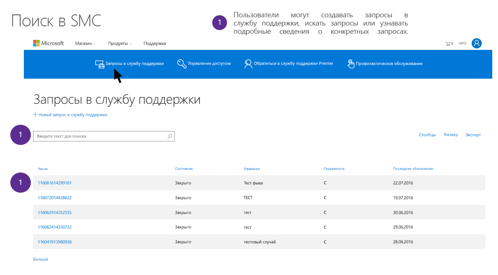

# Запросы субъектов данных о предоставлении поддержки и профессиональных услуг Майкрософт, определенные в GDPRMicrosoft Support and Professional Services Data Subject Requests for the GDPR

## Общие сведения о профессиональных услугах МайкрософтIntroduction to Microsoft Professional Services

Служба профессионального обслуживания Майкрософт включает группу различных технических архитекторов, инженеров, консультантов и специалистов по поддержке, призванных помогать клиентам Майкрософт достигать большего. Наша рабочая группа по предоставлению профессиональных услуг насчитывает более 21 000 консультантов, советников по цифровым технологиям, сотрудников службы поддержки Premier, инженеров и специалистов по продажам, которые работают в 191 стране, на 46 языках, обрабатывают несколько миллионов заявок в месяц и взаимодействуют с клиентами и партнерами через локальные службы, по телефону, через Интернет, сообщество и с помощью автоматизированных средств. Наша организация обладает обширным опытом во всех сферах, представленных в портфолио Майкрософт, и использует обширную сеть партнеров, технических сообществ, инструментов, средств диагностики и каналов, соединяющих нас с корпоративными клиентами.Microsoft Professional Services includes a diverse group of technical architects, engineers, consultants, and support professionals dedicated to delivering on the Microsoft mission of empowering customers to do more and achieve more. Our Professional Services team includes more than 21,000+ total consultants, Digital Advisors, Premier Support, engineers, and sales professionals working across 191 countries, supporting 46 different languages, managing several million engagements per month, and engaging in customer and partner interactions through on-premise, phone, web, community and automated tools. The organization brings broad expertise across the Microsoft portfolio, leveraging an extensive network of partners, technical communities, tools, diagnostics and channels that connect us with our enterprise customers.

Узнайте больше о профессиональных службах Майкрософт, перейдя в одноименный раздел центра управления безопасностью Майкрософт (<https://www.microsoft.com/trustcenter/professional-services>).Find out more about Microsoft Professional Services and by going to the Microsoft Professional Services section on the Microsoft Trust Center (<https://www.microsoft.com/trustcenter/professional-services>). В профессиональных службах Майкрософт со всей серьезностью относятся к своим обязательствам, налагаемым Общим регламентом по защите данных (GDPR).Microsoft Support and Professional Services takes its obligations under the General Data Protection Regulation (GDPR) seriously. Приведенная в этом документе информация содержит ответы на вопросы пользователей о том, как реагируют специалисты службы поддержки и консультанты Майкрософт, помогая клиентам выполнять обязательства по выполнению запросов субъектов данных согласно GDPR.Find out more about Microsoft Professional Services here () and by going to the Microsoft Professional Services section on the Microsoft Trust Center ().Microsoft Professional Services takes its obligations under the General Data Protection Regulation (GDPR) seriously. The information in this document is designed to answer customer questions about how Microsoft’s support and consulting offerings will respond to and assist customers in responding to Data Subject Request (DSR) obligations under GDPR.

### Общие сведения о запросах субъектов данныхIntroduction to DSRs 

GDPR предоставляет лицам, упомянутым в регламенте как *субъекты данных*, право управлять персональными данными, собранными работодателем или организацией другого типа (так называемые *управляющие данными* или просто *управляющие*). Определение персональных данных в GDPR довольно широкое: они представляют собой любые данные, имеющие отношение к идентифицированному или идентифицируемому физическому лицу. GDPR предоставляет субъектам данных особые права в отношении их персональных данных. Они включают права на получение копий, запрос изменений, ограничение обработки и удаление этих данных. Официальный запрос, отправляемый субъектом данных управляющему для выполнения действия с персональными данными, называется *запросом субъекта данных* (DSR). Кроме того, регламент обязывает компании, работающие от имени управляющего (так называемых *обработчиков данных* или просто *обработчиков*), оказывать управляющему целесообразную поддержку по выполнению DSR.The GDPR gives rights to people (known in the regulation as *data subjects*) to manage the personal data that has been collected by an employer or other type of agency or organization (known as the *data controller* or just *controller*). Personal data is defined very broadly under the GDPR as any data that relates to an identified or identifiable natural person. The GDPR gives data subjects specific rights to their personal data; these rights include obtaining copies of it, requesting changes to it, restricting the processing of it, and deleting it. A formal request by a data subject to a controller to take an action on their personal data is called a *Data Subject Request* or DSR. Additionally, it obligates companies working on behalf of a controller (known as the *data processor* or just *processor*) to reasonably assist the controller in fulfilling DSRs.

В этом руководстве рассказывается, как находить хранящиеся в ИТ-системах Майкрософт персональные данные, которые были собраны для оказания поддержки и других профессиональных услуг, получать доступ к ним и выполнять действия над ними.This guide discusses how to find, access, and act on personal data that reside in Microsoft IT systems that may have been collected to provide Support and other Professional Services offerings.

Составляя ответ на DSR, клиентам Майкрософт важно понимать, что данные служб поддержки и консультационных служб хранятся отдельно от данных клиентов в веб-службах и других данных, которые они или их субъекты данных могли предоставить корпорации Майкрософт. Средства и процессы, предоставляемые для веб-служб, Панель мониторинга конфиденциальности (Майкрософт) и другие системы для реагирования на DSR не подходят для ответов на запросы персональных данных, хранящихся в службе поддержки Майкрософт или других службах, оказывающих профессиональные услуги.In developing a response for DSRs, it is important for Microsoft’s customers to understand that Support and Consulting Data is separate from Customer Data in the Online Services or other data that they or their data subjects may have provided to Microsoft. Tools and processes provided for Online Services, the Microsoft Privacy Dashboard, or other Microsoft systems for responding to DSRs cannot be used to respond to DSRs for personal data held by Microsoft Support or other Professional Services.

Все запросы следует совершать через представителя службы поддержки, как описывается ниже. В настоящее время не существует средства самообслуживания, с помощью которого клиенты могли бы получать доступ к персональным данным в организациях, оказывающих профессиональные услуги.All requests must be made through a support representative, as described below. Currently there is no self-serve tool for customers gain access to personal data within the Professional Services organizations.

#### Обзор процессов, описываемых в этом руководствеOverview of the processes outlined in this guide

  ***Обнаружение.*** Поиск персональных данных, которые могут являться предметом DSR. После сбора потенциально конфиденциальных материалов вы можете выполнить с ними одно или несколько действий, описанных на последующих шагах, в ответ на запрос DSR. Кроме того, вы можете установить, что запрос не соответствует рекомендациям по реагированию на DSR, принятым в вашей организации.***Discover.*** Find personal data that may be the subject of a DSR. Once potentially responsive material is collected, perform one or more of the DSR actions described in the following steps to respond to the DSR request. Alternatively, determine that the request doesn't meet organizational guidelines for responding to DSRs.

  ***Доступ.*** Получение персональных данных, размещенных в облаке Майкрософт, и предоставление копии этих данных субъекту данных.***Access.*** Retrieve personal data that resides in the Microsoft cloud and, if requested, make a copy of it available to the data subject.

  ***Исправление.*** Внесение изменений или выполнение других действий с персональными данными.***Rectify.*** Make changes or implement other requested actions on the personal data.

  ***Ограничение.*** Ограничение обработки персональных данных путем прекращения действий над ними.***Restrict.*** Restrict the processing of personal data by halting activity on an engagement.

  ***Удаление.*** Безвозвратное удаление персональных данных, хранящихся в ИТ-системах Майкрософт.***Delete.*** Permanently remove personal data that reside in Microsoft IT Systems.

  ***Экспорт.*** Предоставление копии персональных данных клиенту или субъектам данных.***Export.*** Provide a copy of personal data to the customer or data subjects.
 

### ТерминологияTerminology

Ниже приведены определения терминов из GDPR, которые относятся к данному руководству.Below are the relevant definitions of terms from the GDPR for this guide:

-   **Управляющий** — физическое или юридическое лицо, орган государственной власти, агентство или другое лицо, которое отдельно от других или вместе с ними определяет цели и средства обработки персональных данных; там, где цели и средства такой обработки данных определены законом Союза или государства-участника, в этом законе может быть указан управляющий или определенные критерии для его назначения.**Controller.** The natural or legal person, public authority, agency or other body which, alone or jointly with others, determines the purposes and means of the processing of personal data; where the purposes and means of such processing are determined by Union or Member State law, the controller or the specific criteria for its nomination may be provided for by Union or Member State law.

-   **Персональные данные и субъект данных** — любая информация, связанная с идентифицированным или идентифицируемым физическим лицом ("субъектом данных"). Идентифицируемым физическим лицом считается лицо, которого можно прямо или косвенно определить, в частности с помощью идентификатора, такого как имя, идентификационный номер, данные о местоположении, идентификатор в сети, либо с использованием одного или нескольких факторов, связанных с физическими, физиологическими, генетическими, умственными, экономическими, культурными или социальными характеристиками этого физического лица.**Personal data and data subject.** Any information relating to an identified or identifiable natural person (‘data subject’); an identifiable natural person is one who can be identified, directly or indirectly, in particular by reference to an identifier such as a name, an identification number, location data, an online identifier or to one or more factors specific to the physical, physiological, genetic, mental, economic, cultural or social identity of that natural person.

-   **Обработчик** — физическое или юридическое лицо, орган государственной власти, агентство или другое лицо, которое обрабатывает персональные данные от лица управляющего.**Processor.** A natural or legal person, public authority, agency or other body which processes personal data on behalf of the controller.

#### Дополнительные термины и определения, которые могут быть полезны для понимания этого руководстваAdditional terms and definitions that may helpful in understanding this guide

-   **Данные для поддержки и консультирования** — это все данные (в том числе текст, звук, видео, изображения и программное обеспечение), предоставленные корпорации Майкрософт Клиентом или от его имени (либо данные, которые Клиент разрешил корпорации Майкрософт получить из веб-службы) по соглашению с корпорацией Майкрософт на получение поддержки или профессиональных услуг. Уточнение: к ним не относятся собранные данные, которыми управляет корпорация Майкрософт, в том числе контактные данные клиентов.**Support and Consulting Data** is all data, including all text, sound, video, image files, or software, that are provided to Microsoft by, or on behalf of, Customer (or that Customer authorizes Microsoft to obtain from an Online Service) through an engagement with Microsoft to obtain Support or Professional Services. To clarify, this does not include data collected where Microsoft is the data controller including Customer Contact Data.

-   **Контакты клиента** — это персональные данные, которые могут быть частью ваших деловых отношений с корпорацией Майкрософт, например персональные данные, содержащиеся в контактной информации клиента. Это может быть ваше имя, электронный адрес или номер телефона менеджера по контрактному обслуживанию (CSM) для поддержки Premier, глобального или ИТ-администратора либо других ролей.**Customer Contact** is personal data that may be part of your business relationship with Microsoft, such as personal data contained within your customer contact information. This may include your name, e-mail, or phone number of the Premier Contract Service Manager (CSM), the Global or IT Administrator for an Online Service, or similar roles.

-   **Псевдонимизированные данные.** Когда вы обращаетесь в службу поддержки Майкрософт по корпоративному продукту или службе, Майкрософт создает некоторые сведения, связанные с числовым идентификатором Майкрософт. Их часто называют "псевдонимизированными данными". Такие данные невозможно связать с конкретным субъектом без использования дополнительных сведений, некоторые из которых могут попадать под широкое определение персональных данных в GDPR. Когда вы пользуетесь профессиональными услугами, в запросы на выполнение и помощь в выполнении DSR всегда автоматически включаются адресные псевдонимизированные данные.**Pseudonymized Data** When you use Microsoft support for Microsoft’s enterprise products and services, Microsoft generates some information linked to a Microsoft numeric identifier to provide the support. This is often referred to as “Pseudonymized Data”, Although this data cannot be attributed to a specific data subject without the use of additional information, some of it may be deemed personal under GDPR's broad definition for personal data. Within Professional Services, requests to fulfill or assist in fulfilling DSRs will always automatically include addressing pseudonymized data.

### Как пользоваться руководствомHow to use this guide

В этом руководстве рассматриваются четыре сценария, с которыми может столкнуться клиент, если он пользовался профессиональными услугами Майкрософт.This guide covers four scenarios a customer may encounter if they have utilized Microsoft Professional Services.

- **Запрос субъекта данных для контактного лица клиента с участием Майкрософт****DSR for a Customer Contact Engaging Microsoft**

Описание того, как корпорация Майкрософт отвечает на запросы от контактного лица или ИТ-администратора клиента для осуществления его прав как субъекта данных.Explanation for how Microsoft will respond to requests from a customer contact or IT administrator to exercise their data subject rights.

- **Запрос субъекта данных для конечного пользователя с участием Майкрософт****DSR for an End User Engaging Microsoft**

Описание того, как корпорация Майкрософт отвечает на запросы от сотрудников клиента или других субъектов данных для осуществления их прав.Explanation for how Microsoft will respond to requests from a customer’s employees or other data subjects to exercise their rights.

- **Запрос субъекта данных, предоставленных клиентом: коммерческая поддержка****DSR for Customer Provided Data: Commercial Support**

Описание того, как получить поддержку от корпорации Майкрософт после получения запроса от сотрудника или других субъектов данных для осуществления их прав, если персональные данные этого субъекта были собраны службой поддержки Майкрософт во время оказания услуг.Explanation for how to receive assistance from Microsoft when a customer has received a request from their employee or other data subjects to exercise their rights, and that data subject’s personal data was collected by Microsoft Support during a support engagement.

- **Запрос субъекта данных, предоставленных клиентом: консультационные услуги, включая службы миграции FastTrack****DSR for Customer Provided Data: Consulting Services including FastTrack Migration Services** 

Описание того, как получить поддержку от корпорации Майкрософт после получения запроса от своего сотрудника или других субъектов данных для осуществления их прав, если персональные данные этого субъекта были собраны корпорацией Майкрософт в ходе консультирования.Explanation for how to receive assistance from Microsoft when a customer has received a request from their employee or other data subjects to exercise their rights, and that data subject’s personal data was collected by Microsoft during a consulting engagement.

## DSR для контактного лица клиента, связывающегося с корпорацией МайкрософтDSR for a Customer Contact Engaging Microsoft

*Как корпорация Майкрософт отвечает на запросы от контактного лица или ИТ-администратора клиента для осуществления его прав как субъекта данных.**How Microsoft responds to requests by a customer contact or IT admin to exercise their data subject rights.*

Когда клиент обращается в корпорацию Майкрософт за поддержкой или консультацией, служба поддержки Майкрософт автоматически собирает или получает из записей партнера персональные данные контактного лица клиента (например, CSM по поддержке Premier, глобального администратора или ИТ-администратора). Скорее всего, они включают имя, электронный адрес, телефон и другие персональные данные лица, которому нужна поддержка или консультация.When a customer engages with Microsoft to receive support or consulting services, Microsoft Support automatically collects or retrieves from account records the personal data of the Customer Contact (e.g. Premier CSM, Global Admin, IT Admin). This likely includes the name, email, phone and other personal data of the individual seeking support or consulting services.

Персональные данные контактного лица клиента являются частью деловых отношений корпорации Майкрософт с клиентом, а корпорация Майкрософт выступает в качестве управляющего данными. Корпорация Майкрософт ответит на запрос DSR от контактного лица клиента в отношении его персональных данных независимо от того, состоит ли он еще в организации.The Customer Contact’s personal data is part of Microsoft’s business relationship with the customer, and Microsoft is the data controller. Microsoft will respond to DSRs from the Customer Contact around their personal data, regardless of whether they are still with the organization.

Клиенты должны понимать, что DSR распространяется только на персональные данные контактного лица клиента, а данные клиента, отправленные в ходе оказания услуг (например, записи разговоров, описания обращений, файлы, продукты работы) не будут меняться и удаляться, так как корпорация Майкрософт является обработчиком данных. Кроме того, в целях хранения архивных сведений об оказании услуг в закрытые обращения (в том числе записи о том, кто открыл их) не будет вноситься никаких изменений.Customers should understand that the DSR only covers the personal data of the Customer Contact, and no changes or deletions will be made to any of the customer’s data submitted as part of engagements (e.g. transcripts, case descriptions, files, work product), since Microsoft is the data processor. Additionally, to maintain the engagement’s historical record no changes at all will be made to closed engagements, including the record of who opened an engagement.

Получив от контактного лица клиента запрос в отношении DSR, персонал корпорации Майкрософт направит его в [службу поддержки Майкрософт по вопросам конфиденциальности](http://go.microsoft.com/fwlink/?LinkId=321116). Это основной механизм обращения в корпорацию Майкрософт с запросами и жалобами в отношении конфиденциальности. Получив запрос, команда по работе с конфиденциальными данными Майкрософт установит, что эти данные входят в состав коммерческой или организационной учетной записи, и отреагирует соответствующим образом.Upon receiving an inquiry from a Customer Contact regarding a DSR, Microsoft personnel will refer a customer contact to [Microsoft Privacy Support](http://go.microsoft.com/fwlink/?LinkId=321116). This is Microsoft’s primary input mechanism for privacy inquiries and complaints. Upon receiving an inquiry, the Microsoft Privacy Team will identify that this is part of a commercial or organizational account and respond accordingly.

Чтобы обеспечить непрерывность деятельности клиента, корпорация Майкрософт также не будет обрабатывать DSR, связанные с обращением, пока не будет подтверждено альтернативное контактное лицо. После подтверждения нового контактного лица корпорация Майкрософт заменит старые контактные данные на новые в открытых обращениях.To maintain customer’s business continuity, Microsoft will also not process a DSR associated with an engagement until a replacement contact is confirmed. Upon confirmation of a new contact, Microsoft will swap out the old contact with the new one in open engagements.

Клиенты могут вносить изменения в свои данные, собранные в ходе предоставления профессиональных услуг через обычные каналы поддержки или консультирования, отдельно от этого DSR. Например, по запросу корпорация Майкрософт может помочь вам стереть обращения в службу поддержки (см. раздел *Руководство по обработке DSR для данных, предоставленных клиентами* ниже).Customers may choose to make changes to their data collected during Professional Services engagements through normal support or consulting channels, separate from this DSR. For instance, Microsoft can assist in expunging support engagements, on request (see below in *DSR Guide for Customer Provided Data* section).

***Пример (исключительно в демонстрационных целях)******Example for Illustration Purposes Only***

Иван — ИТ-администратор корпоративного клиента Office 365, где есть одно открытое обращение в службу поддержки и два закрытых. Теперь Иван покидает компанию и хочет удалить свои данные. Иван обращается в центр PRC, который идентифицирует его как ИТ-администратора. Ивану сообщают, что его имя невозможно удалить из предыдущих (закрытых) обращений и данных в открытых обращениях. Однако центр PRC заменит Ивана как контактное лицо для текущего открытого запроса, если он укажет другое контактное лицо. Иван сообщает корпорации Майкрософт, что Татьяна будет новым контактным лицом, и корпорация Майкрософт вносит изменение во все системы поддержки.John is an IT Admin for an O365 enterprise customer, with one open support engagement and two closed engagements. Now John is leaving his company and wants his data deleted. John contacts the PRC, who identifies him as the IT Admin. John is informed his name cannot be deleted from the prior (closed) engagements or from any data within the open engagements. However, the PRC will replace John as the contact on the current open ticket if he will identify a replacement contact. John lets Microsoft know that Jane will be his replacement contact, and Microsoft makes the change across all support systems.

## DSR для пользователя, связывающегося с корпорацией МайкрософтDSR for an End User Engaging Microsoft

*Как корпорация Майкрософт отвечает на запросы от сотрудников клиента или других субъектов данных для осуществления их прав.**How Microsoft responds to requests from a customer’s employees or other data subjects to exercise their rights.*

Если сотрудник клиента или другой субъект данных обратится в корпорацию Майкрософт для осуществления своих прав на данные, которые корпорация Майкрософт собрала как обработчик данных, то субъекту данных сообщат, что он должен обратиться к клиенту Майкрософт (управляющему данными) для осуществления этих прав. Корпорация Майкрософт не будет предпринимать дальнейших действий.If a customer’s employee or other data subject contacts Microsoft to exercise their rights over data that Microsoft has collected as the data processor, then that data subject will be informed that they need to contact Microsoft’s customer, as the data controller, to exercise those rights. Microsoft will take no further action.

Если субъект данных также обратился в корпорацию Майкрософт для осуществления своих прав на данные, собранные корпорацией Майкрософт в тех случаях, когда она выступает в качестве управляющего данными (например, в случае службы поддержки клиентов или контактного лица коммерческого клиента), то корпорация Майкрософт отдельно ответит на запрос субъекта данных в отношении его прав на эти персональные данные.If the data subject has also contacted Microsoft about exercising their rights for data Microsoft has collected in situations where Microsoft is the data controller (e.g. consumer support, commercial customer contact) then Microsoft will separately respond to the individual’s data subject right request for that personal data.

***Пример (исключительно в демонстрационных целях)******Example for Illustration Purposes Only***

Ольга — сотрудница корпоративного клиента Contoso, который предоставил ей учетную запись Dynamics 365. Она обращается в корпорацию Майкрософт, чтобы удалить все ее данные, и ее направляют в центр поддержки по вопросам конфиденциальности. Ольга заполняет форму запроса. Центр поддержки идентифицирует ее как корпоративного пользователя и сообщает ей, что она должна обратиться в компанию Contoso для удаления ее корпоративных данных. Кроме того, сотрудники центра поддержки могут установить, что она является пользователем Microsoft X-Box и удалить данные из ее потребительской учетной записи Майкрософт.Jane is an employee of an Enterprise customer, Contoso, that has given her a Dynamics 365 account. She contacts Microsoft to have all her data deleted and is referred to the Privacy Response Center. Jane fills out the request form. The Privacy Response Center identifies her as an enterprise end-user and lets her know she needs to work through Contoso for the deletion of her enterprise data. They also identify her as a Microsoft X-Box user and delete her data out of her consumer Microsoft account.

## DSR для предоставленных пользователем данных: коммерческая поддержкаDSR for Customer Provided Data: Commercial Support

*Как получить поддержку от корпорации Майкрософт после получения запроса от своего сотрудника или других субъектов данных для осуществления их прав, когда персональные данные этого субъекта были собраны службой поддержки Майкрософт во время оказания услуг.**How to receive assistance from Microsoft when a customer has received a request from their employee or other data subjects to exercise their rights, and that data subject’s personal data was collected by Microsoft Support during a support engagement.*

Когда клиент обращается в службу поддержки Майкрософт, она собирает у него данные поддержки, чтобы устранить проблемы, с которыми он обратился. Эти данные поддержки включают сведения о взаимодействии корпорации Майкрософт с клиентом (например, через чат или веб-форму, по телефону или электронной почте), а также файлы контента, которые клиент отправляет в корпорацию Майкрософт, или файлы, которые корпорация Майкрософт, с разрешения клиента, извлекла из его ИТ-среды или веб-служб для устранения проблемы. В случае поддержки Premier эти сведения также будут включать данные, которые мы собираем для профилактики проблем в будущем. Однако они не включают контактные данные клиента и другие сведения о деловых отношениях корпорации Майкрософт с клиентом (например, записи о выставлении счетов).When a customer engages with Microsoft Support, Microsoft collects Support Data from the customer to resolve any issues that required a support engagement. This Support Data includes Microsoft’s interaction with the customer (e.g. chat, phone, email, web submission) plus any content files the customer sends to Microsoft or Microsoft has, with customer’s permission, extracted from the customer’s IT environment or Online Services tenancy to resolve the support issue. In the case of Premier support, this would also include any data we collect from you to proactively prevent future issues. However, this excludes Customer Contact information or other information from Microsoft’s business relationship with the customer (e.g. billing records).

Обработчиком всех данных о поддержке является корпорация Майкрософт. Таким образом, она не будет отвечать на прямые запросы от субъектов данных в отношении данных о поддержке, предоставленных, когда они были связаны с ее коммерческим клиентом. Корпорация Майкрософт будет связываться с клиентом по своим обычным каналам поддержки, чтобы помочь ему отвечать на DSR.For all Support Data, Microsoft is the data processor. As such, Microsoft’s will not respond to direct requests from data subjects regarding Support Data provided when they were associated with a Microsoft commercial customer. Microsoft will work with the customer through their normal support channels to assist them in responding to DSRs.

## Шаг 1. ОбнаружениеStep 1: Discover

Чтобы получить от корпорации Майкрософт помощь по реагированию на DSR, для начала необходимо найти персональные данные, являющиеся субъектом DSR. Этот первый шаг — обнаружение и просмотр нужных персональных данных — поможет клиенту определить, соответствует ли DSR политикам организации, относящимся к выполнению запросов субъектов данных.The first step in obtaining Microsoft’s assistance in responding to a DSR is to find the personal data that is the subject of the DSR. This first step - finding and reviewing the personal data at issue - will help a customer determine whether a DSR meets the organization's policies for honoring a data subject request.

Когда клиент найдет данные, он может выполнить определенное действие, чтобы выполнить запрос субъекта данных. Необходимый уровень обнаружения зависит от того, что пытается сделать клиент.After the customer finds the data, the customer can then perform the specific action to satisfy the request by the data subject. Depending on what the customer is trying to do will determine what level of discovery the customer needs to engage in.

Если корпорация Майкрософт помогает клиенту разрешить DSR, это считается коммерческой деятельностью, и запрос отправляется через обычный канал поддержки, а не через запрос в службу поддержки Майкрософт по вопросам конфиденциальности.Where Microsoft assists a customer with the resolution of a DSR then this is a business function, and the request is made through your regular support channel and not through a request to the Microsoft Privacy Team.

Обнаруживая соответствующие данные и получая поддержку от корпорации Майкрософт, клиент может выбрать один из нескольких подходов к выполнению DSR.In discovering relevant data and obtaining Microsoft’s assistance, a customer has several options for how to approach the DSR:

*Вариант А — DSR клиента службы поддержки Майкрософт*. DSR применяется ко всем данным клиента в среде поддержки Майкрософт. Для этого клиент может просто попросить корпорацию Майкрософт применить DSR ко всем собранным данным о поддержке.*Option A – Cross-Microsoft Support Customer DSR*. Apply the DSR to all the customer’s support data across Microsoft’s support environment. To do this, a customer can just ask Microsoft to apply the DSR to all Support Data collected.

*Вариант Б — определенные обращения клиента.* Просмотрите запросы с помощью веб-систем, а затем определите, какие обращения содержат нужные персональные данные и сообщите о них корпорации Майкрософт. Она попробует оказать поддержку при поиске, если клиент не может выполнять поиск по всем обращениям.*Option B – Specific Customer Engagements.* Use online systems to review tickets, then identify specific engagements containing the relevant personal data and report them Microsoft. Microsoft will attempt to provide assistance to to perform a search if the customer does not have the ability to search across engagements (tickets).

\*\*Определив обращения, запросите применение DSR либо к определенной части записи, либо ко всем данным, связанным с этим обращением, из всех систем Майкрософт.\*\*Once engagements are identified, request to apply the DSR to either a specific part of the record or everything related to that engagement across Microsoft. **

Чтобы определить конкретные обращения, клиентам необходимо выполнить поиск по всем своим обращениям. В случае клиентов поддержки Premier соответствующему менеджеру по контрактному обслуживанию ("CSM") видны все запросы на обслуживание (SR), созданные в оговоренные в контракте сроки. Остальным клиентам доступны эквивалентные порталы для управления обращениями в службу поддержки, например через области поддержки веб-служб.To identify specific engagements, customers need to search across their engagements. For Premier customers, the Contract Service Manager (“CSM”) for a customer has visibility across all Support Requests (SRs) that are created under that Contract Schedule. For Non-Premier, equivalent support engagement portals are available, such as through Online Services support areas.

CSM может перейти на портал Support.Microsoft.Com ([https://support.microsoft.com/\<local код языка\>/premier](https://support.microsoft.com/%3clocal%20language%20code%3e/premier)) ("SMC"), а затем выбрать и просмотреть запросы на обслуживание (примечание: укажите в URL-адресе местный код языка).The CSM can go to the portal at Support.Microsoft.Com ([https://support.microsoft.com/\<local language code\>/premier](https://support.microsoft.com/%3clocal%20language%20code%3e/premier)) (“SMC”) and select and review Support Requests. (Note: In the URL, please substitute for your local language code).

>[**Важное примечание касательно DTM**] Помимо журнала обращений в SMC, клиенты также могут хранить персональные данные пользователя в файлах, собранных корпорацией Майкрософт (или, с разрешения клиента, удаленных из веб-службы) в ходе оказания поддержки. К примерам таких данных относятся копии почтовых ящиков Exchange, виртуальных машин Azure и баз данных. Эти персональные данные могут быть не упомянуты в соответствующей записи журнала обращений (например, в запросе). Чтобы просмотреть эти данные, необходимо пройти проверку подлинности (через AAD или MSA) как контактное лицо по запросам в службу поддержки и получить URL-адрес рабочей области в средстве передачи данных службы поддержки Майкрософт и управления ими (DTM). Контактному лицу клиента будут доступны файлы, но глобальное представление не будет доступно, а в SMC не будет указано, существуют ли файлы.[**Important Note Regarding DTM**] In addition to the case history in SMC, customers may also have personal data of an end user in files that was collected by Microsoft (or, with customer’s permission, removed from the Online Service) during a support engagement. Examples may include copies of customer’s exchange mailboxes, Azure VMs, or databases. This personal data may or may not be mentioned in the case history (i.e. ticket) for a particular engagement. To review that data, the Customer Contact must be a specific authenticated (via AAD or MSA) Support Request contact that has received a URL for a workspace in Microsoft Support Data Transfer and Management tool (DTM). A Customer Contact will have access to the files, but no global view is available, and SMC will not indicate if files exist.

Определив все нужные данные в выбранных запросах в службу поддержки, клиент может решить, следует ли запросить удаление всех данных, связанных с запросом, или выборочно применить DSR к отдельным экземплярам персональных данных.Once customers have identified all the relevant data in the selected support tickets, customers can decide whether to request the deletion of everything related to a ticket or selectively apply the DSR to individual instances of personal data.

## Шаг 2. ДоступStep 2: Access

Обнаружив данные о поддержке, содержащие персональные данные, которые могут относиться к DSR, клиент должен решить, какие персональные данные включать в ответ. Например, клиент может удалить персональные данные о других субъектах и все конфиденциальные сведения.After a customer has found Support Data containing personal data that is potentially responsive to a DSR, it is up to the customer to decide which personal data to include in the response. For example, the customer may choose to remove personal data about other data subjects and any confidential information.

Ответ на DSR может включать копию фактического документа, надлежащим образом отредактированную версию или снимок экрана с теми фрагментами данных, которые клиент посчитал нужным предоставить. Для каждого из этих ответов на запрос доступа клиент должен будет получить копию документа или другого элемента, содержащего нужные данные.Response to the DSR may include a copy of the actual document, an appropriately redacted version, or a screenshot of the portions the customer has deemed appropriate to share. For each of these responses to an access request, the customer will have to retrieve a copy of the document or other item that contains the responsive data.

Доступ к персональным данным пользователя можно получить по упоминанию или нотации в различной документации по контенту. Клиент может просмотреть запрос в службу поддержку и контент, поэтому он может самостоятельно предоставить сводку по персональным данным без дополнительной поддержки со стороны корпорации Майкрософт.Access to the personal data of an end user may be from a mention or notation in the various types of content documentation. Since customers may access the engagement ticket and the content they can provide a summary of personal data themselves without further assistance from Microsoft.

В редких случаях клиенту может потребоваться получить копии данных о взаимодействии со службой поддержки (например, электронных писем, записей телефонных разговоров или журналов чата) между представителями корпорации Майкрософт и Клиента. Корпорация Майкрософт может предоставлять, в необходимом объеме, отредактированные копии этих записей с учетом необходимости, конфиденциальности и сложности.In rare cases, customer may have need to obtain copies of support interaction data (e.g. emails, transcribed copies of phone recordings; chat transcripts) between a Microsoft Representative and the Customer’s Representative. To the extent required, Microsoft may provide redacted copies of these transcripts based on need, sensitivity, and difficulty.

## Шаг 3. ИсправлениеStep 3: Rectify

Если субъект данных попросил клиента исправить персональные данные, хранящиеся в службе поддержки его организации, то клиенту необходимо определить, следует ли выполнять запрос. Если это так, то клиент может попросить корпорацию Майкрософт внести изменение. Она может исправить или удалить данные клиента из систем поддержки, попросив клиента заново отправить их в корпорацию Майкрософт в исправленном виде.If a data subject has asked the customer to rectify the personal data that resides in their organization’s Support Data, the customer will have to determine whether it’s appropriate to honor the request. If the customer chooses to honor the request, then the customer may request that Microsoft make the change. Microsoft may rectify data or may delete customer’s data from the support systems and request that the customer resubmit it to Microsoft in corrected format.

## Шаг 4. ОграничениеStep 4: Restrict

Клиент может в любой момент закрыть обращение или обратиться в корпорацию Майкрософт и запросить закрытие обращения. С закрытым обращением невозможно выполнять никаких действий.The customer may at any time close an engagement or contact Microsoft and request the engagement be closed. A closed engagement will prevent any work from being performed.

Для большей уверенности клиент может обратиться в корпорацию Майкрософт и попросить добавить в систему управления запросами примечание о том, что обращение не следует заново открывать по каким-либо причинам без разрешения клиента.For extra assurance, customer may contact Microsoft and request a note be placed in the engagement ticketing system instructing that the case should not be re-opened for any reason absent the customer’s permission.

Примечание. Обращения (запросы) также будут удаляться в соответствии с расписанием хранения и удаления с учетом конфиденциальности данных, службы и системы. Если клиенту необходима копия данных, он должен убедиться, что данные были извлечены до их удаления.Note: Engagements (tickets) will also be deleted according on a retention and deletion schedule, based on the sensitivity of data, service, and system. If customer requires a copy of data, they should ensure they have extracted data prior to deletion.

## Шаг 5. УдалениеStep 5: Delete

"Право на стирание" путем удаления персональных данных из службы поддержки организации — это ключевая мера защиты в GDPR. Удаление персональных данных подразумевает полное удаление обращений, документов или файлов либо удаление определенных данных из обращения, документа или файла.The “right to erasure” by the removal of personal data from an organization’s Support Data is a key protection in the GDPR. Removing personal data includes deleting entire engagements, documents or files or deleting specific data within an engagement, document or file.

Когда клиент изучает DSR или готовится удалить персональные данные в ответ на DSR, необходимо понять несколько важных моментов о том, как работают функции удаления в службе поддержки Майкрософт.As a customer investigates or prepares to delete personal data in response to a DSR, here are a few important things to understand about how deletion works for Microsoft Support.

Ко всем данным, хранящимся в корпорации Майкрософт, применяется политика хранения и удаления, которая может меняться в зависимости от риска и других факторов.All data at Microsoft has a retention and deletion policy applied to it, which will vary depending on risk and other factors.

Клиенты, запрашивающие удаление персональных данных субъекта из всех систем поддержки, могут сделать это через менеджера по технической поддержке или с помощью запроса на обслуживание (SR) в SMC или эквивалентной системе. Вам *необходимо* указать, что это запрос поддержки по DSR согласно GDPR.Customers requesting the deletion of a data subject’s personal data universally cross Support systems may do that through your TAM or by filing a Support Request (SR) in SMC or equivalent system. You *must* indicate that this is a request to assist with a DSR under GDPR.

*Вариант А — DSR клиента для службы поддержки Майкрософт*. В случае DSR для всех систем клиент должен предоставить персональные данные, необходимые корпорации Майкрософт для определения необходимых данных (например, электронный адрес или номер телефона). Корпорация Майкрософт обязуется не сопоставлять и не изучать записи, а выполнять поиск непосредственно по предоставленным клиентом идентификаторам. При обнаружении данных корпорация Майкрософт удалит все обращения и связанные с ними данные. **Важное примечание.** Это может привести к потере архивных данных, важных для организации клиента.*Option A - Cross-Microsoft Support Customer DSR*. For a cross system DSR, customer must provide the personal data that Microsoft needs to identify the required data (e.g. email address; phone number). Microsoft will not correlate or research records and will only search directly on identifiers provided by the customer. When data is found, Microsoft will delete all engagements and all associated data. **Important Note:** this may result in loss of historical records that are important to customer’s organization.

*Вариант Б — определенные обращения клиентов*. Запросы для определенных обращений, которые клиент определил и хочет удалить, не удаляются из SMC. В результате в журналах и нижестоящих системах останутся персональные данные, которые не могут быть удалены в установленные сроки. Вместо этого необходимо определить запрос или персональные данные из него, которые требуется удалить, и обратиться в службу поддержки Майкрософт за помощью в удалении данных.*Option B – Specific Customer Engagements*. For specific engagements that the customer has identified and wants deleted, do not delete tickets out of SMC. This will result in personal data remaining in logs and downstream systems that may not be deleted within the needed timeframe. Instead, identify the ticket or personal data within the ticket that must be deleted, and contact Microsoft Support to assist you in deleting that data.

### Инструкции для передачи данных службы поддержки Майкрософт и управления ими (DTM)Microsoft Support Data Transfer and Management tool (DTM) instructions

Во всех этих случаях корпорация Майкрософт не будет выполнять поиск по DTM, так как содержимое файлов может быть конфиденциальным. Однако по желанию клиента корпорация Майкрософт удалит из DTM все файлы, связанные с учетной записью клиента. В связи с возможностью серьезного воздействия на клиентов корпорация Майкрософт должна получить от клиента отдельный запрос на удаление файлов из DTM.For all these searches, Microsoft will not search across DTM due to the potential sensitivity of content in files. However, if the customer desires, Microsoft will delete all files contained in DTM associated with the customer’s account. Due to the potential for serious customer impact, Microsoft requires a separate request from customer specifying the deletion of DTM files.

-   В случае открытых обращений контактное лицо клиента может перейти в DTM и удалить файлы.For open cases, the Customer Contact can go into DTM and delete files.

-   В случае обращений, закрытых менее 90 дней назад, следует отправить запрос на удаление файлов менеджеру по технической поддержке или в службу поддержки.For cases closed less than 90 days, a request must be made to a TAM or in an SR to have the files removed.

-   Файлы для обращений, закрытых более 90 дней назад, уже были автоматически удалены.For cases closed after than 90 days, files have already been automatically deleted.

-   Даже если персональные данные находились только в удаленном файле, клиенту следует попросить корпорацию Майкрософт выполнить в своих системах проверку на наличие персональных данных, так как некоторые данные могли быть удалены из DTM в ходе оказания поддержки.Even if the personal data was only located within a file that has been deleted, customers must still have Microsoft run a check across systems for the personal data as some data may have been removed from DTM in the course of providing support.

## Шаг 6. ЭкспортStep 6: Export

"Право на переносимость данных" позволяет субъекту запрашивать копию своих персональных данных в электронном формате и требовать, чтобы ваша организация передала их другому управляющему. В случае данных поддержки все полезные сведения, находящиеся в распоряжении корпорации Майкрософт, будут представлены в виде данных об обращениях или файлов, которые могут быть возвращены вам для передачи или отправки другому управляющему.The “right of data portability” allows a data subject to request a copy of their personal data in an electronic format and request that your organization transmit it to another controller. In the case of Support Data, any usable information that Microsoft has would be in the form of engagement information or files that can be returned to you for re-communication or uploading to another controller.

Примечание. Экспортируемые данные не могут включать интеллектуальную собственность корпорации Майкрософт и какие-либо данные, утечка которых может нарушить безопасность или стабильность службы.Note: Exported data may not include Microsoft’s intellectual property or any data that may compromise the security or stability of the service.

***Пример (исключительно в демонстрационных целях)******Example for Illustration Purposes Only***

Иван — CSM по поддержке Premier для корпоративного клиента Contoso, использующего Office 365 для электронной почты сотрудников и Azure для размещения базы данных SQL Contoso. В компании Contoso есть несколько открытых и закрытых запросов в службу поддержки. Недавно служба поддержки Майкрософт с согласия компании Contoso переместила копию базы данных SQL в DTM в целях поддержки и устранения неполадок.John is a Premier CSM for an Enterprise customer, Contoso, that uses O365 for its employee e-mail and Azure to host a Contoso SQL database. Contoso has multiple open and closed tickets. Recently, Microsoft Support, with Contoso’s permission, moved a copy of the SQL database into DTM for support and troubleshooting.

Иван получает от Татьяны DSR с просьбой удалить все ее данные. Иван открывает SMC, выполняет поиск по обращениям и обнаруживает, что у Татьяны возникали проблемы с учетной записью электронной почты, поэтому в двух обращениях были указаны ее имя и электронный адрес. Он обращается к менеджеру по технической поддержке, сообщает имя и электронный адрес Татьяны в качестве идентификатора и запрашивает удаление этих двух обращений, а также всех данных из нижестоящих служб, которые могли быть созданы при обработке этих обращений.John receives a DSR from Jane asking that all her data be deleted. John goes into SMC and searches across engagements to identify that Jane had email account issues and so was referenced in two tickets by name and email address. He contacts his TAM, provides the TAM with Jane’s name and e-mail address as an identifier, and requests that those two tickets be deleted, along with all downstream data that may have been generated out of those tickets.

Он также подозревает, что при общении с персоналом службы поддержки в чате он упоминал Татьяну, поэтому запрашивает удаление журнала чата.He also suspects he was engaged in a chat conversation with support personnel where he mentions Jane, so he requests that chat log to be deleted.

Кроме того, он знает, что персональные данные Татьяны находятся в базе данных SQL. Так как виртуальная машина SQL была перемещена в DTM менее 90 дней назад, он отдельно просит менеджера по технической поддержке помочь ему незамедлительно удалить базу данных из DTM.He also knows that Jane’s personal data is in the SQL Database. Since the SQL VM was moved into DTM less than 90 days ago, he asks his TAM separately to assist in the immediate deletion of the database out of DTM.

Наконец, так как он знает, что данные могли быть удалены из файла DTM в ходе оказания поддержки, он просит корпорацию Майкрософт выполнить в ИТ-системах проверку на наличие персональных данных Татьяны из базы данных SQL.Lastly, since he knows that data may have been removed from the DTM file during providing support, he asks Microsoft to run a check across IT systems for Jane’s personal data from the SQL database.

Служба поддержки Майкрософт удаляет все эти данные, а менеджер по технической поддержке, по запросу клиента, предоставляет ему подтверждение того, что нужные данные были удалены.Microsoft Support performs all these deletions and, based on customer request, the TAM provides him with an attestation statement that the required data has been deleted.

## Руководство по обработке DSR для данных, предоставленных клиентами: консультационные услуги, включая услуги по миграцииDSR Guide for Customer Provided Data in Consulting Services including Migration Services

*Как получить поддержку от корпорации Майкрософт после получения запроса от своего сотрудника или других субъектов данных для осуществления их прав, если персональные данные этого субъекта были собраны корпорацией Майкрософт в ходе консультирования.**How to receive assistance from Microsoft when a customer has received a request from their employee or other data subjects to exercise their rights, and that data subject’s personal data was collected by Microsoft during a consulting engagement.*

## Консультационные службы МайкрософтMicrosoft Consulting Services

Для обращений в консультационные службы Майкрософт, к которым применяется приложение о защите данных о профессиональных услугах Майкрософт (<http://aka.ms/professionalservicesdpa>).For Microsoft Consulting Services engagements contracted where the Microsoft Professional Services Data Protection Addendum (<http://aka.ms/professionalservicesdpa>) applies.

Корпорация Майкрософт выступает в качестве управляющего данными для контактных лиц клиентов, сотрудничающих с персоналом по обработке обращений. Эти лица должны обращаться в [службу поддержки Майкрософт по вопросам конфиденциальности](http://go.microsoft.com/fwlink/?LinkId=321116) для реализации прав субъектов данных.Microsoft is the data controller for Customer Contacts working with the engagement team. Those individuals should contact [Microsoft Privacy Support](http://go.microsoft.com/fwlink/?LinkId=321116) to fulfill data subject rights.

Корпорация Майкрософт выступает в качестве обработчика данных для DSR, относящихся к данным, предоставленным в ходе консультирования. Клиент должен обратиться к менеджеру по обращениям, чтобы составить план поддержки по реагированию на DSR с учетом собранных данных и типа представляемых консультационных услуг. Если уровень сложности вашего запроса не является типичным для обращений в консультационные службы Майкрософт, может потребоваться дополнительный рабочий заказ. Кроме того, персональные данные будут удаляться после каждого обращения в консультационные службы в период времени, зависящий от типа оказываемых консультационных услуг. Клиент может запросить преждевременное удаление данных и подтверждение удаления.Microsoft is the data processor for a DSR located within data provided during a consulting engagement. The customer should contact the engagement manager to build in a plan to assist in responding to a DSR based on the data collected and then specific type of consulting services provided. To the extent your request constitutes a level of effort typically seen within a Microsoft Consulting Services engagement, there may be an additional work order required. Additionally, personal data will be deleted after each consulting engagement within a timeframe dependent on the type of consulting engagement. Customer can request data to be deleted sooner and request an attestation of deletion.

## Службы Microsoft FastTrackMicrosoft FastTrack Services

[Microsoft FastTrack](https://na01.safelinks.protection.outlook.com/?url=https%3A%2F%2Ffasttrack.microsoft.com%2Fabout&data=02%7C01%7C%7Cd0521d8739c841df674508d596834585%7C72f988bf86f141af91ab2d7cd011db47%7C1%7C0%7C636580412901207944&sdata=PO5eh56pm9IYk5Y%2Ff%2F31e%2BRVPmrC2Qi%2FCsw1NphR8gY%3D&reserved=0) оказывает организациям консультационные услуги в сфере ИТ, чтобы помочь им внедрять и использовать облачные службы (Майкрософт), такие как Microsoft 365, Azure и Dynamics 365.[Microsoft FastTrack](https://na01.safelinks.protection.outlook.com/?url=https%3A%2F%2Ffasttrack.microsoft.com%2Fabout&data=02%7C01%7C%7Cd0521d8739c841df674508d596834585%7C72f988bf86f141af91ab2d7cd011db47%7C1%7C0%7C636580412901207944&sdata=PO5eh56pm9IYk5Y%2Ff%2F31e%2BRVPmrC2Qi%2FCsw1NphR8gY%3D&reserved=0) provides IT consulting services to organizations to help them onboard and use Microsoft cloud services such as Microsoft 365, Azure and Dynamics 365.

Корпорация Майкрософт выступает в качестве обработчика данных для контактных лиц клиентов, сотрудничающих с командой FastTrack. Если контактному лицу клиента нужно просмотреть, изменить или удалить контактные данные из записей Microsoft FastTrack, то субъект данных может отправить запрос непосредственно в почтовый ящик для запросов по GDPR для Office 365 FastTrack: \<<o365ftgdpr@microsoft.com>\>.Microsoft is the data controller for Customer Contacts working with the FastTrack team. If Customer Contacts wish to access, revise or remove contact information from Microsoft’s FastTrack records, customers can have the data subject send the request directly to Office 365 FastTrack GDPR Request inbox \<<o365ftgdpr@microsoft.com>\>.

Для служб миграции FastTrack корпорация Майкрософт является обработчиком данных. Согласно дополнительному заявлению о раскрытии личных сведений Fast Track все переносимые данные считаются "данными миграции". Выполнение запросов DSR во время миграции организации через FastTrack требует повышенног внимания.For FastTrack migration services, Microsoft is the data processor. In accordance with our Fast Track additional privacy disclosure statement, all data in migration is considered “migration data.”  If you need to execute DSRs while your organization is engaged in a FastTrack migration project, special care is required.
  
Если вам поступили запросы DSR на доступ, исправление или экспорт во время обработки данных пользователей в системах миграции FastTrack, то за выполнение таких запросов субъектов данных отвечает клиент, и их можно выполнить в имеющихся у вас исходных системах, в которых хранятся данные пользователей. По завершении миграции пользователя и переноса данных в целевую облачную службу Майкрософт воспользуйтесь руководством корпорации Майкрософт, в котором рассказывается о том, как клиенты с помощью продуктов, служб и средств администрирования могут находить персональные данные и выполнять действия над ними для реагирования на запросы субъектов данных. См. это руководство в статье [Запросы субъектов данных, определенные в GDPR](https://docs.microsoft.com/microsoft-365/compliance/gdpr-data-subject-requests).If you need to process any access, rectify, or export DSR requests while a user’s data is being processed through FastTrack migration systems, it will be the customer’s responsibility to fulfill such DSRs through your existing source systems in which the user data is stored. Once the user’s migration is complete and the data has been migrated to the destination Microsoft cloud service, the guidance provided by Microsoft on how customers can use Microsoft products, services and administrative tools to find and act on personal data to respond to data subject request will then apply. To view this guidance see [Data Subject Requests for the GDPR](https://docs.microsoft.com/microsoft-365/compliance/gdpr-data-subject-requests). 

Если вы получили запрос DSR на удаление данных, и вам необходимо удалить учетную запись пользователя Office 365 во время миграции вашей организации через FastTrack, имейте в виду, что в системах миграции в течение определенного времени после завершения миграции пользователя могут храниться копии данных миграции пользователя, и удаление учетной записи пользователя в Office 365 не приведет к автоматическому удалению таких данных, хранящихся в системах миграции FastTrack. Если вы хотите, чтобы специалисты Microsoft FastTrack удалили данные миграции пользователя, [отправьте соответствующий запрос](https://go.microsoft.com/fwlink/?linkid=874544). В обычных обстоятельствах Microsoft FastTrack удаляет все копии данных по завершении миграции организации.If you need to delete an Office 365 user account in response to a DSR delete request while your organization is engaged in an ongoing FastTrack migration project, you should be aware that migration systems may retain a copy of user migration data for a period of time following completion of the user’s migration and deleting the Office 365 user account will not automatically delete such user migration data stored in FastTrack migration systems.  If you would like the Microsoft FastTrack team to delete user migration data, you can [submit a request](https://go.microsoft.com/fwlink/?linkid=874544). In the ordinary course of business, Microsoft FastTrack will delete all data copies once your organization’s migration is complete.

## Другие консультационные услугиOther Consulting Services

Клиент, получающий другие профессиональные услуги от корпорации Майкрософт, должен обращаться к команде по обработке обращений, чтобы обеспечивать соблюдение всех требований GDPR. Если команда по обработке обращений не сможет предоставить понятные инструкции по выполнению DSR согласно GDPR, клиент может обратиться за помощью в [службу поддержки Майкрософт по вопросам конфиденциальности](http://go.microsoft.com/fwlink/?LinkId=321116).Customer receiving other Professional Services through Microsoft should work through the engagement team for fulfillment of all GDPR requirements. If the engagement team is not able to provide clear instructions on GDPR DSR fulfillment, customers may contact [Microsoft Privacy Support](http://go.microsoft.com/fwlink/?LinkId=321116) for assistance.
