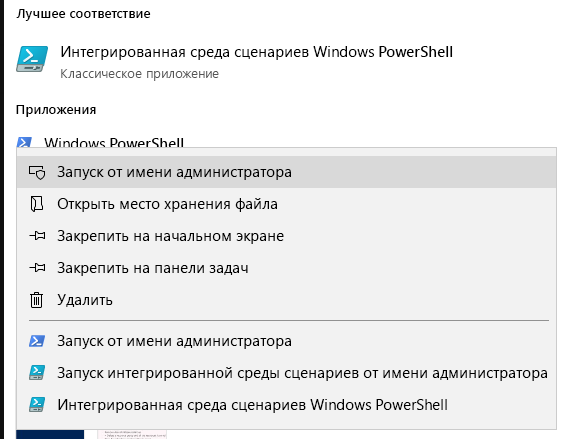
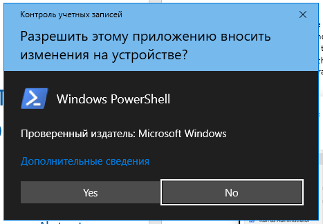
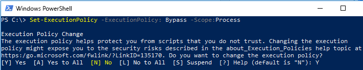

# Набор инструментов миграции с помощью FastTrack для отправки запросов на удаление

## Назначение набора инструментов

Если вы клиент, участвующий в миграции с помощью FastTrack, удаление учетной записи пользователя Office 365 не приведет к удалению копии данных, хранящихся в группе Microsoft FastTrack. Эти данные хранятся исключительно для целей завершения миграции. Если в процессе миграции вам потребуется, чтобы группа Microsoft FastTrack удалила имеющуюся у них копию данных, отправьте соответствующий запрос с помощью этого набора инструментов. В обычных обстоятельствах группа Microsoft FastTrack удаляет все имеющиеся у нее копии данных по завершении миграции. 

### Поддерживаемые платформы
Корпорация Майкрософт поддерживает первоначальный выпуск этого набора инструментов для платформы Windows и консоли PowerShell. Кроме того, этот набор инструментов поддерживает указанные ниже известные платформы.
 
***Таблица 1. Платформы, поддерживаемые набором инструментов***
 
<!--start table here HEADER -->
 
|||||||
|:-----|:-----|:-----|:-----|:-----|:-----|
| |**Windows 7**|**Windows 8**|**Windows 10**|**Windows Server 2012**|**Windows Server 2016**|
|PS 5.0|Не Поддерживается|Поддерживается|Поддерживается|Поддерживается|Поддерживается|
|PS 5.1|Не Поддерживается|Поддерживается|Поддерживается|Поддерживается|Поддерживается|
|||
 
<!-- end of table -->

### Получение набора инструментов

Этот набор инструментов доступен в коллекции PowerShell в консольном приложении PowerShell. Чтобы найти и загрузить этот модуль командлета, сначала откройте PowerShell в режиме администратора, чтобы получить соответствующие разрешения для установки модуля. Если ранее вы не использовали PowerShell, в поле поиска на панели задач Windows введите PowerShell. Чтобы запустить Windows PowerShell, щелкните консольное приложение правой кнопкой мыши, выберите **Запуск от имени администратора** и нажмите кнопку **Да**.

Теперь, когда вы открыли консоль, вам потребуется настроить разрешения для выполнения скрипта. Чтобы разрешить выполнение скрипта, введите следующую команду: Set-ExecutionPolicy – ExecutionPolicy: Bypass – Scope:Process

Вам будет предложено подтвердить это действие, так как администратор может изменять область по своему усмотрению.

***Настройка политики выполнения***

Теперь, когда для консоли настроено разрешение на выполнение скрипта, установите необходимый модуль, выполнив следующую команду:

>`Install-Module -Name Microsoft.FastTrack ` -Repository PSGallery
>        
>               -WarningAction: SilentlyContinue `
>               -Force’

### Компоненты, необходимые для работы модуля
Для успешной работы этого модуля вам может потребоваться установить зависимые модули (если они еще не установлены). Возможно, вам придется перезапустить PowerShell.  

Чтобы отправить запрос субъекта данных, вам сначала потребуется выполнить вход, используя свои учетные данные Office 365. Введя соответствующие учетные данные, вы подтвердите свой статус глобального администратора и сможете собирать информацию о клиенте. 

**Login-FastTrackAccount -ApiKey: \<ключ API, предоставленный FastTrack MVM\>**

После успешного входа в систему учетные данные и ключ будут сохранены для использования с модулями FastTrack до конца текущего сеанса PowerShell.

Если вам необходимо подключиться к облачной среде, отличной от коммерческой, то потребуется добавить к команде *Login* параметр *-Environment* с указанием одной из допустимых сред:
- AzureCloud
- AzureChinaCloud
- AzureGermanCloud
- AzureUSGovernmentCloud

**Login-FastTrackAcccount -ApiKey\ <API Key provided by FastTrack MVM> -Environment: <облачная среда\>**

Чтобы отправить запрос субъекта данных, выполните следующую команду: Submit-FastTrackGdprDsrRequest -DsrRequestUserEmail: ЭлектронныйАдресСубъектаДанных@МояКомпания.com

При успешном выполнении командлета он возвратит объект идентификатора транзакции. Сохраните этот идентификатор транзакции.

#### Проверка состояния транзакции запроса

Запустите следующую функцию, используя ранее полученный идентификатор транзакции: Get-FastTrackGdprDsrRequest -TransactionID: "ИдентификаторВашейТранзакции"

#### Коды состояния транзакции
<!--start table here no header -->

|||
|:-----|:-----|:-----|
|**Транзакция** |**Состояние**|
|**Создана** |Запрос создан|
|**Не удалось выполнить**|Не удалось создать запрос. Отправьте запрос еще раз или обратитесь в службу поддержки|
|**Выполнена**|Запрос был выполнен и очищен|
|||

<!-- end of table -->

<!-- original version: **Created**  Request has been created **Failed** Request failed to create, please resubmit, or contact support **Completed** Request has been completed and sanitized -->

## Дополнительные сведения
[Центр управления безопасностью (Майкрософт)](https://www.microsoft.com/TrustCenter/Privacy/gdpr/default.aspx)