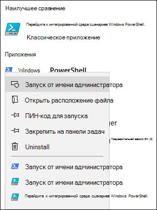
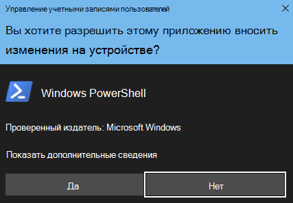

# Набор инструментов миграции с помощью FastTrack для отправки запросов на удалениеFastTrack Migration Toolset for Submitting Delete Request

## Назначение набора инструментовToolset purpose

Если вы клиент, участвующий в миграции с помощью FastTrack, удаление учетной записи пользователя не приведет к удалению копии данных, хранящейся у специалистов Microsoft FastTrack. Эти данные хранятся исключительно для целей завершения миграции. Если в процессе миграции вам потребуется, чтобы специалисты Microsoft FastTrack удалили имеющуюся у них копию данных, отправьте соответствующий запрос с помощью этого набора инструментов. В обычных обстоятельствах Microsoft FastTrack удаляет все копии данных по завершении миграции организации.In the event that you are a customer currently engaged in FastTrack migrations, deleting the user account will not delete the data copy held by the Microsoft FastTrack team, which is held for the sole purpose of completing the migration. If during the migration you would like the Microsoft FastTrack team to also delete the data copy, submit a request via this tool set. In the ordinary course of business, Microsoft FastTrack will delete all data copies once the migration is complete.

### Поддерживаемые платформыSupported platforms
Корпорация Майкрософт поддерживает первоначальный выпуск этого набора инструментов для платформы Windows и консоли PowerShell. Кроме того, этот набор инструментов поддерживает указанные ниже известные платформы.Microsoft supports the initial release of this  toolset in the Windows platform and PowerShell console. The following known platforms are supported by this toolset:
 
***Таблица 1. Платформы, поддерживаемые набором инструментов******Table 1 — Platforms supported by this toolset***
 
<!--start table here HEADER -->
 
|||||||
|:-----|:-----|:-----|:-----|:-----|:-----|
| |**Windows 7****Windows 7**|**Windows 8****Windows 8**|**Windows 10****Windows 10**|**Windows Server 2012****Windows Server 2012**|**Windows Server 2016****Windows Server 2016**|
|PS 5.0PS 5.0|НеNot ПоддерживаетсяSupported|ПоддерживаетсяSupported|ПоддерживаетсяSupported|ПоддерживаетсяSupported|ПоддерживаетсяSupported|
|PS 5.1PS 5.1|НеNot ПоддерживаетсяSupported|ПоддерживаетсяSupported|ПоддерживаетсяSupported|ПоддерживаетсяSupported|ПоддерживаетсяSupported|
|||
 
<!-- end of table -->

### Получение набора инструментовObtaining the toolset

Этот набор инструментов доступен в коллекции PowerShell в консольном приложении PowerShell. Чтобы найти и загрузить этот модуль командлета, сначала откройте PowerShell в режиме администратора, чтобы получить соответствующие разрешения для установки модуля. Если ранее вы не использовали PowerShell, в поле поиска на панели задач Windows введите PowerShell. Чтобы запустить Windows PowerShell, щелкните консольное приложение правой кнопкой мыши, выберите **Запуск от имени администратора** и нажмите кнопку **Да**.This toolset is available in the PowerShell Gallery on the PowerShell console application.  To locate and load this cmdlet module, first open PowerShell in administrator mode so it has the appropriate permissions to install the module. If you have not used PowerShell previously go to your Windows Task Bar and in the search box type “PowerShell”. Select the console app using right-click and choose **Run as administrator**, then click **Yes** to run Windows PowerShell.

Теперь, когда вы открыли консоль, вам потребуется настроить разрешения для выполнения скрипта. Чтобы разрешить выполнение скрипта, введите следующую команду: Set-ExecutionPolicy — ExecutionPolicy: Bypass — Scope: ProcessNow that the console is open, you need to set permissions for script execution. Type the following command to allow the scripts to run: ‘Set-ExecutionPolicy — ExecutionPolicy: Bypass — Scope: Process’

Вам будет предложено подтвердить это действие, так как администратор может изменять область по своему усмотрению.You will be prompted to confirm this action, as the administrator can change the scope at their discretion.

***Настройка политики выполнения******Set Execution Policy***

Теперь, когда для консоли настроено разрешение на выполнение скрипта, установите необходимый модуль, выполнив следующую команду:Now that the console is set to allow the script,  run this next command to install the module:

>`Install-Module -Name Microsoft.FastTrack ` -Repository PSGallery`Install-Module -Name Microsoft.FastTrack ` -Repository PSGallery \`
>        
>               -WarningAction: SilentlyContinue `
>               -Force’

### Компоненты, необходимые для работы модуляPrerequisites for module
Для успешной работы этого модуля вам может потребоваться установить зависимые модули (если они еще не установлены). Возможно, вам придется перезапустить PowerShell.To successfully execute this module, you may need to install dependent modules for use if they are not already installed. You may need to restart PowerShell.  

Чтобы отправить запрос субъекта данных, вам сначала потребуется выполнить вход, используя свои учетные данные Office 365. Введя соответствующие учетные данные, вы подтвердите свой статус глобального администратора и сможете собирать информацию о клиенте.In order to submit a DSR, you must first log in using your Office 365 credentials — entering the proper credentials will validate your global administrator status and collect tenant information. 

**Login-FastTrackAccount -ApiKey: \<API Key provided by FastTrack MVM\>****Login-FastTrackAccount -ApiKey: \<API Key provided by FastTrack MVM\>**

После успешного входа в систему учетные данные и ключ будут сохранены для использования с модулями FastTrack до конца текущего сеанса PowerShell.Once successfully logged in, the credentials and key will be stored for use with FastTrack modules for the remainder of the current PowerShell session.

Если вам необходимо подключиться к облачной среде, отличной от коммерческой, нужно добавить к команде *Log in* параметр *-Environment* с указанием одной из допустимых сред:If you need to connect to a cloud environment, other than commercial, *-Environment* will need to be added to *Log in* command with one of the following valid environments:
- AzureCloudAzureCloud
- AzureChinaCloudAzureChinaCloud
- AzureGermanCloudAzureGermanCloud
- AzureUSGovernmentCloudAzureUSGovernmentCloud

**Login-FastTrackAcccount -ApiKey\ <API Key provided by FastTrack MVM> -Environment: <облачная среда\>****Login-FastTrackAcccount -ApiKey\ <API Key provided by FastTrack MVM> -Environment: <cloud environment\>**

Чтобы отправить запрос субъекта данных, выполните следующую команду: Submit-FastTrackGdprDsrRequest -DsrRequestUserEmail: ЭлектронныйАдресСубъектаДанных@МояКомпания.comTo submit a DSR request, run the following command: Submit-FastTrackGdprDsrRequest -DsrRequestUserEmail: SubjectUserEmail@mycompany.com

При успешном выполнении командлета он возвратит объект идентификатора транзакции. Сохраните этот идентификатор транзакции.On success — the cmdlet will return a Transaction ID object. Please retain the Transaction ID.

#### Проверка состояния транзакции запросаChecking the status of a request transaction

Запустите следующую функцию, используя ранее полученный идентификатор транзакции: Get-FastTrackGdprDsrRequest -TransactionID: "ИдентификаторВашейТранзакции"Run the following function using the previously obtained Transaction ID: Get-FastTrackGdprDsrRequest -TransactionID: “YourTransactionID”

#### Коды состояния транзакцииTransaction Status Codes
<!--start table here no header -->

|||
|:-----|:-----|:-----|
|**Транзакция****Transaction** |**Состояние****Status**|
|**Создана****Created** |Запрос созданRequest has been created|
|**Не удалось выполнить****Failed**|Не удалось создать запрос. Отправьте запрос еще раз или обратитесь в службу поддержкиRequest failed to create, please resubmit, or contact support|
|**Выполнена****Completed**|Запрос был выполнен и очищенRequest has been completed and sanitized|
|||

<!-- end of table -->

<!-- original version: **Created**  Request has been created **Failed** Request failed to create, please resubmit, or contact support **Completed** Request has been completed and sanitized -->

## Дополнительные сведенияLearn more
[Центр управления безопасностью (Майкрософт)Microsoft Trust Center](https://www.microsoft.com/trust-center/privacy/gdpr-overview
)
