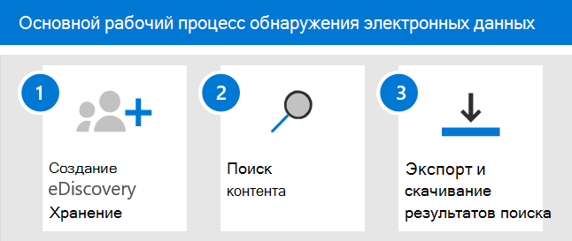

# Начало работы с Core eDiscovery

Основные средства обнаружения электронных данных в Microsoft 365 предоставляют основные средства обнаружения электронных данных, которые организации могут использовать для поиска и экспорта контента в Microsoft 365 и Office 365. Кроме того, вы можете использовать базовое обнаружение электронных данных для размещения хранения для обнаружения электронных данных, таких как почтовые ящики Exchange, сайты SharePoint, учетные записи OneDrive и Microsoft Teams. Нет необходимости в развертывании базового обнаружения электронных данных, но существуют некоторые обязательные задачи, которые ИТ-администратор и диспетчер eDiscovery должны выполнить, прежде чем ваша организация сможет начать использовать базовое обнаружение электронных данных для поиска, экспорта и сохранения контента.

В этой статье описываются действия, необходимые для настройки базовых данных обнаружения электронных данных. Это включает в себя обеспечение надлежащего лицензирования для доступа к базовым обнаружениям электронных данных и помещение удержания для обнаружения электронных данных на расположение содержимого, а также назначение разрешений для ИТ, юридических лиц и исследований, чтобы они могли получать доступ к обращениям и управлять ими. В этой статье также представлен общий обзор использования вариантов для поиска и экспорта контента.

## Шаг 1: Проверка и назначение соответствующих лицензий

Для лицензирования основного обнаружения электронных данных требуется соответствующая подписке Организации и лицензирование для отдельных пользователей.

- **Подписка на организацию:** Чтобы получить доступ к базовым обнаружениям электронных данных в центре соответствия требованиям Microsoft 365 или центре безопасности & безопасности Office 365 и использовать функции удержания и экспорта, ваша организация должна иметь подписку на Microsoft 365 E3 или Office 365 E3 или более поздней версии.

- **Лицензирование для каждого пользователя:** Чтобы поместить удержание обнаружения электронных данных на почтовые ящики и сайты, пользователю должна быть назначена одна из следующих лицензий в зависимости от вашей подписки Организации:

  - Лицензия на Microsoft 365 E3 или Office 365 E3 или более поздняя версия

   OR

  - Лицензия на Office 365 E1 с лицензией на Exchange Online (план 2) или Exchange Online "Архивация на базе Exchange Online"

  И

  - Лицензия на Office 365 E1 с лицензией на надстройку SharePoint Online (план 2) или OneDrive для бизнеса (план 2)
  
  Сведения о назначении лицензий приведены [в статье Назначение лицензий пользователям](https://docs.microsoft.com/microsoft-365/admin/manage/assign-licenses-to-users).

Сведения о лицензировании:

- Загрузите и ознакомьтесь со статьей "обнаружение & ответ" в [статье Сравнение лицензий на соответствие требованиям Microsoft 365](https://docs.microsoft.com/office365/servicedescriptions/downloads/microsoft-365-compliance-licensing-comparison.xlsx).

- Ознакомьтесь с [описанием службы & безопасности центра соответствия требованиям](https://docs.microsoft.com/office365/servicedescriptions/office-365-platform-service-description/office-365-securitycompliance-center).

## Шаг 2: назначение разрешений на обнаружение электронных данных

Чтобы получить доступ к основному eDiscovery или добавить его в качестве участника основного случая обнаружения электронных данных, пользователю необходимо назначить соответствующие разрешения. В частности, необходимо добавить пользователя в качестве члена группы ролей Диспетчер обнаружения электронных данных в центре безопасности Office 365 & соответствия требованиям. Члены этой группы ролей могут создавать и управлять основными случаями обнаружения электронных данных. Они могут добавлять и удалять участников, размещать обнаружение электронных данных на пользователях, создавать и редактировать поисковые запросы, а также экспортировать содержимое из основного случая обнаружения электронных данных.

Выполните следующие действия, чтобы добавить пользователей в группу ролей "Диспетчер обнаружения электронных данных".

1. Войдите в систему [https://protection.office.com/permissions](https://protection.office.com/permissions) и войдите, используя учетные данные для учетной записи администратора в вашей организации Microsoft 365 или Office 365.

2. На странице " **разрешения** " выберите группу ролей **Диспетчер обнаружения электронных** данных.

3. На всплывающей странице диспетчера обнаружения электронных данных нажмите кнопку **изменить** рядом с разделом **Диспетчер обнаружения электронных** данных.

4. На странице " **Выбор диспетчера обнаружения электронных** данных" в мастере изменения группы ролей нажмите кнопку **выбрать диспетчер обнаружения**.

5. Нажмите кнопку **Добавить** , а затем установите флажок для всех пользователей, которых вы хотите добавить в группу ролей.

6. Нажмите кнопку **Добавить** , чтобы добавить выбранных пользователей, а затем нажмите кнопку **Готово**.

7. Нажмите кнопку **сохранить** , чтобы добавить пользователей в группу ролей, а затем нажмите кнопку **Закрыть** , чтобы завершить этот шаг.

### Дополнительные сведения о группе ролей диспетчера обнаружения электронных данных

В группе ролей диспетчера обнаружения электронных данных есть две подгруппы. Разница между этими подгруппами заключается в области их действия.

- **Диспетчер обнаружения электронных данных:** Может просматривать и управлять основными случаями обнаружения электронных данных, которые они создают или являются участниками. Если другой диспетчер обнаружения электронных данных создает обращение, но не добавляет второй диспетчер обнаружения электронных данных в качестве участника этого случая, второй диспетчер обнаружения электронных данных не сможет просмотреть или открыть обращение на основной странице обнаружения электронных данных в центре соответствия требованиям. Как правило, большинство пользователей в Организации можно добавить в подгруппу управления eDiscovery.

- **Администратор обнаружения электронных данных:** Может выполнять все задачи управления делами, которые может выполнять диспетчер обнаружения электронных данных. Кроме того, администратор, ответственный за обнаружение электронных данных, может выполнять указанные ниже действия.

  - Просмотрите все варианты, перечисленные на основной странице обнаружения электронных данных.
  
  - Управление любыми делами в Организации после добавления их в качестве участника дела.

  - Доступ и экспорт данных обращений для любого случая в Организации.

  Из-за обширного уровня доступа Организация должна иметь только нескольких администраторов, являющихся участниками подгруппы администраторов eDiscovery.

Дополнительные сведения о разрешениях обнаружения электронных данных и описание каждой роли, назначенной группе ролей диспетчера обнаружения электронных данных, приведены в разделе [Назначение разрешений на обнаружение электронных](assign-ediscovery-permissions.md)данных.

## Шаг 3: создание основного случая обнаружения электронных данных

Следующий шаг — создание дела и начало использования базового обнаружения электронных данных. Выполните следующие действия, чтобы создать обращение и добавить участников. Пользователь, который создает обращение, автоматически добавляется в качестве участника.

1. Перейдите на страницу [https://compliance.microsoft.com](https://compliance.microsoft.com) и войдите, используя учетные данные для учетной записи пользователя, которой были назначены соответствующие разрешения на обнаружение электронных данных. Члены группы ролей Управление организацией также могут создавать базовые случаи обнаружения электронных данных.

2. В левой области навигации центра соответствия требованиям Microsoft 365 щелкните **Показать все**, а затем щелкните **ядро > обнаружения электронных**данных.

3. На странице **Основная система обнаружения электронных** данных нажмите кнопку **создать обращение**.

4. В раскрывающейся странице **нового случая** укажите для этого варианта имя (обязательно), а затем введите номер и описание дополнительного случая. Имя дела должно быть уникальным в Организации.

5. Нажмите кнопку **сохранить** , чтобы создать обращение.

   Новый вариант создается и отображается на основной странице обнаружения электронных данных. Чтобы отобразить новый вариант, может потребоваться нажать кнопку **Обновить** . 

## Шаг 4 (необязательно): Добавление участников в основное дело обнаружения электронных данных

Если вы создаете дело на шаге 3, и единственный человек, который будет использовать это обращение, вам не нужно выполнять этот шаг. Вы можете использовать обращение для создания обнаружения электронных данных, поиска контента или экспорта результатов поиска. Выполните это действие, если вы хотите предоставить другим пользователям (или группе ролей) доступ к обращению.

1. На **основной странице обнаружения электронных** данных в центре соответствия требованиям Microsoft 365 щелкните название обращения, в которое вы хотите добавить участников.

2. На всплывающей странице **Управление этим обращением** в разделе **Управление участниками**нажмите кнопку **добавить** , чтобы добавить участников в обращение. 

    Вы также можете добавить группу ролей в качестве членов этого случая. В разделе **Управление группами ролей**нажмите кнопку **Добавить**. Можно назначить только те группы ролей, участником которых вы являетесь. Это связано с тем, что группы ролей контролируют, кто может назначать участников для случая обнаружения электронных данных.

3. В списке пользователей или групп ролей, которые можно добавить в качестве членов этого случая установите флажки рядом с именами пользователей (или групп ролей), которые вы хотите добавить. Если у вас есть большой список людей, которые могут добавляться в качестве участников, используйте поле **поиска** для поиска определенного пользователя в списке.
  
4. После выбора пользователей или групп ролей, которые необходимо добавить в качестве участников, нажмите кнопку **Добавить**.

5. Нажмите кнопку **сохранить** , чтобы сохранить новый список элементов дела.

## Изучение основного рабочего процесса обнаружения электронных данных

Чтобы приступить к работе с основными средствами обнаружения электронных данных, вот простой рабочий процесс создания обнаружения электронных данных для интересующих вас людей, поиска содержимого, которое соответствует вашему исследованию, и экспорта этих данных для дальнейшей проверки. В каждом из этих действий мы также выделяем некоторые расширенные базовые функции обнаружения электронных данных, которые можно исследовать.

1. **[Создайте удержание для обнаружения электронных](create-ediscovery-holds.md)** данных. Первым шагом после создания варианта является помещение удержания (также называемого *удержанием электронных*данных) на расположение содержимого людей, интересующих ваше исследование. Расположения контента включают почтовые ящики Exchange, сайты SharePoint, учетные записи OneDrive, а также почтовые ящики и сайты, связанные с Microsoft Teams и группами Office 365. Несмотря на то, что это необязательный шаг, создание удержания обнаружения электронных данных сохраняет содержимое, которое может быть релевантным для случая во время расследования. При создании удержания обнаружения электронных данных можно сохранить все содержимое в определенных расположениях или создать удержание на основе запроса, чтобы сохранить только содержимое, соответствующее запросу удержания. Помимо сохранения контента, еще одной хорошей причиной для создания обнаружения электронных данных является быстрое выполнение поиска по расположению содержимого на удержании (вместо необходимости выбирать каждое расположение для поиска) при создании и запуске поиска на следующем шаге. После завершения расследования вы можете освободить все созданные удержания.

2. **[Поиск контента](search-for-content-in-core-ediscovery.md)**. После создания удержания обнаружения электронных данных используйте встроенное средство поиска для поиска расположений содержимого на удержании. Кроме того, можно выполнять поиск данных, которые могут быть релевантными для случая, в других расположениях контента. Вы можете создавать и выполнять различные операции поиска, связанные с обращением. Используйте ключевые слова, свойства и условия для [построения поисковых запросов](keyword-queries-and-search-conditions.md) , возвращающих результаты поиска, с данными, которые скорее всего важны для случая. Вы также можете:

   - Просмотр статистики поиска, которая может помочь уточнить поисковый запрос, чтобы сузить результаты.

   - Просмотрите результаты поиска, чтобы быстро проверить, найдены ли нужные данные.

   - Измените запрос и повторно выполните поиск.

3. **[Экспорт и скачивание результатов поиска](export-content-in-core-ediscovery.md)**. После поиска и поиска данных, релевантных для вашего расследования, вы можете экспортировать его из Office 365 для ознакомления с пользователями, не входящими в состав группы расследования. Процесс экспорта данных состоит из двух этапов. Первым этапом является экспорт результатов поиска в случае выхода из Office 365. Это достигается путем копирования результатов поиска в место хранения Azure, предоставленное корпорацией Майкрософт. Следующий шаг — использование средства экспорта eDiscovery для загрузки содержимого на локальный компьютер. Кроме экспортированных файлов данных, в состав пакета экспорта входит также отчет о экспорте, сводный отчет и отчет об ошибках.
