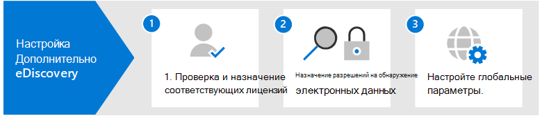

# Настройка Microsoft 365 Advanced eDiscovery

Advanced eDiscovery в Microsoft 365 предоставляет конечный рабочий процесс для сохранения, сбора, анализа, анализа и экспорта данных, которые отвечают внутренним и внешним расследованиям организации. Для развертывания Advanced eDiscovery не требуется ничего, но перед организацией, чтобы начать создавать и использовать Advanced eDiscovery для управления расследованиями, необходимо выполнить некоторые обязательные задачи, которые должен выполнить ИТ-администратор и менеджер по обнаружению электронных обнаружений.

В этой статье обсуждаются следующие действия, необходимые для Advanced eDiscovery.

Это включает обеспечение надлежащего лицензирования, необходимого для доступа к Advanced eDiscovery и добавления хранителей в дела, а также назначение разрешений вашей юридической и следственной группе, чтобы они могли получать доступ к делам и управлять ими.

## Шаг 1. Проверка и назначение соответствующих лицензий

Для лицензирования Advanced eDiscovery требуется соответствующая подписка на организацию и лицензирование для каждого пользователя. Список требований к лицензированию для Advanced eDiscovery см. в [журнале Subscriptions and licensing.](overview-ediscovery-20.md#subscriptions-and-licensing)

## Шаг 2. Назначение разрешений на открытие электронной почты

Чтобы получить Advanced eDiscovery или добавить его в качестве члена Advanced eDiscovery, пользователю должны быть назначены соответствующие разрешения. В частности, пользователь должен быть добавлен в качестве члена группы ролей диспетчера электронных данных в Центре & безопасности. Члены этой группы ролей могут создавать и управлять Advanced eDiscovery делами. Они могут добавлять и удалять участников, задерживать хранители и расположения контента, управлять уведомлениями о удержании, создавать и изменять поиски, связанные с делом, добавлять результаты поиска в набор отзывов, анализировать данные в наборе отзывов и экспортировать и загружать из Advanced eDiscovery случае.

Выполните следующие действия, чтобы добавить пользователей в группу ролей диспетчера электронных данных:

1. Перейдите и войдите в использование учетных данных учетной записи администратора в <https://protection.office.com/permissions> Microsoft 365 организации.

2. На странице **Разрешения выберите** группу **ролей диспетчера** электронных открытий.

3. На странице флажок диспетчера электронных обнаружений нажмите **кнопку Изменить** рядом с разделом Диспетчер по обнаружению **электронных обнаружений.**

4. На странице **Choose eDiscovery Manager** в мастере группы редактирования ролей нажмите **кнопку Выберите диспетчер по обнаружению электронных обнаружений.**

5. Нажмите **кнопку Добавить,** а затем выберите почтовый ящик для всех пользователей, которые необходимо добавить в группу ролей.

6. Нажмите **кнопку Добавить,** чтобы добавить выбранных пользователей, а затем нажмите кнопку **Готово**.

7. Нажмите **Кнопку Сохранить,** чтобы добавить пользователей в группу ролей, а затем нажмите **кнопку Закрыть,** чтобы завершить шаг.

### Дополнительные сведения о группе ролей диспетчера электронных данных

В группе ролей диспетчера электронных обнаружений есть две подгруппы. Разница между этими подгруппами заключается в области их действия.

- **Диспетчер по обнаружению** электронных обнаружений: может просматривать и управлять Advanced eDiscovery случаях, которые они создают или являются членами. Если другой диспетчер по обнаружению электронных данных создает дело, но не добавляет второго диспетчера электронных данных в качестве участника этого дела, второй диспетчер по обнаружению электронных данных не сможет просмотреть или открыть дело на странице Advanced eDiscovery в центре соответствия требованиям. Как правило, большинство людей в вашей организации могут быть добавлены в подгруппу диспетчера электронных обнаружений.

- **Администратор по обнаружению** электронной почты: может выполнять все задачи по управлению случаями, которые может выполнять диспетчер по обнаружению электронных обнаружений. Кроме того, администратор, ответственный за обнаружение электронных данных, может выполнять указанные ниже действия.

  - Просматривать все дела, отображаемые на странице "Advanced eDiscovery".
  
  - Управлять любым делом в организации после того, как добавит себя в качестве его участника.

  - Получать доступ к данным любого дела в организации и экспортировать эти данные.

  Из-за широкой области доступа в организации должно быть только несколько администраторов, которые являются членами подгруппы администраторов обнаружения электронных данных.

Дополнительные сведения о разрешениях на открытие электронных данных и описании каждой роли, назначенной группе ролей диспетчера электронных данных, см. в руб. Назначение разрешений на открытие [электронных данных.](assign-ediscovery-permissions.md)

## Шаг 3. Настройка глобальных параметров для Advanced eDiscovery

Последний шаг, который необходимо выполнить, прежде чем люди в организации начнут создавать и использовать случаи, это настройка глобальных параметров, применимых к всем случаям в вашей организации. В настоящее время единственным глобальным параметром является обнаружение привилегий между адвокатом и клиентом *(в* будущем будут доступны более глобальные параметры). Этот параметр позволяет модели привилегий адвоката и клиента работать при анализе данных в наборе отзывов. Модель использует машинное обучение для определения вероятности того, что документ содержит содержимое, которое является законным по своему характеру. Он также сравнивает участников документов со списком адвокатов (который вы представляете при настройке модели), чтобы определить, имеется ли в документе по крайней мере один участник, который является адвокатом.

Дополнительные сведения о настройке и использовании модели обнаружения привилегий между адвокатом и клиентом см. в примере [Set up attorney-client privilege detection in Advanced eDiscovery.](attorney-privilege-detection.md)

> [!NOTE]
> Это необязательный шаг, который можно выполнить в любое время. Не внедрение модели обнаружения привилегий между адвокатом и клиентом не мешает создавать и использовать Advanced eDiscovery случаях.

## Дальнейшие действия

После создания Advanced eDiscovery, вы будете готовы [создать случай](create-and-manage-advanced-ediscoveryv2-case.md).