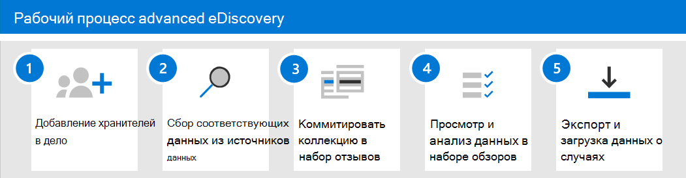

# Начало работы с Advanced eDiscovery

Расширенное обнаружение электронных данных в Microsoft 365 предоставляет [сквозной рабочий процесс](overview-ediscovery-20.md#advanced-ediscovery-architecture) для сохранения, сбора, проверки, анализа и экспорта данных, которые отвечают за внутреннее и внешнее расследования вашей организации. Для развертывания расширенного обнаружения электронных данных не требуется ничего, но существуют некоторые обязательные задачи, которые ИТ-администратор и диспетчер eDiscovery должны выполнить, прежде чем Организация сможет начать создавать и использовать расширенные случаи обнаружения электронных данных для управления расследованиями.

В этой статье описываются действия, необходимые для настройки расширенного обнаружения электронных данных. Это включает в себя обеспечение надлежащего лицензирования для доступа к расширенному eDiscovery и добавление custodians к делам, а также назначение разрешений юридическим требованиям и исследованиям, чтобы они могли получать доступ к делам и управлять ими. В этой статье также представлен общий обзор использования обращений для управления дополнительным рабочим процессом обнаружения электронных данных для судебного разбирательства.

## Шаг 1: Проверка и назначение соответствующих лицензий

Для лицензирования расширенного обнаружения электронных данных требуется соответствующая подписке Организации и лицензирование для отдельных пользователей.

- **Подписка на организацию:** Чтобы получить доступ к расширенному обнаружению электронных данных в центре соответствия требованиям Microsoft 365 или центре безопасности & соответствия требованиям, ваша организация должна иметь один из следующих компонентов:

  - Подписка Microsoft 365 E5 или Office 365 E5
  
  - Подписка Microsoft 365 E3 с дополнительной надстройкой для соответствия требованиям E5

  - Подписка на Microsoft 365 E3 с надстройкой "обнаружение электронных данных" и аудитом

  Если у вас нет плана Microsoft 365 и вы хотите испытать расширенные функции обнаружения электронных данных, вы можете [Добавить microsoft 365](https://docs.microsoft.com/office365/admin/try-or-buy-microsoft-365) к существующей подписке или [зарегистрироваться в качестве пробной](https://www.microsoft.com/microsoft-365/enterprise) версии Microsoft 365.

- **Лицензирование для каждого пользователя:** Чтобы добавить пользователя в качестве хранитель в рамках предварительного обнаружения электронных данных, ему необходимо назначить одну из следующих лицензий в зависимости от вашей подписки Организации:

  - Microsoft 365: пользователям должна быть назначена лицензия Microsoft 365 об/в, лицензия на несоответствие требованиям, или лицензия на обнаружение электронных данных и аудит.

  - Office 365: пользователю должна быть назначена лицензия на Office 365.

   Сведения о назначении лицензий приведены [в статье Назначение лицензий пользователям](https://docs.microsoft.com/microsoft-365/admin/manage/assign-licenses-to-users).

> [!NOTE]
> Пользователям нужна лицензия "а" (или соответствующая лицензия на надстройку), которую необходимо добавить в качестве custodians к расширенному случаю обнаружения электронных данных. ИТ — администраторы, руководители обнаружения электронных данных, юристам, судебные судебные и судебные изучения, которые используют расширенные функции обнаружения электронных данных для управления обращениями и проверки данных о делах, не нуждаются в дополнительной лицензии.

## Шаг 2: назначение разрешений на обнаружение электронных данных

Чтобы получить доступ к расширенному eDiscovery или добавить его в качестве участника расширенного случая обнаружения электронных данных, пользователю необходимо назначить соответствующие разрешения. В частности, необходимо добавить пользователя в качестве члена группы ролей "Диспетчер обнаружения электронных данных" в центре безопасности & соответствия требованиям. Члены этой группы ролей могут создавать расширенные случаи обнаружения электронных данных и управлять ими. Они могут добавлять и удалять участников, размещать custodians и расположения содержимого на удержании, управлять уведомлениями о юридических удержаниях, создавать и редактировать Поиск, связанные с обращением, добавлять результаты поиска в набор проверки, анализировать данные в наборе проверки, а также экспортировать и загружать данные из расширенного дела eDiscovery.

Выполните следующие действия, чтобы добавить пользователей в группу ролей "Диспетчер обнаружения электронных данных".

1. Перейдите к учетной [https://protection.office.com/permissions](https://protection.office.com/permissions) записи администратора в организации Microsoft 365 и войдите в нее с помощью учетных данных.

2. На странице " **разрешения** " выберите группу ролей **Диспетчер обнаружения электронных** данных.

3. На всплывающей странице диспетчера обнаружения электронных данных нажмите кнопку **изменить** рядом с разделом **Диспетчер обнаружения электронных** данных.

4. На странице " **Выбор диспетчера обнаружения электронных** данных" в мастере изменения группы ролей нажмите кнопку **выбрать диспетчер обнаружения**.

5. Нажмите кнопку **Добавить** , а затем установите флажок для всех пользователей, которых вы хотите добавить в группу ролей.

6. Нажмите кнопку **Добавить** , чтобы добавить выбранных пользователей, а затем нажмите кнопку **Готово**.

7. Нажмите кнопку **сохранить** , чтобы добавить пользователей в группу ролей, а затем нажмите кнопку **Закрыть** , чтобы завершить этот шаг.

### Дополнительные сведения о группе ролей диспетчера обнаружения электронных данных

В группе ролей диспетчера обнаружения электронных данных есть две подгруппы. Разница между этими подгруппами заключается в области их действия.

- **Диспетчер обнаружения электронных данных:** Возможность просмотра и управления дополнительными делами eDiscovery, которые они создают или входят в состав. Если другой диспетчер обнаружения электронных данных создает обращение, но не добавляет второй диспетчер обнаружения электронных данных в качестве участника этого случая, второй диспетчер обнаружения электронных данных не сможет просмотреть или открыть дело на странице Advanced eDiscovery в центре соответствия требованиям. Как правило, большинство пользователей в Организации можно добавить в подгруппу управления eDiscovery.

- **Администратор обнаружения электронных данных:** Может выполнять все задачи управления делами, которые может выполнять диспетчер обнаружения электронных данных. Кроме того, администратор, ответственный за обнаружение электронных данных, может выполнять указанные ниже действия.

  - Просмотрите все варианты, перечисленные на странице Advanced eDiscovery.
  
  - Управление любыми делами в Организации после добавления их в качестве участника дела.

  - Доступ и экспорт данных обращений для любого случая в Организации.

  Из-за обширного уровня доступа Организация должна иметь только нескольких администраторов, являющихся участниками подгруппы администраторов eDiscovery.

Дополнительные сведения о разрешениях обнаружения электронных данных и описание каждой роли, назначенной группе ролей диспетчера обнаружения электронных данных, приведены в разделе [Назначение разрешений на обнаружение электронных](assign-ediscovery-permissions.md)данных.

## Шаг 3: Настройка глобальных параметров для расширенного обнаружения электронных данных

Последний шаг, который необходимо завершить до начала создания и использования пользователями в Организации, — Настройка глобальных параметров, которые применяются ко всем случаям в Организации. В настоящее время единственным глобальным параметром является *Обнаружение доверенности клиента* (в будущем будут доступны дополнительные глобальные параметры). Этот параметр включает выполнение модели полномочий доверенного клиента при анализе данных в наборе рецензирования. Модель использует машинное обучение, чтобы определить вероятность того, что документ содержит контент, который является юридическим. Кроме того, он сравнивает участников документов со списком юрист (который вы передаете при настройке модели), чтобы определить, имеет ли документ по крайней мере одного участника, который является юристом.

Для получения дополнительных сведений о настройке и использовании модели обнаружения доверенности клиентов, ознакомьтесь с разделом [Настройка обнаружения доверенности клиента в Advanced eDiscovery](attorney-privilege-detection.md).

> [!NOTE]
> Это необязательный шаг, который можно выполнить в любое время. Не реализация модели обнаружения доверенности для клиентов не запрещает создавать и использовать расширенные случаи обнаружения электронных данных.

## Шаг 4: создание расширенного случая обнаружения электронных данных

Следующий шаг — создание дела и начало использования расширенного обнаружения электронных данных. Выполните следующие действия, чтобы создать обращение и добавить участников. Пользователь, который создает обращение, автоматически добавляется в качестве участника.

1. Перейдите на страницу [https://compliance.microsoft.com](https://compliance.microsoft.com) и войдите, используя учетные данные для учетной записи пользователя, которой были назначены соответствующие разрешения на обнаружение электронных данных. Члены группы ролей Управление организацией также могут создавать расширенные случаи обнаружения электронных данных.

2. В левой области навигации центра соответствия требованиям Microsoft 365 щелкните **Показать все** , а затем выберите **> обнаружения электронных** данных.

3. На странице **Advanced eDiscovery (дополнительные функции обнаружения электронных** данных) перейдите на вкладку **обращения** , а затем щелкните **создать обращение**.

4. На новой странице раскрывающихся списков **обнаружения электронных** данных присвойте регистру имя (обязательно), а затем введите номер и описание дополнительного случая. Имя дела должно быть уникальным в Организации.

5. Нажмите кнопку **сохранить** , чтобы создать обращение.

   Создается новый вариант, и отображается вкладка **Параметры** в новом случае. 

6. На плитке **разрешения & доступа** на вкладке **Параметры** нажмите кнопку **выбрать** , а затем нажмите кнопку **Обновить**.

7. Нажмите кнопку **Обновить**.

8. На всплывающей странице **Управление этим обращением** в разделе **Управление участниками** нажмите кнопку **добавить** , чтобы добавить участников в обращение.

9. В списке людей установите флажки рядом с именами людей, которых вы хотите добавить в обращение. Как описывалось ранее, убедитесь, что сотрудникам, добавляемым в обращение, назначены соответствующие разрешения на обнаружение электронных данных.

10. Выбрав пользователей, которых нужно добавить в качестве участников, нажмите кнопку **Добавить**.

11. В всплывающей странице **Управление этим случаем** нажмите кнопку **сохранить** , чтобы сохранить новый список элементов дела.

12. Перейдите на вкладку **Главная** , чтобы перейти на домашнюю страницу дела.

## Обзор расширенного рабочего процесса обнаружения электронных данных

Чтобы приступить к работе с расширенным обнаружением электронных данных, вот простой рабочий процесс, который соответствует [распространенным практикам обнаружения электронных](overview-ediscovery-20.md#alignment-with-edrm)данных. В каждом из этих действий мы также выделяем некоторые расширенные расширенные функции обнаружения электронных данных, которые можно исследовать.

1. **[Добавьте custodians в дело](add-custodians-to-case.md)**. Первым шагом после создания дела является добавление custodians. *Хранитель* — это человек, имеющий административное управление документом или электронным файлом, которые могут быть релевантными для случая. Ниже приведены некоторые моменты, которые могут произойти при добавлении custodians к случаю.

   - Данные в почтовом ящике Exchange хранитель, учетной записи OneDrive, а также в группах Microsoft Teams и Yammer, участником которых является хранитель, могут быть помечены как данные кустодиал в случае.
  
   - Данные хранитель переиндексируются (процесс, называемый *расширенной индексацией* ). Это помогает оптимизировать поиск по нему на следующем этапе.
  
   - Вы можете поместить удержание на данные хранитель. Это позволяет сохранить данные, которые могут быть релевантными для случая во время расследования.
  
   - Можно связать другие источники данных с помощью хранитель (например, вы можете связать сайт SharePoint или группу Microsoft 365 с помощью хранитель), чтобы эти данные можно было переиндексировать, размещать на удержании и искать, как данные в почтовом ящике хранитель или в учетной записи OneDrive.

   - Вы можете использовать [Рабочий процесс связи](managing-custodian-communications.md) в Advanced eDiscovery для отправки уведомлений о юридических удержаниях в custodians.

2. **[Поиск данных, относящихся к кустодиал, в источниках данных](collecting-data-for-ediscovery.md)**. После добавления custodians к этому случаю используйте встроенное средство поиска для поиска данных в хранитель, которые могут быть релевантны для случая. Используйте ключевые слова, свойства и условия для [построения поисковых запросов](building-search-queries.md) , возвращающих результаты поиска, с данными, которые скорее всего важны для случая. Вы также можете:

   - Просмотр [статистики поиска](search-statistics.md) , которая может помочь уточнить поисковый запрос, чтобы сузить результаты.

   - Просмотрите результаты поиска, чтобы быстро проверить, найдены ли нужные данные.

   - Измените запрос и повторно выполните поиск.

3. **[Добавление данных в набор проверки](add-data-to-review-set.md)**. После настройки и проверки того, что поиск возвращает нужные данные, следующим шагом является добавление результатов поиска в набор рецензирования. При добавлении данных в набор проверки элементы копируются из их исходных расположений в безопасное место хранения Azure. Данные переиндексируются повторно, чтобы оптимизировать их для поиска и анализа элементов в наборе рецензирования. Кроме того, вы можете [добавлять данные, не относящиеся к Office 365, в набор проверки](load-non-office-365-data-into-a-review-set.md).

   Кроме того, существует специальный вид набора проверок, в который можно добавить данные, называемый *набором проверки беседы*. Эти типы наборов проверок предоставляют возможности реконструкции сообщений для реконструкции, просмотра и экспорта потоков обсуждений, как и в Microsoft Teams. Дополнительную информацию можно узнать [в статье Обзор бесед в Advanced eDiscovery](conversation-review-sets.md).

4. **Просмотр и анализ данных в наборе рецензирования**. Теперь, когда данные находятся в наборе проверки, вы можете использовать широкий спектр средств и возможностей для просмотра и анализа данных дела с целью уменьшения набора данных до того, что вы изучаете. Ниже приведен список некоторых средств и возможностей, которые можно использовать во время этого процесса.

   - [Просмотр документов](view-documents-in-review-set.md). Это включает просмотр метаданных для каждого документа в наборе рецензирования и просмотр документа в собственной версии или текстовой версии.

   - [Создание запросов и фильтров](review-set-search.md). Вы создаете поисковые запросы, используя различные критерии поиска (включая возможность поиска по всем [свойствам метаданных файла](document-metadata-fields-in-advanced-ediscovery.md)) для дальнейшего уточнения и отбора данных дела, наиболее релевантных для случая. Вы также можете использовать фильтры по набору проверок, чтобы быстро применить дополнительные условия к результатам запроса поиска для дальнейшего уточнения этих результатов. 

   - [Создание и использование тегов](tagging-documents.md). Вы можете применять теги к документам в наборе проверки, чтобы определить, какие из них отвечают (или не отвечают на них), а затем использовать эти теги при создании поисковых запросов для включения или исключения документов с тегами. Вы также можете разметить теги, чтобы определить, какие документы следует экспортировать.

   - [Пометка и редактирование документов](view-documents-in-review-set.md#annotate-view). С помощью инструмента заметок вы можете просматривать заметки к документам и изменять содержимое документов как рабочий продукт. Мы создаем документ PDF с аннотированным или отредактировал документом во время проверки, чтобы снизить риск экспорта собственной версии унредактед документа.

   - [Анализ данных о делах](analyzing-data-in-review-set.md). Функции аналитики в Advanced eDiscovery являются мощным средством. После выполнения аналитики в наборе анализа мы выполняем анализ, например около обнаружения повторяющихся данных, почтовые потоки и темы, которые помогут уменьшить объем документов, которые необходимо просмотреть. Кроме того, мы создаем отчеты аналитики, которые обобщаются результаты выполнения анализа. Как описывалось ранее, при выполнении аналитики также запускается [модель обнаружения доверенных прав клиентов](attorney-privilege-detection.md#use-the-attorney-client-privilege-detection-model).

5. **Экспорт и скачивание данных о делах**. Завершающим шагом после сбора, просмотра и анализа данных о делах является экспорт их из расширенного обнаружения электронных данных для внешнего рецензирования или для просмотра пользователями за пределами группы расследования. Процесс экспорта данных состоит из двух этапов. Первым этапом является [Экспорт](export-documents-from-review-set.md) данных из набора проверки и их копирование в другое место хранения Azure (которое предоставляется корпорацией Майкрософт или управляемой вашей организацией). Затем с помощью обозревателя хранилищ Azure [Скачайте](download-export-jobs.md) данные на локальный компьютер. Кроме экспортированных файлов данных, в состав пакета экспорта входит также отчет о экспорте, сводный отчет и отчет об ошибках.
