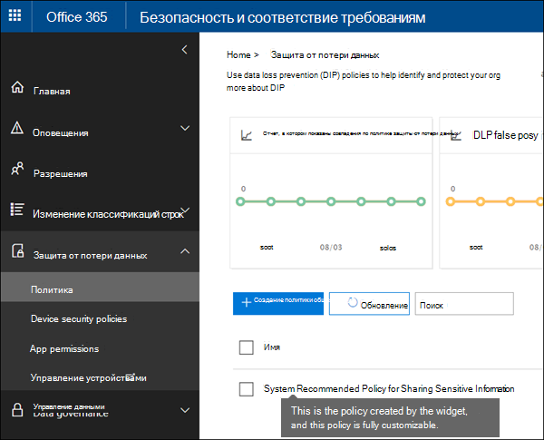

# Рекомендации по началу работы с политикой DLPGet started with DLP policy recommendations

Эта рекомендация поможет вашей организации защитить конфиденциальный контент, если он хранится и предоставляется в Microsoft 365, выполнив сведения о возможном разрыве политики защиты от потери данных.This insight-driven recommendation helps your organization keep sensitive content secure when it's stored and shared in Microsoft 365 by informing you when there's a possible gap in your DLP policy coverage. Вы увидите эту рекомендацию на **домашней** странице &amp; центра безопасности и соответствия требованиям, если ваши документы содержат любой из пяти наиболее распространенных типов конфиденциальной информации, но не защищены политикой защиты от потери данных (DLP).You'll see this recommendation on the **Home** page of the Security &amp; Compliance Center, if your documents contain any of the top-five most common types of sensitive information but aren't protected by a data loss prevention (DLP) policy. 
  
С помощью этого мини-приложения можно быстро создать настраиваемую политику защиты от потери данных в любом нажатии или двух кнопках, а после создания этой политики DLP она будет полностью настраиваемой.You can use this widget to quickly create a customized DLP policy in just a click or two, and after you create this DLP policy, it's fully customizable. Обратите внимание, что если вы не видите рекомендацию, нажмите кнопку **+ More (дополнительно** ) в нижней части раздела **рекомендуем для вас** .Note that if you don't see the recommendation at first, try clicking **+More** at the bottom of the **Recommended for you** section. 
  

  
## Создание рекомендуемой политики защиты от потери данныхCreate the recommended DLP policy

Когда мини-приложение показывает, что вы не защищаете конфиденциальные данные, в нижней части окна выберите **начать** , чтобы быстро создать политику защиты от потери данных.When the widget shows you unprotected sensitive information, choose **Get started** at the bottom to quickly create a DLP policy. 
  
Для защиты конфиденциальной информации эта политика защиты от потери данных:To help protect the sensitive information, this DLP policy:
  
- Определяет, когда контент в Exchange, SharePoint и OneDrive содержит один из незащищенных типов конфиденциальных данных, доступ к которым предоставляется людям за прев Организации.Detects when content in Exchange, SharePoint, and OneDrive that contains one of the unprotected types of sensitive information is shared with people outside your organization.
    
- Создает подробные отчеты об активности, чтобы можно было отслеживать такие аспекты, как доступ к контенту пользователям за пределами вашей организации.Generates detailed activity reports so that you can track things like who shared the content with people outside your organization and when they did it. Для просмотра этих сведений можно использовать [отчеты о](view-the-dlp-reports.md) защите от потери [данных и журнал аудита](search-the-audit-log-in-security-and-compliance.md) **(где**  =  **DLP DLP**).You can use the [DLP reports](view-the-dlp-reports.md) and [audit log data](search-the-audit-log-in-security-and-compliance.md) (where **Activity** = **DLP**) to see this information.
    
Вы также можете выбрать политику защиты от потери данных:You can also choose to have the DLP policy:
  
- Отправьте вам электронное сообщение с отчетом об инциденте, когда пользователи совместно используют эти конфиденциальные сведения с людьми, не входящими в вашу организацию.Send you an incident report email when users share a lot of this sensitive information with people outside your organization.
    
- Добавьте других пользователей в отчет об инцидентах электронной почты.Add other users to the email incident report.
    
- Показать подсказку политики и отправлять пользователям уведомления по электронной почте при попытке поделиться конфиденциальной информацией с пользователями, не входящими в вашу организацию.Show a policy tip and send an email notification to users when they attempt to share this sensitive information with people outside your organization. Более подробную информацию об этих параметрах можно узнать в статье [Отправка уведомлений по электронной почте и отображение советов политики для политик защиты от потери](use-notifications-and-policy-tips.md)данных.For more information on these options, see [Send email notifications and show policy tips for DLP policies](use-notifications-and-policy-tips.md).
    
Если вы хотите изменить эти параметры позже, вы сможете изменить политику защиты от потери данных после ее создания.If you want to change these options later, you can edit the DLP policy after it's created. Например, вы можете сделать политику более ограничительной, даже заблокируя доступ к содержимому, которое содержит конфиденциальную информацию, в первом месте.For example, you can make the policy more restrictive by even blocking people from sharing content that contains sensitive information in the first place - see the next section.
  

  
## Изменение рекомендуемой политики защиты от потери данныхEdit the recommended DLP policy

После использования мини-приложения для создания политики защиты от потери данных эта политика отображается в разделе **Защита от потери данных** на странице **Политика** &amp; центра соответствия требованиям безопасности.After you use the widget to create a DLP policy, the policy appears under **Data loss prevention** on the **Policy** page of the Security &amp; Compliance Center. 
  
По умолчанию политика имеет имя **System Рекомендуемая политика для предоставления общего доступа к конфиденциальным сведениям**.By default, the policy is named **System Recommended Policy for Sharing Sensitive Information**. Эта политика является полностью настраиваемой, то же, что и любая политика защиты от потери данных, которую вы самостоятельно создаете с нуля.This policy is fully customizable, the same as any DLP policy that you create yourself from scratch. Например, если вы решили не включать отчеты об инцидентах и подсказки политики при использовании мини-приложения, вы всегда можете изменить эту политику и включить эти параметры в любое время.For example, if you decided not to turn on incident reports and policy tips when you used the widget, you can always edit the policy and turn on those options at any time.
  

  
## Когда мини-приложение отображается и не отображаетсяWhen the widget does and does not appear

В разделе **рекомендуемое для вас** на **домашней** странице центра соответствия требованиям безопасности отображается мини-приложение под названием " **незащищенные конфиденциальные данные** " &amp; .The widget named **Unprotected Sensitive Information** appears in the **Recommended for you** section of the **Home** page of the Security &amp; Compliance Center. 
  
Это мини-приложение отображается только в том случае, если:This widget appears only when:
  
- Новые документы, содержащие любые из пяти наиболее распространенных типов конфиденциальных данных, обнаружены в SharePoint или OneDrive за последние 30 дней.New documents containing any of the five most common types of sensitive information are detected in SharePoint or OneDrive over the past 30 days.
    
- Конфиденциальная информация еще не защищена существующей политикой защиты от потери данных.That sensitive information is not already protected by an existing DLP policy.
    
В отличие от политик защиты от потери данных, которые постоянно проверяют ваши данные, эта рекомендация проверяет наличие промежутков в политике защиты от потери данных примерно каждые 48 часов, поэтому после отправки нового контента может потребоваться до двух дней, чтобы появилась рекомендация.Unlike DLP policies that are constantly scanning your data, this recommendation scans for gaps in your DLP policy coverage roughly every 48 hours, so after new content is uploaded, it may take up to two days for the recommendation to appear.
  
Наконец, после использования мини-приложения для создания рекомендуемой политики DLP мини-приложение исчезает с **домашней** страницы.Finally, after you use the widget to create a recommended DLP policy, the widget disappears from the **Home** page. 
  

