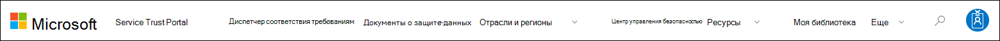

# Начало работы с порталом доверия службы Майкрософт

Портал доверия к службам Майкрософт предоставляет множество контента, инструментов и других ресурсов о правилах безопасности, конфиденциальности и соответствия требованиям Майкрософт.

## Доступ к порталу доверия к службам

Портал Service Trust Portal содержит сведения о том, как Майкрософт реализует средства управления и процессы, защищающие наши облачные службы и данные клиентов, которые в них хранятся. Чтобы получить доступ к некоторым ресурсам на портале доверия к службам, необходимо войти в качестве пользователя с проверкой подлинности с учетной записью облачных служб Майкрософт (учетная запись Azure Active Directory организации или учетная запись Майкрософт) и просмотреть и принять соглашение Microsoft Non-Disclosure materials.

### Существующие клиенты

Существующие клиенты могут получить доступ к порталу доверия к службе по одной из следующих онлайн-подписок <https://aka.ms/STP> (пробная версия или платная):

- Microsoft 365
- Dynamics 365
- Azure

 > [!NOTE]
 > Azure Active Directory учетные записи, связанные с организациями, имеют доступ ко всем документам и функциям, например к диспетчеру соответствия требованиям. Учетные записи Майкрософт, созданные для личного использования, имеют ограниченный доступ к контенту портала доверия к службам.

### Новые клиенты и клиенты, оценивающие онлайн-службы Microsoft

Чтобы создать новую учетную запись или создать пробную учетную запись, используйте одну из следующих форм регистрации (также используемых для пробных учетных записей), чтобы получить доступ к STP.

- Подпишитесь на новую [пробную Приложения Microsoft 365 для бизнеса](https://go.microsoft.com/fwlink/p/?LinkID=507653) или новую Office 365 корпоративный [пробную учетную запись](https://go.microsoft.com/fwlink/p/?LinkID=698279)

- Подпишитесь на новую [пробную учетную запись Dynamics 365](https://go.microsoft.com/fwlink/?LinkId=252780)

- Подпишитесь на новую [пробную учетную запись Azure.](https://go.microsoft.com/fwlink/?LinkId=722737)

При регистрации на бесплатную пробную или подписку необходимо включить Azure Active Directory для поддержки доступа к STP.

## Использование портала доверия к службам

Для доступа к возможностям и содержимому портала Service Trust Portal можно использовать главное меню.

В следующих разделах описан каждый элемент основного меню.

### Service Trust Portal

Ссылка **портала доверия служб** отображает домашняя страница. Это позволяет быстро вернуться на домашную страницу.

### Диспетчер соответствия требованиям

> [!IMPORTANT]
> Диспетчер соответствия требованиям перешел с портала доверия к службе на новое расположение в центре Microsoft 365 [соответствия](https://compliance.microsoft.com/)требованиям. Все данные клиентов перенесены в новое расположение, поэтому вы можете без перерыва продолжать использовать диспетчер соответствия требованиям. Обратитесь к [документации диспетчера соответствия требованиям](compliance-manager.md) для сведений о настройке и узнайте о новых функциях. Несмотря на то, что классическая версия диспетчера соответствия требованиям остается на портале доверия к службам, всем пользователям рекомендуется использовать диспетчер соответствия требованиям в центре Microsoft 365 соответствия требованиям.

### Документы о защите данных

Предоставляет множество сведений о реализации и разработке безопасности с целью упростить выполнение задач по обеспечению соответствия нормативным требованиям, понимая, как облачные службы Майкрософт обеспечивают безопасность данных. Для просмотра содержимого выберите один из следующих пунктов в раскрывающемся меню **Документы по безопасности**.

- **Отчеты по аудиту:** Отображается список отчетов о независимом аудите и оценке облачных служб Майкрософт. Эти отчеты предоставляют сведения о соответствии служб Microsoft Cloud стандартам защиты данных и нормативным требованиям, таким как:

  - Международная организация по стандартизации (ISO)
  - Средства контроля обслуживающей организации (SOC)
  - требованиям Национального института стандартов (NIST);
  - требованиям Федеральной программы управления рисками и авторизацией (FedRAMP);
  - общему регламенту по защите данных (GDPR).

- **Защита данных:** Содержит множество ресурсов, таких как проверенные элементы управления, документы, задаваемые требования, тесты на проникновение, средства оценки рисков и руководства по обеспечению соответствия требованиям.

- **Чертежи безопасности и соответствия требованиям Azure:** Ресурсы, которые помогают создавать безопасные и совместимые облачные приложения. В этой области содержатся рекомендации по правительственным, финансовым, медицинским и розничным вертикалям.

### Отрасли и регионы

Предоставляет сведения о соответствия требованиям в отрасли и регионах о службах Microsoft Cloud.

- **Отрасли промышленности:** В настоящее время на этой странице предоставляется конкретная для отрасли страница для отрасли финансовых услуг. Она содержит такую информацию, как предложения по обеспечению соответствия требованиям, вопросы и ответы, истории успеха. Ресурсы для других отраслей будут выпущены в будущем, однако вы можете найти ресурсы для других отраслей, переехав на страницу Trust **Documents >** защиты данных в STP.

- **Регионы:** Предоставляет юридические заключения о соответствии служб Microsoft Cloud различным законам разных стран. таких как Австралия, Германия, Дания, Испания, Канада, Польша, Румыния, Соединенное Королевство и Чешская Республика.

### Центр управления безопасностью

Ссылки на [Центр доверия Майкрософт,](https://www.microsoft.com/trust-center)который предоставляет дополнительные сведения о безопасности, соответствии требованиям и конфиденциальности в Облаке Майкрософт. Это включает сведения о возможностях в службах Microsoft Cloud, которые можно использовать для решения конкретных требований GDPR, документации, полезной для вашей отчетности GDPR, а также вашего понимания технических и организационных мер, принятых Корпорацией Майкрософт для поддержки GDPR.

### Моя библиотека

Эта новая функция позволяет сохранять *(или* пин-код) документы, чтобы можно было быстро получить доступ к ним на странице Моя библиотека. Можно также настроить уведомления, чтобы Майкрософт отправляла вам сообщение при обновлении документов на вашей странице “Моя библиотека”. Дополнительные сведения см. в разделе [Моя библиотека](#my-library-1) в этой статье.

### Дополнительно

Перейдите **к > администратору,** чтобы получить доступ к административным функциям, доступным только для учетной записи глобального администратора. Этот параметр отображается только при подписании в качестве глобального администратора. В подтягивом меню **администратора** есть два варианта:

- **Параметры:** На этой странице можно назначить роли пользователей для диспетчера соответствия требованиям (классический).

- **Конфиденциальность Параметры:** Эта страница позволяет экспортировать отчет, содержащий назначения элементов действий в диспетчере соответствия требованиям (классический) для определенного пользователя. Вы также можете перенавести все элементы действий другому пользователю и удалить любой заданный элемент действия у указанного пользователя.

### Поиск

Щелкните увеличительное стекло в правом верхнем углу страницы портала доверия службы, чтобы расширить поле, введите условия поиска и нажмите **кнопку Ввод**. Отображается **страница** Поиска, а термин поиска отображается в поле поиска и результаты поиска, указанные ниже.

По умолчанию поиск возвращает результаты документов. Результаты можно фильтровать с помощью списков выпаданий для уточнения списка отображаемого документа. Чтобы сузить список документов, можно использовать несколько фильтров. Фильтры включают определенные облачные службы, категории соответствия требованиям или требованиям безопасности, регионы и отрасли. Щелкните ссылку на имя документа, чтобы скачать документ.

Чтобы перечислить элементы управления из "Оценки" в диспетчере соответствия требованиям (классические), связанные с условиями поиска, щелкните **Диспетчер соответствия** требованиям. В результатах поиска покажут дату создания оценки, имя группы оценки, применимую службу Microsoft Cloud, а также то, является ли управление Microsoft или Customer Managed. Щелкните имя управления, чтобы просмотреть управление в диспетчере соответствия требованиям (классический).

> [!NOTE]
> Отчеты и документы портала доверия служб доступны для скачивания по крайней мере в течение 12 месяцев после публикации или до тех пор, пока не станет доступна новая версия документа.

## Моя библиотека

Используйте функцию "Моя библиотека", чтобы добавить документы и ресурсы на портале доверия к службе на страницу Моя библиотека. Это позволяет получать доступ к документам, которые имеют отношение к вам в одном месте.  Чтобы добавить документ в мою библиотеку, щелкните **меню справа** от документа, а затем выберите **Сохранить в библиотеке.** Вы можете добавить несколько документов в мою библиотеку, щелкнув почтовый ящик рядом с одним или несколькими документами, а затем нажав кнопку **Сохранить** в библиотеку в верхней части страницы.

Кроме того, функция уведомлений позволяет настроить библиотеку My Library таким образом, чтобы сообщение электронной почты отправляли вам всякий раз, когда Корпорация Майкрософт обновляет документ, добавленный в мою библиотеку. Чтобы настроить уведомления, перейдите в мою библиотеку и нажмите кнопку **Уведомление Параметры**. Вы можете выбрать частоту уведомлений и указать адрес электронной почты в организации для отправки уведомлений. Уведомления электронной почты включают ссылки на обновленные документы и краткое описание обновления.

Кроме того, обратите внимание, что в вашей библиотеке мы идентифицируем все документы, которые были обновлены в течение последних 30 дней, независимо от того, включите ли вы уведомления. Краткое описание обновления также отображается в подсказке инструмента.

## Пакеты стартера

Стартовые пакеты — это набор документации по облачным службам Майкрософт для определенных отраслей. В настоящее время портал доверия к службам предлагает следующие три стартовые пакеты для организаций финансовых служб. Эти стартовые пакеты помогают организациям оценивать безопасность, соответствие требованиям и конфиденциальность в облаке Майкрософт и предоставляют рекомендации по внедрению служб Microsoft Cloud в строго регулируемой отрасли финансовых услуг.

- **Пакет starter для оценки:** Используйте для ранней оценки облака Microsoft для организаций финансовых служб.

- **Пакет стартера для оценки:** После оценки используйте контрольные списки и другие рекомендации в этом стартовом пакете, чтобы помочь вашей организации оценить риски, связанные с безопасностью, соблюдением требований и конфиденциальностью.

- **Пакет запуска аудита:** В этом стартовом пакете указаны инструкции по использованию элементов управления аудитом и других средств, которые помогут вам в реализации служб Microsoft Cloud таким образом, чтобы снизить риск для организации.

Чтобы получить доступ к этим стартовам, перейдите на портал доверия **службы > Industries & Регионы**> отраслевые решения > финансовые службы . Вы можете открыть или загрузить документы из стартовом пакете или сохранить их в библиотеке My.

## Поддержка локализации

Содержимое портала Service Trust Portal доступно на нескольких языках. Чтобы изменить язык страницы, просто щелкните значок земного шара в левом нижнем углу и выберите нужный вариант.

## Отзывы

Мы можем помочь с вопросами о портале доверия службы или с ошибками, которые возникают при использовании портала. Вы также можете связаться с нами с вопросами и отзывами о отчетах о соответствии портала доверия службы и ресурсам доверия с помощью ссылки отзывов в нижней части страниц STP.

Ваши отзывы важны для нас. Нажмите кнопку Обратная связь в нижней части страницы, чтобы отправить нам комментарии о том, что вы сделали или не понравилось, или предложения, которые вы можете иметь для улучшения наших продуктов или функций продукта.

