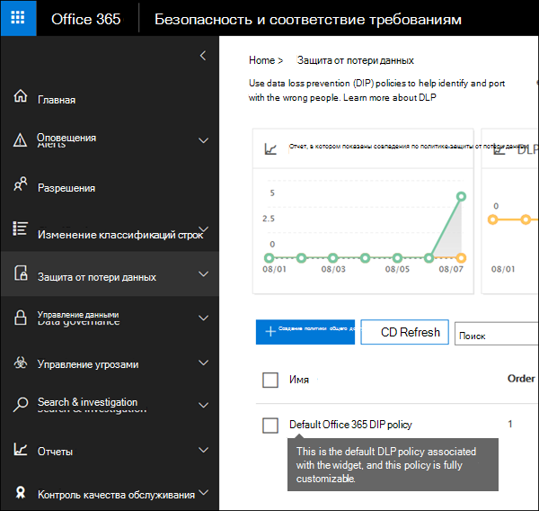

# Начало работы с политикой защиты от потери данных по умолчаниюGet started with the default DLP policy

Перед созданием первой политики предотвращения потери данных DLP помогает защитить конфиденциальные сведения политикой по умолчанию.Before you even create your first data loss prevention (DLP) policy, DLP is helping to protect your sensitive information with a default policy. Эта политика по умолчанию и ее рекомендации (см. ниже) помогают сохранить конфиденциальное содержимое в безопасности, уведомив вас о том, что сообщения электронной почты или документы, содержащие номер кредитной карты, были предоставлены кому-либо за пределами организации.This default policy and its recommendation (shown below) help keep your sensitive content secure by notifying you when email or documents containing a credit card number were shared with someone outside your organization. Эта рекомендация будет см. на **домашней** странице Центра соответствия &amp; требованиям безопасности.You'll see this recommendation on the **Home** page of the Security &amp; Compliance Center. 
  
С помощью этого виджета можно быстро просмотреть, когда и сколько конфиденциальной информации было общим, а затем уточнить политику DLP по умолчанию одним или двумя щелчками мыши.You can use this widget to quickly view when and how much sensitive information was shared, and then refine the default DLP policy in just a click or two. Вы также можете изменить политику DLP по умолчанию в любое время, так как она полностью настраиваема.You can also edit the default DLP policy at any time because it's fully customizable. Обратите внимание, что если вы сначала не видите рекомендации, попробуйте нажать **кнопку +More** в нижней части раздела **Рекомендуемый для вас.**Note that if you don't see the recommendation at first, try clicking **+More** at the bottom of the **Recommended for you** section. 
  

  
## Просмотр отчета и уточнение политики DLP по умолчаниюView the report and refine the default DLP policy

Когда виджет показывает, что пользователи делились конфиденциальной информацией с людьми за пределами организации, выберите политику **уточнения DLP** в нижней части.When the widget shows you that users have shared sensitive information with people outside your organization, choose **Refine DLP policy** at the bottom. 
  
В подробном отчете показано, когда и сколько контента, содержащего номера кредитных карт, было общим за последние 30 дней.The detailed report shows you when and how much content containing credit card numbers was shared in the past 30 days. Обратите внимание, что совпадения правил могут занять до 48 часов для показа в виджете.Note that rule matches can take up to 48 hours to show up in the widget.
  
Чтобы защитить конфиденциальные сведения, политика DLP по умолчанию:To help protect the sensitive information, the default DLP policy:
  
- Определяет, когда контент в Exchange, SharePoint и OneDrive, содержащий по крайней мере один номер кредитной карты, передается людям за пределами организации.Detects when content in Exchange, SharePoint, and OneDrive that contains at least one credit card number is shared with people outside your organization.
    
- Показывает подсказку политики и отправляет уведомление электронной почты пользователям при попытке поделиться этой конфиденциальной информацией с людьми за пределами организации.Shows a policy tip and sends an email notification to users when they attempt to share this sensitive information with people outside your organization. Дополнительные сведения об этих параметрах см. в таблице Отправка уведомлений электронной почты и советы по политике [политики DLP.](use-notifications-and-policy-tips.md)For more information on these options, see [Send email notifications and show policy tips for DLP policies](use-notifications-and-policy-tips.md).
    
- Создает подробные отчеты о действиях, чтобы отслеживать такие вещи, как то, кто поделился содержимым с людьми за пределами организации и когда они это сделали.Generates detailed activity reports so that you can track things like who shared the content with people outside your organization and when they did it. Вы можете использовать [отчеты DLP и](view-the-dlp-reports.md) данные журнала аудита [(где](search-the-audit-log-in-security-and-compliance.md) **DLP активности)**  =  для получения этих сведений.You can use the [DLP reports](view-the-dlp-reports.md) and [audit log data](search-the-audit-log-in-security-and-compliance.md) (where **Activity** = **DLP**) to see this information.
    
Чтобы быстро уточнить политику DLP по умолчанию, вы можете выбрать ее:To quickly refine the default DLP policy, you can choose to have it:
  
- Отправьте сообщение сообщения об инциденте, когда пользователи делятся этой конфиденциальной информацией с людьми за пределами организации.Send you an incident report email when users share this sensitive information with people outside your organization.
    
- Добавьте других пользователей в отчет об инциденте электронной почты.Add other users to the email incident report.
    
- Заблокировать доступ к контенту, содержащим конфиденциальные сведения, но при необходимости разрешить пользователю переопределять и отправлять или отправлять.Block access to the content containing the sensitive information, but allow the user to override and share or send if they need to.
    
Дополнительные сведения о отчетах об инцидентах или ограничении доступа см. в справке о предотвращении [потери данных.](data-loss-prevention-policies.md)For more information on incident reports or restricting access, see [Data loss prevention reference](data-loss-prevention-policies.md).
  
Если вы хотите изменить эти параметры позже, вы можете изменить политику DLP по умолчанию в любое время — см. в следующем разделе.If you want to change these options later, you can edit the default DLP policy at any time - see the next section.
  

  
## Изменение политики DLP по умолчаниюEdit the default DLP policy

Эта политика называется политикой **DLP** по умолчанию и отображается в статье **Предотвращение** потери данных на странице **Политика** Центра соответствия &amp; требованиям безопасности.This policy is named **Default DLP policy** and appears under **Data loss prevention** on the **Policy** page of the Security &amp; Compliance Center. 
  
Эта политика полностью настраиваема, как и любая политика DLP, которую вы создаете с нуля.This policy is fully customizable, the same as any DLP policy that you create yourself from scratch. Вы также можете отключить или удалить политику, чтобы пользователи больше не получали советы по политике или уведомления электронной почты.You can also turn off or delete the policy, so that your users no longer receive policy tips or email notifications.
  

  
## Когда виджет делает и не появляетсяWhen the widget does and does not appear

Виджет с **именем Further protect shared content** отображается  в разделе **Рекомендуемые** для вас домашняя страница Центра соответствия &amp; требованиям безопасности.The widget named **Further protect shared content** appears in the **Recommended for you** section of the **Home** page of the Security &amp; Compliance Center. 
  
Этот виджет появляется только тогда, когда:This widget appears only when:
  
- Политики предотвращения потери данных не существуют в Центре соответствия требованиям безопасности &amp; или Exchange центре администрирования.There are no data loss prevention policies in the Security &amp; Compliance Center or Exchange admin center. Этот виджет предназначен для начала работы с DLP, поэтому он не появится, если у вас уже есть политики DLP.This widget is intended to help you get started with DLP, so it doesn't appear if you already have DLP policies.
    
- Содержимое, содержащее хотя бы одну кредитную карту, было предоставлено кому-либо за пределами организации за последние 30 дней.Content containing least one credit card has been shared with someone outside your organization in the past 30 days.
    
Обратите внимание, что совпадения правил могут занять до 48 часов, чтобы быть доступными для виджета, поэтому после обнаружения конфиденциальной информации, общей внешней стороной, может потребоваться до двух дней для появления рекомендации.Note that rule matches can take up to 48 hours to be available to the widget, so after sensitive information shared externally is detected, it may take up to two days for the recommendation to appear.
  
Наконец, после использования виджета для уточнения политики DLP по умолчанию виджет исчезает со **домашней** страницы.Finally, after you use the widget to refine the default DLP policy, the widget disappears from the **Home** page. 
  

