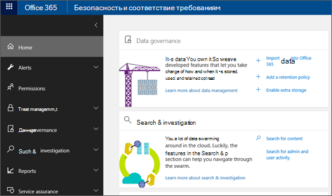

# Переход в Центр безопасности и соответствия требованиямGo to the Security & Compliance Center

Прежде чем вы сможете использовать центр безопасности & соответствия требованиям, необходимы соответствующие разрешения.Before you can use the Security & Compliance Center, you need the right permissions. Вашей рабочей или учебной учетной записи должна быть назначена роль глобального администратора или одна или несколько групп ролей центра соответствия & безопасности, назначенных глобальным администратором:Your work or school account must either be assigned the global administrator role or have been assigned to one or more Security & Compliance Center role groups by a global administrator:
  
- Дополнительные сведения о роли глобального администратора можно узнать в [статье о ролях администратора Microsoft 365](https://support.office.com/article/da585eea-f576-4f55-a1e0-87090b6aaa9d).For more information about the global administrator role, see [About Microsoft 365 admin roles](https://support.office.com/article/da585eea-f576-4f55-a1e0-87090b6aaa9d). 

- Сведения о назначении ролей центра соответствия требованиям & безопасности для других пользователей приведены в статье [предоставление пользователям доступа к центру безопасности & соответствия требованиям](../security/office-365-security/grant-access-to-the-security-and-compliance-center.md).For information on assigning Security & Compliance Center roles to other users, see [Give users access to the Security & Compliance Center](../security/office-365-security/grant-access-to-the-security-and-compliance-center.md).

> [!NOTE]
> Права на делегированный доступ (с правами администратора) с правами администратора от имени (АОБО) не могут получить доступ к центру безопасности & соответствия требованиям.Delegated Access Permission (DAP) partners with Administer On Behalf Of (AOBO) permissions can't access the Security & Compliance Center.

Вот самый прямой способ перейти к центру безопасности & соответствия требованиям:Here's the most direct way to get to the Security & Compliance Center:
  
1. Перейдите по ссылке [https://protection.office.com](https://protection.office.com).Go to [https://protection.office.com](https://protection.office.com).

2. Войдите с помощью рабочей или учебной учетной записи.Sign in using your work or school account.

