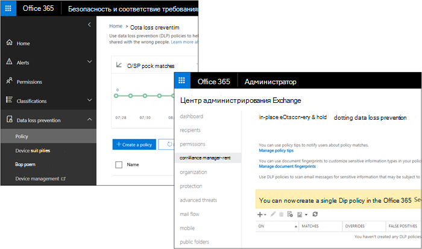

# Принципы работы защиты от потери данных в Центре безопасности и соответствия требованиям и Центре администрирования Exchange

В Office 365 можно создать политику предотвращения потери данных (DLP) в двух разных центрах администрирования:
  
- В Центре **&** безопасности можно создать единую политику DLP для защиты контента в SharePoint, OneDrive, Exchange и теперь Microsoft Teams. По возможности рекомендуется создать политику DLP здесь. Дополнительные сведения см. в [таблице DLP в](data-loss-prevention-policies.md)центре & безопасности.
    
- В центре **администрирования Exchange** можно создать политику DLP для защиты контента только в Exchange. Эта политика может использовать правила потока почтовой почты Exchange (также известные как правила транспорта), поэтому она имеет больше возможностей, определенных для обработки электронной почты. Дополнительные сведения см. в [таблице DLP в центре администрирования Exchange.](/exchange/security-and-compliance/data-loss-prevention/data-loss-prevention)
    
Полицейские службы DLP, созданные в этих центрах администрирования, работают бок о бок — в этом разделе объясняется, как это сделать.
  

  
## Как DLP в Центре & безопасности работает с правилами потока DLP и почты в центре администрирования Exchange

После создания политики DLP в Центре & безопасности политика развертывается во всех расположениях, включенных в политику. Если политика включает Exchange Online, она синхронизирована там и выполняется точно так же, как политика DLP, созданная в центре администрирования Exchange. 
  
Если вы создали политики DLP в центре администрирования Exchange, эти политики будут продолжать работать бок о бок с любыми политиками электронной почты, созданными в Центре & соответствия требованиям. Но обратите внимание, что правила, созданные в центре администрирования Exchange, имеют приоритет. Сначала обрабатываются все правила потока почты Exchange, а затем обрабатываются правила DLP из Центра & соответствия требованиям.
  
Это означает, что:
  
- Сообщения, заблокированные правилами потока почты Exchange, не будут проверяться по правилам DLP, созданным в Центре & соответствия требованиям.
    
- Если правило потока почты Exchange изменяет сообщение таким образом, чтобы оно совпадает с политикой DLP в Центре соответствия требованиям безопасности &, например добавлением внешних пользователей, то правила DLP будут обнаруживать это и применять политику по мере необходимости.
    
Кроме того, обратите внимание, что правила потока почты Exchange, которые используют действие "стоп-обработка", не влияют на обработку правил DLP в Центре соответствия требованиям & безопасности , они все равно будут обработаны.
  
## Советы по политике в Центре & безопасности и центре администрирования Exchange

Советы по политике могут работать как с политиками DLP и правилами потока почты, созданными в центре администрирования Exchange, так и с политиками DLP, созданными в Центре & безопасности, но не обоими. Это потому, что эти политики хранятся в разных расположениях, но советы политики можно использовать только из одного расположения.
  
Если вы настроили советы по политике в центре администрирования Exchange, советы политики, настроенные в Центре соответствия требованиям безопасности &, не будут отображаться пользователям в Outlook в Интернете и Outlook 2013 и позднее, пока вы не отключите подсказки в центре администрирования Exchange. Это гарантирует, что текущие правила потока почты Exchange будут работать до тех пор, пока вы не решите перейти к Центру & безопасности.
  
Обратите внимание, что, хотя советы политики можно использовать только из одного расположения, уведомления электронной почты всегда отправляются, даже если вы используете политики DLP как в Центре обеспечения безопасности &, так и в центре администрирования Exchange.
