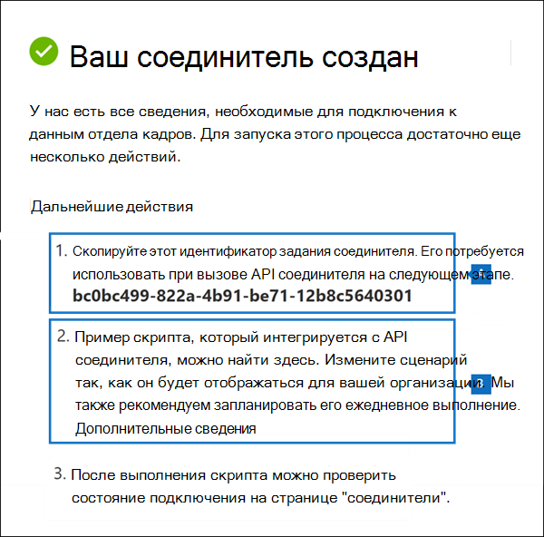

# <a name="set-up-a-connector-to-import-hr-data"></a>Настройка соединителя для импорта данных о персонале

В Центре соответствия требованиям Microsoft 365 можно настроить соединители данных для импорта данных отдела кадров, связанных с такими событиями, как подмена пользователя или изменение уровня должности пользователя. Затем данные о персонале [](insider-risk-management.md) могут использоваться решением для управления рисками внутри организации для создания индикаторов риска, которые помогут вам личные сведения о возможных вредоносных действиях или краже данных пользователями в организации.

Настройка соединители для данных о персонале, которые политики управления рисками могут использовать для создания индикаторов риска, состоит из создания CSV-файла, который содержит данные о персонале, создание приложения в Azure Active Directory, используемого для проверки подлинности, создание соединителя данных отдела кадров в Центре соответствия требованиям Microsoft 365, а затем выполнение сценария (по расписанию), который получает данные о персонале в CSV-файлах в Microsoft Cloud, чтобы они были доступны для программы оценки подлинности решение для управления рисками;

## <a name="before-you-begin"></a>Перед началом работы

- Определите, какие сценарии и данные отдела кадров импортировать в Microsoft 365. Это поможет определить, сколько CSV-файлов и соединителов отдела кадров необходимо создать, а также как создавать и структурировать CSV-файлы. Импортируемые данные отдела кадров определяются политиками управления рисками внутри организации, которые необходимо реализовать. Дополнительные сведения см. в шаге 1.

- Определите, как извлекать или экспортировать данные из системы управления персоналом организации (и регулярно) и добавлять их в CSV-файлы, которые вы создаете на шаге 1. Сценарий, который вы запустите в шаге 4, загрузит данные отдела кадров в CSV-файлах в Microsoft Cloud.

- Пользователю, который создает соединитель отдела кадров на шаге 3, должна быть назначена роль импорта и экспорта почтовых ящиков в Exchange Online. По умолчанию эта роль не назначена ни одной группе ролей в Exchange Online. Вы можете добавить роль "Импорт и экспорт почтового ящика" в группу ролей "Управление организацией" в Exchange Online. Можно также создать новую группу ролей, назначить роль "Импорт и экспорт почтового ящика" и добавить соответствующих пользователей в качестве участников. Дополнительные сведения см. в [](https://docs.microsoft.com/Exchange/permissions-exo/role-groups#modify-role-groups) разделах ["Создание](https://docs.microsoft.com/Exchange/permissions-exo/role-groups#create-role-groups) групп ролей" или "Изменение групп ролей" статьи "Управление группами ролей в Exchange Online".

- Пример сценария, который вы запустите в шаге 4, загрузит данные отдела кадров в Microsoft Cloud, чтобы их можно было использовать в решении для управления рисками внутри организации. Этот пример сценария не поддерживается ни в одной стандартной программе или службе поддержки Майкрософт. Пример сценария приводится в виде "как есть", без каких-либо гарантий. Кроме того, корпорация Microsoft отказывается от всех подразумеваемых гарантий, включая в том числе все подразумеваемые гарантии пригодности для продажи или определенной цели. Все риски, возникающие в результате использования примера сценария и документации, берет на себя пользователь. Корпорация Майкрософт, ее штатные авторы и другие лица, принимающие участие в создании, подготовке и выпуске сценариев, ни при каких обстоятельствах не несут ответственность за какой-либо ущерб (в том числе, ущерб, вызванный потерей доходов предприятия, остановкой его работы, потерей бизнес-данных и другими материальными потерями), вызванный использованием или неспособностью использовать примеры сценариев и документацию, даже если корпорации Майкрософт известно о возможности нанесения такого ущерба.

## <a name="step-1-prepare-a-csv-file-with-your-hr-data"></a>Шаг 1. Подготовка CSV-файла с данными отдела кадров

Сначала необходимо создать CSV-файл, содержащий данные отдела кадров, импортируемые соединитетелем в Microsoft 365. Эти данные будут использоваться решением для оценки риска внутри компании для создания потенциальных индикаторов риска. Данные для следующих сценариев отдела кадров можно импортировать в Microsoft 365:

- Заметь сотрудников. Сведения о пользователях, уехавших из организации.

- Изменения уровня задания. Сведения об изменениях уровня задания для пользователей, таких как повышение и понижение.

- Проверки производительности. Сведения о производительности пользователей.

- Планы повышения производительности. Сведения о планах повышения производительности для пользователей.

Тип импортируемых данных отдела кадров зависит от политики управления рисками внутри организации и соответствующего шаблона политики, который необходимо реализовать. В следующей таблице показано, какой тип данных отдела кадров требуется для каждого шаблона политики:

|  Шаблон политики |  Тип данных отдела кадров |
|:-----------------------------------------------|:---------------------------------------------------------------------|
| Кража данных путем убывающих пользователей                   | Подмайки сотрудников                                                 |
| Общие утечки данных                              | Неприменимо                                                        |
| Утечки данных по приоритетным пользователям                    | Неприменимо                                                        |
| Утечки данных несовершимыми пользователями                 | Изменения уровня задания, проверки производительности, планы улучшения производительности |
| Общие нарушения политики безопасности              | Неприменимо                                                        |
| Нарушения политики безопасности путем отступа пользователей   | Подмайки сотрудников                                                 |
| Нарушения политики безопасности пользователями с приоритетами    | Неприменимо                                                        |
| Нарушения политики безопасности со стороны несоединых пользователей | Изменения уровня задания, проверки производительности, планы улучшения производительности |
| Оскорбительный язык в электронной почте                     | Неприменимо                                                        |

Дополнительные сведения о шаблонах политик для управления insider risk см. в политиках управления [рисками для оценки.](insider-risk-management-policies.md#policy-templates)

Для каждого сценария отдела кадров необходимо предоставить соответствующие данные о персонале в одном или более CSV-файлах. Количество CSV-файлов, которые будут применяться для реализации управления рисками внутри организации, будет рассмотрено далее в этом разделе.

После создания CSV-файла с нужными данными о персонале храните его на локальном компьютере, на который вы запустите сценарий в шаге 4. Кроме того, следует реализовать стратегию обновления, чтобы CSV-файл всегда содержит самые актуальные сведения, чтобы независимо от того, какой сценарий вы запускали, последние данные о персонале будут загружаться в облако Майкрософт и доступны для решения по управлению рисками внутри организации.

> [!IMPORTANT]
> Имена столбцов, описанные в следующих разделах, являются не обязательной, а только примерами. В CSV-файлах можно использовать любое имя столбца. Однако имена столбцов, которые вы  используете в CSV-файле, должны быть соединяться с типом данных при создании соединители отдела кадров на шаге 3. Также обратите внимание, что примеры CSV-файлов в следующих разделах показываются в представлении Блокнота. Просматривать и редактировать CSV-файлы в Microsoft Excel намного проще.

В последующих разделах описываются необходимые CSV-данные для каждого сценария отдела кадров.

### <a name="csv-file-for-employee-resignation-data"></a>CSV-файл для данных о сотрудниках

Вот пример CSV-файла для данных о сотрудниках.

```text
EmailAddress,ResignationDate,LastWorkingDate
sarad@contoso.com,2019-04-23T15:18:02.4675041+05:30,2019-04-29T15:18:02.4675041+05:30
pilarp@contoso.com,2019-04-24T09:15:49Z,2019-04-29T15:18:02.7117540
```

В следующей таблице описан каждый столбец в CSV-файле для данных о сотрудниках.

|  Столбец   |   Описание |
|:------------|:----------------|
|**EmailAddress**| Указывает адрес электронной почты (UPN) завершенного пользователя.|
| **Уайлдат** | Указывает дату официального прекращения работы пользователя в организации. Например, это может быть дата, когда пользователь предоставил уведомление о выходе из организации. Эта дата может быть не такой, как дата последнего дня работы человека. Используйте следующий формат даты: `yyyy-mm-ddThh:mm:ss.nnnnnn+|-hh:mm` is the [ISO 8601 date and time format](https://www.iso.org/iso-8601-date-and-time-format.html).|
| **LastWorkingDate** | Указывает последний день работы для завершенного пользователя. Используйте следующий формат даты: `yyyy-mm-ddThh:mm:ss.nnnnnn+|-hh:mm` is the [ISO 8601 date and time format](https://www.iso.org/iso-8601-date-and-time-format.html).|
|||

### <a name="csv-file-for-job-level-changes-data"></a>CSV-файл для данных об изменениях уровня задания

Вот пример CSV-файла для данных об изменениях уровня задания.

```text
EmailAddress,EffectiveDate,OldLevel,NewLevel
sarad@contoso.com,2019-04-23T15:18:02.4675041+05:30,Level 61 – Sr. Manager,Level 60- Manager
pillar@contoso.com,2019-04-23T15:18:02.4675041+05:30,Level 62 – Director,Level 60- Sr. Manager
```

В следующей таблице описан каждый столбец в CSV-файле для данных об изменениях уровня задания.

|  Столбец | Описание |
|:--------- |:------------- |
| **EmailAddress**  | Указывает электронный адрес пользователя (UPN).|
| **EffectiveDate** | Указывает дату официального изменения уровня задания пользователя. Используйте следующий формат даты: `yyyy-mm-ddThh:mm:ss.nnnnnn+|-hh:mm` is the [ISO 8601 date and time format](https://www.iso.org/iso-8601-date-and-time-format.html).|
| **Замечания**| Указывает замечания, предоставленные оценщиком об изменении уровня задания. Можно ввести ограничение в 200 символов. Этот параметр необязательный. Его не нужно включать в CSV-файл.|
| **OldLevel**| Указывает уровень задания пользователя перед его сменой. Это параметр свободного текста, который может содержать иерархическую таксономию для вашей организации. Этот параметр необязательный. Его не нужно включать в CSV-файл.|
| **NewLevel**| Указывает уровень задания пользователя после его изменения. Это параметр свободного текста, который может содержать иерархическую таксономию для вашей организации. Этот параметр необязательный. Его не нужно включать в CSV-файл.|
|||

### <a name="csv-file-for-performance-review-data"></a>CSV-файл для данных проверки производительности

Вот пример CSV-файла для данных о производительности.

```text
EmailAddress,EffectiveDate,Remarks,Rating
sarad@contoso.com,2019-04-23T15:18:02.4675041+05:30,Met expectations but bad attitude,2-Below expectation
pillar@contoso.com,2019-04-23T15:18:02.4675041+05:30, Multiple conflicts with the team
```

В следующей таблице описан каждый столбец в CSV-файле для данных анализа производительности.

|  Столбец | Описание |
|:----------|:--------------|
| **EmailAddress**  | Указывает электронный адрес пользователя (UPN).|
| **EffectiveDate** | Указывает дату, когда пользователь был официально проинформирован о результатах проверки производительности. Это может быть дата окончания цикла проверки производительности. Используйте следующий формат даты: `yyyy-mm-ddThh:mm:ss.nnnnnn+|-hh:mm` is the [ISO 8601 date and time format](https://www.iso.org/iso-8601-date-and-time-format.html).|
| **Замечания**| Указывает все замечания, которые оценщик предоставил пользователю для оценки производительности. Это текстовый параметр с ограничением в 200 символов. Этот параметр необязательный. Его не нужно включать в CSV-файл.|
| **Оценка**| Указывает оценку, предоставленную для оценки производительности. Это текстовый параметр, который может содержать любой текст в свободной форме, который организация использует для распознавания оценки. Например, "3 выполнены ожидания" или "2 ниже среднего". Это текстовый параметр с ограничением в 25 символов. Этот параметр необязательный. Его не нужно включать в CSV-файл.|
|||

### <a name="csv-file-for-performance-improvement-plan-data"></a>CSV-файл для данных плана повышения производительности

Вот пример CSV-файла для данных плана повышения производительности.

```text
EmailAddress,EffectiveDate,ImprovementRemarks,PerformanceRating
sarad@contoso.com,2019-04-23T15:18:02.4675041+05:30,Met expectation but bad attitude,2-Below expectation
pillar@contoso.com,2019-04-23T15:18:02.4675041+05:30, Multiple conflicts with the team
```

В следующей таблице описан каждый столбец в CSV-файле для данных анализа производительности.

|  Столбец |  Описание |
|:----------|:---------------|
| **EmailAddress**  | Указывает электронный адрес пользователя (UPN).|
| **EffectiveDate** | Указывает дату, когда пользователь был официально проинформирован о своем плане повышения производительности. Необходимо использовать следующий формат даты: `yyyy-mm-ddThh:mm:ss.nnnnnn+|-hh:mm` is the [ISO 8601 date and time format](https://www.iso.org/iso-8601-date-and-time-format.html).|
| **Замечания**| Указывает все замечания, предоставленные оценщиком для плана улучшения производительности. Это текстовый параметр с ограничением в 200 символов. Это необязательный параметр. Его не нужно включать в CSV-файл. |
| **Оценка**| Указывает любую оценку или другую информацию, связанную с проверкой производительности. план повышения производительности. Это текстовый параметр, который может содержать любой бесплатный текст формы, который организация использует для распознавания оценки. Например, "3 выполнены ожидания" или "2 ниже среднего". Это текстовый параметр с ограничением в 25 символов. Это необязательный параметр. Его не нужно включать в CSV-файл.|
|||

### <a name="determining-how-many-csv-files-to-use-for-hr-data"></a>Определение того, сколько CSV-файлов будет использовать для данных отдела кадров

На шаге 3 можно создать отдельные соединители для каждого типа данных о персонале или создать один соединителичные соединители для всех типов данных. Можно использовать отдельные CSV-файлы, содержащие данные для одного сценария отдела кадров (например, примеры CSV-файлов, описанные в предыдущих разделах). Кроме того, можно использовать один CSV-файл, содержащий данные для двух или более сценариев управления персоналом. Вот несколько рекомендаций, которые помогут определить, сколько CSV-файлов будет использовать для данных отдела кадров.

- Если для реализуемой политики управления рисками внутри организации требуется несколько типов данных о персонале, рассмотрите возможность использования одного CSV-файла, который содержит все необходимые типы данных.

- Метод создания или сбора данных о персонале может определять количество CSV-файлов. Например, если различные типы данных о персонале, используемые для настройки соединители отдела кадров, расположены в одной системе управления персоналом в организации, вы можете экспортировать данные в один CSV-файл. Но если данные распределены по различным системам управления персоналом, экспорт данных в другие CSV-файлы может быть проще. Например, данные об увольнении сотрудников могут располагаться в системе отдела кадров, не относящегося к уровню должности или данным анализа производительности. В этом случае может быть проще использовать отдельные CSV-файлы, чем вручную объединять данные в один CSV-файл. Таким образом, то, как вы извлекаете или экспортируете данные из систем управления персоналом, может определить, сколько CSV-файлов вам потребуется.

- Как правило, количество соединитеителей управления персоналом, которые необходимо создать, определяется типами данных в CSV-файле. Например, если CSV-файл содержит все типы данных, необходимые для поддержки реализации управления рисками внутри организации, то вам потребуется только один соединиталь управления персоналом. Но если у вас есть два отдельных CSV-файла, каждый из которых содержит один тип данных, вам придется создать два соединители управления персоналом. Исключением является то, что при добавлении столбца **HRScenario** в CSV-файл (см. следующий раздел) можно настроить один соединителю отдела кадров, который может обрабатывать различные CSV-файлы.

### <a name="configuring-a-single-csv-file-for-multiple-hr-data-types"></a>Настройка одного CSV-файла для нескольких типов данных отдела кадров

В один CSV-файл можно добавить несколько типов данных отдела кадров. Это полезно, если для реализуемой программы управления рисками в организации требуется несколько типов данных отдела кадров или они находятся в одной системе управления персоналом в организации. Чем меньше CSV-файлов, тем меньше соединителов для создания и управления персоналом.

Вот требования для настройки CSV-файла с несколькими типами данных:

- Необходимо добавить необходимые столбцы (и необязательно, если они используются) для каждого типа данных и соответствующего имени столбца в строке колонок. Если тип данных не соответствует столбцу, можно оставить значение пустым.

- Чтобы использовать CSV-файл с несколькими типами данных о персонале, соединители отдела кадров должны знать, какие строки в CSV-файле содержат данные о персонале того или иного типа. Для этого в CSV-файл добавляется дополнительный столбец **HRScenario.** Значения в этом столбце определяют тип данных о персонале в каждой строке. Например, значения, соответствующие четырем сценариям с персоналом, могут быть "Посчет", "Изменение уровня задания", "Проверка производительности" и "План \` \` улучшения \` \` \` \` \` производительности". \`

- Если имеется несколько CSV-файлов, содержащих столбец HRScenario**, убедитесь, что каждый файл использует одно и то же имя столбца и одинаковые значения, определяя конкретные сценарии отдела кадров.

В следующем примере показан CSV-файл, содержащий **столбец HRScenario.** Значения в столбце HRScenario определяют тип данных в соответствующей строке.

```text
HRScenario,EmailAddress,ResignationDate,LastWorkingDate,EffectiveDate,Remarks,Rating,OldLevel,NewLevel
Resignation,sarad@contoso.com,2019-04-23T15:18:02.4675041+05:30,2019-04-29T15:18:02.4675041+05:30,,,,
Resignation,pilarp@contoso.com,2019-04-24T09:15:49Z,2019-04-29T15:18:02.7117540,,,,
Job level change,sarad@contoso.com,2019-04-23T15:18:02.4675041+05:30,,,,,Level 61 Sr. Manager, Level 60 Manager
Job level change,pillarp@contoso.com,2019-04-23T15:18:02.4675041+05:30,,,,,Level 62 Director,Level 60 Sr Manager
Performance review,sarad@contoso.com,,,2019-04-23T15:18:02.4675041+05:30,Met expectation but bad attitude,2 Below expectations,,
Performance review,pillarp@contoso.com,,,2019-04-23T15:18:02.4675041+05:30, Multiple conflicts with the team,,
Performance improvement plan,sarad@contoso.com,,,2019-04-23T15:18:02.4675041+05:30,Met expectations but bad attitude,2 Below expectations,,
Performance improvement plan,pillarp@contoso.com,,,2019-04-23T15:18:02.4675041+05:30,Multiple conflicts with the team,,
```

> [!NOTE]
> Вы можете использовать любое имя для столбца, который определяет тип данных отдела кадров, так как имя столбца будет соединяться в CSV-файле в качестве столбца, который определяет тип данных отдела кадров при настройках соединители в шаге 3. Значения, используемые для столбца типа данных, также будут соединяться при настройках соединители.

### <a name="adding-the-hrscenario-column-to-a-csv-file-that-contains-a-single-data-type"></a>Добавление столбца HRScenario в CSV-файл, содержащий один тип данных

В зависимости от систем управления персоналом организации и способов экспорта данных отдела кадров в CSV-файл может потребоваться создать несколько CSV-файлов, содержащих один тип данных о персонале. В этом случае по-прежнему можно создать один соединиталь управления персоналом для импорта данных из разных CSV-файлов. Для этого достаточно добавить столбец HRScenario в CSV-файл и указать тип данных отдела кадров. Затем можно запустить сценарий для каждого CSV-файла, но использовать один и тот же ИД задания для соединитела. См. [шаг 4.](#step-4-run-the-sample-script-to-upload-your-hr-data)

## <a name="step-2-create-an-app-in-azure-active-directory"></a>Шаг 2. Создание приложения в Azure Active Directory

Далее необходимо создать и зарегистрировать новое приложение в Azure Active Directory (Azure AD). Приложение будет соответствовать соединители отдела кадров, которые вы создали на шаге 3. Создание этого приложения позволит Azure AD проходить проверку подлинности соединители отдела кадров при запуске и попытке доступа к организации. Это приложение также будет использоваться для проверки подлинности скрипта, который вы запустите в шаге 4 для отправки данных о персонале в Microsoft Cloud. Во время создания этого приложения Azure AD обязательно сохраните следующие сведения. Эти значения будут использоваться в шагах 3 и 4.

- ИД приложения Azure AD (также называемый *ИД приложения* или ид *клиента)*

- Секрет приложения Azure AD (также называемый *секретом клиента)*

- ИД клиента (также называемый *ид каталога)*

Пошаговая инструкция по созданию приложения в Azure AD см. в записи "Регистрация приложения с помощью платформы удостоверений [Майкрософт".](https://docs.microsoft.com/azure/active-directory/develop/quickstart-register-app)

## <a name="step-3-create-the-hr-connector"></a>Шаг 3. Создание соединители отдела кадров

Следующим шагом является создание соединители отдела кадров в Центре соответствия требованиям Microsoft 365. После запуска скрипта на шаге 4 создаваемая вами соединиталь управления персоналом будет вместить данные о персонале из CSV-файла в вашу организацию Microsoft 365. Перед созданием соединители убедитесь, что у вас есть список сценариев отдела кадров и соответствующие имена столбцов CSV для каждого из них. При настройке соединители необходимо соединять данные, необходимые для каждого сценария, с фактическими именами столбцов в CSV-файле. Кроме того, вы можете отправить пример CSV-файла при настройке соединителю, и мастер поможет вам соединять имена столбцов с требуемой типом данных.

После выполнения этого шага обязательно скопируйте ИД задания, которое создается при создании соединители. При запуске сценария вы будете использовать этот ИД задания.

1. Go to [https://compliance.microsoft.com](https://compliance.microsoft.com/) and then click Data **connectors** in the left nav.

2. На странице **"Соединители данных" в** **отделе** кадров щелкните **"Просмотреть".**

3. На **настраиваемой странице** отдела кадров нажмите **кнопку "Добавить соединителю".**

4. На странице **"Настройка подключения" сделайте** следующее и нажмите кнопку **"Далее".**

   1. Введите или введите и введите ИД приложения Azure AD для приложения Azure, созданного на шаге 2.

   1. Введите имя для соединители отдела кадров.

5. На странице сценариев отдела кадров выберите один или несколько сценариев отдела кадров, для которые нужно импортировать данные, и нажмите кнопку **"Далее".**

6. На странице метода сопоставления файлов выберите один из следующих параметров и нажмите кнопку **"Далее".**

   - **Отправка примера файла**. Если выбран этот параметр, щелкните **"Отправить пример** файла", чтобы отправить CSV-файл, подготовленный на шаге 1. Этот параметр позволяет быстро выбирать имена столбцов в CSV-файле из выпадаемого списка, чтобы соедействовать их типам данных для ранее выбранных сценариев отдела кадров.

   ИЛИ

   - **Вручную укажение сведений о сопоставлении.** При выборе этого параметра необходимо ввести имя столбцов в CSV-файле, чтобы соеоставить их с типами данных для ранее выбранных сценариев отдела кадров.

7. На странице сведений о сопоставлении файлов сделайте одно из следующих вариантов в зависимости от того, вы загрузили ли вы пример CSV-файла и настраиваете ли вы соединители для одного сценария отдела кадров или для нескольких сценариев. Если вы загрузили пример файла, вам не нужно ввести имена столбцов. Вы выбираете их в выпадаемом списке.

    - Если на предыдущем шаге был выбран один сценарий отдела кадров, введите имена колонок (также называемые параметрами) из CSV-файла, созданного на шаге 1, в каждом из соответствующих полей. Имена столбцов, которые вы введите, не чувствительны к делу, но не забудьте включить пробелы, если имена столбцов в CSV-файле содержат пробелы. Как объяснялось ранее, имена, которые вы введите в этих полях, должны совпадать с именами параметров в CSV-файле. Например, на следующем снимке экрана показаны имена параметров из примера CSV-файла для сценария персоналов, в которых работает персонал, показанный на шаге 1.

    - Если вы выбрали несколько типов данных на шаге выше, необходимо ввести имя столбца идентификатора, который будет идентифицировать тип данных отдела кадров в CSV-файле. После ввода имени столбца идентификатора введите значение, идентифицирующие этот тип данных отдела кадров, и введите имена столбцов для выбранных типов данных из CSV-файлов, созданных на шаге 1, в каждом из соответствующих полей для каждого выбранного типа данных. Как объяснялось ранее, имена, которые вы введите в этих полях, должны совпадать с именами столбцов в CSV-файле.

8. На странице **"Проверка"** просмотрите параметры и нажмите кнопку **"Готово",** чтобы создать соединители.

   Отобразилась страница состояния, подтверждая, что соединитегор создан. На этой странице содержатся два важных шага, которые необходимо выполнить на следующем этапе, чтобы запустить пример сценария для отправки данных о персонале.

   

   1. **ИД задания.** Этот ИД задания потребуется для запуска сценария на следующем этапе. Вы можете скопировать его с этой страницы или со страницы flyout соединители.

   1. **Ссылка на пример сценария.** Щелкните **ссылку** здесь, чтобы перейти на сайт GitHub, чтобы получить доступ к примеру сценария (ссылка открывает новое окно). Не открывай это окно, чтобы можно было скопировать сценарий на шаге 4. Кроме того, вы можете закладки назначения или скопировать URL-адрес, чтобы снова получить к нему доступ при запуске сценария. Эта ссылка также доступна на странице flyout соединители.

9. Нажмите кнопку **Готово**.

   Новый соединитер отображается в списке на вкладке **"Соединители".**

10. Щелкните созданный соединиталь отдела кадров, чтобы отобразить только что созданную страницу с свойствами и другими сведениями о соединителе.

   

Если вы еще не сделали этого, вы можете скопировать значения для **ИД** приложения Azure и ид **задания соединители.** Они необходимы для запуска скрипта на следующем этапе. Вы также можете скачать сценарий со страницы flyout (или скачать его по ссылке на следующем шаге).)

Вы также  можете нажать кнопку "Изменить", чтобы изменить ИД приложения Azure или имена столбцов, определенные на странице **сопоставления** файлов.

## <a name="step-4-run-the-sample-script-to-upload-your-hr-data"></a>Шаг 4. Запуск примера сценария для отправки данных о персонале

Последним шагом при настройке соединители отдела кадров является запуск примера сценария, который будет загружать данные о персонале в CSV-файле (созданном на шаге 1) в Облако Майкрософт. В частности, сценарий загружает данные в соединителю управления персоналом. После выполнения скрипта созданный в шаге 3 соединител управления персоналом импортирует данные отдела кадров в организацию Microsoft 365, где к ним можно получить доступ с помощью других средств обеспечения соответствия требованиям, таких как решение для управления рисками для программы оценки рисков. После запуска сценария рассмотрите возможность планирования автоматического запуска задачи на ежедневной основе, чтобы наиболее актуальные данные о завершении работы сотрудников загружались в Microsoft Cloud. См. [расписание автоматического запуска сценария.](#optional-step-6-schedule-the-script-to-run-automatically)

1. Перейдите к окну, которое вы открыли на предыдущем шаге, чтобы получить доступ к сайту GitHub с помощью примера сценария. Кроме того, откройте сайт с закладкой или используйте скопированные URL-адреса.

2. Нажмите **кнопку "Необработанные",** чтобы отобразить сценарий в текстовом представлении.

3. Скопируйте все строки примера сценария и сохраните их в текстовый файл.

4. При необходимости измените пример сценария для организации.

5. Сохраните текстовый файл в Windows PowerShell с помощью суффикса имени файла, например `.ps1` `HRConnector.ps1` .

6. Откройте командную подсказку на локальном компьютере и перейдите в каталог, в котором сохранен сценарий.

7. Чтобы отправить данные о персонале в CSV-файле в Microsoft Cloud, запустите следующую команду: Например:

    ```powershell
    .\HRConnector.ps1 -tenantId <tenantId> -appId <appId>  -appSecret <appSecret>  -jobId <jobId>  -csvFilePath '<csvFilePath>'
    ```

   В следующей таблице описываются параметры, которые необходимо использовать с этим сценарием, и их необходимые значения. Сведения, полученные на предыдущих шагах, используются в значениях этих параметров.

   | Параметр | Описание |
   |:-----|:-----|:-----|
   |`tenantId`|Это ИД вашей организации Microsoft 365, полученный на шаге 2. Вы также можете получить ид клиента для своей организации в blade **Overview** в Центре администрирования Azure AD. Это используется для идентификации организации.|
   |`appId` |Это ИД приложения Azure AD, созданного в Azure AD на шаге 2. Этот сценарий используется Azure AD для проверки подлинности при попытке доступа к вашей организации Microsoft 365. | 
   |`appSecret`|Это секрет приложения Azure AD для приложения, созданного в Azure AD на шаге 2. Это также используется для проверки подлинности.|
   |`jobId`|Это ид задания для соединители отдела кадров, созданного на шаге 3. Это используется для связи данных о персонале, которые загружаются в Microsoft Cloud, с соединитетелем управления персоналом.|
   |`csvFilePath`|Это путь к CSV-файлу (который хранится в той же системе, что и сценарий), созданному на шаге 1. Старайтесь избегать пробелов в пути к файлу; в противном случае используйте одиночные кавычка.|
   |||

   Вот пример синтаксиса для скрипта соединители отдела кадров с использованием фактических значений для каждого параметра:

   ```powershell
    .\HRConnector.ps1 -tenantId d5723623-11cf-4e2e-b5a5-01d1506273g9 -appId 29ee526e-f9a7-4e98-a682-67f41bfd643e -appSecret MNubVGbcQDkGCnn -jobId b8be4a7d-e338-43eb-a69e-c513cd458eba -csvFilePath 'C:\Users\contosoadmin\Desktop\Data\employee_termination_data.csv'
    ```

   Если отправка будет успешной, сценарий отобразит сообщение **об успешной отправке.**

   > [!NOTE]
   > Если возникают проблемы с выполнением предыдущей [](https://docs.microsoft.com/powershell/module/microsoft.powershell.core/about/about_execution_policies) команды из-за политик выполнения, см. инструкции по настройке политик выполнения в политиках выполнения и [Set-ExecutionPolicy.](https://docs.microsoft.com/powershell/module/microsoft.powershell.security/set-executionpolicy)

## <a name="step-5-monitor-the-hr-connector"></a>Шаг 5. Отслеживание соединители отдела кадров

После создания соединители отдела кадров и запуска скрипта для отправки данных о персонале вы можете просмотреть его и отправить состояние в Центре соответствия требованиям Microsoft 365. Если сценарий будет запускаться регулярно, можно также просмотреть текущее состояние после последнего запуска сценария.

1. Go to [https://compliance.microsoft.com](https://compliance.microsoft.com) and click **Data connectors** in the left nav.

2. Перейдите **на вкладку** "Соединители", а затем выберите соединители отдела кадров, чтобы отобразить страницу отображения. На этой странице содержатся свойства и сведения о соединители.

   

3. В **окне**"Ход выполнения" **щелкните** ссылку на журнал загрузки, чтобы открыть (или сохранить) журнал состояния соединитела. Этот журнал содержит сведения о каждом запуске сценария и отправке данных из CSV-файла в облако Майкрософт. 

   

   Поле указывает количество строк в `RecordsSaved` загруженном CSV-файле. Например, если CSV-файл содержит четыре строки, то значение полей будет 4, если сценарий успешно загрузил все строки `RecordsSaved` в CSV-файле.

Если вы еще не запускали сценарий на шаге 4, в области "Последний импорт" отображается ссылка для скачивания **сценария.** Вы можете скачать сценарий, а затем выполнить действия для его запуска.

## <a name="optional-step-6-schedule-the-script-to-run-automatically"></a>(Необязательно) Шаг 6. Запланировать автоматический запуск сценария

Чтобы убедиться, что последние данные о персонале из вашей организации доступны для таких средств, как решение для управления рисками внутри организации, рекомендуется запланировать автоматический запуск сценария на регулярной основе, например один раз в день. Для этого также необходимо обновить данные о персонале в CSV-файле по аналогичному (если не тому же) расписанию, чтобы они содержат последние сведения о сотрудниках, уехавших из вашей организации. Целью является отправка самых актуальных данных о персонале, чтобы соединители отдела кадров могли сделать их доступными для решения по управлению рисками внутри организации.

Вы можете использовать приложение планировщика задач в Windows, чтобы автоматически запускать сценарий каждый день.

1. На локальном компьютере  нажмите кнопку "Начните" в Windows, а затем введите **планировать задачи.**

2. Щелкните **приложение планировщика** задач, чтобы открыть его.

3. В разделе **"Действия"** щелкните **"Создать задачу".**

4. На **вкладке "Общие"** введите описательное имя запланированной задачи; например, **сценарий соединители отдела кадров.** Вы также можете добавить необязательное описание.

5. В **области "Параметры безопасности"** сделайте следующее:

   1. Определите, следует ли запускать сценарий только при входе на компьютер или при входе в систему.

   1. Убедитесь, что **для запуска с самыми** высокими привилегиями выбран этот контрольный ящик.

6. Выберите **вкладку "Триггеры",** нажмите **кнопку "Новый"** и сделайте следующее:

   1. В **области "Параметры"** выберите параметр **"Ежедневно",** а затем выберите дату и время для первого запуска сценария. Сценарий будет ежедневно работать в одно и то же время.

   1. В **области "Дополнительные параметры"** убедитесь, что выбран этот параметр. 

   1. Нажмите кнопку **ОК**.

7. Выберите **вкладку "Действия",** нажмите **кнопку "Новый"** и сделайте следующее:

   

   1. **Убедитесь,** что в списке действий **выбран** запуск программы.

   1. В **окне "Программа/сценарий"** нажмите кнопку **"Обзор",** перейдите в следующее расположение и выберите его, чтобы путь отобразился в `C:\Windows\System32\WindowsPowerShell\v1.0\powershell.exe` поле:

   1. В поле **"Добавить аргументы" (необязательно)** в поле "Добавить аргументы" в поле "Шаг 4" в поле "Добавить аргументы" в paste the same script command that you ran in Step 4. Пример: `.\HRConnector.ps1 -tenantId "d5723623-11cf-4e2e-b5a5-01d1506273g9" -appId "c12823b7-b55a-4989-faba-02de41bb97c3" -appSecret "MNubVGbcQDkGCnn"  -jobId "e081f4f4-3831-48d6-7bb3-fcfab1581458" -csvFilePath "C:\Users\contosoadmin\Desktop\Data\employee_termination_data.csv"`

   1. В поле **"Начните (необязательно)** вложите расположение папки сценария, который вы запустили на шаге 4. Например, `C:\Users\contosoadmin\Desktop\Scripts`.

   1. Нажмите **кнопку** "ОК", чтобы сохранить параметры нового действия.

8. В **окне "Создание задачи"** нажмите **кнопку "ОК",** чтобы сохранить запланированную задачу. Возможно, вам будет предложено ввести учетные данные учетной записи пользователя.

   Новая задача отображается в библиотеке планировщика задач.

   

   Отображается время последнего запуска сценария и его запланированного запуска. Можно дважды щелкнуть задачу, чтобы изменить ее.

   Вы также можете проверить время последнего выполнения скрипта на странице с соответствующим соединитетелем отдела кадров в Центре соответствия требованиям.

## <a name="existing-hr-connectors"></a>Существующие соединители отдела кадров

20 июля 2020 г. мы выпустили дополнительные сценарии, поддерживаемые соединитетелями управления персоналом. Это сценарии отдела кадров, описанные ранее в этой статье. Все соединители отдела кадров, созданные до этой даты, поддерживают только сценарий "Сотрудников". Если вы создали соединители для управления персоналом до 20 июля 2020 г., мы переносим его так, чтобы он по-прежнему переносил данные отдела кадров в облако Майкрософт. Для поддержания этой функциональности не нужно ничего делать. Вы можете продолжать использовать соединители без каких-либо сбоев.

Если вы хотите реализовать дополнительные сценарии отдела кадров, создайте новый соединители отдела кадров и настройте его для выпущенных дополнительных сценариев отдела кадров. Вам также потребуется создать один или несколько новых CSV-файлов, содержащих данные, для поддержки дополнительных сценариев отдела кадров. После создания нового соединитела отдела кадров запустите сценарий с использованием ИД задания нового соединитела и CSV-файлов с данными для дополнительных сценариев отдела кадров.
