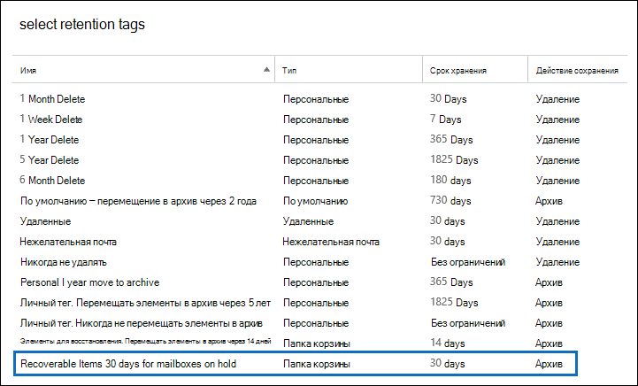
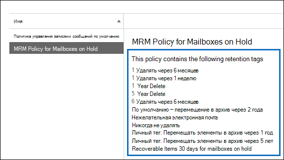

# <a name="increase-the-recoverable-items-quota-for-mailboxes-on-hold"></a>Увеличение квоты для папки "Элементы с возможностью восстановления" для почтовых ящиков на удержании

Политика хранения Exchange по умолчанию — политика *MRM* по умолчанию, которая автоматически применяется к новым почтовым ящикам Exchange Online содержит тег хранения с именем Recoverable Items 14 days move to archive. Этот тег хранения перемещает элементы из папки "Извлекаемые элементы" в основном почтовом ящике пользователя в папку "Извлекаемые элементы" в архивном почтовом ящике пользователя по истечении 14-дневного срока хранения элемента. Для этого необходимо включить архивный почтовый ящик пользователя. Если архивный почтовый ящик не включен, никаких действий не принимаются, что означает, что элементы в папке "Извлекаемые элементы" для почтового ящика на удержание не перемещаются в архивный почтовый ящик по истечении 14-дневного периода хранения. Так как из почтового ящика в удержании ничего не удаляется, не исключено превышение квоты хранения для папки "Извлекаемые элементы", особенно если архивный почтовый ящик пользователя не включен.

Чтобы уменьшить вероятность превышения этого ограничения, квота хранилища для папки "Извлекаемые элементы" автоматически увеличивается с 30 ГБ до 100 ГБ при размещении удержания в почтовом ящике в Exchange Online. Если архивный почтовый ящик включен, квота хранилища для папки "Элементы с возможностью восстановления" в нем также увеличивается с 30 ГБ до 100 ГБ. Если функция автоматического расширения архивирования в Exchange Online включена, квота хранения папки "Извлекаемые элементы" в архиве пользователя будет неограниченной.

  В приведенной ниже таблице указаны квоты хранилища для папки "Элементы с возможностью восстановления".

|**Расположение папки "Элементы с возможностью восстановления"**|**Почтовые ящики не на удержании**|**Почтовые ящики на удержании**|
|:-----|:-----|:-----|
|Основной почтовый ящик  <br/> |30 ГБ  <br/> |100 ГБ  <br/> |
|Архивный почтовый ящик<sup>\*</sup> <br/> |Без ограничений  <br/> |Без ограничений  <br/> |
|**Общая квота хранилищ для папки "Элементы с возможностью восстановления"** <br/> |Без ограничений  <br/> |Без ограничений  <br/> |

> [!NOTE]
> <sup>\*</sup>Начальная квота хранения для архивного почтового ящика — 100 ГБ для пользователей с Exchange Online (план 2) лицензией. Однако при включенном автоматическом расширении архивирования для почтовых ящиков на удержании квота хранения для архивного почтового ящика и папки "Извлекаемые элементы" увеличивается до 110 ГБ. При необходимости будет дополнительное пространство для хранения архива, что приводит к неограниченному объему хранения архива. Дополнительные сведения о автоматическом расширении архива см. в обзоре неограниченного архива в [Office 365.](unlimited-archiving.md)

Когда размер папки "Элементы с возможностью восстановления" в основном почтовом ящике на удержании будет приближаться к предельному значению квоты хранилища, можно выполнить следующие действия:

- **Включить архивный почтовый ящик и включить автоматическое расширение архива.** Вы можете включить неограниченный объем хранилища для папки "Извлекаемые элементы", просто включив почтовый ящик архива, а затем включив функцию автоматического расширения архивирования в Exchange Online. Это приводит к 110 ГБ для папки "Извлекаемые элементы" в основном почтовом ящике и неограниченному объему емкости хранилища для папки "Извлекаемые элементы" в архиве пользователя. Узнайте, как включить [архивные](enable-archive-mailboxes.md) почтовые ящики в Центре & безопасности и включить неограниченное [архивное архива](enable-unlimited-archiving.md)в Office 365 .

    > [!NOTE]
    > После запуска архива почтового ящика, близкого к превышению квоты хранения для папки "Извлекаемые элементы", может потребоваться запустить помощник управляемой папки, чтобы вручную вызвать помощника для обработки почтового ящика, чтобы просроченные элементы перемещались в папку "Извлекаемые элементы" в архивном почтовом ящике. Инструкции см. в разделе, описывающем [этап 4](#optional-step-4-run-the-managed-folder-assistant-to-apply-the-new-retention-settings). Обратите внимание на то, что другие элементы в почтовом ящике пользователя могут быть перемещены в новый архивный почтовый ящик. Подумайте, как рассказать пользователю, что это может произойти после того, как вы включаете почтовый ящик архива.

- **Создайте настраиваемую Exchange хранения для почтовых ящиков в удержании.** Помимо включения архивного почтового ящика и автоматического расширения архива для почтовых ящиков в удержании судебного разбирательства или In-Place Удержание, вы также можете создать настраиваемую политику хранения Exchange для почтовых ящиков на удержании. Это позволяет применять политику хранения к почтовым ящикам на удержании, которая отличается от политики MRM по умолчанию, применяемой к почтовым ящикам, которые не находятся на удержании, и позволяет применять теги хранения, предназначенные для почтовых ящиков на удержании. Это включает создание нового тега хранения для папки "Извлекаемые элементы".

В остальной части этой темы описываются пошаговая процедура создания настраиваемой политики хранения Exchange для почтовых ящиков на удержании.

[Этап 1. Создание настраиваемых тегов хранения для папки "Элементы с возможностью восстановления"](#step-1-create-a-custom-retention-tag-for-the-recoverable-items-folder)

[Шаг 2. Создание новой политики хранения Exchange для почтовых ящиков на удержании](#step-2-create-a-new-exchange-retention-policy-for-mailboxes-on-hold)

[Шаг 3. Применение новой политики Exchange хранения к почтовым ящикам в удержании](#step-3-apply-the-new-exchange-retention-policy-to-mailboxes-on-hold)

[Этап 4 (необязательный). Запуск помощника по работе с управляемыми папками для применения новых параметров хранения](#optional-step-4-run-the-managed-folder-assistant-to-apply-the-new-retention-settings)

## <a name="step-1-create-a-custom-retention-tag-for-the-recoverable-items-folder"></a>Этап 1. Создание настраиваемых тегов хранения для папки "Элементы с возможностью восстановления"

Первый этап — создание пользовательского тега хранения (также называемого тегом политики хранения, или RPT) для папки "Элементы с возможностью восстановления". Как пояснялось ранее, RPT перемещает элементы из папки "Элементы с возможностью восстановления" основного почтового ящика пользователя в такую же папку архивного почтового ящика пользователя. Чтобы создать RPT для папки "Извлекаемые элементы", необходимо использовать PowerShell. Вы не можете сделать этого в Центре администрирования Exchange (EAC).

1. [Подключитесь к Exchange Online с помощью удаленного сеанса PowerShell](/powershell/exchange/connect-to-exchange-online-powershell).

2. Выполните следующую команду, чтобы создать новый RPT для папки "Элементы с возможностью восстановления": 

    ```powershell
    New-RetentionPolicyTag -Name <Name of RPT> -Type RecoverableItems -AgeLimitForRetention <Number of days> -RetentionAction MoveToArchive
    ```

    Например, следующая команда создает RPT для папки "Восстанавливаемые элементы 30 дней для почтовых ящиков на удержании", срок хранения — 30 дней. Это значит, что по истечении 30 дней хранения элемента в папке "Элементы с возможностью восстановления" он будет перемещен в такую же папку архивного почтового ящика пользователя.

    ```powershell
    New-RetentionPolicyTag -Name "Recoverable Items 30 days for mailboxes on hold" -Type RecoverableItems -AgeLimitForRetention 30 -RetentionAction MoveToArchive
    ```

    > [!TIP]
    > Рекомендуется, чтобы период хранения (определенный параметром  _AgeLimitForRetention)_ для RPT восстанавливаемых элементов был таким же, как и период хранения удаленных элементов для почтовых ящиков, к которые будет применяться RPT. Это позволяет пользователю восстанавливать удаленные элементы в течение всего срока хранения, прежде чем они будут перемещены в архивный почтовый ящик. В предыдущем примере был задан срок хранения 30 дней на основании предположения, что период хранения удаленных элементов для почтового ящика составляет 30 дней. Почтовый Exchange Online настроен для сохранения удаленных элементов в течение 14 дней по умолчанию. Но этот период можно изменить, задав максимальное значение — 30 дней. Дополнительные сведения см. в статье Изменение периода хранения удаленных элементов для почтового [ящика в Exchange Online.](https://www.microsoft.com/?ref=go)

## <a name="step-2-create-a-new-exchange-retention-policy-for-mailboxes-on-hold"></a>Шаг 2. Создание новой политики хранения Exchange для почтовых ящиков на удержании

Следующий этап — создание новой политики хранения и добавление в нее тегов хранения, в том числе RPT элементов с возможностью восстановления, созданного на этапе 1. Эта новая политика будет применена к почтовым ящикам на удержании на следующем этапе. 

Прежде чем создавать новую политику хранения, определите дополнительные теги хранения, которые вы хотите добавить. Список тегов хранения, которые будут добавлены к политике управления записями сообщений по умолчанию, а также сведения о создании новых тегов хранения см. в статьях:

- [Политика хранения по умолчанию в Exchange Online](/exchange/security-and-compliance/messaging-records-management/default-retention-policy)

- [Папки по умолчанию, которые поддерживают теги политики хранения](/exchange/security-and-compliance/messaging-records-management/default-folders)

- Раздел "Создание тега хранения" в разделе [Создание политики хранения.](/exchange/security-and-compliance/messaging-records-management/create-a-retention-policy)

Вы можете использовать EAC или Exchange Online PowerShell для создания политики хранения.

### <a name="use-the-eac-to-create-a-retention-policy"></a>Создание политики хранения с помощью Центра администрирования Exchange

1. В EAC перейдите **к** политикам хранения соответствия требованиям, а затем нажмите \>  **кнопку Добавить значок**  .

2. В поле **Имя** на странице **Новая политика хранения** введите имя, описывающее назначение политики хранения, например **MRM Policy for Mailboxes on Hold** (Политика управления записями сообщений для почтовых ящиков на удержании). 

3. В **теги хранения** нажмите **добавить значок** Добавить  .

4. В списке тегов хранения выберите RPT элементов с возможностью восстановления, созданный на этапе 1, и нажмите кнопку **Добавить**.

    

5. Выберите дополнительные теги, которые необходимо добавить к политике хранения. Например, может потребоваться добавить теги, которые уже включены в политику управления записями сообщений по умолчанию.

6. Добавив все теги хранения, нажмите кнопку **ОК**.

7. Нажмите кнопку **Сохранить**, чтобы создать новую политику хранения.

    Обратите внимание, что теги хранения, связанные с политикой хранения, отображаются в области сведений.

    

### <a name="use-exchange-online-powershell-to-create-a-retention-policy"></a>Использование Exchange Online PowerShell для создания политики хранения

Чтобы создать политику хранения для почтовых ящиков на удержании, выполните приведенную ниже команду. 

```powershell
New-RetentionPolicy <Name of retention policy>  -RetentionPolicyTagLinks <list of retention tags>

```

Например, следующая команда создает политику хранения и связанные теги хранения, которые отображаются на предыдущей иллюстрации.

```powershell
New-RetentionPolicy "MRM Policy for Mailboxes on Hold"  -RetentionPolicyTagLinks "Recoverable Items 30 days for mailboxes on hold","1 Month Delete","1 Week Delete","1 Year Delete","5 Year Delete","6 Month Delete","Default 2 year move to archive","Junk Email","Never Delete","Personal 1 year move to archive","Personal 5 year move to archive"
```

## <a name="step-3-apply-the-new-exchange-retention-policy-to-mailboxes-on-hold"></a>Шаг 3. Применение новой политики Exchange хранения к почтовым ящикам в удержании

Последний этап — применение новой политики хранения, созданной на этапе 2, к почтовым ящикам на удержании в вашей организации. Вы можете использовать EAC или Exchange Online PowerShell для применения политики хранения к одному почтовому ящику или нескольким почтовым ящикам.

### <a name="use-the-eac-to-apply-the-new-retention-policy"></a>Применение новой политики хранения с помощью Центра администрирования Exchange

1. Перейдите **к почтовым**  >  **ящикам получателей**.

2. В представлении списка выберите почтовый ящик, к который необходимо применить политику хранения, и нажмите кнопку **Изменить значок Изменить**  .

3. На странице **Изменить почтовый ящик пользователя** выберите пункт **Функции почтового ящика**.

4. В разделе **Политика хранения** выберите политику хранения, созданную на этапе 2, и нажмите кнопку **Сохранить**.

С помощью Центра администрирования Exchange можно также применить политику хранения к нескольким почтовым ящикам.

1. Перейдите **к почтовым**  >  **ящикам получателей**.

2. В представлении списка воспользуйтесь клавишами SHIFT или CTRL, чтобы выбрать несколько почтовых ящиков.

3. В области сведений щелкните **Дополнительные параметры**.

4. В разделе **Политика хранения** щелкните **Обновить**.

5. На странице **Массовое назначение политики хранения** выберите политику хранения, созданную на этапе 2, и нажмите кнопку **Сохранить**. 

### <a name="use-exchange-online-powershell-to-apply-the-new-retention-policy"></a>Используйте Exchange Online PowerShell для применения новой политики хранения

Вы можете использовать Exchange Online PowerShell для применения новой политики хранения к одному почтовому ящику. Но реальная сила PowerShell в том, что с ее помощью можно быстро идентифицировать все почтовые ящики в организации, которые находятся на удержании судебного разбирательства или In-Place Hold, а затем применить новую политику хранения к всем почтовым ящикам, которые находятся на удержании в одной команде. Вот несколько примеров использования Exchange PowerShell для применения политики хранения к одному или нескольких почтовым ящикам. Во всех примерах применяется политика, созданная на этапе 2.

В этом примере новая политика хранения применяется к почтовому ящику пользователя Pilar Pinilla.

```powershell
Set-Mailbox "Pilar Pinilla" -RetentionPolicy "MRM Policy for Mailboxes on Hold"
```

В этом примере показано, как применить созданную политику хранения ко всем почтовым ящикам в организации, находящимся на хранении для судебного разбирательства.

```powershell
$LitigationHolds = Get-Mailbox -ResultSize unlimited | Where-Object {$_.LitigationHoldEnabled -eq 'True'}
```

```powershell
$LitigationHolds.DistinguishedName | Set-Mailbox -RetentionPolicy "MRM Policy for Mailboxes on Hold"
```

В этом примере показано, как применить созданную политику хранения ко всем почтовым ящикам в организации, находящимся на удержании на месте.

```powershell
$InPlaceHolds = Get-Mailbox -ResultSize unlimited | Where-Object {$_.InPlaceHolds -ne $null}
```

```powershell
$InPlaceHolds.DistinguishedName | Set-Mailbox -RetentionPolicy "MRM Policy for Mailboxes on Hold"
```

Чтобы проверить, применена ли новая политика хранения, используйте командлет **Get-Mailbox**.

Ниже показано несколько вариантов кода, позволяющих проверить, применили ли команды из предыдущих примеров политику "MRM Policy for Mailboxes on Hold" (Управление записями сообщений для почтовых ящиков на удержании) к почтовым ящикам, которые находятся на хранении для судебного разбирательства или на удержании на месте.

```powershell
Get-Mailbox "Pilar Pinilla" | Select RetentionPolicy
```

```powershell
Get-Mailbox -ResultSize unlimited | Where-Object {$_.LitigationHoldEnabled -eq 'True'} | FT DisplayName,RetentionPolicy -Auto
```

```powershell
Get-Mailbox -ResultSize unlimited | Where-Object {$_.InPlaceHolds -ne $null} | FT DisplayName,RetentionPolicy -Auto
```

## <a name="optional-step-4-run-the-managed-folder-assistant-to-apply-the-new-retention-settings"></a>Этап 4 (необязательный). Запуск помощника по работе с управляемыми папками для применения новых параметров хранения

После применения новой политики хранения Exchange к почтовым ящикам на удержание может занять до 7 дней Exchange Online для помощника управляемых папок для обработки этих почтовых ящиков с помощью параметров новой политики хранения. Вы можете не ожидать, пока будут обработаны ящики, к которым была применена новая политика хранения, а запустить помощника по работе с управляемыми папками вручную с помощью командлета **Start-ManagedFolderAssistant**.

Выполните приведенную ниже команду, чтобы запустить помощник по работе с управляемыми папками для почтового ящика пользователя Pilar Pinilla.

```powershell
Start-ManagedFolderAssistant "Pilar Pinilla"
```

Выполните приведенную ниже команду, чтобы запустить помощник по работе с управляемыми папками для всех почтовых ящиков на удержании.

```powershell
$MailboxesOnHold = Get-Mailbox -ResultSize unlimited | Where-Object {($_.InPlaceHolds -ne $null) -or ($_.LitigationHoldEnabled -eq "True")}
```

```powershell
$MailboxesOnHold.DistinguishedName | Start-ManagedFolderAssistant
```

## <a name="more-information"></a>Дополнительные сведения

- После включения архивного почтового ящика рекомендуем сообщить пользователю о том, что в архивный почтовый ящик могут переместиться не только элементы из папки "Элементы с возможностью восстановления", но и другие. Это потому, что политика MRM по умолчанию, назначенная для Exchange Online почтовых ящиков, содержит тег хранения (с именем Default 2 years move to archive), который перемещает элементы в архивный почтовый ящик через два года после даты доставки элемента в почтовый ящик или создания пользователем. Дополнительные сведения [см.](/exchange/security-and-compliance/messaging-records-management/default-retention-policy) в Exchange Online

- После включения архивного почтового ящика рекомендуем сообщить пользователю, что он может восстановить удаленные элементы благодаря папке "Элементы с возможностью восстановления" своего архивного почтового ящика. Они могут сделать это в Outlook, выбрав папку **Удаленные** элементы в архивном  почтовом ящике, а затем щелкнув восстановление удаленных элементов с сервера на вкладке **Главная.** Дополнительные сведения о восстановлении удаленных элементов см. в Outlook для [Windows.](https://go.microsoft.com/fwlink/p/?LinkId=624829)
