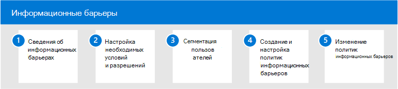

# Информационные барьеры в Microsoft 365

Microsoft 365 обеспечивает связь и совместную работу между группами и организациями и поддерживает способы ограничения связи и совместной работы между определенными группами пользователей при необходимости. Это может включать ситуации или сценарии, в которых необходимо ограничить общение и совместную работу между двумя группами, чтобы избежать конфликта интересов в организации. Это также может включать ситуации, когда для защиты внутренней информации необходимо ограничить общение и совместную работу между определенными людьми в организации.

Информационные барьеры поддерживаются в Microsoft Teams, SharePoint Online и OneDrive для бизнеса. Администратор соответствия требованиям или администратор информационных барьеров может определять политики, позволяющие или препятствуя общению между группами пользователей в Microsoft Teams. Политики информационного барьера можно использовать для таких ситуаций:

- Пользователь в группе трейдера дня не должен общаться или делиться файлами с маркетинговой группой.
- Финансы сотрудников, работающих с конфиденциальной информацией компании, не должны обмениваться файлами с определенными группами в их организации.
- Внутренняя группа с материалами секрета торговли не должна звонить или общаться в интернете с людьми в определенных группах в их организации
- Исследовательская группа должна звонить или общаться в интернете только с командой разработки продукта.

## Настройка информационных барьеров для Microsoft 365

Чтобы настроить информационные барьеры для организации, используйте следующие действия:

1. Сведения о [информационных барьерах](information-barriers.md) в Microsoft 365
2. Настройка [необходимых условий и разрешений](information-barriers-policies.md#prerequisites)
3. Сегмент [пользователей в организации](information-barriers-policies.md#part-1-segment-users)
4. Создание и настройка политик [информационного барьера](information-barriers-policies.md#part-2-define-information-barrier-policies)
5. Применение [политик информационного барьера](information-barriers-policies.md#part-3-apply-information-barrier-policies)

## Дополнительные сведения о информационных барьерах

- [Атрибуты для политик информационных барьеров](information-barriers-attributes.md)
- [Изменение или удаление политик информационного барьера](information-barriers-edit-segments-policies.md)