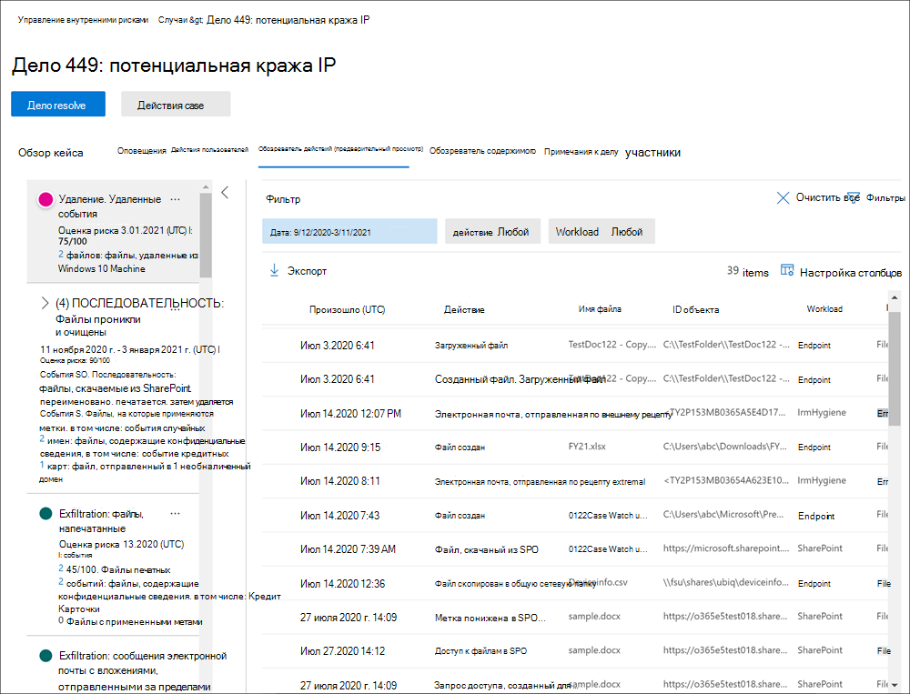

# Исследование действий по управлению рисками изнутри

Изучение рискованных действий пользователей является важным первым шагом к сведению к минимуму рисков, связанных с инсайдерской деятельностью для организации. Эти риски могут быть действиями, которые генерируют оповещения из инсайдерской политики управления рисками, или рисками от действий, которые обнаруживаются политиками, но не сразу создают оповещение об управлении рисками для пользователей. Вы можете исследовать эти типы действий с помощью отчетов о действиях пользователя **(предварительный просмотр)** или панели **мониторинга оповещения.**

## Отчеты о действиях пользователей (предварительный просмотр)

Отчеты о действиях пользователей позволяют проверять действия определенных пользователей в течение определенного периода времени, не назначая их временно или явно политике управления рисками. В большинстве сценариев управления рисками изнутри пользователи явно определяются в политиках, и у них могут быть оповещения о политике (в зависимости от событий запуска) и оценки риска, связанные с действиями. Но в некоторых сценариях может потребоваться изучить действия для пользователей, которые явно не определены в политике. Это могут быть пользователи, которые получили подсказки о пользователе и потенциально рискованных действиях, или пользователи, которые обычно не должны быть назначены для политики управления рисками изнутри.

После настройки индикаторов на странице управления рисками Параметры, пользовательская активность обнаруживается для рискованных действий, связанных с выбранными индикаторами.  Вам не нужно настраивать политику для отчетов о действиях пользователей, чтобы обнаруживать и сообщать о рискованных действиях пользователей в вашей организации. Действия, включенные в отчеты о действиях пользователей, не требуют запуска событий для отображения действий. Эта конфигурация означает, что все обнаруженные действия для пользователя доступны для проверки независимо от того, имеется ли событие-триггер или создается оповещение. Отчеты создаются на основе каждого пользователя и могут включать все действия в течение настраиваемого 90-дневного периода. Несколько отчетов для одного пользователя не поддерживаются.

После изучения действий для пользователя следователи могут отклонять отдельные действия как доброкачественные, делиться или отправлять ссылку на отчет с другими следователями или назначать пользователя временно или явно в политику управления рисками. Чтобы просмотреть страницу отчетов о действиях пользователя, пользователи должны быть назначены в группу "Эксперты по управлению рисками" *(Insider Risk Management* **Investigators).**  

Вы можете начать работу, выбрав **раздел Управление** отчетами в разделе **Исследование** действий пользователей на странице Обзор управления **рисками.** Чтобы просмотреть действия для пользователя, сначала выберите **Создать** отчет о действиях пользователя и завершить следующие поля в области **отчетов** о действиях новых пользователей:

- **Пользователь.** Поиск пользователя по имени или адресу электронной почты
- **Дата начала.** Для выбора даты начала действий пользователя используйте управление календарем.
- **Дата окончания.** Для выбора даты окончания действий пользователя используйте управление календарем. Выбранная дата должна быть больше, чем через два дня после выбранной даты начала и не более 90 дней с выбранной даты начала.
Новые отчеты обычно принимаются до 10 часов, прежде чем они будут готовы к проверке. Когда отчет будет готов, вы  увидите отчет, готовый в столбце **Состояние** на странице отчета о действии пользователя. Выберите пользователя, чтобы просмотреть подробный отчет:

Отчет **о действии пользователя** для выбранного пользователя содержит вкладки User **activity** и **Activity Explorer:**

- **Действия пользователей.** Используйте это представление диаграммы для изучения действий и просмотра потенциальных действий, которые происходят в последовательности. Эта вкладка структурирована для быстрого рассмотрения дела, включая историческую шкалу всех действий, сведения о деятельности, текущую оценку риска для пользователя в данном случае, последовательность событий риска и элементы управления фильтрацией, чтобы помочь в расследовании.
- **Обозреватель действий.** Вкладка **Обозреватель действий** предоставляет следователям по рискам комплексный аналитический инструмент, который предоставляет подробные сведения о действиях. С помощью обозревателя активности рецензенты могут быстро просмотреть хронологию обнаруженной рискованной активности и определить и фильтровать все действия риска, связанные с оповещениями. Дополнительные информацию об использовании обозревателя действий см. в разделе *Обозреватель* действий в этой статье.

## Панель мониторинга оповещений

Оповещения управления инсайдерскими рисками автоматически создаются на основе индикаторов риска, определенных в политиках управления инсайдерскими рисками. Эти оповещения предоставляют аналитикам и расследователям общую картину текущего состояния рисков и позволяют организации оценивать выявленные риски и принимать меры. По умолчанию политики генерируют определенное количество оповещений о низкой, средней и высокой степени тяжести, но вы можете увеличить или уменьшить объем оповещений в соответствии с вашими потребностями.  Кроме того, можно настроить  пороговое значение оповещения для индикаторов политики при создании новой политики с помощью мастера политики.

Ознакомьтесь с [видеомагой](https://www.youtube.com/watch?v=KgmpxBLJLPI) "Управление рисками, связанными с инсайдерской деятельностью", чтобы узнать, как оповещений предоставляют сведения, контекст и связанное содержимое для рискованных действий и как сделать процесс расследования более эффективным.

Панель оповещений о рисках для инсайдеров позволяет просматривать и действовать в отношении оповещений, созданных политиками риска инсайдеров.  Каждый виджет отчета отображает сведения за последние 30 дней.

- **Общее число оповещений,** которые требуют проверки: общее число оповещений, необходимых для проверки и проверки, включая разбивку по степени серьезности оповещения.
- Открытие оповещений за **последние 30** дней. Общее число оповещений, созданных в матчах политик за последние 30 дней, отсортировали по высоким, средним и низким уровням серьезности оповещения.
- **Среднее время для устранения** оповещений: сводка полезной статистики оповещений:
  - Среднее время закрытия оповещений высокого уровня серьезности в часах, днях или месяцах.
  - Среднее время закрытия оповещений среднего уровня серьезности в часах, днях или месяцах.
  - Среднее время закрытия оповещений низкого уровня серьезности в часах, днях или месяцах.

> [!NOTE]
> Для защиты и оптимизации системы исследования и анализа рисков в системе управления внутренними рисками используется встроенный механизм регулирования оповещений. Он защищает от проблем, которые могут привести к избыточным оповещениям политик, например из-за неправильной настройки соединителей данных или политик DLP. В результате может возникать задержка при отображении новых оповещений для пользователя.

## Состояние и серьезность оповещений

Можно переделыть оповещения в один из следующих статусов:

- **Подтверждено:** оповещение подтверждено и назначено новому или существующему делу.
- **Отклонено:** оповещение, отклонено как доброкачественная в процессе триажа.
- **Обзор потребностей.** Новое оповещение, в котором еще не приняты действия по триажу.
- **Разрешено.** Оповещение, которое является частью закрытого и разрешенного дела.

Оценки риска оповещений автоматически вычисляются из нескольких показателей активности риска. Эти индикаторы включают тип активности риска, количество и частоту возникновения активности, историю активности риска пользователей и добавление рисков активности, которые могут повысить серьезность деятельности. На основе оценки риска оповещений осуществляется программное назначение уровня серьезности риска для каждого оповещения, и этот механизм не настраивается. Если оповещения остаются невыявляемы, а действия риска продолжают накапливаться в оповещении, уровень серьезности риска может увеличиться. Аналитики рисков и исследователи могут использовать серьезность риска оповещения, чтобы помочь в проверке оповещений в соответствии с политиками и стандартами вашей организации.

Уровень серьезности риска оповещений:

- **Высокая серьезность.** Действия и индикаторы оповещения представляют значительный риск. Связанные с этим действия риска являются серьезными, повторяющимися и сильно связаны с другими существенными факторами риска.
- **Средняя серьезность.** Действия и индикаторы оповещения представляют умеренный риск. Соответствующие небезопасные действия являются умеренными и частыми и некоторым образом связаны с другими значимыми факторами риска.
- **Низкая серьезность.** Действия и индикаторы оповещения представляют незначительный риск. Связанные действия риска являются незначительными, более редкими и не связаны с другими существенными факторами риска.

## Фильтрация оповещений на панели оповещений

В зависимости от количества и типа активных политик управления внутренними рисками в организации просмотреть большую очередь оповещений может быть непросто. Использование фильтров оповещений может помочь аналитикам и следователям сортировать оповещения по нескольким атрибутам. Для фильтрации оповещений на панели **оповещений** выберите **управление фильтром.** Можно фильтровать оповещения по одному или более атрибутам:

- **Состояние.** Выберите одно или несколько значений состояния для фильтрации списка оповещений. Доступные параметры: *Подтверждено*, *Закрыто*, *Требуется проверка* и *Устранено*.
- **Серьезность.** Выберите один или несколько уровней серьезности риска для фильтрации списка оповещений. Возможные варианты: *Высокий*, *Средний* и *Низкий*.
- **Обнаружено время:** Выберите даты начала и окончания для создания оповещений.
- **Политика.** Выберите одну или несколько политик для фильтрации оповещений, созданных выбранными политиками.

## Оповещение о поиске на панели мониторинга оповещения

Чтобы найти в названии оповещения определенное слово, выберите поле **поиска** и введите соответствующий запрос. В результатах поиска отображаются все оповещение политик, содержащие искомое слово.

## Оповещений по триажу

Чтобы выполнить список оповещений о рисках, выполните следующие действия:

1. В [Центр соответствия требованиям Microsoft 365](https://compliance.microsoft.com)перейдите к **управлению** рисками insider и выберите вкладку **Alerts.**
2. На панели **оповещений** выберите оповещение, необходимое для переделки.
3. На области **детализации Оповещений** можно просмотреть следующие вкладки и просмотреть оповещение:
    - **Сводка.** Эта вкладка содержит общую информацию о оповещении и позволяет подтвердить оповещение и создать новый случай или позволяет отклонять предупреждение. Он включает текущее состояние для оповещения и уровень серьезности риска оповещения, перечисленные как *High,* *Medium* или *Low*. Уровень серьезности может со временем увеличиваться или уменьшаться, если оповещение не будет триагировали.
        - **Что произошло (предварительный просмотр)**: отображает три основных действия и совпадения политик в период оценки активности, включая тип нарушения, связанного с действием, и количество инцидентов.
        - **Сведения о** пользователях. Отображает общие сведения о пользователе, назначенного оповещению. Если включена анонимизация, имя пользователя, адрес электронной почты, псевдоним и поля организации анонимизируются.
        - **Сведения об** оповещении. Включает время с момента с момента сгенерирований оповещений, перечислены политики, которые создали оповещение, и случай, созданный из оповещения. Для новых оповещений поле **Case** отображает None.
        - **Содержимое, обнаруженное (предварительный просмотр).** Включает содержимое, связанное с действиями риска для оповещения, и суммирует события действий по ключевым областям. Выбор ссылки действий открывает проводник действий и отображает дополнительные сведения о действии.
    - **Действие пользователя.** На этой вкладке отображается история действий пользователя, связанного с оповещением. Эта история включает другие оповещения и действия, связанные с индикаторами риска, определенными в шаблоне, назначенного политике для этого оповещения. Эта история позволяет аналитикам рисков и следователям учитывать любое рискованное поведение сотрудника в прошлом в процессе проверки.
    - **Действия:** для каждого оповещения доступны следующие действия:
        - **Открыть расширенное представление.** Откроет панель **мониторинга обозревателя активности.**
        - **Подтверждение и создание случая.** Используйте это действие для подтверждения и создания нового случая для всех оповещений, связанных с пользователем. Это действие автоматически меняет состояние оповещений на *Подтвержденный*.
        - **Предупреждение об увольнении.** Используйте это действие, чтобы отклонять оповещение. Это действие меняет состояние оповещений на *Resolved*.

## Обозреватель действий (предварительный просмотр)

> [!NOTE]
> Обозреватель действий доступен в области управления оповещениями для пользователей с запусками событий после того, как эта функция будет доступна в организации.

Обозреватель действий предоставляет следователям и аналитикам по рискам комплексный аналитический инструмент, который предоставляет подробные сведения о оповещениях. С помощью обозревателя активности рецензенты могут быстро просмотреть хронологию обнаруженной рискованной активности и определить и фильтровать все действия риска, связанные с оповещениями. Для фильтрации оповещений в проводнике активности выберите контроль фильтра. Вы можете фильтровать оповещения по одному или более атрибутам, указанным в области сведений для оповещения. Обозреватель действий также поддерживает настраиваемые столбцы, чтобы помочь следователям и аналитикам сосредоточить панель мониторинга на наиболее важных для них сведениях.

Чтобы использовать **проводник действий,** выполните следующие действия:

1. В Центр соответствия требованиям Microsoft 365 перейдите к **управлению** рисками insider и выберите вкладку **Alerts.**
2. На панели **оповещений** выберите оповещение, необходимое для переделки.
3. На области **детализации Оповещений** выберите **открыть расширенное представление**.
4. На странице выбранного оповещения выберите вкладку **Обозреватель действий.**

При просмотре действий в проводнике действий исследователи и аналитики могут выбрать определенное действие и открыть области сведений о действиях. В области отображаются подробные сведения о действиях, которые следователи и аналитики могут использовать во время процесса проверки оповещений. Подробные сведения могут предоставить контекст оповещения и помочь определить полный объем действий по риску, которые вызвали оповещение.

## Создание случая оповещения

По мере проверки и проверки оповещений можно создать новый случай для дальнейшего изучения активности риска. Чтобы создать случай оповещения, выполните следующие действия:

1. В [Центр соответствия требованиям Microsoft 365](https://compliance.microsoft.com)перейдите к **управлению** рисками insider и выберите вкладку **Alerts.**
2. На панели **оповещений** выберите оповещение, необходимое для подтверждения и создания нового случая.
3. На области **сведений оповещений** выберите   >  **Действия, подтверждающие** оповещения, & создать случай .
4. В **диалоговом** оклике Подтвердите оповещение и создайте диалоговую ситуацию с инсайдерской угрозой, введите имя дела, выберите пользователей для добавления в качестве участников и добавьте комментарии в соответствии с применимыми. В качестве заметки к делу автоматически добавляются комментарии.
5. Выберите **Создание случая** для создания нового случая или выберите **Отмена,** чтобы закрыть диалоговое окно без создания дела.

После создания дела следователи и аналитики могут управлять и действовать по этому делу. Дополнительные сведения см. в статье [Insider risk management case.](insider-risk-management-cases.md)
