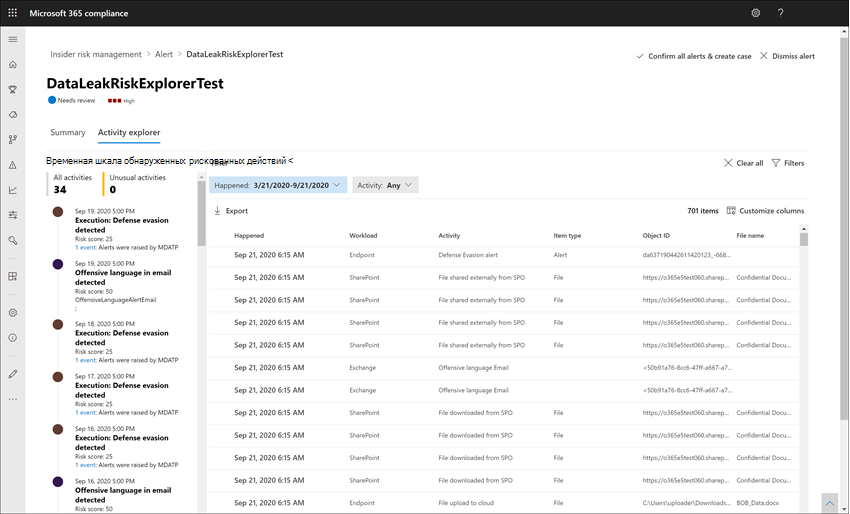
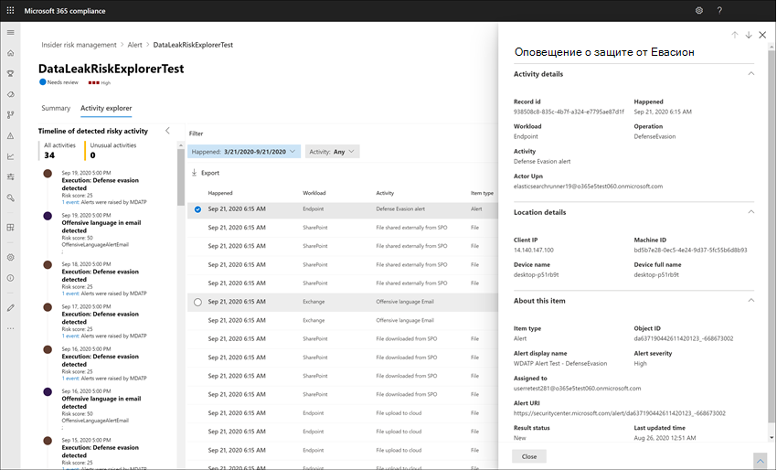

# Оповещения об управлении рисками для участников

Оповещения об управлении рисками для участников программы оценки автоматически создаются индикаторами риска, определенными в политиках управления рисками для участников программы. Эти оповещения предоставляют аналитикам и обучению соответствия требованиям к текущему состоянию риска и позволяют Организации проанализировать и принять меры по обнаруженным угрозам. По умолчанию политики создают определенный объем уведомлений о низком, среднем и высоком уровне серьезности, но вы можете [увеличить или уменьшить объем оповещения](insider-risk-management-settings.md#alert-volume) в соответствии с вашими потребностями. Кроме того, вы можете настроить [пороговое значение оповещений для индикаторов политики](insider-risk-management-settings.md#indicator-level-settings-preview) при создании новой политики с помощью мастера политик.

## Панель мониторинга оповещений

**Панель мониторинга оповещений о** рисках для участников программы предварительной оценки позволяет просматривать оповещения, созданные политиками оценки риска, и выполнять действия над ними. Каждый графический элемент отчета отображает сведения за последние 30 дней.

- **Оповещения для проверки**: отображается общее число оповещений, требующих рассмотрения и рассмотрения, включая разбивку по уровню серьезности оповещений.
- **Открыть оповещения за последние 30 дней**: общее количество оповещений, созданных политикой за последние 30 дней, отсортированных по высококачественному, среднему и низкому уровню серьезности оповещений.
- **Среднее время разрешения оповещений**: сводка по полезной статистике оповещений:
    - Среднее время разрешения оповещений о высокой серьезности, указанных в часах, днях или месяцах.
    - Среднее время, в течение которого отменяются оповещения среднего уровня серьезности, которые перечислены в часах, днях или месяцах.
    - Среднее время разрешения оповещений с низкой степенью серьезности, указанных в часах, днях или месяцах.

>[!NOTE]
>Для обеспечения безопасности и оптимизации рисков и анализа рисков в управлении рисками для участников исследования используется встроенное регулирование оповещений. Это регулирование защищает от проблем, которые могут привести к перегрузке предупреждений политики, таких как неправильно настроенные соединители данных или политики защиты от потери данных. В результате может возникнуть задержка при отображении новых оповещений для пользователя.

## Состояние оповещения и степень серьезности

Вы можете рассмотреть оповещения в одном из следующих состояний:

- **Подтверждено**: оповещение подтверждено и назначено новому или существующему случаю.
- **Закрыто**: оповещение было закрыто как неблагоприятное в процессе рассмотрения.
- **Требуется проверка**: новое оповещение, в котором действия по рассмотрению еще не выполнены.
- **Разрешено**: оповещение, которое является частью закрытого и разрешенного обращения.

Показатели риска для оповещений автоматически рассчитываются по нескольким индикаторам действий по риску. Эти индикаторы включают тип действия риска, число и частоту вхождения действия, историю действий пользователя о рисках и Добавление рисков для действий, которые могут увеличить серьезность деятельности. В показателе риска для оповещений задается программное назначение уровня серьезности риска для каждого оповещения и не может быть изменено. Если оповещения остаются нерассмотренными, а действия по рискам продолжают начисляться на оповещение, степень серьезности риска может увеличиться. Аналитики и изучает риски могут использовать серьезность риска для оповещений в соответствии с политиками и стандартами риска в Организации.

Уровни серьезности рисков оповещений:

- **Высокая степень серьезности**: действия и индикаторы для оповещения создают важный риск. Связанные с рисками действия — это серьезные, повторяющиеся и соотношения, которые сильно отличаются от других существенных факторов риска.
- **Средняя серьезность**: действия и индикаторы для оповещения создают умеренный риск. Связанные с рисками действия являются умеренными, частыми и имеют некоторую корреляцию от других факторов риска.
- **Низкую серьезность**: действия и индикаторы для оповещения представляют собой незначительный риск. Связанные с рисками действия являются незначительными, более редкими и не связаны с другими существенными факторами риска.

## Фильтрация оповещений на панели мониторинга оповещений

В зависимости от числа и типа активных политик управления рисками для оценки в Организации, просмотр большой очереди оповещений может быть непростым. Использование фильтров оповещений помогает аналитикам и исследованиям сортировать оповещения по нескольким атрибутам. Чтобы отфильтровать оповещения на **панели мониторинга оповещения**, выберите элемент управления **фильтра** . Вы можете отфильтровать предупреждения по одному или нескольким атрибутам:

- **Состояние**: выберите одно или несколько значений состояния, чтобы отфильтровать список оповещений. Параметры *подтверждены* *, отменяются,* *требуют проверки*и *разрешаются*.
- **Severity**: выберите один или несколько уровней серьезности угроз оповещений, чтобы отфильтровать список оповещений. Возможные значения: *Высокая*, *Средняя*и *Минимальная*.
- **Время обнаружения**: выберите начальную и конечную даты создания оповещения.
- **Политика**: выберите одну или несколько политик, чтобы отфильтровать оповещения, созданные выбранными политиками.

## Оповещения поиска на панели мониторинга оповещений

Чтобы выполнить поиск по имени оповещения для определенного слова, выберите элемент управления **поиском** и введите слово для поиска. В результатах поиска отображается любое оповещение о политике, содержащее слово, определенное в поиске.

## Оповещения о рассмотрении

Чтобы прорассматривать оповещение о риске для участников программы предварительной оценки, выполните указанные ниже действия.

1. В [центре соответствия требованиям Microsoft 365](https://compliance.microsoft.com)перейдите к разделу **Управление рисками для оценки** и перейдите на вкладку **оповещения** .
2. На **панели мониторинга оповещения**выберите оповещение, которое нужно рассмотреть.
3. В **области сведений оповещения**можно просмотреть следующие вкладки и рассмотреть предупреждение:
    - **Сводка**. Эта вкладка содержит общие сведения об оповещении и позволяет подтвердить оповещение и создать новое обращение, а также позволяет отклонить оповещение. Он включает в себя текущее состояние предупреждения и уровень серьезности риска для оповещений, в том числе *высокий*, *средний*или *маленький*. Уровень серьезности может увеличиваться или уменьшаться со временем, если оповещение не рассмотрено.
        - **Что случилось**: отображает три основных действия риска и соответствия политике во время периода оценки активности, включая тип нарушения, связанного с действием.
        - **Сведения о пользователе**: отображает общие сведения о пользователях, назначенных оповещению. Если анонимность включена, поля имени пользователя, адреса электронной почты, псевдонима и организации являются анонимными.
        - **Сведения об оповещении**: включает время, прошедшее с момента создания оповещения, перечисляются политики, созданные оповещением, и указывается регистр, созданный в оповещении. Для новых оповещений в поле **case** отображается значение нет.
        - **Обнаружено содержимое**: включает контент, связанный с действиями риска для оповещения, и суммирует события активности по ключевым областям. Выбор ссылки активности открывает обозреватель действий и отображает дополнительные сведения о действии.
    - **Действия пользователя**: на этой вкладке отображается журнал действий для пользователя, связанного с оповещением. Этот журнал включает другие оповещения и действия, связанные с индикаторами риска, определенными в шаблоне, назначенном политике для этого оповещения. Этот журнал позволяет аналитикам и обучениям проанализировать прошедшее опасное поведение сотрудника в рамках процесса рассмотрения.
    - **Действия**: для каждого оповещения доступны следующие действия:
        - **Открыть расширенное представление**: открывает панель мониторинга " **Обозреватель действий** ".
        - **Подтверждение и создание дела**: Используйте это действие, чтобы подтвердить и создать новое обращение для всех оповещений, связанных с пользователем. Это действие автоматически изменяет состояние оповещения на " *подтверждено*".
        - **Отклонить оповещение**: Используйте это действие для закрытия оповещения. Это действие изменяет состояние оповещения на " *разрешено*".

## Обозреватель действий (Предварительная версия)

>[!NOTE]
>Обозреватель активности доступен в области управления оповещениями для пользователей, запускающих события после того, как эта функция доступна в Организации.

Обозреватель действий предоставляет средства для исследования и аналитики риска с помощью комплексного аналитического средства, предоставляющего подробные сведения об оповещениях. С помощью обозревателя действий рецензенты могут быстро просмотреть временную шкалу обнаруженных рискованных действий, а также определить и отфильтровать все действия, связанные с оповещениями. Чтобы отфильтровать оповещения в обозревателе действий, выберите элемент управления фильтра. Вы можете отфильтровать предупреждения по одному или нескольким атрибутам, указанным в области сведений для оповещения. Кроме того, обозреватель активности поддерживает настраиваемые столбцы, которые помогают изучению и аналитикам сосредоточиться на панели мониторинга о наиболее важных для них сведениях.

Чтобы использовать **Обозреватель действий**, выполните следующие действия:

1. В центре соответствия требованиям Microsoft 365 перейдите к разделу **Управление рисками для оценки** и перейдите на вкладку **оповещения** .
2. На **панели мониторинга оповещения**выберите оповещение, которое нужно рассмотреть.
3. В **области сведений оповещения**установите флажок **Открыть расширенное представление**.
4. На странице с выбранным оповещением выберите вкладку **Обозреватель действий** .

При просмотре действий в обозревателе действий, "исследование" и аналитики могут выбрать определенное действие и открыть область сведений об активности. В области отображаются подробные сведения о действиях, которые могут использовать исследования и аналитики во время процесса рассмотрения оповещения. Подробные сведения могут предоставить контекст для оповещения и помощь с определением полной области действия риска, вызвавшего оповещение.

## Создание обращения для оповещения

По мере рассмотрения и рассмотрения оповещения можно создать новое обращение для дальнейшего анализа действия риска. Чтобы создать обращение для оповещения, выполните следующие действия:

1. В [центре соответствия требованиям Microsoft 365](https://compliance.microsoft.com)перейдите к разделу **Управление рисками для оценки** и перейдите на вкладку **оповещения** .
2. На **панели мониторинга оповещения**выберите оповещение, которое требуется подтвердить, и создайте для него новое обращение.
3. В **области сведений оповещения**выберите **действия**  >  **подтвердить оповещения & создать обращение**.
4. В диалоговом окне " **Подтверждение оповещения и создание инцидента оценки риска** " введите имя для обращения, выберите пункт Пользователи для добавления в качестве авторов и добавьте комментарии в качестве соответствующих. Комментарии автоматически добавляются к регистру в качестве заметок о случае.
5. Выберите **создать обращение** , чтобы создать новое обращение, или кнопку **Отмена** , чтобы закрыть диалоговое окно без создания дела.

После создания нового дела, исследования и аналитики могут управлять обращением и работать с ним. Более подробную информацию можно найти в статье обращение к статье об [управлении рисками для участников](insider-risk-management-cases.md) .
