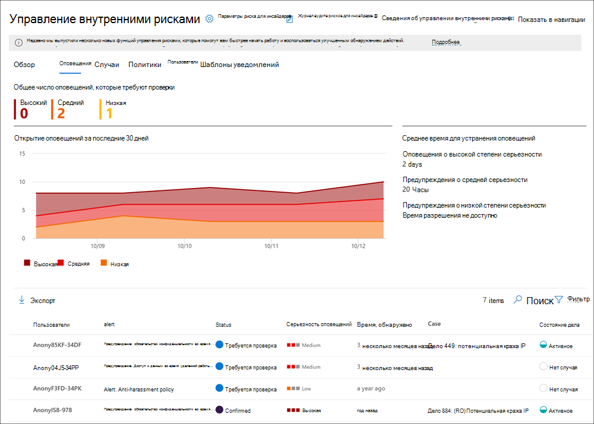
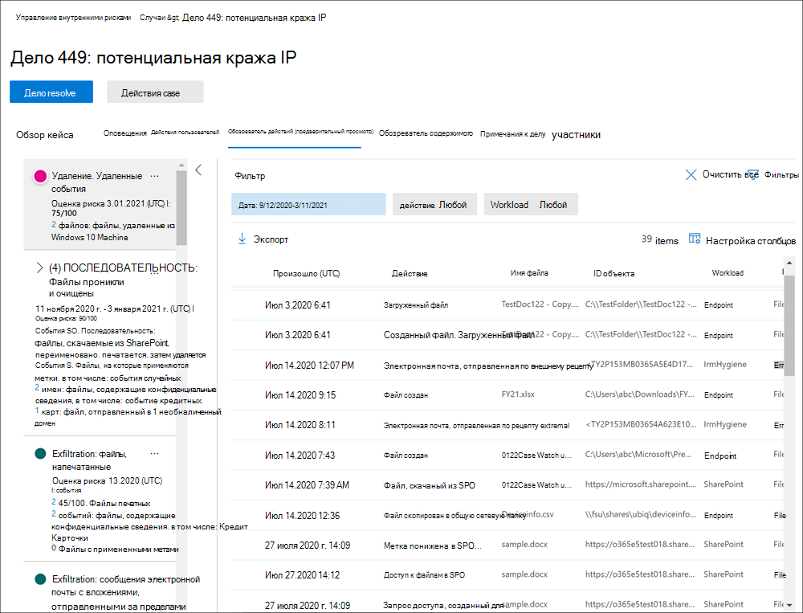
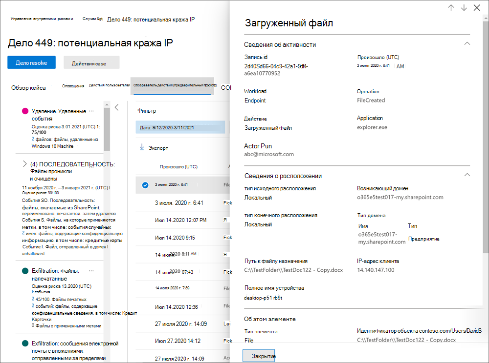

# Оповещений об управлении рисками изнутриInsider risk management alerts

Предупреждения об управлении рисками изнутри автоматически генерируются индикаторами риска, определенными в политиках управления рисками.Insider risk management alerts are automatically generated by risk indicators defined in insider risk management policies. Эти оповещений дают аналитикам соответствия требованиям и следователям всеохвативное представление текущего состояния риска и позволяют организации просматривать и принимать меры для обнаружения рисков.These alerts give compliance analysts and investigators an all-up view of the current risk status and allow your organization to triage and take actions for discovered risks. По умолчанию политики генерируют определенное количество оповещений о низкой, средней и высокой степени тяжести, но вы можете увеличить или уменьшить объем оповещений в соответствии с вашими потребностями. By default, policies generate a certain amount of low, medium, and high severity alerts, but you can [increase or decrease the alert volume](insider-risk-management-settings.md#alert-volume) to suit your needs. Кроме того, можно настроить  пороговое значение оповещения для индикаторов политики при создании новой политики с помощью мастера политики.Additionally, you can configure the [alert threshold for policy indicators](insider-risk-management-settings.md#indicator-level-settings-preview) when creating a new policy with the policy wizard.

## Панель мониторинга оповещенийAlert dashboard

Панель оповещений о рисках для инсайдеров позволяет просматривать и действовать в отношении оповещений, созданных политиками риска инсайдеров. The insider risk **Alert dashboard** allows you to view and act on alerts generated by insider risk policies. Каждый виджет отчета отображает сведения за последние 30 дней.Each report widget displays information for last 30 days.

- **Общее число оповещений,** которые требуют проверки: общее число оповещений, необходимых для проверки и проверки, включая разбивку по степени серьезности оповещения.**Total alerts that need review**: The total number of alerts needing review and triage are listed, including a breakdown by alert severity.
- Открытие оповещений за **последние 30** дней. Общее число оповещений, созданных в матчах политик за последние 30 дней, отсортировали по высоким, средним и низким уровням серьезности оповещения.**Open alerts over past 30 days**: The total number of alerts created by policy matches over the last 30 days, sorted by high, medium, and low alert severity levels.
- **Среднее время для устранения** оповещений: сводка полезной статистики оповещений:**Average time to resolve alerts**: A summary of useful alert statistics:
    - Среднее время для устранения предупреждений высокой степени тяжести, перечисленных в часах, днях или месяцах.Average time to resolve high severity alerts, listed in hours, days, or months.
    - Среднее время для устранения предупреждений средней тяжести, указанных в часах, днях или месяцах.Average time to resolve medium severity alerts, listed in hours, days, or months.
    - Среднее время для устранения предупреждений низкой степени тяжести, перечисленных в часах, днях или месяцах.Average time to resolve low severity alerts, listed in hours, days, or months.

>[!NOTE]
>Управление рисками, использующее встроенное регулирование оповещений, помогает защитить и оптимизировать процесс расследования и анализа рисков.Insider risk management uses built-in alert throttling to help protect and optimize your risk investigation and review experience. Это регулирование предохраняет от проблем, которые могут привести к перегрузке оповещений политик, таких как неправильно сконфигуративные соединители данных или политики DLP.This throttling guards against issues that might result in an overload of policy alerts, such as misconfigured data connectors or DLP policies. В результате может возникнуть задержка с отображением новых оповещений для пользователя.As a result, there might be a delay in displaying new alerts for a user.

## Состояние оповещений и серьезностьAlert status and severity

Можно переделыть оповещения в один из следующих статусов:You can triage alerts into one of the following statuses:

- **Подтверждено:** оповещение подтверждено и назначено новому или существующему делу.**Confirmed**: An alert confirmed and assigned to a new or existing case.
- **Отклонено:** оповещение, отклонено как доброкачественная в процессе триажа.**Dismissed**: An alert dismissed as benign in the triage process.
- **Обзор потребностей.** Новое оповещение, в котором еще не приняты действия по триажу.**Needs review**: A new alert where triage actions have not yet been taken.
- **Разрешено.** Оповещение, которое является частью закрытого и разрешенного дела.**Resolved**: An alert that is part of a closed and resolved case.

Оценки риска оповещений автоматически вычисляются из нескольких показателей активности риска.Alert risk scores are automatically calculated from several risk activity indicators. Эти индикаторы включают тип активности риска, количество и частоту возникновения активности, историю активности риска пользователей и добавление рисков активности, которые могут повысить серьезность деятельности.These indicators include the type of risk activity, the number and frequency of the activity occurrence, the history of user risk activity, and the addition of activity risks that may boost the seriousness of the activity. Оценка риска оповещений диски программным назначением уровня серьезности риска для каждого оповещения и не может быть настроена.The alert risk score drives the programmatic assignment of a risk severity level for each alert and cannot be customized. Если оповещения остаются невыявляемы, а действия риска продолжают накапливаться в оповещении, уровень серьезности риска может увеличиться.If alerts remain untriaged and risk activities continue to accrue to the alert, the risk severity level can increase. Аналитики рисков и исследователи могут использовать серьезность риска оповещения, чтобы помочь в проверке оповещений в соответствии с политиками и стандартами вашей организации.Risk analysts and investigators can use the alert risk severity to help triage alerts in accordance with your organization's risk policies and standards.

Уровень серьезности риска оповещений:Alert risk severity levels are:

- **Высокая серьезность.** Действия и индикаторы оповещения представляют значительный риск.**High severity**: The activities and indicators for the alert pose significant risk. Связанные с этим действия риска являются серьезными, повторяющимися и сильно связаны с другими существенными факторами риска.The associated risk activities are serious, repetitive, and corelate strongly to other significant risk factors.
- **Средняя серьезность.** Действия и индикаторы оповещения представляют умеренный риск.**Medium severity**: The activities and indicators for the alert pose a moderate risk. Связанные с этим действия риска являются умеренными, частыми и имеют некоторую корреляцию с другими факторами риска.The associated risk activities are moderate, frequent, and have some correlation to other risk factors.
- **Низкая серьезность.** Действия и индикаторы оповещения представляют незначительный риск.**Low severity**: The activities and indicators for the alert pose a minor risk. Связанные действия риска являются незначительными, более редкими и не связаны с другими существенными факторами риска.The associated risk activities are minor, more infrequent, and do not corelate to other significant risk factors.

## Фильтрация оповещений на панели оповещенийFilter alerts on the Alert dashboard

В зависимости от количества и типа активных политик управления рисками для инсайдеров в вашей организации может быть сложно рассмотреть большую очередь оповещений.Depending on the number and type of active insider risk management policies in your organization, reviewing a large queue of alerts can be challenging. Использование фильтров оповещений может помочь аналитикам и следователям сортировать оповещения по нескольким атрибутам.Using alert filters can help analysts and investigators sort alerts by several attributes. Для фильтрации оповещений на панели **оповещений** выберите **управление фильтром.**To filter alerts on the **Alerts dashboard**, select the **Filter** control. Можно фильтровать оповещения по одному или более атрибутам:You can filter alerts by one or more attributes:

- **Состояние.** Выберите одно или несколько значений состояния для фильтрации списка оповещений.**Status**: Select one or more status values to filter the alert list. Параметры *подтверждены,* *отклонены,* *необходимо просмотреть* и *разрешить*.The options are *Confirmed*, *Dismissed*, *Needs review*, and *Resolved*.
- **Серьезность.** Выберите один или несколько уровней серьезности риска для фильтрации списка оповещений.**Severity**: Select one or more alert risk severity levels to filter the alert list. Параметры : *High,* *Medium* и *Low*.The options are *High*, *Medium*, and *Low*.
- **Обнаружено время:** Выберите даты начала и окончания для создания оповещений.**Time detected**: Select the start and end dates for when the alert was created.
- **Политика.** Выберите одну или несколько политик для фильтрации оповещений, созданных выбранными политиками.**Policy**: Select one or more policies to filter the alerts generated by the selected policies.

## Оповещение о поиске на панели мониторинга оповещенияSearch alerts on the Alert dashboard

Чтобы найти имя оповещения для определенного слова, выберите управление **поиском** и введите слово для поиска.To search the alert name for a specific word, select the **Search** control and type the word to search. В результатах поиска отображается любое оповещение политики, содержащее слово, определенное в поиске.The search results display any policy alert containing the word defined in the search.

## Оповещений по триажуTriage alerts

Чтобы выполнить список оповещений о рисках, выполните следующие действия:To triage an insider risk alert, complete the following steps:

1. В центре [соответствия требованиям Microsoft 365](https://compliance.microsoft.com)перейдите к управлению рисками **insider** и выберите вкладку **Alerts.**In the [Microsoft 365 compliance center](https://compliance.microsoft.com), go to **Insider risk management** and select the **Alerts** tab.
2. На панели **оповещений** выберите оповещение, необходимое для переделки.On the **Alerts dashboard**, select the alert you want to triage.
3. На области **детализации Оповещений** можно просмотреть следующие вкладки и просмотреть оповещение:On the **Alerts detail pane**, you can review the following tabs and triage the alert:
    - **Сводка.** Эта вкладка содержит общую информацию о оповещении и позволяет подтвердить оповещение и создать новый случай или позволяет отклонять предупреждение.**Summary**: This tab contains general information about the alert and allows you to confirm the alert and create a new case or allows you to dismiss the alert. Он включает текущее состояние для оповещения и уровень серьезности риска оповещения, перечисленные как *High,* *Medium* или *Low*.It includes the current status for the alert and the alert risk severity level, listed as *High*, *Medium*, or *Low*. Уровень серьезности может со временем увеличиваться или уменьшаться, если оповещение не будет триагировали.The severity level may increase or decrease over time if the alert is not triaged.
        - **Что произошло (предварительный просмотр)**: отображает три основных действия и совпадения политик в период оценки активности, включая тип нарушения, связанного с действием, и количество инцидентов.**What happened (preview)**: Displays the top three risk activities and policy matches during the activity evaluation period, including the type of violation associated with the activity and the number of occurrences.
        - **Сведения о** пользователях. Отображает общие сведения о пользователе, назначенного оповещению.**User details**: Displays general information about the user assigned to the alert. Если включена анонимизация, имя пользователя, адрес электронной почты, псевдоним и поля организации анонимизируются.If anonymization is enabled, the username, email address, alias, and organization fields are anonymized.
        - **Сведения об** оповещении. Включает время с момента с момента сгенерирований оповещений, перечислены политики, которые создали оповещение, и случай, созданный из оповещения.**Alert details**: Includes the length of time since the alert was generated, the policies that generated the alert are listed, and the case generated from the alert is listed. Для новых оповещений поле **Case** отображает None.For new alerts, the **Case** field displays None.
        - **Содержимое, обнаруженное (предварительный просмотр).** Включает содержимое, связанное с действиями риска для оповещения, и суммирует события действий по ключевым областям.**Content detected (preview)**: Includes content associated with the risk activities for the alert and summarizes activity events by key areas. Выбор ссылки действий открывает проводник действий и отображает дополнительные сведения о действии.Selecting an activity link opens the Activity explorer and displays additional details about the activity.
    - **Действие пользователя.** На этой вкладке отображается история действий пользователя, связанного с оповещением.**User activity**: This tab displays the activity history for the user associated with the alert. Эта история включает другие оповещения и действия, связанные с индикаторами риска, определенными в шаблоне, назначенного политике для этого оповещения.This history includes other alerts and activities related to risk indicators defined in the template assigned to the policy for this alert. Эта история позволяет аналитикам рисков и следователям учитывать любое рискованное поведение сотрудника в прошлом в процессе проверки.This history allows risk analysts and investigators to factor in any past risky behavior for the employee as part of the triage process.
    - **Действия:** для каждого оповещения доступны следующие действия:**Actions**: The following actions are available for each alert:
        - **Открыть расширенное представление.** Откроет панель **мониторинга обозревателя активности.****Open expanded view**: Opens the **Activity explorer** dashboard.
        - **Подтверждение и создание случая.** Используйте это действие для подтверждения и создания нового случая для всех оповещений, связанных с пользователем.**Confirm and create case**: Use this action to confirm and create a new case for all the alerts associated with a user. Это действие автоматически меняет состояние оповещений на *Подтвержденный*.This action automatically changes the alert status to *Confirmed*.
        - **Предупреждение об увольнении.** Используйте это действие, чтобы отклонять оповещение.**Dismiss alert**: Use this action to dismiss the alert. Это действие меняет состояние оповещений на *Resolved*.This action changes the alert status to *Resolved*.

## Обозреватель действий (предварительный просмотр)Activity explorer (preview)

>[!NOTE]
>Обозреватель действий доступен в области управления оповещениями для пользователей с запусками событий после того, как эта функция будет доступна в организации.Activity explorer is available in the alert management area for users with triggering events after this feature is available in your organization.

Обозреватель действий предоставляет следователям и аналитикам по рискам комплексный аналитический инструмент, который предоставляет подробные сведения о оповещениях.The Activity explorer provides risk investigators and analysts with a comprehensive analytic tool that provides detailed information about alerts. С помощью обозревателя активности рецензенты могут быстро просмотреть хронологию обнаруженной рискованной активности и определить и фильтровать все действия риска, связанные с оповещениями.With the Activity explorer, reviewers can quickly review a timeline of detected risky activity and identify and filter all risk activities associated with alerts. Для фильтрации оповещений в проводнике активности выберите контроль фильтра.To filter alerts on the Activity explorer, select the Filter control. Вы можете фильтровать оповещения по одному или более атрибутам, указанным в области сведений для оповещения.You can filter alerts by one or more attributes listed in the details pane for the alert. Обозреватель действий также поддерживает настраиваемые столбцы, чтобы помочь следователям и аналитикам сосредоточить панель мониторинга на наиболее важных для них сведениях.Activity explorer also supports customizable columns to help investigators and analysts focus the dashboard on the information most important to them.

Чтобы использовать **проводник действий,** выполните следующие действия:To use the **Activity explorer**, complete the following steps:

1. В центре соответствия требованиям Microsoft 365 перейдите в центр управления рисками **insider** и выберите вкладку **Alerts.**In the Microsoft 365 compliance center, go to **Insider risk management** and select the **Alerts** tab.
2. На панели **оповещений** выберите оповещение, необходимое для переделки.On the **Alerts dashboard**, select the alert you want to triage.
3. На области **детализации Оповещений** выберите **открыть расширенное представление**.On the **Alerts detail pane**, select **Open expanded view**.
4. На странице выбранного оповещения выберите вкладку **Обозреватель действий.**On the page for the selected alert, select the **Activity explorer** tab.

При просмотре действий в проводнике действий исследователи и аналитики могут выбрать определенное действие и открыть области сведений о действиях.When reviewing activities in the Activity explorer, investigators and analysts can select a specific activity and open the activity details pane. В области отображаются подробные сведения о действиях, которые следователи и аналитики могут использовать во время процесса проверки оповещений.The pane displays detailed information about the activity that investigators and analysts can use during the alert triage process. Подробные сведения могут предоставить контекст оповещения и помочь определить полный объем действий по риску, которые вызвали оповещение.The detailed information may provide context for the alert and assist with identifying the full scope of the risk activity that triggered the alert.

## Создание случая оповещенияCreate a case for an alert

По мере проверки и проверки оповещений можно создать новый случай для дальнейшего изучения активности риска.As alert is reviewed and triaged, you can create a new case to further investigate the risk activity. Чтобы создать случай оповещения, выполните следующие действия:To create a case for an alert, follow these steps:

1. В центре [соответствия требованиям Microsoft 365](https://compliance.microsoft.com)перейдите к управлению рисками **insider** и выберите вкладку **Alerts.**In the [Microsoft 365 compliance center](https://compliance.microsoft.com), go to **Insider risk management** and select the **Alerts** tab.
2. На панели **оповещений** выберите оповещение, необходимое для подтверждения и создания нового случая.On the **Alerts dashboard**, select the alert you want to confirm and create a new case for.
3. На области **сведений оповещений** выберите   >  **Действия, подтверждающие** оповещения, & создать случай .On the **Alerts details pane**, select **Actions** > **Confirm alerts & create case**.
4. В **диалоговом** оклике Подтвердите оповещение и создайте диалоговую ситуацию с инсайдерской угрозой, введите имя дела, выберите пользователей для добавления в качестве участников и добавьте комментарии в соответствии с применимыми.On the **Confirm alert and create insider risk case** dialog, enter a name for the case, select users to add as contributors, and add comments as applicable. В качестве заметки к делу автоматически добавляются комментарии.Comments are automatically added to the case as a case note.
5. Выберите **Создание случая** для создания нового случая или выберите **Отмена,** чтобы закрыть диалоговое окно без создания дела.Select **Create case** to create a new case or select **Cancel** to close the dialog without creating a case.

После создания дела следователи и аналитики могут управлять и действовать по этому делу.After the case is created, investigators and analysts can manage and act on the case. Дополнительные [сведения](insider-risk-management-cases.md) см. в статье по управлению рисками insider.See the [Insider risk management case](insider-risk-management-cases.md) article for more details.
