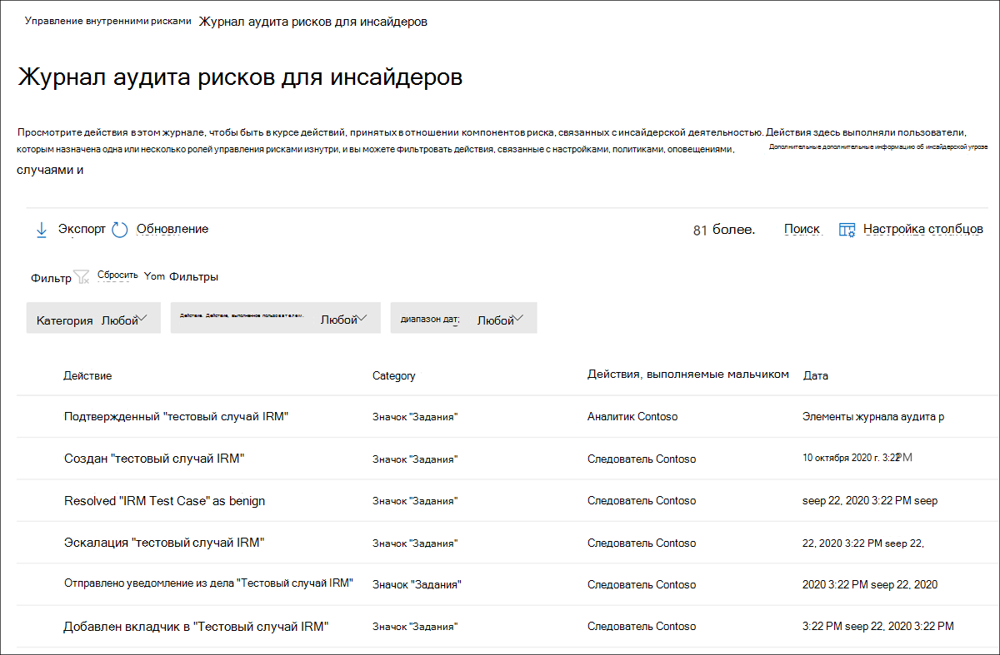

# Журнал аудита управления рисками изнутри

Журнал аудита управления рисками для инсайдеров позволяет вам оставаться в курсе действий, принятых в отношении функций управления рисками. Этот журнал позволяет независимо проанализировать действия пользователей, которые были назначены одной или более группам ролей управления рисками. Журнал аудита управления рисками для инсайдеров автоматически включен в организации и не может быть отключен.

Журнал аудита автоматически обновляется и обновляется сразу, когда происходят отслеживаемые действия, и журнал сохраняет сведения о действии в течение 180 дней (около шести месяцев). Через 180 дней данные для этого действия будут окончательно удалены из журнала.

Области, включенные в мониторинг активности, включают:

- Политики
- Случаи
- Оповещения
- Параметры
- Пользователи
- Шаблоны уведомлений

Чтобы просмотреть и экспортировать данные из журнала аудита, необходимо, чтобы пользователи были назначены группам ролей *Insider Risk Management* или *Insider Risk Management Auditors.* Дополнительные информацию о группах ролей для управления рисками, связанных с инсайдерской оценкой рисков, см. в рубрике Начало работы с инсайдерской ролью управления рисками Шаг [1: Включение разрешений.](insider-risk-management-configure.md#step-1-enable-permissions-for-insider-risk-management)

>[!NOTE]
>Журнал аудита управления рисками для инсайдеров не связан с журналом аудита Microsoft 365, это независимые системы аудита и захват сведений о отдельных действиях. Отключение Microsoft 365 аудита не влияет на аудит действий в рамках управления рисками.

## Просмотр действий в журнале аудита рисков, связанных с инсайдерской деятельностью

Чтобы просмотреть активность функций, отслеживаемую для управления рисками инсайдеров, перейдите по ссылке журнала аудита рисков **insider** и выберите ссылку журнала аудита рисков в правом верхнем окне любой вкладки управления рисками. По умолчанию вы увидите следующую информацию, отображаемую для действий по управлению рисками изнутри:

- **Действие:** Описание действий, принятых пользователем в решении по управлению рисками.
- **Категория:** Область или элемент, в котором выполнялось действие. Например, политики будут *видеться* в качестве категории при выполнении действий по изменению политики.
- **Действия, выполняемые:** Имя пользователя, исполнив действие.
- **Дата:** Дата и время выполнения действия. Дата и время являются локальной датой и временем для организации.

Дополнительные сведения о зарегистрированных действиях выберите действие для отображения области сведений о действии. Эта области содержит дополнительные сведения о действии.

## Столбцы и фильтрация

Чтобы аудиторам было проще проверять зарегистрированные действия, фильтрация поддерживается в журнале аудита рисков **insider.** Для базовой фильтрации столбцы очередей доступны для добавления в представление, чтобы предоставить различные повороты на файлах и сообщениях. Можно фильтровать действия по **категориям, диапазону дат** и **активности, выполняемой полями.**

Чтобы добавить или удалить заголовки столбцов для очереди действий, используйте управление **настройками** столбцов и выберите из столбцов параметры. Эти столбцы соединуют общие условия, поддерживаемые в журнале аудита рисков **insider,** и перечислены ниже в этой статье.

## Экспорт журнала аудита

Пользователи, замесив группу "Управление рисками" или "Внутренние аудиторы по управлению рисками", могут экспортировать все  действия в журнале аудита в файл .csv (разделенные запятой), выбрав экспорт на странице аудита рисков  *insider.*  В зависимости от действия некоторые поля для действий могут не применяться к действию, и эти поля будут отображаться как пустые в экспортируемом файле.

Файл содержит сведения о действиях для следующих полей:

- **Действия, выполняемые:** Имя пользователя, изменяя значение элемента. Пользователи, перечисленные здесь, были назначены одной или более из следующих групп роли инсайдерской роли управления рисками: Insider Risk *Management,* *Insider Risk Management Admins,* *Insider Risk Management Analysts*, *Insider Risk Management Investigators*. Каждая группа ролей имеет разные уровни разрешений для управления функциями риска для инсайдеров.
- **Действие:** Действие, принятое на элементе. Значения просматриваются, удаляются, добавляются, отредактированы *политики, Case, User, Alert и* *Параметры.*
- **Добавлены:** Объекты, добавленные во время действия, такие как пользователи, типы файлов или домены.
- **Объем** оповещений. Уровень громкости оповещений, определенный в параметрах управления рисками.
- **Сумма.** Выбранные в настоящее время пользовательские суммы индикатора для политики.
- **ID актива:** ID актива приоритетного физического актива, на который была выполнена деятельность.
- **Категория:** Категория измененного элемента. Значения — *шаблоны Политики, Случаи, Пользователи,* Оповещений, Параметры и *Уведомления.*
- **Дата:** Дата и время, указанные в локальной дате и времени организации.
- **Описание.** Описание, вводимое пользователем для объекта, на который он действует (например, политики или приоритетной группы пользователей).
- **Политика DLP.** Политика предотвращения потери данных (DLP), выбранная для включения в политику управления рисками инсайдерской.
- **Индикатор.** Индикатор в инсайдерской среде параметров риска, на которые была выполнена активность (например, добавление или удаление индикатора).
- **Шаблон уведомления.** Шаблон уведомлений, на который выполнено действие.
- **Количество дней:** окно активации политики, определенное в параметрах риска для инсайдеров.
- **Количество файлов.** Ограничение объема файлов, определенное в параметрах управления рисками.
- **Шаблон политики.** Шаблон политики, к которой действовали индикаторы, принадлежит.
- **Предыдущая** сумма. Ранее выбранные пользовательские суммы индикатора для политики.
- **Приоритетная группа** пользователей. Приоритетная группа пользователей, на основе выполнения действия.
- **Удалены.** Объекты, которые были удалены во время действия, такие как пользователи, типы файлов или домены.
- **Отправитель.** Поле отправитель шаблона уведомлений, на который выполнено действие.
- **Целевая** политика. Политика, в отношении выполнения действия (например, добавление пользователя или удаление пользователя).
- **Тело сообщения шаблона.** Текст сообщения шаблона уведомления, на который выполнено действие.
- **Тема шаблона.** Поле темы шаблона уведомлений, на который выполнено действие.
- **Пользователь:** Пользователь, на который выполнено действие.
