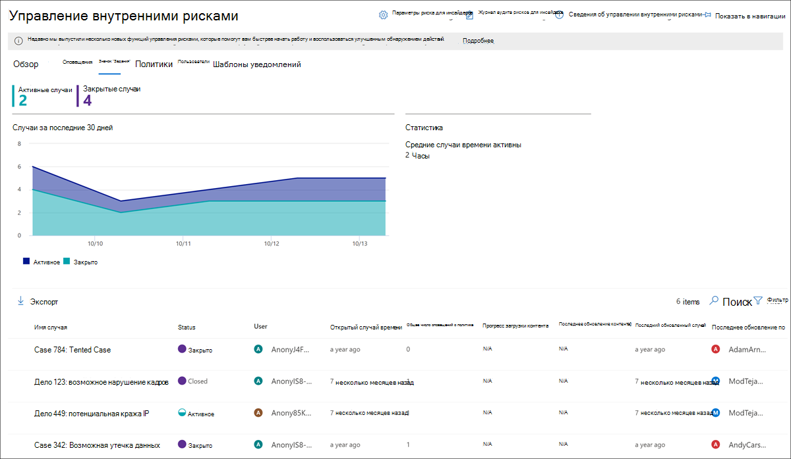
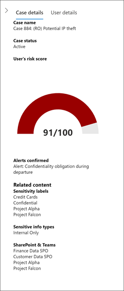
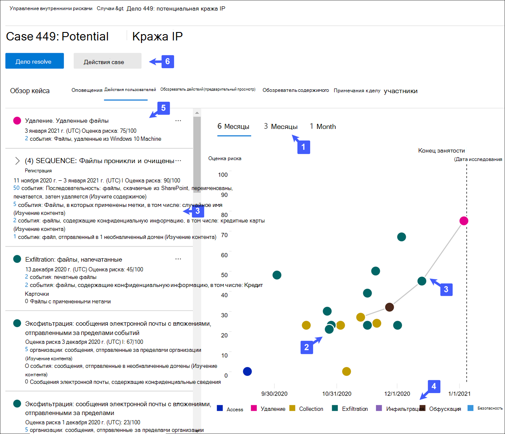
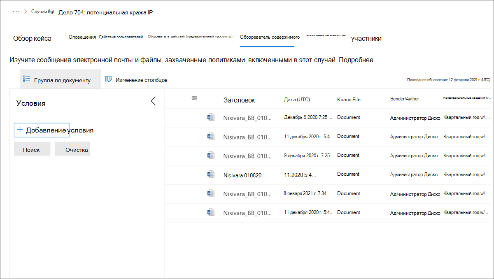

# Случаи управления рисками изнутри

Случаи являются сердцем управления рисками инсайдеров и позволяют глубоко исследовать и действовать по вопросам, созданным индикаторами риска, определенными в вашей политике. Случаи создаются вручную из оповещений в ситуациях, когда необходимы дальнейшие действия для решения проблемы, связанной с соответствием требованиям для пользователя. Каждый случай имеет область действия для одного пользователя, и несколько оповещений для пользователя могут быть добавлены в существующий случай или в новый случай. 

После расследования сведений о деле можно принять меры по:

- отправка пользователю уведомления
- разрешение дела в качестве доброкачественной
- обмен случаем с экземпляром ServiceNow или получателем электронной почты
- эскалация дела для предварительного расследования об обнаружении электронных обнаружений

## Панель мониторинга случаев

Панель действий по управлению **рисками** для инсайдеров позволяет просматривать и действовать в случаях. Каждый виджет отчета на панели мониторинга отображает сведения за последние 30 дней.

- **Активные** случаи: общее число активных дел, которые находятся в стадии расследования.
- **Случаи за последние 30 дней:** общее количество созданных дел, отсортировали *по статусу Active* и *Closed.*
- **Статистика.** Среднее время активных случаев, указанных в часах, днях или месяцах.

В очереди дела перечислены все активные и закрытые случаи для организации, а также текущее состояние следующих атрибутов:

- **Имя случая.** Имя случая, определяемого при подтверждении оповещения и создания случая.  
- **Состояние:** состояние дела, *активного* или *закрытого.*
- **Пользователь.** Пользователь для дела. Если включена анонимизация имен пользователей, отображается анонимизированная информация.
- **Время, открытое.** Время, которое прошло с момента открытия дела.
- **Общее число оповещений** политики: количество совпадений политик, включенных в дело. При добавлении новых оповещений в дело это число может увеличиться.
- **Последнее обновление:** время, которое прошло с момента добавленной заметки или изменения состояния дела.
- **Последнее обновление:** имя аналитика по управлению рисками или следователя, который в последний раз обновлял дело.

Используйте управление **поиском** для поиска имен конкретных текстов и используйте фильтр кейсов для сортировки случаев по следующим атрибутам:

- Status
- Время открытия, даты начала и даты окончания
- Последняя обновленная, дата начала и дата окончания

## Случаи фильтрации

В зависимости от количества и типа активных политик управления рисками для инсайдеров в вашей организации может быть сложно проанализировать большую очередь случаев. Использование фильтров кейсов может помочь аналитикам и следователям сортировать случаи по нескольким атрибутам. Для фильтрации оповещений на панели **"Случаи"** выберите **управление фильтром.** Можно фильтровать случаи по одному или несколько атрибутов:

- **Состояние.** Выберите одно или несколько значений состояния для фильтрации списка дел. Параметры Active *и* *Closed*.
- **Время, открытое.** Выберите даты начала и окончания для открытия дела.
- **Последнее обновление.** Выберите даты начала и окончания при обновлении дела.

## Расследование дела

Более глубокое исследование оповещений об управлении рисками изнутри имеет решающее значение для принятия надлежащих коррективных действий. Внутренние случаи управления рисками являются центральным средством управления, чтобы глубже вникнуть в историю действий пользователя, сведения об оповещении, последовательности событий риска, а также изучить содержимое и сообщения, подверженные рискам. Аналитики рисков и исследователи также используют случаи для централизации отзывов и заметок и обработки разрешения дел.

Выбор случая открывает средства управления делами и позволяет аналитикам и следователям копаться в деталях дел.

### Обзор кейса

В **вкладке Обзор** case приводится описание активности оповещений и истории уровня риска для дела. 

- Виджет **Оповещений** отображает совпадения политик для этого случая, включая состояние оповещений, степень риска оповещения и время обнаружения оповещений. 
- На **диаграмме истории уровня** риска отображается уровень риска пользователя за последние 30 дней. Диаграмма строк позволяет аналитикам и следователям быстро видеть тенденцию в общем риске пользователей с течением времени. 
- Виджет **контента с активностью** риска суммирует типы данных и контента, содержащихся в оповещениях, добавленных в дело. Этот виджет предоставляет всеохожее представление всех данных и контента, заданной в случае риска.

Области **данных case** доступны на всех вкладок управления случаем и суммирует сведения о случаях для аналитиков рисков и следователей. Он включает в себя следующие области:

- **Имя** случая. Имя случая, префиксированное с автогенеративным номером последовательности случая и имя риска, связанного с шаблоном политики, который совпадает с первым подтвержденным оповещением. 
- **Состояние случая:** текущее состояние дела, *active* или *Closed.*
- **Оценка риска пользователя.** Текущий рассчитанный уровень риска пользователя для дела. Этот показатель вычисляется каждые 24 часа и использует оценки риска оповещения из всех активных оповещений, связанных с пользователем.
- **Оповещений подтверждено:** Список оповещений для пользователя, подтвержденного для этого случая.
- **Связанное** содержимое. Список контента, сортироваться по источникам и типам контента. Например, для содержимого оповещений в SharePoint Online можно увидеть имена папок или файлов, которые связаны с активностью риска для оповещений в этом случае.

### Оповещения

Вкладка **Alerts** обобщает текущие оповещений, включенные в дело. В существующий случай могут быть добавлены новые оповещения, которые будут добавлены в очередь **оповещения** по мере их присвоения. В очереди перечислены следующие атрибуты оповещений:

- Status
- Severity
- Время, обнаружено

Выберите оповещение из очереди для отображения страницы **оповещений.**

Используйте функцию управления поиском для поиска имен оповещений для определенного текста и используйте фильтр оповещения для сортировки случаев по следующим атрибутам:

- Status
- Severity
- Время обнаружения, даты начала и даты окончания

Используйте управление фильтром для фильтрации оповещений несколькими атрибутами, в том числе:

- **Состояние.** Выберите одно или несколько значений состояния для фильтрации списка оповещений. Параметры *подтверждены,* *отклонены,* *необходимо просмотреть* и *разрешить*.
- **Серьезность.** Выберите один или несколько уровней серьезности риска для фильтрации списка оповещений. Параметры : *High,* *Medium* и *Low*.
- **Обнаружено время:** Выберите даты начала и окончания для создания оповещений.
- **Политика.** Выберите одну или несколько политик для фильтрации оповещений, созданных выбранными политиками.

### Действия пользователей

Вкладка **Действий** пользователя является одним из самых мощных средств для внутреннего анализа рисков и расследования случаев в решении по управлению рисками. Эта вкладка структурирована для быстрого рассмотрения дела, включая историческую хронологию всех оповещений, сведений об оповещении, текущей оценке риска для пользователя в данном случае, последовательности событий риска и элементов управления для принятия эффективных действий по сдерживанию рисков в данном случае.

1. **Фильтры времени.** По умолчанию последние шесть месяцев оповещений, подтвержденных в этом случае, отображаются в диаграмме действий пользователя. Вы можете легко отфильтровать представление диаграммы, выбрав вкладки *6 месяцев,* *3 месяца* или *1* месяц на диаграмме пузыря.
2. **Активность и сведения** об оповещении о рисках. Действия риска визуально отображаются в качестве цветных пузырей в диаграмме действий пользователя. Пузыри создаются для разных категорий риска, а размер пузыря пропорционально количеству действий риска для этой категории. Выберите пузырь, чтобы отобразить сведения для каждой активности риска. Подробные сведения:
    - **Дата** действия риска.
    - Категория **активности риска**. Например, *Электронная почта (ы)* с вложениями, отправленными за пределы организации, или *Файл(ы), скачаемые из SharePoint Online.*
    - **Оценка риска** для оповещений. Этот показатель — числовая оценка для уровня серьезности риска оповещения.
    - Количество событий, связанных с оповещением. Также доступны ссылки на каждый файл или электронную почту, связанные с действием риска.
3. **Последовательность рисков (предварительный просмотр).** Хронологический порядок рискованных действий является важным аспектом расследования рисков, и выявление этих связанных действий является важной частью оценки общего риска для организации. Связанные действия оповещений отображаются с соединитетельными линиями, чтобы подчеркнуть, что эти действия связаны с большей областью риска. Это представление действий может помочь следователям буквально "подключить точки" для действий с рисками, которые можно было бы рассматривать как изолированные или единичные события. Выберите любой пузырь в последовательности для отображения сведений для всех связанных действий с рисками. Подробные сведения:

    - **Имя** последовательности.
    - **Диапазон дат** **или дат** последовательности.
    - **Оценка риска** для последовательности. Этот показатель является числовой оценкой для последовательности комбинированных уровней серьезности риска оповещения для каждого связанного действия в последовательности.
    - **Количество событий, связанных с каждым оповещением в последовательности.** Также доступны ссылки на каждый файл или электронную почту, связанные с каждым действием риска.
    - **Показ действий в последовательности**. Отображает последовательность в качестве выделенной строки на диаграмме пузыря и расширяет сведения об оповещении для отображения всех связанных оповещений в последовательности.

4. **Легенда об активности** риска. В нижней части диаграммы действий пользователя легенда с цветом помогает быстро определить категорию риска для каждого оповещения.
5. **Хронология** действий риска: перечислены полные хронологии всех оповещений о рисках, связанных с случаем, включая все сведения, доступные в соответствующем пузыре оповещения.
6. **Действия в** случае. Варианты разрешения дела находятся на панели инструментов действий в случае. Вы можете разрешить дело, отправить уведомление по электронной почте пользователю или обострить дело для исследования данных или пользователей.

### Обозреватель действий (предварительный просмотр)

>[!IMPORTANT]
>Вкладка Обозреватель действий доступна в области управления случаем для пользователей с запусками событий после того, как эта функция будет доступна в организации.

Вкладка **Обозреватель действий** позволяет аналитикам рисков и следователям просмотреть сведения о действиях, связанных с оповещениями о рисках. Например, в рамках действий по управлению случаем следователям и аналитикам может потребоваться просмотреть все действия по риску, связанные с делом, для получения дополнительных сведений. С помощью **обозревателя** активности рецензенты могут быстро просмотреть хронологию обнаруженной рискованной активности, а также определить и фильтровать все действия риска, связанные с оповещениями.

Дополнительные сведения о проводнике действий см. в статье [Insider risk management alerts.](insider-risk-management-alerts.md#activity-explorer-preview)

### Обозреватель содержимого

Вкладка **Обозреватель** контента позволяет аналитикам рисков и исследователям просмотреть копии всех отдельных файлов и сообщений электронной почты, связанных с оповещениями о рисках. Например, если оповещение создается, когда пользователь скачивает сотни файлов из SharePoint Online и действие запускает оповещение о политике, все загруженные файлы для оповещения будут захвачены и скопированы в случае управления рисками из исходных источников хранения.

Обозреватель контента — это мощный инструмент с основными и расширенными функциями поиска и фильтрации. Дополнительные материалы об использовании обозревателя контента см. в материалах [Insider risk management Content explorer.](insider-risk-management-content-explorer.md)

### Примечания к делу

Вкладка **Case отмечает,** что в этом случае аналитики рисков и исследователи делятся комментариями, отзывами и сведениями о своей работе по данному делу. Заметки являются постоянными дополнениями к делу и не могут быть изменены или удалены после сэкономленной заметки. Когда случай создается из оповещений, в качестве заметки автоматически добавляются комментарии, вступив в диалоговое окно Подтвердите оповещение и создайте диалоговое окно о риске изнутри. 

Панель мониторинга записей случая отображает заметки пользователя, создав заметку, и время, которое прошло с момента сэкономленного заметки. Чтобы найти текстовое поле заметки для конкретного ключевого слова, используйте кнопку **Поиск** на панели мониторинга дела и введите определенное ключевое слово.

Добавление заметки в дело:

1. В центре [соответствия требованиям Microsoft 365](https://compliance.microsoft.com)перейдите к управлению рисками **insider** и выберите вкладку **Cases.**
2. Выберите случай, а затем выберите **вкладку Заметки case.**
3. Выберите **примечание Добавить случай**.
4. В **диалоговом диалоговом окте "Добавить** заметку" введите заметку для дела. Выберите **Сохранить,** чтобы добавить заметку в дело, или выберите **Отмена** закрытия без сохранения заметки в случае.

### Вкладчики

Вкладка **Contributors** в этом случае — это место, на котором аналитики рисков и исследователи могут добавлять в дело других рецензентов. По умолчанию все пользователи,  назначенные аналитикам  по управлению рисками и следователям по управлению рисками изнутри, перечислены в качестве участников для каждого активного и закрытого дела. Разрешение на просмотр  файлов и сообщений в проводнике контента имеют только пользователи, на которые назначена роль "Следователи по управлению рисками".

Временный доступ к делу может быть предоставлен путем добавления пользователя в качестве участника. Участники имеют все функции управления случаем в конкретном случае, за исключением:

- Разрешение на подтверждение или отклонение оповещений
- Разрешение на редактирование вкладчиков для случаев
- Разрешение на просмотр файлов и сообщений в проводнике контента

Добавление участника в дело:

1. В центре [соответствия требованиям Microsoft 365](https://compliance.microsoft.com)перейдите к управлению рисками **insider** и выберите вкладку **Cases.**
2. Выберите случай, а затем выберите **вкладку Contributors.**
3. Выберите **Добавить вкладчик**.
4. В **диалоговом окте** "Добавить вкладчика" начните вводить имя пользователя, которого вы хотите добавить, а затем выберите пользователя из предложенного списка пользователей. Этот список создается из Azure Active Directory подписки на клиента.
5. Выберите **Добавить,** чтобы добавить пользователя в качестве участника или выбрать **Отмена** закрыть диалоговое окно без добавления пользователя в качестве участника.

## Действия case

Аналитики рисков и исследователи могут принимать меры по делу в одном из нескольких методов, в зависимости от серьезности дела, истории риска пользователя и руководства по рискам вашей организации. В некоторых ситуациях может потребоваться переклифировать дело на пользователя или исследование данных, чтобы сотрудничать с другими областями организации и глубже погрузиться в действия по риску. Управление рисками на основе инсайдерской информации тесно интегрировано с другими решениями по обеспечению соответствия требованиям Microsoft 365, чтобы помочь вам в управлении комплексным разрешением.

### Отправка уведомления по электронной почте

В большинстве случаев действия пользователей, создав оповещений о рисках, являются случайными или случайными. Отправка уведомления о напоминаниях пользователю по электронной почте является эффективным методом документировать обзор и действия, а также методом напоминания пользователям о корпоративных политиках или указать их на обучение по обновлению. Уведомления создаются из шаблонов [уведомлений,](insider-risk-management-notices.md) созданных для инфраструктуры управления рисками.

Важно помнить, что отправка уведомления электронной почты пользователю ***** не _разрешить дело как _Closed*. В некоторых случаях может потребоваться оставить дело открытым после отправки уведомления пользователю, чтобы искать дополнительные действия по риску без открытия нового случая. Если вы хотите разрешить дело после отправки уведомления, необходимо выбрать дело **Resolve** в качестве последующего шага после отправки уведомления.

Отправка уведомления пользователю, назначенного в случае:

1. В центре [соответствия требованиям Microsoft 365](https://compliance.microsoft.com)перейдите к управлению рисками **insider** и выберите вкладку **Cases.**
2. Выберите случай, а затем выберите кнопку Отправка уведомления электронной **почты** на панели инструментов действий.
3. В **диалоговом ок** основе уведомления  отправки электронной почты выберите диспетчер выпадаемого шаблона уведомления, чтобы выбрать шаблон уведомления для уведомления. Этот выбор предварительно заполняет другие поля в уведомлении.
4. Просмотрите поля уведомлений и обнови их по мере необходимости. Добавленные здесь значения переопределяют значения на шаблоне.
5. Выберите **Отправка** для отправки уведомления  пользователю или отмена закрытия диалогового номера без отправки уведомления пользователю. Все отправленные уведомления добавляются в очередь примечаний к делу на панели **мониторинга примечаний** Case.

### Эскалация для расследования

Эскалация дела для расследования пользователей в ситуациях, когда требуется дополнительный юридический обзор для действий пользователя с рисками. Эта эскалация открывает новый случай предварительного открытия электронной почты в организации Microsoft 365. Advanced eDiscovery предоставляет конечный рабочий процесс для сохранения, сбора, анализа, анализа и экспорта контента, отвечающей внутренним и внешним юридическим расследованиям организации. Он также позволяет вашей юридической группе управлять всем процессом уведомления о удержании для связи с хранителями, участвующими в деле. Назначение рецензента в качестве хранителя в деле advanced eDiscovery, созданном из дела по управлению рисками, помогает вашей юридической группе принять соответствующие меры и управлять сохранением контента. Дополнительные сведения о случаях с расширенным электронным открытием см. в обзоре расширенных электронных открытий [в Microsoft 365.](overview-ediscovery-20.md)

Чтобы переклиться в дело в пользовательское расследование:

1. В центре [соответствия требованиям Microsoft 365](https://compliance.microsoft.com)перейдите к управлению рисками **insider** и выберите вкладку **Cases.**
2. Выберите случай, а затем выберите кнопку **Escalate для исследования** на панели инструментов действий для дела.
3. В **диалоговом окте "Эскалация** для расследования" введите имя для нового исследования пользователя. При необходимости введите заметки о случае и выберите **Escalate**.
4. Просмотрите поля уведомлений и обнови их по мере необходимости. Добавленные здесь значения переопределяют значения на шаблоне.
5. Выберите **Подтвердите** создание случая расследования пользователя или выберите **Отмена,** чтобы закрыть диалоговое окно без создания нового случая расследования пользователя.

После того как дело об управлении рисками изнутри переросли в новое дело о расследовании пользователей, вы можете просмотреть новое дело в области advanced **eDiscovery** в центре соответствия  >   требованиям Microsoft 365.

### Запуск автоматизированных задач с потоками Power Automate для дела

Используя рекомендуемые потоки Power Automate, исследователи и аналитики рисков могут быстро принять меры к:

- Запрос сведений из отдела кадров или бизнеса о пользователе в случае инсайдерского риска
- Уведомление диспетчера о том, что у пользователя есть оповещение о рисках, связанных с инсайдерской оценкой
- Добавление напоминания календаря для последующей оценки случая риска для инсайдеров
- Создание записи для дела об управлении рисками изнутри в ServiceNow

Для запуска, управления или создания потоков Power Automate для случая управления рисками изнутри:

1. Выберите **Automate** на панели инструментов действий в случае. 
2. Выберите поток Power Automate для запуска, а затем выберите **поток Run**. 
3. После завершения потока выберите **Готово**.

Дополнительные новости о потоках Power Automate для управления рисками изнутри см. в рубрике Начало работы с инсайдерской настройкой [управления рисками.](insider-risk-management-settings.md#power-automate-flows-preview)

### Просмотр или создание команды Microsoft Teams для этого случая

Когда в настройках включена интеграция Microsoft Teams для управления рисками изнутри, команда Microsoft Teams автоматически создается при каждом подтверждении оповещений и создании случая. Исследователи и аналитики рисков могут быстро открыть Microsoft Teams и перейти непосредственно в группу для дела, выбрав команду **View Microsoft Teams** на панели инструментов действий для дела.

Для случаев, открытых перед включением интеграции Microsoft Team, исследователи и аналитики по рискам могут создать новую команду Microsoft Teams для дела, выбрав **команду Create Microsoft Teams** на панели инструментов действий для дела.

Когда дело будет разрешено, связанная microsoft Team будет автоматически архивироваться (скрыта и переключится только для чтения).

Дополнительные новости о Microsoft Teams для управления рисками, связанных с инсайдерской помощью, см. в рубрике Начало работы с настройками управления [рисками.](insider-risk-management-settings.md#microsoft-teams-preview)

### Устранение случая

После того как аналитики и следователи по рискам завершили проверку и расследование, можно решить вопрос о том, как действовать по всем оповещениям, включенным в данный случай. При разрешении дела добавляется классификация разрешений, изменяется состояние дела на *Закрытое,* а причины действий по разрешению автоматически добавляются в очередь заметки о случае на панели мониторинга записей **case.** Случаи решаются так же:

- **Доброкачественная** классификация для случаев, когда оповещения о совпадении политик оцениваются как низкий риск, несерьезный или ложный срабатыв.
- **Подтвержденное нарушение** политики. Классификация для случаев, когда оповещения о совпадении политик оцениваются как рискованные, серьезные или в результате вредоносных намерений.

Чтобы разрешить дело:

1. В центре [соответствия требованиям Microsoft 365](https://compliance.microsoft.com)перейдите к управлению рисками **insider** и выберите вкладку **Cases.**
2. Выберите случай, а затем выберите кнопку **Разрешить случай** на панели инструментов действий для дела.
3. В **диалоговом окте "Разрешить"** выберите **диспетчер разрешения** в качестве управления отсевом, чтобы выбрать классификацию разрешения для дела. Параметры — **доброкачественные** или **подтвержденные нарушения политики.**
4. В **диалоговом** окантове "Разрешить" введите причины классификации разрешений в текстовом поле **Action taken.**
5. Выберите **Разрешить** закрыть дело или выбрать **Отмена** закрыть диалоговое окно без разрешения дела.
