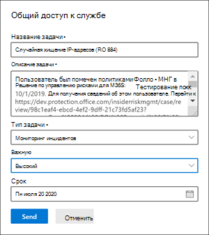

# Случаи управления рисками внутри организации

Дела являются основными при управлении рисками внутри организации и позволяют глубоко изучить проблемы, созданные индикаторами риска, определенными в ваших политиках, и действовать над ими. Дела создаются вручную из оповещений в тех случаях, когда для решения проблемы, связанной с соответствием требованиям, для пользователя необходимы дополнительные действия. Каждый случай имеет область действия одного пользователя, и несколько оповещений для пользователя можно добавить к существующему или новому делу. 

Изуляв подробности дела, вы можете принять меры, выступая в:

- отправка пользователю уведомления
- разрешение дела как безвластие
- совместное использование дела с экземпляром ServiceNow или получателем электронной почты
- эскалация дела для расследования Advanced eDiscovery

## Информационная панель "Дела"

Панель мониторинга "Случаи управления **рисками"** позволяет просматривать дела и действовать над ими. Каждый виджет отчета на панели мониторинга отображает сведения за последние 30 дней.

- **Активные случаи:** общее количество активных дел, в отношении которые ведется расследование.
- **Дела за последние 30 дней:** общее количество созданных дел, отсортировать их по *активному* и *закрытому* статусу.
- **Статистика:** среднее время активных дел в часах, днях или месяцах.

В очереди дел перечислены все активные и закрытые дела для организации, а также текущее состояние атрибутов следующих случаев:

- **Имя дела:** имя дела, которое определяется при подтверждении оповещения и его создания.  
- **Состояние:** состояние дела, активного или *закрытого.* 
- **Пользователь**: пользователь для дела. Если включена анонимизация имен пользователей, отображается анонимная информация.
- **Время открытия:** время, которое прошло с момента открытия дела.
- **Общее количество оповещений** политики: количество совпадений с политикой, включенных в дело. Это число может увеличиться при добавлении новых оповещений в дело.
- **Last updated**: The time that has passed since there has been added case note or change in the case state.
- **Last updated by**: The name of the insider risk management analyst or investigator that last updated the case.

Используйте управление **поиском** для поиска имен дел для определенного текста и используйте фильтр дел для сортировки дел по следующим атрибутам:

- Состояние
- Время открытия, дата начала и дата окончания
- Дата последнего обновления, дата начала и дата окончания

## Случаи фильтрации

В зависимости от количества и типа активных политик управления рисками внутри организации, просмотр большого количества дел может быть сложной задачей. Использование фильтров дел может помочь аналитикам и следователям сортировать дела по нескольким атрибутам. Для фильтрации оповещений на панели **мониторинга "Дела"** выберите контроль **фильтра.** Можно фильтровать дела по одному или несколько атрибутов:

- **Состояние:** выберите одно или несколько значений состояния для фильтрации списка дел. Возможные варианты: *"Активный"* и *"Закрытый".*
- **Time case opened**: Select the start and end dates for when the case was opened.
- **Last updated**: Select the start and end dates for when the case was updated.

## Изучение дела

Более глубокое исследование оповещений об управлении рисками внутри организации крайне важно для принятия коррективных действий. Случаи управления рисками внутри организации — это центральное средство управления, которое позволяет более подробно изучить историю действий с рисками пользователей и сведения об оповещениях, а также изучить содержимое и сообщения, подверженные рискам. Аналитики рисков и следователи также используют дела для централизации отзывов и заметок, а также для обработки разрешения дел.

Выбор дела открывает средства управления делами и позволяет аналитикам и следователям получить подробные сведения о делах.

### Обзор дела

На **вкладке "Обзор** дела" приводится обзор активности оповещений и истории уровня риска для дела. 

- Виджет **Alerts** отображает совпадения с политикой для дела, включая состояние оповещения, степень риска оповещения и время обнаружения оповещения. 
- На **диаграмме истории уровня** риска отображается уровень риска пользователя за последние 30 дней. График позволяет аналитикам и следователям быстро увидеть тенденцию общего риска для пользователей с течением времени. 
- **Мини-приложения "Содержимое** о рисках" суммирует типы данных и контента, содержащихся в оповещениях, добавленных к делу. Это мини-приложения предоставляет все представление всех данных и содержимого, которые в этом случае под угрозой.

The **Case details** pane is available on all case management tabs and summarizes the case details for risk analysts and investigators. Он включает следующие области:

- **Имя дела:** имя дела с префиксом с автоматическим номером последовательности дела и именем риска, связанного с шаблоном политики, совпав с первым подтвержденным оповещением. 
- **Состояние дела:** текущее состояние дела, *активное* или *закрытое.*
- **Оценка риска пользователя**: текущий вычисляемого уровня риска пользователя для дела. Этот показатель рассчитывается каждые 24 часа и использует оценки риска оповещений из всех активных оповещений, связанных с пользователем.
- **Alerts confirmed**: List of alerts for the user confirmed for the case.
- **Связанный контент**: список контента, отсортировать по источникам и типам контента. Например, для содержимого оповещений о случае в SharePoint Online могут быть указаны папки или имена файлов, связанные с действиями по риску для оповещений в этом случае.

### Оповещения

Вкладка **"Оповещения"** содержит итоги текущих оповещений, включенных в дело. Новые оповещения могут быть добавлены в существующий случай, и они будут добавлены в очередь оповещений по мере их присвоения.  В очереди перечислены следующие атрибуты оповещений:

- Состояние
- Severity
- Обнаружено время

Выберите оповещение из очереди, чтобы отобразить страницу с **подробными данными оповещений.**

Используйте управление поиском для поиска имен оповещений для определенного текста и используйте фильтр оповещений для сортировки случаев по следующим атрибутам:

- Состояние
- Severity
- Обнаружено время, дата начала и дата окончания

Используйте фильтр для фильтрации оповещений по нескольким атрибутам, в том числе:

- **Состояние:** выберите одно или несколько значений состояния для фильтрации списка оповещений. Возможные варианты: *"Подтверждено",* *"Отклонено",* *"Требуется проверка"* и *"Разрешено".*
- **Серьезность:** выберите один или несколько уровней серьезности риска оповещения, чтобы отфильтровать список оповещений. Возможные варианты: *High,* *Medium* и *Low.*
- **Обнаружено время:** выберите даты начала и окончания создания оповещения.
- **Политика:** выберите одну или несколько политик для фильтрации оповещений, созданных выбранными политиками.

### Действия пользователей

Вкладка **"Действия пользователя"** — это одно из самых мощных средств для анализа внутренних рисков и анализа дел в решении по управлению внутренними рисками. Эта вкладка структурирована таким образом, чтобы обеспечить быструю проверку дела, включая временную шкалу всех оповещений, все сведения оповещений, текущую оценку риска для пользователя в этом случае и средства контроля, позволяющие эффективно сдержать риски в этом случае.

1. **Фильтры времени даты** и окна: по умолчанию на диаграмме действий пользователя отображаются последние шесть месяцев оповещений, подтвержденных в этом случае. Можно легко отфильтровать представление диаграммы с помощью элементов управления ползунок на обоих концах окна диаграммы или путем определения определенных дат начала и окончания в элементе управления фильтра диаграммы.
2. **Оповещение о риске и сведения:** действия с рисками визуально отображаются в качестве цветных пузырьков на диаграмме действий пользователя. Пузырьки создаются для различных категорий риска, а размер пузырьков пропорционально количеству действий риска для этой категории. Выберите пузырь, чтобы отобразить сведения о каждом действии с риском. Подробные сведения:
    - **Дата** действия с риском.
    - Категория **действий с риском.** Например, сообщения *электронной почты* с вложениями, отправленными за пределы организации, или файлы, загруженные *из SharePoint Online.*
    - **Оценка риска** для оповещения. Этот показатель является числовой оценкой степени серьезности риска оповещения.
    - Количество событий, связанных с оповещением. Также доступны ссылки на каждый файл или сообщение электронной почты, связанные с действиями с риском.
3. **Легенды о действиях** с рисками: в нижней части диаграммы действий пользователя с помощью цветных легенд можно быстро определить категорию риска для каждого оповещения.
4. **Хронология** действий с рисками: в списке перечислены все оповещения о рисках, связанные с делом, включая все сведения, доступные в соответствующем пузырьке оповещений.
5. **Действия с делами:** варианты разрешения дела находятся на панели инструментов действия с делом. Вы можете разрешить дело, отправить пользователю уведомление по электронной почте или обослать дело для анализа данных или пользователей.

### Обозреватель действий (предварительная версия)

>[!IMPORTANT]
>Вкладка "Обозреватель действий" доступна в области управления делами для пользователей, у пользователей с запусками событий после того, как эта функция будет доступна в организации.

Вкладка **обозревателя действий** позволяет аналитикам рисков и следователям просмотреть сведения о действиях, связанных с оповещениями о рисках. Например, в рамках действий по управлению делами следователям и аналитикам может потребоваться просмотреть все действия по риску, связанные с делом, для получения дополнительных сведений. С помощью **обозревателя действий** рецензенты могут быстро просмотреть временную шкалу обнаруженных рискованных действий, а также определить и фильтровать все действия с рисками, связанные с оповещениями.

Дополнительные сведения о обозревателе действий см. в статье оповещений по управлению рисками [для оценки](insider-risk-management-alerts.md#activity-explorer-preview) рисков.

### Обозреватель содержимого

Вкладка **"Обозреватель** содержимого" позволяет аналитикам рисков и следователям просмотреть копии всех отдельных файлов и сообщений электронной почты, связанных с оповещениями о рисках. Например, если оповещение создается, когда пользователь скачивает сотни файлов из SharePoint Online и действие вызывает оповещение политики, все загруженные файлы для оповещения захватываются и копируется в дело управления рисками внутри организации из исходных источников хранилища.

Обозреватель содержимого — это мощное средство с базовыми и расширенными функциями поиска и фильтрации. Чтобы узнать больше об использовании обозревателя содержимого, см. обозреватель контента для управления [рисками для оценки рисков.](insider-risk-management-content-explorer.md)

### Примечания к делу

На **вкладке "Заметки** по делу" в этом случае аналитики рисков и следователи делятся комментариями, отзывами и аналитическими сведениями о своей работе по делу. Заметки являются постоянными дополнениями к делу и не могут быть изменены или удалены после с сохранить заметку. Когда дело создается из оповещения, комментарии,  которые ввели в оповещении "Подтверждение" и создают внутренний риск, автоматически добавляются в качестве заметки по делу.

На панели мониторинга примечаний к делу отображаются заметки пользователя, создадав заметку, и время, которое прошло с момента с сохранения заметки. Чтобы найти в текстовом поле заметки  по делу определенное ключевое слово, используйте кнопку поиска на панели мониторинга дела и введите определенное ключевое слово.

Чтобы добавить примечание к делу:

1. В Центре [соответствия требованиям Microsoft 365](https://compliance.microsoft.com)перейдите в центр управления рисками для программы **insider и** выберите вкладку **"Дела".**
2. Выберите дело, а затем вкладку **"Заметки о** делах".
3. Select **Add case note**.
4. В **диалоговом окте "Добавление** заметки по делу" введите примечание для дела. Select **Save** to add the note to the case or select **Cancel** close without saving the note to the case.

### Авторы

На **вкладке "Авторы"** в этом случае аналитики рисков и следователи могут добавить в дело других проверяющих. По умолчанию все пользователи,  для которых назначены  роли "Аналитики управления рисками для участников" и "Внутренние расследования по управлению рисками", перечислены как участники каждого активного и закрытого дела. Просматривать файлы и сообщения в обозревателе содержимого могут только пользователи с ролью **"Insider Risk Management Researchers".**

Временный доступ к делу можно предоставить, добавив пользователя в качестве участника. Участники имеют все функции управления конкретными случаями, за исключением:

- Разрешение на подтверждение или отклонение оповещений
- Разрешение на редактирование участников для дел
- Разрешение на просмотр файлов и сообщений в обозревателе содержимого

Чтобы добавить участника дела:

1. В Центре [соответствия требованиям Microsoft 365](https://compliance.microsoft.com)перейдите в центр управления рисками для программы **insider и** выберите вкладку **"Дела".**
2. Выберите дело, а затем вкладку **"Авторы".**
3. Выберите **"Добавить участника"**.
4. В **диалоговом окте** "Добавление участника" начните вводить имя пользователя, которого вы хотите добавить, а затем выберите пользователя из предложенного списка пользователей. Этот список создается из Azure Active Directory подписки на клиент.
5. Select **Add** to add the user as a contributor or select **Cancel** close the dialog without adding the user as a contributor.

## Действия с делами

Аналитики рисков и следователи могут принять меры по делу одним из нескольких методов в зависимости от серьезности дела, истории риска пользователя и рекомендаций по рискам вашей организации. В некоторых ситуациях может потребоваться до передачи дела пользователю или анализу данных для совместной работы с другими областями организации и более глубокого анализа рисков. Управление рисками внутри организации тесно интегрировано с другими решениями для обеспечения соответствия требованиям Microsoft 365, чтобы помочь вам в комплексном управлении разрешением.

### Отправка уведомления по электронной почте

В большинстве случаев действия пользователей, которые создают оповещения о риске внутри системы, являются случайными или случайными. Отправка пользователю уведомления с напоминанием по электронной почте является эффективным способом документировать рассмотрение дела и действий, а также является способом напомнить пользователям о корпоративных политиках или указать им на обновление обучения. Уведомления создаются из [шаблонов](insider-risk-management-notices.md) уведомлений, созданных для инфраструктуры управления рисками внутри организации.

Важно помнить, что отправка уведомления по электронной почте пользователю *_*_* не _ разрешать дело как _Closed*. В некоторых случаях может потребоваться оставить дело открытым после отправки пользователю уведомления о дополнительных действиях с риском, не открывая новое дело. Если вы хотите разрешить дело после отправки уведомления, необходимо выбрать решение в качестве последующего шага после отправки уведомления. 

Чтобы отправить уведомление пользователю, назначенного для дела:

1. В Центре [соответствия требованиям Microsoft 365](https://compliance.microsoft.com)перейдите в центр управления рисками для программы **insider и** выберите вкладку **"Дела".**
2. Выберите дело, а затем кнопку "Отправить уведомление по **электронной** почте" на панели инструментов действий с делом.
3. В **диалоговом окте "Отправка** уведомления по электронной почте" выберите в меню "Выберите шаблон уведомления", чтобы выбрать шаблон уведомления.  Этот выбор предварительно заполняет другие поля в уведомлении.
4. Просмотрите поля уведомлений и обновив их соответствующим образом. Значения, введенные здесь, будут переопределять значения в шаблоне.
5. Выберите **"Отправить",** чтобы отправить  уведомление пользователю, или выберите "Отмена закрытия диалоговое окно" без отправки уведомления пользователю. Все отправленные уведомления добавляются в очередь заметок о делах на панели мониторинга **"Заметки о** делах".

### Эскалация для исследования

Эскалация дела для анализа пользователей в ситуациях, когда для рискованных действий пользователя требуется дополнительная юридическая проверка. Эта эскалация открывает новое дело Advanced eDiscovery в организации Microsoft 365. Advanced eDiscovery предоставляет конечный рабочий процесс для сохранения, сбора, просмотра, анализа и экспорта контента, который отвечает на внутренние и внешние юридические расследования в организации. Он также позволяет юридическим командам управлять всем процессом уведомлений об удержании по юридическим основаниям для связи с хранителями, участвующими в деле. Назначение проверяемого в качестве хранителя в деле Advanced eDiscovery, созданном из дела управления рисками внутри организации, помогает юридической группе принять соответствующие меры и управлять сохранением контента. Дополнительные сведения о случаях Advanced eDiscovery см. в обзоре [Advanced eDiscovery в Microsoft 365.](overview-ediscovery-20.md)

Чтобы док-дело перенабовылось до расследования, с его учетом:

1. В Центре [соответствия требованиям Microsoft 365](https://compliance.microsoft.com)перейдите в центр управления рисками для программы **insider и** выберите вкладку **"Дела".**
2. Выберите дело, а затем кнопку **"Эскалация для исследования"** на панели инструментов действий с делом.
3. В **диалоговом окте** "Эскалация для исследования" введите имя нового исследования пользователя. При необходимости введите заметки о деле и выберите **"Эскалация".**
4. Просмотрите поля уведомлений и обновив их соответствующим образом. Значения, введенные здесь, будут переопределять значения в шаблоне.
5. Выберите **"Подтвердить",** чтобы создать  дело исследования для пользователя, или выберите "Отмена", чтобы закрыть диалоговое окно, не создавая новое дело.

После того как дело по управлению рисками внутри организации будет перенаправлено в новое дело, вы можете просмотреть новое дело в области Advanced **eDiscovery** в Центре соответствия требованиям  >   Microsoft 365.

### Запуск автоматизированных задач с помощью потоков Power Automate для этого случая

Используя рекомендуемые потоки Power Automate, специалисты по рискам и аналитики могут быстро принять меры для:

- Запрос сведений из отдела кадров или бизнеса о пользователе в случае, когда пользователь находится в ситуации с insider risk
- Уведомлять руководителя о том, что у пользователя есть оповещение о insider risk
- Добавление напоминания календаря для последующей оценки внутри риска
- Создание записи для случая управления рисками внутри организации в ServiceNow

Запуск, управление или создание потоков Power Automate для случая управления рисками внутри организации:

1. Выберите **"Автоматизировать"** на панели инструментов действия с делом. 
2. Выберите поток Power Automate для запуска, а затем выберите **"Поток запуска".** 
3. После завершения потока выберите **"Готово"**.

Дополнительные информацию о потоках Power Automate для управления insider risk см. в руководстве "Начало работы с настройками управления рисками [внутри организации".](insider-risk-management-settings.md#power-automate-flows-preview)

### Просмотр или создание команды Microsoft Teams для дела

Если в параметрах включена интеграция Microsoft Teams для управления рисками внутри организации, команда Microsoft Teams создается автоматически при каждом подтверждении оповещения и создании дела. Специалисты по рискам и аналитики могут быстро открыть Microsoft Teams и перейти непосредственно к команде для дела, выбрав команду "Просмотреть **Microsoft Teams"** на панели инструментов действий с делом.

Для случаев, открытых перед включением интеграции Microsoft Team, специалисты по рискам и аналитики могут создать новую команду Microsoft Teams для дела, выбрав команду "Создать **Microsoft Teams"** на панели инструментов действий по делу.

После разрешения дела связанная команда Microsoft Team будет автоматически архивироваться (скрыта и включена только для чтения).

Дополнительные информацию о Microsoft Teams для управления insider risk см. в руководстве "Начало работы с настройками управления рисками [внутри организации".](insider-risk-management-settings.md#microsoft-teams-preview)

### Совместное дело

Совместное использование дела управления рисками внутри организации позволяет следователям и аналитикам с легкостью сотрудничать с другими заинтересованными лицами по обеспечению соответствия требованиям в вашей организации. Вы можете быстро поделиться ссылкой на внутренний случай управления рисками с внешними заинтересованными лицами из области управления случаями. Чтобы получить доступ к делу управления рисками внутри организации по ссылке, заинтересованные стороны должны быть включены в любую из групп ролей управления рисками.

>[!NOTE]
>Благодарим вас за отзывы и поддержку во время предварительного просмотра соединители ServiceNow. Мы решили прекратить предварительную версию соединители ServiceNow и прекратить поддержку управления рисками внутри организации 30 ноября 2020 г. Мы активно оцениваем альтернативные методы для предоставления клиентам интеграции ServiceNow в управлении рисками внутри организации.

Доступны следующие параметры общего доступа:

- **ServiceNow**: после настройки соединителя Microsoft 365 ServiceNow для вашей организации Microsoft 365 вы можете легко поделиться ссылкой на дело, открыть инцидент или запросить изменение с вашей организацией ServiceNow. Чтобы поделиться делом с ServiceNow, выберите **Share**  >  **ServiceNow** в действии дела. Интеграция ServiceNow с поддержкой управления insider risk management включает следующие сведения о деле и действиях:
    - **Имя задачи:** имя новой задачи ServiceNow.
    - **Описание задачи:** описание новой задачи ServiceNow. Это редактируемое поле описания автоматически включает ссылку на дело управления рисками внутри организации.
    - **Тип задачи:** тип задачи для новой задачи ServiceNow, запрос *"Инцидент"* или *"Изменение".*
    - **Priority**: The priority for the new ServiceNow task, either *Planning,* *Low,* *Moderate,* *High,* or *Critical*.
    - **Срок выполнения**: запрашиваемая дата завершения задачи ServiceNow.

- **Электронная** почта: ссылку на дело по управлению рисками внутри организации в сообщении электронной почты. С помощью этого параметра можно выбрать любой локально настроенный почтовый клиент. Чтобы поделиться ссылкой на дело с электронной почтой, выберите **"Поделиться**  >  **электронной почтой"** на панели инструментов действий с делом.
- **Ссылка**"Копировать": копирует ссылку на дело управления рисками внутри организации в буфер обмена. Чтобы скопировать ссылку на дело в буфер обмена, выберите ссылку **"Поделиться**  >  **копированием"** на панели инструментов действий с делом.

### Разрешение дела

После того как аналитики и следователи по рискам завершят проверку и исследование, можно разрешить рассмотрение дела для работы со всеми оповещениями, включенными в данный момент в дело. Разрешение дела добавляет классификацию разрешения, изменяет состояние дела на "Закрыто", а причины действия разрешения автоматически добавляются в очередь примечаний к делу на панели мониторинга "Заметки о **деле".** Дела решаются как один из двух:

- **Benign**: классификация для случаев, когда оповещения о совпадениях с политикой оцениваются как низкий риск, не серьезное или ложное срабатываование.
- **Подтвержденное нарушение политики**: классификация случаев, когда оповещения о совпадении с политикой оцениваются как рискованные, серьезные или результатом злонамеренного действия.

Чтобы разрешить дело:

1. В Центре [соответствия требованиям Microsoft 365](https://compliance.microsoft.com)перейдите в центр управления рисками для программы **insider и** выберите вкладку **"Дела".**
2. Выберите дело, а затем кнопку **"Разрешить дело"** на панели инструментов действия с делом.
3. В **диалоговом окте** "Разрешить дело" выберите "Разрешить как" для выбора классификации разрешения для дела.  Возможные варианты: **"Бенигн"** или **"Подтверждено нарушение политики".**
4. В **диалоговом окте** "Разрешить дело" введите причины классификации разрешения в текстовом поле **"Действие".**
5. Select **Resolve** to close the case or select **Cancel** close the dialog without resolving the case.
