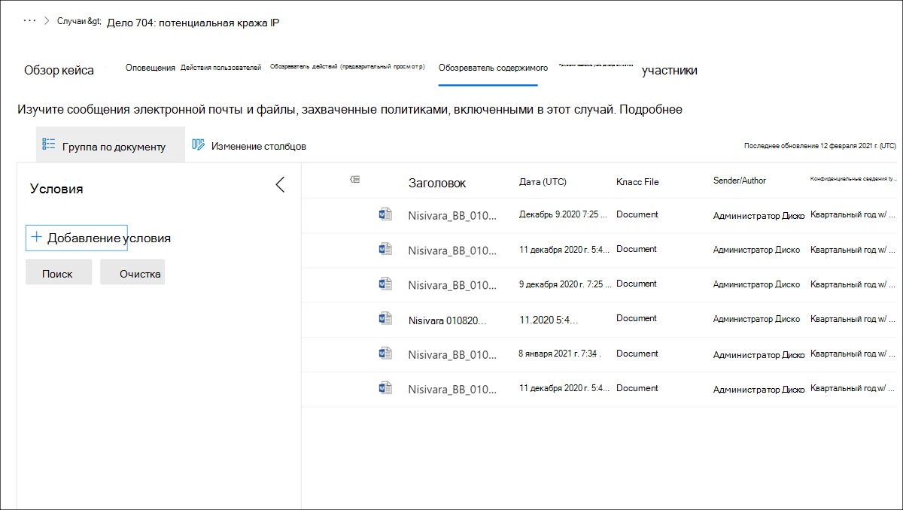

# Обозреватель контента для управления рискамиInsider risk management Content explorer

Обозреватель контента  управления рисками инсайдерской работы позволяет пользователям, на которые назначена роль *исследователей* по управлению рисками, для изучения контекста и сведений о контенте, связанном с действиями в оповещении.The insider risk management **Content explorer** allows users assigned the *Insider Risk Management Investigators* role to examine the context and details of content associated with activity in alerts. Данные о случаях в обозревателе контента обновляются ежедневно, чтобы включить новые действия.The case data in Content explorer is refreshed daily to include new activity. Для всех оповещений, подтвержденных в случае, копии данных и файлов сообщений архивируется в качестве снимка во время элементов при сохранении исходных файлов и сообщений в источниках хранения.For all alerts that are confirmed to a case, copies of data and message files are archived as a snapshot in time of the items, while maintaining the original files and messages in the storage sources. Копирование данных и сообщений является прозрачным для пользователя, связанного с оповещением, и для владельца контента.The copying of data and messages is transparent to the user associated with the alert and to the owner of the content. В новых случаях заполнение контента в обозревателе контента обычно занимает около часа.For new cases, it usually takes about an hour for content to populate in Content explorer. Для случаев с большим количеством контента может потребоваться больше времени для создания снимка.For cases with large amounts of content, it may take longer to create a snapshot. Если содержимое по-прежнему загружается в обозревателе контента, вы увидите индикатор прогресса, отображающий процент завершения.If content is still loading in Content explorer, you will see a progress indicator that displays the completion percentage.

В некоторых случаях данные, связанные с случаем, могут быть недоступны в качестве снимка для просмотра в обозревателе контента.In some cases, data associated with a case may not be available as a snapshot for review in Content explorer. Такая ситуация может возникнуть при удалении или перемещении данных дела, а также при временной ошибке при обработке данных.This situation may occur when case data has been deleted or moved, or when a temporary error occurs when processing case data. Если такая ситуация возникает, выберите **Просмотр** файлов в панели предупреждений, чтобы просмотреть имена файлов, путь к файлам и причину сбоя для каждого файла.If this situation occurs, select **View files** in the warning bar to view the file names, file path, and reason for the failure for each file. При необходимости эти сведения можно экспортировать в файл csv (разделенные запятой).If needed, this information can be exported to a .csv (comma-separated values) file.

Если контент содержит разрешения на управление правами на информацию, эти разрешения сохраняются  для скопированного контента, и пользователям, на которые назначена роль исследователей по управлению рисками, необходимы эти разрешения и права, если им необходимо открыть и просмотреть файлы.If the content includes Information Rights Management permissions, these permissions are maintained for the copied content and users assigned the *Insider Risk Management Investigators* role will need these permissions and rights if they need to open and view the files. Каждому файлу и сообщению автоматически назначен уникальный файл ID в случае управления рисками для целей управления.Each file and message are automatically assigned a unique file ID in the insider risk management case for management purposes. Документы, связанные с действиями индикатора устройства, не включаются в обозреватель контента.Documents associated with device indicator activities are not included in Content explorer.

>[!Note]
>Обозреватель контента включает действия, связанные с Microsoft Office файлами.Content explorer includes activities related to Microsoft Office files. Действия на уровне сайта, такие как удаление сайта SharePoint или изменения разрешений на сайт, не включаются в обозреватель контента.Site-level activities, such as when a SharePoint site is deleted or if site permissions are changed, aren't included in Content explorer.

## Параметры столбцовColumn options

Чтобы аналитикам и следователям по рискам было проще просмотреть захваченные данные и сообщения и просмотреть контекст дела, в обозреватель контента включены несколько средств фильтрации и сортировки.To make it easier for risk analysts and investigators to review captured data and messages and review the context to the case, several filtering and sorting tools are included in the Content explorer. Для базовой сортировки столбцы классов **Date** и **File** поддерживают сортировку с помощью заголовков столбцов в области очереди контента.For basic sorting, the **Date** and **File class** columns support sorting using the column titles in the content queue pane. Другие столбцы очереди доступны для добавления в представление для предоставления разных поворотов в файлах и сообщениях.Other queue columns are available to add to the view to provide different pivots on the files and messages.

Чтобы добавить или удалить заголовки столбцов для очереди контента, используйте управление **столбцами Редактирование** и выберите из следующих параметров столбца.To add or remove column headings for the content queue, use the **Edit columns** control and select from the following column options. Эти столбцы соотносят с общими условиями свойств электронной почты и документов, поддерживаемых в обозревателе контента и перечисленных ниже в этой статье.These columns map to the common, email, and document property conditions supported in the Content explorer and listed later in this article.

| **Параметр Column****Column option** | **Описание****Description** |
|:------------------|:----------------|
| **Author****Author** | Поле автора в документах Microsoft Office, которое сохраняется при копировании документа.The author field from Office documents, which persists if a document is copied. Например, если пользователь создает документ и передает его другому пользователю, который затем загружает его в SharePoint, документ по-прежнему сохраняет исходный автор.For example, if a user creates a document and the emails it to someone else who then uploads it to SharePoint, the document will still retain the original author. |
| **Bcc****Bcc** | Доступные для сообщений электронной почты, пользователи в поле сообщений Bcc.Available for email messages, the users in the Bcc message field. |
| **Cc****Cc** | Доступные для сообщений электронной почты, пользователи в поле сообщений Cc.Available for email messages, the users in the Cc message field. |
| **Сложный путь****Compound path** | Понятный для человека путь, описываемый источником элемента.Human readable path that describes the source of the item. |
| **ID беседы****Conversation ID** | Id беседы из сообщения.Conversation Id from the message. |
| **Индекс разговоров****Conversation index** | Индекс беседы из сообщения.Conversation index from the message. |
| **Время создания.****Created time** | Время создания файла или сообщения электронной почты.The time the file or email message was created. |
| **Дата (UTC)****Date (UTC)** | Для электронной почты: дата получения сообщения адресатом или его отправки отправителем.For email, the date a message was received by a recipient or sent by the sender. Для документов дата последнего изменения документа.For documents, the date a document was last modified. Дата находится в согласованном универсальном времени (UTC).Date is in Coordinated Universal Time (UTC).|
| **Доминирующая тема****Dominant theme** | Доминирующая тема, рассчитанная для аналитики.Dominant theme as calculated for analytics. |
| **ID набора электронной почты****Email set ID** | Групповой ID для всех сообщений в одном наборе электронной почты.Group ID for all messages in the same email set. |
| **Семейный ID****Family ID** | Семейная группа ИД объединяет все элементы; для электронной почты этот столбец включает сообщение и все вложения; для документов этот столбец включает документ и все встроенные элементы.Family Id groups together all items; for email, this column includes the message and all attachments; for documents, this column includes the document and any embedded items. |
| **Класс File****File class** | Для контента из SharePoint и OneDrive: **Документ;** для контента из Exchange: **электронная почта** или **вложение**.For content from SharePoint and OneDrive: **Document**; for content from Exchange: **Email** or **Attachment**. |
| **Файл ID****File ID** | Идентификатор документа, уникальный в данном случае.Document identifier unique within the case. |
| **Значок типа файла****File type icon** | Расширение файла; например, docx, one, pptx или xlsx.The extension of a file; for example, docx, one, pptx, or xlsx. Это поле является тем же свойством, что и свойство сайта FileExtension.This field is the same property as the FileExtension site property. |
| **ID****ID** | Идентификатор GUID для файла.The GUID identifier for the file. |
| **Неизменяемый идентификатор****Immutable ID** | Неопроменяемый Id, хранимый в Office 365.Immutable Id as stored in Office 365. |
| **Включительно тип****Inclusive type** | Инклюзивный тип, рассчитанный для аналитики: **0** — не включено; **1** — включительно; **2** — включительно минус; **3** — включительно.Inclusive type calculated for analytics: **0** - not inclusive; **1** - inclusive; **2** - inclusive minus; **3** - inclusive copy. |
| **Дата последнего изменения****Last modified** | Дата последнего изменения документа.The date that a document was last changed. |
| **Помечено как представительное****Marked as representative** | Один документ из каждого набора точных дубликатов помечен как представители.One document from each set of exact duplicates is marked as representatives. |
| **Тип сообщения****Message kind** | Тип сообщения электронной почты для поиска.The type of email message to search for. Возможные значения: контакты, документы, электронная почта, внешние данные, факсы, im, журналы, собрания, группы Майкрософт (возвращает элементы из чатов, собраний и вызовов в Microsoft Teams), заметки, сообщения, RSS-каналы, задачи, голосовая почтаPossible values: contacts, docs, email, external data, faxes, im, journals, meetings, microsoft teams (returns items from chats, meetings, and calls in Microsoft Teams), notes, posts, RSS feeds, tasks, voicemail |
| **Участники****Participants** | Список всех участников сообщения; например, Sender, To, Cc, Bcc.List of all participants of a message; for example, Sender, To, Cc, Bcc. |
| **Pivot ID****Pivot ID** | ID поворота.The ID of a pivot. |
| **Received****Received** | Дата получения сообщения адресатом.The date that an email message was received by a recipient. Это поле является тем же свойством, что и свойство Received email.This field is the same property as the Received email property. |
| **Получатели****Recipients** | Все поля получателей в сообщении электронной почты.All recipient fields in an email message. Эти поля : To, Cc и Bcc.These fields are To, Cc, and Bcc. |
| **ID представителя****Representative ID** | Числимый идентификатор каждого набора точных дубликатов.Numeric identifier of each set of exact duplicates. |
| **Sender****Sender** | Отправитель сообщения электронной почты.The sender of an email message. |
| **Отправитель/автор****Sender/Author** | Для электронной почты: отправитель сообщения.For email, the person who sent a message. Для документов: пользователь, указанный в поле автора в документах Office.For documents, the person cited in the author field from Office documents. Можно ввести несколько имен, разделенных запятой.You can type more than one name, separated by commas. Два или более значений, логически соединенных с помощью оператора OR.Two or more values are logically connected by the OR operator. |
| **Типы конфиденциальных данных****Sensitive info types** | Типы конфиденциальной информации, определенные в контенте.The sensitive info types identified in content. |
| **Метки конфиденциальности****Sensitivity labels** | Метки конфиденциальности, применяемые к контенту.The sensitivity labels applied to the content. |
| **Sent****Sent** | Дата отправки сообщения отправителем.The date that an email message was sent by the sender. Это поле является тем же свойством, что и свойство отправленной электронной почты.This field is the same property as the Sent email property. |
| **Размер****Size** | Для электронной почты и документов: размер элемента (в байтах).For both email and documents, the size of the item (in bytes). |
| **Тема****Subject** | Текст в строке темы сообщения электронной почты.The text in the subject line of an email message. |
| **Subject/Title****Subject/Title** | Для электронной почты: текст в строке темы сообщения.For email, the text in the subject line of a message. Для документов: заголовок документа.For documents, the title of the document. Как объяснялось ранее, свойство Title — это метаданные, указанные в Microsoft Office документах.As previously explained, the Title property is metadata specified in Microsoft Office documents. Вы можете ввести имя более чем одного субъекта или названия, разделенных запятой.You can type the name of more than one subject/title, separated by commas. Два или более значений, логически соединенных с помощью оператора OR.Two or more values are logically connected by the OR operator. |
| **Список тем****Themes list** | Список тем, рассчитанный для аналитики.Themes list as calculated for analytics. |
| **Название****Title** | Заголовок документа.The title of the document. Свойство Title — это метаданные, указанные в документах Office.The Title property is metadata that's specified in Office documents. Оно отличается от имени файла документа.It's different than the file name of the document. |
| **Для****To** | Получатель сообщения электронной почты в поле To.The recipient of an email message in the To field. |

## Расширенные условия поискаAdvanced search conditions

Можно добавить условия поиска, чтобы сузить область поиска и вернуть более уточненный набор результатов.You can add search conditions to narrow the scope of a search and return a more refined set of results. Каждое условие добавляет предложение к поисковому запросу, которое создается и запускается в начале поиска.Each condition adds a clause to the search query that is created and run when you start the search. Условие логически подключено к запросу ключевого слова (указанному в поле ключевого слова) логическим оператором (который представлен как c:c), схожим по функциональности с оператором AND.A condition is logically connected to the keyword query (specified in the keyword box) by a logical operator (which is represented as c:c) that is similar in functionality to the AND operator. Это означает, что элементы должны удовлетворять как ключевому запросу, так и одному или более условиям, которые будут включены в результаты поиска.That means that items have to satisfy both the keyword query and one or more conditions to be included in the search results. Эти функции помогают сузить результаты.This functionality is how conditions help to narrow your results.

Для расширенных средств фильтрации и поиска раздвигаем области **фильтра** на левой стороне очереди контента.For advanced filter and search tools, expand the **Filter** pane on the left side of the content queue. Выберите **кнопку Добавить условие,** чтобы открыть список условий:Select the **Add a condition** button to open the condition list:

### Операторы, используемые с условиямиOperators used with conditions

|**Описание****Operator**|**Эквивалент запроса****Query equivalent**|**Описание****Description**|
|:-----------|:-------------------|:--------------|
| **After****After** |`property>date`| Используется с условиями даты.Used with date conditions. Возвращает элементы, отправленные, полученные или измененные после указанной даты.Returns items that were sent, received, or modified after the specified date.|
| **Before****Before** |`property<date`| Используется с условиями даты.Used with date conditions. Возвращает элементы, отправленные, полученные или измененные до указанной даты.Returns items that were sent, received, or modified before the specified date.|
| **Между****Between** |`date..date`| Используется с условиями даты и размера.Use with date and size conditions. При использовании с условием даты возвращает элементы, отправленные, полученные или измененные в указанный временной период.When used with a date condition, returns items there were sent, received, or modified within the specified date range. При использовании с условием размера возвращает элементы, размер которых находится в заданном диапазоне.When used with a size condition, returns items whose size is within the specified range.|
| **Содержит все****Contains all of** |`(property:value) OR (property:value)`| Используется с условиями для свойств, определяющих строковые значения.Used with conditions for properties that specify a string value. Возвращает элементы, содержащие все одно или несколько заданных значений строки.Returns items that contain all of one or more specified string values. |
| **Contains any of****Contains any of** |`(property:value) OR (property:value)`| Используется с условиями для свойств, определяющих строковые значения.Used with conditions for properties that specify a string value. Возвращает элементы, которые содержат любую часть одного или нескольких указанных строковых значений.Returns items that contain any part of one or more specified string values.|
| **Не содержит ни одного****Contains none of** |`-property:value`    `NOT property:value`| Используется с условиями для свойств, определяющих строковые значения.Used with conditions for properties that specify a string value. Возвращает элементы, которые не содержат ни одной части указанного строкового значения.Returns items that don't contain any part of the specified string value.|
| **Не равно любому из****Doesn't equal any of** |`-property=value`    `NOT property=value`| Используется с условиями для свойств, определяющих строковые значения.Used with conditions for properties that specify a string value. Возвращает элементы, которые не содержат определенную строку.Returns items that don't contain the specific string.|
| **Equals****Equals** |`size=value`| Возвращает элементы, равные указанному размеру. 1Returns items that are equal to the specified size.1|
| **Equals any of****Equals any of** |`(property=value) OR (property=value)`| Используется с условиями для свойств, определяющих строковые значения. Возвращает элементы, которые полностью совпадают с одним или несколькими указанными строковыми значениями.Used with conditions for properties that specify a string value. Returns items that are an exact match of one or more specified string values.|
| **Равно ни одному из****Equals none of** |`(property=value) OR (property=value)`| Используется с условиями для свойств, определяющих строковые значения.Used with conditions for properties that specify a string value. Возвращает элементы, которые не соответствуют одному или более заданным значениям строки.Returns items that do not match one or more specified string values. |
| **Больше, чем****Greater than** |`size>value`| Возвращает элементы, в которых указанное свойство больше указанного значения. 1Returns items where the specified property is greater than the specified value.1|
| **Greater or equal****Greater or equal** |`size>=value`| Возвращает элементы, в которых указанное свойство больше или равно указанному значению. 1Returns items where the specified property is greater than or equal to the specified value.1|
| **Меньше, чем****Less than** |`size<value`| Возвращает элементы, которые больше или равны определенному значению. 1Returns items that are greater than or equal to the specific value.1|
| **Less or equal****Less or equal** |`size<=value`| Возвращает элементы, которые больше или равны определенному значению. 1Returns items that are greater than or equal to the specific value.1|
| **Not equal****Not equal** |`size<>value`| Возвращает элементы, не равные указанному размеру. 1Returns items that don't equal the specified size.1|

> [!NOTE]
> 1 Этот оператор доступен только для условий, в которых используется свойство Size.1 This operator is available only for conditions that use the Size property.

### Общие условия свойстваCommon property conditions

| **Параметр Condition****Condition option** | **Описание****Description** |
|:---------------------|:----------------|
| **Дата****Date** | Для электронной почты: дата получения сообщения адресатом или его отправки отправителем.For email, the date a message was received by a recipient or sent by the sender. Для документов дата последнего изменения документа.For documents, the date a document was last modified. |
| **Отправитель/автор****Sender/Author** | Для электронной почты: отправитель сообщения.For email, the person who sent a message. Для документов: пользователь, указанный в поле автора в документах Office.For documents, the person cited in the author field from Office documents. Можно ввести несколько имен, разделенных запятой.You can type more than one name, separated by commas. Два или более значений, логически соединенных с помощью оператора **OR**.Two or more values are logically connected by the **OR** operator. |
| **Размер****Size** | Для электронной почты и документов: размер элемента (в байтах).For both email and documents, the size of the item (in bytes). |
| **Subject/Title****Subject/Title** | Для электронной почты: текст в строке темы сообщения.For email, the text in the subject line of a message. Для документов: заголовок документа.For documents, the title of the document. Свойство Title в документах — метаданные, указанные в Microsoft Office документах.The Title property in documents is metadata specified in Microsoft Office documents. Вы можете ввести имя более чем одного субъекта или названия, разделенных запятой.You can type the name of more than one subject/title, separated by commas. Два или более значений, логически соединенных с помощью оператора OR.Two or more values are logically connected by the OR operator. |

### Условия свойств электронной почтыEmail property conditions

В следующей таблице перечислены условия свойств сообщений электронной почты, доступные в проводнике контента.The following table lists email message property conditions available in the Content explorer.

| **Параметр Condition****Condition option** | **Описание****Description** |
|:---------------------|:----------------|
| **Bcc****Bcc** | Поле Bcc сообщения электронной почты.The Bcc field of an email message. |
| **Cc****Cc** | Поле Cc сообщения электронной почты.The Cc field of an email message. |
| **Безопасность электронной почты****Email security** | Параметр безопасности сообщения.Security setting of the message. |
| **Чувствительность электронной почты****Email sensitivity** | Параметр чувствительности сообщения.Sensitivity setting of the message. |
| **ID набора электронной почты****Email set ID** | Групповой ID для всех сообщений в одном наборе электронной почты.Group ID for all messages in the same email set. |
| **From****From** | Отправитель сообщения электронной почты.The sender of an email message. |
| **Имеет вложение****Has attachment** | Указывает, есть ли у сообщения вложение.Indicates whether a message has an attachment. Используйте значения true **или** **false**.Use the values **true** or **false**. |
| **Importance****Importance** | Важность сообщения, которую отправитель может указать при отправке. По умолчанию сообщения отправляются с обычной важностью, если отправитель не укажет **высокую** или **низкую** важность.  The importance of an email message, which a sender can specify when sending a message. By default, messages are sent with normal importance, unless the sender sets the importance as **high** or **low**. |
| **Дата окончания собрания****Meeting end date** | Дата окончания собрания для собраний.Meeting end date for meetings. |
| **Дата начала собрания****Meeting start date** | Дата начала собрания для собраний.Meeting start date for meetings. |
| **Тип сообщения****Message kind** | Тип сообщения электронной почты для поиска.The type of email message to search for. Возможные значения: контакты, документы, электронная почта, внешние данные, факсы, im, журналы, собрания, группы Майкрософт (возвращает элементы из чатов, собраний и вызовов в Microsoft Teams), заметки, сообщения, rssfeeds, задачи, голосовая почтаPossible values: contacts, docs, email, external data, faxes, im, journals, meetings, microsoft teams (returns items from chats, meetings, and calls in Microsoft Teams), notes, posts, rssfeeds, tasks, voicemail |
| **Домен участника****Participant domain** | Список всех доменов участников сообщения.List of all domains of participants of a message. |
| **Участники****Participants** | Все поля людей в сообщении электронной почты.All the people fields in an email message. Это поля From, To, Cc и Bcc.These fields are From, To, Cc, and Bcc. |
| **Received****Received** | Дата получения сообщения адресатом.The date that an email message was received by a recipient. |
| **Домены получателей****Recipient domains** | Список всех доменов получателей сообщения.List of all domains of recipients of a message. |
| **Sender****Sender** | Поле отправитель (From) для типов сообщений.Sender (From) field for message types.  Формат **DisplayName \<SmtpAddress>**.Format is **DisplayName \<SmtpAddress>**. |
| **Домен отправителя****Sender domain** | Домен отправитель.Domain of the sender. |
| **Тема****Subject** | Текст в строке темы сообщения электронной почты.The text in the subject line of an email message.    **Примечание:** При использовании свойства Subject в запросе поиск возвращает все сообщения, в которых строка темы содержит текст, который вы ищете.**Note:** When you use the Subject property in a query, the search returns all messages in which the subject line contains the text you're searching for. Другими словами, запрос не возвращает только те сообщения, которые имеют точное соответствие.In other words, the query doesn't return only those messages that have an exact match. Например, при поиске результаты будут включать сообщения с темой "Квартальные финансовые `subject:"Quarterly Financials"` показатели 2018".For example, if you search for `subject:"Quarterly Financials"`, your results will include messages with the subject "Quarterly Financials 2018". |
| **Для****To** | Поле "Кому" электронного письма.The To field of an email message. |
| **Уникальный в наборе электронной почты****Unique in email set** | False, если в наборе электронной почты есть дубликат вложения.False if there's a duplicate of the attachment in its email set. |

## Условия свойства документаDocument property conditions

В следующей таблице перечислены условия свойств документов, доступных обозревателю контента.The following table lists documents property conditions available the Content explorer. Многие из этих условий свойств совместно с наборами обзоров, включенными в расширенные случаи [проверки электронных данных.](document-metadata-fields-in-Advanced-eDiscovery.md)Many of these property conditions are shared with review sets included in [Advanced eDiscovery cases](document-metadata-fields-in-Advanced-eDiscovery.md).

| **Параметр Condition****Condition option** | **Описание****Description** |
|:---------------------|:----------------|
| **Оценка привилегий "Адвокат-клиент"****Attorney-client privilege score** | Оценка контента модели привилегий "Адвокат-клиент".Attorney-client privilege model content score. |
| **Author****Author** | Поле автора в документах Microsoft Office, которое сохраняется при копировании документа.The author field from Office documents, which persists if a document is copied. Например, если пользователь создает документ и передает его другому пользователю, который затем загружает его в SharePoint, документ по-прежнему сохраняет исходный автор.For example, if a user creates a document and the emails it to someone else who then uploads it to SharePoint, the document will still retain the original author. |
| **Метки соответствия требованиям****Compliance labels** | Метки соответствия требованиям, применяемые в Office 365.Compliance labels applied in Office 365. |
| **Сложный путь****Compound path** | Понятный для человека путь, описываемый источником элемента.Human readable path that describes the source of the item. |
| **ID беседы****Conversation ID** | Id беседы из сообщения.Conversation Id from the message. |
| **Время создания.****Created time** | Время создания файла или сообщения электронной почты.The time the file or email message was created. |
| **Custodian****Custodian** | Имя хранителя, с которого связан элемент.Name of the custodian the item was associated with. |
| **Доминирующая тема****Dominant theme** | Доминирующая тема, рассчитанная для аналитики.Dominant theme as calculated for analytics. |
| **Семейный ID****Family ID** | Семейная группа ИД объединяет все элементы; для электронной почты это поле включает сообщение и все вложения; для документов это поле включает документ и все встроенные элементы.Family Id groups together all items; for email, this field includes the message and all attachments; for documents, this field includes the document and any embedded items. |
| **Класс File****File class** | Для контента из SharePoint и OneDrive: **Документ;** для контента из Exchange: \*\*Email или **Attachment**.For content from SharePoint and OneDrive: **Document**; for content from Exchange: \*\*Email or **Attachment**. |
| **Типы файлов****File types** | Расширение файла; например, docx, one, pptx или xlsx.The extension of a file; for example, docx, one, pptx, or xlsx. |
| **Имеет участника адвокат****Has attorney participant** | True, если хотя бы один из участников находится в списке адвокатов; в противном случае значение false.True when at least one of the participants is found in the attorney list; otherwise, the value is False. |
| **Неизменяемый идентификатор****Immutable ID** | Неопроменяемый Id, хранимый в Office 365.Immutable Id as stored in Office 365. |
| **Включительно тип****Inclusive type** | Инклюзивный тип, рассчитанный для аналитики: **0** — не включено; **1** — включительно; **2** — включительно минус; **3** — включительно.Inclusive type calculated for analytics: **0** - not inclusive; **1** - inclusive; **2** - inclusive minus; **3** - inclusive copy. |
| **Класс Item****Item class** | Класс item, поставляемого сервером exchange; например, **IPM. Примечание**Item class supplied by exchange server; for example, **IPM.Note** |
| **Дата последнего изменения****Last modified** | Дата последнего изменения документа.The date that a document was last changed. |
| **Load ID****Load ID** | Загрузи id, в котором элемент был загружен в набор отзывов.Load Id, in which the item was loaded into a review set. |
| **Имя расположения****Location name** | Строка, определяемая источником элемента.String that identifies the source of the item.  Для exchange это поле будет SMTP-адресом почтового ящика.For exchange, this field will be the SMTP address of the mailbox. Для SharePoint и OneDrive URL-адрес коллекции сайтов.For SharePoint and OneDrive, the URL to the site collection. |
| **Помечено как представительное****Marked as representative** | Один документ из каждого набора точных дубликатов помечен как представители.One document from each set of exact duplicates is marked as representatives. |
| **Расширение файлов native****Native file extension** | Родной расширение элемента.Native extension of the item. |
| **Имя файла native****Native file name** | Имя родного файла элемента.Native file name of the item. |
| **NdEtSortExclAttach****NdEtSortExclAttach** | Concatenation набора электронной почты и набора ND для эффективной сортировки во время проверки; D добавляется в качестве префикса в наборы ND, а E добавляется в наборы электронной почты.Concatenation of email set and ND set for efficient sorting at review time; D is added as a prefix to ND sets and E is added to email sets. |
| **Pivot ID****Pivot ID** | ID поворота.The ID of a pivot. |
| **Потенциально привилегированные****Potentially privileged** | True, если модель обнаружения привилегий между адвокатом и клиентом считает документ потенциально привилегированным.True if attorney-client privilege detection model considers the document potentially privileged. |
| **Состояние обработки****Processing status** | Состояние обработки после того, как элемент был добавлен в набор отзывов.Processing status after the item was added to a review set. |
| **Процентил чтения****Read percentile** | Чтение процентали для документа на основе релевантности.Read percentile for the document based on Relevance. |
| **Оценка релевантности****Relevance score** | Оценка релевантности документа на основе релевантности.Relevance score of a document based on Relevance. |
| **Тег релевантности****Relevance tag** | Оценка релевантности документа на основе релевантности.Relevance score of a document based on Relevance. |
| **ID представителя****Representative ID** | Числимый идентификатор каждого набора точных дубликатов.Numeric identifier of each set of exact duplicates. |
| **Tags****Tags** | Теги, применяемые в наборе отзывов.Tags applied in a review set. |
| **Список тем****Themes list** | Список тем, рассчитанный для аналитики.Themes list as calculated for analytics. |
| **Название****Title** | Заголовок документа.The title of the document. Свойство Title — это метаданные, указанные в документах Office.The Title property is metadata that's specified in Office documents. Оно отличается от имени файла документа.It's different than the file name of the document. |
| **Исправлено****Was remediated** | True, если элемент был исправлен, в противном случае False.True if the item was remediated, otherwise False. |
| **Статистика****Word count** | Количество слов в файле.The number of words in a file. |
