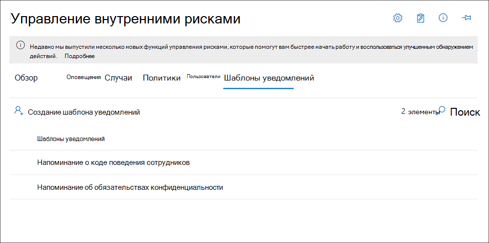

# <a name="insider-risk-management-notice-templates-preview"></a>Шаблоны уведомлений об управлении рисками для участников (Предварительная версия)

Шаблоны уведомления об управлении рисками для участников программы предварительной оценки позволяют отправлять сообщения электронной почты сотрудникам, когда их действия создают соответствующие политики и оповещения. В большинстве случаев действия сотрудников, которые создают оповещения, являются результатом ошибок или случайных действий без некорректного намерения. Уведомления являются простыми напоминаниями для сотрудников, которые могут быть более внимательны, а также для предоставления ссылок или сведений о актуальных учебных материалах или корпоративных политиках. Уведомления могут быть важной частью программы обучения по внутренней совместимости и могут помочь создать документированный журнал аудита для сотрудников с повторяющимися действиями по риску.

Создайте шаблоны примечаний, если вы хотите отправить пользователям уведомление о соответствии политики по электронной почте в рамках процесса разрешения проблем. Уведомления можно отправлять только на адрес электронной почты сотрудника, связанный с конкретным проверяемым оповещением. При выборе шаблона уведомления, применяемого к соответствию политики, можно выбрать, принимать ли значения полей, определенные в шаблоне, или заменять поля нужным образом.

## <a name="notice-templates-dashboard"></a>Панель мониторинга шаблонов уведомлений

**Панель мониторинга шаблонов уведомлений** отображает список настроенных шаблонов уведомлений и позволяет создавать новые шаблоны оповещений. Шаблоны примечаний указаны в обратном порядке по дате с последним шаблоном уведомлений, указанным в списке первым.



## <a name="html-for-notices"></a>HTML-код уведомлений

Если вы хотите создать больше простого текстового сообщения электронной почты для уведомлений, можно создать более подробное сообщение с помощью HTML в поле текст сообщения шаблона уведомления. В следующем примере представлен формат текста сообщения для базового шаблона уведомления электронной почты на основе HTML:

```HTML
<!DOCTYPE html>
<html>
<body>
<h2>Action Required: Contoso Employee Code of Conduct Policy Training</h2>
<p>A recent activity you've performed has generated a risk alert prohibited by the Contoso Employee <a href='https://www.contoso.com'>Code of Conduct Policy</a>.</p>
<p>You are required to attend the Contoso Employee Code of Conduct <a href='https://www.contoso.com'>training</a> within the next 14 days. Please contact <a href='mailto:hr@contoso.com'>Human Resources</a> with any questions about this training request.</p>
<p>Thank you,</p>
<p><em>Human Resources</em></p>
</body>
</html>
```

> [!NOTE]
> Реализация атрибута href в HTML в шаблонах уведомлений "Управление рисками" в настоящее время поддерживаются только одиночные кавычки вместо двойных кавычек для ссылок URL-адресов.

## <a name="create-a-new-notice-template"></a>Создание нового шаблона уведомления

Чтобы создать новый шаблон уведомления об управлении рисками для оценки, вы будете использовать мастер уведомлений в решении по **управлению рисками** в центре соответствия требованиям Microsoft 365.

Выполните указанные ниже действия, чтобы создать новый шаблон уведомления об управлении рисками для оценки.

1. В [центре соответствия требованиям Microsoft 365](https://compliance.microsoft.com)перейдите к разделу **Управление рисками для оценки** и перейдите на вкладку **шаблоны зауведомлений** .
2. Выберите **создать шаблон уведомления** , чтобы открыть мастер оповещений.
3. На странице **Создание нового шаблона уведомления** заполните следующие поля:
    - **Имя шаблона**: введите понятное имя для уведомления. Это имя отображается в списке уведомлений на панели мониторинга уведомлений и в списке выбора уведомлений при отправке уведомлений из случая.
    - **Отправить от**: введите адрес электронной почты отправителя для уведомления. Этот адрес будет отображаться в поле " **от:** " во всех уведомлениях, отправляемых сотрудникам, если при отправке уведомления из обращения не было внесено никаких изменений.
    - Поля **CC и BCC** : необязательные пользователи или группы, которые будут уведомлены о соотношении с политикой, выбранном из Active Directory для вашей подписки.
    - **Тема**: сведения, отображаемые в строке темы сообщения, поддерживают текстовые символы.
    - **Текст сообщения**: сведения, отображаемые в тексте сообщения, поддерживает текст или HTML-значения.
4. Выберите **создать** , чтобы создать и сохранить шаблон уведомления, или нажмите **кнопку Отмена** , чтобы закрыть окно без сохранения шаблона уведомления.

## <a name="update-a-notice-template"></a>Обновление шаблона уведомления

Чтобы обновить существующий шаблон уведомления об управлении рисками для оценки безопасности, выполните следующие действия:

1. В [центре соответствия требованиям Microsoft 365](https://compliance.microsoft.com)перейдите к разделу **Управление рисками для оценки** и перейдите на вкладку **шаблоны зауведомлений** .
2. На панели мониторинга оповещений выберите шаблон уведомления, который вы хотите изменить.
3. На странице сведения об уведомлении нажмите кнопку **изменить** .
4. На странице **редактирования** можно изменить следующие поля:
    - **Имя шаблона**: введите новое понятное имя для уведомления. Это имя отображается в списке уведомлений на панели мониторинга уведомлений и в списке выбора уведомлений при отправке уведомлений из случая.
    - **Отправить от**: обновите адрес электронной почты отправителя для уведомления. Этот адрес будет отображаться в поле " **от:** " во всех уведомлениях, отправляемых сотрудникам, если при отправке уведомления из обращения не было внесено никаких изменений.
    - Поля **"копия" и "СК"** : обновление необязательных пользователей или групп для получения уведомления о политике, выбранной в службе каталогов Active Directory для вашей подписки.
    - **Тема**: сведения об обновлении, которые отображаются в строке темы сообщения, поддерживают текстовые символы.
    - **Текст сообщения**: сведения об обновлении, которые отображаются в тексте сообщения, поддерживают текстовые или HTML-значения.
5. Нажмите кнопку **сохранить** , чтобы обновить и сохранить уведомление, или кнопку **Отмена** , чтобы закрыть окно без сохранения шаблона уведомления.

## <a name="delete-a-notice-template"></a>Удаление шаблона уведомления

Чтобы удалить существующий шаблон уведомления об управлении рисками, выполните следующие действия:

1. В [центре соответствия требованиям Microsoft 365](https://compliance.microsoft.com)перейдите к разделу **Управление рисками для оценки** и перейдите на вкладку **шаблоны зауведомлений** .
2. На панели мониторинга уведомлений выберите шаблон уведомления, который требуется удалить.
3. Нажмите значок **Удалить** на панели инструментов.
4. Чтобы удалить шаблон уведомления, выберите **Да** в диалоговом окне удаления. Чтобы отменить удаление, нажмите **кнопку Отмена**.
