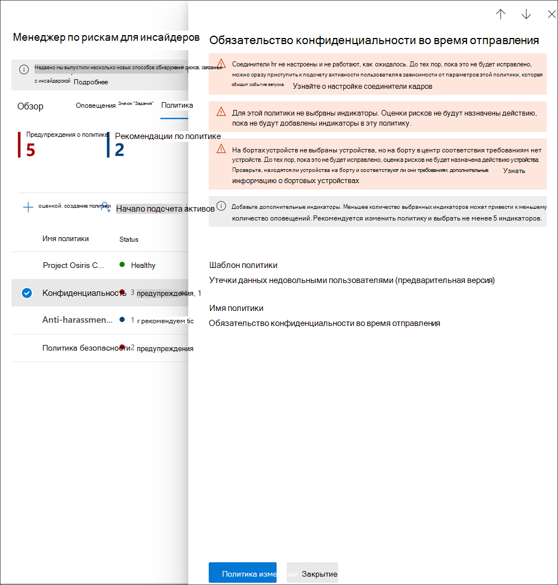

# <a name="insider-risk-management-policies"></a>Политики управления внутренними рисками

Политики управления внутренними рисками определяют, какие пользователи находятся в зоне внимания и о каких индикаторах риска высылаются оповещения. Вы можете быстро создать политику, применяемую ко всем пользователям в организации, или определить отдельных пользователей или группы для управления в политике. Политики поддерживают приоритеты содержимого, чтобы сосредоточиться на условиях политики на нескольких или определенных Microsoft Teams, сайтах SharePoint, типах конфиденциальности данных и метках данных. С помощью шаблонов можно выбирать определенные индикаторы риска и настраивать пороговые значения событий для индикаторов политики, эффективно настраивая оценки риска, а также уровень и частоту оповещений. Кроме того, усилители оценок риска и обнаружения аномалий помогают определить действия пользователей, которые имеют более высокую важность или более необычны. Окна политик позволяют определить период времени применения политики к действиям оповещений и используются для определения длительности действия политики после ее активации.

Посмотрите [видеоролик о конфигурации политик управления внутренними рисками](https://www.youtube.com/watch?v=kudK5ajZTUo), чтобы узнать, как политики, созданные с помощью встроенных шаблонов политик, могут помочь вам быстро принять меры по устранению потенциальных рисков.

## <a name="policy-dashboard"></a>Панель мониторинга политики

**Панель мониторинга политики** позволяет быстро просматривать политики в организации, состояние работоспособности политики, вручную добавлять пользователей в политики и просматривать состояние оповещений, связанных с каждой политикой.

- **Имя политики:** имя, назначенное политике в мастере политик.
- **Состояние**: состояние работоспособности для каждой политики. Отображает количество предупреждений и рекомендаций политики или состояние *работоспособности* для политик без проблем.  Вы можете щелкнуть политику, чтобы просмотреть сведения о состоянии работоспособности для всех предупреждений или рекомендаций.
- **Активные оповещения:** количество активных оповещений для каждой политики.
- **Подтвержденные оповещения:** общее количество оповещений, которые привели к случаям из политики за последние 365 дней.
- **Обработанные оповещения:** общее количество оповещений, которые были подтверждены или отклонены за последние 365 дней.
- **Эффективность оповещений политики:** процент, определяемый общим числом подтвержденных оповещений, деленный на общее количество обработанных оповещений (что представляет собой количество оповещений, которые были подтверждены или отклонены за последние 365 дней).


## <a name="policy-recommendations-from-analytics-preview"></a>Рекомендации по политикам из аналитики (предварительная версия)

Аналитика внутренних рисков позволяет проводить оценку потенциальных внутренних рисков в организации без настройки каких-либо политик внутренних рисков. Эта оценка поможет вашей организации определить потенциальные области с более высоким риском для пользователей и определить тип и область политик управления внутренними рисками, которую можно настроить.

Дополнительные информацию об аналитике внутренних рисков и рекомендациях по политикам см. в разделе [Параметры управления внутренними рисками: аналитика (предварительная версия)](insider-risk-management-settings.md#analytics-preview).

## <a name="policy-templates"></a>Шаблоны политик

Шаблоны управления внутренними рисками — это заранее определенные условия политики, которые определяют типы индикаторов риска и модели оценки рисков, используемые политикой. Перед созданием каждой политике должен быть назначен шаблон в мастере создания политик. Управление внутренними рисками поддерживает до пяти политик для каждого шаблона политики. При создании новой политики управления внутренними рисками с помощью мастера политики вы можете выбрать один из следующих шаблонов политик:

### <a name="data-theft-by-departing-users"></a>Кража данных уходящими пользователями

Когда пользователи уходят из организации, существуют определенные индикаторы риска, которые обычно связаны с кражей данных уходящими пользователями. В этом шаблоне политики используются индикаторы кражи для оценки рисков и основное внимание уделяется обнаружению и оповещениям в этой области риска. Кража данных уходящими пользователями может включать скачивание файлов из SharePoint Online, печать файлов и копирование данных в личные облачные службы обмена сообщениями и службы хранения перед увольнением и окончанием работы. Используя соединители отдела кадров Microsoft 365 или возможность автоматического отслеживания удаления учетных записей пользователей в Azure Active Directory для вашей организации, этот шаблон начинает оценку индикаторов риска, связанных с этими действиями, и то, как они соотносятся с состоянием занятости пользователя.

> [!IMPORTANT]
> При использовании этого шаблона можно настроить соединители отдела кадров Microsoft 365 для периодического импорта сведений о дате увольнения и отставки для пользователей в организации. Пошаговую инструкцию по настройке соединителя отдела кадров Microsoft 365 для организации см. в статье [Импорт данных с помощью соединителя отдела кадров](import-hr-data.md). Если вы решили не использовать соединитель отдела кадров, при настройке событий-триггеров в мастере политики необходимо выбрать параметр "Учетная запись пользователя удалена из Azure AD".

### <a name="general-data-leaks"></a>Общие утечки данных

Защита данных и предотвращение утечек данных — это постоянная задача для большинства организаций, особенно с учетом быстрого роста новых данных, создаваемых пользователями, устройствами и службами. Пользователи могут создавать, хранить и обмениваться информацией между службами и устройствами, что делает управление утечками данных все более сложным. Утечки данных могут включать случайное раскрытие информации за пределами вашей организации или кражу данных со злым умыслом. С помощью назначенной политики защиты от потери данных (DLP) или встроенного инициирующего события этот шаблон начинает оценку обнаружения подозрительных загрузок данных SharePoint Online, совместного использования файлов и папок, печати файлов и копирования данных в личные облачные службы обмена сообщениями и службы хранения в режиме реального времени.

При использовании шаблона *Утечки данных* можно назначить политику защиты от потери данных для запуска индикаторов в политике управления внутренними рисками для оповещений высокой важности в вашей организации. Когда в журнал аудита Office 365 добавляется оповещение высокой важности, созданное правилом политики защиты от потери данных, политики управления внутренними рисками, созданные с помощью этого шаблона, автоматически проверяют оповещение политики защиты от потери данных высокой важности. Если оповещение содержит пользователя в области, определенного в политике управления внутренними рисками, оповещение обрабатывается политикой управления внутренними рисками как новое оповещение, и ему присваивается важность внутреннего риска и оценка риска. Эта политика позволяет оценить это оповещение в контексте других действий, включенных в дело. Если политика защиты от потери данных не выбрана, необходимо выбрать встроенное инициирующее событие.

#### <a name="data-leaks-policy-guidelines"></a>Рекомендации политики утечек данных

При создании или изменении политик защиты от потери данных для использования с политиками управления внутренними рисками следует учитывать следующие рекомендации:

- Назначьте приоритеты для событий кражи данных и будьте избирательны при назначении параметрам **отчетов об инцидентах** *высокой* важности при настройке правил в политиках защиты от потери данных. Например, отправка конфиденциальных документов известному конкуренту должна быть определена как событие утечки с оповещением *высокой* важности. Чрезмерное назначение *высокого* уровня важности в параметрах **отчетов об инцидентах** в других правилах политики защиты от потери данных может усилить шум в рабочем процессе оповещений управления внутренними рисками и затруднить правильную оценку этих оповещений исследователями и аналитиками данных. Например, назначение оповещений с *высоким* уровнем важности для получения доступа к действиям типа "отказ в доступе" в политиках защиты от потери данных усложняет оценку действительно рискованного поведения и действий пользователя.
- Убедитесь, что вы понимаете и правильно настраиваете пользователей в рамках как политики защиты от потери данных, так и политики управления внутренними рисками. Только пользователи, определенные как подпадающие под действие политик управления внутренними рисками с использованием шаблона **утечек данных**, будут обрабатывать оповещения политики защиты от потери данных высокой важности. Кроме того, только пользователи, подпадающие под действие правила для оповещения политики защиты от потери данных высокой важности, будут рассмотрены политикой управления внутренними рисками. Важно не настраивать пользователей, входящих в область действия политики защиты от потери данных и политики управления внутренними рисками в конфликтной манере.

     Например, если ваши правила политики защиты от потери данных предназначены только для пользователей из отдела продаж, а политика управления внутренними рисками, созданная на основе шаблона **утечек данных**, определила всех пользователей как входящих в область действия, политика управления внутренними рисками будет фактически обрабатывать только оповещения политики защиты от потери данных высокой важности для пользователей из отдела продаж. Политика управления внутренними рисками не будет получать оповещения политики защиты от потери данных высокой важности для обработки пользователями, которые не определены в правилах политики защиты от потери данных в этом примере. И наоборот, если политика управления внутренними рисками, созданная на основе шаблонов **утечек данных**, распространяется только на пользователей из отдела продаж, а назначенная политика защиты от потери данных распространяется на всех пользователей, политика управления внутренними рисками будет обрабатывать только оповещения политики защиты от потери данных высокой важности для сотрудников отдела продаж. Политика управления внутренними рисками для сотрудников группы продаж будет игнорировать оповещения политики защиты от потери данных высокой важности для всех пользователей, не являющихся сотрудниками отдела продаж.

- Убедитесь, что параметр правила **отчетов об инцидентах** в политике защиты от потери данных, используемой для этого шаблона управления внутренними рисками, настроен для оповещений *высокой* важности. *Высокий* уровень важности — это инициирующие события, и оповещения управления внутренними рисками не будут создаваться из правил в политиках защиты от потери данных с полем **отчетов об инцидентах** с *низким* или *средним* уровнем важности.

    

     > [!NOTE]
     > При создании новой политики защиты от потери данных с помощью встроенных шаблонов необходимо выбрать параметр **Создать или настроить расширенные правила защиты от потери данных**, чтобы настроить параметр **отчетов об инцидентах** для *высокого* уровня важности.

Каждой политике управления внутренними рисками, созданной из шаблона **утечек данных**, может быть назначена только одна политика защиты от потери данных. Рассмотрите возможность создания специальной политики защиты от потери данных, которая объединяет различные действия, которые вы хотите обнаружить и выступать в качестве инициирующих событий для политик управления внутренними рисками, которые используют шаблон **утечек данных**.

Пошаговые инструкции по настройке политик защиты от потери данных для организации см. в статье [Создание, тестирование и настройка политики защиты от потери данных](create-test-tune-dlp-policy.md).

### <a name="data-leaks-by-priority-users-preview"></a>Утечки данных приоритетными пользователями (предварительный просмотр)

Защита данных и предотвращение утечки данных для пользователей в организации может зависеть от их должности, уровня доступа к конфиденциальной информации или истории рисков. Утечки данных включают случайное раскрытие конфиденциальной информации за пределами вашей организации или кражу данных со злым умыслом. С помощью назначенной политики защиты от потери данных (DLP) этот шаблон запускает оценку обнаружения подозрительных действий в режиме реального времени и повышает вероятность оповещений о внутреннем риске и оповещений с более высоким уровнем важности. Приоритетные пользователи определяются в [группах приоритетных пользователей](insider-risk-management-settings.md#priority-user-groups-preview), настроенных в области параметров управления внутренними рисками.

Как и в случае с **шаблоном общих утечек данных**, необходимо назначить политику защиты от потери данных для запуска индикаторов в политике управления внутренними рисками для оповещений высокой важности в вашей организации. При создании политики с помощью этого шаблона следуйте рекомендациям политики утечек данных, которые были указаны выше. Кроме того, вам потребуется назначить группы приоритетных пользователей, созданные в разделах политики **Управление внутренними рисками** > **Параметры** > **Группы приоритетных пользователей**.

### <a name="data-leaks-by-disgruntled-users-preview"></a>Утечки данных недовольными пользователями (предварительная версия)

Когда пользователи сталкиваются с факторами стресса, связанными с работой, они могут разочароваться, что может увеличить вероятность действий внутреннего риска. Этот шаблон запускает оценку действий пользователей при обнаружении индикатора, связанного с недовольством. Примеры включают уведомления об улучшении производительности, оценки низкой производительности или изменения состояния на уровне задания. Утечки данных недовольными пользователей могут включать скачивание файлов из SharePoint Online и копирование данных в личные облачные службы обмена сообщениями и службы хранения вблизи стрессовых событий на работе.

При использовании этого шаблона необходимо также настроить соединители отдела кадров Microsoft 365 для периодического импорта уведомлений об улучшении производительности, состояния проверки низкой производительности или сведений об изменении уровня задания для пользователей в организации. Пошаговую инструкцию по настройке соединителя отдела кадров Microsoft 365 для организации см. в статье [Импорт данных с помощью соединителя отдела кадров](import-hr-data.md).

### <a name="general-security-policy-violations-preview"></a>Общие нарушения политики безопасности (предварительная версия)

Во многих организациях пользователи имеют разрешение на установку программного обеспечения на своих устройствах или изменение параметров устройства для выполнения задач. Случайно или со злым умыслом пользователи могут установить вредоносное ПО или отключить важные функции безопасности, которые помогают защитить информацию на устройстве или в сетевых ресурсах. Этот шаблон политики использует оповещения системы безопасности от Microsoft Defender для конечной точки, чтобы начать оценку этих действий, а также сосредоточиться на обнаружении и оповещениях в этой области риска. Используйте этот шаблон для анализа нарушений политики безопасности в сценариях, когда у пользователей может быть история нарушений политики безопасности, которая может быть индикатором внутреннего риска.

Необходимо настроить Microsoft Defender для конечной точки в вашей организации и включить Defender для конечной точки для интеграции управления внутренними рисками в Центре безопасности Defender для импорта оповещений о нарушениях безопасности. Дополнительные сведения о настройке Defender для конечной точки для интеграции управления внутренними рисками см. в статье [Настройка расширенных функций в Defender для конечной точки](/windows/security/threat-protection/microsoft-defender-atp/advanced-features#share-endpoint-alerts-with-microsoft-compliance-center).

### <a name="security-policy-violations-by-departing-users-preview"></a>Нарушения политики безопасности уходящими пользователями (предварительная версия)

Уходящие пользователи, независимо от того, уходят ли они на положительных или отрицательных условиях, могут быть подвержены более высокому риску нарушения политики безопасности. Чтобы защитить уходящих пользователей от непреднамеренных или вредоносных нарушений безопасности, в этом шаблоне политики используются оповещения Defender для конечной точки, позволяющие получать сведения о действиях, связанных с безопасностью. Эти действия включают установку пользователем вредоносного ПО или других потенциально вредоносных приложений и отключение функций безопасности на своих устройствах. Используя [соединители отдела кадров Microsoft 365](import-hr-data.md) или возможность автоматического отслеживания удаления учетных записей пользователей в Azure Active Directory для вашей организации, этот шаблон начинает оценку индикаторов риска, связанных с этими действиями безопасности, и то, как они соотносятся с состоянием занятости пользователя.

Необходимо настроить Microsoft Defender для конечной точки в вашей организации и включить Defender для конечной точки для интеграции управления внутренними рисками в Центре безопасности Defender для импорта оповещений о нарушениях безопасности. Дополнительные сведения о настройке Defender для конечной точки для интеграции управления внутренними рисками см. в статье [Настройка расширенных функций в Defender для конечной точки](/windows/security/threat-protection/microsoft-defender-atp/advanced-features#share-endpoint-alerts-with-microsoft-compliance-center).

### <a name="security-policy-violations-by-priority-users-preview"></a>Нарушения политики безопасности приоритетными пользователями (предварительная версия)

Защита пользователей от нарушений безопасности в организации может зависеть от их должности, уровня доступа к конфиденциальной информации или истории рисков. Поскольку нарушения безопасности приоритетными пользователями могут иметь значительное влияние на критические области вашей организации, этот шаблон политики начинает оценивать эти индикаторы и использует предупреждения Microsoft Defender для конечной точки, чтобы получить представление о действиях, связанных с безопасностью, для этих пользователей. Эти действия могут включать установку приоритетными пользователями вредоносного ПО или других потенциально вредоносных приложений и отключение функций безопасности на своих устройствах. Приоритетные пользователи определяются в группах приоритетных пользователей, настроенных в области параметров управления внутренними рисками.

Необходимо настроить Microsoft Defender для конечной точки в вашей организации и включить Defender для конечной точки для интеграции управления внутренними рисками в Центре безопасности Defender для импорта оповещений о нарушениях безопасности. Дополнительные сведения о настройке Defender для конечной точки для интеграции управления внутренними рисками см. в статье [Настройка расширенных функций в Defender для конечной точки](/windows/security/threat-protection/microsoft-defender-atp/advanced-features#share-endpoint-alerts-with-microsoft-compliance-center). Кроме того, вам потребуется назначить группы приоритетных пользователей, созданные в разделах политики **Управление внутренними рисками** > **Параметры** > **Группы приоритетных пользователей**.

### <a name="security-policy-violations-by-disgruntled-users-preview"></a>Нарушения политики безопасности недовольными пользователями (предварительная версия)

Пользователи, которые сталкиваются с факторами стресса при работе, могут подвергаться более высокому риску непреднамеренных или вредоносных нарушений политики безопасности. Эти факторы стресса могут включать включение пользователя в план улучшения производительности, плохое состояние проверки производительности или понижение в должности с текущей должности. Этот шаблон политики запускает оценку рисков на основе этих индикаторов и действий, связанных с этими событиями для этих пользователей.

При использовании этого шаблона необходимо также настроить соединители отдела кадров Microsoft 365 для периодического импорта уведомлений об улучшении производительности, состояния проверки низкой производительности или сведений об изменении уровня задания для пользователей в организации. Пошаговую инструкцию по настройке соединителя отдела кадров Microsoft 365 для организации см. в статье [Импорт данных с помощью соединителя отдела кадров](import-hr-data.md).

Необходимо также настроить Microsoft Defender для конечной точки в вашей организации и включить Defender для конечной точки для интеграции управления внутренними рисками в Центре безопасности Defender для импорта оповещений о нарушениях безопасности. Дополнительные сведения о настройке Defender для конечной точки для интеграции управления внутренними рисками см. в статье [Настройка расширенных функций в Defender для конечной точки](/windows/security/threat-protection/microsoft-defender-atp/advanced-features#share-endpoint-alerts-with-microsoft-compliance-center).

### <a name="policy-template-prerequisites-and-triggering-events"></a>Необходимые условия шаблона политики и инициирующие события

В зависимости от выбранного шаблона для политики управления внутренними рисками, инициирующие события и необходимые условия политики различаются. Инициирующие события — это необходимые условия, которые определяют, активен ли пользователь для политики управления внутренними рисками. Если пользователь добавлен в политику управления внутренними рисками, но не имеет инициирующего события, действия пользователя не оцениваются политикой, если они не добавлены вручную на панели управления "Пользователи". Необходимые условия политики — это элементы, необходимые для того, чтобы политика получала сигналы или действия, необходимые для оценки риска.

В следующей таблице перечислены инициирующие события и необходимые условия для политик, созданных на основе каждого шаблона политики управления внутренними рисками:

| **Шаблон политики** | **Инициирующие события политик** | **Необходимые условия** |
| :------------------ | :--------------------------------- | :---------------- |
| Кража данных уходящими пользователями | Индикатор даты отставки или увольнения из соединителя отдела кадров | (необязательно) Соединитель отдела кадров Microsoft 365, настроенный для индикаторов даты отставки и увольнения, или интеграция Azure Active Directory включена |
| Общие утечки данных | Действие политики утечки данных, которое создает оповещение высокой важности | (необязательно) Политика защиты от потери данных, настроенная для оповещений высокой важности или встроенного инициирующего события кражи данных |
| Утечки данных приоритетными пользователями | Действие политики утечки данных, которое создает оповещение *высокой* важности или встроенные события-триггеры кражи данных | (необязательно) Политика защиты от потери данных, настроенная для оповещений высокой важности <br><br> Группы приоритетных пользователей, настроенные в параметрах управления внутренними рисками |
| Утечки данных недовольными пользователями | Индикаторы повышения производительности, низкой производительности или изменения уровня задания из соединителя отдела кадров | Соединитель отдела кадров Microsoft 365, настроенный для индикаторов недовольства |
| Общие нарушения политики безопасности | Уклонение от элементов управления безопасностью или нежелательного программного обеспечения, обнаруженного Microsoft Defender для конечной точки | Активная подписка Microsoft Defender для конечной точки <br><br> Настроена интеграция Microsoft Defender для конечной точки с Центром соответствия требованиям Microsoft 365 |
| Нарушения политики безопасности уходящими пользователями | Индикаторы даты отставки или увольнения от соединителя отдела кадров или удаления учетной записи Azure Active Directory | (необязательно) Соединитель отдела кадров Microsoft 365, настроенный для индикаторов даты отставки и увольнения <br><br> Активная подписка Microsoft Defender для конечной точки <br><br> Настроена интеграция Microsoft Defender для конечной точки с Центром соответствия требованиям Microsoft 365 |
| Нарушения политики безопасности приоритетными пользователями | Уклонение от элементов управления безопасностью или нежелательного программного обеспечения, обнаруженного Microsoft Defender для конечной точки | Активная подписка Microsoft Defender для конечной точки <br><br> Настроена интеграция Microsoft Defender для конечной точки с Центром соответствия требованиям Microsoft 365 <br><br> Группы приоритетных пользователей, настроенные в параметрах управления внутренними рисками |
| Нарушения политики безопасности недовольными пользователями | Индикаторы повышения производительности, низкой производительности или изменения уровня задания из соединителя отдела кадров | Соединитель отдела кадров Microsoft 365, настроенный для индикаторов недовольства <br><br> Активная подписка Microsoft Defender для конечной точки <br><br> Настроена интеграция Microsoft Defender для конечной точки с Центром соответствия требованиям Microsoft 365 |

## <a name="prioritize-content-in-policies"></a>Определение приоритетов содержимого в политиках

Политики управления внутренними рисками поддерживают определение более высокой важности для содержимого в зависимости от места его хранения или классификации. Указание содержимого в качестве приоритета увеличивает оценку риска для любого связанного с ним действия, что, в свою очередь, увеличивает вероятность создания оповещения высокой важности. Однако некоторые действия не будут создавать оповещение, если связанное содержимое не содержит встроенные или пользовательские типы конфиденциальной информации или не указано в качестве приоритета в политике.

Например, у вашей организации есть выделенный сайт SharePoint для строго конфиденциального проекта. Утечка данных на этом сайте SharePoint может скомпрометировать проект и существенно повлиять на его успех. При назначении этому сайту SharePoint приоритета в политике утечки данных автоматически повышаются оценки риска для соответствующих действий. Такая приоритезация увеличивает вероятность того, что эти действия создают оповещение о внутреннем риске, и повышает степень серьезности оповещения.

При создании политики управления внутренними рисками в мастере политики можно выбрать один из следующих приоритетов:

- **Сайты SharePoint**: все действия, связанные со всеми типами файлов на определенных сайтах SharePoint, получают более высокую оценку риска. 
- **Типы конфиденциальной информации**: все действия, связанные с содержимым, которое содержит [типы конфиденциальной информации](sensitive-information-type-entity-definitions.md), получают более высокую оценку риска.
- **Метки конфиденциальности**: все действия, связанные с содержимым, которое содержит [метки конфиденциальности](sensitivity-labels.md), получают более высокую оценку риска.

## <a name="sequence-detection-preview"></a>Обнаружение последовательности (предварительная версия)

Рискованные действия не могут происходить как изолированные события. Эти риски часто являются частью более широкой последовательности событий. Последовательность — это группа из двух или более действий пользователей, выполняемых одно за другим, которые могут указывать на повышенный риск. Определение этих связанных действий является важной частью оценки общего риска. Если для политик кражи данных или утечки данных включено обнаружение последовательности, на вкладке **Действия пользователя** отображаются сведения о действиях, связанных со сведениями о последовательности, в деле об управлении внутренними рисками. Следующие шаблоны политик поддерживают обнаружение последовательности:

- Кража данных уходящими пользователями
- Общие утечки данных
- Утечки данных приоритетными пользователями
- Утечки данных недовольными пользователями

Эти политики управления внутренними рисками могут использовать определенные индикаторы и порядок их возникновения для выявления каждого шага в последовательности рисков. Имена файлов используются при сопоставлении действий в последовательности. Эти риски организованы по четырем основным категориям действий:

- **Сбор**: эта категория сигнализирует о действиях по загрузке, выполняемых пользователями политики в рамках области действия. Примером действий в этой категории может быть скачивание файлов с сайтов SharePoint.
- **Кража данных**: эта категория сигнализирует о действиях по совместному использованию или кражи данных из внутренних и внешних источников пользователями политик в рамках области действия. Примером действий в этой категории может быть отправка сообщений электронной почты с вложениями из организации внешним получателям.
- **Обфускация**: эта категория сосредоточены на маскировке действий риска пользователями политики в рамках области действия. Примером действия в этой категории может быть переименование файлов на устройстве.
- **Очистка**: эта категория сигнализирует о действиях по удалении, выполняемых пользователями политики в рамках области действия. Примером действия в этой категории может быть удаление файлов с устройства.

> [!NOTE]
> При обнаружении последовательности используются индикаторы, включенные в глобальные параметры управления внутренними рисками, и индикаторы, выбранные в политике. Если соответствующие индикаторы не выбраны, обнаружение последовательности не будет работать.

При настройке политики можно настроить отдельные параметры пороговых значений для каждого типа обнаружения последовательности. Эти параметры пороговых значений настраивают оповещения в зависимости от объема файлов, связанных с последовательностью.

Дополнительные сведения об управлении обнаружением последовательности в представлении **Действия пользователей** см. в разделе [Случаи управления внутренними рисками: Действия пользователей](insider-risk-management-cases.md#user-activity).

## <a name="cumulative-exfiltration-detection-preview"></a>Обнаружения накопительных краж данных (предварительная версия)

Индикаторы внутренних рисков помогают выявлять необычные уровни рискованных действий при ежедневной оценке пользователей, подпадающих под действие политик внутренних рисков. Обнаружение накопительных краж данных использует модели машинного обучения, чтобы помочь вам определить, когда действия кражи данных пользователем превышают средние значения по организации при измерении во времени и по нескольким типам действий кражи данных. Аналитики и исследователи по управлению внутренними рисками могут использовать обнаружения накопительных краж данных, чтобы помочь выявить действия кражи, которые обычно не создают оповещения, но превышают типичные значения для их организации. Некоторые примеры могут заключаться в том, что уходящие пользователи медленно извлекают данные в течение определенного периода или когда пользователи обмениваются данными по нескольким каналам чаще, чем обычно, для обмена данными в вашей организации.

При использовании следующих шаблонов политики по умолчанию включены обнаружения накопительных краж данных:

- Кража данных уходящими пользователями
- Общие утечки данных
- Утечки данных приоритетными пользователями
- Утечки данных недовольными пользователями

> [!NOTE]
> При обнаружении накопительных краж данных используются индикаторы кражи данных, включенные в глобальные параметры управления внутренними рисками, а также индикаторы кражи данных, выбранные в политике. Таким образом, обнаружения накопительных краж данных оцениваются только для выбранных необходимых индикаторов кражи данных.

Если для политик кражи данных или утечки данных включено обнаружение накопительных краж данных, на вкладке **Действия пользователя** отображаются сведения о действиях, связанных с обнаружением накопительных краж данных, в деле об управлении внутренними рисками.

Дополнительные сведения об управлении действиями пользователями см. в разделе [Случаи управления внутренними рисками: Действия пользователей](insider-risk-management-cases.md#user-activity).

## <a name="policy-health-preview"></a>Работоспособность политики (предварительная версия)

Состояние работоспособности политики дает представление о потенциальных проблемах с вашими политиками управления внутренними рисками. Столбец "Состояние" на вкладке "Политики" может предупредить вас о проблемах политик, которые могут препятствовать отправке отчетов о действиях пользователей или о причинах необычного количества оповещений о действиях. Состояние работоспособности политики также может подтвердить, что политика работоспособна и не требует внимания или изменения конфигурации.

Если с политикой имеются проблемы, в состоянии работоспособности политики отображаются уведомления и рекомендации, которые помогут вам принять меры для решения проблем с политикой. Эти уведомления помогут устранить следующие проблемы:

- Политики с неполной конфигурацией. Эти проблемы могут включать отсутствующих пользователей или группы в политике или другие незавершенные действия по настройке политики.
- Политики с проблемами конфигурации индикатора. Индикаторы являются важной частью каждой политики. Если индикаторы не настроены или выбрано слишком мало индикаторов, политика может не оценивать действия риска должным образом.
- Триггеры политики не работают или требования к триггерам политики настроены неправильно. Функциональные возможности политики могут зависеть от других служб или требований к конфигурации для эффективного обнаружения инициирующих событий для активации присвоения оценок риска пользователям в политике. Эти зависимости могут включать проблемы с конфигурацией соединители, совместном доступом к оповещениям в Microsoft Defender для конечной точки или параметрам конфигурации политики защиты от потери данных.
- Ограничения объемов приближены или превышены. Политики управления внутренними рисками используют многочисленные службы и конечные точки Microsoft 365 для агрегирования сигналов действий риска. В зависимости от количества пользователей в ваших политиках ограничения объемов могут задерживать выявление действий риска и представление отчетов о них. Подробнее об этих ограничениях можно узнать в разделе "Ограничения шаблона политики" этой статьи.

Чтобы быстро просмотреть состояние работоспособности политики, перейдите на вкладку "Политика" и в столбец "Состояние". Здесь вы увидите следующие параметры состояния работоспособности политики каждой политики:

- Работоспособна. Никаких проблем с политикой не выявлено.
- Рекомендации. Существует ряд проблем с политикой, которые могут препятствовать ее работе.
- Предупреждения. Существуют проблемы с политикой, которые не могут идентифицировать действия риска.

Для получения дополнительных сведений о рекомендациях или предупреждениях выберите политику на вкладке **Политики**, чтобы открыть карточку сведений о политике. Дополнительные сведения о рекомендациях и предупреждениях, в том числе рекомендации по устранению этих проблем, будут отображаться в разделе "Уведомления" карточки сведений.



В следующей таблице вы узнаете больше о рекомендациях, предупреждениях и действиях, которые необходимо принять для устранения потенциальных проблем.

|**Сообщения с уведомлениями**|**Шаблоны политик**|**Причины / Попробуйте это действие, чтобы исправить**|
|:------------------------|:-------------------|:---------------------------|
| Политика не назначает оценки риска действиям | Все шаблоны политик | Вам может потребоваться просмотреть область политики и конфигурации инициирующих событий, чтобы политика могла назначать оценки риска действиям <br><br> 1. Просмотрите пользователей, выбранных для политики. Если выбрано несколько пользователей, может потребоваться выбрать дополнительных пользователей. <br> 2. Если вы используете соединителя отдела кадров, убедитесь, что соединитель отдела кадров отправляет правильные данные. <br> 3. Если вы используете политику защиты от потери данных в качестве инициирующего события, проверьте конфигурацию политики DLP, чтобы убедиться, что она настроена для использования в этой политике. <br> 4. Для политик нарушения безопасности просмотрите состояние сортировки оповещений Microsoft Defender для конечной точки, выбранное в разделе "Параметры внутренних рисков" > "Интеллектуальные обнаружения". Подтвердите, что фильтр оповещений не слишком узкий. |
| Политика не создала никаких оповещений | Все шаблоны политик | Может потребоваться просмотреть конфигурацию политики, чтобы проанализировать оценку нужных действий. <br><br> 1. Подтвердите выбранные индикаторы, которые вы хотите оценить. Чем больше индикаторов выбрано, тем большему количеству действий назначаются оценки риска. <br> 2. Просмотрите настройку пороговых значений для политики. Если выбранные пороговые значения не соответствуют допустимому уровню риска вашей организации, настройте выбор так, чтобы оповещения создавались на основе предпочтительных пороговых значений. <br> 3. Просмотрите пользователей и группы, выбранные для политики. Убедитесь, что вы выбрали всех подходящих пользователей и групп. <br> 4. Для политик нарушения безопасности убедитесь, что вы выбрали статус сортировки предупреждений, который вы хотите оценивать для оповещений Microsoft Defender для конечной точки в интеллектуальных обнаружениях в параметрах.|
| В эту политику не включены пользователи или группы | Все шаблоны политик | Пользователи или группы не назначены политике. <br><br> Изменение политики и выбор пользователей или групп для политики. |
| Для этой политики не выбраны индикаторы | Все шаблоны политик | Индикаторы не выбраны для политики <br><br> Изменение политики и выбор соответствующих индикаторов политики. |
| В эту политику не включены группы приоритетных пользователей | - Утечки данных приоритетными пользователями <br> - Нарушения политики безопасности приоритетными пользователями | Группы приоритетных пользователей не назначены политике. <br><br> Настройте группы приоритетных пользователей в параметрах управления внутренними рисками и назначьте группы приоритетных пользователей политике. |
| Для этой политики не выбрано инициирующее событие | Все шаблоны политик | Инициирующее событие не настроено для политики <br><br> Оценки риска не будут назначены действиям пользователей, пока вы не отредактируете политику и не выберете инициирующее событие. |
| Соединитель отдела кадров не настроен или не работает должным образом | - Кража данных уходящим пользователем <br> - Нарушения политики безопасности уходящим пользователем <br> - Утечки данных недовольными пользователями <br> - Нарушения политики безопасности недовольными пользователями | Существует проблема с соединителем отдела кадров. <br><br> 1. Если вы используете соединителя отдела кадров, убедитесь, что соединитель отдела кадров отправляет правильные данные <br><br> ИЛИ <br><br> 2. Выберите учетную запись Azure AD удаления учетной записи Azure AD. |
| Устройства не подключены | - Кража данных уходящими пользователями <br> - Общие утечки данных <br> - Утечки данных недовольными пользователями <br> - Утечки данных приоритетными пользователями | Индикаторы устройств выбраны, но в Microsoft 365 нет подключенных устройств <br><br> Проверьте подключение устройств и соответствие требованиям. |
| Соединитель отдела кадров в последнее время не загружал данные | - Кража данных уходящим пользователем <br> - Нарушения политики безопасности уходящим пользователем <br> - Утечки данных недовольными пользователями <br> - Нарушения политики безопасности недовольными пользователями | Соединитель отдела кадров не импортировал данные более 7 дней. <br><br> Проверьте правильность настройки соединителя отдела кадров и отправку данных. |
| Не удается проверить состояние соединителя отдела кадров. Повторите попытку позже | - Кража данных уходящим пользователем <br> - Нарушения политики безопасности уходящим пользователем <br> - Утечки данных недовольными пользователями <br> - Нарушения политики безопасности недовольными пользователями | Решение по управлению внутренними рисками не может проверить состояние вашего соединителя отдела кадров. <br><br> Проверьте правильность настройки соединителя отдела кадров и отправку данных, а также проверьте состояние политики.  |
| Политика защиты от потери данных не выбрана в качестве инициирующего события | - Общие утечки данных <br> - Утечки данных приоритетными пользователями | Политика защиты от потери данных не была выбрана в качестве инициирующего события, или выбранная политика защиты от потери данных была удалена. <br><br> Измените политику и выберите активную политику защиты от потери данных или установить событие "Пользователь выполняет действие кражи" в качестве инициирующего события в конфигурации политики. |
| В этой политике выключено использование политики защиты от потери данных | - Общие утечки данных <br> - Утечки данных приоритетными пользователями | В этой политике выключено использование политики защиты от потери данных. <br><br> 1. Включите политику защиты от потери данных, назначенную этой политике. <br><br> ИЛИ <br><br> 2. Измените политику и выберите новую политику защиты от потери данных или установить событие "Пользователь выполняет действие кражи" в качестве инициирующего события в конфигурации политики. |
| Политика защиты от потери данных не соответствует требованиям | - Общие утечки данных <br> - Утечки данных приоритетными пользователями | Политики защиты от потери данных, используемые в качестве инициирующих событий, должны быть настроены для создания оповещений высокой важности. <br><br>  1. Измените политику защиты от потери данных, чтобы назначить применимым оповещениям *высокий уровень важности*. <br><br> ИЛИ <br><br> 2. Отредактируете эту политику и выберите *Пользователь выполняет действие кражи* в качестве инициирующего события. |
| У вашей организации нет подписки на Microsoft Defender для конечной точки | - Общие нарушения политики безопасности <br> - Нарушения политики безопасности уходящими пользователями <br> - Нарушения политики безопасности недовольными пользователями <br> - Нарушения политики безопасности приоритетными пользователями | Активная подписка на Microsoft Defender для конечной точки не обнаружена для вашей организации. <br><br> Пока не будет добавлена подписка на Microsoft Defender для конечной точки, эти политики не будут назначать оценки риска для действий пользователей. |
| Оповещения Microsoft Defender для конечной точки не передаются в Центр соответствия требованиям | - Общие нарушения политики безопасности <br> - Нарушения политики безопасности уходящими пользователями <br> - Нарушения политики безопасности недовольными пользователями <br> - Нарушения политики безопасности приоритетными пользователями | Оповещения Microsoft Defender для конечной точки не передаются в центр соответствия требованиям. <br><br> Настройка общего доступа к оповещениям Microsoft Defender для конечной точки. |
| Вы приближаетесь к максимальному количеству пользователей, активно оцениваемых для этого шаблона политики. | Все шаблоны политик | Каждый шаблон политики имеет максимальное количество пользователей в области действия. См. сведения о разделе ограничения шаблона. <br><br> Просмотрите пользователей на вкладке "Пользователи" и удалите всех пользователей, для которых больше не требуется оценка. |

## <a name="policy-template-limits"></a>Ограничения шаблона политики

В шаблонах политики управления внутренними рисками используются ограничения для управления объемом и скоростью обработки входящих в область действия рисков для пользователей и тем, как этот процесс интегрирован с поддерживающими службами Microsoft 365. Каждый шаблон политики имеет максимальное количество пользователей, которым можно активно назначать оценки риска для политики, которую он может поддерживать, эффективно обрабатывать и сообщать о действиях риска. Пользователи в области действия — это пользователи с инициирующими событиями для политики.

Ограничение для каждой политики рассчитывается на основе общего числа уникальных пользователей, получающих оценки риска для каждого типа шаблона политики. Если количество пользователей для типа шаблона политики близко или превышает лимит пользователей, производительность политики будет снижена. Чтобы просмотреть текущее количество пользователей для политики, перейдите на вкладку "Политика" и в столбец "Пользователи в области действия". Для любого шаблона политики может быть до пяти политик. Эти максимальные ограничения применяются к пользователям во всех политиках с использованием заданного шаблона политики.

Используйте следующую таблицу, чтобы определить максимальное число пользователей в области, поддерживаемых для каждого шаблона политики:

|**Шаблон политики**|**Максимальное число текущих пользователей в области**|
|:------------------|:--------------------------------|
| Общая утечка данных | 15 000 |
| Утечка данных недовольными пользователями | 7 500 |
| Утечка данных приоритетными пользователями | 1 000 |
| Кража данных уходящими пользователями | 20 000 |
| Общие нарушения политики безопасности | 1 000 |
| Нарушение политики безопасности приоритетными пользователями | 1 000 |
| Нарушения политики безопасности уходящими пользователями | 15 000 |
| Нарушения политики безопасности недовольными пользователями | 7 500 |

## <a name="create-a-new-policy"></a>Создание новой политики

Чтобы создать политику управления внутренними рисками, используйте мастер политик в решении для **управления внутренними рисками** Центра соответствия требованиям Microsoft 365.

Выполните следующие действия для создания новой политики:

1. В [Центре соответствия требованиям Microsoft 365](https://compliance.microsoft.com) перейдите в раздел **Управление внутренними рисками** и выберите вкладку **Политики**.
2. Выберите **Создать политику**, чтобы открыть мастер политики.
3. На странице **Политики** выберите категорию политики, а затем выберите шаблон для новой политики. Эти шаблоны состоят из условий и индикаторов, определяющих действия по рискам, которые подлежат обнаружению и исследованию. Просмотрите необходимые условия для шаблона, инициирующие события и обнаруженные действия, чтобы убедиться, что этот шаблон политики соответствует вашим потребностям.

    > [!IMPORTANT]
    > Некоторые шаблоны политик имеют необходимые условия, которые необходимо настроить, чтобы политика создавала соответствующие оповещения. Если необходимые условия не настроены для соответствующей политики, см. **Шаг 4** выше.

4. Нажмите кнопку **Далее**, чтобы продолжить.
5. На странице **Название и описание** заполните следующие поля:
    - **Название (обязательно)**. Введите понятное название политики. Это название не может быть изменено после создания политики.
    - **Описание (необязательно)**. Введите описание политики.

6. Нажмите кнопку **Далее**, чтобы продолжить.
7. На странице **Пользователи и группы** выберите **Включить всех пользователей и группы** или **Включить определенных пользователей и группы**, чтобы определить, какие пользователи или группы включены в политику, или если вы выбрали шаблон на основе приоритетных пользователей; выберите **Добавить или изменить группы приоритетных пользователей**. При выборе параметра **Включить всех пользователей и группы** будет выполняться поиск инициирующих событий для всех пользователей и групп в организации, чтобы начать назначение оценок риска для политики. Выбор параметра **Включить определенных пользователей и группы** позволяет определять пользователей и группы, которых необходимо назначить политике.
8. Нажмите кнопку **Далее**, чтобы продолжить.
9. На странице **Содержимое для назначения приоритетов** можно назначить (при необходимости) источники для назначения приоритетов, что повышает вероятность создания оповещений высокой важности для этих источников. Выберите один из указанных вариантов:

    - **Я хочу указать сайты SharePoint, метки и/или типы конфиденциальной информации в качестве приоритетного контента**. При выборе этого параметра в мастере будут доступны страницы с подробными сведениями для настройки этих каналов.
    - **Я не хочу указывать приоритетное содержимое сейчас (это можно будет сделать после создания политики)**. При выборе этого параметра в мастере будут пропущены страницы с подробными сведениями о канале.

10. Нажмите кнопку **Далее**, чтобы продолжить.

11. При выборе параметра **Я хочу указать сайты SharePoint, метки конфиденциальности и/или типы конфиденциальной информации в качестве приоритетного содержимого** на предыдущем шаге, вы увидите страницы сведений для *сайтов SharePoint*, *типов конфиденциальной информации* и *меток конфиденциальности*. Используйте эти страницы подробных сведений для определения SharePoint, типов конфиденциальной информации и меток конфиденциальности для определения приоритетов в политике.

    - **Сайты SharePoint**. Выберите **Добавить сайт SharePoint** и выберите сайты SharePoint, к которым у вас есть доступ и к которым вы хотите назначить приоритеты. Например, *"group1@contoso.sharepoint.com/sites/group1"*.
    - **Тип конфиденциальной информации**. Выберите **Добавить тип конфиденциальной информации** и выберите типы конфиденциальности, к которым вы хотите назначить приоритеты. Например, *"Номер банковского счета США"* и *"Номер кредитной карты"*.
    - **Метки конфиденциальности**. Выберите **Добавить метку конфиденциальности** и выберите метки, к которым вы хотите назначить приоритеты. Например, *"Конфиденциально"* и *"Секретно"*.

12. Нажмите кнопку **Далее**, чтобы продолжить.
13. На странице **Индикаторы и инициирующие события** вы увидите [индикаторы](insider-risk-management-settings.md#indicators), которые вы определили как доступные на странице **Параметры индикаторов риска** > **Индикаторы**. Если вы выбрали шаблон *Утечки данных* в начале мастера, необходимо выбрать политику защиты от потери данных из раскрывающегося списка **Политика защиты от потери данных**, чтобы включить индикаторы запуска для политики или выбрать встроенное инициирующее событие.

    > [!IMPORTANT]
    > Если индикаторы на этой странице не могут быть выбраны, необходимо выбрать индикаторы, которые вы хотите включить для всех политик. Вы можете использовать кнопку **Включить индикаторы** в мастере или выбрать индикаторы на странице **Управление внутренними рисками** > **Параметры** > **Индикаторы политики**.

    Выберите индикаторы, которые вы хотите применить к политике. Если вы предпочитаете не использовать параметры стандартных пороговых значений политики для этих индикаторов, отключите параметр **Использовать стандартные пороговые значения, рекомендуемые корпорацией Майкрософт** и введите пороговые значения для каждого выбранного индикатора.

    - Если вы выбрали хотя бы один индикатор *Office* или *устройства*, выберите соответствующие **усилители оценки риска**. Усилители оценки риска применимы только к выбранным индикаторам.
    - Если вы выбрали шаблон политики *Кража данных* или *Утечки данных*, выберите один или несколько методов **обнаружения последовательности** и **обнаружения накопительных краж данных** для применения к политике.

14. Нажмите кнопку **Далее**, чтобы продолжить.
15. На странице **Пороговые значения индикаторов** выберите параметр использования стандартных пороговых значений индикаторов или укажите настраиваемые пороговые значения для отдельных индикаторов. Для каждого индикатора выберите соответствующий уровень, чтобы создать нужный уровень оповещений о действиях.
16. Нажмите кнопку **Далее**, чтобы продолжить.
17. На странице **Проверка** просмотрите параметры, выбранные для политики, а также предложения или предупреждения для выбранных параметров. Выберите **Изменить**, чтобы изменить какие-либо значения политики, или выберите **Отправить** для создания и активации политики.

## <a name="update-a-policy"></a>Обновление политики

Чтобы обновить существующую политику управления внутренними рисками, используйте мастер политик в решении **управления внутренними рисками** в Центре соответствия требованиям Microsoft 365.

Выполните следующие действия для управления существующей политикой.

1. В [Центре соответствия требованиям Microsoft 365](https://compliance.microsoft.com) перейдите в раздел **Управление внутренними рисками** и выберите вкладку **Политики**.
2. На панели мониторинга политики выберите политику, которой вы хотите управлять.
3. На странице сведений о политике выберите **Изменить политику**
4. В мастере политики нельзя изменить следующие параметры:
    - **Шаблон политики**. Шаблон, используемый для определения типов индикаторов риска, отслеживаемых политикой.
    - **Название**. Понятное название политики
5. На странице **Название и описание** обновите описание политики в поле **Описание**.
6. Нажмите кнопку **Далее**, чтобы продолжить.
7. На странице **Пользователи и группы** выберите **Включить всех пользователей и группы** или **Включить определенных пользователей и группы**, чтобы определить, какие пользователи или группы включены в политику, или если вы выбрали шаблон на основе приоритетных пользователей; выберите **Добавить или изменить группы приоритетных пользователей**. При выборе параметра **Включить всех пользователей и группы** будет выполняться поиск инициирующих событий для всех пользователей и групп в организации, чтобы начать назначение оценок риска для политики. Выбор параметра **Включить определенных пользователей и группы** позволяет определять пользователей и группы, которых необходимо назначить политике.
8. Нажмите кнопку **Далее**, чтобы продолжить.
9. На странице **Содержимое для назначения приоритетов** можно назначить (при необходимости) источники для назначения приоритетов, что повышает вероятность создания оповещений высокой важности для этих источников. Выберите один из указанных вариантов:

    - **Я хочу указать сайты SharePoint, метки и/или типы конфиденциальной информации в качестве приоритетного контента**. При выборе этого параметра в мастере будут доступны страницы с подробными сведениями для настройки этих каналов.
    - **Я не хочу указывать приоритетное содержимое сейчас (это можно будет сделать после создания политики)**. При выборе этого параметра в мастере будут пропущены страницы с подробными сведениями о канале.

10. Нажмите кнопку **Далее**, чтобы продолжить.

11. При выборе параметра **Я хочу указать сайты SharePoint, метки конфиденциальности и/или типы конфиденциальной информации в качестве приоритетного содержимого** на предыдущем шаге, вы увидите страницы сведений для *сайтов SharePoint*, *типов конфиденциальной информации* и *меток конфиденциальности*. Используйте эти страницы подробных сведений для определения SharePoint, типов конфиденциальной информации и меток конфиденциальности для определения приоритетов в политике.

    - **Сайты SharePoint**. Выберите **Добавить сайт SharePoint** и выберите сайты SharePoint, к которым у вас есть доступ и к которым вы хотите назначить приоритеты. Например, *"group1@contoso.sharepoint.com/sites/group1"*.
    - **Тип конфиденциальной информации**. Выберите **Добавить тип конфиденциальной информации** и выберите типы конфиденциальности, к которым вы хотите назначить приоритеты. Например, *"Номер банковского счета США"* и *"Номер кредитной карты"*.
    - **Метки конфиденциальности**. Выберите **Добавить метку конфиденциальности** и выберите метки, к которым вы хотите назначить приоритеты. Например, *"Конфиденциально"* и *"Секретно"*.

12. Нажмите кнопку **Далее**, чтобы продолжить.
13. На странице **Индикаторы и инициирующие события** вы увидите [индикаторы](insider-risk-management-settings.md#indicators), которые вы определили как доступные на странице **Параметры индикаторов риска** > **Индикаторы**. Если вы выбрали шаблон *Утечки данных* в начале мастера, необходимо выбрать политику защиты от потери данных из раскрывающегося списка **Политика защиты от потери данных**, чтобы включить индикаторы запуска для политики или выбрать встроенное инициирующее событие.

    > [!IMPORTANT]
    > Если индикаторы на этой странице не могут быть выбраны, необходимо выбрать индикаторы, которые вы хотите включить для всех политик. Вы можете использовать кнопку **Включить индикаторы** в мастере или выбрать индикаторы на странице **Управление внутренними рисками** > **Параметры** > **Индикаторы политики**.

    Выберите индикаторы, которые вы хотите применить к политике. Если вы предпочитаете не использовать параметры стандартных пороговых значений политики для этих индикаторов, отключите параметр **Использовать стандартные пороговые значения, рекомендуемые корпорацией Майкрософт** и введите пороговые значения для каждого выбранного индикатора.

    - Если вы выбрали хотя бы один индикатор *Office* или *устройства*, выберите соответствующие **усилители оценки риска**. Усилители оценки риска применимы только к выбранным индикаторам.
    - Если вы выбрали шаблон политики *Кража данных* или *Утечки данных*, выберите один или несколько методов **обнаружения последовательности** и **обнаружения накопительных краж данных** для применения к политике.

14. Нажмите кнопку **Далее**, чтобы продолжить.
15. На странице **Пороговые значения индикаторов** выберите параметр использования стандартных пороговых значений индикаторов или укажите настраиваемые пороговые значения для отдельных индикаторов. Для каждого индикатора выберите соответствующий уровень, чтобы создать нужный уровень оповещений о действиях.
16. Нажмите кнопку **Далее**, чтобы продолжить.
17. На странице **Проверка** просмотрите параметры, выбранные для политики, а также предложения или предупреждения для выбранных параметров. Выберите **Изменить**, чтобы изменить какие-либо значения политики, или выберите **Отправить** для создания и активации политики.

## <a name="copy-a-policy"></a>Копирование политики

Возможно, вам потребуется создать новую политику, аналогичную существующей политике, но требующую всего лишь нескольких изменений конфигурации. Вместо создания новой политики с нуля можно скопировать существующую политику, а затем изменить области, которые необходимо обновить в новой политике.

Выполните следующие действия для копирования существующей политики:

1. В Центре соответствия требованиям Microsoft 365 перейдите в раздел "Управление внутренними рисками" и выберите вкладку "Политики".
2. На панели мониторинга политики выберите политику, которую вы хотите скопировать.
3. На странице сведений о политике выберите "Копировать".
4. В мастере политики при необходимости назовите новую политику и обновите ее конфигурацию.

## <a name="immediately-start-scoring-user-activity"></a>Немедленное начало оценки действий пользователей

Возможны несколько сценариев, где вам может потребоваться немедленно начать назначение оценок рисков пользователям с политиками управления внутренними рисками вне обычного рабочего процесса управления риском, связанным с внутренними пользователями.  Используйте параметр **Начать оценку действий пользователей** на вкладке **Политики**, чтобы вручную добавить пользователя (или пользователей) в одну или несколько политик управления внутренними рисками на определенный период времени, чтобы немедленно начать присваивать оценки рисков их действиям и обойти требование наличия у пользователя индикатора запуска (например, соответствие политике защиты от потери данных). Вы также можете добавить причину добавления пользователя в политику, которая будет отображаться на временной шкале действий пользователя. Пользователи, добавленные в политики вручную, отображаются на панели мониторинга **Пользователи**. Также создаются оповещения, если действия соответствуют пороговым значения оповещений политики.

Некоторые сценарии, в которых может потребоваться немедленно начать оценку действия пользователей:

- Если вы выявили пользователей, поведение которых свидетельствует о вероятности риска, и хотите немедленно начать назначение оценок риска их действиям согласно одной или нескольким установленным вами политикам
- Если обнаружен инцидент, в связи с которым может потребоваться немедленно начать назначение оценок рисков соответствующей деятельности пользователей для одной или нескольких установленных вами политик
- Если вы еще не настроили соединитель отдела кадров, однако вы хотите начать назначение оценок риска действиям пользователей в событиях отдела кадров путем отправки CSV-файла пользователям

> [!NOTE]
> Отображение на панели мониторинга **пользователей**, добавленных вручную, может занять несколько часов. Отображение действий этих пользователей за предыдущие 90 дней может занять до 24 часов. Чтобы просмотреть действия пользователей, добавленных вручную, перейдите на вкладку **Пользователи** и выберите пользователя на панели мониторинга **Пользователи** и откройте вкладку **Действия пользователей** на панели сведений.

Чтобы вручную начать оценку действий для пользователей в одной или нескольких политиках управления внутренними рисками, выполните следующие действия:

1. В [Центре соответствия требованиям Microsoft 365](https://compliance.microsoft.com) перейдите в раздел **Управление внутренними рисками** и выберите вкладку **Политики**.
2. На панели мониторинга политики выберите политику или политики, в которые вы хотите добавить пользователей.
3. Выберите **Начать оценку действий для пользователей**.
4. В поле **Причина** на панели **Добавить пользователей в несколько политик** добавьте причину добавления пользователей.
5. В поле **Действует в течение (выберите количество дней от 5 до 30)** определите количество дней для оценки действий пользователя для политики, в которую он добавлен.
6. Чтобы найти пользователей в Active Directory, используйте поле **Поиск пользователя для добавления в политики**. Введите имя пользователя, которого вы хотите добавить в политики. Выберите имя пользователя и повторите процесс, чтобы назначить дополнительных пользователей политикам. Список выбранных пользователей появится в разделе "Пользователи" на панели "Добавить пользователей в несколько политик".
7. Чтобы импортировать список пользователей для добавления в политики, выберите **Импортировать** для импорта CSV-файла (разделенных запятой значений). Файл должен иметь следующий формат. Также необходимо указать основные имена пользователей в файле:

    ```csv
    user principal name
    user1@domain.com
    user2@domain.com
    ```

8. Выберите "Добавить пользователей в политики", чтобы принять изменения и добавить пользователей в политики, или "Отменить", чтобы отменить изменения и закрыть диалоговое окно.

## <a name="stop-scoring-users-in-a-policy"></a>Прекращение оценки пользователей в политике

Чтобы прекратить оценку пользователей в политике, см. статью [Пользователи управления внутренними рисками: удаление пользователей из назначения в области политик](insider-risk-management-users.md#remove-users-from-in-scope-assignment-to-policies).

## <a name="delete-a-policy"></a>Удаление политики

> [!NOTE]
> При удалении политики не удаляются активные или архивные оповещения, созданные политикой.

Чтобы удалить существующую политику управления внутренними рисками, выполните следующие действия:

1. В [Центре соответствия требованиям Microsoft 365](https://compliance.microsoft.com) перейдите в раздел **Управление внутренними рисками** и выберите вкладку **Политики**.
2. На панели мониторинга политики выберите политику, которую вы хотите удалить.
3. Выберите **Удалить** на панели панель инструментов панели мониторинга.
4. В диалоговом окне **Удалить** выберите **Да**, чтобы удалить политику, или **Отменить**, чтобы закрыть диалоговое окно.
