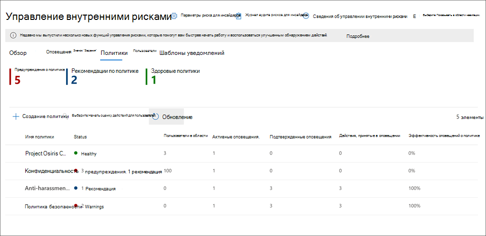

# Политики управления рисками внутри организацииInsider risk management policies

Политики управления рисками внутри организации определяют, какие пользователи находятся в области действия и какие типы индикаторов риска настроены для оповещений.Insider risk management policies determine which users are in-scope and which types of risk indicators are configured for alerts. Вы можете быстро создать политику, применяемую ко всем пользователям в организации, или определить отдельных пользователей или группы для управления политикой.You can quickly create a policy that applies to all users in your organization or define individual users or groups for management in a policy. Политики поддерживают приоритеты контента, чтобы сосредоточиться на условиях политики для нескольких или определенных Microsoft Teams, сайтов SharePoint, типов конфиденциальности данных и меток данных.Policies support content priorities to focus policy conditions on multiple or specific Microsoft Teams, SharePoint sites, data sensitivity types, and data labels. С помощью шаблонов можно выбирать конкретные индикаторы риска и настраивать пороговые значения событий для индикаторов политики, эффективно настраивая оценки рисков, а также уровень и частоту оповещений.Using templates, you can select specific risk indicators and customize event thresholds for policy indicators, effectively customizing risk scores and level and frequency of alerts. Кроме того, средства повышения и обнаружения аномалий оценки риска помогают определить активность пользователей, которая имеет более высокую важность или более необычный вид.Additionally, risk score boosters and anomaly detections help identify user activity that is of higher importance or more unusual. Окна политик позволяют определить сроки применения политики к действиям оповещения и используются для определения длительности активированной политики.Policies windows allow you to define the time frame to apply the policy to alert activities and are used to determine the duration of the policy once activated.

## Панель мониторинга политикиPolicy dashboard

Панель **мониторинга политики** позволяет быстро видеть политики в организации и текущее состояние оповещений, связанных с каждой политикой.The **Policy dashboard** allows you to quickly see the policies in your organization and the current status of alerts associated with each policy.

- **Имя политики:** имя, назначенное политике в мастере политики.**Policy name**: The name assigned to the policy in the policy wizard.
- **Активные оповещения:** количество активных оповещений для каждой политики.**Active alerts**: The number of active alerts for each policy.
- **Подтвержденные оповещения:** общее количество оповещений, которые были выявимы в случаях из политики за последние 365 дней.**Confirmed alerts**: The total number of alerts the resulted in cases from the policy in the last 365 days.
- **Действия, принятые в отношении** оповещений: общее количество оповещений, которые были подтверждены или отклонены за последние 365 дней.**Actions taken on alerts**: The total number of alerts that were confirmed or dismissed for the last 365 days.
- **Эффективность политики**: процентное соотношение, определяемого итогом подтвержденных оповещений, разделенным на общее количество действий, принятых в отношении оповещений (суммы оповещений, которые были подтверждены или отклонены за последний год).**Policy effectiveness**: The percentage determined by total confirmed alerts divided by total actions taken on alerts (which is the sum of alerts that were confirmed or dismissed over the past year).
- **Активный:** состояние дела: *Да* или *Нет.***Active**: The status of the case, either *Yes* or *No*.

## Шаблоны политикиPolicy templates

Шаблоны управления рисками внутри организации — это предварительно определенные условия политики, определяющие типы индикаторов рисков и модель оценки рисков, используемую политикой.Insider risk management templates are pre-defined policy conditions that define the types of risk indicators and risk scoring model used by the policy. Перед созданием политики в мастере создания каждой политики должен быть назначен шаблон.Each policy must have a template assigned in the policy creation wizard before the policy is created. Управление рисками внутри организации поддерживает до пяти политик для каждого шаблона политики.Insider risk management supports up to five policies for each policy template. При создании новой политики insider risk с помощью мастера политики вы выберете один из следующих шаблонов политики:When you create a new insider risk policy with the policy wizard, you'll choose from one of the following policy templates:

### Кража данных путем убывающих пользователейData theft by departing users

Когда пользователи покидают организацию, существуют определенные индикаторы риска, которые обычно связаны с кражей данных при отступе от пользователей.When users leave your organization, there are specific risk indicators typically associated with data theft by departing users. Этот шаблон политики использует индикаторы для оценки рисков и фокусирует обнаружение и оповещения для этой области риска.This policy template uses indicators for risk scoring and focuses detection and alerts to this risk area. Кража данных у отправляющихся пользователей может включать загрузку файлов из SharePoint Online, печать файлов и копирование данных в личные облачные службы обмена сообщениями и службы хранения вблизи их занятости и даты окончания.Data theft for departing users may include downloading files from SharePoint Online, printing files, and copying data to personal cloud messaging and storage services near their employment resignation and end dates. Этот шаблон начинает оценку индикаторов риска, связанных с этими действиями, и их сопоставления со статусом занятости пользователей.This template starts scoring for risk indicators relating to these activities and how they correlate with user employment status.

>[!IMPORTANT]
>При использовании этого шаблона необходимо настроить соединители Microsoft 365 HR для периодического импорта сведений о дате увольнения и увольнения для пользователей в организации.When using this template, you must configure a Microsoft 365 HR connector to periodically import resignation and termination date information for users in your organization. [Пошаговая](import-hr-data.md) инструкция по настройке соединители Microsoft 365 HR для организации см. в статье "Импорт данных с помощью соединители отдела кадров".See the [Import data with the HR connector](import-hr-data.md) article for step-by-step guidance to configure the Microsoft 365 HR connector for your organization.

### Общие утечки данныхGeneral data leaks

Защита данных и предотвращение утечек данных — постоянная задача для большинства организаций, особенно в связи с быстрым ростом новых данных, созданных пользователями, устройствами и службами.Protecting data and preventing data leaks is a constant challenge for most organizations, particularly with the rapid grow of new data created by users, devices, and services. Пользователи могут создавать, хранить и обмениваться информацией между службами и устройствами, что делает управление утечками данных все более сложным и сложным.Users are empowered to create, store, and share information across services and devices that make managing data leaks increasingly more complex and difficult. Утечки данных могут включать случайную передачу информации за пределы организации или кражу данных с злонамеренной целью.Data leaks can include accidental oversharing of information outside your organization or data theft with malicious intent. В сочетании с назначенной политикой защиты от потери данных этот шаблон начинает выявлять подозрительные загрузки данных SharePoint Online в режиме реального времени, общий доступ к файлам и папок, печать файлов и копирование данных в личные облачные службы обмена сообщениями и службы хранения.In conjunction with an assigned Data Loss Prevention (DLP) policy, this template starts scoring real-time detections of suspicious SharePoint Online data downloads, file and folder sharing, printing files, and copying data to personal cloud messaging and storage services.

При использовании **шаблона** утечки данных необходимо назначить политику DLP, чтобы активирует индикаторы в политике insider risk для оповещений высокого уровня серьезности в организации.When using a **Data leaks** template, you must assign a DLP policy to trigger indicators in the insider risk policy for high severity alerts in your organization. Каждый раз, когда в журнал аудита Office 365 добавляется оповещение о высокой серьезности с помощью правила политики DLP, политики внутренней опасности, созданные с помощью этого шаблона, автоматически проверяют оповещение О DLP с высокой степенью серьезности.Whenever a high severity alert is generated by a DLP policy rule is added to the Office 365 audit log, insider risk policies created with this template automatically examine the high severity DLP alert. Если оповещение содержит пользователя в области действия, определенного в политике риска для внутренней оценки, то оповещение обрабатывается политикой риска внутри системы как новое оповещение и получает степень серьезности и оценку риска.If the alert contains an in-scope user defined in the insider risk policy, the alert is processed by the insider risk policy as a new alert and assigned an insider risk severity and risk score. Эта политика позволяет оценить это оповещение в контексте других действий, включенных в дело.This policy allows you to evaluate this alert in context with other activities included in the case.

#### Рекомендации политики утечки данныхData leaks policy guidelines

При создании или изменении политик DLP для использования с политиками управления рисками внутри организации рассмотрите следующие рекомендации:When creating or modifying DLP policies for use with insider risk management policies, consider the following guidelines:

- Назначайте приоритеты событиям фильтрации  данных и будьте  выборочно при назначении параметров отчетов об инцидентах высокому при настройке правил в политиках DLP.Prioritize data exfiltration events and be selective when assigning **Incident reports** settings to *High* when configuring rules in your DLP policies. Например, отправка конфиденциальных документов известному конкуренту по электронной почте должна быть событием с высоким уровнем фильтрации оповещений. For example, emailing sensitive documents to a known competitor should be a *High* alert level exfiltration event. Переназначение  высокого уровня  в параметрах отчетов об инцидентах в других правилах политики DLP может повысить уровень шума в рабочий процесс оповещения об управлении рисками внутри организации и затруднить оценку оповещений вашими следователями и аналитиками данных.Over-assigning the *High* level in the **Incident reports** settings in other DLP policy rules can increase the noise in the insider risk management alert workflow and make it more difficult for your data investigators and analysts to properly evaluate these alerts. Например, назначение  высоких уровней оповещений для доступа к действиям отказа в политиках DLP усложняет оценку действительно рискованных действий и действий пользователей.For example, assigning *High* alert levels to access denial activities in DLP policies makes it more challenging to evaluate truly risky user behavior and activities.
- Убедитесь, что вы понимаете и правильно настраиваете пользователей в области как в политиках DLP, так и в политиках управления рисками внутри организации.Make sure you understand and properly configure the in-scope users in both the DLP and insider risk management policies. Только пользователи, определенные как в области применения политик  управления рисками внутри организации, использующие шаблон "Утечки данных", будут обрабатывать оповещения политики защиты от защите от защите данных с высокой степенью серьезности.Only users defined as in-scope for insider risk management policies using the **Data leaks** template will have high severity DLP policy alerts processed. Кроме того, только пользователи, определенные как в области действия правила для оповещения О DLP с высокой степенью серьезности, будут рассмотрены политикой управления рисками внутри организации для рассмотрения.Additionally, only users defined as in-scope in a rule for a high severity DLP alert will be examined by the insider risk management policy for consideration. Важно не настраивать пользователей в области как в политиках DLP, так и в политиках внутренней безопасности конфликтующих способов.It is important that you don't unknowingly configure in-scope users in both your DLP and insider risk policies in a conflicting manner.

     Например, если правила политики защиты от защите данных имеют область действия только для  пользователей из группы продаж, а политика insider risk policy, созданная на основе шаблона "Утечки данных", определяет всех пользователей как в области действия, политика риска для участников группы продаж будет обрабатывать только оповещения о защите от lp высокого уровня серьезности для пользователей из группы продаж.For example, if your DLP policy rules are scoped to only users on the Sales Team and the insider risk policy created from the **Data leaks** template has defined all users as in-scope, the insider risk policy will only actually process high severity DLP alerts for the users on the Sales Team. Политика insider risk не будет получать оповещения о DLP с высоким приоритетом для пользователей для обработки, которые не определены в правилах DLP в этом примере.The insider risk policy won't receive any high priority DLP alerts for users to process that aren't defined in the DLP rules in this example. И наоборот, если политика управления  рисками внутри организации, созданная на основе шаблонов утечек данных, имеет область действия только для пользователей из отдела продаж, а назначенная политика защиты от защите от реализации защите от реализации пользования (DLP) — только для всех пользователей, политика риска для участников группы продаж будет обрабатывать только оповещения о высокой серьезности DLP.Conversely, if your insider risk management policy created from **Data leaks** templates is scoped to only users on the Sales Team and the assigned DLP policy is scoped to all users, the insider risk policy will only process high severity DLP alerts for members of the Sales Team. Политика управления рисками внутри организации будет игнорировать оповещения О DLP с высокой степенью серьезности для всех пользователей, не в группе продаж.The insider risk management policy will ignore high severity DLP alerts for all users not on the Sales Team.

- Убедитесь, **что** параметр правила отчетов об инцидентах в политике DLP,  используемой для этого шаблона управления insider risk management, настроен для оповещений высокого уровня серьезности.Make sure the **Incident reports** rule setting in the DLP policy used for this insider risk management template is configured for *High* severity level alerts. Высокий *уровень* серьезности — это запускающие события, и оповещения управления рисками внутри организации не  создаются из  правил в политиках DLP с полем "Отчеты об инцидентах" на низком или среднем *уровне.*The *High* severity level is the triggering events and insider risk management alerts won't be generated from rules in DLP policies with the **Incident reports** field set at *Low* or *Medium*.

    

     >[!NOTE]
     >При создании новой политики DLP с помощью встроенных шаблонов необходимо выбрать параметр "Создать или настроить расширенные  правила **DLP",** чтобы настроить параметр отчетов об инцидентах для уровня серьезности. When creating a new DLP policy using the built-in templates, you'll need to select the **Create or customize advanced DLP rules** option to configure the **Incident reports** setting for the *High* severity level.

Каждой политике управления рисками внутри организации, созданной из шаблона **"Утечки** данных", может быть назначена только одна политика DLP.Each insider risk management policy created from the **Data leaks** template can only have one DLP policy assigned. Рассмотрите возможность создания выделенной политики DLP, объединяющей различные действия, которые вы хотите обнаружить и выступать в качестве запуска событий для политик внутренней защиты от рисков, которые используют шаблон **утечки** данных.Consider creating a dedicated DLP policy that combines the different activities you want to detect and act as triggering events for  insider risk policies that use the **Data leaks** template.

Пошаговые инструкции по настройке политик DLP для организации см. в статье "Создание, тестирование и настройка политики [DLP".](create-test-tune-dlp-policy.md)See the [Create, test, and tune a DLP policy](create-test-tune-dlp-policy.md) article for step-by-step guidance to configure DLP policies for your organization.

### Утечки данных по приоритетным пользователям (предварительная версия)Data leaks by priority users (preview)

Защита данных и предотвращение утечек данных для пользователей в организации может зависеть от их положения, уровня доступа к конфиденциальной информации или истории рисков.Protecting data and preventing data leaks for users in your organization may depend on their position, level of access to sensitive information, or risk history. Утечки данных могут включать случайную передачу конфиденциальных сведений за пределы организации или кражу данных с злонамеренной целью.Data leaks can include accidental oversharing of highly sensitive information outside your organization or data theft with malicious intent. В сочетании с назначенной политикой защиты от потери данных этот шаблон начинает выявлять подозрительные действия в режиме реального времени и повышает вероятность появления оповещений и оповещений с более высоким уровнем серьезности.In conjunction with an assigned Data Loss Prevention (DLP) policy, this template starts scoring real-time detections of suspicious activity and result in an increased likelihood of insider risk alerts and alerts with higher severity levels. Пользователи с приоритетами определяются [в](insider-risk-management-settings.md#priority-user-groups-preview) группах пользователей с приоритетами, настроенных в области параметров управления рисками внутри организации.Priority users are defined in [priority user groups](insider-risk-management-settings.md#priority-user-groups-preview) configured in the insider risk management settings area.

Как и **в** шаблоне общих утечек данных, необходимо назначить политику DLP, чтобы активаторы в политике insider risk для оповещений высокого уровня серьезности в организации.As with the **General data leaks template**, you must assign a DLP policy to trigger indicators in the insider risk policy for high severity alerts in your organization. Следуйте рекомендациям политики утечки данных, которые были указаны выше при создании политики с использованием этого шаблона.Follow the Data leaks policy guidelines above when creating a policy using this template. Кроме того, необходимо назначить политике группы пользователей с приоритетами, созданные в параметрах управления рисками для оценки  >    >   рисков.Additionally, you will need to assign priority user groups created in **Insider risk management** > **Settings** > **Priority user groups** to the policy.

### Утечки данных несовершимыми пользователями (предварительная версия)Data leaks by disgruntled users (preview)

Когда пользователи испытывают нагрузку на работу, они могут стать несоразмерными, что может повысить вероятность действий с внутриорганиалистией.When users experience employment stressors, they may become disgruntled which may increase the chances of insider risk activity. Этот шаблон начинает озвучить активность пользователей при обнаружении индикатора, связанного с распускаемой нагрузкой.This template starts scoring user activity when an indicator associated with disgruntlement is identified. В качестве примеров можно привести уведомления об улучшении производительности, проверки низкой производительности или изменения состояния уровня задания.Examples include performance improvement notifications, poor performance reviews, or changes to job level status. Утечки данных для неигрываемых пользователей могут включать загрузку файлов из SharePoint Online и копирование данных в личные облачные службы обмена сообщениями и службы хранения вблизи событий, которые могут привести к нагрузке на работу.Data leaks for disgruntled users may include downloading files from SharePoint Online and copying data to personal cloud messaging and storage services near employment stressor events.

При использовании этого шаблона также необходимо настроить соединители Microsoft 365 HR для периодического импорта уведомлений об улучшении производительности, проверки низкой производительности или сведений об изменении уровня должности для пользователей в организации.When using this template, you must also configure a Microsoft 365 HR connector to periodically import performance improvement notifications, poor performance review status, or job level change information for users in your organization. [Пошаговая](import-hr-data.md) инструкция по настройке соединители Microsoft 365 HR для организации см. в статье "Импорт данных с помощью соединители отдела кадров".See the [Import data with the HR connector](import-hr-data.md) article for step-by-step guidance to configure the Microsoft 365 HR connector for your organization.

### Общие нарушения политики безопасности (предварительная версия)General security policy violations (preview)

Во многих организациях пользователи имеют разрешения на установку программного обеспечения на своих устройствах или изменение параметров устройств для выполнения задач.In many organizations, users have permissions to install software on their devices or to modify device settings to help with their tasks. Случайно или с злонамеренным намерением пользователи могут устанавливать вредоносные программы или отключать важные функции безопасности, которые помогают защитить информацию на своем устройстве или в сетевых ресурсах.Either inadvertently or with malicious intent, users may install malware or disable important security features that help protect information on their device or on your network resources. Этот шаблон политики использует оповещения системы безопасности из Microsoft Defender для конечной точки, чтобы начать оценку этих действий и сосредоточиться на обнаружении и оповещениях для этой области риска.This policy template uses security alerts from Microsoft Defender for Endpoint to start scoring these activities and focus detection and alerts to this risk area. Используйте этот шаблон для анализа нарушений политики безопасности в сценариях, когда у пользователей может быть история нарушений политики безопасности, которая может быть индикатором внутренней угрозы.Use this template to provide insights for security policy violations in scenarios when users may have a history of security policy violations that may be an indicator of insider risk.

Необходимо настроить Microsoft Defender для конечной точки в вашей организации и включить Защитник для конечной точки для интеграции управления insider risk management в Центре безопасности Защитника для импорта оповещений о нарушении безопасности.You'll need to have Microsoft Defender for Endpoint configured in your organization and enable Defender for Endpoint for insider risk management integration in the Defender Security Center to import security violation alerts. Дополнительные сведения о настройке Защитника для конечной точки для интеграции управления insider risk management см. в подстройке "Настройка расширенных функций в [Защитнике для конечной точки".](/windows/security/threat-protection/microsoft-defender-atp/advanced-features#share-endpoint-alerts-with-microsoft-compliance-center)For more information on configuring Defender for Endpoint for insider risk management integration, see [Configure advanced features in Defender for Endpoint](/windows/security/threat-protection/microsoft-defender-atp/advanced-features#share-endpoint-alerts-with-microsoft-compliance-center).

### Нарушения политики безопасности при отступе от пользователей (предварительная версия)Security policy violations by departing users (preview)

Выход пользователей из системы в случае положительного или отрицательного срабатывания может привести к более высокому риску нарушения политики безопасности.Departing users, whether leaving on positive or negative terms, may be higher risks for security policy violations. Чтобы защититься от непреднамеренных или вредоносных нарушений безопасности для увольненных пользователей, этот шаблон политики использует защитник для оповещений конечных точек для предоставления информации о действиях, связанных с безопасностью.To help protect against inadvertent or malicious security violations for departing users, this policy template uses Defender for Endpoint alerts to provide insights into security-related activities. К таким действиям относится установка пользователем вредоносных программ или других потенциально опасных приложений и отключение функций безопасности на своих устройствах.These activities include the user installing malware or other potentially harmful applications and disabling security features on their devices. Индикаторы политики активируются после того, как пользователи имеют дату увольнения или завершения, импортированные из соединители Microsoft 365 HR в качестве события запуска.Policy indicators are activated after users have a resignation or termination date imported from the Microsoft 365 HR Connector as a triggering event.

При использовании этого шаблона необходимо настроить соединители Microsoft 365 HR для периодического импорта сведений о дате увольнения и увольнения для пользователей в организации.When using this template, you must configure a Microsoft 365 HR connector to periodically import resignation and termination date information for users in your organization. [Пошаговая](import-hr-data.md) инструкция по настройке соединители Microsoft 365 HR для организации см. в статье "Импорт данных с помощью соединители отдела кадров".See the [Import data with the HR connector](import-hr-data.md) article for step-by-step guidance to configure the Microsoft 365 HR connector for your organization.

Необходимо настроить Microsoft Defender для конечной точки в вашей организации и включить Защитник для конечной точки для интеграции управления рисками в Центре безопасности Защитника для импорта оповещений о нарушении безопасности.You'll need to have Microsoft Defender for Endpoint configured in your organization and enable Defender for Endpoint for insider risk management integration in the Defender Security Center to import security violation alerts. Дополнительные сведения о настройке Защитника для конечной точки для интеграции управления insider risk management см. в подстройке "Настройка расширенных функций в [Защитнике для конечной точки".](/windows/security/threat-protection/microsoft-defender-atp/advanced-features#share-endpoint-alerts-with-microsoft-compliance-center)For more information on configuring Defender for Endpoint for insider risk management integration, see [Configure advanced features in Defender for Endpoint](/windows/security/threat-protection/microsoft-defender-atp/advanced-features#share-endpoint-alerts-with-microsoft-compliance-center).

### Нарушения политики безопасности пользователями с приоритетами (предварительная версия)Security policy violations by priority users (preview)

Защита от нарушений безопасности для пользователей в организации может зависеть от их положения, уровня доступа к конфиденциальной информации или истории рисков.Protecting against security violations for users in your organization may depend on their position, level of access to sensitive information, or risk history. Поскольку нарушения безопасности пользователями с приоритетом могут оказывать влияние на критически важные области вашей организации, этот шаблон политики начинает учитывать эти индикаторы и использует Microsoft Defender для оповещений конечных точек, чтобы получить представление о действиях, связанных с безопасностью, для этих пользователей.Because security violations by priority users may have an outsized impact on your organization's critical areas, this policy template starts scoring on these indicators and uses Microsoft Defender for Endpoint alerts to provide insights into security-related activities for these users. К ним могут относится установка вредоносных программ или других потенциально опасных приложений и отключение функций безопасности на их устройствах.These may include the priority users installing malware or other potentially harmful applications and disabling security features on their devices. Пользователи с приоритетами определяются в группах пользователей с приоритетами, настроенных в области параметров управления рисками внутри организации.Priority users are defined in priority user groups configured in the insider risk management settings area.

Необходимо настроить Microsoft Defender для конечной точки в вашей организации и включить Защитник для конечной точки для интеграции управления insider risk management в Центре безопасности Защитника для импорта оповещений о нарушении безопасности.You'll need to have Microsoft Defender for Endpoint configured in your organization and enable Defender for Endpoint for insider risk management integration in the Defender Security Center to import security violation alerts. Дополнительные сведения о настройке Защитника для конечной точки для интеграции управления insider risk management см. в подстройке "Настройка расширенных функций в [Защитнике для конечной точки".](/windows/security/threat-protection/microsoft-defender-atp/advanced-features#share-endpoint-alerts-with-microsoft-compliance-center)For more information on configuring Defender for Endpoint for insider risk management integration, see [Configure advanced features in Defender for Endpoint](/windows/security/threat-protection/microsoft-defender-atp/advanced-features#share-endpoint-alerts-with-microsoft-compliance-center). Кроме того, необходимо назначить политике группы пользователей с приоритетами, созданные в параметрах управления рисками для оценки  >    >   рисков.Additionally, you will need to assign priority user groups created in **Insider risk management** > **Settings** > **Priority user groups** to the policy.

### Нарушения политики безопасности со стороны несоединых пользователей (предварительная версия)Security policy violations by disgruntled users (preview)

Пользователи, которые испытывают нагрузку на работу, могут быть в большей опасности в случае непреднамеренных или вредоносных нарушений политики безопасности.Users that experience employment stressors may be at a higher risk for inadvertent or malicious security policy violations. Эти нагрузки могут включать пользователей, помещенных на план повышения производительности, состояние проверки низкой производительности или понижение его текущего положения.These stressors may include the user being placed on a performance improvement plan, poor performance review status, or being demoted from their current position. Этот шаблон политики запускает оценку рисков на основе этих индикаторов и действий, связанных с этими событиями для этих пользователей.This policy template starts risk scoring based these indicators and activities associated with these events for these users.

При использовании этого шаблона также необходимо настроить соединители Microsoft 365 HR для периодического импорта уведомлений об улучшении производительности, проверки низкой производительности или сведений об изменении уровня должности для пользователей в организации.When using this template, you must also configure a Microsoft 365 HR connector to periodically import performance improvement notifications, poor performance review status, or job level change information for users in your organization. [Пошаговая](import-hr-data.md) инструкция по настройке соединители Microsoft 365 HR для организации см. в статье "Импорт данных с помощью соединители отдела кадров".See the [Import data with the HR connector](import-hr-data.md) article for step-by-step guidance to configure the Microsoft 365 HR connector for your organization.

Вам также потребуется настроить Microsoft Defender для конечной точки в вашей организации и включить Защитник для конечной точки для интеграции управления insider risk management в Центре безопасности Защитника для импорта оповещений о нарушении безопасности.You'll also need to have Microsoft Defender for Endpoint configured in your organization and enable Defender for Endpoint for insider risk management integration in the Defender Security Center to import security violation alerts. Дополнительные сведения о настройке Защитника для конечной точки для интеграции управления insider risk management см. в подстройке "Настройка расширенных функций в [Защитнике для конечной точки".](/windows/security/threat-protection/microsoft-defender-atp/advanced-features#share-endpoint-alerts-with-microsoft-compliance-center)For more information on configuring Defender for Endpoint for insider risk management integration, see [Configure advanced features in Defender for Endpoint](/windows/security/threat-protection/microsoft-defender-atp/advanced-features#share-endpoint-alerts-with-microsoft-compliance-center).

### Необходимые условия для шаблона политики и запуска событийPolicy template prerequisites and triggering events

В зависимости от шаблона, который вы выбрали для политики управления рисками внутри организации, запускающие события и необходимые условия политики различаются.Depending on the template you choose for an insider risk management policy, the triggering events and policy prerequisites vary. Запускающие события являются предварительными условиями, которые определяют, активен ли пользователь для политики управления рисками внутри организации.Triggering events are prerequisites that determine if a user is active for an insider risk management policy. Если пользователь добавляется в политику управления рисками для участников, но не имеет запускающих событий, действия пользователя не оцениваются политикой, если они не добавлены вручную на панели мониторинга "Пользователи".If a user is added to an insider risk management policy but does not have a triggering event, the user activity is not evaluated by the policy unless they are manually added in the Users dashboard. Обязательные элементы политики являются обязательными элементами, чтобы политика получала сигналы или действия, необходимые для оценки риска.Policy prerequisites are required items so that the policy receives the signals or activities necessary to evaluate risk.

В следующей таблице перечислены запускающие события и необходимые условия для политик, созданных на сфере каждого шаблона политики управления рисками внутри организации:The following table lists the triggering events and prerequisites for policies created from each insider risk management policy template:

| **Шаблон политики****Policy template** | **Запуск событий для политик****Triggering events for policies** | **Предварительные требования****Prerequisites** |
| :------------------ | :--------------------------------- | :---------------- |
| Кража данных путем убывающих пользователейData theft by departing users | Индикатор даты прекращения действия из соединители отдела кадровResignation or termination date indicator from HR connector | Соединители Microsoft 365 HR, настроенные для индикаторов даты завершения и увольненияMicrosoft 365 HR connector configured for termination and resignation date indicators |
| Общие утечки данныхGeneral data leaks | Действие политики утечки данных, создающей оповещение с высокой степенью серьезностиData leak policy activity that creates a High severity alert | Политика DLP, настроенная для оповещений с высокой степенью серьезностиDLP policy configured for High severity alerts |
| Утечки данных по приоритетным пользователямData leaks by priority users | Действие политики утечки данных, создающей оповещение с высокой степенью серьезностиData leak policy activity that creates a High severity alert | Политика DLP, настроенная для оповещений с высокой степенью серьезностиDLP policy configured for High severity alerts    Группы пользователей с приоритетами, настроенные в параметрах insider riskPriority user groups configured in insider risk settings |
| Утечки данных несовершимыми пользователямиData leaks by disgruntled users | Улучшение производительности, низкая производительность или индикаторы изменения уровня должности из соединители отдела кадровPerformance improvement, poor performance, or job level change indicators from HR connector | Соединитель управления персоналом Microsoft 365, настроенный для индикаторов размежещенностиMicrosoft 365 HR connector configured for disgruntlement indicators |
| Общие нарушения политики безопасностиGeneral security policy violations | Защита от средств контроля безопасности или нежелательного программного обеспечения, обнаруженного в Microsoft Defender для конечной точкиDefensive evasion of security controls or unwanted software detected by Microsoft Defender for Endpoint | Active Microsoft Defender for Endpoint subscriptionActive Microsoft Defender for Endpoint subscription    Настроена интеграция Microsoft Defender для конечных точек с Центром соответствия требованиям Microsoft 365Microsoft Defender for Endpoint integration with Microsoft 365 compliance center configured |
| Нарушения политики безопасности путем отступа пользователейSecurity policy violations by departing users | Индикаторы даты завершения или увольнения от соединители отдела кадровResignation or termination date indicators from HR connector | Соединители Microsoft 365 HR, настроенные для индикаторов даты завершения и увольненияMicrosoft 365 HR connector configured for termination and resignation date indicators    Active Microsoft Defender for Endpoint subscriptionActive Microsoft Defender for Endpoint subscription    Настроена интеграция Microsoft Defender для конечных точек с Центром соответствия требованиям Microsoft 365Microsoft Defender for Endpoint integration with Microsoft 365 compliance center configured |
| Нарушения политики безопасности пользователями с приоритетамиSecurity policy violations by priority users | Защита от средств контроля безопасности или нежелательного программного обеспечения, обнаруженного в Microsoft Defender для конечной точкиDefensive evasion of security controls or unwanted software detected by Microsoft Defender for Endpoint | Active Microsoft Defender for Endpoint subscriptionActive Microsoft Defender for Endpoint subscription    Настроена интеграция Microsoft Defender для конечных точек с Центром соответствия требованиям Microsoft 365Microsoft Defender for Endpoint integration with Microsoft 365 compliance center configured    Группы пользователей с приоритетами, настроенные в параметрах insider riskPriority user groups configured in insider risk settings |
| Нарушения политики безопасности несовершимым пользователемSecurity policy violations by disgruntled user | Улучшение производительности, низкая производительность или индикаторы изменения уровня должности из соединители отдела кадровPerformance improvement, poor performance, or job level change indicators from HR connector | Соединитель управления персоналом Microsoft 365, настроенный для индикаторов размежещенностиMicrosoft 365 HR connector configured for disgruntlement indicators    Active Microsoft Defender for Endpoint subscriptionActive Microsoft Defender for Endpoint subscription    Настроена интеграция Microsoft Defender для конечных точек с Центром соответствия требованиям Microsoft 365Microsoft Defender for Endpoint integration with Microsoft 365 compliance center configured |

## Приоритет контента в политикахPrioritize content in policies

Политики управления рисками внутри организации поддерживают указание более высокого приоритета для контента в зависимости от того, где он хранится или как классифицируется.Insider risk management policies support specifying a higher priority for content depending where it is stored or how it is classified. Указание содержимого в качестве приоритета увеличивает оценку риска для всех связанных действий, что, в свою очередь, повышает вероятность создания оповещения с высокой степенью серьезности.Specifying content as a priority increases the risk score for any associated activity, which in turn increases the chance of generating a high severity alert. Однако некоторые действия не будут создавать оповещения, если только связанное содержимое не содержит встроенные или пользовательские типы конфиденциальной информации или не указано в качестве приоритета в политике.However, some activities won't generate an alert at all unless the related content contains built-in or custom sensitive info types or was specified as a priority in the policy.

Например, в организации имеется выделенный сайт SharePoint для строго конфиденциального проекта.For example, your organization has a dedicated SharePoint site for a highly confidential project. Утечка данных для информации на этом сайте SharePoint может нарушить проект и значительно повлиять на его успех.Data leaks for information in this SharePoint site could compromise the project and would have a significant impact on its success. При назначив этому сайту SharePoint приоритет в политике утечки данных, показатели риска для действий, которые будут квалифицироваться, автоматически увеличиваются.By prioritizing this SharePoint site in a Data leaks policy, risk scores for qualifying activities are automatically increased. Такая расоритизация приоритетов повышает вероятность того, что эти действия создают оповещение о риске внутри организации, и повышает степень серьезности оповещения.This prioritization increases the likelihood that these activities generate an insider risk alert and raises the severity level for the alert.

При создании политики управления рисками внутри организации в мастере политики можно выбрать один из следующих приоритетов:When you create an insider risk management policy in the policy wizard, you can choose from the following priorities:

- **Сайты SharePoint:** всем действиям, связанным со всеми типами файлов на определенных сайтах SharePoint, назначена более высокая оценка риска.**SharePoint sites**: Any activity associated with all file types in defined SharePoint sites is assigned a higher risk score. 
- **Типы конфиденциальной информации:** всем действиям, связанным с содержимым с типами конфиденциальной информации, присвоена более высокая оценка риска. **Sensitive information types**: Any activity associated with content that contains [sensitive information types](sensitive-information-type-entity-definitions.md) are assigned a higher risk score.
- **Метки конфиденциальности:** любому действию, связанному с содержимым с примененными метами конфиденциальности, присвоена более высокая оценка риска. **Sensitivity labels**: Any activity associated with content that has specific [sensitivity labels](sensitivity-labels.md) applied are assigned a higher risk score.

## Создание новой политикиCreate a new policy

Чтобы создать новую политику управления рисками внутри организации, используйте мастер политики в решении **для** управления рисками для программы оценки в Центре соответствия требованиям Microsoft 365.To create a new insider risk management policy, you'll use the policy wizard in **Insider risk management** solution in the Microsoft 365 compliance center.

Выполните следующие действия, чтобы создать новую политику:Complete the following steps to create a new policy:

1. В Центре [соответствия требованиям Microsoft 365](https://compliance.microsoft.com)перейдите в центр управления рисками для программы оценки безопасности и выберите вкладку **"Политики".** In the [Microsoft 365 compliance center](https://compliance.microsoft.com), go to **Insider risk management** and select the **Policies** tab.
2. Выберите **"Создать политику",** чтобы открыть мастер политикиSelect **Create policy** to open the policy wizard
3. На странице **"Новая политика insider risk policy"** заполните следующие поля:On the **New insider risk policy** page, complete the following fields:
    - **Имя (обязательно)**: введите имя политики.**Name (required)**: Enter a friendly name for the policy.
    - **Описание (необязательно).** Введите описание политики.**Description (optional)**: Enter a description for the policy.
    - **Выберите шаблон политики (обязательно).** Выберите  один из шаблонов политики, чтобы определить типы индикаторов риска, которые отслеживаются политикой.**Choose policy template (required)**: Select one of the [policy templates](insider-risk-management-policies.md#policy-templates) to define the types of risk indicators are monitored by the policy.

    >[!IMPORTANT]
    >Большинство шаблонов политик имеют необходимые условия, которые необходимо настроить для политики для создания соответствующих оповещений.Most policy templates have prerequisites that must be configured for the policy to generate relevant alerts. If you haven't configured the applicable policy prerequisites, see [Get started with insider risk management](insider-risk-management-configure.md#step-3-configure-prerequisites-for-templates).If you haven't configured the applicable policy prerequisites, see [Get started with insider risk management](insider-risk-management-configure.md#step-3-configure-prerequisites-for-templates).

4. Выберите **"Далее",** чтобы продолжить.Select **Next** to continue.
5. На  странице "Пользователи" выберите "Добавить пользователя или группу" или выберите группы пользователей "Приоритет", чтобы определить, какие пользователи или группы пользователей с приоритетом включены в политику в зависимости от выбранного шаблона политики.  On the **Users** page, select **Add user or group** or **Choose Priority user groups** to define which users or priority user groups are included in the policy, depending on the policy template you've selected. Выберите **"Все пользователи и группы** с включенной поддержкой почты", если это возможно (если вы не выбрали шаблон, основанный на приоритете пользователя).Select **All users and mail-enabled groups** checkbox if applicable (if you haven't selected a priority user-based template). Выберите **"Далее",** чтобы продолжить.Select **Next** to continue.
6. На странице **"Укажите, какое содержимое** необходимо назначить приоритету (необязательно)", можно назначить источники для приоритетов для повышения оценки риска.On the **Specify what content to prioritize (optional)** page, you can assign the sources to prioritize for increased risk scores. Однако некоторые действия не будут создавать оповещение, если только связанное содержимое не содержит встроенные или настраиваемые типы конфиденциальной информации или не было указано в качестве приоритета на этой странице:However, some activities won't generate an alert at all unless the related content contains built-in or custom sensitive info types or was specified as a priority on this page:
    - **Сайты SharePoint:** выберите **"Добавить сайт SharePoint"** и выберите организации SharePoint, которые необходимо расставить в приоритете.**SharePoint sites**: Select **Add SharePoint site** and select the SharePoint organizations you want to prioritize. Например, *"group1@contoso.sharepoint.com/sites/group1".*For example, *"group1@contoso.sharepoint.com/sites/group1"*.
    - **Тип конфиденциальной информации:** выберите **"Добавить тип** конфиденциальной информации" и выберите типы конфиденциальности, которые необходимо расставить по приоритету.**Sensitive info type**: Select **Add sensitive info type** and select the sensitivity types you want to prioritize. Например, *"Номер* банковского счета в США" и *"Номер кредитной карты".*For example, *"U.S. Bank Account Number"* and *"Credit Card Number"*.
    - **Метки конфиденциальности:** выберите "Добавить метку **конфиденциальности"** и выберите метки, приоритеты для них.**Sensitivity labels**: Select **Add sensitivity label** and select the labels you want to prioritize. Например, *"Конфиденциально"* и *"Секрет".*For example, *"Confidential"* and *"Secret"*.
7. Выберите **"Далее",** чтобы продолжить.Select **Next** to continue.
8. На странице **"Выбор индикаторов** политики"  вы увидите индикаторы, которые вы определили как доступные на странице "Индикаторы параметров риска для оценки  >   риска".On the **Select policy indicators** page, you'll see the [indicators](insider-risk-management-settings.md#indicators) that you've defined as available on the **Insider risk settings** > **Indicators** page. Если вы выбрали  шаблон утечки данных в начале мастера, необходимо выбрать политику DLP из выпадающих списков политик **DLP,** чтобы включить индикаторы запуска для политики.If you selected a *Data leaks* template at the beginning of the wizard, you must select a DLP policy from the **DLP policy** dropdown list to enable triggering indicators for the policy. Выберите индикаторы, которые необходимо применить к политике.Select the indicators you want to apply to the policy. Если вы предпочитаете не использовать пороговые значения политики по  умолчанию для этих индикаторов, отключаем рекомендуемые корпорацией Майкрософт пороговые значения по умолчанию и введите пороговые значения для каждого выбранного индикатора.If you prefer not to use the default policy threshold settings for these indicators, disable the **Use default thresholds recommended by Microsoft** and enter the threshold values for each selected indicator. Если вы выбрали хотя бы один  индикатор *Office*  или устройства, выберите нужные повышения для оценки риска.If you've selected at least one *Office* or *Device* indicator, select the **Risk score boosters** as appropriate. Повышение оценки риска применимо только к выбранным индикаторам.Risk score boosters are only applicable for selected indicators.

    >[!IMPORTANT]
    >Если индикаторы на этой странице не могут быть выбраны, необходимо выбрать индикаторы, которые необходимо включить для всех политик на странице "Параметры политики управления рисками для оценки  >    >   риска".If indicators on this page can't be selected, you'll need to select the indicators you want to enable for all policies on the **Insider risk management** > **Settings** > **Policy indicators** page.

9. Выберите **"Далее",** чтобы продолжить.Select **Next** to continue.
10. На странице **"Временные** рамки политики"  вы увидите условия окна активации для политики, которая находится на странице "Параметры политики для оценки   >   рисков".On the **Policy timeframes** page, you'll see the [activation window conditions](insider-risk-management-settings.md#policy-timeframes) for the policy that on the **Insider risk settings** > **Policy timeframes** page.
11. Выберите **"Далее",** чтобы продолжить.Select **Next** to continue.
12. На странице **"Проверка"** просмотрите параметры, выбранные для политики.On the **Review** page, review the settings you've chosen for the policy. Выберите  "Изменить", чтобы изменить любое из значений политики, или выберите **"Отправить",** чтобы создать и активировать политику.Select **Edit** to change any of the policy values or select **Submit** to create and activate the policy.

## Обновление политикиUpdate a policy

Чтобы обновить существующую политику управления insider risk management, используйте мастер политики в решении **для** управления рисками для программы оценки в Центре соответствия требованиям Microsoft 365.To update an existing insider risk management policy, you'll use the policy wizard in **Insider risk management** solution in the Microsoft 365 compliance center.

Выполните следующие действия для управления существующей политикой:Complete the following steps to manage an existing policy:

1. В Центре [соответствия требованиям Microsoft 365](https://compliance.microsoft.com)перейдите в центр управления рисками для программы **insider и** выберите вкладку **"Политики".**In the [Microsoft 365 compliance center](https://compliance.microsoft.com), go to **Insider risk management** and select the **Policies** tab.
2. На информационной панели политики выберите политику, которая будет управляться.On the policy dashboard, select the policy you want to manage.
3. На странице сведений о политике выберите **"Изменить политику"**On the policy details page, select **Edit policy**
4. В мастере политики нельзя редактировать следующие поля:In the policy wizard, you cannot edit the following fields:
    - **Name**: The friendly name for the policy**Name**: The friendly name for the policy
    - **Выберите шаблон политики**: шаблон, используемый для определения типов индикаторов риска, отслеживаемого политикой.**Choose policy template**: The template used to define the types of risk indicators monitored by the policy.
5. Введите новое описание политики в поле **"Описание".**Enter a new description for the policy in the **Description** field. 
6. Выберите **"Далее",** чтобы продолжить.Select **Next** to continue.
7. На  странице "Пользователи" выберите "Добавить пользователя или группу" или выберите группы пользователей "Приоритет", чтобы определить, какие пользователи или группы пользователей с приоритетом включены в политику в зависимости от выбранного шаблона политики.  On the **Users** page, select **Add user or group** or **Choose Priority user groups** to define which users or priority user groups are included in the policy, depending on the policy template you've selected. Выберите **"Все пользователи и группы** с включенной поддержкой почты", если это возможно (если вы не выбрали шаблон, основанный на приоритете пользователя).Select **All users and mail-enabled groups** checkbox if applicable (if you haven't selected a priority user-based template). Выберите **"Далее",** чтобы продолжить.Select **Next** to continue.
8. На странице **"Укажите, какое содержимое** необходимо назначить приоритету (необязательно)", можно назначить источники для приоритетов для повышения оценки риска.On the **Specify what content to prioritize (optional)** page, you can assign the sources to prioritize for increased risk scores. Однако некоторые действия не будут создавать оповещение, если только связанное содержимое не содержит встроенные или настраиваемые типы конфиденциальной информации или не было указано в качестве приоритета на этой странице:However, some activities won't generate an alert at all unless the related content contains built-in or custom sensitive info types or was specified as a priority on this page:
    - **Сайты SharePoint:** выберите **"Добавить сайт SharePoint"** и выберите организации SharePoint, которые необходимо расставить в приоритете.**SharePoint sites**: Select **Add SharePoint site** and select the SharePoint organizations you want to prioritize. Например, *"group1@contoso.sharepoint.com/sites/group1".*For example, *"group1@contoso.sharepoint.com/sites/group1"*.
    - **Тип конфиденциальной информации:** выберите **"Добавить тип** конфиденциальной информации" и выберите типы конфиденциальности, которые необходимо расставить по приоритету.**Sensitive info type**: Select **Add sensitive info type** and select the sensitivity types you want to prioritize. Например, *"Номер* банковского счета в США" и *"Номер кредитной карты".*For example, *"U.S. Bank Account Number"* and *"Credit Card Number"*.
    - **Метки конфиденциальности:** выберите "Добавить метку **конфиденциальности"** и выберите метки, приоритеты для них.**Sensitivity labels**: Select **Add sensitivity label** and select the labels you want to prioritize. Например, *"Конфиденциально"* и *"Секрет".*For example, *"Confidential"* and *"Secret"*.
9. Выберите **"Далее",** чтобы продолжить.Select **Next** to continue.
10. На странице **"Выбор индикаторов** политики"  вы увидите индикаторы, которые вы определили как доступные на странице "Индикаторы параметров риска для оценки  >   риска".On the **Select policy indicators** page, you'll see the [indicators](insider-risk-management-settings.md#indicators) that you've defined as available on the **Insider risk settings** > **Indicators** page. Если вы выбрали  шаблон утечки данных в начале мастера, необходимо выбрать политику DLP из выпадающих списков политик **DLP,** чтобы включить индикаторы запуска для политики.If you selected a *Data leaks* template at the beginning of the wizard, you must select a DLP policy from the **DLP policy** dropdown list to enable triggering indicators for the policy. Выберите индикаторы, которые необходимо применить к политике.Select the indicators you want to apply to the policy. Если вы предпочитаете не использовать пороговые значения политики по  умолчанию для этих индикаторов, отключаем рекомендуемые корпорацией Майкрософт пороговые значения по умолчанию и введите пороговые значения для каждого выбранного индикатора.If you prefer not to use the default policy threshold settings for these indicators, disable the **Use default thresholds recommended by Microsoft** and enter the threshold values for each selected indicator. Если вы выбрали хотя бы один  индикатор *Office*  или устройства, выберите нужные повышения для оценки риска.If you've selected at least one *Office* or *Device* indicator, select the **Risk score boosters** as appropriate. Повышение оценки риска применимо только к выбранным индикаторам.Risk score boosters are only applicable for selected indicators.

    >[!IMPORTANT]
    >Если индикаторы на этой странице не могут быть выбраны, необходимо выбрать индикаторы, которые необходимо включить для всех политик на странице индикаторов политики управления рисками для оценки  >    >   рисков.If indicators on this page can't be selected, you'll need to select the indicators you want to enable for all policies on the **Insider risk management** > **Settings** > **Policy indicators** page.

11. Выберите **"Далее",** чтобы продолжить.Select **Next** to continue.
12. На странице **"Временные** рамки политики"  вы увидите условия окна активации для политики, которая находится на странице "Параметры политики для оценки   >   рисков".On the **Policy timeframes** page, you'll see the [activation window conditions](insider-risk-management-settings.md#policy-timeframes) for the policy that on the **Insider risk settings** > **Policy timeframes** page.
13. Выберите **"Далее",** чтобы продолжить.Select **Next** to continue.
14. На странице **"Проверка"** просмотрите параметры, которые вы обновили для политики.On the **Review** page, review the settings you've updated for the policy. Выберите  "Изменить", чтобы изменить любое из значений политики, или выберите "Отправить", **чтобы** обновить и активировать политику.Select **Edit** to change any of the policy values or select **Submit** to update and activate the policy.

## Удаление политикиDelete a policy

>[!NOTE]
>При удалении политики не удаляются активные или архивные оповещения, созданные этой политикой.Deleting a policy does not delete active or archived alerts generated from the policy.

Чтобы удалить существующую политику управления рисками внутри организации, выполните следующие действия.To delete an existing insider risk management policy, complete the following steps:

1. В Центре [соответствия требованиям Microsoft 365](https://compliance.microsoft.com)перейдите в центр управления рисками для программы оценки безопасности и выберите вкладку **"Политики".** In the [Microsoft 365 compliance center](https://compliance.microsoft.com), go to **Insider risk management** and select the **Policies** tab.
2. На информационной панели политики выберите политику, которая будет удалена.On the policy dashboard, select the policy you want to delete.
3. Выберите **"Удалить"** на панели инструментов панели инструментов.Select **Delete** on the dashboard toolbar.
4. В **диалоговом** окте "Удалить" выберите "Да", чтобы удалить политику, или "Отмена", **чтобы** закрыть диалоговое окно. On the **Delete** dialog, Select **Yes** to delete the policy, or select **Cancel** to close the dialog.
