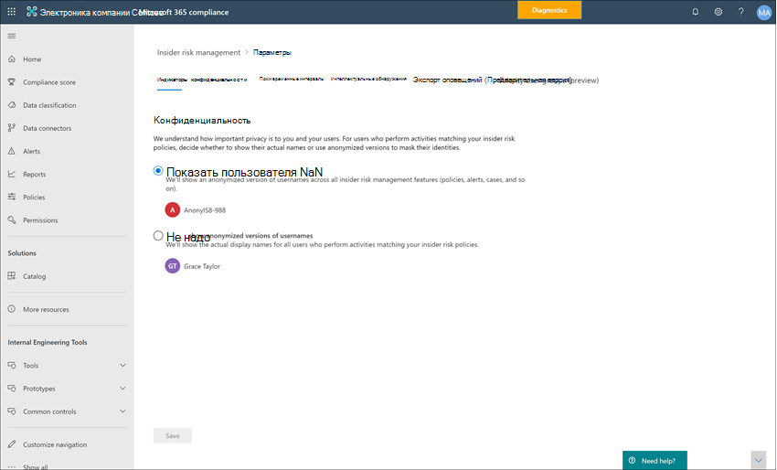
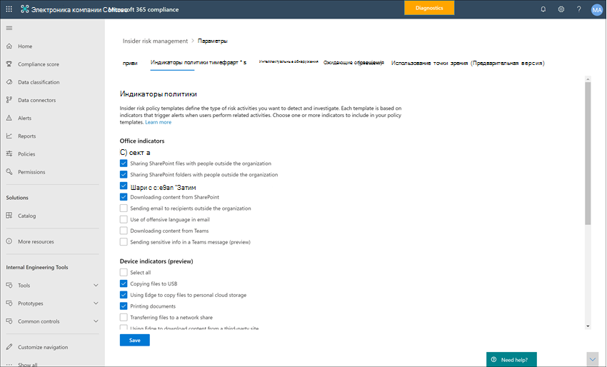
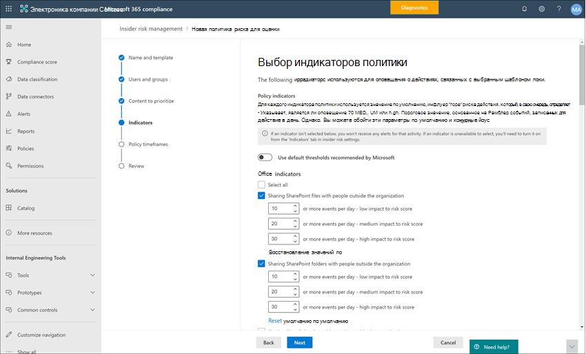
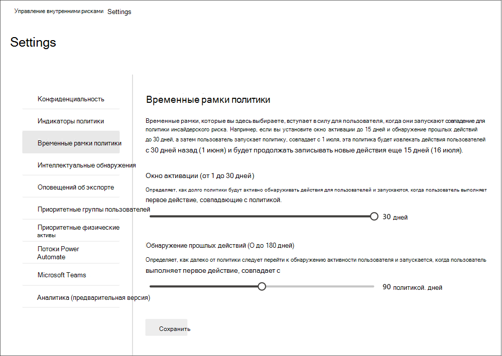
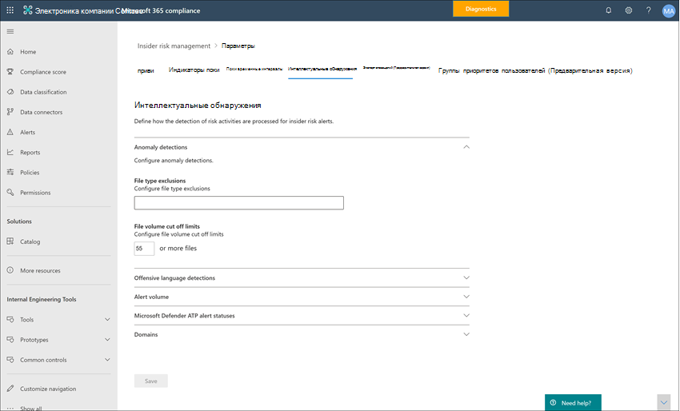
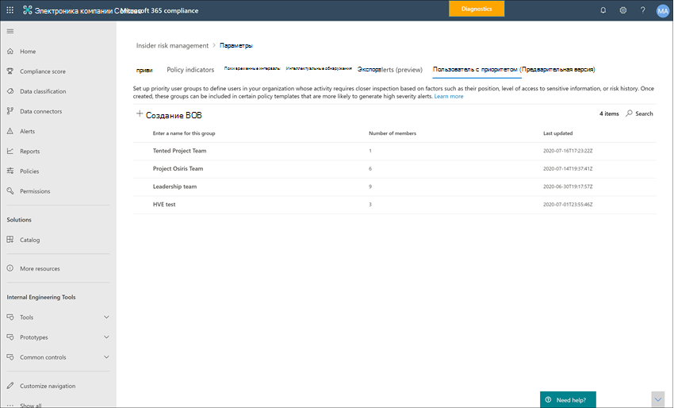

# Начало работы с параметрами управления рисками для оценки

Параметры управления рисками для участников программы предварительной оценки применяются ко всем политикам управления рисками для оценки, независимо от шаблона, выбранного при создании политики. Параметры настраиваются с помощью элемента управления " **параметры риска" для предварительной оценки** , расположенного в верхней части всех вкладок управления рисками для оценки. Эти компоненты политики управления параметрами для следующих областей:

- Конфиденциальность
- Индикаторы
- Временные шкалы политики
- Интеллектуальные обнаружения
- Экспорт оповещений (Предварительная версия)
- Группы приоритетов пользователей (Предварительная версия)
- Приоритет материальных активов (Предварительная версия)
- Автоматизированные потоки управления питанием (ознакомительная версия)
- Microsoft Teams (Предварительная версия)

Перед началом работы и созданием политик управления рисками для оценки важно понимать эти параметры и выбирать оптимальные уровни соответствия требованиям вашей организации.

## Конфиденциальность

Защита конфиденциальности пользователей, имеющих соответствия политике, важна и помогает повысить обжективити при расследовании данных и анализе анализа для оповещений о рисках для оценки. Для пользователей с согласованной политикой риска оценки можно выбрать один из следующих параметров:

- **Показывать анонимные версии**имен пользователей: имена пользователей анонимно запрещают администраторам, обучениям и проверяющим сведения о том, кто связан с оповещениями политики. Например, пользователь "льготный Тайлор" будет отображаться с случайным псеудоним, таким как "AnonIS8 988" во всех областях интерфейса "Управление рисками". При выборе этого параметра анонимизес все пользователи с текущей и предыдущей политикой соответствия и применяются ко всем политикам. При выборе этого параметра сведения о профиле пользователя в оповещениях и сведениях о рисках для участников программы предварительной оценки не будут доступны. Однако имена пользователей отображаются при добавлении новых пользователей в существующие политики или при назначении пользователей новым политикам. Если отключить этот параметр, имена пользователей будут отображаться для всех пользователей, которым соответствуют текущие или прошлые политики.
- **Не показывать анонимные версии имен пользователей**: имена пользователей отображаются для всех текущих и прошлых соответствий политик для оповещений и обращений. Сведения о профиле пользователя (имя, должность, псевдоним, организация или отдел) отображаются для пользователя по всем оповещениям и обращениям по управлению рисками для оценки.

## Индикаторы

Шаблоны политики оценки рисков определяют тип действий риска, которые вы хотите обнаружить и исследовать. Каждый шаблон политики основан на определенных индикаторах, соответствующих определенным триггерам и действиям риска. По умолчанию все индикаторы отключены, поэтому перед настройкой политики управления рисками для оценки необходимо выбрать один или несколько индикаторов политики.

Оповещения инициируются политиками, когда пользователи выполняют действия, связанные с индикаторами политики, которые отвечают требуемому пороговому значению. Для системы управления рисками для оценки используются два типа индикаторов:

- **Запуск событий**: события, определяющие, активен ли пользователь в политике управления рисками для оценки. Если пользователь добавляется к политике управления рисками, не имеющим триггера, то действие пользователя не оценивается политикой. Например, пользователь а добавляется в политику, созданную с помощью шаблона политики " *хищение данных",* а также политики и Microsoft 365 HR Connector. Пока у пользователя A не будет срока завершения, указанный соединителем HR, это значит, что эта политика управления рисками не оценивается для риска. Другой пример события, вызывающего срабатывание триггера, заключается в том, что при использовании политик *утечки данных* пользователь имеет оповещение о *высокой* серьезности защиты от потери данных.
- **Индикаторы политики**: индикаторы, включенные в политики управления рисками для оценки, которые используются для определения оценки риска для пользователя в области. Эти индикаторы политики активируются только после возникновения события запуска для пользователя. Некоторые примеры индикаторов политики применяются, когда пользователь копирует данные в личные облачные службы хранения или портативные устройства хранения, а также если пользователь совместно использует внутренние файлы и папки с неавторизованными внешними сторонами.

Индикаторы политики разбиты на следующие области. Вы можете выбрать индикаторы для активации и настройки пределов событий индикаторов для каждого уровня индикатора при создании политики риска для оценки.

- **Индикаторы Office**: включают индикаторы политики для сайтов SharePoint, Teams и сообщений электронной почты.
- **Индикаторы устройств**: сюда входят индикаторы политики для таких действий, как совместное использование файлов в сети или с устройствами. Индикаторы включают в себя действия, связанные с файлами Microsoft Office. CSV-файлы и. PDF-файлы. Если вы выбираете **индикаторы устройств**, действие обрабатывается только для устройств с Windows 10 Build 1809 или более поздней версии. Для получения дополнительных сведений о настройке устройств для интеграции с риском для оценки безопасности посетите раздел [Enable Device индикаторы и встроенные устройства](insider-risk-management-settings.md#OnboardDevices) .
- **Индикатор нарушения политики безопасности**: включает индикаторы из пакета ATP для защитника Майкрософт, связанные с установкой неутвержденных или вредоносных программ, а также обход элементов управления безопасностью. Для получения оповещений в управлении рисками для предварительной оценки необходимо включить действующую лицензию на пакет ATP для защитника и угрозу для участников. Дополнительные сведения о настройке пакета ATP для защитника Майкрософт для интеграции управления рисками для ИТ можно найти [в статье configure Advanced Features in Microsoft Defender ATP](https://docs.microsoft.com/windows/security/threat-protection/microsoft-defender-atp/advanced-features\#share-endpoint-alerts-with-microsoft-compliance-center).
- **Ускорители показателей риска**: в их числе возникает риск необычных действий или прошлых нарушений политики. Предоставление ускорителей оценки риска повышает показатели рисков и вероятность оповещений для этих типов действий. Ускорители оценки риска могут быть выбраны, только если выбрано одно или несколько индикаторов.

В некоторых случаях может потребоваться ограничить показатели политики риска предварительной оценки, применяемые к политикам риска для оценки в Организации. Вы можете отключить индикаторы политики для определенных областей, отключив их от всех политик оценки риска. Триггерные события нельзя изменить для шаблонов политики риска для оценки.

Чтобы определить индикаторы политики риска для оценки, включенные во всех политиках оценки риска, перейдите к индикаторам **параметров оценки риска**  >  **Indicators** и выберите один или несколько индикаторов политики. Индикаторы, выбранные на странице параметров индикаторов, не могут быть настроены индивидуально при создании или изменении политики риска для оценки в мастере политик.

>[!NOTE]
>Новые пользователи, добавленные вручную, могут отображаться на **панели мониторинга "Пользователи"** в течение нескольких часов. Для отображения действий за последние 90 дней для этих пользователей может потребоваться до 24 часов. Чтобы просмотреть действия для добавленных вручную пользователей, выберите пользователя на **панели мониторинга "Пользователи** " и откройте вкладку **действия пользователя** в области сведений.

### Включение индикаторов устройств и встроенных устройств

Чтобы включить мониторинг действий риска на устройствах и включить индикаторы политики для этих действий, ваши устройства должны удовлетворять следующим требованиям и необходимо выполнить следующие действия по переносу.

#### Шаг 1: подготовка конечных точек

Убедитесь, что на устройствах с Windows 10, которые вы планируете создать отчет об управлении рисками для оценки, выполняются эти требования.

1. Должна работать под управлением Windows 10 x64 Build 1809 или более поздней версии, а также должно быть установлено [Обновление Windows 10 (ОС build 17763,1075)](https://support.microsoft.com/help/4537818/windows-10-update-kb4537818) с 20 февраля 2020.
2. Все устройства должны быть подключены к [Azure Active Directory (AAD)](https://docs.microsoft.com/azure/active-directory/devices/concept-azure-ad-join) или иметь гибридное присоединение к Azure AD.
3. Установите браузер Microsoft Чромиум EDGE на устройстве Endpoint, чтобы отслеживать действия для действия отправки в облако. См. статью [Загрузка нового браузера Microsoft Edge на основе Chromium](https://support.microsoft.com/help/4501095/download-the-new-microsoft-edge-based-on-chromium).

#### Шаг 2: подключение устройств

Необходимо включить мониторинг устройств и встроенные конечные точки, прежде чем вы сможете отслеживать действия по управлению рисками для участников системы. Это можно сделать на портале соответствия требованиям Microsoft 365.

Если вы хотите использовать встроенные устройства, которые еще не подключены, скачайте соответствующий сценарий и разверните его, как описано в следующих шагах.

Если у вас уже есть устройства, подключенные к [Microsoft Defender для конечной точки](https://docs.microsoft.com/windows/security/threat-protection/), они будут отображаться в списке управляемых устройств. Выполните действие 3: Если в следующем разделе приводятся [устройства, подключенные к защитнику Майкрософт для конечной точки](insider-risk-management-settings.md#OnboardStep3) .

В этом сценарии развертывания вы будете подключены к устройствам, которые еще не были подключены к системе, и вам нужно только отследить действия с рисками для участников программы предварительной оценки на устройствах с Windows 10.

1. Откройте [Центр соответствия требованиям Microsoft](https://compliance.microsoft.com).
2. Откройте параметры Центра соответствия требованиям и выберите **Подключение устройств**.

   > [!NOTE]
   > Обычно подключение устройств занимает около 60 секунд, подождите около 30 минут, прежде чем обращаться в службу поддержки Microsoft.

3. Выберите **Управление устройствами**, чтобы открыть список **Устройства** Список будет пустым, пока устройства не будут подключены.
4. Нажмите **Подключение**, чтобы начать процесс.
5. Выберите способ развертывания для дополнительных устройств в списке **Способ развертывания**, а затем **загрузите пакет**.
6. Выполните действия, описанные в разделе [Средства и методы подключения ATP Microsoft Defender для компьютеров с Windows 10](https://docs.microsoft.com/windows/security/threat-protection/microsoft-defender-atp/configure-endpoints). Эта ссылка открывает страницу доступа к процедурам с Microsoft Defender для конечной точки, соответствующим пакету развертывания, который вы выбрали на этапе 5:
    - Подключение компьютеров с Windows 10 с помощью групповой политики
    - Подключение компьютеров с Windows с помощью Microsoft Endpoint Configuration Manager
    - Подключение компьютеров с Windows 10 с помощью инструментов управления мобильными устройствами
    - Подключение компьютеров с Windows 10 с помощью локального сценария
    - Подключение временных компьютеров инфраструктуры виртуальных рабочих столов (VDI).

После завершения работы и конечной точки она должна быть видна в списке устройств, а конечная точка начнет создавать отчеты о журналах действий аудита для оценки управления рисками.

> [!NOTE]
> Эта возможность включает принудительное применение лицензий. Без необходимой лицензии данные не будут видимы или доступны.

#### Шаг 3: если у вас есть устройства, подключенные к защитнику Майкрософт для конечной точки

Если защитник Майкрософт для конечной точки уже развернут, и в нем имеются отчеты о конечных точках, все эти конечные точки будут отображаться в списке Управляемые устройства. Вы можете перейти на новые устройства к управлению рисками, чтобы расширить покрытие с помощью раздела [Step 2: onboarding deviceing Devices](insider-risk-management-settings.md#OnboardStep2) .

1. Откройте [Центр соответствия требованиям Microsoft](https://compliance.microsoft.com).
2. Откройте параметры Центра соответствия требованиям и выберите **Включить отслеживание устройств**.
3. Выберите **Управление устройствами**, чтобы открыть список **Устройства** Отобразится список устройств, которые уже отправляют отчеты в Microsoft Defender для конечной точки.
4. Чтобы подключить дополнительные устройства, выберите **Подключение**.
5. Выберите способ развертывания для дополнительных устройств в списке **Способ развертывания**, а затем **загрузите пакет**.
6. Выполните действия, описанные в разделе [Средства и методы подключения ATP Microsoft Defender для компьютеров с Windows 10](https://docs.microsoft.com/windows/security/threat-protection/microsoft-defender-atp/configure-endpoints). Эта ссылка открывает страницу доступа к процедурам с Microsoft Defender для конечной точки, соответствующим пакету развертывания, который вы выбрали на этапе 5:
    - Подключение компьютеров с Windows 10 с помощью групповой политики
    - Подключение компьютеров с Windows с помощью Microsoft Endpoint Configuration Manager
    - Подключение компьютеров с Windows 10 с помощью инструментов управления мобильными устройствами
    - Подключение компьютеров с Windows 10 с помощью локального сценария
    - Подключение временных компьютеров инфраструктуры виртуальных рабочих столов (VDI).

После завершения работы и конечной точки она должна отображаться в таблице **Devices (устройства** ), а конечная точка начнет создавать отчеты о журналах действий аудита для оценки управления рисками.

> [!NOTE]
>Эта возможность включает принудительное применение лицензий. Без необходимой лицензии данные не будут видимы или доступны.

### Параметры уровня индикатора (Предварительная версия)

При создании политики в мастере политики можно настроить, как ежедневное количество событий риска будет влиять на оценку риска для оповещений о рисках для участников программы. Эти параметры индикатора помогают контролировать, как количество экземпляров событий риска в Организации должно повлиять на оценку риска, а соответственно на степень серьезности оповещений для этих событий. При желании вы также можете оставить уровни по умолчанию для событий, рекомендуемых корпорацией Майкрософт для всех включенных индикаторов.

Например, вы решили включить индикаторы SharePoint в параметрах политики риска предварительной оценки и задать настраиваемые пороги для событий SharePoint при настройке индикаторов для новой политики *утечек данных* о рисках для оценки. В мастере политики риска для оценки вы настраиваете три разных уровня ежедневного события для каждого индикатора SharePoint, чтобы повлиять на оценку риска для оповещений, связанных с этими событиями.

Для первого ежедневного уровня событий вы устанавливаете пороговое значение на *10 или больше событий в день* , чтобы снизить влияние на показатель риска для событий, *20 или больше событий в день* для среднего влияния на показатель риска для событий, и *30 или больше событий в день* более высокое влияние на показатель риска для событий. Эти параметры эффективно означают:

- При наличии 1-9 событий SharePoint, выполняемых после срабатывания события, оценки риска минимально влияют и могут не создавать оповещение.
- При наличии 10-19 событий SharePoint, которые происходят после события, вызванного триггером, показатель риска на самом низком уровне и уровни серьезности оповещений, как правило, будут находиться на низком уровне.
- При наличии 20-29 событий SharePoint, выполняемых после запуска триггера, показатель риска на более высоком уровне и уровни серьезности оповещений, как правило, будут иметь средний уровень.
- При наличии 30 или более событий SharePoint, которые выполняются после запуска триггера, показатель риска на более высоком уровне, а уровни серьезности оповещений, как правило, будут иметь высокий уровень.

## Временные рамки политик

Временные рамки политики позволяют определять периоды предыдущего и будущего рецензирования, которые запускаются после соответствия политике, на основе событий и действий для шаблонов политики управления рисками для оценки. В зависимости от выбранного шаблона политики доступны следующие временные интервалы политики:

- **Окно активации**: доступно для всех шаблонов политик, *окно активации* — это определенное количество дней, в течение которых окно активируется **после** запуска события. Окно активируется в течение 1 – 30 дней после возникновения события запуска для любого пользователя, назначенного политике. Например, вы настроили политику управления рисками для оценки и хотите, чтобы *окно активации* настроило 30 дней. После настройки политики прошло несколько месяцев, а для одного из пользователей, включенных в политику, возникает событие триггера. Событие запуска активирует *окно активации* , а политика активна для этого пользователя в течение 30 дней после возникновения события триггера.
- **Обнаружение прошлых действий**: доступно для всех шаблонов политики, *Обнаружение прошлых действий* — это определенное количество дней, в течение которых окно активируется **до** запуска события. Окно активируется в течение от 0 до 180 дней, пока не будет вызвано событие запуска для любого пользователя, назначенного политике. Например, вы настроили политику управления рисками для предварительной оценки и настроили *Обнаружение прошлых действий* равным 90 дням. После настройки политики прошло несколько месяцев, а для одного из пользователей, включенных в политику, возникает событие триггера. Событие, вызывающее срабатывание, активирует *Обнаружение прошлых действий* , а политика собирает исторические действия для этого пользователя в течение 90 дней до запуска события.

## Интеллектуальные обнаружения

Параметры интеллектуального обнаружения помогают уточнить, как обрабатываются обнаруженные рискованные действия для оповещений. В некоторых случаях может потребоваться определить типы файлов, которые следует игнорировать, или применить уровень обнаружения файлов для определения минимальной полосы для оповещений. При использовании нежелательных языковых политик может потребоваться увеличить или уменьшить чувствительность обнаружения, чтобы управлять количеством обнаруженных соответствий политик. Используйте эти параметры для управления общим объемом оповещений, исключениями типов файлов, ограничениями для томов файлов и нежелательным чувствительностью к обнаружению нежелательных языков.

### Обнаружение аномалий

Нетипичные обнаружения включают параметры для исключений типов файлов и ограничения объема файлов.

- **Исключения типов файлов**: чтобы исключить определенные типы файлов из всех совпадений политики управления рисками для проверки подлинности, введите расширения типов файлов, разделяя их запятыми. Например, чтобы исключить определенные типы музыкальных файлов из соответствия политике, можно ввести *ААК, MP3, WAV, WMA* в поле **типы файлов для исключения** . Файлы с этими расширениями будут игнорироваться всеми политиками управления рисками для оценки.
- **Предельное число сокращений громкости тома**: для определения минимального уровня файлов до отчета об оповещениях об активности в политиках оценки риска введите число файлов. Например, если вы не хотите создавать оповещения о рисках для оценки риска, когда пользователь загружает 10 файлов или меньше, даже если политики считают, что это действие является аномалией, введите "10".

### Нежелательные обнаружения языков

>[!IMPORTANT]
>Начиная с 16 октября 2020, вы не сможете создавать политики с помощью этого шаблона. Все активные политики, использующие этот шаблон, будут работать, пока они не будут окончательно удалены в январе 2021. Мы не рекомендуем использовать встроенный классификатор, который поддерживает этот шаблон, так как он выдает большое число ложных срабатываний. Чтобы устранить проблемы с рисками для оскорбительного языка, мы рекомендуем использовать политики соответствия Microsoft 365 для [связи](communication-compliance.md) . Для получения дополнительных сведений о встроенных классификаторах, ознакомьтесь [со статьей начало работы с предназначенными для обучения классификаторами](classifier-get-started-with.md).

Чтобы настроить чувствительность нежелательного классификатора языка для политик, использующих *нежелательный язык в шаблоне электронной почты* , выберите один из следующих параметров:

- **Низкий**: самый низкий уровень чувствительности с самым широким диапазоном для обнаружения оскорбительного языка и мнений. Вероятность ложных срабатываний для оскорбительного совпадения языков повышается.
- **Medium**: уровень чувствительности среднего уровня с сбалансированным диапазоном для обнаружения оскорбительного языка и мнений. Вероятность ложных срабатываний для оскорбительного совпадения языка — СРЗНАЧ.
- **Высокий**: максимальный уровень чувствительности с небольшим диапазоном для обнаружения оскорбительного языка и мнений. Вероятность ложных срабатываний для нежелательного совпадения языков мала.

### Громкость оповещения

Действиям пользователей, обнаруженным политиками оценки рисков, назначается определенный показатель риска, который, в свою очередь, определяет серьезность оповещения (низкие, средние, высокие). По умолчанию мы создаем определенный объем уведомлений о низком, среднем и высоком уровне серьезности, но вы можете увеличить или уменьшить объем в соответствии с вашими потребностями. Чтобы настроить уровень оповещений для всех политик управления рисками, выберите один из следующих параметров:

- **Уменьшите количество оповещений**: вы увидите все оповещения высокой серьезности, меньшее количество оповещений средней серьезности и отсутствие недостаточной важности. Этот уровень установки означает, что вы можете пропустить некоторые ложные срабатывания.
- **Громкость по умолчанию**: отображаются все оповещения высокой серьезности и сбалансированное количество предупреждений о среднем и низком уровне.
- **Дополнительные оповещения**: вы увидите все предупреждения среднего и высокого уровня, а также предупреждения о низком уровне серьезности. Этот уровень настройки может привести к более ложным срабатываниям.

### Advanced Threat Protection в защитнике Майкрософт (Предварительная версия)

[Advanced Threat Protection в защитнике Майкрософт](https://docs.microsoft.com/windows/security/threat-protection/microsoft-defender-atp/microsoft-defender-advanced-threat-protection) (ATP) — это платформа безопасности для корпоративных конечных точек, предназначенная для предотвращения, обнаружения, проверки и реагирования на дополнительные угрозы в корпоративных сетях. Чтобы лучше понять нарушение безопасности в Организации, вы можете импортировать и фильтровать оповещения защитника Майкрософт для действий, используемых в политиках, созданных на основе шаблонов политики нарушения безопасности системы безопасности для оценки риска.

В зависимости от требуемых типов сигналов можно выбрать Импорт оповещений в систему управления рисками на основе состояния рассмотрения оповещения защитником Майкрософт. В глобальных параметрах для импорта можно определить одно или несколько следующих состояний рассмотрения оповещения:

- Unknown
- Новое
- Выполняется
- Устранено

Оповещения от Microsoft Defender ATP импортируются ежедневно. В зависимости от выбранного состояния рассмотрения вы можете увидеть несколько действий пользователя для одного и того же оповещения, когда состояние рассмотрения изменяется в статье Microsoft Defender ATP.

Например, если выбрано значение *создать*, *в ходе выполнения*и *разрешено* для этого параметра, при создании оповещения Майкрософт для защитника ATP и изменении состояния " *новое*" для пользователя будет импортировано исходное действие оповещения. Когда состояние рассмотрения для защитника Майкрософт изменяется на *в ходе выполнения*, для пользователя будет импортировано второе действие для этого оповещения. Когда задается Последнее состояние рассмотрения " *разрешено* " для защитника Майкрософт, третье действие для этого оповещения импортируется для пользователя в составе риска для оценки. Эта функция позволяет обследовать ход выполнения оповещений защитника Microsoft Defender и выбирать уровень видимости, необходимый для их расследования.

>[!IMPORTANT]
>Вам потребуется настроить в Организации пакет ATP для защитника Microsoft и включить пакет ATP для защитника Майкрософт для интеграции управления рисками в центре безопасности защитника, чтобы импортировать оповещения о нарушениях безопасности. Дополнительные сведения о настройке пакета ATP для защитника Майкрософт для интеграции управления рисками для ИТ можно найти [в статье configure Advanced Features in Microsoft Defender ATP](https://docs.microsoft.com/windows/security/threat-protection/microsoft-defender-atp/advanced-features\#share-endpoint-alerts-with-microsoft-compliance-center).

### Домены (Предварительная версия)

Параметры домена помогают определить уровни риска для связи с определенными доменами. Эти сообщения включают в себя общий доступ к файлам, сообщениям электронной почты или загрузке контента. Указав домены в этих параметрах, вы можете увеличить или уменьшить степень риска для действий, выполняемых с этими доменами. Например, чтобы указать contoso.com и sales.wingtiptoys.com в качестве разрешенных доменов, введите "contoso.com sales.wingtiptoys.com" в поле **разрешенные домены** .

Для каждого из следующих параметров домена можно ввести до 500 доменов:

- **Неразрешенные домены:** Указывая неразрешенные домены, действия, выполняемые с этими доменами, будут иметь *более высокие* показатели риска.
- **Разрешенные домены:** Указывая разрешенные домены в параметрах, действия, выполняемые с этими доменами, будут иметь *более низкие* показатели риска и рассматриваются аналогично тому, как обрабатываются внутренние действия Организации. Например, действия электронной почты для этих доменов анализируются точно так же, как проанализировать внутренние действия с электронной почтой.
- **Домены третьих сторон:** Домены третьих сторон — это домены, используемые в Организации для бизнес-целей, и конфиденциальные материалы могут храниться в этих расположениях. Указывая домен стороннего производителя, вы можете получать оповещения о рискованных действиях в этих доменах.

## Экспорт оповещений (Предварительная версия)

Сведения оповещений об управлении рисками можно экспортировать в службы безопасности и управления событиями (SIEM) с помощью [схемы API действий управления Office 365](https://docs.microsoft.com/office/office-365-management-api/office-365-management-activity-api-schema#security-and-compliance-alerts-schema). Вы можете использовать API действий управления Office 365 для экспорта данных оповещений в другие приложения, которые могут использоваться в Организации для управления или объединения сведений о рисках для оценки.

Чтобы использовать API для просмотра сведений об оповещениях о риске для программы предварительной оценки:

1. Включение поддержки API действий управления для Office 365 в ходе экспорта параметров **управления рисками для участников**  >  **Settings**  >  **Export**. По умолчанию этот параметр отключен для вашей организации Microsoft 365.
2. Отфильтруйте общие действия аудита Office 365 по *секуритикомплианцеалертс*.
3. Фильтрация *секуритикомплианцеалертс* по категории *инсидеррискманажемент* .

Информация оповещения содержит сведения из схемы оповещений о безопасности и соответствия требованиям, а также общую схему API действий управления Office 365.

Следующие поля и значения экспортируются для оповещений об управлении рисками в системе безопасности для схемы оповещений о соответствии & безопасности:

| **Параметр Alert** | **Описание** |
|:------------------|:----------------|
| AlertType | Тип оповещения — *Custom*.  |
| AlertId | GUID оповещения. Оповещения об управлении рисками для участников поддаются изменяющимся. При изменении состояния оповещения создается новый журнал с таким же Алертид. Этот Алертид можно использовать для сопоставления обновлений оповещений. |
| Category | Категория оповещения — *инсидеррискманажемент*. Эту категорию можно использовать для различения оповещений от других оповещений о соответствии & безопасности. |
| Комментарии | Комментарии по умолчанию для оповещения. Значения — это *новое оповещение* (регистрируется при создании оповещения) и *оповещение Обновлено* (регистрируется при обновлении оповещения). Используйте Алертид для согласования обновлений для оповещения. |
| Данные | Данные для оповещения включают уникальный идентификатор пользователя, имя участника-пользователя, а также дату и время (UTC), когда пользователь активировался в политику. |
| Имя | Имя политики для политики управления рисками, которая создала оповещение. |
| PolicyId | GUID политики управления рисками для оценки, вызвавшей оповещение. |
| Severity | Степень серьезности оповещения. Значения: *Высокая*, *Средняя*или *Минимальная*. |
| Источник | Источник оповещения. Значение — *Office 365 Security & соответствия требованиям*. |
| Status | Состояние оповещения. Значения *активны* (*необходимо проанализировать* в риске для эксперта), *исследование* (*подтверждено* в риске для эксперта), *устранено* (*разрешено* в результате оценки), *закрыто* (было*закрыто* в угрозе "Эксперт"). |
| Версия | Версия схемы оповещений о безопасности и соответствии требованиям. |

Следующие поля и значения экспортируются для оповещений об управлении рисками для участников программы-помощника по управлению рисками [Office 365 для общей схемы API действий управления](https://docs.microsoft.com/office/office-365-management-api/office-365-management-activity-api-schema#common-schema).

- UserId
- Id
- RecordType
- CreationTime
- Operation
- OrganizationId
- UserType
- UserKey

## Группы приоритетов пользователей (Предварительная версия)

Пользователи в вашей организации могут иметь разные уровни риска в зависимости от их положения, уровня доступа к конфиденциальным сведениям или истории риска. Определение приоритетов для оценки и оценки действий этих пользователей может помочь в оповещении о потенциальных рисках, которые могут повлиять на работу Организации. Приоритетные группы пользователей в управлении рисками для участников поможет определить пользователей в Организации, которым требуется более подробная проверка и более важные оценки риска. В сочетании с *нарушениями политики безопасности с учетом приоритетов пользователей* и *потерь данных с помощью шаблонов политики приоритетов* пользователи, добавленные к группе приоритетных пользователей, имеют повышенную вероятность оповещений о рисках и оповещений с более высоким уровнем серьезности.

Например, необходимо защитить от утечки данных для проекта с высоким уровнем конфиденциальности, в котором пользователи имеют доступ к конфиденциальным данным. Вы решили создать *конфиденциальные* *Пользователи* проекта группа пользователей для пользователей в Организации, которые работают над этим проектом. С помощью мастера политик и шаблона политики " *утечки данных с учетом приоритетов пользователей* " создается новая политика и назначается политике группа пользователей с приоритетом " *конфиденциальные пользователи проекта* ". Действия, проверяемые политикой для членов группы пользователей с приоритетом " *конфиденциальные пользователи проекта* ", более чувствительны к рискам и действиям, которые могут повлиять на создание оповещения и наличие оповещений с более высоким уровнем серьезности.

### Создание группы приоритетов пользователей

Чтобы создать новую группу приоритетов, вы будете использовать параметры элементов управления в решении по **управлению рисками для оценки** в центре соответствия требованиям Microsoft 365. Для создания группы приоритетов пользователей необходимо быть участником группы ролей " *Управление рисками* " или *"* управление рисками" для участников.

Выполните следующие действия, чтобы создать группу приоритетов пользователей:

1. В [центре соответствия требованиям Microsoft 365](https://compliance.microsoft.com)перейдите к разделу **Управление рисками для оценки** и выберите **параметры риска для участников программы предварительной оценки**.
2. Выбор вкладки **приоритет пользователей и групп**
3. На вкладке **приоритет групп пользователей** выберите **Создать приоритет группы пользователей** , чтобы запустить мастер создания групп.
4. На странице **Определение группы** заполните следующие поля:
    - **Name (обязательно)**: введите понятное имя для группы пользователей Priority. После завершения работы мастера невозможно изменить имя группы пользователей Priority.
    - **Description (необязательно)**: введите описание для группы пользователей Priority.
5. Нажмите кнопку **Далее** , чтобы продолжить.
6. На странице **Выбор участников** выберите **выбрать участников** для поиска и выберите, какие учетные записи пользователей с включенной поддержкой почты включены в группу, или установите флажок **выбрать все** , чтобы добавить в группу всех пользователей организации. Нажмите кнопку **Добавить** , чтобы продолжить, или **Отмена** , чтобы закрыть окно, не добавляя пользователей в группу.
7. Нажмите кнопку **Далее** , чтобы продолжить.
8. На странице " **Рецензирование** " Проверьте параметры, выбранные для группы приоритетов пользователей. Нажмите кнопку **изменить** , чтобы изменить значения для группы, или кнопку **послать** , чтобы создать и активировать группу приоритетов пользователей.
9. На странице Подтверждение нажмите кнопку **Готово** , чтобы завершить работу мастера.

### Обновление группы приоритетов пользователей

Чтобы обновить существующую группу пользователей Priority, вы будете использовать параметры элементов управления в решении по **управлению рисками для оценки** в центре соответствия требованиям Microsoft 365. Чтобы обновить группу приоритетов пользователей, необходимо быть участником группы ролей " *Управление рисками* *" или "* управление рисками" для участников.

Выполните следующие действия, чтобы изменить группу приоритетов пользователей:

1. В [центре соответствия требованиям Microsoft 365](https://compliance.microsoft.com)перейдите к разделу **Управление рисками для оценки** и выберите **параметры риска для участников программы предварительной оценки**.
2. Выбор вкладки **приоритет пользователей и групп**
3. Выберите приоритетную группу пользователей, которую нужно изменить, и нажмите кнопку **изменить группу**.
4. На странице **Определение группы** обновите поле Описание, если это необходимо. Невозможно обновить имя группы пользователей Priority. Нажмите кнопку **Далее** , чтобы продолжить.
5. На странице " **Выбор элементов** " добавьте в группу новых участников с помощью элемента управления " **выбрать элементы** ". Чтобы удалить пользователя из группы, нажмите кнопку "X" рядом с пользователем, которого вы хотите удалить. Нажмите кнопку **Далее** , чтобы продолжить.
6. На странице " **Проверка** " Проверьте параметры обновления, выбранные для группы приоритетов пользователей. Нажмите кнопку **изменить** , чтобы изменить значения для группы, или кнопку **послать** , чтобы обновить группу приоритетов пользователей.
7. На странице Подтверждение нажмите кнопку **Готово** , чтобы завершить работу мастера.

### Удаление приоритетной группы пользователей

Чтобы удалить имеющуюся группу приоритетов, вы будете использовать параметры элементов управления в решении по **управлению рисками для оценки** в центре соответствия требованиям Microsoft 365. Для удаления приоритетной группы пользователей необходимо быть участником группы ролей " *Управление рисками* " или *"* управление рисками".

>[!IMPORTANT]
>При удалении группы пользователей приоритета она будет удалена из любой активной политики, которой она назначена. Если вы удаляете группу приоритетов, назначенную активной политике, она не будет содержать каких-либо пользователей в области и будет фактически неактивна и не создаст оповещения.

Выполните следующие действия, чтобы удалить группу приоритетов пользователей:

1. В [центре соответствия требованиям Microsoft 365](https://compliance.microsoft.com)перейдите к разделу **Управление рисками для оценки** и выберите **параметры риска для участников программы предварительной оценки**.
2. Выбор вкладки **приоритет пользователей и групп**
3. Выберите приоритетную группу пользователей, которую нужно изменить, и выберите команду **Удалить** в меню панели мониторинга.
4. В диалоговом окне **Удалить** нажмите кнопку **Да** , чтобы удалить группу приоритетов пользователей, или кнопку **Отмена** , чтобы вернуться на панель мониторинга.

## Приоритет материальных активов (Предварительная версия)

Определение доступа к физическим ресурсам приоритета и согласование действий доступа для событий пользователей является важным компонентом инфраструктуры соответствия. Эти физические активы представляют собой расположения приоритетов в вашей организации, такие как строения компаний, центры обработки данных или серверные комнаты. Действия, связанные с потенциальными рисками, могут быть связаны с пользователями, которые работают ненормальные часы, попытка доступа к этим неавторизованным или защищенным областям и запросы на доступ к областям высокого уровня без подлинных требований.

При включенных физических активах и настроенном [физическом наградыом соединителе](import-physical-badging-data.md) подсистемы управления рисками обеспечивается интеграция сигналов, отличных от физических управления и системы доступа с другими действиями, связанными с рисками пользователей. Изучив закономерности поведений в системах физического доступа и соотнесение этих действий с другими событиями, связанными с рисками при предварительной проверке, управление рисками при предварительной проверке могут помочь обучению и аналитикам принимать более информированные решения об отклике Доступ к физическим активам с приоритетом задаются и определяются в Insights не так, как доступ к неприоритетным ресурсам.

Например, в Организации имеется система награды для пользователей, отслеживающих и утверждающих физический доступ к обычным рабочим и конфиденциальным областям проектов. У вас есть несколько пользователей, работающих с конфиденциальным проектом, и эти пользователи будут возвращаться в другие области организации после завершения проекта. По мере завершения проекта конфиденциальной информации необходимо убедиться в том, что работа над проектом остается конфиденциальной, а доступ к областям проекта осуществляется строго.

Вы можете включить физический соединитель данных награды в Microsoft 365 для импорта сведений о доступе из физической системы награды и указать приоритетные физические активы в управлении рисками для оценки. При импорте информации из системы награды и корреляции сведений о физическом доступе с другими действиями риска, определенными в разделе Управление рисками для предварительной оценки, вы заметили, что один из пользователей проекта обращается к офисам проектов после обычных рабочих часов, а также экспортирует большие объемы данных в службу личных облачных хранилищ из нормальной рабочей области. Эта операция физического доступа, связанная с действием Online, может указывать на возможную кражу данных, а аналитики соответствия требованиям и аналитики могут предпринять соответствующие действия в соответствии с условиями этого пользователя.

### Настройка приоритетных физических активов

Чтобы настроить приоритет физических активов, необходимо настроить физический соединитель награды и использовать параметры управления в решении по **управлению рисками для оценки** в центре соответствия требованиям Microsoft 365. Для настройки приоритетных физических активов необходимо быть участником *группы ролей "* *Управление рисками* " или "Управление рисками" для участников.

Выполните следующие действия, чтобы настроить приоритетные физические активы:

1. Выполните действия по настройке для руководства по управлению рисками в статье [Начало работы с руководством по управлению рисками для участников](insider-risk-management-configure.md) программы. На шаге 3 Убедитесь, что вы настроили физический соединитель награды.

    >[!IMPORTANT]
    >Чтобы использовать политики управления рисками и сопоставлять данные о сигналах, связанные с отправкой и завершением работы пользователей с данными событий из физических платформ управления и доступа, необходимо также настроить Microsoft 365 HR Connector. Если вы включаете физический соединитель награды без включения соединителя Microsoft 365 HR, политики управления рисками для оценки будут обрабатывать события только для действий физического доступа для пользователей в вашей организации.

2. В [центре соответствия требованиям Microsoft 365](https://compliance.microsoft.com)перейдите к разделу **Управление рисками для участников программы предварительной оценки** и выберите **параметры риска для оценки**,  >  **приоритет физических активов**.
3. На странице **приоритет физических активов** можно вручную добавить коды физических активов, которые необходимо отслеживать для событий актива, импортированных физическим соединителем награды, или импортировать. CSV-файл всех физических активов, импортированных физическим соединителем награды: a) чтобы вручную добавить коды физических активов, выберите **Добавить приоритетные физические активы**, введите код физического ресурса, а затем нажмите кнопку **Добавить**. Введите дополнительные коды физических активов, а затем выберите **добавить важные физические активы** для сохранения всех введенных активов.
    б), чтобы добавить список инвентарных номеров для. CSV-файл, выберите пункт **импортировать физические активы**. В диалоговом окне проводника выберите файл. CSV-файл, который вы хотите импортировать, и нажмите кнопку **Открыть**. Коды физических активов из. CSV-файлы добавляются в список.
4. Перейдите на вкладку **индикаторы политики** в разделе Параметры.
5. На странице " **индикаторы политики** " перейдите к разделу **индикаторы физического доступа** и установите флажок для **физического доступа после прекращения или неудачного доступа к конфиденциальному ресурсу**.
6. Нажмите кнопку **сохранить** , чтобы настроить и выйти.

### Удаление приоритетного физического актива

Чтобы удалить существующий физический ресурс с приоритетом, вы будете использовать параметры элементов управления в решении по управлению рисками для предварительной оценки в центре соответствия требованиям Microsoft 365. Чтобы удалить физический ресурс с приоритетом, необходимо быть участником группы ролей "Управление рисками" или "Управление рисками".

>[!IMPORTANT]
>При удалении физического ресурса с приоритетом он удаляется из проверки любыми активными политиками, в которые он был ранее включен. Оповещения, созданные действиями, связанными с физическим активом Priority, не удаляются.

Выполните следующие действия, чтобы удалить физический ресурс с приоритетом:

1. В [центре соответствия требованиям Microsoft 365](https://compliance.microsoft.com)перейдите к разделу **Управление рисками для участников программы предварительной оценки** и выберите **параметры риска для оценки**,  >  **приоритет физических активов**.
2. На странице **приоритет физических активов** выберите ресурс, который требуется удалить.
3. В меню Действие выберите команду **Удалить** , чтобы удалить актив.

## Автоматизированные потоки управления питанием (ознакомительная версия)

[Microsoft Power автоматизиру](https://docs.microsoft.com/power-automate/getting-started) — это служба рабочих процессов, автоматизирующая действия между приложениями и службами. Используя потоки из шаблонов или созданные вручную, вы можете автоматизировать распространенные задачи, связанные с этими приложениями и службами. При включении автоматизированного управления потоками для управления рисками для оценки безопасности можно автоматизировать важные задачи для обращений и пользователей. Вы можете настроить автоматизированные потоки управления питанием, чтобы получать сведения о пользователях, оповещениях и делах, а также предоставлять эти сведения с помощью заинтересованных лиц и других приложений, а также автоматизировать действия в управлении рисками, такие как учет заметок к случаю. Потоки автоматизации энергопотребления применяются для случаев и любого пользователя в области применения политики.

Клиенты с подпиской на Microsoft 365, которые включают в себя управление рисками для предварительной оценки, не требуют дополнительных лицензий Power Management для использования рекомендуемых автоматизированных шаблонов управления рисками для системы безопасности. Эти шаблоны можно изменить, чтобы обеспечить поддержку вашей организации и охватить основные сценарии управления рисками при предварительной настройке. Если вы решили использовать функции автоматизированного управления питанием в этих шаблонах, создайте настраиваемый шаблон с помощью соединителя соответствия требованиям Microsoft 365 или используйте шаблоны Power автоматизировать для других областей соответствия в Microsoft 365, возможно, вам потребуются дополнительные лицензии Power автоматизирующие.

>[!IMPORTANT]
>Приходят приглашения на дополнительные проверки лицензий при тестировании автоматизации энергопотребления? Возможно, ваша организация еще не получала обновления службы для этой функции предварительного просмотра. Выполняется развертывание обновлений, а все организации с подпиской Microsoft 365, которые включают в себя управление рисками для участников программы предварительной оценки, должны иметь поддержку лицензий для потоков, созданных на основе рекомендуемых шаблонов Power автоматизировать, на 30 октября 2020.

Для поддержки автоматизации процессов для пользователей и обращений по управлению рисками предоставляются следующие шаблоны автоматизации управления питанием.

- **Уведомлять пользователей о добавлении в политику риска для оценки**: этот шаблон предназначен для организаций с внутренними политиками, конфиденциальностью или нормативными требованиями, по которым пользователи должны получать уведомления, когда они подчиняются политикам управления рисками. Если этот процесс настроен и выбран для пользователя на странице Пользователи, пользователи и их руководители отправляют сообщение электронной почты, когда пользователь добавляется в политику управления рисками для оценки. Этот шаблон также поддерживает обновление списка SharePoint, размещенного на сайте SharePoint, для отслеживания сведений о сообщениях уведомлений, таких как Дата и время, а также получателя сообщения. Если вы выбрали анонимизацию пользователей в **параметрах конфиденциальности**, потоки, созданные из этого шаблона, не будут работать должным образом, чтобы поддерживать конфиденциальность пользователей. Power автоматизирующие потоки, использующие этот шаблон, доступны на **панели мониторинга "Пользователи"**.
- **Запросите информацию от отдела кадров или бизнеса о пользователе в случае**, если у вас есть дело с потенциальным риском для участников программы предварительной оценки. Если этот процесс настроен и выбран для случая, аналитики и изучении отправляют сообщение электронной почты сотрудникам отдела кадров и бизнес-лиц, настроенным для этого процесса. Каждому получателю отправляется сообщение с предварительно настроенными или настраиваемыми параметрами ответа. Когда получатели выбирают параметр ответа, ответ записывается в виде заметки о случае и включает сведения о получателе и дате и времени. Если вы выбрали анонимизацию пользователей в **параметрах конфиденциальности**, потоки, созданные из этого шаблона, не будут работать должным образом, чтобы поддерживать конфиденциальность пользователей. Автоматизированные потоки управления питанием с помощью этого шаблона доступны на **панели мониторинга "обращения"**.
- **Уведомить менеджера при наличии у пользователя оповещения о риске для оценки безопасности**: в некоторых организациях может потребоваться немедленное уведомление управления, если у пользователя есть оповещение об управлении рисками для участников. Когда этот процесс настроен и выбран, руководителю пользователя в случае отправляется сообщение электронной почты со следующими сведениями о всех оповещениях о делах. 
    - Соответствующая политика для оповещения
    - Дата и время оповещения
    - Уровень серьезности оповещения

    В этом случае автоматически обновляются заметка о том, что сообщение было отправлено и что этот процесс был активирован. Если вы выбрали анонимизацию пользователей в **параметрах конфиденциальности**, потоки, созданные из этого шаблона, не будут работать должным образом, чтобы поддерживать конфиденциальность пользователей. Автоматизированные потоки управления питанием с помощью этого шаблона доступны на **панели мониторинга "обращения"**.

- **Добавить напоминание календаря к исполнению в случае риска**с экспертом: этот шаблон позволяет экспертным исследованиям и аналитикам добавлять напоминания календаря для обращений в календарь Office 365 Outlook. Этот поток устраняет необходимость выйти или выключать рабочий процесс системы управления рисками для оценки при обработке обращений и рассмотрения оповещений. Когда этот процесс настроен и выбран, для пользователя, выполняющего этот процесс, добавляется напоминание в календарь Outlook для Office 365. Автоматизированные потоки управления питанием с помощью этого шаблона доступны на **панели мониторинга "обращения"**.

### Создание автоматизированного управления питанием из шаблона управления рисками для оценки

Чтобы создать поток автоматизации управления питанием из рекомендуемого шаблона управления рисками для оценки безопасности, вы будете использовать элементы управления параметрами в решении " **Управление рисками** " в центре соответствия требованиям Microsoft 365 или " **управление автоматизированными потоками** " из **автоматизированного** управления при работе непосредственно на **панелях мониторинга "** **обращения** " и "Пользователи".

Чтобы создать в области параметров блок автоматизации энергопотребления, необходимо быть участником группы ролей " *Управление рисками* " или *"* управление рисками". Для создания автоматизированного потока управления с параметром " **Управление потоками Power автоматизировать** " необходимо быть членом по крайней мере одной группы ролей "Управление рисками".

Выполните указанные ниже действия, чтобы создать цикл автоматизации Power из рекомендуемого шаблона управления рисками для оценки.

1. В [центре соответствия требованиям Microsoft 365](https://compliance.microsoft.com/)перейдите к разделу **Управление рисками для предварительной оценки** и выберите пункт " **параметры оценки риска**"  >  **автоматизированные потоки управления питанием**. Вы также можете получить доступ к страницам панелей мониторинга " **обращения** " или **"Пользователи"** , выбрав пункт **Автоматизация**  >  **управления Power автоматизированных потоков**.
2. На странице **Power автоматизация потоков** выберите рекомендуемый шаблон из шаблона **Управление рисками для оценки, которые могут быть** в разделе.
3. В этом блоке перечислены внедренные подключения, необходимые для этого процесса, и они будут иметь значение, если состояние подключения доступно. При необходимости обновите все подключения, которые не отображаются как доступные. Нажмите кнопку **продолжить**.
4. По умолчанию Рекомендуемые потоки предварительно настроены с использованием рекомендуемого управления рисками для предварительной оценки и полей данных службы Microsoft 365, необходимых для выполнения назначенной задачи для потока. При необходимости настройте компоненты Flow с помощью элемента управления **Показать дополнительные параметры** и настройте доступные свойства для компонента Flow.
5. При необходимости добавьте дополнительные действия в потоки, нажав кнопку **создать шаг** . В большинстве случаев это не требуется для рекомендуемых шаблонов по умолчанию.
6. Выберите **Сохранить черновик** , чтобы сохранить его для дальнейшей настройки, или нажмите кнопку **сохранить** , чтобы завершить настройку для этого процесса.
7. Нажмите кнопку **Закрыть** , чтобы вернуться на страницу **Power автоматизированного управления** . Новый шаблон будет отображаться как поток на вкладках **мои потоки** и автоматически доступен из меню **автоматизации** раскрывающегося меню при работе с вариантами управления рисками для оценки пользователей, создающим поток.

>[!IMPORTANT]
>Если другие пользователи в организации нуждаются в доступе к такому блоку, этот процесс должен быть общим.

### Создание пользовательского процесса автоматизации управления питанием для системы управления рисками

Некоторые процессы и рабочие процессы для организации могут находиться за прерядами рекомендуемых шаблонов потока управления рисками, а также для создания пользовательских потоков автоматизации для областей управления рисками. Автоматизированные потоки управления питанием являются гибкими и поддерживают обширную настройку, но для интеграции с функциями управления рисками для участников рекомендуется выполнить действия, которые необходимо предпринять.

Выполните следующие действия, чтобы создать настраиваемый шаблон Power автоматизиру для управления рисками по подучастнику:

1. **Проверьте лицензию Power автоматизирующий**: для создания настраиваемых автоматизированных потоков, использующих триггеры управления рисками для участников программы, вам потребуется лицензия Power автоматизировать. Рекомендуемые шаблоны управления рисками для участников программы предварительной оценки не требуют дополнительного лицензирования и входят в состав лицензии на управление рисками для оценки.
2. **Создание автоматизированного процесса**: Создайте процесс, который выполняет одну или несколько задач после запуска события управления рисками для оценки. Сведения о том, как создать автоматизированный процесс, можно найти [в статье Создание последовательности в Power Автоматизация](https://docs.microsoft.com/power-automate/get-started-logic-flow).
3. **Выберите соединитель соответствия требованиям microsoft 365**: Найдите и выберите соединитель Microsoft 365 для соответствия требованиям. Этот соединитель включает триггеры и действия по управлению рисками для участников. Дополнительные сведения о соединителях приведены в статье [Обзор соединителя](https://docs.microsoft.com/connectors/connector-reference/) .
4. **Выберите триггеры управления рисками для вашего потока**: управление рисками для системы оценки безопасности имеет два триггера для пользовательских потоков автоматизации управления питанием:
    - **Для выбранного случая управления рисками для предварительной оценки**: потоки с этим триггером можно выбрать на странице панели мониторинга "Управление рисками".
    - **Для выбранного пользователя управления рисками для участников**: потоки с этим триггером можно выбрать на странице панели мониторинга "Пользователи" Управление рисками для оценки.
5. Выберите действия по управлению рисками для вашего процесса: вы можете выбрать один из нескольких действий по управлению рисками, чтобы включить их в настраиваемый ход:
    - Получение оповещения об управлении рисками для оценки
    - Получение примера управления рисками для оценки
    - Получение пользователя управления рисками для оценки
    - Получение оповещений об управлении рисками для обращения
    - Добавление заметки о наличии в управлении рисками для участников

### Совместное использование автоматизированного управления питанием

По умолчанию автоматизированные потоки управления питанием, созданные пользователем, доступны только этому пользователю. Чтобы другие пользователи с уровнем предварительной оценки безопасности могли получать доступ и использовать потоки, этот процесс должен предоставляться создателем поточнее. Для совместного использования потока вы будете использовать элементы управления параметрами в **решении по управлению рисками для оценки** в центре соответствия требованиям Microsoft 365 или в режиме управления автоматизированными **потоками** из автоматизированного управления при работе непосредственно на страницах панелей мониторинга " **обращения** " и **"Пользователи"** . После того как вы получите общий доступ к **такому** объекту, все, кому предоставлен общий доступ, смогут получить доступ к нему в раскрывающемся меню **Автоматизация** элементов управления на случай и на **панелях мониторинга пользователей**.

Для совместного использования автоматизации управления питанием в области Параметры необходимо быть участником группы ролей " *Управление рисками* *" или "* управление рисками". Для совместного использования автоматизации управления питанием с параметром " **Управление потоками Power автоматизировать** " необходимо быть членом по крайней мере одной группы ролей "Управление рисками".

Выполните следующие действия, чтобы предоставить общий доступ к автоматизации энергопотребления:

1. В [центре соответствия требованиям Microsoft 365](htttps://compliance.microsoft.com)перейдите к разделу **Управление рисками для предварительной оценки** и выберите пункт " **параметры оценки риска**"  >  **автоматизированные потоки управления питанием**. Вы также можете получить доступ к страницам панелей мониторинга " **обращения** " или **"Пользователи"** , выбрав пункт **Автоматизация**  >  **управления Power автоматизированных потоков**.
2. На странице **Power автоматизация потоков** перейдите на вкладку **мои потоки** или **потоки команд** .
3. Выберите способ передачи, а затем выберите пункт **общий доступ** в меню Параметры процесса.
4. На странице "общий доступ к данным" выберите имя пользователя или группы, которые требуется добавить в качестве владельца для этого процесса.
5. В диалоговом окне **используемое подключение** нажмите кнопку **ОК** , чтобы подтвердить, что добавленный пользователь или группа будут иметь полный доступ к данному блоку.

### Изменение автоматизированного процесса управления питанием

Чтобы изменить поток, вы будете использовать элементы управления параметрами в решении по **управлению рисками для предварительной оценки** в центре соответствия требованиям Microsoft 365 или " **управление автоматизированными потоками** управления" из **автоматизированного** управления при работе с **панелями мониторинга "** **обращения** " или "Пользователи".

Для изменения режима автоматизации автоматизации в области Параметры необходимо быть участником группы ролей " *Управление рисками* *" или "* управление рисками" для участников. Чтобы изменить поток автоматизации управления питанием с помощью функции управления потоками управления **питанием** , необходимо быть членом по крайней мере одной группы ролей "Управление рисками".

Выполните следующие действия, чтобы изменить процесс автоматизации Power Автоматизация:

1. В [центре соответствия требованиям Microsoft 365](htttps://compliance.microsoft.com)перейдите к разделу **Управление рисками для предварительной оценки** и выберите пункт " **параметры оценки риска**"  >  **автоматизированные потоки управления питанием**. Вы также можете получить доступ к страницам панелей мониторинга " **обращения** " или **"Пользователи"** , выбрав пункт **Автоматизация**  >  **управления Power автоматизированных потоков**.
2. На странице **Power автоматизация потоков** выберите поток для редактирования и в меню Управление выполнением выберите команду **Правка** .
3. Нажмите **кнопку**"  >  **Параметры** ", чтобы изменить параметр компонента или **кнопку "многоточие**"  >  **Delete** , чтобы удалить компонент процесса.
4. Нажмите кнопку **сохранить** , а затем **закройте** , чтобы завершить изменение процесса.

### Удаление автоматизированного процесса управления питанием

Чтобы удалить поток, вы будете использовать элементы управления параметрами в решении по **управлению рисками для предварительной оценки** в центре соответствия требованиям Microsoft 365 или " **управление автоматизированными потоками** управления" из **автоматизированного** управления при работе с **панелями мониторинга "** **обращения** " или "Пользователи". При удалении процесса он удаляется как вариант для всех пользователей.

Чтобы удалить блок автоматизации управления питанием в области параметров, необходимо быть участником группы ролей " *Управление рисками* *" или "* управление рисками" для участников. Чтобы удалить поток автоматизации управления питанием с параметром " **Управление потоками Power автоматизировать** ", необходимо быть членом по крайней мере одной группы ролей "Управление рисками".

Выполните следующие действия, чтобы удалить процесс автоматизации Power:

1. В [центре соответствия требованиям Microsoft 365](htttps://compliance.microsoft.com)перейдите к разделу **Управление рисками для предварительной оценки** и выберите пункт " **параметры оценки риска**"  >  **автоматизированные потоки управления питанием**. Вы также можете получить доступ к страницам панелей мониторинга " **обращения** " или **"Пользователи"** , выбрав пункт **Автоматизация**  >  **управления Power автоматизированных потоков**.
2. На странице **Power автоматизация потоков** выберите поток, который требуется удалить, и выберите **Удалить** в меню Управление потоками.
3. В диалоговом окне подтверждения удаления нажмите кнопку **Удалить** , чтобы удалить этот процесс, или кнопку **Отмена** , чтобы выйти из действия удаления.

## Microsoft Teams (Предварительная версия)

Аналитики и средства исследования соответствия могут легко использовать Microsoft Teams для совместной работы по вопросам управления рисками для оценки. Они могут координировать и общаться с другими заинтересованными сторонами в Microsoft Teams, чтобы:

- Координация и Просмотр действий отклика для обращений в частных каналах Teams
- Безопасный общий доступ и хранение файлов и доказательств, связанных с отдельными случаями
- Отслеживание и Просмотр действий отклика по аналитикам и исследованиям

После включения Microsoft Teams для управления рисками для предварительной оценки создается специальная группа Microsoft Teams при каждом подтверждении оповещения и создании обращения. По умолчанию команда автоматически включает в себя всех участников системы *управления рисками*, а также *аналитики системы оценки*рисков и *оценки управления* рисками (до 100 начальных пользователей). Дополнительные участники Организации могут быть добавлены в команду после ее создания и при необходимости. Для существующих обращений, созданных перед включением Microsoft Teams, аналитики и исследования могут создать новую группу Microsoft Teams в случае необходимости.  После устранения проблемы, связанной с управлением рисками, команда автоматически архивируется (перемещена в скрытую и только для чтения).

Дополнительные сведения о том, как использовать Teams и каналы в Microsoft Teams, можно узнать [в статье Обзор команд и каналов в Microsoft Teams](https://docs.microsoft.com/MicrosoftTeams/teams-channels-overview).

Поддержка сценариев в Microsoft Teams упрощается и легко настраивается. Чтобы включить Microsoft Teams для управления рисками, выполните указанные ниже действия.

1. В [центре соответствия требованиям Microsoft 365](htttps://compliance.microsoft.com)перейдите к разделу потенциальные риски по **управлению рисками**для участников программы предварительной оценки  >  **Insider risk settings**.
2. Перейдите на вкладку **Microsoft Teams** .
3. Включение интеграции Microsoft Teams для управления рисками для оценки.
4. Нажмите кнопку **сохранить** , чтобы настроить и выйти.

### Создание группы Microsoft Teams для существующих обращений

Если вы включаете поддержку Microsoft Teams для управления рисками при наличии существующих случаев, вам потребуется вручную создать команду для каждого случая по мере необходимости. После включения поддержки Microsoft Teams в параметрах управления рисками для предварительной оценки в новых случаях автоматически создается новая группа Microsoft Teams.

Пользователям требуется разрешение на создание групп Microsoft 365 в Организации для создания группы Microsoft Teams из случая. Дополнительные сведения об управлении разрешениями для групп Microsoft 365 приведены в разделе [Управление пользователями, которые могут создавать группы майкрософт 365](https://docs.microsoft.com/microsoft-365/solutions/manage-creation-of-groups).

Чтобы создать команду для случая, вы будете использовать элемент "создать Microsoft Teams" при работе непосредственно в существующем случае. Выполните следующие действия, чтобы создать новую команду:

1. В [центре соответствия требованиям Microsoft 365](htttps://compliance.microsoft.com)перейдите к разделу **Управление рисками для оценки**  >  **Cases** и выберите существующий вариант.
2. В меню Действие выберите команду **создать Microsoft Team**.
3. В поле **имя группы** введите имя новой группы Microsoft Teams.
4. Выберите команду **создать Microsoft Team** , а затем нажмите кнопку **Закрыть**.

В зависимости от количества пользователей, назначенных группам ролей "Управление рисками", может потребоваться 15 минут, чтобы все исследования и аналитики были добавлены в группу Microsoft Teams для случая.
