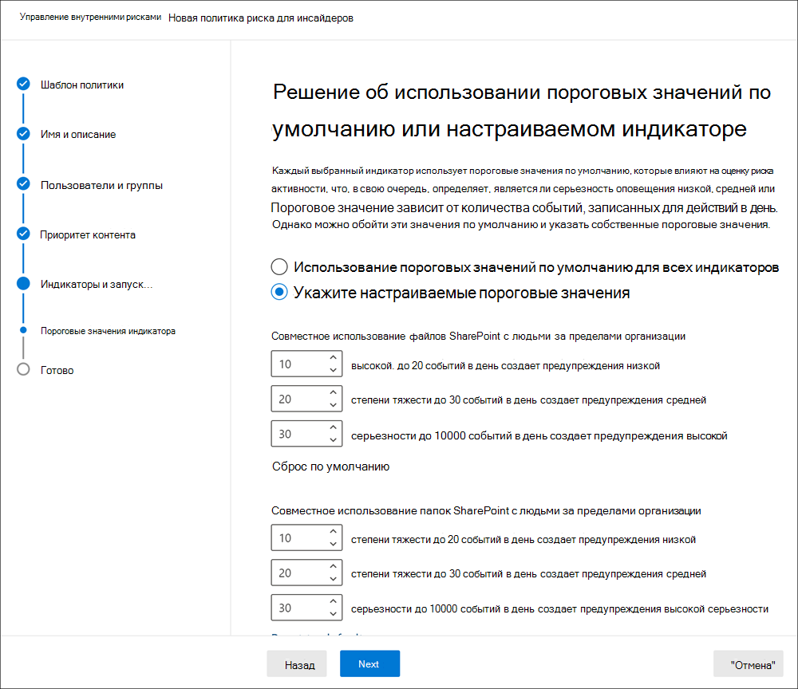

# Начало работы с параметрами управления рисками для оценки

Параметры управления рисками для участников программы предварительной оценки применяются ко всем политикам управления рисками для оценки, независимо от шаблона, выбранного при создании политики. Параметры настраиваются с помощью элемента управления " **параметры риска" для предварительной оценки** , расположенного в верхней части всех вкладок управления рисками для оценки. Эти компоненты политики управления параметрами для следующих областей:

- Конфиденциальность
- Индикаторы
- Временные шкалы политики
- Интеллектуальные обнаружения
- Экспорт оповещений
- Приоритетные группы пользователей

Перед началом работы и созданием политик управления рисками для оценки важно понимать эти параметры и выбирать оптимальные уровни соответствия требованиям вашей организации.

## Конфиденциальность

Защита конфиденциальности пользователей, имеющих соответствия политике, важна и помогает повысить обжективити при расследовании данных и анализе анализа для оповещений о рисках для оценки. Для пользователей с согласованной политикой риска оценки можно выбрать один из следующих параметров:

- **Показывать анонимные версии**имен пользователей: имена пользователей являются анонимными, чтобы запретить администраторам, обучениям и рецензентам просматривать пользователей, связанных с оповещениями политики. Например, пользователь "льготный Тайлор" будет отображаться с случайным псеудоним, таким как "AnonIS8 988" во всех областях интерфейса "Управление рисками". При выборе этого параметра анонимизес все пользователи с текущей и предыдущей политикой соответствия и применяются ко всем политикам. При выборе этого параметра сведения о профиле пользователя в оповещениях и сведениях о рисках для участников программы предварительной оценки не будут доступны. Однако имена пользователей отображаются при добавлении новых пользователей в существующие политики или при назначении пользователей новым политикам. Если отключить этот параметр, имена пользователей будут отображаться для всех пользователей, которым соответствуют текущие или прошлые политики.
- **Не показывать анонимные версии имен пользователей**: имена пользователей отображаются для всех текущих и прошлых соответствий политик для оповещений и обращений. Сведения о профиле пользователя (имя, должность, псевдоним, организация или отдел) отображаются для пользователя по всем оповещениям и обращениям по управлению рисками для оценки.

## Индикаторы

Шаблоны политики оценки рисков определяют тип действий риска, которые вы хотите обнаружить и исследовать. Каждый шаблон политики основан на определенных индикаторах, соответствующих определенным триггерам и действиям риска. По умолчанию все индикаторы отключены, поэтому перед настройкой политики управления рисками для оценки необходимо выбрать один или несколько индикаторов политики.

Оповещения инициируются политиками, когда пользователи выполняют действия, связанные с индикаторами политики, которые отвечают требуемому пороговому значению. Для системы управления рисками для оценки используются два типа индикаторов:

- **Запуск событий**: события, определяющие, активен ли пользователь в политике управления рисками для оценки. Если пользователь добавляется к политике управления рисками, не имеющим триггера, то действие пользователя не оценивается политикой. Например, пользователь а добавляется в политику, созданную с помощью шаблона политики " *хищение данных",* а также политики и Microsoft 365 HR Connector. Пока у пользователя A не будет срока завершения, указанный соединителем HR, это значит, что эта политика управления рисками не оценивается для риска. Другой пример события, вызывающего срабатывание триггера, заключается в том, что при использовании политик *утечки данных* пользователь имеет оповещение о *высокой* серьезности защиты от потери данных.
- **Индикаторы политики**: индикаторы, включенные в политики управления рисками для оценки, которые используются для определения оценки риска для пользователя в области. Эти индикаторы политики активируются только после возникновения события запуска для пользователя. Некоторые примеры индикаторов политики применяются, когда пользователь копирует данные в личные облачные службы хранения или портативные устройства хранения, а также если пользователь совместно использует внутренние файлы и папки с неавторизованными внешними сторонами.

Индикаторы политики разбиты на следующие области. Вы можете выбрать индикаторы для активации и настройки пределов событий индикаторов для каждого уровня индикатора при создании политики риска для оценки.

- **Индикаторы Office**: включают индикаторы политики для сайтов SharePoint, Teams и сообщений электронной почты.
- **Индикаторы устройств**: сюда входят индикаторы политики для таких действий, как совместное использование файлов в сети или с устройствами. Индикаторы включают в себя действия, связанные с файлами Microsoft Office. CSV-файлы и. PDF-файлы. Если вы выбираете **индикаторы устройств**, действие обрабатывается только для устройств с Windows 10 Build 1809 или более поздней версии. Более подробную информацию о настройке устройств для интеграции с риском для оценки можно узнать в статье [Начало работы с DLP в конечной точке](endpoint-dlp-getting-started.md).
- **Индикатор нарушения политики безопасности**: включает индикаторы из пакета ATP для защитника Майкрософт, связанные с установкой неутвержденных или вредоносных программ, а также обход элементов управления безопасностью. Для получения оповещений в управлении рисками для предварительной оценки необходимо включить действующую лицензию на пакет ATP для защитника и угрозу для участников. Дополнительные сведения о настройке пакета ATP для защитника Майкрософт для интеграции управления рисками для ИТ можно найти [в статье configure Advanced Features in Microsoft Defender ATP](https://docs.microsoft.com/windows/security/threat-protection/microsoft-defender-atp/advanced-features\#share-endpoint-alerts-with-microsoft-compliance-center).
- **Ускорители показателей риска**: в их числе возникает риск необычных действий или прошлых нарушений политики. Предоставление ускорителей оценки риска повышает показатели рисков и вероятность оповещений для этих типов действий. Ускорители оценки риска могут быть выбраны, только если выбрано одно или несколько индикаторов.

В некоторых случаях может потребоваться ограничить показатели политики риска предварительной оценки, применяемые к политикам риска для оценки в Организации. Вы можете отключить индикаторы политики для определенных областей, отключив их от всех политик оценки риска. Триггерные события нельзя изменить для шаблонов политики риска для оценки.

Чтобы определить индикаторы политики риска для оценки, включенные во всех политиках оценки риска, перейдите к индикаторам **параметров оценки риска**  >  **Indicators** и выберите один или несколько индикаторов политики. Индикаторы, выбранные на странице параметров индикаторов, не могут быть настроены индивидуально при создании или изменении политики риска для оценки в мастере политик.

>[!NOTE]
>Новые пользователи, добавленные вручную, могут отображаться на **панели мониторинга "Пользователи"** в течение нескольких часов. Для отображения действий за последние 90 дней для этих пользователей может потребоваться до 24 часов. Чтобы просмотреть действия для добавленных вручную пользователей, выберите пользователя на **панели мониторинга "Пользователи** " и откройте вкладку **действия пользователя** в области сведений.

### Параметры уровня индикатора (Предварительная версия)

При создании политики в мастере политики можно настроить, как ежедневное количество событий риска будет влиять на оценку риска для оповещений о рисках для участников программы. Эти параметры индикатора помогают контролировать, как количество экземпляров событий риска в Организации должно повлиять на оценку риска, а соответственно на степень серьезности оповещений для этих событий. При желании вы также можете оставить уровни по умолчанию для событий, рекомендуемых корпорацией Майкрософт для всех включенных индикаторов.

Например, вы решили включить индикаторы SharePoint в параметрах политики риска предварительной оценки и задать настраиваемые пороги для событий SharePoint при настройке индикаторов для новой политики *утечек данных* о рисках для оценки. В мастере политики риска для оценки вы настраиваете три разных уровня ежедневного события для каждого индикатора SharePoint, чтобы повлиять на оценку риска для оповещений, связанных с этими событиями.

Для первого ежедневного уровня событий вы устанавливаете пороговое значение на *10 или больше событий в день* , чтобы снизить влияние на показатель риска для событий, *20 или больше событий в день* для среднего влияния на показатель риска для событий, и *30 или больше событий в день* более высокое влияние на показатель риска для событий. Эти параметры эффективно означают:

- При наличии 1-9 событий SharePoint, выполняемых после срабатывания события, оценки риска минимально влияют и могут не создавать оповещение.
- При наличии 10-19 событий SharePoint, которые происходят после события, вызванного триггером, показатель риска на самом низком уровне и уровни серьезности оповещений, как правило, будут находиться на низком уровне.
- При наличии 20-29 событий SharePoint, выполняемых после запуска триггера, показатель риска на более высоком уровне и уровни серьезности оповещений, как правило, будут иметь средний уровень.
- При наличии 30 или более событий SharePoint, которые выполняются после запуска триггера, показатель риска на более высоком уровне, а уровни серьезности оповещений, как правило, будут иметь высокий уровень.

## Временные рамки политик

Временные рамки политики позволяют определять периоды предыдущего и будущего рецензирования, которые запускаются после соответствия политике, на основе событий и действий для шаблонов политики управления рисками для оценки. В зависимости от выбранного шаблона политики доступны следующие временные интервалы политики:

- **Окно активации**: доступно для всех шаблонов политик, *окно активации* — это определенное количество дней, в течение которых окно активируется **после** запуска события. Окно активируется в течение 1 – 30 дней после возникновения события запуска для любого пользователя, назначенного политике. Например, вы настроили политику управления рисками для оценки и хотите, чтобы *окно активации* настроило 30 дней. После настройки политики прошло несколько месяцев, а для одного из пользователей, включенных в политику, возникает событие триггера. Событие запуска активирует *окно активации* , а политика активна для этого пользователя в течение 30 дней после возникновения события триггера.
- **Обнаружение прошлых действий**: доступно для всех шаблонов политики, *Обнаружение прошлых действий* — это определенное количество дней, в течение которых окно активируется **до** запуска события. Окно активируется в течение от 0 до 180 дней, пока не будет вызвано событие запуска для любого пользователя, назначенного политике. Например, вы настроили политику управления рисками для предварительной оценки и настроили *Обнаружение прошлых действий* равным 90 дням. После настройки политики прошло несколько месяцев, а для одного из пользователей, включенных в политику, возникает событие триггера. Событие, вызывающее срабатывание, активирует *Обнаружение прошлых действий* , а политика собирает исторические действия для этого пользователя в течение 90 дней до запуска события.

## Интеллектуальные обнаружения

Параметры интеллектуального обнаружения помогают уточнить, как обрабатываются обнаруженные рискованные действия для оповещений. В некоторых случаях может потребоваться определить типы файлов, которые следует игнорировать, или применить уровень обнаружения файлов для определения минимальной полосы для оповещений. При использовании нежелательных языковых политик может потребоваться увеличить или уменьшить чувствительность обнаружения, чтобы управлять количеством обнаруженных соответствий политик. Используйте эти параметры для управления общим объемом оповещений, исключениями типов файлов, ограничениями для томов файлов и нежелательным чувствительностью к обнаружению нежелательных языков.

### Обнаружение аномалий

Нетипичные обнаружения включают параметры для исключений типов файлов и ограничения объема файлов.

- **Исключения типов файлов**: чтобы исключить определенные типы файлов из всех совпадений политики управления рисками для проверки подлинности, введите расширения типов файлов, разделяя их запятыми. Например, чтобы исключить определенные типы музыкальных файлов из соответствия политике, можно ввести *ААК, MP3, WAV, WMA* в поле **типы файлов для исключения** . Файлы с этими расширениями будут игнорироваться всеми политиками управления рисками для оценки.
- **Предельное число сокращений громкости тома**: для определения минимального уровня файлов до отчета об оповещениях об активности в политиках оценки риска введите число файлов. Например, если вы не хотите создавать оповещения о рисках для оценки риска, когда пользователь загружает 10 файлов или меньше, даже если политики считают, что это действие является аномалией, введите "10".

### Нежелательные обнаружения языков

Чтобы настроить чувствительность нежелательного классификатора языка для политик, использующих *нежелательный язык в шаблоне электронной почты* , выберите один из следующих параметров:

- **Низкий**: самый низкий уровень чувствительности с самым широким диапазоном для обнаружения оскорбительного языка и мнений. Вероятность ложных срабатываний для оскорбительного совпадения языков повышается.
- **Medium**: уровень чувствительности среднего уровня с сбалансированным диапазоном для обнаружения оскорбительного языка и мнений. Вероятность ложных срабатываний для оскорбительного совпадения языка — СРЗНАЧ.
- **Высокий**: максимальный уровень чувствительности с небольшим диапазоном для обнаружения оскорбительного языка и мнений. Вероятность ложных срабатываний для нежелательного совпадения языков мала.

### Громкость оповещения

Действиям пользователей, обнаруженным политиками оценки рисков, назначается определенный показатель риска, который, в свою очередь, определяет серьезность оповещения (низкие, средние, высокие). По умолчанию мы создаем определенный объем уведомлений о низком, среднем и высоком уровне серьезности, но вы можете увеличить или уменьшить объем в соответствии с вашими потребностями. Чтобы настроить уровень оповещений для всех политик управления рисками, выберите один из следующих параметров:

- **Уменьшите количество оповещений**: вы увидите все оповещения высокой серьезности, меньшее количество оповещений средней серьезности и отсутствие недостаточной важности. Этот уровень установки означает, что вы можете пропустить некоторые ложные срабатывания.
- **Громкость по умолчанию**: отображаются все оповещения высокой серьезности и сбалансированное количество предупреждений о среднем и низком уровне.
- **Дополнительные оповещения**: вы увидите все предупреждения среднего и высокого уровня, а также предупреждения о низком уровне серьезности. Этот уровень настройки может привести к более ложным срабатываниям.

### Advanced Threat Protection в защитнике Майкрософт (Предварительная версия)

[Advanced Threat Protection в защитнике Майкрософт](https://docs.microsoft.com/windows/security/threat-protection/microsoft-defender-atp/microsoft-defender-advanced-threat-protection) (ATP) — это платформа безопасности для корпоративных конечных точек, предназначенная для предотвращения, обнаружения, проверки и реагирования на дополнительные угрозы в корпоративных сетях. Чтобы лучше понять нарушение безопасности в Организации, вы можете импортировать и фильтровать оповещения защитника Майкрософт для действий, используемых в политиках, созданных на основе шаблонов политики нарушения безопасности системы безопасности для оценки риска.

В зависимости от требуемых типов сигналов можно выбрать Импорт оповещений в систему управления рисками на основе состояния рассмотрения оповещения защитником Майкрософт. В глобальных параметрах для импорта можно определить одно или несколько следующих состояний рассмотрения оповещения:

- Unknown
- Новое
- Выполняется
- Устранено

Оповещения от Microsoft Defender ATP импортируются ежедневно. В зависимости от выбранного состояния рассмотрения вы можете увидеть несколько действий пользователя для одного и того же оповещения, когда состояние рассмотрения изменяется в статье Microsoft Defender ATP.

Например, если выбрано значение *создать*, *в ходе выполнения*и *разрешено* для этого параметра, при создании оповещения Майкрософт для защитника ATP и изменении состояния " *новое*" для пользователя будет импортировано исходное действие оповещения. Когда состояние рассмотрения для защитника Майкрософт изменяется на *в ходе выполнения*, для пользователя будет импортировано второе действие для этого оповещения. Когда задается Последнее состояние рассмотрения " *разрешено* " для защитника Майкрософт, третье действие для этого оповещения импортируется для пользователя в составе риска для оценки. Эта функция позволяет обследовать ход выполнения оповещений защитника Microsoft Defender и выбирать уровень видимости, необходимый для их расследования.

>[!IMPORTANT]
>Вам потребуется настроить в Организации пакет ATP для защитника Microsoft и включить пакет ATP для защитника Майкрософт для интеграции управления рисками в центре безопасности защитника, чтобы импортировать оповещения о нарушениях безопасности. Дополнительные сведения о настройке пакета ATP для защитника Майкрософт для интеграции управления рисками для ИТ можно найти [в статье configure Advanced Features in Microsoft Defender ATP](https://docs.microsoft.com/windows/security/threat-protection/microsoft-defender-atp/advanced-features\#share-endpoint-alerts-with-microsoft-compliance-center).

### Домены (Предварительная версия)

Параметры домена помогают определить уровни риска для связи с определенными доменами. Эти сообщения включают в себя общий доступ к файлам, сообщениям электронной почты или загрузке контента. Указав домены в этих параметрах, вы можете увеличить или уменьшить степень риска для действий, выполняемых с этими доменами. Например, чтобы указать contoso.com и sales.wingtiptoys.com в качестве разрешенных доменов, введите "contoso.com sales.wingtiptoys.com" в поле **разрешенные домены** .

Для каждого из следующих параметров домена можно ввести до 500 доменов:

- **Неразрешенные домены:** Указывая неразрешенные домены, действия, выполняемые с этими доменами, будут иметь *более высокие* показатели риска.
- **Разрешенные домены:** Указывая разрешенные домены в параметрах, действия, выполняемые с этими доменами, будут иметь *более низкие* показатели риска и рассматриваются аналогично тому, как обрабатываются внутренние действия Организации. Например, действия электронной почты для этих доменов анализируются точно так же, как проанализировать внутренние действия с электронной почтой.
- **Домены третьих сторон:** Домены третьих сторон — это домены, используемые в Организации для бизнес-целей, и конфиденциальные материалы могут храниться в этих расположениях. Указывая домен стороннего производителя, вы можете получать оповещения о рискованных действиях в этих доменах.

## Экспорт оповещений (Предварительная версия)

Сведения оповещений об управлении рисками можно экспортировать в службы безопасности и управления событиями (SIEM) с помощью [схемы API действий управления Office 365](https://docs.microsoft.com/office/office-365-management-api/office-365-management-activity-api-schema#security-and-compliance-alerts-schema). Вы можете использовать API действий управления Office 365 для экспорта данных оповещений в другие приложения, которые могут использоваться в Организации для управления или объединения сведений о рисках для оценки.

Чтобы использовать API для просмотра сведений об оповещениях о риске для программы предварительной оценки:

1. Включите поддержку API действий управления Office 365 в параметрах управления рисками для оценки. По умолчанию этот параметр отключен для вашей организации Microsoft 365.
2. Отфильтруйте общие действия аудита Office 365 по *секуритикомплианцеалертс*.
3. Фильтрация *секуритикомплианцеалертс* по категории *инсидеррискманажемент* .

## Группы приоритетов пользователей (Предварительная версия)

Пользователи в вашей организации могут иметь разные уровни риска в зависимости от их положения, уровня доступа к конфиденциальным сведениям или истории риска. Определение приоритетов для оценки и оценки действий этих пользователей может помочь в оповещении о потенциальных рисках, которые могут повлиять на работу Организации. Приоритетные группы пользователей в управлении рисками для участников поможет определить пользователей в Организации, которым требуется более подробная проверка и более важные оценки риска. В сочетании с *нарушениями политики безопасности с учетом приоритетов пользователей* и *потерь данных с помощью шаблонов политики приоритетов* пользователи, добавленные к группе приоритетных пользователей, имеют повышенную вероятность оповещений о рисках и оповещений с более высоким уровнем серьезности.

Например, необходимо защитить от утечки данных для проекта с высоким уровнем конфиденциальности, в котором пользователи имеют доступ к конфиденциальным данным. Вы решили создать *конфиденциальные* *Пользователи* проекта группа пользователей для пользователей в Организации, которые работают над этим проектом. С помощью мастера политик и шаблона политики " *утечки данных с учетом приоритетов пользователей* " создается новая политика и назначается политике группа пользователей с приоритетом " *конфиденциальные пользователи проекта* ". Действия, проверяемые политикой для членов группы пользователей с приоритетом " *конфиденциальные пользователи проекта* ", более чувствительны к рискам и действиям, которые могут повлиять на создание оповещения и наличие оповещений с более высоким уровнем серьезности.

### Создание группы приоритетов пользователей

Чтобы создать новую группу приоритетов, вы будете использовать параметры элементов управления в решении по **управлению рисками для оценки** в центре соответствия требованиям Microsoft 365. Для создания группы приоритетов пользователей необходимо быть участником группы ролей " *Управление рисками* " или *"* управление рисками" для участников.

Выполните следующие действия, чтобы создать группу приоритетов пользователей:

1. В [центре соответствия требованиям Microsoft 365](https://compliance.microsoft.com)перейдите к разделу **Управление рисками для оценки** и выберите **параметры риска для участников программы предварительной оценки**.
2. Выбор вкладки **приоритет пользователей и групп**
3. На вкладке **приоритет групп пользователей** выберите **Создать приоритет группы пользователей** , чтобы запустить мастер создания групп.
4. На странице **Определение группы** заполните следующие поля:
    - **Name (обязательно)**: введите понятное имя для группы пользователей Priority. После завершения работы мастера невозможно изменить имя группы пользователей Priority.
    - **Description (необязательно)**: введите описание для группы пользователей Priority.
5. Нажмите кнопку **Далее** , чтобы продолжить.
6. На странице **Выбор участников** выберите **выбрать участников** для поиска и выберите, какие учетные записи пользователей с включенной поддержкой почты включены в группу, или установите флажок **выбрать все** , чтобы добавить в группу всех пользователей организации. Нажмите кнопку **Добавить** , чтобы продолжить, или **Отмена** , чтобы закрыть окно, не добавляя пользователей в группу.
7. Нажмите кнопку **Далее** , чтобы продолжить.
8. На странице " **Рецензирование** " Проверьте параметры, выбранные для группы приоритетов пользователей. Нажмите кнопку **изменить** , чтобы изменить значения для группы, или кнопку **послать** , чтобы создать и активировать группу приоритетов пользователей.
9. На странице Подтверждение нажмите кнопку **Готово** , чтобы завершить работу мастера.

### Обновление группы приоритетов пользователей

Чтобы обновить существующую группу пользователей Priority, вы будете использовать параметры элементов управления в решении по **управлению рисками для оценки** в центре соответствия требованиям Microsoft 365. Чтобы обновить группу приоритетов пользователей, необходимо быть участником группы ролей " *Управление рисками* *" или "* управление рисками" для участников.

Выполните следующие действия, чтобы изменить группу приоритетов пользователей:

1. В [центре соответствия требованиям Microsoft 365](https://compliance.microsoft.com)перейдите к разделу **Управление рисками для оценки** и выберите **параметры риска для участников программы предварительной оценки**.
2. Выбор вкладки **приоритет пользователей и групп**
3. Выберите приоритетную группу пользователей, которую нужно изменить, и нажмите кнопку **изменить группу**.
4. На странице **Определение группы** обновите поле Описание, если это необходимо. Невозможно обновить имя группы пользователей Priority. Нажмите кнопку **Далее** , чтобы продолжить.
5. На странице " **Выбор элементов** " добавьте в группу новых участников с помощью элемента управления " **выбрать элементы** ". Чтобы удалить пользователя из группы, нажмите кнопку "X" рядом с пользователем, которого вы хотите удалить. Нажмите кнопку **Далее** , чтобы продолжить.
6. На странице " **Проверка** " Проверьте параметры обновления, выбранные для группы приоритетов пользователей. Нажмите кнопку **изменить** , чтобы изменить значения для группы, или кнопку **послать** , чтобы обновить группу приоритетов пользователей.
7. На странице Подтверждение нажмите кнопку **Готово** , чтобы завершить работу мастера.

### Удаление приоритетной группы пользователей

Чтобы удалить имеющуюся группу приоритетов, вы будете использовать параметры элементов управления в решении по **управлению рисками для оценки** в центре соответствия требованиям Microsoft 365. Для удаления приоритетной группы пользователей необходимо быть участником группы ролей " *Управление рисками* " или *"* управление рисками".

>[!IMPORTANT]
>При удалении группы пользователей приоритета она будет удалена из любой активной политики, которой она назначена. Если вы удаляете группу приоритетов, назначенную активной политике, она не будет содержать каких-либо пользователей в области и будет фактически неактивна и не создаст оповещения.

Выполните следующие действия, чтобы удалить группу приоритетов пользователей:

1. В [центре соответствия требованиям Microsoft 365](https://compliance.microsoft.com)перейдите к разделу **Управление рисками для оценки** и выберите **параметры риска для участников программы предварительной оценки**.
2. Выбор вкладки **приоритет пользователей и групп**
3. Выберите приоритетную группу пользователей, которую нужно изменить, и выберите команду **Удалить** в меню панели мониторинга.
4. В диалоговом окне **Удалить** нажмите кнопку **Да** , чтобы удалить группу приоритетов пользователей, или кнопку **Отмена** , чтобы вернуться на панель мониторинга.