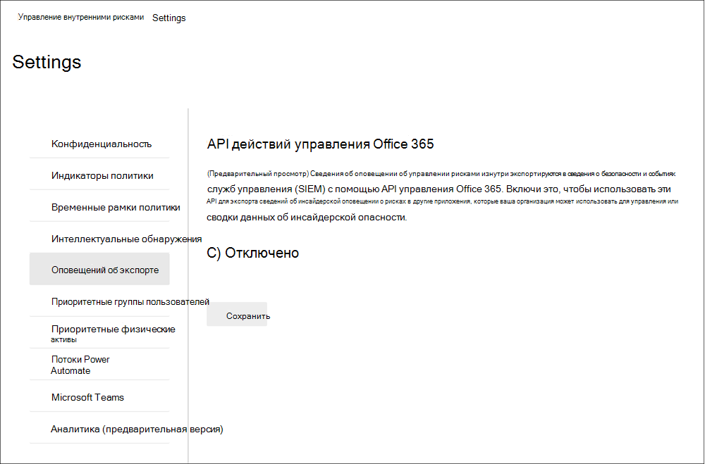

# Начало работы с настройками управления рисками внутри организацииGet started with insider risk management settings

Параметры управления рисками внутри организации применяются во всех политиках управления рисками внутри организации независимо от шаблона, выбранного при создании политики.Insider risk management settings apply to all insider risk management policies, regardless of the template you chose when creating a policy. Параметры настраиваются с  помощью управления "Параметры риска для оценки", расположенного в верхней части всех вкладок управления рисками внутри организации.Settings are configured using the **Insider risk settings** control located at the top of all insider risk management tabs. Эти параметры контролируют компоненты политики для следующих областей:These settings control policy components for the following areas:

- КонфиденциальностьPrivacy
- ИндикаторыIndicators
- Временные шкалы политикиPolicy timelines
- Интеллектуальные обнаруженияIntelligent detections
- Экспорт оповещений (предварительная версия)Export alerts (preview)
- Группы пользователей с приоритетами (предварительная версия)Priority user groups (preview)
- Приоритет физических активов (предварительная версия)Priority physical assets (preview)
- Потоки Power Automate (предварительная версия)Power Automate flows (preview)
- Microsoft Teams (предварительная версия)Microsoft Teams (preview)

Перед началом работы и создания политик управления рисками внутри организации важно понимать эти параметры и выбирать уровни параметров, наиболее оптимальные для соответствия требованиям в организации.Before you get started and create insider risk management policies, it's important to understand these settings and choose setting levels best for the compliance needs for your organization.

## КонфиденциальностьPrivacy

Защита конфиденциальности пользователей, совмещающихся с политиками, важна и может помочь повысить объектность при анализе и анализе оповещений о insider risk.Protecting the privacy of users that have policy matches is important and can help promote objectivity in data investigation and analysis reviews for insider risk alerts. Для пользователей с соответствием политике insider risk policy можно выбрать один из следующих параметров:For users with an insider risk policy match, you can choose one of the following settings:

- **Показывать анонимные** версии имен пользователей: имена пользователей анонимизируются, чтобы администраторы, следователи данных и рецензенты не видели, кто связан с оповещениями политики.**Show anonymized versions of usernames**: Names of users are anonymized to prevent admins, data investigators, and reviewers from seeing who is associated with policy alerts. Например, во всех областях управления рисками внутри организации появится пользователь с случайной псевдонимизацией, например AnonIS8-988.For example, a user 'Grace Taylor' would appear with a randomized pseudonym such as 'AnonIS8-988' in all areas of the insider risk management experience. Выбор этого параметра анонимизирует всех пользователей с текущими и прошедшими политиками и применяется ко всем политикам.Choosing this setting anonymizes all users with current and past policy matches and applies to all policies. Сведения профиля пользователя в оповещении о риске для пользователей и сведения о случае не будут доступны при выбранном варианте.User profile information in the insider risk alert and case details will not be available when this option is chosen. Однако имена пользователей отображаются при добавлении новых пользователей к существующим политикам или при назначении пользователей новым политикам.However, usernames are displayed when adding new users to existing policies or when assigning users to new policies. Если отключить этот параметр, имена пользователей будут отображаться для всех пользователей с текущими или прошедшими политиками.If you choose to turn off this setting, usernames will be displayed for all users that have current or past policy matches.
- **Не показывать анонимные версии** имен пользователей: имена пользователей отображаются для всех текущих и прошлых совпадений с политикой для оповещений и случаев.**Do not show anonymized versions of usernames**: Usernames are displayed for all current and past policy matches for alerts and cases. Сведения профиля пользователя (имя, название, псевдоним, организация или отдел) отображаются для пользователя для всех оповещений и случаев управления рисками внутри организации.User profile information (the name, title, alias, and organization or department) is displayed for the user for all insider risk management alerts and cases.

## ИндикаторыIndicators

Шаблоны политики для оценки рисков внутри организации определяют тип действий с рисками, которые необходимо обнаруживать и исследовать.Insider risk policy templates define the type of risk activities that you want to detect and investigate. Каждый шаблон политики основан на конкретных индикаторах, соответствующих определенным триггерам и действиям с рисками.Each policy template is based on specific indicators that correspond to specific triggers and risk activities. Все индикаторы по умолчанию отключены, и перед настройкой политики управления рисками внутри организации необходимо выбрать один или несколько индикаторов политики.All indicators are disabled by default, and you must select one or more policy indicators before configuring an insider risk management policy.

Оповещения запускаются политиками, когда пользователи выполняют действия, связанные с индикаторами политики, которые соответствуют необходимому пороговом значению.Alerts are triggered by policies when users perform activities related to policy indicators that meet a required threshold. Для управления рисками внутри организации используются два типа индикаторов:Insider risk management uses two types of indicators:

- **События запуска:** события, определяющие, активен ли пользователь для политики управления рисками внутри организации.**Triggering events**: Events that determine if a user is active for an insider risk management policy. Если пользователь добавляется в политику управления рисками внутри организации, не вызывается событие, действия пользователя не оцениваются политикой.If a user is added to an insider risk management policy does not have a triggering event, the user activity is not evaluated by the policy. Например, пользователь А добавляется в политику, созданную в результате кражи данных путем отступа от шаблона политики пользователей, а политика и соединители Microsoft 365 HR настроены должным образом. For example, User A is added to a policy created from the *Data theft by departing users* policy template and the policy and Microsoft 365 HR connector are properly configured. До тех пор, пока пользователь А не укажет дату завершения, сообщаемую соединитетелем отдела кадров, действия пользователя A не оцениваются этой политикой управления рисками внутри организации на риск.Until User A has a termination date reported by the HR connector, User A activities aren't evaluated by this insider risk management policy for risk. Другим примером запуска события является, если  пользователь имеет оповещение политики DLP высокого уровня серьезности при использовании политик *утечки* данных.Another example of a triggering event is if a user has a *High* severity DLP policy alert when using *Data leaks* policies.
- **Индикаторы политики:** индикаторы, включенные в внутренние политики управления рисками, используемые для определения оценки риска для пользователя в области действия.**Policy indicators**: Indicators included in insider risk management policies used to determine a risk score for an in-scope user. Эти индикаторы политики активируются только после запуска события для пользователя.These policy indicators are only activated after a triggering event occurs for a user. Некоторые примеры индикаторов политики— когда пользователь копирует данные в личные облачные службы хранения данных или переносные устройства хранения, или если пользователь делится внутренними файлами и папками с несанкционированными внешними сторонами.Some examples of policy indicators are when a user copies data to personal cloud storage services or portable storage devices, or if a user shares internal files and folders with unauthorized external parties.

Индикаторы политики сегментаются на следующие области.Policy indicators are segmented into the following areas. Вы можете выбрать индикаторы для активации и настройки ограничений событий индикатора для каждого уровня индикатора при создании политики insider risk policy:You can choose the indicators to activate and customize indicator event limits for each indicator level when creating an insider risk policy:

- **Индикаторы Office:** к ним относятся индикаторы политики для сайтов SharePoint, Teams и сообщений электронной почты.**Office indicators**: These include policy indicators for SharePoint sites, Teams, and email messaging.
- **Индикаторы устройств:** к ним относятся индикаторы политики для таких действий, как общий доступ к файлам по сети или с устройствами.**Device indicators**: These include policy indicators for activity such as sharing files over the network or with devices. К индикаторам относится активность, включаемая Microsoft Office файлов. CSV-файлы и . PDF-файлы.Indicators include activity involving Microsoft Office files, .CSV files, and .PDF files. Если **выбраны индикаторы устройств,** активность обрабатывается только для устройств с Windows 10 сборки 1809 или выше.If you select **Device indicators**, activity is processed only for devices with Windows 10 Build 1809 or higher. Дополнительные сведения о настройке устройств для интеграции с рисками внутри пользователей см. в разделе "Включение индикаторов устройств и [устройств на](insider-risk-management-settings.md#OnboardDevices) устройстве".For more information on configuring devices for integration with insider risk, see the following [Enable device indicators and onboard devices](insider-risk-management-settings.md#OnboardDevices) section.
- **Индикатор нарушения политики** безопасности: к ним относятся индикаторы из Microsoft Defender для конечной точки, связанные с неавтомантной или вредоносной установкой программного обеспечения или обходом средств контроля безопасности.**Security policy violation indicator**: These include indicators from Microsoft Defender for Endpoint related to unapproved or malicious software installation or bypassing security controls. Для получения оповещений в управлении рисками внутри организации необходимо включить активный защитник для лицензии endpoint и интеграцию с рисками внутри организации.To receive alerts in insider risk management, you must have an active Defender for Endpoint license and insider risk integration enabled. Дополнительные сведения о настройке Защитника для конечной точки для интеграции управления insider risk management см. в подстройке "Настройка расширенных функций в [Microsoft Defender для конечной точки".](https://docs.microsoft.com/windows/security/threat-protection/microsoft-defender-atp/advanced-features\#share-endpoint-alerts-with-microsoft-compliance-center)For more information on configuring Defender for Endpoint for insider risk management integration, see [Configure advanced features in Microsoft Defender for Endpoint](https://docs.microsoft.com/windows/security/threat-protection/microsoft-defender-atp/advanced-features\#share-endpoint-alerts-with-microsoft-compliance-center).
- **Повышение оценки риска:** к ним относится повышение оценки риска для необычных действий или прошлых нарушений политики.**Risk score boosters**: These include raising the risk score for unusual activities or past policy violations. Включение повышения оценки риска повышает оценку рисков и вероятность появления оповещений для этих типов действий.Enabling risk score boosters increase risk scores and the likelihood of alerts for these types of activities. Повышение оценки риска можно выбрать, только если выбран один или несколько индикаторов.Risk score boosters can only be selected if one or more indicators are selected.

В некоторых случаях может потребоваться ограничить индикаторы внутренней политики риска, применяемые к политикам внутри организации.In some cases, you may want to limit the insider risk policy indicators that are applied to insider risk policies in your organization. Вы можете отключить индикаторы политики для определенных областей, отключив их от всех политик внутри риска.You can turn off the policy indicators for specific areas by disabling them from all insider risk policies. Триггерные события нельзя изменить для шаблонов политики insider risk policy.Triggering events cannot be modified for insider risk policy templates.

Чтобы определить индикаторы внутренней политики риска, включенные во всех политиках, перейдите к параметрам риска для оценки рисков и выберите один или несколько индикаторов  >   политики.To define the insider risk policy indicators that are enabled in all insider risk policies, navigate to **Insider risk settings** > **Indicators** and select one or more policy indicators. Индикаторы, выбранные на странице "Параметры индикаторов", невозможно настроить отдельно при создании или редактировании политики insider risk в мастере политики.The indicators selected on the Indicators settings page cannot be individually configured when creating or editing an insider risk policy in the policy wizard.

>[!NOTE]
>Чтобы новые пользователи, добавленные вручную, появились на панели мониторинга **"Пользователи",** может потребоваться несколько часов.It may take several hours for new manually-added users to appear in the **Users dashboard**. Отображение действий за предыдущие 90 дней для этих пользователей может занять до 24 часов.Activities for the previous 90 days for these users may take up to 24 hours to display. Чтобы просмотреть действия для пользователей, добавленных  вручную,  выберите пользователя на панели мониторинга "Пользователи" и откройте вкладку "Действия пользователя" в области сведений.To view activities for manually added users, select the user on the **Users dashboard** and open the **User activity** tab on the details pane.

### Включить индикаторы устройств и устройстваEnable device indicators and onboard devices

Чтобы включить мониторинг действий по рискам на устройствах и включить индикаторы политики для этих действий, ваши устройства должны соответствовать следующим требованиям, и необходимо выполнить следующие действия по подключе.To enable the monitoring of risk activities on devices and include policy indicators for these activities, your devices must meet the following requirements and you must complete the following onboarding steps.

#### Шаг 1. Подготовка конечных точекStep 1: Prepare your endpoints

Убедитесь, что устройства с Windows 10, которые вы планируете сообщать в средстве управления рисками внутри организации, соответствуют этим требованиям.Make sure that the Windows 10 devices that you plan on reporting in insider risk management meet these requirements.

1. Должен работать под управлением Windows 10 x64 сборки 1809 или более поздней версии и должен установить обновление [Windows 10 (сборка ОС 17763.1075)](https://support.microsoft.com/help/4537818/windows-10-update-kb4537818) с 20 февраля 2020 г.Must be running Windows 10 x64 build 1809 or later and must have installed the [Windows 10 update (OS Build 17763.1075)](https://support.microsoft.com/help/4537818/windows-10-update-kb4537818) from February 20, 2020.
2. Все устройства должны быть подключены к [Azure Active Directory (AAD)](https://docs.microsoft.com/azure/active-directory/devices/concept-azure-ad-join) или иметь гибридное присоединение к Azure AD.All devices must be [Azure Active Directory (AAD) joined](https://docs.microsoft.com/azure/active-directory/devices/concept-azure-ad-join), or Hybrid Azure AD joined.
3. Установите браузер Microsoft Chromium Edge на устройстве конечной точки для отслеживания действий по отправке в облако.Install Microsoft Chromium Edge browser on the endpoint device to monitor actions for the cloud upload activity. См. статью [Загрузка нового браузера Microsoft Edge на основе Chromium](https://support.microsoft.com/help/4501095/download-the-new-microsoft-edge-based-on-chromium).See, [Download the new Microsoft Edge based on Chromium](https://support.microsoft.com/help/4501095/download-the-new-microsoft-edge-based-on-chromium).

#### Шаг 2. Ветвь устройствStep 2: Onboarding devices

Необходимо включить мониторинг устройств и включить конечные точки, прежде чем вы сможете отслеживать действия по управлению рисками внутри системы на устройстве.You must enable device monitoring and onboard your endpoints before you can monitor for insider risk management activities on a device. Это можно сделать на портале соответствия требованиям Microsoft 365.Both of these actions are done in the Microsoft 365 Compliance portal.

Если вы хотите вложить устройства, которые еще не были загружены, загрузите соответствующий сценарий и развернете его, как описано в следующих шагах.When you want to onboard devices that haven't been onboarded yet, you'll download the appropriate script and deploy as outlined in the following steps.

Если у вас уже есть устройства, подключенные к [Microsoft Defender для конечной точки](https://docs.microsoft.com/windows/security/threat-protection/), они будут отображаться в списке управляемых устройств.If you already have devices onboarded into [Microsoft Defender for Endpoint](https://docs.microsoft.com/windows/security/threat-protection/), they will already appear in the managed devices list. Выполните [шаг 3. Если](insider-risk-management-settings.md#OnboardStep3) у вас есть устройства, вступив в Microsoft Defender для конечной точки, в следующем разделе.Follow [Step 3: If you have devices onboarded into Microsoft Defender for Endpoint](insider-risk-management-settings.md#OnboardStep3) in the next section.

В этом сценарии развертывания вы будете вовсю подавлить устройства, которые еще не были в нее, и вам нужно просто отслеживать действия по оценке риска внутри системы на устройствах с Windows 10.In this deployment scenario, you'll onboard devices that have not been onboarded yet, and you just want to monitor insider risk activities on Windows 10 devices.

1. Откройте [Центр соответствия требованиям Microsoft](https://compliance.microsoft.com).Open the [Microsoft compliance center](https://compliance.microsoft.com).
2. Откройте параметры Центра соответствия требованиям и выберите **Подключение устройств**.Open the Compliance Center settings page and choose **Onboard devices**.

   > [!NOTE]
   > Обычно подключение устройств занимает около 60 секунд, подождите около 30 минут, прежде чем обращаться в службу поддержки Microsoft.While it usually takes about 60 seconds for device onboarding to be enabled, please allow up to 30 minutes before engaging with Microsoft support.

3. Выберите **Управление устройствами**, чтобы открыть список **Устройства**Choose **Device management** to open the **Devices** list. Список будет пустым, пока устройства не будут подключены.The list will be empty until you onboard devices.
4. Нажмите **Подключение**, чтобы начать процесс.Choose **Onboarding** to begin the onboarding process.
5. Выберите способ развертывания на этих устройствах из списка методов **развертывания** и **скачайте пакет.**Choose the way you want to deploy to these more devices from the **Deployment method** list and then **download package**.
6. Выполните действия, описанные в разделе [Средства и методы подключения ATP Microsoft Defender для компьютеров с Windows 10](https://docs.microsoft.com/windows/security/threat-protection/microsoft-defender-atp/configure-endpoints).Follow the appropriate procedures in [Onboarding tools and methods for Windows 10 machines](https://docs.microsoft.com/windows/security/threat-protection/microsoft-defender-atp/configure-endpoints). Эта ссылка переназначает конечную страницу, на которой можно получить доступ к процедурам Конечной точки в Microsoft Defender, которые соответствуют пакету развертывания, выбранному на шаге 5:This link takes you to a landing page where you can access Microsoft Defender for Endpoint procedures that match the deployment package you selected in step 5:
    - Подключение компьютеров с Windows 10 с помощью групповой политикиOnboard Windows 10 machines using Group Policy
    - Подключение компьютеров с Windows с помощью Microsoft Endpoint Configuration ManagerOnboard Windows machines using Microsoft Endpoint Configuration Manager
    - Подключение компьютеров с Windows 10 с помощью инструментов управления мобильными устройствамиOnboard Windows 10 machines using Mobile Device Management tools
    - Подключение компьютеров с Windows 10 с помощью локального сценарияOnboard Windows 10 machines using a local script
    - Подключение временных компьютеров инфраструктуры виртуальных рабочих столов (VDI).Onboard non-persistent virtual desktop infrastructure (VDI) machines.

После этого конечная точка должна быть видна в списке устройств, и конечная точка начнет сообщать журналы действий аудита для управления рисками внутри организации.Once done and endpoint is onboarded, it should be visible in the devices list and the endpoint will start reporting audit activity logs to insider risk management.

> [!NOTE]
> Эта возможность включает принудительное применение лицензий.This experience is under license enforcement. Без необходимой лицензии данные не будут видимы или доступны.Without the required license, data will not be visible or accessible.

#### Шаг 3. Если в Microsoft Defender для конечной точки уже есть устройстваStep 3: If you have devices onboarded into Microsoft Defender for Endpoint

Если Microsoft Defender для конечной точки уже развернут и в них есть отчеты конечных точек, все эти конечные точки будут отображаться в списке управляемых устройств.If Microsoft Defender for Endpoint is already deployed and there are endpoints reporting in, all these endpoints will appear in the managed devices list. Вы можете продолжать вовсю вовметь новые устройства в управление рисками внутри организации, чтобы расширить охват с помощью раздела ["Шаг 2. Вступив в](insider-risk-management-settings.md#OnboardStep2) работу с устройствами".You can continue to onboard new devices into insider risk management to expand coverage by using the [Step 2: Onboarding devices](insider-risk-management-settings.md#OnboardStep2) section.

1. Откройте [Центр соответствия требованиям Microsoft](https://compliance.microsoft.com).Open the [Microsoft compliance center](https://compliance.microsoft.com).
2. Откройте параметры Центра соответствия требованиям и выберите **Включить отслеживание устройств**.Open the Compliance Center settings page and choose **Enable device monitoring**.
3. Выберите **Управление устройствами**, чтобы открыть список **Устройства**Choose **Device management** to open the **Devices** list. Отобразится список устройств, которые уже отправляют отчеты в Microsoft Defender для конечной точки.You should see the list of devices that are already reporting in to Microsoft Defender for Endpoint.
4. Выберите **"Вклинение",** если необходимо в нее вьться больше устройств.Choose **Onboarding** if you need to onboard more devices.
5. Выберите способ развертывания на этих устройствах из списка методов **развертывания** и **скачайте пакет.**Choose the way you want to deploy to these more devices from the **Deployment method** list and then **Download package**.
6. Выполните действия, описанные в разделе [Средства и методы подключения ATP Microsoft Defender для компьютеров с Windows 10](https://docs.microsoft.com/windows/security/threat-protection/microsoft-defender-atp/configure-endpoints).Follow the appropriate procedures in [Onboarding tools and methods for Windows 10 machines](https://docs.microsoft.com/windows/security/threat-protection/microsoft-defender-atp/configure-endpoints). Эта ссылка переназначает конечную страницу, на которой можно получить доступ к процедурам Конечной точки в Microsoft Defender, которые соответствуют пакету развертывания, выбранному на шаге 5:This link takes you to a landing page where you can access Microsoft Defender for Endpoint procedures that match the deployment package you selected in step 5:
    - Подключение компьютеров с Windows 10 с помощью групповой политикиOnboard Windows 10 machines using Group Policy
    - Подключение компьютеров с Windows с помощью Microsoft Endpoint Configuration ManagerOnboard Windows machines using Microsoft Endpoint Configuration Manager
    - Подключение компьютеров с Windows 10 с помощью инструментов управления мобильными устройствамиOnboard Windows 10 machines using Mobile Device Management tools
    - Подключение компьютеров с Windows 10 с помощью локального сценарияOnboard Windows 10 machines using a local script
    - Подключение временных компьютеров инфраструктуры виртуальных рабочих столов (VDI).Onboard non-persistent virtual desktop infrastructure (VDI) machines.

После этого конечная точка должна быть видна  в таблице "Устройства", и конечная точка начнет сообщать журналы действий аудита для управления рисками внутри организации.Once done and endpoint is onboarded, it should be visible under the **Devices** table and the endpoint will start reporting audit activity logs to insider risk management.

> [!NOTE]
>Эта возможность включает принудительное применение лицензий.This experience is under license enforcement. Без необходимой лицензии данные не будут видимы или доступны.Without the required license, data will not be visible or accessible.

### Параметры уровня индикатора (предварительная версия)Indicator level settings (preview)

При создании политики в мастере политики можно настроить, как ежедневное число событий риска должно влиять на оценку риска для оповещений о insider risk.When creating a policy in the policy wizard, you can configure how the daily number of risk events should influence the risk score for insider risk alerts. Эти параметры индикатора помогают контролировать, как количество событий риска в организации должно влиять на оценку риска и, следовательно, степень серьезности связанных оповещений для этих событий.These indicator settings help you control how the number of occurrences of risk events in your organization should affect the risk score, and consequently the associated alert severity, for these events. При выборе вы также можете сохранить пороговые значения по умолчанию, рекомендованные корпорацией Майкрософт для всех включенных индикаторов.If you prefer, you can also choose to keep the default event threshold levels recommended by Microsoft for all enabled indicators.

Например, вы решите включить индикаторы SharePoint в параметрах политики insider risk policy и настроить настраиваемые пороговые значения  для событий SharePoint при настройке индикаторов для новой политики утечки данных о рисках внутри компании.For example, you decide to enable SharePoint indicators in the insider risk policy settings and to set custom thresholds for SharePoint events when configuring indicators for a new insider risk *Data leaks* policy. В мастере политики insider risk policy настраиваются три разных ежедневных уровня событий для каждого индикатора SharePoint, чтобы повлиять на оценку риска для оповещений, связанных с этими событиями.While in the insider risk policy wizard, you configure three different daily event levels for each SharePoint indicator to influence the risk score for alerts associated with these events.

Для первого ежедневного уровня событий необходимо установить пороговое значение *в 10* или более событий в день для снижения влияния на оценку риска для событий, *20* или более событий в день для среднего влияния на оценку риска для событий и *30* или более событий в день, что более влияет на оценку риска для событий.For the first daily event level, you set the threshold at *10 or more events per day* for a lower impact to the risk score for the events, *20 or more events per day* for a medium impact to the risk score for the events, and *30 or more events per day* a higher impact to the risk score for the events. Эти параметры фактически означают:These settings effectively mean:

- Если после запуска события происходит от 1 до 9 событий SharePoint, показатели риска оказывают минимальное влияние и, как правило, не создают оповещение.If there are 1-9 SharePoint events that take place after triggering event, risk scores are minimally impacted and would tend not to generate an alert.
- Если после запуска события происходит от 10 до 19 событий SharePoint, оценка риска по сути ниже, а уровни серьезности оповещений обычно находятся на низком уровне.If there are 10-19  SharePoint events that take place after a triggering event, the risk score is inherently lower and alert severity levels would tend to be at a low level.
- Если после запуска происходит от 20 до 29 событий SharePoint, оценка риска по сути выше, а уровни серьезности оповещений обычно находятся на среднем уровне.If there are 20-29 SharePoint events that take place after a triggering, the risk score is inherently higher and alert severity levels would tend to be at a medium level.
- Если после запуска происходит 30 или более событий SharePoint, оценка риска по сути выше, а уровень серьезности оповещений обычно имеет высокий уровень.If there are 30 or more SharePoint events that take place after a triggering, the risk score is inherently higher and alert severity levels would tend to be at a high level.

## Временные рамки политикиPolicy timeframes

Временные рамки политики позволяют определить прошедшие и будущие периоды проверки, которые активируются после совпадений политики на основе событий и действий для шаблонов политики управления рисками внутри организации.Policy timeframes allow you to define past and future review periods that are triggered after policy matches based on events and activities for the insider risk management policy templates. В зависимости от шаблона политики доступны следующие сроки политики:Depending on the policy template you choose, the following policy timeframes are available:

- **Окно активации:** доступно для всех  шаблонов политики, окно активации — это определенное количество дней, в течение которое окно активируется после **запуска** события.**Activation window**: Available for all policy templates, the *Activation window* is the defined number of days that the window activates **after** a triggering event. Окно активируется в течение 1-30 дней после запуска события для любого пользователя, назначенного политике.The window activates for 1 to 30 days after a triggering event occurs for any user assigned to the policy. Например, вы настроили политику управления рисками внутри  организации и установили для окна активации 30 дней.For example, you've configured an insider risk management policy and set the *Activation window* to 30 days. С момента настройки политики прошло несколько месяцев, и для одного из пользователей, включенных в политику, происходит триггерное событие.Several months have passed since you configured the policy and a triggering event occurs for one of the users included in the policy. Активируемое событие активирует окно активации, и политика активна для этого пользователя в течение 30 дней после запуска события. The triggering event activates the *Activation window* and the policy is active for that user for 30 days after the triggering event occurred.
- **Обнаружение прошлых действий**: доступно для  всех шаблонов политики, обнаружение прошлых действий  — это определенное количество дней, в течение которое окно активируется до запуска события.**Past activity detection**: Available for all policy templates, the *Past activity detection* is the defined number of days that the window activates **before** a triggering event. Окно активируется в течение от 0 до 180 дней до возникновения запуска события для любого пользователя, назначенного политике.The window activates for 0 to 180 days before a triggering event occurs for any user assigned to the policy. Например, вы настроили политику управления рисками внутри  организации и установили для обнаружения прошлых действий 90 дней.For example, you've configured an insider risk management policy and set the *Past activity detection* to 90 days. С момента настройки политики прошло несколько месяцев, и для одного из пользователей, включенных в политику, происходит триггерное событие.Several months have passed since you configured the policy and a triggering event occurs for one of the users included in the policy. Активируемая событие активирует обнаружение прошлых действий, и политика собирает исторические действия для этого пользователя в течение 90 дней до запуска события. The triggering event activates the *Past activity detection* and the policy gathers historic activities for that user for 90 days prior to the triggering event.

## Интеллектуальные обнаруженияIntelligent detections

Интеллектуальные параметры обнаружения помогают уточнить обработку обнаружения рискованных действий для оповещений.Intelligent detection settings help refine how the detections of risky activities are processed for alerts. В некоторых случаях может потребоваться определить типы файлов, которые следует игнорировать, или применить уровень обнаружения для файлов, чтобы определить минимальную планку для оповещений.In certain circumstances, you may need to define files types to ignore or you want to enforce a detection level for files to help define a minimum bar for alerts. При использовании политик оскорбительных языков может потребоваться увеличить или уменьшить чувствительность к обнаружению, чтобы контролировать количество выявленных совпадений с политикой.When using offensive language policies, you may need to increase or decrease the detection sensitivity to control the amount of reported policy matches. Используйте эти параметры для управления общим объемом оповещений, исключениями типов файлов, ограничениями громкости файлов и чувствительностью обнаружения оскорбительных языков.Use these settings to control overall alert volume, file type exclusions, file volume limits, and the offensive language detection sensitivity.

### Обнаружение аномалийAnomaly detections

Аномальные обнаружения включают параметры исключений типов файлов и ограничения объемов файлов.Anomalous detections include settings for file type exclusions and file volume limits.

- **Исключения типов файлов:** чтобы исключить определенные типы файлов из всех политик управления рисками внутри организации, введите расширения типов файлов, разделив их запятой.**File type exclusions**: To exclude specific file types from all insider risk management policy matching, enter file type extensions separated by commas. Например, чтобы исключить определенные типы музыкальных файлов из совпадений политики, можно ввести *aac,mp3,wav,wma* в поле исключений типов **файлов.**For example, to exclude certain types of music files from policy matches you may enter *aac,mp3,wav,wma* in the **File type exclusions** field. Файлы с этими расширениями будут игнорироваться всеми политиками управления рисками внутри организации.Files with these extensions would be ignored by all insider risk management policies.
- **Ограничение на объем** файлов: чтобы определить минимальный уровень файлов перед тем, как оповещения об активности будут отсылаться в политиках внутренней оценки риска, введите количество файлов.**File volume cut-off limit**: To define a minimum file level before activity alerts are reported in insider risk policies, enter the number of files. Например, введите "10", если вы не хотите создавать оповещения о риске, когда пользователь загружает не более 10 файлов, даже если политики считают это действие аномалией.For example, you would enter '10' if you do not want to generate insider risk alerts when a user downloads 10 files or less, even if the policies consider this activity an anomaly.

### Обнаружение оскорбительных языковOffensive language detections

>[!IMPORTANT]
>С 16 октября 2020 г. создавать политики с помощью этого шаблона будет нельзя.Starting October 16, 2020, you will no longer be able to create policies using this template. Все активные политики, которые используют этот шаблон, будут работать до тех пор, пока они не будут окончательно удалены в январе 2021 г.Any active policies that use this template will work until they're permanently removed in January 2021. Мы не поддерживаем встроенный классификатор оскорбительного языка, который поддерживает этот шаблон, так как он создает большое количество ложных срабатывательных результатов.We are deprecating the Offensive Language built-in classifier that supports this template because it has been producing a high number of false positives. Для устранения проблем с рисками для оскорбительных  языков рекомендуется использовать политики соответствия требованиям к коммуникациям Microsoft 365.To address risk issues for offensive language, we recommend using Microsoft 365 [communication compliance](communication-compliance.md) policies. Дополнительные сведения о встроенных классификаторах см. в теме "Начало работы с обучаемыми [классификаторами".](classifier-get-started-with.md)For more information about built-in classifiers, see [Getting started with trainable classifiers](classifier-get-started-with.md).

Чтобы настроить чувствительность классификатора оскорбительных языков  для политик, использующих оскорбительный язык в шаблоне электронной почты, выберите один из следующих параметров:To adjust the sensitivity of the offensive language classifier for policies using the *Offensive language in email* template, choose one of the following settings:

- **Низкий**: самый низкий уровень конфиденциальности с самым широким диапазоном для обнаружения оскорбительных языков и настроений.**Low**: The lowest sensitivity level with the broadest range for detection offensive language and sentiment. Вероятность ложного срабатывания при совпадении с оскорбительными языками повышается.The probability of false positives for offensive language matching is elevated.
- **Средний**: уровень конфиденциальности среднего уровня со сбалансированным диапазоном для обнаружения оскорбительных языков и настроений.**Medium**: The mid-level sensitivity level with a balanced range for detection offensive language and sentiment. Вероятность ложного срабатывания при совпадении с оскорбительными языками является средней.The probability of false positives for offensive language matching is average.
- **High**: самый высокий уровень конфиденциальности с узким диапазоном для обнаружения оскорбительных языков и настроений.**High**: The highest sensitivity level with a narrow range for detection offensive language and sentiment. Вероятность ложного срабатывания при совпадении с оскорбительными языками низка.The probability of false positives for offensive language matching is low.

### Том оповещенийAlert volume

Действиям пользователей, обнаруженным с помощью политик внутренней оценки риска, назначена определенная оценка риска, которая, в свою очередь, определяет степень серьезности оповещений (низкая, средняя, высокая).User activities detected by insider risk policies are assigned a specific risk score, which in turn determines the alert severity (low, medium, high). По умолчанию мы выберем определенное количество оповещений с низкой, средней и высокой степенью серьезности, но вы можете увеличить или уменьшить громкость в соответствии с вашими потребностями.By default, we'll generate a certain amount of low, medium, and high severity alerts, but you can increase or decrease the volume to suit your needs. Чтобы настроить объем оповещений для всех политик управления рисками внутри организации, выберите один из следующих параметров:To adjust the volume of alerts for all insider risk management policies, choose one of the following settings:

- **Меньше оповещений:** вы увидите все оповещения с высокой степенью серьезности, меньше оповещений среднего уровня серьезности и отсутствие оповещений с низкой степенью серьезности.**Fewer alerts**: You'll see all high severity alerts, fewer medium severity alerts, and no low severity ones. Этот уровень параметров означает, что вы можете пропустить некоторые истинные положительные моменты.This setting level means you might miss some true positives.
- **Том по** умолчанию: вы увидите все оповещения высокого уровня серьезности и сбалансированное количество оповещений среднего и низкого уровня серьезности.**Default volume**: You'll see all high severity alerts and a balanced amount of medium and low severity alerts.
- **Больше оповещений:** вы увидите все оповещения среднего и высокого уровня серьезности и большинство оповещений с низкой степенью серьезности.**More alerts**: You'll see all medium and high severity alerts and most low severity alerts. Этот уровень параметров может привести к большему ложным срабатывам.This setting level might result in more false positives.

### Microsoft Defender для конечной точки (предварительная версия)Microsoft Defender for Endpoint (preview)

[Microsoft Defender для конечной точки](https://docs.microsoft.com/windows/security/threat-protection/microsoft-defender-atp/microsoft-defender-advanced-threat-protection) — это корпоративная платформа безопасности конечных точек, призванная помочь корпоративным сетям предотвращать, обнаруживать, исследовать и реагировать на сложные угрозы.[Microsoft Defender for Endpoint](https://docs.microsoft.com/windows/security/threat-protection/microsoft-defender-atp/microsoft-defender-advanced-threat-protection) is an enterprise endpoint security platform designed to help enterprise networks prevent, detect, investigate, and respond to advanced threats. Чтобы улучшить видимость нарушения безопасности в организации, можно импортировать и фильтровать защитник для оповещений конечных точек для действий, используемых в политиках, созданных на итоге из шаблонов политики нарушения безопасности управления рисками.To have better visibility of security violation in your organization, you can import and filter Defender for Endpoint alerts for activities used in policies created from insider risk management security violation policy templates.

В зависимости от типов интересующих вас сигналов вы можете импортировать оповещения в управление рисками внутри организации на основе состояния оценки оповещений Защитника для конечной точки.Depending on the types of signals you are interested in, you can choose to import alerts to insider risk management based on the Defender for Endpoint alert triage status. В глобальных параметрах для импорта можно определить одно или несколько следующих состояния определения оповещений:You can define one or more of the following alert triage statuses in the global settings to import:

- UnknownUnknown
- НовоеNew
- В процессе выполненияIn progress
- УстраненоResolved

Оповещения от Защитника для конечной точки импортируется ежедневно.Alerts from Defender for Endpoint are imported daily. В зависимости от состояния выбора вы можете увидеть несколько действий пользователя для одного и того же оповещения, так как в Защитнике для конечной точки изменяется состояние.Depending on the triage status you choose, you may see multiple user activities for the same alert as the triage status changes in Defender for Endpoint.

Например, если для этого параметра  выбраны параметры "Создать", "В процессе выполнения" и "Разрешено", при создании оповещения Microsoft Defender для конечной точки с состоянием *"Создать"* для пользователя, находящегося в состоянии риска, импортируется изначальное оповещение. For example, if you select *New*, *In progress*, and *Resolved* for this setting, when a Microsoft Defender for Endpoint alert is generated and the status is *New*, an initial alert activity is imported for the user in insider risk. Когда состояние "Защитник для конечной точки" изменяется на "В процессе", для пользователя, который находится в состоянии повышенного риска, импортируется второе действие для этого оповещения.When the Defender for Endpoint triage status changes to *In progress*, a second activity for this alert is imported for the user in insider risk. Когда устанавливается окончательное состояние "Защитник  для конечной точки" с состоянием "Разрешено", для пользователя, который находится в состоянии повышенного риска, импортируется третье действие для этого оповещения.When the final Defender for Endpoint triage status of *Resolved* is set, a third activity for this alert is imported for the user in insider risk. Эта функция позволяет следователям следить за ходом работы Защитника для оповещений конечной точки и выбирать уровень видимости, необходимый для расследования.This functionality allows investigators to follow the progression of the Defender for Endpoint alerts and choose the level of visibility that their investigation requires.

>[!IMPORTANT]
>Необходимо настроить Microsoft Defender для конечной точки в вашей организации и включить Защитник для конечной точки для интеграции управления insider risk management в Центре безопасности Защитника для импорта оповещений о нарушении безопасности.You'll need to have Microsoft Defender for Endpoint configured in your organization and enable Defender for Endpoint for insider risk management integration in the Defender Security Center to import security violation alerts. Дополнительные сведения о настройке Защитника для конечной точки для интеграции управления insider risk management см. в подстройке "Настройка расширенных функций в [Защитнике для конечной точки".](https://docs.microsoft.com/windows/security/threat-protection/microsoft-defender-atp/advanced-features\#share-endpoint-alerts-with-microsoft-compliance-center)For more information on configuring Defender for Endpoint for insider risk management integration, see [Configure advanced features in Defender for Endpoint](https://docs.microsoft.com/windows/security/threat-protection/microsoft-defender-atp/advanced-features\#share-endpoint-alerts-with-microsoft-compliance-center).

### Домены (предварительная версия)Domains (preview)

Параметры домена помогают определить уровни риска для связи с определенными доменами.Domain settings help you define risk levels for communications to specific domains. К таким коммуникациям относятся общий доступ к файлам, электронные сообщения или скачивание содержимого.These communications include sharing files, email messages, or downloading content. Указав домены в этих параметрах, вы можете увеличить или уменьшить оценку рисков для действий с этими доменами.By specifying domains in these settings, you can increase or decrease the risk scoring for activity that takes place with these domains. Например, чтобы указать contoso.com и sales.wingtiptoys.com как разрешенные домены, введите "contoso.com sales.wingtiptoys.com" в поле **"Разрешенные** домены".For example, to specify contoso.com and sales.wingtiptoys.com as allowed domains, you will enter 'contoso.com sales.wingtiptoys.com' in the **Allowed domains** field.

Для каждого из следующих параметров домена можно ввести до 500 доменов:For each of the following domain settings, you can enter up to 500 domains:

- **Неподтверченные домены:** Указав неподтверченные домены, действия, которые будут происходить с этими доменами, будут иметь более высокие *показатели* риска.**Unallowed domains:** By specifying unallowed domains, activity that takes place with these domains will have *higher* risk scores.
- **Разрешенные домены:** Указав разрешенные домены в параметрах, действия, которые  будут происходить с этими доменами, будут иметь более низкий уровень риска и будут рассматриваться аналогично тому, как обрабатываются внутренние действия организации.**Allowed domains:** By specifying allowed domains in settings, activity that takes place with these domains will have *lower* risk scores and is treated similarly to how internal organization activity is treated. Например, действия с электронной почтой в этих доменах анализируются аналогично анализу внутренней активности электронной почты.For example, email activities to these domains are analyzed similarly to how internal email activity is analyzed.
- **Сторонние домены:** Сторонние домены — это домены, используемые в бизнес-целях организации, и конфиденциальный контент может храниться в этих расположениях.**Third party domains:** Third party domains are domains used for business purposes at your organization and sensitive content may be stored across these locations. Указав сторонний домен, вы можете получать оповещения о любых рискованных действиях в этих доменах.By specifying a third party domain, you can receive alerts for any risky activity on these domains.

## Экспорт оповещений (предварительная версия)Export alerts (preview)

Сведения оповещений об управлении рисками в рамках системы безопасности можно экспортировать в службы SIEM через схему API действий управления [Office 365.](https://docs.microsoft.com/office/office-365-management-api/office-365-management-activity-api-schema#security-and-compliance-alerts-schema)Insider risk management alert information is exportable to security information and event management (SIEM) services via the [Office 365 Management Activity API schema](https://docs.microsoft.com/office/office-365-management-api/office-365-management-activity-api-schema#security-and-compliance-alerts-schema). С помощью API действий управления Office 365 вы можете экспортировать сведения оповещений в другие приложения, которые ваша организация может использовать для управления или агрегировать сведения о рисках внутри организации.You can use the Office 365 Management Activity APIs to export alert information to other applications your organization may use to manage or aggregate insider risk information.

Чтобы использовать API для просмотра сведений оповещений о риске внутри системы:To use the APIs to review insider risk alert information:

1. Включить поддержку API действий управления Office 365 в **экспорте** параметров управления  >  **рисками для внутренней**  >  **оценки.**Enable Office 365 Management Activity API support in **Insider risk management** > **Settings** > **Export**. По умолчанию этот параметр отключен для вашей организации Microsoft 365.By default, this setting is disabled for your Microsoft 365 organization.
2. Фильтрация распространенных действий аудита Office 365 по *securityComplianceAlerts.*Filter the common Office 365 audit activities by *SecurityComplianceAlerts*.
3. Фильтрация *SecurityComplianceAlerts* по категории *InsiderRiskManagement.*Filter *SecurityComplianceAlerts* by the *InsiderRiskManagement* category.

Сведения оповещений содержат сведения из схемы оповещений о безопасности и соответствии требованиям и общей схемы API действий управления Office 365.Alert information contains information from the security and compliance alert schema and the Office 365 Management Activity API common schema.

Для опове & щений об управлении рисками для системы безопасности и соответствия требованиям экспортируются следующие поля и значения:The following fields and values are exported for insider risk management alerts for the Security & Compliance alert schema:

| **Параметр Alert****Alert parameter** | **Описание****Description** |
|:------------------|:----------------|
| AlertTypeAlertType | Тип оповещения — *Custom*.Type of the alert is *Custom*.  |
| AlertIdAlertId | GUID оповещения.The GUID of the alert. Оповещения по управлению рисками внутри организации неизменяются.Insider risk management alerts are mutable. По мере изменения состояния оповещений создается новый журнал с таким же alertID.As alert status changes, a new log with the same AlertID is generated. Этот AlertID можно использовать для сопоставления обновлений для оповещения.This AlertID can be used to correlate updates for an alert. |
| КатегорияCategory | Категория оповещения — *InsiderRiskManagement.*The category of the alert is *InsiderRiskManagement*. Эту категорию можно использовать для отличия этих оповещений от других оповещений & соответствия требованиям безопасности.This category can be used to distinguish from these alerts from other Security & Compliance alerts. |
| КомментарииComments | Комментарии по умолчанию для оповещения.Default comments for the alert. Значения: *"Новое оповещение"* (регистрируется  при его создания) и "Оповещение обновляется" (регистрируется при обновлении оповещения).Values are *New Alert* (logged when an alert is created) and *Alert Updated* (logged when there is an update to an alert). Используйте AlertID для сопоставления обновлений для оповещения.Use the AlertID to correlate updates for an alert. |
| ДанныеData | Данные оповещения включают уникальный ИД пользователя, имя основного пользователя, дату и время (UTC), когда пользователь был активирован в политику.The data for the alert, includes the unique user ID, user principal name, and date and time (UTC) when user was triggered into a policy. |
| ИмяName | Имя политики для политики управления рисками внутри организации, которая вызвала оповещение.Policy name for insider risk management policy that generated the alert. |
| PolicyIdPolicyId | GUID политики управления рисками, которая вызвала оповещение.The GUID of the insider risk management policy that triggered the alert. |
| SeveritySeverity | Серьезность оповещения.The severity of the alert. Значения: *High,* *Medium* или *Low.*Values are *High*, *Medium*, or *Low*. |
| ИсточникSource | Источник оповещения.The source of the alert. Значением является *соответствие требованиям безопасности и & Office 365.*The value is *Office 365 Security & Compliance*. |
| StatusStatus | Состояние оповещения.The status of the alert. Значения: *Active* *(требуется* проверка в insider risk), *Investigating* (*Подтверждено* в insider risk), *Resolved* (*Разрешено* в insider risk), *Dismissed* (*Dismissed* in insider risk).Values are *Active* (*Needs Review* in insider risk), *Investigating* (*Confirmed* in insider risk), *Resolved* (*Resolved* in insider risk), *Dismissed* (*Dismissed* in insider risk). |
| VersionVersion | Версия схемы оповещений о безопасности и соответствии требованиям.The version of the security and compliance alert schema. |

Следующие поля и значения экспортируются для оповещений об управлении рисками для общей схемы API действий управления [Office 365.](https://docs.microsoft.com/office/office-365-management-api/office-365-management-activity-api-schema#common-schema)The following fields and values are exported for insider risk management alerts for the [Office 365 Management Activity API common schema](https://docs.microsoft.com/office/office-365-management-api/office-365-management-activity-api-schema#common-schema).

- UserIdUserId
- IdId
- RecordTypeRecordType
- CreationTimeCreationTime
- ОперацияOperation
- OrganizationIdOrganizationId
- UserTypeUserType
- UserKeyUserKey

## Группы пользователей с приоритетами (предварительная версия)Priority user groups (preview)

Пользователи в организации могут иметь разные уровни риска в зависимости от их положения, уровня доступа к конфиденциальной информации или истории рисков.Users in your organization may have different levels of risk depending on their position, level of access to sensitive information, or risk history. Приоритизация рассмотрения и оценки действий этих пользователей может помочь оповещать вас о потенциальных рисках, которые могут иметь более высокие последствия для вашей организации.Prioritizing the examination and scoring of the activities of these users can help alert you to potential risks that may have higher consequences for your organization. Группы пользователей с приоритетами в управлении рисками внутри организации помогают определить пользователей в организации, которые нуждаются в более тщательном рассмотрении и оценке рисков.Priority user groups in insider risk management help define the users in your organization that need closer inspection and more sensitive risk scoring. В сочетании  с нарушением политики безопасности  по приоритету пользователей и утечками данных по шаблонам политики пользователей с приоритетом пользователи, добавленные в группу пользователей с приоритетом, имеют повышенную вероятность оповещений и оповещений о рисках внутри системы с более высоким уровнем серьезности.Coupled with the *Security policy violations by priority users* and *Data leaks by priority users* policy templates, users added to a priority user group have an increased likelihood of insider risk alerts and alerts with higher severity levels.

Например, необходимо защититься от утечек данных для строго конфиденциального проекта, в котором пользователи имеют доступ к конфиденциальной информации.For example, you need to protect against data leaks for a highly confidential project where users have access to sensitive information. Вы решили создать *группу*  пользователей конфиденциального проекта с приоритетом для пользователей в организации, которые работают над этим проектом.You choose to create *Confidential Project* *Users* priority user group for users in your organization that work on this project. Используя мастер политики  и утечки данных по шаблону политики пользователей с  приоритетом, вы создаете новую политику и назначаете политику группе пользователей с приоритетами "Конфиденциальные пользователи проекта".Using the policy wizard and the *Data leaks by priority users* policy template, you create a new policy and assign the *Confidential Project Users* priority users group to the policy. Действия, которые проверяются политикой  для участников группы пользователей с приоритетом "Конфиденциальный проект", более чувствительны к рискам, и эти пользователи с большей вероятностью будут создавать оповещения и получать оповещения с более высоким уровнем серьезности.Activities examined by the policy for members of the *Confidential Project Users* priority user group are more sensitive to risk and activities by these users will be more likely to generate an alert and have alerts with higher severity levels.

### Создание группы пользователей с приоритетомCreate a priority user group

Чтобы создать новую группу пользователей с приоритетом,  вы будете использовать элементы управления настройкой в решении для управления рисками для программы оценки рисков в Центре соответствия требованиям Microsoft 365.To create a new priority user group, you'll use setting controls in the **Insider risk management** solution in the Microsoft 365 compliance center. Чтобы создать группу пользователей с приоритетом,  необходимо быть членом  группы ролей "Управление рисками для участника-участника" или "Администратор управления рисками для пользователей".To create a priority user group, you must be a member of the *Insider Risk Management* or *Insider Risk Management Admin* role group.

Выполните следующие действия, чтобы создать группу пользователей с приоритетом.Complete the following steps to create a priority user group:

1. В Центре [соответствия требованиям Microsoft 365](https://compliance.microsoft.com)перейдите в центр управления рисками для программы оценки и выберите параметры риска для программы **оценки.** In the [Microsoft 365 compliance center](https://compliance.microsoft.com), go to **Insider risk management** and select **Insider risk settings**.
2. Вкладка **"Группы пользователей с приоритетом"**Select the **Priority user groups** tab
3. На **вкладке "Группы пользователей с приоритетом"** выберите "Создать группу пользователей с приоритетом", чтобы запустить мастер создания группы. On the **Priority user groups** tab, select **Create priority user group** to start the group creation wizard.
4. На странице **"Определение группы"** заполните следующие поля:On the **Define group** page, complete the following fields:
    - **Имя (обязательно).** Введите удобное имя для группы пользователей с приоритетом.**Name (required)**: Enter a friendly name for the priority user group. После завершения работы мастера изменить имя группы пользователей с учетом приоритетов нельзя.You can't change the name of the priority user group after you complete the wizard.
    - **Описание (необязательно).** Введите описание группы пользователей с приоритетом.**Description (optional)**: Enter a description for the priority user group.
5. Выберите **"Далее",** чтобы продолжить.Select **Next** to continue.
6. На странице "Выбор  **участников"** выберите "Выбрать участников для поиска" и выберите, какие  учетные записи пользователей с включенной поддержкой почты включены в группу, или выберите "Выбрать все" для добавления в группу всех пользователей в организации.On the **Choose members** page, select **Choose members** to search and select which mail-enabled user accounts are included in the group or select the **Select all** checkbox to add all users in your organization to the group. Select **Add** to continue or **Cancel** to close without adding any users to the group.Select **Add** to continue or **Cancel** to close without adding any users to the group.
7. Выберите **"Далее",** чтобы продолжить.Select **Next** to continue.
8. На странице **"Проверка"** просмотрите параметры, выбранные для группы пользователей с приоритетом.On the **Review** page, review the settings you've chosen for the priority user group. Выберите **"Изменить",** чтобы изменить любое  из значений группы, или выберите "Отправить", чтобы создать и активировать группу пользователей с приоритетом.Select **Edit** to change any of the group values or select **Submit** to create and activate the priority user group.
9. На странице подтверждения выберите **"Готово",** чтобы выйти из мастера.On the confirmation page, select **Done** to exit the wizard.

### Обновление группы пользователей с приоритетомUpdate a priority user group

Чтобы обновить существующую группу пользователей с приоритетом,  вы будете использовать элементы управления настройкой в решении для управления рисками для программы оценки рисков в Центре соответствия требованиям Microsoft 365.To update an existing priority user group, you'll use setting controls in the **Insider risk management** solution in the Microsoft 365 compliance center. Чтобы обновить группу пользователей с приоритетом,  необходимо быть членом  группы ролей "Управление рисками для участника-участника" или "Администратор управления рисками для пользователей".To update a priority user group, you must be a member of the *Insider Risk Management* or *Insider Risk Management Admin* role group.

Выполните следующие действия, чтобы изменить группу пользователей с приоритетом.Complete the following steps to edit a priority user group:

1. В Центре [соответствия требованиям Microsoft 365](https://compliance.microsoft.com)перейдите в центр управления рисками для программы оценки и выберите параметры риска для программы **оценки.** In the [Microsoft 365 compliance center](https://compliance.microsoft.com), go to **Insider risk management** and select **Insider risk settings**.
2. Вкладка **"Группы пользователей с приоритетом"**Select the **Priority user groups** tab
3. Выберите группу пользователей с приоритетами, которые нужно изменить, и выберите **группу редактирования.**Select the priority user group you want to edit and select **Edit group**.
4. На странице **"Определение группы"** при необходимости обновите поле "Описание".On the **Define group** page, update the Description field if needed. Имя группы пользователей с приоритетом обновить нельзя.You can't update the name of the priority user group. Выберите **"Далее",** чтобы продолжить.Select **Next** to continue.
5. На странице **"Выбор членов"** добавьте новых участников в группу с помощью управления **"Выбор членов".**On the **Choose members** page, add new members to the group using the **Choose members** control. Чтобы удалить пользователя из группы, выберите "X" рядом с пользователем, который нужно удалить.To remove a user from the group, select the 'X' next to the user you wish to remove. Выберите **"Далее",** чтобы продолжить.Select **Next** to continue.
6. На странице **"Проверка"** просмотрите параметры обновления, выбранные для группы пользователей с приоритетом.On the **Review** page, review the update settings you've chosen for the priority user group. Выберите  "Изменить", чтобы изменить любое из значений группы, или выберите **"Отправить",** чтобы обновить группу пользователей с приоритетом.Select **Edit** to change any of the group values or select **Submit** to update the priority user group.
7. На странице подтверждения выберите **"Готово",** чтобы выйти из мастера.On the confirmation page, select **Done** to exit the wizard.

### Удаление группы пользователей с приоритетомDelete a priority user group

Чтобы удалить существующую группу пользователей с приоритетом,  используйте элементы управления настройкой в решении для управления рисками для программы оценки рисков в Центре соответствия требованиям Microsoft 365.To delete an existing priority user group, you'll use setting controls in the **Insider risk management** solution in the Microsoft 365 compliance center. Чтобы удалить группу пользователей с приоритетом,  необходимо быть членом  группы ролей "Управление рисками для участника-пользователя" или "Администратор управления рисками".To delete a priority user group, you must be a member of the *Insider Risk Management* or *Insider Risk Management Admin* role group.

>[!IMPORTANT]
>При удалении группы пользователей с приоритетом она удаляется из любой активной политики, которой она назначена.Deleting a priority user group will remove it from any active policy to which it is assigned. Если удалить группу пользователей с приоритетом, назначенную активной политике, политика не будет содержать пользователей в области действия и фактически будет простаивать и не будет создавать оповещения.If you delete a priority user group that is assigned to an active policy, the policy will not contain any in-scope users and will effectively be idle and will not create alerts.

Выполните следующие действия, чтобы удалить группу пользователей с приоритетом.Complete the following steps to delete a priority user group:

1. В Центре [соответствия требованиям Microsoft 365](https://compliance.microsoft.com)перейдите в центр управления рисками для программы оценки и выберите параметры риска для программы **оценки.** In the [Microsoft 365 compliance center](https://compliance.microsoft.com), go to **Insider risk management** and select **Insider risk settings**.
2. Вкладка **"Группы пользователей с приоритетом"**Select the **Priority user groups** tab
3. Выберите группу пользователей с приоритетом, отредактируемую, и **выберите** "Удалить" в меню панели мониторинга.Select the priority user group you want to edit and select **Delete** from the dashboard menu.
4. В **диалоговом окте** "Удалить" выберите **"Да",** чтобы удалить группу пользователей с приоритетом, или "Отмена", чтобы вернуться на панель мониторинга. On the **Delete** dialog, select **Yes** to delete the priority user group or select **Cancel** to return to the dashboard.

## Приоритет физических активов (предварительная версия)Priority physical assets (preview)

Определение доступа к приоритетным физическим активам и сопоставление действий доступа с событиями пользователей является важным компонентом инфраструктуры соответствия требованиям.Identifying access to priority physical assets and correlating access activity to user events is an important component of your compliance infrastructure. Эти физические ресурсы представляют приоритетные расположения в организации, такие как здания компании, центры обработки данных или серверные комнаты.These physical assets represent priority locations in your organization, such as company buildings, data centers, or server rooms. Действия, связанные с риском внутри организации, могут быть связаны с пользователями, работающими в необычные часы, попытками получить доступ к этим несанкционированным конфиденциальным или защищенным областям и запросами на доступ к высокоуровневой области без законных потребностей.Insider risk activities may be associated with users working unusual hours, attempting to access these unauthorized sensitive or secure areas, and requests for access to high-level areas without legitimate needs.

После включения физических активов  с приоритетами и настройки физического соединителя данных с плохой нагрузкой управление рисками внутри организации интегрирует сигналы из систем физического контроля и доступа с другими действиями по рискам пользователей.With priority physical assets enabled and the [Physical badging data connector](import-physical-badging-data.md) configured, insider risk management integrates signals from your physical control and access systems with other user risk activities. Изучив шаблоны поведения в физических системах доступа и сопоставив эти действия с другими событиями insider risk, управление рисками внутри организации поможет экспертам и аналитикам по обеспечению соответствия требованиям принимать более обоснованные решения по реагированию на оповещения.By examining patterns of behavior across physical access systems and correlating these activities with other insider risk events, insider risk management can help compliance investigators and analysts make more informed response decisions for alerts. Доступ к приоритетным физическим активам идентифицирован в статистике отличается от доступа к неоритетным активам.Access to priority physical assets are scored and identified in insights differently from access to non-priority assets.

Например, в организации имеется система плохой защиты для пользователей, которая отслеживает и утверждает физический доступ к обычным рабочим и конфиденциальным областям проекта.For example, your organization has a badging system for users that monitors and approves physical access to normal working and sensitive project areas. Над конфиденциальным проектом работает несколько пользователей, и эти пользователи возвращаются в другие области организации после завершения проекта.You have several users working on a sensitive project and these users will return to other areas of your organization when the project is completed. По мере того как конфиденциальный проект почти завершен, необходимо убедиться, что работа над проектом остается конфиденциальной и что доступ к областям проекта жестко контролируется.As the sensitive project nears completion, you want to make sure that the project work remains confidential and that access to the project areas is tightly controlled.

Вы можете включить физический соединителичные данные в Microsoft 365, чтобы импортировать сведения о доступе из физической системы плохой защиты и указать приоритеты физических активов в управлении рисками внутри организации.You choose to enable the Physical badging data connector in Microsoft 365 to import access information from your physical badging system and specify priority physical assets in insider risk management. Импортируете сведения из системы защиты от угроз и сопоставляете данные физического доступа с другими действиями по управлению рисками, выявленными при управлении рисками внутри организации, вы заметите, что один из пользователей проекта работает в офисах проектов после обычного рабочего времени, а также экспортирует большие объемы данных в личную облачную службу хранения данных из обычной рабочей области.By importing information from your badging system and correlating physical access information with other risk activities identified in insider risk management, you notice that one of the users on the project is accessing the project offices after normal working hours and is also exporting large amounts of data to a personal cloud storage service from their normal work area. Это действие физического доступа, связанное с интерактивной деятельностью, может указать на возможное хищение данных, а также на то, что оперативники и аналитики по соответствию требованиям могут принять соответствующие меры в соответствии с обстоятельствами для этого пользователя.This physical access activity associated with the online activity may point to possible data theft and compliance investigators and analysts can take appropriate actions as dictated by the circumstances for this user.

### Настройка приоритетов физических активовConfigure priority physical assets

Чтобы настроить физические активы с приоритетами, настройте физический соединители плохой  конфигурации и используйте элементы управления настройкой в решении по управлению рисками для программы оценки рисков в Центре соответствия требованиям Microsoft 365.To configure priority physical assets, you'll configure the Physical badging connector and use setting controls in the **Insider risk management** solution in the Microsoft 365 compliance center. Чтобы настроить приоритеты физических активов, необходимо  быть членом группы ролей "Управление рисками для участника-участника" или "Администратор управления рисками *внутри организации".*To configure priority physical assets, you must be a member of the *Insider Risk Management* or *Insider Risk Management Admin role group*.

Выполните следующие действия, чтобы настроить приоритеты физических активов:Complete the following steps to configure priority physical assets:

1. Следуйте шагам по настройке управления insider risk в статье ["Начало](insider-risk-management-configure.md) работы с управлением рисками внутри организации".Follow the configuration steps for insider risk management in the [Getting started with insider risk management](insider-risk-management-configure.md) article. На шаге 3 убедитесь, что настроен физический соединители плохой связи.In Step 3, make sure you configure the Physical badging connector.

    >[!IMPORTANT]
    >Чтобы политики управления рисками внутри организации могли использовать и сопоставляют данные сигналов, относящиеся к убывающих и завершенных пользователей, с данными событий от физических платформ управления и доступа, необходимо также настроить соединители Microsoft 365 HR.For insider risk management policies to use and correlate signal data related to departing and terminated users with event data from your physical control and access platforms, you must also configure the Microsoft 365 HR connector. Если вы включите физический соединитеж, не включив соединители Microsoft 365 HR, политики управления рисками внутри организации будут обрабатывать только события для действий с физическим доступом для пользователей в организации.If you enable the Physical badging connector without enabling the Microsoft 365 HR connector, insider risk management policies will only process events for physical access activities for users in your organization.

2. В Центре [соответствия требованиям Microsoft 365](https://compliance.microsoft.com)перейдите в центр управления рисками для программы оценки и выберите параметры риска для программы оценки приоритетов физических   >  **активов.**In the [Microsoft 365 compliance center](https://compliance.microsoft.com), go to **Insider risk management** and select **Insider risk settings** > **Priority physical assets**.
3. На  странице "Приоритет физических активов" можно вручную добавить ид физических активов, которые необходимо отслеживать для событий активов, импортируемых физическим соединитетелем плохой нагрузки, или импортировать . CSV-файл всех физических активов, импортируемых физическим соединитетелем плохой нагрузки: а) Чтобы вручную добавить физические ресурсы, выберите "Добавить приоритетные физические активы", введите ид физического актива, а затем выберите **"Добавить".**On the **Priority physical assets** page, you can either manually add the physical asset IDs you want to monitor for the asset events imported by the Physical badging connector or import a .CSV file of all physical assets IDs imported by the Physical badging connector: a) To manually add physical assets IDs, choose **Add priority physical assets**, enter a physical asset ID, then select **Add**. Введите другие физические ИД активов, а затем выберите "Добавить **приоритетные** физические активы", чтобы сохранить все в введены активы.Enter other physical asset IDs and then select **Add priority physical assets** to save all the assets entered.
    б) Добавление списка физических ИД активов из . CSV-файл, выберите **импортировать приоритетные физические ресурсы.**b) To add a list of physical asset IDs from a .CSV file, choose **Import priority physical assets**. В диалоговом окте проводника выберите . CSV-файл, который вы хотите импортировать, затем выберите **"Открыть".**From the file explorer dialog, select the .CSV file you wish to import, then select **Open**. ИД физического актива из . CSV-файлы добавляются в список.The physical asset IDs from the .CSV files are added to the list.
4. Перейдите на **вкладку "Индикаторы политики"** в "Параметры".Navigate to the **Policy indicators** tab in Settings.
5. На странице **"Индикаторы политики"** перейдите к разделу "Индикаторы физического доступа" и выберите для физического доступа по завершении или неудаче доступ к **конфиденциальному активу.** On the **Policy indicators** page, navigate to the **Physical access indicators** section and select the checkbox for **Physical access after termination or failed access to sensitive asset**.
6. Выберите **"Сохранить",** чтобы настроить и выйти.Select **Save** to configure and exit.

### Удаление приоритетного физического активаDelete a priority physical asset

Для удаления существующего приоритетного физического актива вы будете использовать элементы управления настройкой в решении для управления рисками для программы оценки рисков в Центре соответствия требованиям Microsoft 365.To delete an existing priority physical asset, you'll use setting controls in the Insider risk management solution in the Microsoft 365 compliance center. Чтобы удалить физический актив с приоритетом, необходимо быть членом группы ролей "Управление рисками для участника-участника" или "Администратор управления рисками".To delete a priority physical asset, you must be a member of the Insider Risk Management or Insider Risk Management Admin role group.

>[!IMPORTANT]
>Удаление приоритетного физического актива удаляет его из рассмотрения активной политикой, к которой он ранее был включен.Deleting a priority physical asset removes it from examination by any active policy to which it was previously included. Оповещения, созданные действиями, связанными с приоритетным физическим ресурсом, не удаляются.Alerts generated by activities associated with the priority physical asset aren't deleted.

Выполните следующие действия для удаления приоритетного физического актива:Complete the following steps to delete a priority physical asset:

1. В Центре [соответствия требованиям Microsoft 365](https://compliance.microsoft.com)перейдите в центр управления рисками для программы оценки и выберите параметры риска для программы оценки приоритетов физических   >  **активов.**In the [Microsoft 365 compliance center](https://compliance.microsoft.com), go to **Insider risk management** and select **Insider risk settings** > **Priority physical assets**.
2. На странице **"Приоритет физических активов"** выберите ресурс, который нужно удалить.On the **Priority physical assets** page, select the asset you want to delete.
3. Выберите **"Удалить"** в меню действий, чтобы удалить актив.Select **Delete** on the action menu to delete the asset.

## Потоки Power Automate (предварительная версия)Power Automate flows (preview)

[Microsoft Power Automate](https://docs.microsoft.com/power-automate/getting-started) — это служба рабочего процесса, которая автоматизирует действия между приложениями и службами.[Microsoft Power Automate](https://docs.microsoft.com/power-automate/getting-started) is a workflow service that automates actions across applications and services. Используя потоки шаблонов или созданные вручную, вы можете автоматизировать распространенные задачи, связанные с этими приложениями и службами.By using flows from templates or created manually, you can automate common tasks associated with these applications and services. Когда вы включаете потоки Power Automate для управления insider risk management, вы можете автоматизировать важные задачи для дел и пользователей.When you enable Power Automate flows for insider risk management, you can automate important tasks for cases and users. Вы можете настроить потоки Power Automate, чтобы получать сведения о пользователях, оповещениях и делах, а также обмениваться этой информацией с заинтересованными сторонами и другими приложениями, а также автоматизировать действия в управлении рисками внутри организации, такие как публикация в примечаниях к делу.You can configure Power Automate flows to retrieve user, alert, and case information and share this information with stakeholders and other applications, as well as automate actions in insider risk management, such as posting to case notes. Потоки Power Automate применимы к случаям и любому пользователю в области политики.Power Automate flows are applicable for cases and any user in scope for a policy.

Клиентам с подписками На Microsoft 365, которые включают управление рисками внутри организации, не требуются дополнительные лицензии Power Automate, чтобы использовать рекомендуемые шаблоны Power Automate для управления insider risk management.Customers with Microsoft 365 subscriptions that include insider risk management do not need additional Power Automate licenses to use the recommended insider risk management Power Automate templates. Эти шаблоны можно настроить для поддержки вашей организации и основных сценариев управления рисками внутри организации.These templates can be customized to support your organization and cover core insider risk management scenarios. Если вы решите использовать в этих шаблонах дополнительные функции Power Automate, создайте настраиваемый шаблон с помощью соединители соответствия Microsoft 365 или используйте шаблоны Power Automate для других областей соответствия требованиям в Microsoft 365, вам может потребоваться больше лицензий Power Automate.If you choose to use premium Power Automate features in these templates, create a custom template using the Microsoft 365 compliance connector, or use Power Automate templates for other compliance areas in Microsoft 365, you may need more Power Automate licenses.

Клиентам предоставляются следующие шаблоны Power Automate для поддержки автоматизации процессов для пользователей и случаев управления рисками внутри организации:The following Power Automate templates are provided to customers to support process automation for insider risk management users and cases:

- Уведомлять пользователей при их добавлении в политику внутренних **рисков:** этот шаблон для организаций с внутренними политиками, конфиденциальностью или нормативными требованиями, которые должны уведомлять пользователей о том, что они подчиняются политикам управления внутренними рисками.**Notify users when they're added to an insider risk policy**: This template is for organizations that have internal policies, privacy, or regulatory requirements that users must be notified when they are subject to insider risk management policies. Если этот поток настроен и выбран для пользователя на странице пользователей, пользователи и их руководители будут отправлять сообщения электронной почты при добавлении пользователя в политику управления рисками для участников программы.When this flow is configured and selected for a user in the users page, users and their managers are sent an email message when the user is added to an insider risk management policy. Этот шаблон также поддерживает обновление списка SharePoint, который находится на сайте SharePoint, для отслеживания таких сведений уведомления, как дата и время и получатель сообщения.This template also supports updating a SharePoint list hosted on a SharePoint site to help track notification message details like date/time and the message recipient. Если вы решили анонимизировать пользователей в параметрах конфиденциальности, потоки, созданные на этом шаблоне, не будут работать должным образом, чтобы обеспечить конфиденциальность пользователей.If you've chosen to anonymize users in **Privacy settings**, flows created from this template will not function as intended so that user privacy is maintained. Потоки Power Automate, использующие этот шаблон, доступны на панели **мониторинга "Пользователи".**Power Automate flows using this template are available on the **Users dashboard**.
- Запрашивать информацию от отдела кадров или бизнеса о пользователе в случае, когда дело находится внутри организации: при работе с делом аналитикам и следователям по **insider** risk может потребоваться консультация с персоналом или другими заинтересованными лицами, чтобы понять контекст действий по делу.**Request information from HR or business about a user in an insider risk case**: When acting on a case, insider risk analysts and investigators may need to consult with HR or other stakeholders to understand the context of the case activities. Когда этот поток настроен и выбран для дела, аналитики и следователи отправляют сообщение электронной почты заинтересованным лицам отдела кадров и бизнеса, настроенным для этого потока.When this flow is configured and selected for a case, analysts and investigators send an email message to HR and business stakeholders configured for this flow. Каждому получателю отправляется сообщение с предварительно настроенными или настраиваемыми вариантами ответа.Each recipient is sent a message with pre-configured or customizable response options. Когда получатели выбирают вариант ответа, ответ записи в качестве заметки о ситуации и включает сведения о получателе и дате и времени.When recipients select a response option, the response is recorded as a case note and includes recipient and date/time information. Если вы решили анонимизировать пользователей в параметрах конфиденциальности, потоки, созданные на этом шаблоне, не будут работать должным образом, чтобы обеспечить конфиденциальность пользователей.If you've chosen to anonymize users in **Privacy settings**, flows created from this template will not function as intended so that user privacy is maintained. Потоки Power Automate, использующие этот шаблон, доступны на панели **мониторинга "Дела".**Power Automate flows using this template are available on the **Cases dashboard**.
- **Уведомлять руководителя о** том, что у пользователя есть оповещение о риске внутри организации: в некоторых организациях может потребоваться немедленное уведомление об управлении, если у пользователя есть оповещение об управлении рисками.**Notify manager when a user has an insider risk alert**: Some organizations may need to have immediate management notification when a user has an insider risk management alert. Когда этот поток настроен и выбран, менеджеру пользователя дела отправляется сообщение электронной почты со следующими сведениями обо всех оповещениях о случаях:When this flow is configured and selected, the manager for the case user is sent an email message with the following information about all case alerts:
    - Применимая политика для оповещенияApplicable policy for the alert
    - Дата и время оповещенияDate/Time of the alert
    - Уровень серьезности оповещенияSeverity level of the alert

    Поток автоматически обновляет заметки о том, что сообщение было отправлено и поток был активирован.The flow automatically updates the case notes that the message was sent and that the flow was activated. Если вы решили анонимизировать пользователей в параметрах конфиденциальности, потоки, созданные на этом шаблоне, не будут работать должным образом, чтобы обеспечить конфиденциальность пользователей.If you've chosen to anonymize users in **Privacy settings**, flows created from this template will not function as intended so that user privacy is maintained. Потоки Power Automate, использующие этот шаблон, доступны на панели **мониторинга "Дела".**Power Automate flows using this template are available on the **Cases dashboard**.

- **Добавление напоминания** календаря для последующих дел, связанных с риском для внутри компании: этот шаблон позволяет следователям и аналитикам риска добавлять напоминания календаря для дел в календарь Office 365 Outlook.**Add calendar reminder to follow up on an insider risk case**: This template allows risk investigators and analysts to add calendar reminders for cases to their Office 365 Outlook calendar. Этот поток устраняет необходимость выхода пользователей из рабочего процесса управления рисками или выхода из него при обработке дел и рассмотрения оповещений.This flow eliminates the need for users to exit or switch out of the insider risk management workflow when processing cases and triaging alerts. Когда этот поток настроен и выбран, в календарь Office 365 Outlook добавляется напоминание для пользователя, за запущенного этим потоком.When this flow is configured and selected, a reminder is added to Office 365 Outlook calendar for the user running the flow. Потоки Power Automate, использующие этот шаблон, доступны на панели **мониторинга "Дела".**Power Automate flows using this template are available on the **Cases dashboard**.
- Создайте запись для случая с **insider risk в ServiceNow:** этот шаблон используется для организаций, которые хотят использовать свое решение ServiceNow для отслеживания дел управления рисками внутри организации.**Create record for insider risk case in ServiceNow**: This template is for organizations that want to use their ServiceNow solution to track insider risk management cases.  В случае, когда аналитики с insider risk и следователи могут создать запись для дела в ServiceNow.When in a case, insider risk analysts and investigators can create a record for the case in ServiceNow. Этот шаблон можно настроить для заполнения выбранных полей в ServiceNow в зависимости от требований организации.You can customize this template to populate selected fields in ServiceNow based on your organization's requirements. Потоки Power Automate, использующие этот шаблон, доступны на панели **мониторинга "Дела".**Power Automate flows using this template are available on the **Cases dashboard**. Дополнительные сведения о доступных полях ServiceNow см. в справочной статье [serviceNow Connector.](/connectors/service-now/)For more information on available ServiceNow fields, see the [ServiceNow Connector reference](/connectors/service-now/) article.

### Создание потока Power Automate из шаблона управления рисками внутри организацииCreate a Power Automate flow from insider risk management template

Чтобы создать поток Power Automate на большинстве рекомендуемых шаблонов управления рисками  внутри организации, используйте элементы управления настройками в решении для управления рисками  для участников программы в  Центре соответствия требованиям Microsoft 365 или в параметре "Управление потоками **Power Automate"** из средства автоматизации при работе непосредственно на панелях мониторинга "Дела" или "Пользователи". To create a Power Automate flow from a recommended  insider risk management template, you'll use the settings controls in the **Insider risk management** solution in the Microsoft 365 compliance center or the **Manage Power Automate flows** option from the **Automate** control when working directly in the **Cases** or **Users dashboards**.

Чтобы создать поток Power Automate в области параметров, необходимо  быть участником  группы ролей "Управление рисками для участника-участника" или "Администратор управления рисками".To create a Power Automate flow in the settings area, you must be a member of the *Insider Risk Management* or *Insider Risk Management Admin* role group. Чтобы создать поток Power Automate с помощью параметра "Управление потоками **Power Automate",** необходимо быть участником по крайней мере одной группы ролей управления рисками внутри организации.To create a Power Automate flow with the **Manage Power Automate flows** option, you must be a member of at least one insider risk management role group.

Выполните следующие действия, чтобы создать поток Power Automate из рекомендуемых шаблонов управления рисками внутри организации:Complete the following steps to create a Power Automate flow from a recommended insider risk management template:

1. В Центре [соответствия требованиям Microsoft 365](https://compliance.microsoft.com/)перейдите в центр управления рисками для программы оценки и выберите параметры рисков для программы оценки, которые могут перейти к потоку Power   >  **Automate.**In the [Microsoft 365 compliance center](https://compliance.microsoft.com/), go to **Insider risk management** and select **Insider risk settings** > **Power Automate flows**. Вы также можете получить  доступ со страниц **панелей** мониторинга "Дела" или "Пользователи", выбрав **"Автоматизация** управления потоками  >  **Power Automate".**You can also access from the **Cases** or **Users dashboards** pages by choosing **Automate** > **Manage Power Automate flows**.
2. На странице **потоков Power Automate** выберите рекомендуемый шаблон в шаблонах управления рисками для оценки рисков, которые могут вам нравится. On the **Power Automate flows** page, select a recommended template from the **Insider risk management templates you may like** section on the page.
3. В потоке перечислены внедренные подключения, необходимые для потока, и будут указаны, доступны ли состояния подключений.The flow lists the embedded connections needed for the flow and will note if the connection statuses are available. При необходимости обновим все подключения, которые не отображаются как доступные.If needed, update any connections that aren't displayed as available. Выберите **"Продолжить"**.Select **Continue**.
4. По умолчанию рекомендуемые потоки предварительно настроены с помощью рекомендуемого управления рисками внутри организации и полей данных службы Microsoft 365, необходимых для выполнения назначенной задачи для потока.By default, the recommended flows are pre-configured with the recommended insider risk management and Microsoft 365 service data fields required to complete the assigned task for the flow. При необходимости настройте компоненты потока  с помощью управления "Показать расширенные параметры" и настройте доступные свойства для компонента потока.If needed, customize the flow components by using the **Show advanced options** control and configuring the available properties for the flow component.
5. При необходимости добавьте в поток другие действия, настроив кнопку **"Новый** шаг".If needed, add any other steps to the flow by selecting the **New step** button. В большинстве случаев это не требуется для рекомендуемых шаблонов по умолчанию.In most cases, this should not be needed for the recommended default templates.
6. Выберите **"Сохранить черновик",** чтобы  сохранить поток для дальнейшей настройки, или "Сохранить", чтобы завершить настройку потока.Select **Save draft** to save the flow for further configuration or select **Save** to complete the configuration for the flow.
7. Выберите **"Закрыть",** чтобы вернуться на страницу **потока Power Automate.**Select **Close** to return to the **Power Automate flow** page. Новый шаблон будет указан как поток  на вкладке "Мои потоки" и будет автоматически доступен из средства управления "Автоматизация" при работе с делами управления рисками внутри организации для пользователя, создав поток. The new template will be listed as a flow on the **My flows** tabs and is automatically available from the **Automate** dropdown control when working with insider risk management cases for the user creating the flow.

>[!IMPORTANT]
>Если доступ к потоку необходим другим пользователям в организации, поток должен быть общим.If other users in your organization need access to the flow, the flow must be shared.

### Создание пользовательского потока Power Automate для управления рисками внутри организацииCreate a custom Power Automate flow for insider risk management

Некоторые процессы и рабочие процессы в организации могут не оказаться в рекомендуемых шаблонах потока управления рисками внутри организации, и вам может потребоваться создать настраиваемые потоки Power Automate для областей управления рисками внутри организации.Some processes and workflows for your organization may be outside of the recommended insider risk management flow templates and you may have the need to create custom Power Automate flows for insider risk management areas. Потоки Power Automate являются гибкими и поддерживают обширную настройку, но существуют действия, которые необходимо предпринять для интеграции с функциями управления рисками внутри организации.Power Automate flows are flexible and support extensive customization, but there are steps that need to be taken to integrate with insider risk management features.

Выполните следующие действия, чтобы создать настраиваемый шаблон Power Automate для управления рисками внутри организации:Complete the following steps to create a custom Power Automate template for insider risk management:

1. **Проверьте свою лицензию потока Power Automate:** чтобы создать настраиваемые потоки Power Automate, которые используют триггеры управления рисками внутри организации, вам потребуется лицензия Power Automate.**Check your Power Automate flow license**: To create customized Power Automate flows that use insider risk management triggers, you'll need a Power Automate license. Рекомендуемые шаблоны потока управления рисками внутри организации не требуют дополнительного лицензирования и включаются в состав лицензии на управление рисками внутри организации.The recommended insider risk management flow templates do not require extra licensing and are included as part of your insider risk management license.
2. **Создание автоматизированного потока:** создание потока, который выполняет одну или несколько задач после запуска события управления рисками внутри организации.**Create an automated flow**: Create a flow that performs one or more tasks after it's triggered by an insider risk management event. Дополнительные сведения о том, как создать автоматизированный поток, см. в теме ["Создание потока в Power Automate".](https://docs.microsoft.com/power-automate/get-started-logic-flow)For details on how to create an automated flow, see [Create a flow in Power Automate](https://docs.microsoft.com/power-automate/get-started-logic-flow).
3. **Выберите соединители соответствия Требованиям Microsoft 365:** найди и выберите соединители соответствия Требованиям Microsoft 365.**Select the Microsoft 365 compliance connector**: Search for and select the Microsoft 365 compliance connector. Этот соединитер включает триггеры и действия по управлению рисками внутри организации.This connector enables insider risk management triggers and actions. Дополнительные сведения о соединителках см. в справочной статье по [соединитетелям.](https://docs.microsoft.com/connectors/connector-reference/)For more information on connectors, see the [Connector reference overview](https://docs.microsoft.com/connectors/connector-reference/) article.
4. **Выберите триггеры управления** рисками внутри системы для вашего потока: управление рисками внутри организации имеет два триггера, доступных для пользовательских потоков Power Automate:**Choose insider risk management triggers for your flow**: Insider risk management has two triggers available for custom Power Automate flows:
    - **Для выбранного случая управления insider risk management**: потоки с этим триггером можно выбрать на странице панели мониторинга insider risk management Cases.**For a selected insider risk management case**: Flows with this trigger can be selected from the insider risk management Cases dashboard page.
    - **Для выбранного пользователя управления рисками** внутри организации: потоки с этим триггером можно выбрать на странице панели мониторинга "Пользователи управления рисками".**For a selected insider risk management user**: Flows with this trigger can be selected from the insider risk management Users dashboard page.
5. Выберите действия по управлению рисками внутри системы для своего потока: вы можете выбрать один из нескольких действий для управления рисками внутри организации, чтобы включить их в пользовательский поток:Choose insider risk management actions for your flow: You can choose from several actions for insider risk management to include in your custom flow:
    - Получите оповещение об управлении рисками внутри организацииGet insider risk management alert
    - Get insider risk management caseGet insider risk management case
    - Get insider risk management userGet insider risk management user
    - Получать оповещения об управлении рисками внутри организации для делаGet insider risk management alerts for a case
    - Добавление заметки по управлению рисками внутри организацииAdd insider risk management case note

### Совместное отключение потока Power AutomateShare a Power Automate flow

По умолчанию потоки Power Automate, созданные пользователем, доступны только этому пользователю.By default, Power Automate flows created by a user are only available to that user. Чтобы другие пользователи, управляющие insider risk management, получили доступ к потоку и использовали его, его должен использовать создатель потока.For other insider risk management users to have access and use a flow, the flow must be shared by the flow creator. Чтобы поделиться потоком, вы будете использовать элементы  управления настройками в решении для управления рисками для участников программы в Центре соответствия требованиям Microsoft  365 или в параметре управления потоками **Power Automate** из средства автоматизации при работе непосредственно на страницах панели мониторинга "Дела" или "Пользователи". To share a flow, you'll use the settings controls in the **Insider risk management solution** in the Microsoft 365 compliance center or the **Manage Power Automate flows** option from the Automate control when working directly in the **Cases** or **Users dashboard** pages. После того как вы поделились потоком, все пользователи,  которым он поделился,  смогут получить доступ к потоку в выпадаке "Автоматизация управления" на панелях мониторинга "Дела" **и "Пользователь".**Once you have shared a flow, everyone who it has been shared with can access the flow in the **Automate** control dropdown in the **Case** and **User dashboards**.

Чтобы совместно использовать поток Power Automate в области параметров,  необходимо быть  членом группы ролей "Управление рисками для участника-участника" или "Администратор управления рисками".To share a Power Automate flow in the settings area, you must be a member of the *Insider Risk Management* or *Insider Risk Management Admin* role group. Чтобы использовать поток Power Automate с помощью параметра "Управление потоками **Power Automate",** необходимо быть участником по крайней мере одной группы ролей управления рисками внутри организации.To share a Power Automate flow with the **Manage Power Automate flows** option, you must be a member of at least one insider risk management role group.

Выполните следующие действия, чтобы поделиться потоком Power Automate:Complete the following steps to share a Power Automate flow:

1. В Центре [соответствия требованиям Microsoft 365](htttps://compliance.microsoft.com)перейдите в центр управления рисками для программы оценки и выберите параметры рисков для программы оценки, которые могут перейти к потоку Power   >  **Automate.**In the [Microsoft 365 compliance center](htttps://compliance.microsoft.com), go to **Insider risk management** and select **Insider risk settings** > **Power Automate flows**. Вы также можете получить  доступ со страниц **панелей** мониторинга "Дела" или "Пользователи", выбрав **"Автоматизация** управления потоками  >  **Power Automate".**You can also access from the **Cases** or **Users dashboards** pages by choosing **Automate** > **Manage Power Automate flows**.
2. На странице **потоков Power Automate выберите** вкладку **"Мои потоки"** или **"Потоки команды".**On the **Power Automate flows** page, select the **My flows** or **Team flows** tab.
3. Выберите поток для обмена, а затем выберите **"Поделиться"** в меню параметров потока.Select the flow to share, then select **Share** from the flow options menu.
4. На странице общего доступа к потоку введите имя пользователя или группы, которые нужно добавить в качестве владельца для потока.On the flow sharing page, enter the name of the user or group you want to add as an owner for the flow.
5. В **диалоговом окте** "Подключение **используется"** выберите "ОК", чтобы подтвердить, что добавленный пользователь или группа будут иметь полный доступ к потоку.On the **Connection Used** dialog, select **OK** to acknowledge that the added user or group will have full access to the flow.

### Изменение потока Power AutomateEdit a Power Automate flow

Чтобы изменить поток, используйте элементы управления настройками  в решении для управления рисками для участников программы в Центре соответствия требованиям Microsoft 365  или в параметре "Управление потоками **Power Automate"** из средства автоматизации при работе непосредственно на панелях мониторинга "Дела" или  "Пользователи". To edit a flow, you'll use the settings controls in the **Insider risk management** solution in the Microsoft 365 compliance center or the **Manage Power Automate flows** option from the **Automate** control when working directly in the **Cases** or **Users dashboards**.

Чтобы изменить поток Power Automate в области параметров, необходимо  быть членом  группы ролей "Управление рисками для участника-участника" или "Администратор управления рисками".To edit a Power Automate flow in the settings area, you must be a member of the *Insider Risk Management* or *Insider Risk Management Admin* role group. Чтобы изменить поток Power Automate с помощью параметра "Управление потоками **Power Automate",** необходимо быть участником по крайней мере одной группы ролей управления рисками внутри организации.To edit a Power Automate flow with the **Manage Power Automate flows** option, you must be a member of at least one insider risk management role group.

Выполните следующие действия, чтобы изменить поток Power Automate:Complete the following steps to edit a Power Automate flow:

1. В Центре [соответствия требованиям Microsoft 365](htttps://compliance.microsoft.com)перейдите в центр управления рисками для программы оценки и выберите параметры рисков для программы оценки, которые могут перейти к потоку Power   >  **Automate.**In the [Microsoft 365 compliance center](htttps://compliance.microsoft.com), go to **Insider risk management** and select **Insider risk settings** > **Power Automate flows**. Вы также можете получить  доступ со страниц **панелей** мониторинга "Дела" или "Пользователи", выбрав **"Автоматизация** управления потоками  >  **Power Automate".**You can also access from the **Cases** or **Users dashboards** pages by choosing **Automate** > **Manage Power Automate flows**.
2. На странице **потоков Power Automate** выберите поток для редактирования и выберите "Изменить" в меню управления потоком. On the **Power Automate flows** page, select a flow to edit and select **Edit** from the flow control menu.
3. Выберите **"Параметры с** многоязыковой диагональю", чтобы изменить параметр компонента потока или "Удалить" для удаления  >     >   компонента потока.Select the **ellipsis** > **Settings** to change a flow component setting or **ellipsis** > **Delete** to delete a flow component.
4. Выберите **"Сохранить",**  а затем "Закрыть", чтобы завершить редактирование потока.Select **Save** and then **Close** to complete editing the flow.

### Удаление потока Power AutomateDelete a Power Automate flow

Чтобы удалить поток, используйте элементы управления настройками  в решении для управления рисками для участников программы в Центре соответствия требованиям Microsoft 365  или в параметре "Управление потоками **Power Automate"** из средства автоматизации при работе непосредственно на панелях мониторинга "Дела" или  "Пользователи". To delete a flow, you'll use the settings controls in the **Insider risk management** solution in the Microsoft 365 compliance center or the **Manage Power Automate flows** option from the **Automate** control when working directly in the **Cases** or **Users dashboards**. При удалении потока он удаляется в качестве параметра для всех пользователей.When a flow is deleted, it is removed as an option for all users.

Чтобы удалить поток Power Automate в области параметров, необходимо быть членом группы ролей *Insider Risk Management* или *Insider Risk Management Admin.*To delete a Power Automate flow in the settings area, you must be a member of the *Insider Risk Management* or *Insider Risk Management Admin* role group. Чтобы удалить поток Power Automate с помощью параметра "Управление потоками **Power Automate",** необходимо быть участником по крайней мере одной группы ролей управления рисками внутри организации.To delete a Power Automate flow with the **Manage Power Automate flows** option, you must be a member of at least one insider risk management role group.

Выполните следующие действия, чтобы удалить поток Power Automate:Complete the following steps to delete a Power Automate flow:

1. В Центре [соответствия требованиям Microsoft 365](htttps://compliance.microsoft.com)перейдите в центр управления рисками для программы оценки и выберите параметры рисков для программы оценки, которые могут перейти к потоку Power   >  **Automate.**In the [Microsoft 365 compliance center](htttps://compliance.microsoft.com), go to **Insider risk management** and select **Insider risk settings** > **Power Automate flows**. Вы также можете получить  доступ со страниц **панелей** мониторинга "Дела" или "Пользователи", выбрав **"Автоматизация** управления потоками  >  **Power Automate".**You can also access from the **Cases** or **Users dashboards** pages by choosing **Automate** > **Manage Power Automate flows**.
2. На странице **потоков Power Automate** выберите поток для удаления и выберите "Удалить"  в меню управления потоком.On the **Power Automate flows** page, select a flow to delete and select **Delete** from the flow control menu.
3. В диалоговом окте подтверждения удаления выберите  "Удалить", чтобы удалить поток, или "Отмена", чтобы выйти из действия удаления. On the deletion confirmation dialog, select **Delete** to remove the flow or select **Cancel** to exit the deletion action.

## Microsoft Teams (предварительная версия)Microsoft Teams (preview)

Аналитики соответствия требованиям и следователи могут легко использовать Microsoft Teams для совместной работы в случаях управления рисками внутри организации.Compliance analysts and investigators can easily use Microsoft Teams for collaboration on insider risk management cases. Они могут координировать и взаимодействовать с другими заинтересованными сторонами в Microsoft Teams, чтобы:They can coordinate and communicate with other stakeholders in Microsoft Teams to:

- Координация и проверка действий по реагированию на случаи в частных каналах TeamsCoordinate and review response activities for cases in private Teams channels
- Безопасное совместное хранение файлов и свидетельств, связанных с отдельными деламиSecurely share and store files and evidence related to individual cases
- Отслеживание и проверка действий по реагированию аналитиков и следователейTrack and review response activities by analysts and investigators

После включения управления рисками внутри Microsoft Teams создается специальная команда Microsoft Teams при каждом подтверждении оповещения и при этом создается дело.After Microsoft Teams is enabled for insider risk management, a dedicated Microsoft Teams team is created every time an alert is confirmed and a case is created. По умолчанию команда автоматически включает всех участников группы ролей "Управление рисками для  участников предварительной оценки", "Аналитики управления рисками для участников предварительной оценки" и группы ролей "Расследования по управлению рисками для участников предварительной оценки" (до 100 начальных пользователей).By default, the team automatically includes all members of the *Insider Risk Management*, *Insider Risk Management Analysts*, and *Insider Risk Management Investigators* role groups (up to 100 initial users). Дополнительные участники организации могут быть добавлены в команду после ее создания и при необходимости.Additional organization contributors may be added to the team after it is created and as appropriate. Для существующих случаев, созданных перед включением Microsoft Teams, аналитики и следователи могут выбрать создание новой команды Microsoft Teams при работе в случае необходимости.For existing cases created before enabling Microsoft Teams, analysts and investigators can choose to create a new Microsoft Teams team when working in a case if needed.  После разрешения связанного случая в управлении рисками внутри организации команда автоматически архивируется (перемещается в скрытое и только для чтения).Once you resolve the associated case in insider risk management, the team is automatically archived (moved to hidden and read-only).

Дополнительные сведения об использовании команд и каналов в Microsoft Teams см. в обзоре команд и каналов [в Microsoft Teams.](https://docs.microsoft.com/MicrosoftTeams/teams-channels-overview)For more information on how to use teams and channels in Microsoft Teams, see [Overview of teams and channels in Microsoft Teams](https://docs.microsoft.com/MicrosoftTeams/teams-channels-overview).

Включение поддержки Microsoft Teams для случаев — это быстрая и простая настройка.Enabling Microsoft Teams support for cases is quick and easy to configure. Чтобы включить Microsoft Teams для управления insider risk management, выполните следующие действия:To enable Microsoft Teams for insider risk management, complete the following steps:

1. В Центре [соответствия требованиям Microsoft 365](htttps://compliance.microsoft.com)перейдите в параметры риска для управления рисками для программы оценки рисков для   >  **программы оценки.**In the [Microsoft 365 compliance center](htttps://compliance.microsoft.com), go to **Insider risk management** > **Insider risk settings**.
2. Выберите **вкладку Microsoft Teams.**Select the **Microsoft Teams** tab.
3. Включение интеграции Microsoft Teams для управления рисками внутри организации.Enable Microsoft Teams integration for insider risk management.
4. Выберите **"Сохранить",** чтобы настроить и выйти.Select **Save** to configure and exit.

### Создание команды Microsoft Teams для существующих случаевCreate a Microsoft Teams team for existing cases

Если вы включаете поддержку Microsoft Teams для управления рисками внутри организации после имеющихся дел, вам потребуется вручную создать команду для каждого случая по мере необходимости.If you enable Microsoft Teams support for insider risk management after you have existing cases, you'll need to manually create a team for each case as needed. После включения поддержки Microsoft Teams в параметрах управления insider risk management новые случаи автоматически создают новую команду Microsoft Teams.After enabling Microsoft Teams support in insider risk management settings, new cases will automatically create a new Microsoft Teams team.

Пользователям требуется разрешение на создание групп Microsoft 365 в вашей организации, чтобы создать команду Microsoft Teams из дела.Users need permission to create Microsoft 365 groups in your organization to create a Microsoft Teams team from a case. Дополнительные сведения об управлении разрешениями для групп Microsoft 365 см. в под управлением разрешениями на создание групп [Microsoft 365.](https://docs.microsoft.com/microsoft-365/solutions/manage-creation-of-groups)For more information about managing permissions for Microsoft 365 Groups, see [Manage who can create Microsoft 365 Groups](https://docs.microsoft.com/microsoft-365/solutions/manage-creation-of-groups).

Чтобы создать команду для дела, используйте управление "Создание команды Майкрософт" при работе непосредственно в существующем случае.To create a team for a case, you'll use the Create Microsoft Team control when working directly in an existing case. Выполните следующие действия, чтобы создать новую команду:Complete the following steps to create a new team:

1. В Центре [соответствия требованиям Microsoft 365](htttps://compliance.microsoft.com)перейдите в "Дела по управлению рисками для программы оценки рисков" и выберите   >   существующий случай.In the [Microsoft 365 compliance center](htttps://compliance.microsoft.com), go to **Insider risk management** > **Cases** and select an existing case.
2. В меню действий с делом выберите **команду "Создать Microsoft Team".**On the case action menu, select **Create Microsoft Team**.
3. В поле **"Имя команды"** введите имя новой команды Microsoft Teams.In the **Team name** field, enter a name for the new Microsoft Teams team.
4. Выберите **"Создать команду Майкрософт",** а затем выберите **"Закрыть".**Select **Create Microsoft team** and then select **Close**.

В зависимости от количества пользователей, которые назначены группам ролей управления рисками внутри организации, может потребоваться 15 минут, чтобы все следователи и аналитики были добавлены в команду Microsoft Teams для дела.Depending on the number of users assigned to insider risk management role groups, it may take 15 minutes for all investigators and analysts to be added to the Microsoft Teams team for a case.
