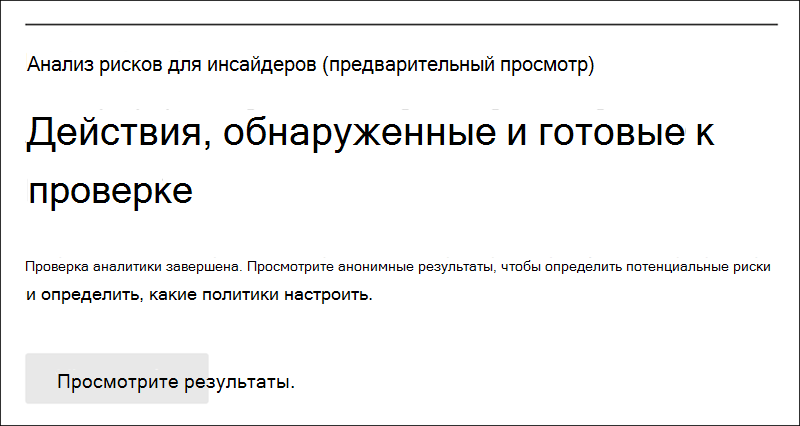

# Начало работы с настройками управления рисками изнутри

Параметры управления рисками для инсайдеров применяются к всем политикам управления рисками, независимо от шаблона, который вы выбираете при создании политики. Параметры настраиваются с помощью элемента управления **параметрами внутреннего риска**, расположенного в верхней части всех вкладок управления внутренними рисками. Эти параметры контролируют компоненты политики для следующих областей:

- Конфиденциальность
- Индикаторы
- Сроки политики
- Интеллектуальные обнаружения
- Экспорт оповещений (предварительный просмотр)
- Приоритетные группы пользователей (предварительный просмотр)
- Приоритетные физические активы (предварительный просмотр)
- Power Automate потоков (предварительный просмотр)
- Microsoft Teams (предварительный просмотр)
- Аналитика (предварительная версия)

Перед началом работы и создания инсайдерской политики управления рисками важно понять эти параметры и выбрать оптимальные уровни для соответствия требованиям для организации.

## Конфиденциальность

Защита конфиденциальности пользователей, которые имеют совпадения с политикой, важна и может помочь повысить объектность при исследовании данных и анализе данных для оповещений о внутренних рисках. Для пользователей с инсайдерской политикой риска можно выбрать один из следующих параметров:

- **Показать анонимные** версии имен пользователей. Имена пользователей анонимизируются, чтобы администраторы, исследователи данных и рецензенты не видели, кто связан с оповещениями политики. Например, пользователь "Екатерина Тимина" будет отображаться со случайным псевдонимом, таким как "Анон8-988", во всех областях управления внутренними рисками. При выборе этого параметра все пользователи с текущими и прошлыми совпадениями политик будут анонимизированы и применяются ко всем политикам. Сведения о профиле пользователя в оповещении о рисках, а также сведения о случаях, которые будут доступны после выбора этого параметра. Однако имена пользователей отображаются при добавлении новых пользователей к существующим политикам или при назначении пользователей новым политикам. Если вы решите отключить этот параметр, имена пользователей будут отображаться для всех пользователей, которые имеют текущие или прошлые совпадения политик.
- **Не показывать анонимные версии** имен пользователей: имена пользователей отображаются для всех текущих и прошлых совпадений политик для оповещений и случаев. Сведения о профиле пользователя (имя, название, псевдоним и организация или отдел) отображаются для пользователя для всех оповещений и случаев управления рисками изнутри.

## Индикаторы

Шаблоны политики инсайдерской политики риска определяют тип действий риска, которые необходимо обнаружить и изучить. Каждый шаблон политики основан на определенных индикаторах, соответствующих определенным триггерам и рискам. Все индикаторы отключены по умолчанию, и перед настройкой политики управления рисками необходимо выбрать один или несколько индикаторов политики.

Оповещения запускаются политиками при выполнении пользователями действий, связанных с показателями политики, которые соответствуют необходимому порогу. Управление рисками в инсайдерской области использует два типа показателей:

- **События запуска:** события, определяющие, активен ли пользователь в политике управления рисками. Если пользователь добавлен в внутреннюю политику управления рисками, не имеет события-триггера, его активность не оценивается политикой. Например, пользователь A добавляется в политику, созданную из кражи данных, путем отошедания шаблона политики пользователей и правильной настройки Microsoft 365 и соединителя кадров.  До тех пор, пока у пользователя A не будет даты прекращения, о которых сообщается в отделе кадров, действия пользователя A не будут оцениваться этой инсайдерской политикой управления рисками на риск. Другой пример события запуска — если у  пользователя есть оповещение о политике DLP с высокой степенью серьезности при использовании политик *утечки* данных.
- **Индикаторы политики.** Индикаторы, включенные в инсайдерскую политику управления рисками, используемые для определения оценки риска для пользователя в области. Эти индикаторы политики активируются только после запуска события для пользователя. Некоторые примеры показателей политики — это когда пользователь копирует данные в личные облачные службы хранения или портативные устройства хранения, если учетная запись пользователя удаляется из Azure Active Directory или если пользователь делится внутренними файлами и папок с несанкционированными внешними сторонами.

Индикаторы политики сегментироваться в следующих областях. Вы можете выбрать индикаторы для активации и настройки ограничений событий индикатора для каждого уровня индикатора при создании политики риска для инсайдеров:

- **Office.** К ним относятся индикаторы политики для SharePoint сайтов, Microsoft Teams и обмена сообщениями электронной почты.
- **Индикаторы устройства.** К ним относятся индикаторы политики для действий, таких как общий доступ к файлам по сети или с устройствами. Индикаторы включают действия, связанные со всеми типами файлов, за исключением исполняемой (.exe) и динамической библиотеки ссылок (.dll) файловой активности. Если вы выбираете индикаторы **Device,** активность обрабатывается только для устройств с Windows 10 сборки 1809 или выше, и сначала необходимо в центр соответствия требованиям. Дополнительные сведения о настройке устройств для интеграции с инсайдерской опасностью см. в следующем разделе [Включить](insider-risk-management-settings.md#OnboardDevices) индикаторы устройств и бортовых устройств в этой статье.
- Индикатор нарушений политики безопасности **(предварительный просмотр).** К ним относятся индикаторы из Microsoft Defender для конечной точки, связанные с неодобрением или установкой вредоносного программного обеспечения или обходом элементов управления безопасностью. Для получения оповещений в управлении рисками в инсайдерской области необходимо включить активную лицензию Defender для конечной точки и включить интеграцию с рисками изнутри. Дополнительные сведения о настройке Defender для конечной точки для интеграции с управлением рисками для инсайдеров см. в дополнительных сведениях о настройке расширенных функций [в Microsoft Defender для конечной точки.](/windows/security/threat-protection/microsoft-defender-atp/advanced-features\#share-endpoint-alerts-with-microsoft-compliance-center)
- **Физические индикаторы доступа (предварительный просмотр).** К ним относятся индикаторы политики для физического доступа к конфиденциальным активам. Например, попытка доступа к ограниченной области в журналах систем физического неугодного доступа может быть разделена с политиками управления рисками изнутри. Для получения этих типов оповещений в управлении рисками в инсайдерской системе  управления рисками необходимо включить приоритетные физические активы в управлении рисками и настраиваемом соединители данных физической ненадежности. Дополнительные информацию о настройке физического доступа см. в разделе [Приоритет](#priority-physical-assets-preview) физического доступа в этой статье.
- **Microsoft Cloud App Security (предварительный просмотр):** К ним относятся индикаторы политики из общих оповещений из Cloud App Security. Автоматически включенное обнаружение аномалий в Cloud App Security немедленно начинает обнаруживать и соединяя результаты, нацелившись на многочисленные поведенческие аномалии между пользователями и машинами и устройствами, подключенными к сети. Чтобы включить эти действия в оповещений о политике управления рисками, выберите один или несколько индикаторов в этом разделе. Дополнительные данные о Cloud App Security аналитике и обнаружении аномалий см. в обзоре [Get Behavioural analytics and anomaly detection.](/cloud-app-security/anomaly-detection-policy)
- **Ускорители оценки риска.** Они включают повышение оценки риска для необычных действий или прошлых нарушений политики. Включение ускорителей оценки риска повышает оценку риска и вероятность оповещения для этих типов действий. Для необычных действий баллы повышаются, если обнаруженная активность отклоняется от типичного поведения пользователя. Например, значительное увеличение ежедневных скачиваемых файлов. Необычная активность представлена как увеличение процента (например, "на 100% выше обычной активности") и повлияет на оценку риска по-разному в зависимости от активности. Для пользователей с предыдущими нарушениями политики оценки повышаются, если ранее у пользователя было несколько ранее разрешенных в качестве подтвержденных нарушений политики. Ускорители оценки риска можно выбрать только в том случае, если выбран один или несколько индикаторов.

В некоторых случаях может потребоваться ограничить показатели политики инсайдерской политики риска, применяемые к политикам инсайдерского риска в вашей организации. Вы можете отключить индикаторы политики для определенных областей, отключив их от всех политик риска, связанных с инсайдерской политикой. События запуска не могут быть изменены для шаблонов политики инсайдерской политики риска.

Чтобы определить индикаторы политики риска, включенные во всех инсайдерской политике риска, перейдите к параметрам параметров риска **insider** и выберите один или несколько индикаторов  >   политики. Индикаторы, выбранные на странице Параметры индикаторов, не могут быть индивидуально настроены при создании или редактировании политики риска инсайдеров в мастере политики.

>[!NOTE]
>Может потребоваться несколько часов, чтобы новые пользователи, добавленные вручную, появились на панели **мониторинга пользователей.** Для отображения действий в течение предыдущих 90 дней для этих пользователей может потребоваться до 24 часов. Чтобы просмотреть действия для пользователей, добавленных  вручную, выберите пользователя на панели мониторинга пользователей и откройте вкладку **Действия** пользователя на области сведений.

### Включить индикаторы устройств и бортовых устройств

Чтобы включить мониторинг действий с риском на устройствах и включить индикаторы политики для этих действий, устройства должны соответствовать следующим требованиям, и необходимо выполнить следующие действия.

#### Шаг 1. Подготовка конечных точек

Убедитесь, что Windows 10, которые вы планируете сообщать в инсайдерской области управления рисками, соответствуют этим требованиям.

1. Должно быть запущено Windows 10 x64 сборки 1809 или более поздней версии и должно быть установлено обновление Windows 10 [(OS Build 17763.1075)](https://support.microsoft.com/help/4537818/windows-10-update-kb4537818) с 20 февраля 2020 г.
2. Учетная запись пользователя, используемая для входа в Windows 10, должна быть учетной записью Azure Active Directory (AAD). Устройство Windows 10 [AAD, гибридная](/azure/active-directory/devices/concept-azure-ad-join)AAD или Active Directory, зарегистрированная AAD.
3. Установите браузер Microsoft Chromium Edge на конечном устройстве, чтобы отслеживать действия для облачной загрузки. См. статью [Загрузка нового браузера Microsoft Edge на основе Chromium](https://support.microsoft.com/help/4501095/download-the-new-microsoft-edge-based-on-chromium).

#### Шаг 2. Бортовые устройства

Необходимо включить мониторинг устройств и на борту конечных точек, прежде чем отслеживать действия по управлению рисками на устройстве. Оба действия принимаются на портале Microsoft 365 соответствия требованиям.

При необходимости на бортовых устройствах, которые еще не были на борту, загрузите соответствующий скрипт и развернете его, как описано в следующих действиях.

Если у вас уже есть устройства, подключенные к [Microsoft Defender для конечной точки](/windows/security/threat-protection/), они будут отображаться в списке управляемых устройств. Следуйте [шагу 3. Если](insider-risk-management-settings.md#OnboardStep3) в Microsoft Defender для конечной точки в следующем разделе имеются устройства.

В этом сценарии развертывания вы будете на борту устройств, которые еще не были на борту, и вы просто хотите отслеживать действия инсайдерского риска на Windows 10 устройствах.

1. Откройте [Центр соответствия требованиям Microsoft](https://compliance.microsoft.com).
2. Откройте параметры Центра соответствия требованиям и выберите **Подключение устройств**.

   > [!NOTE]
   > Обычно подключение устройств занимает около 60 секунд, подождите около 30 минут, прежде чем обращаться в службу поддержки Microsoft.

3. Выберите **Управление устройствами**, чтобы открыть список **Устройства** Список будет пустым, пока устройства не будут подключены.
4. Нажмите **Подключение**, чтобы начать процесс.
5. Выберите способ развертывания на эти устройства из  списка методов развертывания и **скачайте пакет**.
6. Выполните действия, описанные в разделе [Средства и методы подключения ATP Microsoft Defender для компьютеров с Windows 10](/windows/security/threat-protection/microsoft-defender-atp/configure-endpoints). Эта ссылка открывает начальную страницу доступа к процедурам Microsoft Defender для конечной точки, соответствующим пакету развертывания, который вы выбрали на этапе 5:
    - Подключение компьютеров с Windows 10 с помощью групповой политики
    - Подключение компьютеров с Windows с помощью Microsoft Endpoint Configuration Manager
    - Подключение компьютеров с Windows 10 с помощью инструментов управления мобильными устройствами
    - Подключение компьютеров с Windows 10 с помощью локального сценария
    - Подключение временных компьютеров инфраструктуры виртуальных рабочих столов (VDI).

После этого и конечной точки он должен быть виден в списке устройств, а конечная точка начнет сообщать журналы аудита для управления рисками инсайдеров.

> [!NOTE]
> Эта возможность включает принудительное применение лицензий. Без необходимой лицензии данные не будут видимы или доступны.

#### Шаг 3. Если в Microsoft Defender для конечной точки есть устройства

Если Microsoft Defender для конечной точки уже развернут и в них есть конечные точки, все эти конечные точки будут отображаться в списке управляемых устройств. Вы можете продолжать использовать новые устройства для управления рисками, чтобы расширить охват с помощью раздела [Step 2: Onboarding devices.](insider-risk-management-settings.md#OnboardStep2)

1. Откройте [Центр соответствия требованиям Microsoft](https://compliance.microsoft.com).
2. Откройте параметры Центра соответствия требованиям и выберите **Включить отслеживание устройств**.
3. Выберите **Управление устройствами**, чтобы открыть список **Устройства** Вы должны увидеть список устройств, которые уже сообщаются в Microsoft Defender для конечной точки.
4. Выберите **onboarding,** если вам нужно на борту больше устройств.
5. Выберите способ развертывания на этих устройствах  из списка методов развертывания, а затем **пакет загрузки.**
6. Выполните действия, описанные в разделе [Средства и методы подключения ATP Microsoft Defender для компьютеров с Windows 10](/windows/security/threat-protection/microsoft-defender-atp/configure-endpoints). Эта ссылка открывает начальную страницу доступа к процедурам Microsoft Defender для конечной точки, соответствующим пакету развертывания, который вы выбрали на этапе 5:
    - Подключение компьютеров с Windows 10 с помощью групповой политики
    - Подключение компьютеров с Windows с помощью Microsoft Endpoint Configuration Manager
    - Подключение компьютеров с Windows 10 с помощью инструментов управления мобильными устройствами
    - Подключение компьютеров с Windows 10 с помощью локального сценария
    - Подключение временных компьютеров инфраструктуры виртуальных рабочих столов (VDI).

После этого и конечной точки, она должна быть видна под таблицей **Устройства** и конечная точка начнет сообщать журналы аудита деятельности для управления рисками инсайдерской.

> [!NOTE]
>Эта возможность включает принудительное применение лицензий. Без необходимой лицензии данные не будут видимы или доступны.

### Параметры уровня индикатора (предварительный просмотр)

При создании политики в мастере политики можно настроить, как ежедневное число событий риска должно влиять на оценку риска для оповещений об инсайдерской опасности. Эти параметры индикатора помогают контролировать, как количество событий риска в вашей организации должно влиять на оценку риска и, таким образом, связанную серьезность оповещения для этих событий. Если вы хотите, вы также можете сохранить пороговые уровни событий по умолчанию, рекомендуемые Корпорацией Майкрософт для всех включенных индикаторов.

Например, вы решите включить индикаторы SharePoint в параметрах инсайдерской политики риска и установить настраиваемые пороговые значения для событий SharePoint  при настройке индикаторов для новой политики утечки данных о рисках. В мастере политики инсайдерской политики риска вы настраиваете три различных ежедневных уровня событий для каждого индикатора SharePoint, чтобы повлиять на оценку риска для оповещений, связанных с этими событиями.

Для первого ежедневного уровня событий вы установите пороговое значение в *10* или более событий в день для более низкого влияния на оценку риска для событий, *20* или более событий в день для среднего влияния на оценку риска для событий и *30* или более событий в день, что более сильно влияет на оценку риска для событий. Эти параметры фактически означают:

- Если после запуска события SharePoint происходит 1-9 событий, оценки риска минимально влияют и не создают оповещений.
- При 10-19 SharePoint событий, которые происходят после запуска события, оценка риска по своей сути ниже, а уровни серьезности оповещения, как правило, находятся на низком уровне.
- Если после запуска происходит 20-29 событий SharePoint, оценка риска по своей сути выше, а уровень серьезности оповещения, как правило, находится на среднем уровне.
- Если после запуска происходит 30 или более SharePoint событий, оценка риска по своей сути выше, а уровень серьезности оповещения, как правило, находится на высоком уровне.

## Временные интервалы политики

Временные интервалы политики позволяют определять прошлые и будущие периоды проверки, которые запускаются после совпадения политик на основе событий и действий для шаблонов политики управления внутренними рисками. В зависимости от шаблона политики доступны следующие временные рамки политики:

- **Окно активации.** Доступно для всех  шаблонов политики, окно активации —  это определенное количество дней, которое окно активирует после события запуска. Окно активируется в течение 1-30 дней после запуска события для любого пользователя, назначенного политике. Например, вы настроили внутреннюю политику управления рисками и установили окно *активации* до 30 дней. С момента настройки политики прошло несколько месяцев, и для одного из пользователей, включенных в политику, происходит событие запуска. Событие активации активирует окно *активации,* и политика активна для этого пользователя в течение 30 дней после запуска события.
- **Обнаружение прошлых** действий. Доступно для  всех шаблонов политики, обнаружение прошлых действий  — это определенное количество дней, активируемое окном перед событием запуска. Окно активируется за 0-180 дней до запуска события для любого пользователя, назначенного политике. Например, вы настроили внутреннюю политику управления  рисками и установили время обнаружения прошлых действий до 90 дней. С момента настройки политики прошло несколько месяцев, и для одного из пользователей, включенных в политику, происходит событие запуска. Событие запуска активирует  обнаружение действий прошлое, а политика собирает исторические действия для этого пользователя за 90 дней до запуска события.

## Интеллектуальные обнаружения

Интеллектуальные параметры обнаружения помогают уточнить, как обрабатываются обнаружения рискованных действий для оповещений. В определенных обстоятельствах может потребоваться определить типы файлов, которые следует игнорировать, или необходимо применить уровень обнаружения для файлов, чтобы определить минимальную планку оповещений. Используйте эти параметры для управления общим объемом оповещений, исключениями типа файлов и ограничениями громкости файлов.

### Исключения типа файлов

Чтобы исключить конкретные типы файлов из всех политик управления рисками, связанных с инсайдерской политикой управления рисками, введите расширения типа файлов, разделенные запятой. Например, чтобы исключить определенные типы музыкальных файлов из совпадений политики, можно ввести aac,mp3,wav,wma в поле **Исключения типов файлов**. Файлы с этими расширениями будут игнорироваться всеми политиками управления рисками изнутри.

### Порог для необычной активности файлов

Чтобы определить минимальный уровень файлов, прежде чем оповещений об активности будут отчитаться в политиках инсайдерского риска, введите количество файлов. Например, вы введите '10', если вы не хотите создавать оповещений о рисках, когда пользователь скачивает 10 файлов или меньше, даже если политики считают это действие необычным.

### Объем оповещений

Действия пользователей, обнаруженные политиками инсайдерского риска, назначены определенной оценке риска, которая, в свою очередь, определяет степень серьезности оповещений (низкая, средняя, высокая). По умолчанию мы будем создавать определенное количество оповещений о низкой, средней и высокой степени тяжести, но вы можете увеличить или уменьшить объем в соответствии с вашими потребностями. Чтобы настроить объем оповещений для всех политик управления рисками, выберите один из следующих параметров:

- **Меньше оповещений.** Вы увидите все предупреждения высокой степени тяжести, меньше оповещений о средней серьезности и отсутствие предупреждений низкой степени тяжести. Этот уровень параметров означает, что вы можете пропустить некоторые истинные положительные моменты.
- **Том по** умолчанию. Вы увидите все оповещения о высокой серьезности и сбалансированное количество оповещений средней и низкой степени тяжести.
- **Больше оповещений.** Вы увидите все предупреждения средней и высокой степени тяжести и большинство оповещений о низкой степени тяжести. Этот уровень параметров может привести к более ложным срабатывам.

### Защитник Майкрософт для конечной точки (предварительный просмотр)

[Microsoft Defender for Endpoint](/windows/security/threat-protection/microsoft-defender-atp/microsoft-defender-advanced-threat-protection) — это корпоративная платформа безопасности конечной точки, предназначенная для предотвращения, обнаружения, обнаружения, обнаружения и реагирования на расширенные угрозы. Чтобы лучше фиксировать нарушения безопасности в организации, можно импортировать и фильтровать оповещения Defender для конечных точек для действий, используемых в политиках, созданных из шаблонов политики нарушений безопасности для управления рисками.

В зависимости от типов сигналов, которые вас интересуют, вы можете импортировать оповещения в управление рисками на основе состояния оповещения Defender для конечных точек. В глобальных параметрах импорта можно определить один или несколько следующих статусов оповещения.

- Unknown
- Новое
- В процессе выполнения
- Устранено

Оповещения из Defender для конечной точки импортируется ежедневно. В зависимости от выбираемого состояния триажа можно увидеть несколько действий пользователя для того же оповещения, что и изменения состояния триажа в Defender for Endpoint.

Например, если для этого параметра выбраны *New*, *In Progress* и *Resolved,* когда создается оповещение Microsoft Defender для конечных точек и состояние *New,* для пользователя, находящегося в инсайдерской опасности, импортируется начальное действие оповещения. Когда состояние триажа Defender для конечной точки изменяется в *"В* процессе", для пользователя с инсайдерской опасностью импортируется второе действие для этого оповещения. При заданной окончательной оценке состояния "Защитник для конечной точки" для *Resolved* для пользователя, в случае риска инсайдера, импортируется третье действие для этого оповещений. Эта функция позволяет следователям следить за прогрессией оповещений Defender для конечной точки и выбирать уровень видимости, который требуется для их исследования.

>[!IMPORTANT]
>Необходимо настроить Microsoft Defender для конечной точки в организации и включить Defender для конечной точки для интеграции управления рисками в центре безопасности Defender для импорта оповещений о нарушениях безопасности. Дополнительные сведения о настройке Defender для конечной точки для интеграции управления рисками изнутри см. в дополнительных сведениях о настройке расширенных функций [в Defender для конечной точки.](/windows/security/threat-protection/microsoft-defender-atp/advanced-features\#share-endpoint-alerts-with-microsoft-compliance-center)

### Домены (предварительный просмотр)

Параметры домена помогают определить уровни риска для действий для определенных доменов. Эти действия включают обмен файлами, отправку сообщений электронной почты, загрузку или отправку контента. Указав домены в этих параметрах, вы можете увеличить или уменьшить оценку риска для действий, которые проходят с этими доменами.

Используйте домен Add для определения домена для каждого из параметров домена. Кроме того, вы можете использовать подгруппы для совпадения вариантов корневых доменов или поддоменов. Например, чтобы указать sales.wingtiptoys.com и support.wingtiptoys.com, используется запись подгруппы "*.wingtiptoys.com", чтобы соответствовать этим поддоменам (и любому другому поддомену на том же уровне). Чтобы указать многоуровневые поддомены для корневого домена, необходимо выбрать почтовый ящик **Include Multi-Level Subdomains.**

Для каждого из следующих параметров домена можно ввести до 500 доменов:

- **Незаверяемые домены:** При указании неоконченных доменов активность, которая происходит с этими доменами, будет иметь *более высокие показатели* риска. В качестве некоторых примеров можно привести действия, связанные с обменом контентом с кем-либо (например, отправка электронной почты кому-либо с gmail.com адресом) и загрузкой контента на устройство с одного из этих неуправляемого домена.
- **Разрешенные домены:** Некоторые действия, связанные с разрешенными доменами, будут игнорироваться политиками и не будут создавать оповещения. Эти действия включают в себя:

    - Электронная почта, отправленная на внешние домены
    - Файлы, папки, сайты, общие с внешними доменами
    - Файлы, загруженные на внешние домены (с Microsoft Edge браузера)

    Указыв допустимые домены в параметрах, эта активность с этими доменами рассматривается так же, как и к внутреннему действию организации. Например, добавленные здесь домены могут включать обмен контентом с кем-либо за пределами организации (например, отправка электронной почты кому-либо с gmail.com адресом).

- **Сторонние домены:** Если ваша организация использует сторонние домены для бизнес-целей (например, облачное хранилище), включите их здесь, чтобы вы могли получать оповещения о действиях, связанных с индикатором *устройства,* Используйте браузер для скачивания контента с сторонних сайтов.

## Экспорт оповещений (предварительный просмотр)

Сведения об оповещении об управлении рисками можно экспортировать в службы управления безопасностью и событиями (SIEM) с [помощью схемы API](/office/office-365-management-api/office-365-management-activity-api-schema#security-and-compliance-alerts-schema)Office 365 управления деятельностью. API Office 365 управления можно использовать для экспорта сведений об оповещении в другие приложения, которые организация может использовать для управления или сводки инсайдерской информации о рисках.

Чтобы использовать API для просмотра сведений об оповещении о рисках изнутри:

1. Включить Office 365 API для управления деятельностью в **инсайдерской** службе управления рисками Параметры  >    >  **оповещений по экспорту.** По умолчанию этот параметр отключен для Microsoft 365 организации.
2. Фильтрация общих Office 365 аудита *службой SecurityComplianceAlerts.*
3. Фильтр *securityComplianceAlerts* по категории *InsiderRiskManagement.*

Сведения оповещений содержат сведения из схемы оповещения о безопасности и соответствия требованиям и общей схемы API Office 365 управления деятельностью.

Следующие поля и значения экспортируются для оповещений об управлении рисками для системы оповещения & соответствия требованиям:

| **Параметр Alert** | **Описание** |
|:------------------|:----------------|
| AlertType | Тип оповещений *настраивается.*  |
| AlertId | GUID оповещений. Оповещений об управлении рисками изнутри можно мутить. По мере изменения состояния оповещений создается новый журнал с тем же alertID. Этот alertID можно использовать для сопоставления обновлений для оповещения. |
| Категория | Категория оповещений *— InsiderRiskManagement*. Эта категория может быть использована для отличия этих оповещений от других оповещений & соответствия требованиям. |
| Комментарии | Комментарии по умолчанию для оповещения. Значения : *New Alert* (регистрируется при создания оповещений) и Alert *Updated* (в журнале при обновлении оповещений). Используйте AlertID для сопоставления обновлений для оповещения. |
| Данные | Данные оповещений включают уникальный пользовательский ID, имя пользователя и дату и время (UTC), когда пользователь был включен в политику. |
| Имя | Имя политики для политики управления рисками, которая вызвала оповещение. |
| PolicyId | GUID инсайдерской политики управления рисками, которая вызвала оповещение. |
| Серьезность | Серьезность оповещения. Значения : *High,* *Medium* или *Low*. |
| Источник | Источник оповещения. Это значение Office 365 *безопасности & соответствия* требованиям. |
| Состояние | Состояние оповещений. Значения *active* *(needs Review* in insider risk), *Investigating* (Confirmed in insider risk),*Resolved (Resolved* in insider risk), *Dismissed*  *(Dismissed* in insider risk).  |
| Версия | Версия схемы оповещения о безопасности и соблюдении требований. |

Следующие поля и значения экспортируются для оповещений об управлении рисками для общей схемы Office 365 управления [API.](/office/office-365-management-api/office-365-management-activity-api-schema#common-schema)

- UserId
- Id
- RecordType
- CreationTime
- Operation
- OrganizationId
- UserType
- UserKey

## Приоритетные группы пользователей (предварительный просмотр)

Пользователи в вашей организации могут иметь различные уровни риска в зависимости от их положения, уровня доступа к конфиденциальной информации или истории рисков. Приоритизация изучения и оценки действий этих пользователей поможет предупредить вас о потенциальных рисках, которые могут иметь более серьезные последствия для организации. Приоритетные группы пользователей в инсайдерской группе управления рисками помогают определять пользователей в организации, которые нуждаются в более тщательном рассмотрении и более чувствительном подсчете рисков. В сочетании  с нарушениями политики безопасности  приоритетными пользователями и утечками данных по шаблонам политики приоритетных пользователей пользователи, добавленные в группу пользователей с приоритетом, имеют повышенную вероятность оповещений и оповещений о рисках с более высокой степенью серьезности.

Например, необходимо защититься от утечек данных для очень конфиденциального проекта, в котором пользователи имеют доступ к конфиденциальной информации. Вы решите создать *группу пользователей конфиденциальной Project* *пользователей* для пользователей в организации, которые работают над этим проектом. С помощью мастера  политики и утечек данных по шаблону политики приоритетных пользователей создается новая политика и назначается группа приоритетов Project пользователей политики.  Действия, рассмотренные политикой для членов приоритетной группы *пользователей Project Пользователей,* более чувствительны к рискам, и действия этих пользователей с большей вероятностью будут генерировать оповещение и иметь оповещения с более высоким уровнем серьезности.

### Создание приоритетной группы пользователей

Чтобы создать новую группу пользователей с приоритетом, вы будете использовать элементы управления настройками в решении по управлению рисками **insider** в центре Microsoft 365 соответствия требованиям. Чтобы создать группу пользователей с приоритетом, необходимо быть членом группы по управлению рисками *insider* или *Insider Risk Management Admin* role group.

Выполните следующие действия для создания приоритетной группы пользователей:

1. В центре [Microsoft 365 соответствия](https://compliance.microsoft.com)требованиям перейдите к управлению рисками **insider** и выберите **параметры риска insider.**
2. Выберите **вкладку Группы пользователей Priority**
3. На **вкладке Приоритетные группы пользователей** выберите **Создать приоритетную** группу пользователей, чтобы запустить мастер создания группы.
4. На странице **Определить группу** выполните следующие поля:
    - **Имя (обязательно).** Введите удобное имя для приоритетной группы пользователей. Вы не можете изменить имя приоритетной группы пользователей после завершения мастера.
    - **Описание (необязательный).** Введите описание для приоритетной группы пользователей.
5. Выберите **Далее,** чтобы продолжить.
6. На странице **Выбор** участников  выберите выберите членов для поиска и выбора учетных записей пользователей  с поддержкой почты, включенных в группу, или выберите список Выберите все почтовые ящики, чтобы добавить всех пользователей в организации в группу. Выберите **Добавить** для продолжения или **отмены** закрытия без добавления пользователей в группу.
7. Выберите **Далее,** чтобы продолжить.
8. На странице **Обзор** просмотрите параметры, выбранные для приоритетной группы пользователей. Выберите **Изменение** для изменения любых групповых значений или выберите **Отправка** для создания и активации приоритетной группы пользователей.
9. На странице подтверждения выберите **Сделано,** чтобы выйти из мастера.

### Обновление приоритетной группы пользователей

Чтобы обновить существующую группу пользователей с приоритетом, вы будете использовать элементы управления настройками в решении по управлению рисками **insider** в центре Microsoft 365 соответствия требованиям. Чтобы обновить приоритетную группу пользователей, необходимо быть членом группы управления рисками *insider* или *insider Risk Management Admin* role group.

Выполните следующие действия по редактированию приоритетной группы пользователей:

1. В центре [Microsoft 365 соответствия](https://compliance.microsoft.com)требованиям перейдите к управлению рисками **insider** и выберите **параметры риска insider.**
2. Выберите **вкладку Группы пользователей Priority**
3. Выберите группу приоритетных пользователей, которые необходимо изменить, и выберите **группу Редактирование.**
4. На странице **Определить группу** обнови поле Описание при необходимости. Вы не можете обновить имя приоритетной группы пользователей. Выберите **Далее,** чтобы продолжить.
5. На странице **Выбор участников** добавьте новых членов в группу с помощью управления **"Выберите** членов". Чтобы удалить пользователя из группы, выберите "X" рядом с пользователем, который вы хотите удалить. Выберите **Далее,** чтобы продолжить.
6. На странице **Обзор** просмотрите параметры обновления, выбранные для приоритетной группы пользователей. Выберите **Изменить,** чтобы изменить любое из групповых значений или выбрать **Отправка** для обновления приоритетной группы пользователей.
7. На странице подтверждения выберите **Сделано,** чтобы выйти из мастера.

### Удаление приоритетной группы пользователей

Чтобы удалить существующую группу пользователей с приоритетом, вы будете использовать элементы управления настройками в решении по управлению рисками **insider** в центре Microsoft 365 соответствия требованиям. Чтобы удалить приоритетную группу пользователей, необходимо  быть членом группы "Управление рисками инсайдеров" или "Администратор роли управления *рисками".*

>[!IMPORTANT]
>Удаление приоритетной группы пользователей удаляет ее из любой активной политики, которой она назначена. Если удалить приоритетную группу пользователей, назначенную активной политике, политика не будет содержать пользователей в области и будет фактически простаивать и не будет создавать оповещений.

Выполните следующие действия для удаления приоритетной группы пользователей:

1. В центре [Microsoft 365 соответствия](https://compliance.microsoft.com)требованиям перейдите к управлению рисками **insider** и выберите **параметры риска insider.**
2. Выберите **вкладку Группы пользователей Priority**
3. Выберите приоритетную группу пользователей, которая необходимо изменить, и **выберите Удаление** из меню панели мониторинга.
4. В **диалоговом** окте Удалить выберите **Да** для удаления приоритетной группы пользователей или выберите **Отмена,** чтобы вернуться на панель мониторинга.

## Приоритетные физические активы (предварительный просмотр)

Определение доступа к приоритетным физическим активам и сопоставление активности доступа с событиями пользователей является важным компонентом инфраструктуры соответствия требованиям. Эти физические активы представляют собой приоритетные расположения в вашей организации, такие как здания компании, центры обработки данных или серверные комнаты. Действия по инсайдерской опасности могут быть связаны с тем, что пользователи работают в необычные часы, пытаясь получить доступ к этим несанкционированным конфиденциальным или защищенным областям, а также запросы на доступ к областям высокого уровня без законных потребностей.

При включении приоритетных  физических активов и настраиваемом соединителя данных физических ненадежных данных управление рисками интегрирует сигналы из систем физического управления и доступа с другими действиями риска пользователя. Изучение моделей поведения в различных системах физического доступа и сопоставление этих действий с другими событиями риска, связанных с инсайдерской деятельностью, поможет следователям и аналитикам по обеспечению соответствия требованиям принимать более обоснованные решения по оповещениям. Доступ к приоритетным физическим активам засмеян и идентифицирован в анализах, отличался от доступа к неоритетным активам.

Например, в организации есть система плохой работы для пользователей, отслеживающих и одобряющих физический доступ к обычным рабочим и чувствительным областям проекта. Над конфиденциальным проектом работает несколько пользователей, которые возвращаются в другие области организации по завершению проекта. По мере завершения конфиденциального проекта необходимо убедиться, что работа над проектом остается конфиденциальной и доступ к областям проекта строго контролируется.

Вы решите включить соединители данных физической ненадежной обработки данных в Microsoft 365 импортировать сведения о доступе из вашей физической системы плохой защиты и указать приоритетные физические активы в управлении рисками изнутри. Импортируете информацию из системы плохой работы и сопоставляете сведения о физическом доступе с другими действиями риска, выявленными в управлении рисками, вы заметите, что один из пользователей проекта после обычного рабочего дня имеет доступ к офисам проекта, а также экспортирует большие объемы данных в личную облачную службу хранения данных из обычной рабочей области. Это физическое действие доступа, связанное с деятельностью в Интернете, может указать на возможные кражи данных, а следователи по соответствию требованиям и аналитики могут принимать соответствующие действия, как это диктуется обстоятельствами для этого пользователя.

### Настройка физических активов приоритета

Чтобы настроить приоритетные физические активы, вы настроите соединители физической плохой настройки и используйте элементы управления настройками в решении по управлению рисками **insider** в центре Microsoft 365 соответствия требованиям. Чтобы настроить приоритетные физические активы, необходимо быть членом группы *insider Risk Management* или *Insider Risk Management Admin role group.*

Выполните следующие действия по настройке приоритетных физических активов:

1. Следуйте шагам конфигурации для управления рисками изнутри в статье [Начало работы с инсайдерской статьей управления рисками.](insider-risk-management-configure.md) В шаге 3 убедитесь, что вы настроите соединители физической плохой настройки.

    >[!IMPORTANT]
    >Чтобы политики управления рисками изнутри использовали и сопоставляют данные сигнала, связанные с отходами и прекращенными пользователями, с данными событий с платформ физического управления и доступа, необходимо также настроить Microsoft 365 hr-соединителя. Если включить соединители физической плохой работы, не включив Microsoft 365, политики управления рисками изнутри будут обрабатывать события только для физических действий доступа для пользователей в вашей организации.

2. В центре [Microsoft 365](https://compliance.microsoft.com)соответствия требованиям перейдите к управлению рисками **insider** и выберите **параметры insider** risk  >  **priority physical assets.**
3. На  странице Физические активы Priority можно вручную добавить физические ID активов, которые необходимо отслеживать для событий активов, импортируемых соединитетелем физического плохие активы, или импортировать файл .csv всех физических ID активов, импортируемых соединитетелем физического плохие активы: a) Чтобы вручную добавить физические ID активов, выберите Добавить приоритет физических активов, введите физический ID активов, а затем выберите Добавить **.** Введите другие физические ID активов и выберите **Добавить** приоритетные физические активы, чтобы сохранить все вступимые активы.
    b) Чтобы добавить список физических ИД активов из файла .csv, выберите физические активы import **priority**. В диалоговом окте проводника файлов выберите .csv, который вы хотите импортировать, а затем **откройте**. Физические ID активов из .csv добавляются в список.
4. Перейдите на **вкладку Индикаторы** политики в Параметры.
5. На странице **Индикаторы политики** перейдите в раздел Индикаторы физического доступа и выберите почтовый ящик для физического доступа после прекращения или неудачного доступа к  **конфиденциальному активу.**
6. Выберите **Сохранить** для настройки и выхода.

### Удаление приоритетного физического актива

Чтобы удалить существующий физический актив приоритета, вы будете использовать элементы управления настройками в решении по управлению рисками insider в центре Microsoft 365 соответствия требованиям. Чтобы удалить приоритетный физический актив, необходимо быть членом группы по управлению рисками insider или Insider Risk Management Admin role group.

>[!IMPORTANT]
>Удаление приоритетного физического актива удаляет его из проверки любой активной политикой, к которой он ранее был включен. Оповещения, созданные действиями, связанными с приоритетным физическим активом, не удаляются.

Выполните следующие действия для удаления приоритетного физического актива:

1. В центре [Microsoft 365](https://compliance.microsoft.com)соответствия требованиям перейдите к управлению рисками **insider** и выберите **параметры insider** risk  >  **priority physical assets.**
2. На странице **Приоритет физических активов** выберите актив, который необходимо удалить.
3. Выберите **Удаление** в меню действий для удаления актива.

## Power Automate потоков (предварительный просмотр)

[Microsoft Power Automate](/power-automate/getting-started) — это служба рабочего процесса, которая автоматизирует действия в приложениях и службах. Используя потоки из шаблонов или созданных вручную, можно автоматизировать общие задачи, связанные с этими приложениями и службами. Если вы включаете Power Automate для управления рисками, можно автоматизировать важные задачи для дел и пользователей. Вы можете настроить потоки Power Automate, чтобы получать сведения о пользователях, оповещениях и случаях, а также обмениваться этой информацией с заинтересованными сторонами и другими приложениями, а также автоматизировать действия в управлении рисками, например размещение записей о случаях. Power Automate для случаев и для любого пользователя в области политики.

Клиентам с Microsoft 365 подписками, которые включают управление рисками, не требуются дополнительные лицензии Power Automate для использования рекомендуемых шаблонов управления рисками Power Automate. Эти шаблоны можно настроить для поддержки организации и для покрытия основных сценариев управления рисками. Если вы решите использовать функции Power Automate премиум-класса в этих шаблонах, создайте настраиваемый шаблон с помощью соединиттеля соответствия требованиям Microsoft 365 или используйте Power Automate шаблоны для других областей соответствия требованиям Microsoft 365, может потребоваться больше Power Automate лицензий.

Ниже предоставляются Power Automate для поддержки автоматизации процессов для пользователей и дел по управлению рисками изнутри:

- Оповещать пользователей о добавлении в внутреннюю политику риска. Этот шаблон для организаций с внутренними политиками, требованиями конфиденциальности или нормативных требований, о том, что пользователи должны быть уведомлены, когда они подчиняются политикам управления рисками. Когда этот поток настроен и выбран для пользователя на странице пользователей, пользователям и их руководителям отправляется сообщение электронной почты при добавлении пользователя в политику управления рисками. Этот шаблон также поддерживает обновление списка SharePoint, который SharePoint сайте, чтобы отслеживать сведения об уведомлениях, таких как дата и время, и получатель сообщения. Если вы решили анонимизировать пользователей в параметрах **конфиденциальности,** потоки, созданные из этого шаблона, не будут функционировать так, чтобы сохранить конфиденциальность пользователей. Power Automate с помощью этого шаблона доступны на панели мониторинга **пользователей.**
- Запрос **сведений** из отдела кадров или бизнеса о пользователе в случае инсайдерского риска. При работе с делом аналитикам и следователям по инсайдерской опасности может потребоваться проконсультироваться с персоналом или другими заинтересованными сторонами, чтобы понять контекст действий по делу. Когда этот поток настроен и выбран для дела, аналитики и исследователи отправляют сообщение электронной почты в HR и бизнес-заинтересованные стороны, настроенные для этого потока. Каждому получателю отправляется сообщение с предварительно настроенными или настраиваемыми вариантами ответа. Когда получатели выбирают вариант ответа, ответ записывется в качестве заметки о случае и включает сведения о получателе и дате и времени. Если вы решили анонимизировать пользователей в параметрах **конфиденциальности,** потоки, созданные из этого шаблона, не будут функционировать так, чтобы сохранить конфиденциальность пользователей. Power Automate потоки с помощью этого шаблона доступны на панели **мониторинга cases.**
- **Сообщите диспетчеру,** когда у пользователя есть оповещение о рисках изнутри: некоторым организациям может потребоваться немедленное уведомление об управлении, если у пользователя есть оповещение об управлении рисками. Когда этот поток настроен и выбран, диспетчеру для пользователя дела отправляется сообщение электронной почты со следующими сведениями обо всех оповещениях о случаях:
    - Применимая политика для оповещений
    - Дата и время оповещения
    - Уровень серьезности оповещений

    Поток автоматически обновляет случае отмечает, что сообщение было отправлено и что поток был активирован. Если вы решили анонимизировать пользователей в параметрах **конфиденциальности,** потоки, созданные из этого шаблона, не будут функционировать так, чтобы сохранить конфиденциальность пользователей. Power Automate потоки с помощью этого шаблона доступны на панели **мониторинга cases.**
- Создание записи для случая риска для инсайдеров **в ServiceNow.** Этот шаблон используется для организаций, которые хотят использовать свое решение ServiceNow для отслеживания случаев управления рисками изнутри.  В случае, если аналитики и исследователи из инсайдерской службы риска могут создать запись для дела в ServiceNow. Этот шаблон можно настроить для заполнения выбранных полей в ServiceNow в зависимости от требований организации. Power Automate потоки с помощью этого шаблона доступны на панели **мониторинга cases.** Дополнительные сведения о доступных полях ServiceNow см. в справочной статье [ServiceNow Connector.](/connectors/service-now/)

### Создание потока Power Automate из шаблона управления рисками изнутри

Чтобы создать поток Power Automate из рекомендуемого шаблона управления рисками из инсайдерской системы управления рисками, вы будете использовать элементы управления  настройками в решении управления  рисками **insider** в  центре соответствия требованиям Microsoft 365 или в варианте Управление потоками Power Automate из управления автоматизацией при работе непосредственно на панели мониторинга "Случаи" или "Пользователи". 

Чтобы создать поток Power Automate в области параметров, необходимо быть членом группы управления рисками *insider* или *insider Risk Management Admin.* Чтобы создать поток Power Automate с помощью параметра **Управление** потоками Power Automate, необходимо быть членом по крайней мере одной группы ролей управления рисками изнутри.

Выполните следующие действия, чтобы создать поток Power Automate из рекомендованного шаблона управления рисками изнутри:

1. В центре [Microsoft 365 соответствия](https://compliance.microsoft.com/)требованиям перейдите к управлению рисками **insider** и выберите параметры Power Automate **insider.**  >   Вы также можете  получить  доступ со страниц панели мониторинга "Случаи" или "Пользователи", выбрав **автоматизированное** управление потоками  >  **Power Automate.**
2. На странице **Power Automate потоки** выберите рекомендуемый шаблон из шаблонов управления рисками **insider,** которые могут понравиться в разделе на странице.
3. Поток перечисляет встроенные подключения, необходимые для потока, и отмечает, доступны ли состояния подключения. При необходимости обнови все подключения, которые не отображаются как доступные. Выберите **Продолжить**.
4. По умолчанию рекомендуемые потоки предварительно настроены с помощью рекомендуемого инсайдерского управления рисками и Microsoft 365 полей данных службы, необходимых для выполнения назначенной задачи для потока. При необходимости настройте компоненты потока с помощью управления расширенными опциями **Show** и настроив доступные свойства для компонента потока.
5. При необходимости добавьте в поток любые другие действия, выбрав кнопку **New step.** В большинстве случаев это не требуется для рекомендуемых шаблонов по умолчанию.
6. Выберите **Сохранить черновик,** чтобы сохранить поток для дальнейшей конфигурации, или выберите **Сохранить** для завершения конфигурации для потока.
7. Выберите **Close,** чтобы **вернуться на страницу Power Automate потока.** Новый шаблон будет указан в качестве  потока на вкладке "Мои  потоки" и автоматически доступен из управления автоматической отсевной системой при работе с инсайдерской ситуацией управления рисками для пользователя, создав поток.

>[!IMPORTANT]
>Если другим пользователям в организации необходим доступ к потоку, поток должен быть общим.

### Создание настраиваемой Power Automate для управления рисками изнутри

Некоторые процессы и рабочие процессы для вашей организации могут быть вне рекомендуемых шаблонов потока управления рисками изнутри, и вам может потребоваться создать настраиваемые потоки Power Automate для областей управления рисками. Power Automate являются гибкими и поддерживают обширную настройку, но необходимо предпринять шаги для интеграции с функциями управления рисками изнутри.

Выполните следующие действия, чтобы создать настраиваемый шаблон Power Automate для управления рисками изнутри:

1. **Проверьте лицензию Power Automate** потока. Чтобы создать настраиваемые потоки Power Automate, которые используют триггеры управления рисками, вам потребуется Power Automate лицензия. Рекомендуемые шаблоны потока управления рисками изнутри не требуют дополнительного лицензирования и включаются в состав вашей лицензии на управление рисками.
2. **Создание автоматизированного потока.** Создайте поток, который выполняет одну или несколько задач после запуска события управления рисками изнутри. Дополнительные сведения о создании автоматизированного потока см. в материале [Create a flow in Power Automate.](/power-automate/get-started-logic-flow)
3. **Выберите соедините Microsoft 365** соответствия требованиям: поиск и выбор соединитетеля Microsoft 365 соответствия требованиям. Этот соединитатель включает триггеры и действия по управлению рисками. Дополнительные сведения о соединителках см. в статье [Обзор ссылок connector.](/connectors/connector-reference/)
4. **Выберите триггеры** управления рисками изнутри для потока: управление рисками insider имеет два триггера, доступных для пользовательских Power Automate потоков:
    - **Для выбранного случая управления рисками** изнутри. Потоки с помощью этого триггера можно выбрать на странице панели мониторинга для управления рисками.
    - **Для выбранного пользователя управления рисками** изнутри. Потоки с помощью этого триггера можно выбрать на странице панели мониторинга управления рисками пользователей.
5. Выберите действия по управлению рисками изнутри для потока: вы можете выбрать из нескольких действий для управления рисками, чтобы включить их в настраиваемый поток:
    - Оповещение об управлении рисками изнутри
    - Получить дело по управлению рисками изнутри
    - Получить пользователя управления рисками изнутри
    - Получить оповещений об управлении рисками изнутри для дела
    - Добавление заметки об управлении рисками изнутри

### Совместное Power Automate потока

По умолчанию Power Automate, созданные пользователем, доступны только этому пользователю. Чтобы другие пользователи управления рисками изнутри получили доступ и использовали поток, поток должен быть общим для создателя потока. Чтобы поделиться потоком, вы будете использовать элементы управления настройками в решении по управлению рисками **insider** в центре соответствия требованиям Microsoft 365 или  параметре Управление потоками Power Automate из управления automate при работе непосредственно на страницах панели мониторинга "Случаи" или  **"Пользователи".** После общего доступа к потоку все, с кем он был общий, могут получить доступ к потоку в отсеве управления **Automate** в панели мониторинга case **и** **User.**

Чтобы поделиться потоком Power Automate в области параметров, необходимо быть членом группы по управлению рисками *insider* или *Insider Risk Management Admin.* Чтобы поделиться потоком Power Automate с параметром **Управление** потоками Power Automate, необходимо быть членом по крайней мере одной группы ролей управления рисками изнутри.

Выполните следующие действия, чтобы поделиться потоком Power Automate:

1. В центре [Microsoft 365 соответствия](https://compliance.microsoft.com)требованиям перейдите к управлению рисками **insider** и выберите параметры Power Automate **insider.**  >   Вы также можете  получить  доступ со страниц панели мониторинга "Случаи" или "Пользователи", выбрав **автоматизированное** управление потоками  >  **Power Automate.**
2. На странице **Power Automate потоки** выберите **вкладку Мои потоки** или **потоки команды.**
3. Выберите поток для обмена, а затем **выберите Share** из меню параметры потока.
4. На странице общего доступа к потоку введите имя пользователя или группы, которые необходимо добавить в качестве владельца потока.
5. В **диалоговом** окте подключения выберите **ОК,** чтобы подтвердить, что добавленный пользователь или группа будут иметь полный доступ к потоку.

### Изменение потока Power Automate

Чтобы изменить поток, вы будете использовать элементы управления настройками в решении по управлению рисками **insider** в центре соответствия требованиям Microsoft 365 или  параметре Управление потоками Power Automate из управления **Automate** при работе непосредственно на панели мониторинга "Случаи" или  "Пользователи". 

Чтобы изменить Power Automate потока в области параметров, необходимо быть  членом группы "Управление рисками инсайдеров" или "Управление *рисками".* Чтобы изменить поток Power Automate с помощью параметра **Управление** потоками Power Automate, необходимо быть членом по крайней мере одной группы ролей управления рисками изнутри.

Выполните следующие действия, чтобы изменить поток Power Automate:

1. В центре [Microsoft 365 соответствия](https://compliance.microsoft.com)требованиям перейдите к управлению рисками **insider** и выберите параметры Power Automate **insider.**  >   Вы также можете  получить  доступ со страниц панели мониторинга "Случаи" или "Пользователи", выбрав **автоматизированное** управление потоками  >  **Power Automate.**
2. На странице **Power Automate потоков** выберите поток, чтобы изменить и выбрать **Изменение** из меню управления потоком.
3. Выберите параметр **ellipsis** Параметры для изменения параметра компонента потока или удаления  >   **эллипсиса** для  >   удаления компонента потока.
4. Выберите **Сохранить и** **закрыть** для завершения редактирования потока.

### Удаление потока Power Automate

Чтобы удалить поток, вы будете использовать элементы управления настройками в решении управления рисками **insider** в центре соответствия требованиям  Microsoft 365 или параметре  Управление потоками Power Automate из управления автоматом при работе непосредственно на панели мониторинга "Случаи" или **"Пользователи".**  При удалении потока он удаляется в качестве параметра для всех пользователей.

Чтобы удалить поток Power Automate в области параметров, необходимо быть членом  группы "Управление  рисками инсайдеров" или "Управление рисками". Чтобы удалить поток Power Automate с помощью параметра **Управление** потоками Power Automate, необходимо быть членом по крайней мере одной группы ролей управления рисками изнутри.

Выполните следующие действия, чтобы удалить поток Power Automate:

1. В центре [Microsoft 365 соответствия](https://compliance.microsoft.com)требованиям перейдите к управлению рисками **insider** и выберите параметры Power Automate **insider.**  >   Вы также можете  получить  доступ со страниц панели мониторинга "Случаи" или "Пользователи", выбрав **автоматизированное** управление потоками  >  **Power Automate.**
2. На странице **Power Automate потоков** выберите поток для удаления и выберите **Удаление** из меню управления потоком.
3. В диалоговом ок основе подтверждения удаления выберите **Удалить,** чтобы удалить поток, или выберите **Отмена** для выхода из действия удаления.

## Microsoft Teams (предварительный просмотр)

Аналитики соответствия требованиям и исследователи могут легко использовать Microsoft Teams для совместной работы в случаях управления рисками. Они могут координировать и взаимодействовать с другими заинтересованными сторонами в Microsoft Teams:

- Координация и проверка действий реагирования на случаи в частных Teams каналах
- Безопасное совместное и хранение файлов и доказательств, связанных с отдельными случаями
- Отслеживание и проверка действий в ответе аналитиков и исследователей

После Microsoft Teams для управления рисками для инсайдеров создается специальная группа Microsoft Teams каждый раз, когда оповещение подтверждается и создается случай. По умолчанию в группу автоматически входят все члены группы *insider Risk Management,* *Insider Risk Management Analysts* и *Insider Risk Management Investigators* role groups (до 100 начальных пользователей). Дополнительные вкладчики организации могут быть добавлены в команду после ее создания и при необходимости. Для существующих случаев, созданных перед включением Microsoft Teams, аналитики и следователи могут создать новую команду Microsoft Teams при работе в случае необходимости.  После устранения связанного случая в управлении рисками, связанного с инсайдерской безопасностью, команда автоматически архивируется (перемещается в скрытое и только для чтения).

Дополнительные сведения об использовании групп и каналов в Microsoft Teams см. в обзоре групп и каналов в [Microsoft Teams.](/MicrosoftTeams/teams-channels-overview)

Включение Microsoft Teams для случаев быстро и легко настраивается. Чтобы включить Microsoft Teams для управления рисками, выполните следующие действия:

1. В центре [Microsoft 365 управления](https://compliance.microsoft.com)рисками перейдите в **параметров** инсайдерского управления рисками.  >  
2. Выберите **вкладку Microsoft Teams.**
3. Включение Microsoft Teams для управления рисками.
4. Выберите **Сохранить** для настройки и выхода.

### Создание Microsoft Teams для существующих случаев

Если вы включаете Microsoft Teams для управления рисками для инсайдеров после имеющихся случаев, необходимо вручную создать команду для каждого случая по мере необходимости. После включения Microsoft Teams в параметрах управления рисками, новые случаи автоматически создадут новую команду Microsoft Teams.

Пользователям требуется разрешение на создание Microsoft 365 групп в организации для создания Microsoft Teams группы из дела. Дополнительные сведения об управлении разрешениями для Microsoft 365 групп см. в статью Управление созданием [Microsoft 365 групп.](../solutions/manage-creation-of-groups.md)

Чтобы создать группу для дела, вы будете использовать управление Create Microsoft Team при работе непосредственно в существующем случае. Выполните следующие действия, чтобы создать новую команду:

1. В центре [Microsoft 365 соответствия](https://compliance.microsoft.com)требованиям перейдите в **insider risk management**  >  **Cases** и выберите существующий случай.
2. В меню действий в случае выберите **Create Microsoft Team**.
3. В поле **Имя** команды введите имя новой Microsoft Teams.
4. Выберите **Создать команду Майкрософт,** а затем выберите **Закрыть**.

В зависимости от количества пользователей, назначенных группам ролей управления рисками, может потребоваться 15 минут, чтобы все исследователи и аналитики были добавлены в группу Microsoft Teams для дела.

## Аналитика (предварительная версия)

Внутренняя аналитика рисков позволяет проводить оценку потенциальных рисков, связанных с инсайдерской деятельностью в организации, без настройки каких-либо политик риска, связанных с инсайдерской деятельностью. Эта оценка может помочь организации определить потенциальные области повышенного риска пользователей и определить тип и область политики управления рисками, которые можно настроить. Проверки аналитики предоставляют следующие преимущества для организации:

- Простая настройка. Чтобы начать работу со сканами аналитики, можно выбрать сканирование run по запросу рекомендации аналитики или перейти к настройкам риска insider > вкладке Analytics и включить аналитику.
- Минимальные требования к конфиденциальности: результаты сканирования и сведения возвращаются в качестве анонимизированной активности пользователя, отдельные имена пользователей не идентифицируются рецензентами.
- Сведения о потенциальных рисках с помощью консолидированных данных: результаты сканирования помогут быстро определить потенциальные области риска для пользователей и определить, какая политика будет лучшей для смягчения этих рисков.

Ознакомьтесь с видеороликом [Insider Risk Management Analytics,](https://www.youtube.com/watch?v=5c0P5MCXNXk) чтобы понять, как аналитика может помочь ускорить идентификацию потенциальных рисков, связанных с инсайдерской деятельностью, и помочь вам быстро принять меры.

Аналитика проверяет события активности риска из нескольких источников, чтобы определить возможные области риска. В зависимости от текущей конфигурации аналитика ищет квалификационные действия риска в следующих областях:

- **Microsoft 365** журналов аудита: включенный во все проверки, это основной источник для выявления большинства потенциально рискованных действий.
- **Exchange Online.** Включенная во все проверки, Exchange Online позволяет определить действия, в которых данные в вложениях по электронной почте отойдут внешним контактам или службам.
- **Azure Active Directory.** Включенная во все проверки, Azure Active Directory помогает определить рискованные действия, связанные с пользователями с удаленными учетными записями пользователей.
- **Microsoft 365:** Если настроены события соединители кадров, они помогают выявлять рискованные действия, связанные с пользователями, у них есть даты увольнения или предстоящего прекращения работы.

Аналитические сведения, полученные при сканировании, основаны на тех же сигналах активности риска, используемых политиками управления рисками и результатами отчетов, основанными как на действиях пользователя, так и на последовательности. Тем не менее, подсчет рисков для аналитики основан на действии до 30 дней, в то время как политики инсайдерского риска используют ежедневные действия для анализа. Когда вы впервые включаете и запустите аналитику в организации, вы увидите результаты сканирования в течение одного дня. Если вы оставите аналитику включенной, вы увидите результаты каждого ежедневного сканирования, добавленного в отчеты о проницательности для максимального диапазона предыдущих 30 дней активности.

### Включить аналитику и запустить сканирование

Чтобы включить внутреннюю аналитику рисков, необходимо быть членом группы insider Risk Management, Insider Risk Management Admin или Microsoft 365 глобальной группы ролей администратора.
Выполните следующие действия, чтобы включить внутреннюю аналитику рисков:

1. В центре [Microsoft 365,](https://compliance.microsoft.com)перейдите к **управлению рисками insider**.
2. Выберите **сканирование run** on the Scan для **оценки** рисков, связанных с инсайдерской деятельностью, в карточке организации на вкладке Обзор управления **рисками.** Это включает сканирование аналитики для организации. Вы также можете включить сканирование в организации, перенавигав параметры риска **insider** Analytics и включив сканирование активности пользователя клиента для выявления потенциальных рисков, связанных с  >   **инсайдерской деятельностью.**
3. На области **сведений аналитики** выберите сканирование **Run,** чтобы запустить сканирование для организации. Результаты проверки аналитики могут занять до 24 часов, прежде чем сведения будут доступны в качестве отчетов для проверки.

### Просмотр аналитических данных и создание новых политик

После завершения первой проверки аналитики для организации можно просмотреть сведения и рекомендации о потенциально рискованных действиях пользователей. Ежедневные проверки будут продолжаться, если вы не отключите аналитику для организации. Чтобы просмотреть потенциальные риски для организации, перейдите на вкладку **Обзор** и выберите результаты Просмотра на карточке **аналитики рисков (предварительного просмотра).**  Если проверка для организации не завершена, вы увидите сообщение о том, что проверка по-прежнему активна.

Для завершенных сканов вы увидите потенциальные риски, обнаруженные в организации, а также сведения и рекомендации по устранению этих рисков. Определенные риски и конкретные сведения включаются в отчеты, сгруппифицированные по регионам, общее число пользователей с определенными рисками, процент этих пользователей с потенциально рискованными действиями и рекомендуемая политика инсайдерского риска, которая поможет снизить эти риски. Отчеты включают:

- **Сведения об утечках** данных. Действия для всех пользователей, которые могут включать случайное перенаполнение сведений за пределами организации или утечки данных пользователями с вредоносным намерением.
- **Сведения** о краже данных. Действия для удаляющихся пользователей или пользователей с удаленными Azure Active Directory учетными записями, которые могут включать рискованный обмен информацией за пределами организации или кражу данных пользователями с вредоносным намерением.
- **Главные сведения об эксфильтрации:** действия всех пользователей, которые могут включать обмен данными за пределами организации.

Чтобы отобразить дополнительные сведения для получения сведений, выберите **сведения View,** чтобы отобразить области сведений для анализа. В области сведений содержатся полные результаты анализа, рекомендация по политике риска для инсайдеров и кнопка **Создать** политику, которая поможет быстро создать рекомендуемую политику. Выбор политики Create передается мастеру политики и автоматически выбирает рекомендуемый шаблон политики, связанный с пониманием. Например, если анализ аналитики  касается действий по  утечке данных, шаблон политики общих утечек данных будет предварительно выбран в мастере политики для вас.

### Отключение аналитики

Чтобы отключить внутреннюю аналитику рисков, необходимо быть членом группы *insider Risk Management, Insider* *Risk Management Admin* или Microsoft 365 *глобальной* группы ролей администратора. После отключения аналитики отчеты аналитики останутся статичными и не будут обновляться для новых рисков.

Выполните следующие действия, чтобы отключить аналитику рисков для инсайдеров:

1. В центре [Microsoft 365,](https://compliance.microsoft.com)перейдите к **управлению рисками insider**.
2. Выберите **страницу**  >  **Analytics Параметров риска** insider.
3. На странице **Analytics** отключите сканирование пользовательских действий клиента, чтобы определить потенциальные риски, связанные **с инсайдерской деятельностью.**