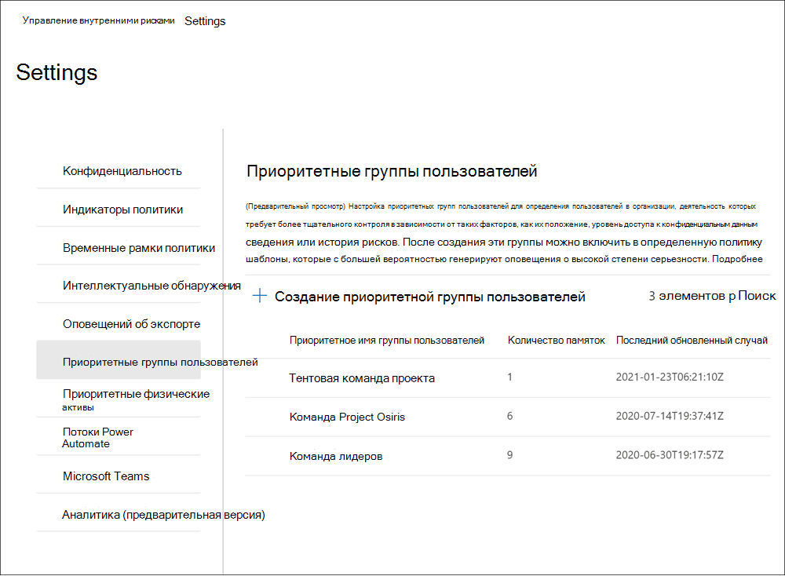

# Начало работы с параметрами управления рисками для оценкиGet started with insider risk management settings

Параметры управления рисками для участников программы предварительной оценки применяются ко всем политикам управления рисками для оценки, независимо от шаблона, выбранного при создании политики.Insider risk management settings apply to all insider risk management policies, regardless of the template you chose when creating a policy. Параметры настраиваются с помощью элемента управления " **параметры риска" для предварительной оценки** , расположенного в верхней части всех вкладок управления рисками для оценки.Settings are configured using the **Insider risk settings** control located at the top of all insider risk management tabs. Эти компоненты политики управления параметрами для следующих областей:These settings control policy components for the following areas:

- КонфиденциальностьPrivacy
- ИндикаторыIndicators
- Временные шкалы политикиPolicy timelines
- Интеллектуальные обнаруженияIntelligent detections
- Экспорт оповещенийExport alerts
- Приоритетные группы пользователейPriority user groups

Перед началом работы и созданием политик управления рисками для оценки важно понимать эти параметры и выбирать оптимальные уровни соответствия требованиям вашей организации.Before you get started and create insider risk management policies, it's important to understand these settings and choose setting levels best for the compliance needs for your organization.

## КонфиденциальностьPrivacy

Защита конфиденциальности пользователей, имеющих соответствия политике, важна и помогает повысить обжективити при расследовании данных и анализе анализа для оповещений о рисках для оценки.Protecting the privacy of users that have policy matches is important and can help promote objectivity in data investigation and analysis reviews for insider risk alerts. Для пользователей с согласованной политикой риска оценки можно выбрать один из следующих параметров:For users with an insider risk policy match, you can choose one of the following settings:

- **Показывать анонимные версии**имен пользователей: имена пользователей являются анонимными, чтобы запретить администраторам, обучениям и рецензентам просматривать пользователей, связанных с оповещениями политики.**Show anonymized versions of usernames**: User names are anonymized to prevent admins, data investigators, and reviewers from seeing who is associated with policy alerts. Например, пользователь "льготный Тайлор" будет отображаться с случайным псеудоним, таким как "AnonIS8 988" во всех областях интерфейса "Управление рисками".For example, a user 'Grace Taylor' would appear with a randomized pseudonym such as 'AnonIS8-988' in all areas of the insider risk management experience. При выборе этого параметра анонимизес все пользователи с текущей и предыдущей политикой соответствия и применяются ко всем политикам.Choosing this setting anonymizes all users with current and past policy matches and applies to all policies. При выборе этого параметра сведения о профиле пользователя в оповещениях и сведениях о рисках для участников программы предварительной оценки не будут доступны.User profile information in the insider risk alert and case details will not be available when this option is chosen. Однако имена пользователей отображаются при добавлении новых пользователей в существующие политики или при назначении пользователей новым политикам.However, usernames are displayed when adding new users to existing policies or when assigning users to new policies. Если отключить этот параметр, имена пользователей будут отображаться для всех пользователей, которым соответствуют текущие или прошлые политики.If you choose to turn off this setting, usernames will be displayed for all users that have current or past policy matches.
- **Не показывать анонимные версии имен пользователей**: имена пользователей отображаются для всех текущих и прошлых соответствий политик для оповещений и обращений.**Do not show anonymized versions of usernames**: Usernames are displayed for all current and past policy matches for alerts and cases. Сведения о профиле пользователя (имя, должность, псевдоним, организация или отдел) отображаются для пользователя по всем оповещениям и обращениям по управлению рисками для оценки.User profile information (the name, title, alias, and organization or department) is displayed for the user for all insider risk management alerts and cases.

## ИндикаторыIndicators

Шаблоны политики оценки рисков определяют тип действий риска, которые вы хотите обнаружить и исследовать.Insider risk policy templates define the type of risk activities that you want to detect and investigate. Каждый шаблон политики основан на определенных индикаторах, соответствующих определенным триггерам и действиям риска.Each policy template is based on specific indicators that correspond to specific triggers and risk activities. По умолчанию все индикаторы отключены, поэтому перед настройкой политики управления рисками для оценки необходимо выбрать один или несколько индикаторов политики.All indicators are disabled by default, and you must select one or more policy indicators before configuring an insider risk management policy.

Оповещения инициируются политиками, когда пользователи выполняют действия, связанные с индикаторами политики, которые отвечают требуемому пороговому значению.Alerts are triggered by policies when users perform activities related to policy indicators that meet a required threshold. Для системы управления рисками для оценки используются два типа индикаторов:Insider risk management uses two types of indicators:

- **Запуск событий**: события, определяющие, активен ли пользователь в политике управления рисками для оценки.**Triggering events**: Events that determine if a user is active for an insider risk management policy. Если пользователь добавляется к политике управления рисками, не имеющим триггера, то действие пользователя не оценивается политикой.If a user is added to an insider risk management policy does not have a triggering event, the user activity is not evaluated by the policy. Например, пользователь а добавляется в политику, созданную с помощью шаблона политики " *хищение данных",* а также политики и Microsoft 365 HR Connector.For example, User A is added to a policy created from the *Data theft by departing users* policy template and the policy and Microsoft 365 HR connector are properly configured. Пока у пользователя A не будет срока завершения, указанный соединителем HR, это значит, что эта политика управления рисками не оценивается для риска.Until User A has a termination date reported by the HR connector, User A activities aren't evaluated by this insider risk management policy for risk. Другой пример события, вызывающего срабатывание триггера, заключается в том, что при использовании политик *утечки данных* пользователь имеет оповещение о *высокой* серьезности защиты от потери данных.Another example of a triggering event is if a user has a *High* severity DLP policy alert when using *Data leaks* policies.
- **Индикаторы политики**: индикаторы, включенные в политики управления рисками для оценки, которые используются для определения оценки риска для пользователя в области.**Policy indicators**: Indicators included in insider risk management policies used to determine a risk score for an in-scope user. Эти индикаторы политики активируются только после возникновения события запуска для пользователя.These policy indicators are only activated after a triggering event occurs for a user. Некоторые примеры индикаторов политики применяются, когда пользователь копирует данные в личные облачные службы хранения или портативные устройства хранения, а также если пользователь совместно использует внутренние файлы и папки с неавторизованными внешними сторонами.Some examples of policy indicators are when a user copies data to personal cloud storage services or portable storage devices, or if a user shares internal files and folders with unauthorized external parties.

Индикаторы политики разбиты на следующие области.Policy indicators are segmented into the following areas. Вы можете выбрать индикаторы для активации и настройки пределов событий индикаторов для каждого уровня индикатора при создании политики риска для оценки.You can choose the indicators to activate and customize indicator event limits for each indicator level when creating an insider risk policy:

- **Индикаторы Office**: включают индикаторы политики для сайтов SharePoint, Teams и сообщений электронной почты.**Office indicators**: These include policy indicators for SharePoint sites, Teams, and email messaging.
- **Индикаторы устройств**: сюда входят индикаторы политики для таких действий, как совместное использование файлов в сети или с устройствами.**Device indicators**: These include policy indicators for activity such as sharing files over the network or with devices. Индикаторы включают в себя действия, связанные с файлами Microsoft Office. CSV-файлы и. PDF-файлы.Indicators include activity involving Microsoft Office files, .CSV files, and .PDF files. Если вы выбираете **индикаторы устройств**, действие обрабатывается только для устройств с Windows 10 Build 1809 или более поздней версии.If you select **Device indicators**, activity is processed only for devices with Windows 10 Build 1809 or higher. Более подробную информацию о настройке устройств для интеграции с риском для оценки можно узнать в статье [Начало работы с DLP в конечной точке](endpoint-dlp-getting-started.md).For more information on configuring devices for integration with insider risk, see [Getting started with Endpoint DLP](endpoint-dlp-getting-started.md).
- **Индикатор нарушения политики безопасности**: включает индикаторы из пакета ATP для защитника Майкрософт, связанные с установкой неутвержденных или вредоносных программ, а также обход элементов управления безопасностью.**Security policy violation indicator**: These include indicators from Microsoft Defender ATP related to unapproved or malicious software installation or bypassing security controls. Для получения оповещений в управлении рисками для предварительной оценки необходимо включить действующую лицензию на пакет ATP для защитника и угрозу для участников.To receive alerts in insider risk management, you must have an active Microsoft Defender ATP license and insider risk integration enabled. Дополнительные сведения о настройке пакета ATP для защитника Майкрософт для интеграции управления рисками для ИТ можно найти [в статье configure Advanced Features in Microsoft Defender ATP](https://docs.microsoft.com/windows/security/threat-protection/microsoft-defender-atp/advanced-features\#share-endpoint-alerts-with-microsoft-compliance-center).For more information on configuring Microsoft Defender ATP for insider risk management integration, see [Configure advanced features in Microsoft Defender ATP](https://docs.microsoft.com/windows/security/threat-protection/microsoft-defender-atp/advanced-features\#share-endpoint-alerts-with-microsoft-compliance-center).
- **Ускорители показателей риска**: в их числе возникает риск необычных действий или прошлых нарушений политики.**Risk score boosters**: These include raising the risk score for unusual activities or past policy violations. Предоставление ускорителей оценки риска повышает показатели рисков и вероятность оповещений для этих типов действий.Enabling risk score boosters increase risk scores and the likelihood of alerts for these types of activities. Ускорители оценки риска могут быть выбраны, только если выбрано одно или несколько индикаторов.Risk score boosters can only be selected if one or more indicators above are selected.

В некоторых случаях может потребоваться ограничить показатели политики риска предварительной оценки, применяемые к политикам риска для оценки в Организации.In some cases, you may want to limit the insider risk policy indicators that are applied to insider risk policies in your organization. Вы можете отключить индикаторы политики для определенных областей, отключив их от всех политик оценки риска.You can turn off the policy indicators for specific areas by disabling them from all insider risk policies. Триггерные события нельзя изменить для шаблонов политики риска для оценки.Triggering events cannot be modified for insider risk policy templates.

Чтобы определить индикаторы политики риска для оценки, включенные во всех политиках оценки риска, перейдите к индикаторам **параметров оценки риска**  >  **Indicators** и выберите один или несколько индикаторов политики.To define the insider risk policy indicators that are enabled in all insider risk policies, navigate to **Insider risk settings** > **Indicators** and select one or more policy indicators. Индикаторы, выбранные на странице параметров индикаторов, не могут быть настроены индивидуально при создании или изменении политики риска для оценки в мастере политик.The indicators selected on the Indicators settings page cannot be individually configured when creating or editing an insider risk policy in the policy wizard.

>[!NOTE]
>Новые пользователи, добавленные вручную, могут отображаться на **панели мониторинга "Пользователи"** в течение нескольких часов.It may take several hours for new manually-added users to appear in the **Users dashboard**. Для отображения действий за последние 90 дней для этих пользователей может потребоваться до 24 часов.Activities for the previous 90 days for these users may take up to 24 hours to display. Чтобы просмотреть действия для добавленных вручную пользователей, выберите пользователя на **панели мониторинга "Пользователи** " и откройте вкладку **действия пользователя** в области сведений.To view activities for manually added users, select the user on the **Users dashboard** and open the **User activity** tab on the details pane.

### Параметры уровня индикатора (Предварительная версия)Indicator level settings (preview)

При создании политики в мастере политики можно настроить, как ежедневное количество событий риска будет влиять на оценку риска для оповещений о рисках для участников программы.When creating a policy in the policy wizard, you can configure how the daily number of risk events should influence the risk score for insider risk alerts. Эти параметры индикатора помогают контролировать, как количество экземпляров событий риска в Организации должно повлиять на оценку риска, а соответственно на степень серьезности оповещений для этих событий.These indicator settings help you control how the number of occurrences of risk events in your organization should affect the risk score, and consequently the associated alert severity, for these events. При желании вы также можете оставить уровни по умолчанию для событий, рекомендуемых корпорацией Майкрософт для всех включенных индикаторов.If you prefer, you can also choose to keep the default event threshold levels recommended by Microsoft for all enabled indicators.

Например, вы решили включить индикаторы SharePoint в параметрах политики риска предварительной оценки и задать настраиваемые пороги для событий SharePoint при настройке индикаторов для новой политики *утечек данных* о рисках для оценки.For example, you decide to enable SharePoint indicators in the insider risk policy settings and to set custom thresholds for SharePoint events when configuring indicators for a new insider risk *Data leaks* policy. В мастере политики риска для оценки вы настраиваете три разных уровня ежедневного события для каждого индикатора SharePoint, чтобы повлиять на оценку риска для оповещений, связанных с этими событиями.While in the insider risk policy wizard, you configure three different daily event levels for each SharePoint indicator to influence the risk score for alerts associated with these events.

- Для первого ежедневного уровня событий вы устанавливаете пороговое значение на *10 или больше событий в день* , чтобы снизить влияние на показатель риска для событий, *20 или больше событий в день* для среднего влияния на показатель риска для событий *,* и *30 или больше событий в день* более высокое влияние на показатель риска для событий.For the first daily event level, you set the threshold at *10 or more events per day* for a lower impact to the risk score for the events, *20 or more events per day* for a medium impact to the risk score for the events *,* and *30 or more events per day* a higher impact to the risk score for the events. Эти параметры эффективно означают:These settings effectively mean:

- При наличии 1-9 событий SharePoint, выполняемых после срабатывания события, оценки риска минимально влияют и могут не создавать оповещение.If there are 1-9 SharePoint events that take place after triggering event, risk scores are minimally impacted and would tend not to generate an alert.
- При наличии 10-19 событий SharePoint, которые происходят после события, вызванного триггером, показатель риска на самом низком уровне и уровни серьезности оповещений, как правило, будут находиться на низком уровне.If there are 10-19  SharePoint events that take place after a triggering event, the risk score is inherently lower and alert severity levels would tend to be at a low level.
- При наличии 20-29 событий SharePoint, выполняемых после запуска триггера, показатель риска на более высоком уровне и уровни серьезности оповещений, как правило, будут иметь средний уровень.If there are 20-29 SharePoint events that take place after a triggering, the risk score is inherently higher and alert severity levels would tend to be at a medium level.
- При наличии 30 или более событий SharePoint, которые выполняются после запуска триггера, показатель риска на более высоком уровне, а уровни серьезности оповещений, как правило, будут иметь высокий уровень.If there are 30 or more SharePoint events that take place after a triggering, the risk score is inherently higher and alert severity levels would tend to be at a high level.

## Временные рамки политикPolicy timeframes

Временные рамки политики позволяют определять периоды предыдущего и будущего рецензирования, которые запускаются после соответствия политике, на основе событий и действий для шаблонов политики управления рисками для оценки.Policy timeframes allow you to define past and future review periods that are triggered after policy matches based on events and activities for the insider risk management policy templates. В зависимости от выбранного шаблона политики доступны следующие временные интервалы политики:Depending on the policy template you choose, the following policy timeframes are available:

- **Окно активации**: доступно для всех шаблонов политик, *окно активации* — это определенное количество дней, в течение которых окно активируется **после** запуска события.**Activation window**: Available for all policy templates, the *Activation window* is the defined number of days that the window activates **after** a triggering event. Окно активируется в течение 1 – 30 дней после возникновения события запуска для любого пользователя, назначенного политике.The window activates for 1 to 30 days after a triggering event occurs for any user assigned to the policy. Например, вы настроили политику управления рисками для оценки и хотите, чтобы *окно активации* настроило 30 дней.For example, you've configured an insider risk management policy and set the *Activation window* to 30 days. После настройки политики прошло несколько месяцев, а для одного из пользователей, включенных в политику, возникает событие триггера.Several months have passed since you configured the policy and a triggering event occurs for one of the users included in the policy. Событие запуска активирует *окно активации* , а политика активна для этого пользователя в течение 30 дней после возникновения события триггера.The triggering event activates the *Activation window* and the policy is active for that user for 30 days after the triggering event occurred.
- **Обнаружение прошлых действий**: доступно для всех шаблонов политики, *Обнаружение прошлых действий* — это определенное количество дней, в течение которых окно активируется **до** запуска события.**Past activity detection**: Available for all policy templates, the *Past activity detection* is the defined number of days that the window activates **before** a triggering event. Окно активируется в течение от 0 до 180 дней, пока не будет вызвано событие запуска для любого пользователя, назначенного политике.The window activates for 0 to 180 days before a triggering event occurs for any user assigned to the policy. Например, вы настроили политику управления рисками для предварительной оценки и настроили *Обнаружение прошлых действий* равным 90 дням.For example, you've configured an insider risk management policy and set the *Past activity detection* to 90 days. После настройки политики прошло несколько месяцев, а для одного из пользователей, включенных в политику, возникает событие триггера.Several months have passed since you configured the policy and a triggering event occurs for one of the users included in the policy. Событие, вызывающее срабатывание, активирует *Обнаружение прошлых действий* , а политика собирает исторические действия для этого пользователя в течение 90 дней до запуска события.The triggering event activates the *Past activity detection* and the policy gathers historic activities for that user for 90 days prior to the triggering event.

## Интеллектуальные обнаруженияIntelligent detections

Параметры интеллектуального обнаружения помогают уточнить, как обрабатываются обнаруженные рискованные действия для оповещений.Intelligent detection settings help refine how the detections of risky activities are processed for alerts. В некоторых случаях может потребоваться определить типы файлов, которые следует игнорировать, или применить уровень обнаружения файлов для определения минимальной полосы для оповещений.In certain circumstances, you may need to define files types to ignore or you want to enforce a detection level for files to help define a minimum bar for alerts. При использовании нежелательных языковых политик может потребоваться увеличить или уменьшить чувствительность обнаружения, чтобы управлять количеством обнаруженных соответствий политик.When using offensive language policies, you may need to increase or decrease the detection sensitivity to control the amount of reported policy matches. Используйте эти параметры для управления общим объемом оповещений, исключениями типов файлов, ограничениями для томов файлов и нежелательным чувствительностью к обнаружению нежелательных языков.Use these settings to control overall alert volume, file type exclusions, file volume limits, and the offensive language detection sensitivity.

### Обнаружение аномалийAnomaly detections

Нетипичные обнаружения включают параметры для исключений типов файлов и ограничения объема файлов.Anomalous detections include settings for file type exclusions and file volume limits.

- **Исключения типов файлов**: чтобы исключить определенные типы файлов из всех совпадений политики управления рисками для проверки подлинности, введите расширения типов файлов, разделяя их запятыми.**File type exclusions**: To exclude specific file types from all insider risk management policy matching, enter file type extensions separated by commas. Например, чтобы исключить определенные типы музыкальных файлов из соответствия политике, можно ввести *ААК, MP3, WAV, WMA* в поле **типы файлов для исключения** .For example, to exclude certain types of music files from policy matches you may enter *aac,mp3,wav,wma* in the **File type exclusions** field. Файлы с этими расширениями будут игнорироваться всеми политиками управления рисками для оценки.Files with these extensions would be ignored by all insider risk management policies.
- **Предельное число сокращений громкости тома**: для определения минимального уровня файлов до отчета об оповещениях об активности в политиках оценки риска введите число файлов.**File volume cut-off limit**: To define a minimum file level before activity alerts are reported in insider risk policies, enter the number of files. Например, если вы не хотите создавать оповещения о рисках для оценки риска, когда пользователь загружает 10 файлов или меньше, даже если политики считают, что это действие является аномалией, введите "10".For example, you would enter '10' if you do not want to generate insider risk alerts when a user downloads 10 files or less, even if the policies consider this activity an anomaly.

### Нежелательные обнаружения языковOffensive language detections

Чтобы настроить чувствительность нежелательного классификатора языка для политик, использующих *нежелательный язык в шаблоне электронной почты* , выберите один из следующих параметров:To adjust the sensitivity of the offensive language classifier for policies using the *Offensive language in email* template, choose one of the following settings:

- **Низкий**: самый низкий уровень чувствительности с самым широким диапазоном для обнаружения оскорбительного языка и мнений.**Low**: The lowest sensitivity level with the broadest range for detection offensive language and sentiment. Вероятность ложных срабатываний для оскорбительного совпадения языков повышается.The probability of false positives for offensive language matching is elevated.
- **Medium**: уровень чувствительности среднего уровня с сбалансированным диапазоном для обнаружения оскорбительного языка и мнений.**Medium**: The mid-level sensitivity level with a balanced range for detection offensive language and sentiment. Вероятность ложных срабатываний для оскорбительного совпадения языка — СРЗНАЧ.The probability of false positives for offensive language matching is average.
- **Высокий**: максимальный уровень чувствительности с небольшим диапазоном для обнаружения оскорбительного языка и мнений.**High**: The highest sensitivity level with a narrow range for detection offensive language and sentiment. Вероятность ложных срабатываний для нежелательного совпадения языков мала.The probability of false positives for offensive language matching is low.

### Громкость оповещенияAlert volume

Действиям пользователей, обнаруженным политиками оценки рисков, назначается определенный показатель риска, который, в свою очередь, определяет серьезность оповещения (низкие, средние, высокие).User activities detected by insider risk policies are assigned a specific risk score, which in turn determines the alert severity (low, medium, high). По умолчанию мы создаем определенный объем уведомлений о низком, среднем и высоком уровне серьезности, но вы можете увеличить или уменьшить объем в соответствии с вашими потребностями.By default, we'll generate a certain amount of low, medium, and high severity alerts, but you can increase or decrease the volume to suit your needs. Чтобы настроить уровень оповещений для всех политик управления рисками, выберите один из следующих параметров:To adjust the volume of alerts for all insider risk management policies, choose one of the following settings:

- **Уменьшите количество оповещений**: вы увидите все оповещения высокой серьезности, меньшее количество оповещений средней серьезности и отсутствие недостаточной важности.**Fewer alerts**: You'll see all high severity alerts, fewer medium severity alerts, and no low severity ones. Этот уровень установки означает, что вы можете пропустить некоторые ложные срабатывания.This setting level means you might miss some true positives.
- **Громкость по умолчанию**: отображаются все оповещения высокой серьезности и сбалансированное количество предупреждений о среднем и низком уровне.**Default volume**: You'll see all high severity alerts and a balanced amount of medium and low severity alerts.
- **Дополнительные оповещения**: вы увидите все предупреждения среднего и высокого уровня, а также предупреждения о низком уровне серьезности.**More alerts**: You'll see all medium and high severity alerts and most low severity alerts. Этот уровень настройки может привести к более ложным срабатываниям.This setting level might result in more false positives.

### Advanced Threat Protection в защитнике Майкрософт (Предварительная версия)Microsoft Defender Advanced Threat Protection (preview)

[Advanced Threat Protection в защитнике Майкрософт](https://docs.microsoft.com/windows/security/threat-protection/microsoft-defender-atp/microsoft-defender-advanced-threat-protection) (ATP) — это платформа безопасности для корпоративных конечных точек, предназначенная для предотвращения, обнаружения, проверки и реагирования на дополнительные угрозы в корпоративных сетях.[Microsoft Defender Advanced Threat Protection](https://docs.microsoft.com/windows/security/threat-protection/microsoft-defender-atp/microsoft-defender-advanced-threat-protection) (ATP) is an enterprise endpoint security platform designed to help enterprise networks prevent, detect, investigate, and respond to advanced threats. Чтобы лучше понять нарушение безопасности в Организации, вы можете импортировать и фильтровать оповещения защитника Майкрософт для действий, используемых в политиках, созданных на основе шаблонов политики нарушения безопасности системы безопасности для оценки риска.To have better visibility of security violation in your organization, you can import and filter Microsoft Defender ATP alerts for activities used in policies created from insider risk management security violation policy templates.

В зависимости от требуемых типов сигналов можно выбрать Импорт оповещений в систему управления рисками на основе состояния рассмотрения оповещения защитником Майкрософт.Depending on the types of signals you are interested in, you can choose to import alerts to insider risk management based on the Microsoft Defender ATP alert triage status. В глобальных параметрах для импорта можно определить одно или несколько следующих состояний рассмотрения оповещения:You can define one or more of the following alert triage statuses in the global settings to import:

- UnknownUnknown
- СоздатьNew
- ВыполняетсяIn progress
- УстраненоResolved

Оповещения от Microsoft Defender ATP импортируются ежедневно.Alerts from Microsoft Defender ATP are imported daily. В зависимости от выбранного состояния рассмотрения вы можете увидеть несколько действий пользователя для одного и того же оповещения, когда состояние рассмотрения изменяется в статье Microsoft Defender ATP.Depending on the triage status you choose, you may see multiple user activities for the same alert as the triage status changes in Microsoft Defender ATP.

Например, если выбрано значение *создать*, *в ходе выполнения*и *разрешено* для этого параметра, при создании оповещения Майкрософт для защитника ATP и изменении состояния " *новое*" для пользователя будет импортировано исходное действие оповещения.For example, if you select *New*, *In progress*, and *Resolved* for this setting, when a Microsoft Defender ATP alert is generated and the status is *New*, an initial alert activity is imported for the user in insider risk. Когда состояние рассмотрения для защитника Майкрософт изменяется на *в ходе выполнения*, для пользователя будет импортировано второе действие для этого оповещения.When the Microsoft Defender ATP triage status changes to *In progress*, a second activity for this alert is imported for the user in insider risk. Когда задается Последнее состояние рассмотрения " *разрешено* " для защитника Майкрософт, третье действие для этого оповещения импортируется для пользователя в составе риска для оценки.When the final Microsoft Defender ATP triage status of *Resolved* is set, a third activity for this alert is imported for the user in insider risk. Эта функция позволяет обследовать ход выполнения оповещений защитника Microsoft Defender и выбирать уровень видимости, необходимый для их расследования.This functionality allows investigators to follow the progression of the Microsoft Defender ATP alerts and choose the level of visibility that their investigation requires.

>[!IMPORTANT]
>Вам потребуется настроить в Организации пакет ATP для защитника Microsoft и включить пакет ATP для защитника Майкрософт для интеграции управления рисками в центре безопасности защитника, чтобы импортировать оповещения о нарушениях безопасности.You'll need to have Microsoft Defender ATP configured in your organization and enable Microsoft Defender ATP for insider risk management integration in the Defender Security Center to import security violation alerts. Дополнительные сведения о настройке пакета ATP для защитника Майкрософт для интеграции управления рисками для ИТ можно найти [в статье configure Advanced Features in Microsoft Defender ATP](https://docs.microsoft.com/windows/security/threat-protection/microsoft-defender-atp/advanced-features\#share-endpoint-alerts-with-microsoft-compliance-center).For more information on configuring Microsoft Defender ATP for insider risk management integration, see [Configure advanced features in Microsoft Defender ATP](https://docs.microsoft.com/windows/security/threat-protection/microsoft-defender-atp/advanced-features\#share-endpoint-alerts-with-microsoft-compliance-center).

### Домены (Предварительная версия)Domains (preview)

Параметры домена помогают определить уровни риска для связи с определенными доменами.Domain settings help you define risk levels for communications to specific domains. Эти сообщения включают в себя общий доступ к файлам, сообщениям электронной почты или загрузке контента.These communications include sharing files, email messages, or downloading content. Указав домены в этих параметрах, вы можете увеличить или уменьшить степень риска для действий, выполняемых с этими доменами.By specifying domains in these settings, you can increase or decrease the risk scoring for activity that takes place with these domains. Например, чтобы указать contoso.com и sales.wingtiptoys.com в качестве разрешенных доменов, введите "contoso.com sales.wingtiptoys.com" в поле **разрешенные домены** .For example, to specify contoso.com and sales.wingtiptoys.com as allowed domains, you will enter 'contoso.com sales.wingtiptoys.com' in the **Allowed domains** field.

Для каждого из следующих параметров домена можно ввести до 500 доменов:For each of the following domain settings, you can enter up to 500 domains:

- **Неразрешенные домены:** Указывая неразрешенные домены, действия, выполняемые с этими доменами, будут иметь *более высокие* показатели риска.**Unallowed domains:** By specifying unallowed domains, activity that takes place with these domains will have *higher* risk scores.
- **Разрешенные домены:** Указывая разрешенные домены в параметрах, действия, выполняемые с этими доменами, будут иметь *более низкие* показатели риска и рассматриваются аналогично тому, как обрабатываются внутренние действия Организации.**Allowed domains:** By specifying allowed domains in settings, activity that takes place with these domains will have *lower* risk scores and is treated similarly to how internal organization activity is treated. Например, действия электронной почты для этих доменов анализируются точно так же, как проанализировать внутренние действия с электронной почтой.For example, email activities to these domains are analyzed similarly to how internal email activity is analyzed.
- **Домены третьих сторон:** Домены третьих сторон — это домены, используемые в Организации для бизнес-целей, и конфиденциальные материалы могут храниться в этих расположениях.**Third party domains:** Third party domains are domains used for business purposes at your organization and sensitive content may be stored across these locations. Указывая домен стороннего производителя, вы можете получать оповещения о рискованных действиях в этих доменах.By specifying a third party domain, you can receive alerts for any risky activity on these domains.

## Экспорт оповещений (Предварительная версия)Export alerts (preview)

Сведения оповещений об управлении рисками можно экспортировать в службы безопасности и управления событиями (SIEM) с помощью [схемы API действий управления Office 365](https://docs.microsoft.com/office/office-365-management-api/office-365-management-activity-api-schema#security-and-compliance-alerts-schema).Insider risk management alert information is exportable to security information and event management (SIEM) services via the [Office 365 Management Activity API schema](https://docs.microsoft.com/office/office-365-management-api/office-365-management-activity-api-schema#security-and-compliance-alerts-schema). Вы можете использовать API действий управления Office 365 для экспорта данных оповещений в другие приложения, которые могут использоваться в Организации для управления или объединения сведений о рисках для оценки.You can use the Office 365 Management Activity APIs to export alert information to other applications your organization may use to manage or aggregate insider risk information.

Чтобы использовать API для просмотра сведений об оповещениях о риске для программы предварительной оценки:To use the APIs to review insider risk alert information:

1. Включите поддержку API действий управления Office 365 в параметрах управления рисками для оценки.Enable Office 365 Management Activity API support in the insider risk management settings. По умолчанию этот параметр отключен для вашей организации Microsoft 365.By default, this setting is disabled for your Microsoft 365 organization.
2. Отфильтруйте общие действия аудита Office 365 по *секуритикомплианцеалертс*.Filter the common Office 365 audit activities by *SecurityComplianceAlerts*.
3. Фильтрация *секуритикомплианцеалертс* по категории *инсидеррискманажемент* .Filter *SecurityComplianceAlerts* by the *InsiderRiskManagement* category.

## Группы приоритетов пользователей (Предварительная версия)Priority user groups (preview)

Пользователи в вашей организации могут иметь разные уровни риска в зависимости от их положения, уровня доступа к конфиденциальным сведениям или истории риска.Users in your organization may have different levels of risk depending on their position, level of access to sensitive information, or risk history. Определение приоритетов для оценки и оценки действий этих пользователей может помочь в оповещении о потенциальных рисках, которые могут повлиять на работу Организации.Prioritizing the examination and scoring of the activities of these users can help alert you to potential risks that may have higher consequences for your organization. Приоритетные группы пользователей в управлении рисками для участников поможет определить пользователей в Организации, которым требуется более подробная проверка и более важные оценки риска.Priority user groups in insider risk management help define the users in your organization that need closer inspection and more sensitive risk scoring. В сочетании с *нарушениями политики безопасности с учетом приоритетов пользователей* и *потерь данных с помощью шаблонов политики приоритетов* пользователи, добавленные к группе приоритетных пользователей, имеют повышенную вероятность оповещений о рисках и оповещений с более высоким уровнем серьезности.Coupled with the *Security policy violations by priority users* and *Data leaks by priority users* policy templates, users added to a priority user group have an increased likelihood of insider risk alerts and alerts with higher severity levels.

Например, необходимо защитить от утечки данных для проекта с высоким уровнем конфиденциальности, в котором пользователи имеют доступ к конфиденциальным данным.For example, you need to protect against data leaks for a highly confidential project where users have access to sensitive information. Вы решили создать *конфиденциальные* *Пользователи* проекта группа пользователей для пользователей в Организации, которые работают над этим проектом.You choose to create *Confidential Project* *Users* priority user group for users in your organization that work on this project. С помощью мастера политик и шаблона политики " *утечки данных с учетом приоритетов пользователей* " создается новая политика и назначается политике группа пользователей с приоритетом " *конфиденциальные пользователи проекта* ".Using the policy wizard and the *Data leaks by priority users* policy template, you create a new policy and assign the *Confidential Project Users* priority users group to the policy. Действия, проверяемые политикой для членов группы пользователей с приоритетом " *конфиденциальные пользователи проекта* ", более чувствительны к рискам и действиям, которые могут повлиять на создание оповещения и наличие оповещений с более высоким уровнем серьезности.Activities examined by the policy for members of the *Confidential Project Users* priority user group are more sensitive to risk and activities by these users will be more likely to generate an alert and have alerts with higher severity levels.

### Создание группы приоритетов пользователейCreate a priority user group

Чтобы создать новую группу приоритетов, вы будете использовать параметры элементов управления в решении по **управлению рисками для оценки** в центре соответствия требованиям Microsoft 365.To create a new priority user group, you'll use setting controls in the **Insider risk management** solution in the Microsoft 365 compliance center. Для создания группы приоритетов пользователей необходимо быть участником группы ролей " *Управление рисками* " или *"* управление рисками" для участников.To create a priority user group, you must be a member of the *Insider Risk Management* or *Insider Risk Management Admin* role group.

Выполните следующие действия, чтобы создать группу приоритетов пользователей:Complete the following steps to create a priority user group:

1. В [центре соответствия требованиям Microsoft 365](https://compliance.microsoft.com)перейдите к разделу **Управление рисками для оценки** и выберите **параметры риска для участников программы предварительной оценки**.In the [Microsoft 365 compliance center](https://compliance.microsoft.com), go to **Insider risk management** and select **Insider risk settings**.
2. Выбор вкладки **приоритет пользователей и групп**Select the **Priority user groups** tab
3. На вкладке **приоритет групп пользователей** выберите **Создать приоритет группы пользователей** , чтобы запустить мастер создания групп.On the **Priority user groups** tab, select **Create priority user group** to start the group creation wizard.
4. На странице **Определение группы** заполните следующие поля:On the **Define group** page, complete the following fields:
    - **Name (обязательно)**: введите понятное имя для группы пользователей Priority.**Name (required)**: Enter a friendly name for the priority user group. После завершения работы мастера невозможно изменить имя группы пользователей Priority.You can't change the name of the priority user group after you complete the wizard.
    - **Description (необязательно)**: введите описание для группы пользователей Priority.**Description (optional)**: Enter a description for the priority user group.
5. Нажмите кнопку **Далее** , чтобы продолжить.Select **Next** to continue.
6. На странице **Выбор участников** выберите **выбрать участников** для поиска и выберите, какие учетные записи пользователей с включенной поддержкой почты включены в группу, или установите флажок **выбрать все** , чтобы добавить в группу всех пользователей организации.On the **Choose members** page, select **Choose members** to search and select which mail-enabled user accounts are included in the group or select the **Select all** checkbox to add all users in your organization to the group. Нажмите кнопку **Добавить** , чтобы продолжить, или **Отмена** , чтобы закрыть окно, не добавляя пользователей в группу.Select **Add** to continue or **Cancel** to close without adding any users to the group.
7. Нажмите кнопку **Далее** , чтобы продолжить.Select **Next** to continue.
8. На странице " **Рецензирование** " Проверьте параметры, выбранные для группы приоритетов пользователей.On the **Review** page, review the settings you've chosen for the priority user group. Нажмите кнопку **изменить** , чтобы изменить значения для группы, или кнопку **послать** , чтобы создать и активировать группу приоритетов пользователей.Select **Edit** to change any of the group values or select **Submit** to create and activate the priority user group.
9. На странице Подтверждение нажмите кнопку **Готово** , чтобы завершить работу мастера.On the confirmation page, select **Done** to exit the wizard.

### Обновление группы приоритетов пользователейUpdate a priority user group

Чтобы обновить существующую группу пользователей Priority, вы будете использовать параметры элементов управления в решении по **управлению рисками для оценки** в центре соответствия требованиям Microsoft 365.To update an existing priority user group, you'll use setting controls in the **Insider risk management** solution in the Microsoft 365 compliance center. Чтобы обновить группу приоритетов пользователей, необходимо быть участником группы ролей " *Управление рисками* *" или "* управление рисками" для участников.To update a priority user group, you must be a member of the *Insider Risk Management* or *Insider Risk Management Admin* role group.

Выполните следующие действия, чтобы изменить группу приоритетов пользователей:Complete the following steps to edit a priority user group:

1. В [центре соответствия требованиям Microsoft 365](https://compliance.microsoft.com)перейдите к разделу **Управление рисками для оценки** и выберите **параметры риска для участников программы предварительной оценки**.In the [Microsoft 365 compliance center](https://compliance.microsoft.com), go to **Insider risk management** and select **Insider risk settings**.
2. Выбор вкладки **приоритет пользователей и групп**Select the **Priority user groups** tab
3. Выберите приоритетную группу пользователей, которую нужно изменить, и нажмите кнопку **изменить группу**.Select the priority user group you want to edit and select **Edit group**.
4. На странице **Определение группы** обновите поле Описание, если это необходимо.On the **Define group** page, update the Description field if needed. Невозможно обновить имя группы пользователей Priority.You can't update the name of the priority user group. Нажмите кнопку **Далее** , чтобы продолжить.Select **Next** to continue.
5. На странице " **Выбор элементов** " добавьте в группу новых участников с помощью элемента управления " **выбрать элементы** ".On the **Choose members** page, add new members to the group using the **Choose members** control. Чтобы удалить пользователя из группы, нажмите кнопку "X" рядом с пользователем, которого вы хотите удалить.To remove a user from the group, select the 'X' next to the user you wish to remove. Нажмите кнопку **Далее** , чтобы продолжить.Select **Next** to continue.
6. На странице " **Проверка** " Проверьте параметры обновления, выбранные для группы приоритетов пользователей.On the **Review** page, review the update settings you've chosen for the priority user group. Нажмите кнопку **изменить** , чтобы изменить значения для группы, или кнопку **послать** , чтобы обновить группу приоритетов пользователей.Select **Edit** to change any of the group values or select **Submit** to update the priority user group.
7. На странице Подтверждение нажмите кнопку **Готово** , чтобы завершить работу мастера.On the confirmation page, select **Done** to exit the wizard.

### Удаление приоритетной группы пользователейDelete a priority user group

Чтобы удалить имеющуюся группу приоритетов, вы будете использовать параметры элементов управления в решении по **управлению рисками для оценки** в центре соответствия требованиям Microsoft 365.To delete an existing priority user group, you'll use setting controls in the **Insider risk management** solution in the Microsoft 365 compliance center. Для удаления приоритетной группы пользователей необходимо быть участником группы ролей " *Управление рисками* " или *"* управление рисками".To delete a priority user group, you must be a member of the *Insider Risk Management* or *Insider Risk Management Admin* role group.

>[!IMPORTANT]
>При удалении группы пользователей приоритета она будет удалена из любой активной политики, которой она назначена.Deleting a priority user group will remove it from any active policy to which it is assigned. Если вы удаляете группу приоритетов, назначенную активной политике, она не будет содержать каких-либо пользователей в области и будет фактически неактивна и не создаст оповещения.If you delete a priority user group that is assigned to an active policy, the policy will not contain any in-scope users and will effectively be idle and will not create alerts.

Выполните следующие действия, чтобы удалить группу приоритетов пользователей:Complete the following steps to delete a priority user group:

1. В [центре соответствия требованиям Microsoft 365](https://compliance.microsoft.com)перейдите к разделу **Управление рисками для оценки** и выберите **параметры риска для участников программы предварительной оценки**.In the [Microsoft 365 compliance center](https://compliance.microsoft.com), go to **Insider risk management** and select **Insider risk settings**.
2. Выбор вкладки **приоритет пользователей и групп**Select the **Priority user groups** tab
3. Выберите приоритетную группу пользователей, которую нужно изменить, и выберите команду **Удалить** в меню панели мониторинга.Select the priority user group you want to edit and select **Delete** from the dashboard menu.
4. В диалоговом окне **Удалить** нажмите кнопку **Да** , чтобы удалить группу приоритетов пользователей, или кнопку **Отмена** , чтобы вернуться на панель мониторинга.On the **Delete** dialog, select **Yes** to delete the priority user group or select **Cancel** to return to the dashboard.