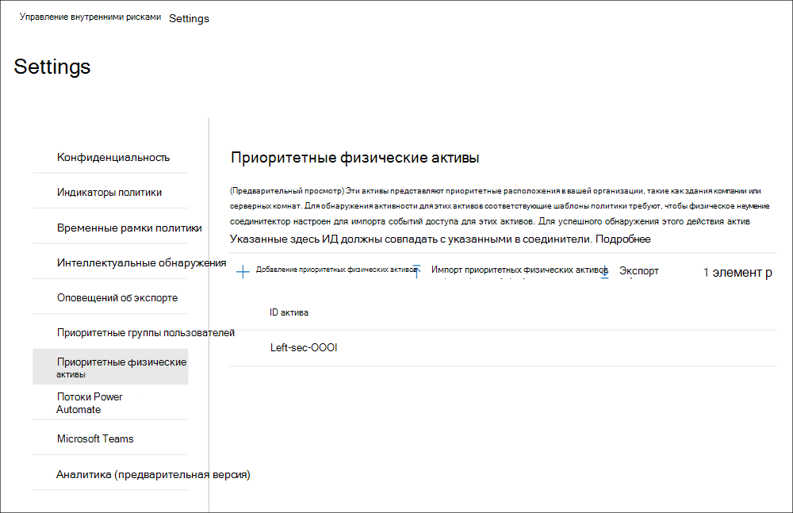

# Начало работы с настройками управления рисками изнутриGet started with insider risk management settings

Параметры управления рисками для инсайдеров применяются к всем политикам управления рисками, независимо от шаблона, который вы выбираете при создании политики.Insider risk management settings apply to all insider risk management policies, regardless of the template you choose when creating a policy. Параметры настраиваются с помощью элемента управления **параметрами внутреннего риска**, расположенного в верхней части всех вкладок управления внутренними рисками.Settings are configured using the **Insider risk settings** control located at the top of all insider risk management tabs. Эти параметры контролируют компоненты политики для следующих областей:These settings control policy components for the following areas:

- КонфиденциальностьPrivacy
- ИндикаторыIndicators
- Сроки политикиPolicy timelines
- Интеллектуальные обнаруженияIntelligent detections
- Экспорт оповещений (предварительный просмотр)Export alerts (preview)
- Приоритетные группы пользователей (предварительный просмотр)Priority user groups (preview)
- Приоритетные физические активы (предварительный просмотр)Priority physical assets (preview)
- Power Automate потоков (предварительный просмотр)Power Automate flows (preview)
- Microsoft Teams (предварительный просмотр)Microsoft Teams (preview)
- Аналитика (предварительная версия)Analytics (preview)

Перед началом работы и создания инсайдерской политики управления рисками важно понять эти параметры и выбрать оптимальные уровни для соответствия требованиям для организации.Before you get started and create insider risk management policies, it's important to understand these settings and choose setting levels best for the compliance needs for your organization.

## КонфиденциальностьPrivacy

Защита конфиденциальности пользователей, которые имеют совпадения с политикой, важна и может помочь повысить объектность при исследовании данных и анализе данных для оповещений о внутренних рисках.Protecting the privacy of users that have policy matches is important and can help promote objectivity in data investigation and analysis reviews for insider risk alerts. Для пользователей с инсайдерской политикой риска можно выбрать один из следующих параметров:For users with an insider risk policy match, you can choose one of the following settings:

- **Показать анонимные** версии имен пользователей. Имена пользователей анонимизируются, чтобы администраторы, исследователи данных и рецензенты не видели, кто связан с оповещениями политики.**Show anonymized versions of usernames**: Names of users are anonymized to prevent admins, data investigators, and reviewers from seeing who is associated with policy alerts. Например, пользователь "Екатерина Тимина" будет отображаться со случайным псевдонимом, таким как "Анон8-988", во всех областях управления внутренними рисками.For example, a user 'Grace Taylor' would appear with a randomized pseudonym such as 'AnonIS8-988' in all areas of the insider risk management experience. При выборе этого параметра все пользователи с текущими и прошлыми совпадениями политик будут анонимизированы и применяются ко всем политикам.Choosing this setting anonymizes all users with current and past policy matches and applies to all policies. Сведения о профиле пользователя в оповещении о рисках, а также сведения о случаях, которые будут доступны после выбора этого параметра.User profile information in the insider risk alert and case details will not be available when this option is chosen. Однако имена пользователей отображаются при добавлении новых пользователей к существующим политикам или при назначении пользователей новым политикам.However, usernames are displayed when adding new users to existing policies or when assigning users to new policies. Если вы решите отключить этот параметр, имена пользователей будут отображаться для всех пользователей, которые имеют текущие или прошлые совпадения политик.If you choose to turn off this setting, usernames will be displayed for all users that have current or past policy matches.
- **Не показывать анонимные версии** имен пользователей: имена пользователей отображаются для всех текущих и прошлых совпадений политик для оповещений и случаев.**Do not show anonymized versions of usernames**: Usernames are displayed for all current and past policy matches for alerts and cases. Сведения о профиле пользователя (имя, название, псевдоним и организация или отдел) отображаются для пользователя для всех оповещений и случаев управления рисками изнутри.User profile information (the name, title, alias, and organization or department) is displayed for the user for all insider risk management alerts and cases.

## ИндикаторыIndicators

Шаблоны политики инсайдерской политики риска определяют тип действий риска, которые необходимо обнаружить и изучить.Insider risk policy templates define the type of risk activities that you want to detect and investigate. Каждый шаблон политики основан на определенных индикаторах, соответствующих определенным триггерам и рискам.Each policy template is based on specific indicators that correspond to specific triggers and risk activities. Все индикаторы отключены по умолчанию, и перед настройкой политики управления рисками необходимо выбрать один или несколько индикаторов политики.All indicators are disabled by default, and you must select one or more policy indicators before configuring an insider risk management policy.

Оповещения запускаются политиками при выполнении пользователями действий, связанных с показателями политики, которые соответствуют необходимому порогу.Alerts are triggered by policies when users perform activities related to policy indicators that meet a required threshold. Управление рисками в инсайдерской области использует два типа показателей:Insider risk management uses two types of indicators:

- **События запуска:** события, определяющие, активен ли пользователь в политике управления рисками.**Triggering events**: Events that determine if a user is active in an insider risk management policy. Если пользователь добавлен в внутреннюю политику управления рисками, не имеет события-триггера, его активность не оценивается политикой.If a user is added to an insider risk management policy does not have a triggering event, the user activity is not evaluated by the policy. Например, пользователь A добавляется в политику, созданную из кражи данных, путем отошедания шаблона политики пользователей и правильной настройки Microsoft 365 и соединителя кадров. For example, User A is added to a policy created from the *Data theft by departing users* policy template and the policy and Microsoft 365 HR connector are properly configured. До тех пор, пока у пользователя A не будет даты прекращения, о которых сообщается в отделе кадров, действия пользователя A не будут оцениваться этой инсайдерской политикой управления рисками на риск.Until User A has a termination date reported by the HR connector, User A activities aren't evaluated by this insider risk management policy for risk. Другой пример события запуска — если у  пользователя есть оповещение о политике DLP с высокой степенью серьезности при использовании политик *утечки* данных.Another example of a triggering event is if a user has a *High* severity DLP policy alert when using *Data leaks* policies.
- **Индикаторы политики.** Индикаторы, включенные в инсайдерскую политику управления рисками, используемые для определения оценки риска для пользователя в области.**Policy indicators**: Indicators included in insider risk management policies used to determine a risk score for an in-scope user. Эти индикаторы политики активируются только после запуска события для пользователя.These policy indicators are only activated after a triggering event occurs for a user. Некоторые примеры показателей политики — это когда пользователь копирует данные в личные облачные службы хранения или портативные устройства хранения, если учетная запись пользователя удаляется из Azure Active Directory или если пользователь делится внутренними файлами и папок с несанкционированными внешними сторонами.Some examples of policy indicators are when a user copies data to personal cloud storage services or portable storage devices, if a user account is removed from Azure Active Directory, or if a user shares internal files and folders with unauthorized external parties.

Индикаторы политики сегментироваться в следующих областях.Policy indicators are segmented into the following areas. Вы можете выбрать индикаторы для активации и настройки ограничений событий индикатора для каждого уровня индикатора при создании политики риска для инсайдеров:You can choose the indicators to activate and customize indicator event limits for each indicator level when creating an insider risk policy:

- **Office.** К ним относятся индикаторы политики для SharePoint сайтов, Microsoft Teams и обмена сообщениями электронной почты.**Office indicators**: These include policy indicators for SharePoint sites, Microsoft Teams, and email messaging.
- **Индикаторы устройства.** К ним относятся индикаторы политики для действий, таких как общий доступ к файлам по сети или с устройствами.**Device indicators**: These include policy indicators for activity such as sharing files over the network or with devices. Индикаторы включают действия, связанные со всеми типами файлов, за исключением исполняемой (.exe) и динамической библиотеки ссылок (.dll) файловой активности.Indicators include activities involving all file types, excluding executable (.exe) and dynamic link library (.dll) file activity. Если вы выбираете индикаторы **Device,** активность обрабатывается только для устройств с Windows 10 сборки 1809 или выше, и сначала необходимо в центр соответствия требованиям.If you select **Device indicators**, activity is processed only for devices with Windows 10 Build 1809 or higher and you must first onboard devices to the compliance center. Дополнительные сведения о настройке устройств для интеграции с инсайдерской опасностью см. в следующем разделе [Включить](insider-risk-management-settings.md#OnboardDevices) индикаторы устройств и бортовых устройств в этой статье.For more information on configuring devices for integration with insider risk, see the following [Enable device indicators and onboard devices](insider-risk-management-settings.md#OnboardDevices) section in this article.
- Индикатор нарушений политики безопасности **(предварительный просмотр).** К ним относятся индикаторы из Microsoft Defender для конечной точки, связанные с неодобрением или установкой вредоносного программного обеспечения или обходом элементов управления безопасностью.**Security policy violation indicator (preview)**: These include indicators from Microsoft Defender for Endpoint related to unapproved or malicious software installation or bypassing security controls. Для получения оповещений в управлении рисками в инсайдерской области необходимо включить активную лицензию Defender для конечной точки и включить интеграцию с рисками изнутри.To receive alerts in insider risk management, you must have an active Defender for Endpoint license and insider risk integration enabled. Дополнительные сведения о настройке Defender для конечной точки для интеграции с управлением рисками для инсайдеров см. в дополнительных сведениях о настройке расширенных функций [в Microsoft Defender для конечной точки.](/windows/security/threat-protection/microsoft-defender-atp/advanced-features\#share-endpoint-alerts-with-microsoft-compliance-center)For more information on configuring Defender for Endpoint for insider risk management integration, see [Configure advanced features in Microsoft Defender for Endpoint](/windows/security/threat-protection/microsoft-defender-atp/advanced-features\#share-endpoint-alerts-with-microsoft-compliance-center).
- **Физические индикаторы доступа (предварительный просмотр).** К ним относятся индикаторы политики для физического доступа к конфиденциальным активам.**Physical access indicators (preview)**: These include policy indicators for physical access to sensitive assets. Например, попытка доступа к ограниченной области в журналах систем физического неугодного доступа может быть разделена с политиками управления рисками изнутри.For example, attempted access to a restricted area in your physical badging system logs can be shared with insider risk management policies. Для получения этих типов оповещений в управлении рисками в инсайдерской системе  управления рисками необходимо включить приоритетные физические активы в управлении рисками и настраиваемом соединители данных физической ненадежности.To receive these types of alerts in insider risk management, you must have priority physical assets enabled in insider risk management and the [Physical badging data connector](import-physical-badging-data.md) configured. Дополнительные информацию о настройке физического доступа см. в разделе [Приоритет](#priority-physical-assets-preview) физического доступа в этой статье.To learn more about configuring physical access, see the [Priority physical access section](#priority-physical-assets-preview) in this article.
- **Microsoft Cloud App Security (предварительный просмотр):** К ним относятся индикаторы политики из общих оповещений из Cloud App Security.**Microsoft Cloud App Security indicators (preview)**: These include policy indicators from shared alerts from Cloud App Security. Автоматически включенное обнаружение аномалий в Cloud App Security немедленно начинает обнаруживать и соединяя результаты, нацелившись на многочисленные поведенческие аномалии между пользователями и машинами и устройствами, подключенными к сети.Automatically enabled anomaly detection in Cloud App Security immediately starts detecting and collating results, targeting numerous behavioral anomalies across your users and the machines and devices connected to your network. Чтобы включить эти действия в оповещений о политике управления рисками, выберите один или несколько индикаторов в этом разделе.To include these activities in insider risk management policy alerts, select one or more indicators in this section. Дополнительные данные о Cloud App Security аналитике и обнаружении аномалий см. в обзоре [Get Behavioural analytics and anomaly detection.](/cloud-app-security/anomaly-detection-policy)To learn more about Cloud App Security analytics and anomaly detection, see [Get behavioral analytics and anomaly detection](/cloud-app-security/anomaly-detection-policy).
- **Ускорители оценки риска.** Они включают повышение оценки риска для необычных действий или прошлых нарушений политики.**Risk score boosters**: These include raising the risk score for unusual activities or past policy violations. Включение ускорителей оценки риска повышает оценку риска и вероятность оповещения для этих типов действий.Enabling risk score boosters increases risk scores and the likelihood of alerts for these types of activities. Для необычных действий баллы повышаются, если обнаруженная активность отклоняется от типичного поведения пользователя.For unusual activities, scores are boosted if the detected activity deviates from the user's typical behavior. Например, значительное увеличение ежедневных скачиваемых файлов.For example, a significant increase in daily file downloads. Необычная активность представлена как увеличение процента (например, "на 100% выше обычной активности") и повлияет на оценку риска по-разному в зависимости от активности.Unusual activity is presented as an increase in percentage (for example, '100% above usual activity') and will impact the risk score differently depending on the activity. Для пользователей с предыдущими нарушениями политики оценки повышаются, если ранее у пользователя было несколько ранее разрешенных в качестве подтвержденных нарушений политики.For users with previous policy violations, scores are boosted if a user had more than one case previously resolved as a confirmed policy violation. Ускорители оценки риска можно выбрать только в том случае, если выбран один или несколько индикаторов.Risk score boosters can only be selected if one or more indicators are selected.

В некоторых случаях может потребоваться ограничить показатели политики инсайдерской политики риска, применяемые к политикам инсайдерского риска в вашей организации.In some cases, you may want to limit the insider risk policy indicators that are applied to insider risk policies in your organization. Вы можете отключить индикаторы политики для определенных областей, отключив их от всех политик риска, связанных с инсайдерской политикой.You can turn off the policy indicators for specific areas by disabling them from all insider risk policies. События запуска не могут быть изменены для шаблонов политики инсайдерской политики риска.Triggering events cannot be modified for insider risk policy templates.

Чтобы определить индикаторы политики риска, включенные во всех инсайдерской политике риска, перейдите к параметрам параметров риска **insider** и выберите один или несколько индикаторов  >   политики.To define the insider risk policy indicators that are enabled in all insider risk policies, navigate to **Insider risk settings** > **Indicators** and select one or more policy indicators. Индикаторы, выбранные на странице Параметры индикаторов, не могут быть индивидуально настроены при создании или редактировании политики риска инсайдеров в мастере политики.The indicators selected on the Indicators settings page cannot be individually configured when creating or editing an insider risk policy in the policy wizard.

>[!NOTE]
>Может потребоваться несколько часов, чтобы новые пользователи, добавленные вручную, появились на панели **мониторинга пользователей.**It may take several hours for new manually-added users to appear in the **Users dashboard**. Отображение действий этих пользователей за предыдущие 90 дней может занять до 24 часов.Activities for the previous 90 days for these users may take up to 24 hours to display. Чтобы просмотреть действия для пользователей, добавленных  вручную, выберите пользователя на панели мониторинга пользователей и откройте вкладку **Действия** пользователя на области сведений.To view activities for manually added users, select the user on the **Users dashboard** and open the **User activity** tab on the details pane.

### Включить индикаторы устройств и бортовых устройствEnable device indicators and onboard devices

Чтобы включить мониторинг действий с риском на устройствах и включить индикаторы политики для этих действий, устройства должны соответствовать следующим требованиям, и необходимо выполнить следующие действия.To enable the monitoring of risk activities on devices and include policy indicators for these activities, your devices must meet the following requirements and you must complete the following onboarding steps.

#### Шаг 1. Подготовка конечных точекStep 1: Prepare your endpoints

Убедитесь, что Windows 10, которые вы планируете сообщать в инсайдерской области управления рисками, соответствуют этим требованиям.Make sure that the Windows 10 devices that you plan on reporting in insider risk management meet these requirements.

1. Должно быть запущено Windows 10 x64 сборки 1809 или более поздней версии и должно быть установлено обновление Windows 10 [(OS Build 17763.1075)](https://support.microsoft.com/help/4537818/windows-10-update-kb4537818) с 20 февраля 2020 г.Must be running Windows 10 x64 build 1809 or later and must have installed the [Windows 10 update (OS Build 17763.1075)](https://support.microsoft.com/help/4537818/windows-10-update-kb4537818) from February 20, 2020.
2. Учетная запись пользователя, используемая для входа в Windows 10, должна быть учетной записью Azure Active Directory (AAD).The user account used to log into the Windows 10 device must be an active Azure Active Directory (AAD) account. Устройство Windows 10 [AAD, гибридная](/azure/active-directory/devices/concept-azure-ad-join)AAD или Active Directory, зарегистрированная AAD.The Windows 10 device may be [AAD](/azure/active-directory/devices/concept-azure-ad-join), hybrid AAD, or Active Directory joined, or AAD registered.
3. Установите браузер Microsoft Chromium Edge на конечном устройстве, чтобы отслеживать действия для облачной загрузки.Install Microsoft Chromium Edge browser on the endpoint device to monitor actions for the cloud upload activity. См. статью [Загрузка нового браузера Microsoft Edge на основе Chromium](https://support.microsoft.com/help/4501095/download-the-new-microsoft-edge-based-on-chromium).See, [Download the new Microsoft Edge based on Chromium](https://support.microsoft.com/help/4501095/download-the-new-microsoft-edge-based-on-chromium).

#### Шаг 2. Бортовые устройстваStep 2: Onboarding devices

Необходимо включить мониторинг устройств и на борту конечных точек, прежде чем отслеживать действия по управлению рисками на устройстве.You must enable device monitoring and onboard your endpoints before you can monitor for insider risk management activities on a device. Оба действия принимаются на портале Microsoft 365 соответствия требованиям.Both actions are taken in the Microsoft 365 Compliance portal.

При необходимости на бортовых устройствах, которые еще не были на борту, загрузите соответствующий скрипт и развернете его, как описано в следующих действиях.When you want to onboard devices that haven't been onboarded yet, you'll download the appropriate script and deploy as outlined in the following steps.

Если у вас уже есть устройства, подключенные к [Microsoft Defender для конечной точки](/windows/security/threat-protection/), они будут отображаться в списке управляемых устройств.If you already have devices onboarded into [Microsoft Defender for Endpoint](/windows/security/threat-protection/), they will already appear in the managed devices list. Следуйте [шагу 3. Если](insider-risk-management-settings.md#OnboardStep3) в Microsoft Defender для конечной точки в следующем разделе имеются устройства.Follow [Step 3: If you have devices onboarded into Microsoft Defender for Endpoint](insider-risk-management-settings.md#OnboardStep3) in the next section.

В этом сценарии развертывания вы будете на борту устройств, которые еще не были на борту, и вы просто хотите отслеживать действия инсайдерского риска на Windows 10 устройствах.In this deployment scenario, you'll onboard devices that have not been onboarded yet, and you just want to monitor insider risk activities on Windows 10 devices.

1. Откройте [Центр соответствия требованиям Microsoft](https://compliance.microsoft.com).Open the [Microsoft compliance center](https://compliance.microsoft.com).
2. Откройте параметры Центра соответствия требованиям и выберите **Подключение устройств**.Open the Compliance Center settings page and choose **Onboard devices**.

   > [!NOTE]
   > Обычно подключение устройств занимает около 60 секунд, подождите около 30 минут, прежде чем обращаться в службу поддержки Microsoft.While it usually takes about 60 seconds for device onboarding to be enabled, please allow up to 30 minutes before engaging with Microsoft support.

3. Выберите **Управление устройствами**, чтобы открыть список **Устройства**Choose **Device management** to open the **Devices** list. Список будет пустым, пока устройства не будут подключены.The list will be empty until you onboard devices.
4. Нажмите **Подключение**, чтобы начать процесс.Choose **Onboarding** to begin the onboarding process.
5. Выберите способ развертывания на эти устройства из  списка методов развертывания и **скачайте пакет**.Choose the way you want to deploy to these more devices from the **Deployment method** list and then **download package**.
6. Выполните действия, описанные в разделе [Средства и методы подключения ATP Microsoft Defender для компьютеров с Windows 10](/windows/security/threat-protection/microsoft-defender-atp/configure-endpoints).Follow the appropriate procedures in [Onboarding tools and methods for Windows 10 machines](/windows/security/threat-protection/microsoft-defender-atp/configure-endpoints). Эта ссылка открывает начальную страницу доступа к процедурам Microsoft Defender для конечной точки, соответствующим пакету развертывания, который вы выбрали на этапе 5:This link takes you to a landing page where you can access Microsoft Defender for Endpoint procedures that match the deployment package you selected in step 5:
    - Подключение компьютеров с Windows 10 с помощью групповой политикиOnboard Windows 10 machines using Group Policy
    - Подключение компьютеров с Windows с помощью Microsoft Endpoint Configuration ManagerOnboard Windows machines using Microsoft Endpoint Configuration Manager
    - Подключение компьютеров с Windows 10 с помощью инструментов управления мобильными устройствамиOnboard Windows 10 machines using Mobile Device Management tools
    - Подключение компьютеров с Windows 10 с помощью локального сценарияOnboard Windows 10 machines using a local script
    - Подключение временных компьютеров инфраструктуры виртуальных рабочих столов (VDI).Onboard non-persistent virtual desktop infrastructure (VDI) machines.

После этого и конечной точки он должен быть виден в списке устройств, а конечная точка начнет сообщать журналы аудита для управления рисками инсайдеров.Once done and endpoint is onboarded, it should be visible in the devices list and the endpoint will start reporting audit activity logs to insider risk management.

> [!NOTE]
> Эта возможность включает принудительное применение лицензий.This experience is under license enforcement. Без необходимой лицензии данные не будут видимы или доступны.Without the required license, data will not be visible or accessible.

#### Шаг 3. Если в Microsoft Defender для конечной точки есть устройстваStep 3: If you have devices onboarded into Microsoft Defender for Endpoint

Если Microsoft Defender для конечной точки уже развернут и в них есть конечные точки, все эти конечные точки будут отображаться в списке управляемых устройств.If Microsoft Defender for Endpoint is already deployed and there are endpoints reporting in, all these endpoints will appear in the managed devices list. Вы можете продолжать использовать новые устройства для управления рисками, чтобы расширить охват с помощью раздела [Step 2: Onboarding devices.](insider-risk-management-settings.md#OnboardStep2)You can continue to onboard new devices into insider risk management to expand coverage by using the [Step 2: Onboarding devices](insider-risk-management-settings.md#OnboardStep2) section.

1. Откройте [Центр соответствия требованиям Microsoft](https://compliance.microsoft.com).Open the [Microsoft compliance center](https://compliance.microsoft.com).
2. Откройте параметры Центра соответствия требованиям и выберите **Включить отслеживание устройств**.Open the Compliance Center settings page and choose **Enable device monitoring**.
3. Выберите **Управление устройствами**, чтобы открыть список **Устройства**Choose **Device management** to open the **Devices** list. Вы должны увидеть список устройств, которые уже сообщаются в Microsoft Defender для конечной точки.You should see the list of devices that are already reporting into Microsoft Defender for Endpoint.
4. Выберите **onboarding,** если вам нужно на борту больше устройств.Choose **Onboarding** if you need to onboard more devices.
5. Выберите способ развертывания на этих устройствах  из списка методов развертывания, а затем **пакет загрузки.**Choose the way you want to deploy to these more devices from the **Deployment method** list and then **Download package**.
6. Выполните действия, описанные в разделе [Средства и методы подключения ATP Microsoft Defender для компьютеров с Windows 10](/windows/security/threat-protection/microsoft-defender-atp/configure-endpoints).Follow the appropriate procedures in [Onboarding tools and methods for Windows 10 machines](/windows/security/threat-protection/microsoft-defender-atp/configure-endpoints). Эта ссылка открывает начальную страницу доступа к процедурам Microsoft Defender для конечной точки, соответствующим пакету развертывания, который вы выбрали на этапе 5:This link takes you to a landing page where you can access Microsoft Defender for Endpoint procedures that match the deployment package you selected in step 5:
    - Подключение компьютеров с Windows 10 с помощью групповой политикиOnboard Windows 10 machines using Group Policy
    - Подключение компьютеров с Windows с помощью Microsoft Endpoint Configuration ManagerOnboard Windows machines using Microsoft Endpoint Configuration Manager
    - Подключение компьютеров с Windows 10 с помощью инструментов управления мобильными устройствамиOnboard Windows 10 machines using Mobile Device Management tools
    - Подключение компьютеров с Windows 10 с помощью локального сценарияOnboard Windows 10 machines using a local script
    - Подключение временных компьютеров инфраструктуры виртуальных рабочих столов (VDI).Onboard non-persistent virtual desktop infrastructure (VDI) machines.

После этого и конечной точки, она должна быть видна под таблицей **Устройства** и конечная точка начнет сообщать журналы аудита деятельности для управления рисками инсайдерской.Once done and endpoint is onboarded, it should be visible under the **Devices** table and the endpoint will start reporting audit activity logs to insider risk management.

> [!NOTE]
>Эта возможность включает принудительное применение лицензий.This experience is under license enforcement. Без необходимой лицензии данные не будут видимы или доступны.Without the required license, data will not be visible or accessible.

### Параметры уровня индикатора (предварительный просмотр)Indicator level settings (preview)

При создании политики в мастере политики можно настроить, как ежедневное число событий риска должно влиять на оценку риска для оповещений об инсайдерской опасности.When creating a policy in the policy wizard, you can configure how the daily number of risk events should influence the risk score for insider risk alerts. Эти параметры индикатора помогают контролировать, как количество событий риска в вашей организации должно влиять на оценку риска и, таким образом, связанную серьезность оповещения для этих событий.These indicator settings help you control how the number of occurrences of risk events in your organization should affect the risk score, and so the associated alert severity, for these events. Если вы хотите, вы также можете сохранить пороговые уровни событий по умолчанию, рекомендуемые Корпорацией Майкрософт для всех включенных индикаторов.If you prefer, you can also choose to keep the default event threshold levels recommended by Microsoft for all enabled indicators.

Например, вы решите включить индикаторы SharePoint в параметрах инсайдерской политики риска и установить настраиваемые пороговые значения для событий SharePoint  при настройке индикаторов для новой политики утечки данных о рисках.For example, you decide to enable SharePoint indicators in the insider risk policy settings and to set custom thresholds for SharePoint events when configuring indicators for a new insider risk *Data leaks* policy. В мастере политики инсайдерской политики риска вы настраиваете три различных ежедневных уровня событий для каждого индикатора SharePoint, чтобы повлиять на оценку риска для оповещений, связанных с этими событиями.While in the insider risk policy wizard, you configure three different daily event levels for each SharePoint indicator to influence the risk score for alerts associated with these events.

Для первого ежедневного уровня событий вы установите пороговое значение в *10* или более событий в день для более низкого влияния на оценку риска для событий, *20* или более событий в день для среднего влияния на оценку риска для событий и *30* или более событий в день, что более сильно влияет на оценку риска для событий.For the first daily event level, you set the threshold at *10 or more events per day* for a lower impact to the risk score for the events, *20 or more events per day* for a medium impact to the risk score for the events, and *30 or more events per day* a higher impact to the risk score for the events. Эти параметры фактически означают:These settings effectively mean:

- Если после запуска события SharePoint происходит 1-9 событий, оценки риска минимально влияют и не создают оповещений.If there are 1-9 SharePoint events that take place after triggering event, risk scores are minimally impacted and would tend not to generate an alert.
- При 10-19 SharePoint событий, которые происходят после запуска события, оценка риска по своей сути ниже, а уровни серьезности оповещения, как правило, находятся на низком уровне.If there are 10-19  SharePoint events that take place after a triggering event, the risk score is inherently lower and alert severity levels would tend to be at a low level.
- Если после запуска происходит 20-29 событий SharePoint, оценка риска по своей сути выше, а уровень серьезности оповещения, как правило, находится на среднем уровне.If there are 20-29 SharePoint events that take place after a triggering, the risk score is inherently higher and alert severity levels would tend to be at a medium level.
- Если после запуска происходит 30 или более SharePoint событий, оценка риска по своей сути выше, а уровень серьезности оповещения, как правило, находится на высоком уровне.If there are 30 or more SharePoint events that take place after a triggering, the risk score is inherently higher and alert severity levels would tend to be at a high level.

## Временные интервалы политикиPolicy timeframes

Временные интервалы политики позволяют определять прошлые и будущие периоды проверки, которые запускаются после совпадения политик на основе событий и действий для шаблонов политики управления внутренними рисками.Policy timeframes allow you to define past and future review periods that are triggered after policy matches based on events and activities for the insider risk management policy templates. В зависимости от шаблона политики доступны следующие временные рамки политики:Depending on the policy template you choose, the following policy timeframes are available:

- **Окно активации.** Доступно для всех  шаблонов политики, окно активации —  это определенное количество дней, которое окно активирует после события запуска.**Activation window**: Available for all policy templates, the *Activation window* is the defined number of days that the window activates **after** a triggering event. Окно активируется в течение 1-30 дней после запуска события для любого пользователя, назначенного политике.The window activates for 1 to 30 days after a triggering event occurs for any user assigned to the policy. Например, вы настроили внутреннюю политику управления рисками и установили окно *активации* до 30 дней.For example, you've configured an insider risk management policy and set the *Activation window* to 30 days. С момента настройки политики прошло несколько месяцев, и для одного из пользователей, включенных в политику, происходит событие запуска.Several months have passed since you configured the policy, and a triggering event occurs for one of the users included in the policy. Событие активации активирует окно *активации,* и политика активна для этого пользователя в течение 30 дней после запуска события.The triggering event activates the *Activation window* and the policy is active for that user for 30 days after the triggering event occurred.
- **Обнаружение прошлых** действий. Доступно для  всех шаблонов политики, обнаружение прошлых действий  — это определенное количество дней, активируемое окном перед событием запуска.**Past activity detection**: Available for all policy templates, the *Past activity detection* is the defined number of days that the window activates **before** a triggering event. Окно активируется за 0-180 дней до запуска события для любого пользователя, назначенного политике.The window activates for 0 to 180 days before a triggering event occurs for any user assigned to the policy. Например, вы настроили внутреннюю политику управления  рисками и установили время обнаружения прошлых действий до 90 дней.For example, you've configured an insider risk management policy and set the *Past activity detection* to 90 days. С момента настройки политики прошло несколько месяцев, и для одного из пользователей, включенных в политику, происходит событие запуска.Several months have passed since you configured the policy, and a triggering event occurs for one of the users included in the policy. Событие запуска активирует  обнаружение действий прошлое, а политика собирает исторические действия для этого пользователя за 90 дней до запуска события.The triggering event activates the *Past activity detection* and the policy gathers historic activities for that user for 90 days prior to the triggering event.

## Интеллектуальные обнаруженияIntelligent detections

Интеллектуальные параметры обнаружения помогают уточнить, как обрабатываются обнаружения рискованных действий для оповещений.Intelligent detection settings help refine how the detections of risky activities are processed for alerts. В определенных обстоятельствах может потребоваться определить типы файлов, которые следует игнорировать, или необходимо применить уровень обнаружения для файлов, чтобы определить минимальную планку оповещений.In certain circumstances, you may need to define file types to ignore, or you want to enforce a detection level for files to help define a minimum bar for alerts. Используйте эти параметры для управления общим объемом оповещений, исключениями типа файлов и ограничениями громкости файлов.Use these settings to control overall alert volume, file type exclusions, and file volume limits.

### Исключения типа файловFile type exclusions

Чтобы исключить конкретные типы файлов из всех политик управления рисками, связанных с инсайдерской политикой управления рисками, введите расширения типа файлов, разделенные запятой.To exclude specific file types from all insider risk management policy matching, enter file type extensions separated by commas. Например, чтобы исключить определенные типы музыкальных файлов из совпадений политики, можно ввести aac,mp3,wav,wma в поле **Исключения типов файлов**.For example, to exclude certain types of music files from policy matches you may enter aac,mp3,wav,wma in the **File type exclusions** field. Файлы с этими расширениями будут игнорироваться всеми политиками управления рисками изнутри.Files with these extensions will be ignored by all insider risk management policies.

### Порог для необычной активности файловThreshold for unusual file activity

Чтобы определить минимальный уровень файлов, прежде чем оповещений об активности будут отчитаться в политиках инсайдерского риска, введите количество файлов.To define a minimum file level before activity alerts are reported in insider risk policies, enter the number of files. Например, вы введите '10', если вы не хотите создавать оповещений о рисках, когда пользователь скачивает 10 файлов или меньше, даже если политики считают это действие необычным.For example, you would enter '10' if you do not want to generate insider risk alerts when a user downloads 10 files or less, even if the policies consider this activity as unusual.

### Объем оповещенийAlert volume

Действия пользователей, обнаруженные политиками инсайдерского риска, назначены определенной оценке риска, которая, в свою очередь, определяет степень серьезности оповещений (низкая, средняя, высокая).User activities detected by insider risk policies are assigned a specific risk score, which in turn determines the alert severity (low, medium, high). По умолчанию мы будем создавать определенное количество оповещений о низкой, средней и высокой степени тяжести, но вы можете увеличить или уменьшить объем в соответствии с вашими потребностями.By default, we'll generate a certain amount of low, medium, and high severity alerts, but you can increase or decrease the volume to suit your needs. Чтобы настроить объем оповещений для всех политик управления рисками, выберите один из следующих параметров:To adjust the volume of alerts for all insider risk management policies, choose one of the following settings:

- **Меньше оповещений.** Вы увидите все предупреждения высокой степени тяжести, меньше оповещений о средней серьезности и отсутствие предупреждений низкой степени тяжести.**Fewer alerts**: You'll see all high severity alerts, fewer medium severity alerts, and no low severity ones. Этот уровень параметров означает, что вы можете пропустить некоторые истинные положительные моменты.This setting level means you might miss some true positives.
- **Том по** умолчанию. Вы увидите все оповещения о высокой серьезности и сбалансированное количество оповещений средней и низкой степени тяжести.**Default volume**: You'll see all high severity alerts and a balanced amount of medium and low severity alerts.
- **Больше оповещений.** Вы увидите все предупреждения средней и высокой степени тяжести и большинство оповещений о низкой степени тяжести.**More alerts**: You'll see all medium and high severity alerts and most low severity alerts. Этот уровень параметров может привести к более ложным срабатывам.This setting level might result in more false positives.

### Защитник Майкрософт для конечной точки (предварительный просмотр)Microsoft Defender for Endpoint (preview)

[Microsoft Defender for Endpoint](/windows/security/threat-protection/microsoft-defender-atp/microsoft-defender-advanced-threat-protection) — это корпоративная платформа безопасности конечной точки, предназначенная для предотвращения, обнаружения, обнаружения, обнаружения и реагирования на расширенные угрозы.[Microsoft Defender for Endpoint](/windows/security/threat-protection/microsoft-defender-atp/microsoft-defender-advanced-threat-protection) is an enterprise endpoint security platform designed to help enterprise networks prevent, detect, investigate, and respond to advanced threats. Чтобы лучше фиксировать нарушения безопасности в организации, можно импортировать и фильтровать оповещения Defender для конечных точек для действий, используемых в политиках, созданных из шаблонов политики нарушений безопасности для управления рисками.To have better visibility of security violations in your organization, you can import and filter Defender for Endpoint alerts for activities used in policies created from insider risk management security violation policy templates.

В зависимости от типов сигналов, которые вас интересуют, вы можете импортировать оповещения в управление рисками на основе состояния оповещения Defender для конечных точек.Depending on the types of signals you are interested in, you can choose to import alerts to insider risk management based on the Defender for Endpoint alert triage status. В глобальных параметрах импорта можно определить один или несколько следующих статусов оповещения.You can define one or more of the following alert triage statuses in the global settings to import:

- UnknownUnknown
- НовоеNew
- В процессе выполненияIn progress
- УстраненоResolved

Оповещения из Defender для конечной точки импортируется ежедневно.Alerts from Defender for Endpoint are imported daily. В зависимости от выбираемого состояния триажа можно увидеть несколько действий пользователя для того же оповещения, что и изменения состояния триажа в Defender for Endpoint.Depending on the triage status you choose, you may see multiple user activities for the same alert as the triage status changes in Defender for Endpoint.

Например, если для этого параметра выбраны *New*, *In Progress* и *Resolved,* когда создается оповещение Microsoft Defender для конечных точек и состояние *New,* для пользователя, находящегося в инсайдерской опасности, импортируется начальное действие оповещения.For example, if you select *New*, *In progress*, and *Resolved* for this setting, when a Microsoft Defender for Endpoint alert is generated and the status is *New*, an initial alert activity is imported for the user in insider risk. Когда состояние триажа Defender для конечной точки изменяется в *"В* процессе", для пользователя с инсайдерской опасностью импортируется второе действие для этого оповещения.When the Defender for Endpoint triage status changes to *In progress*, a second activity for this alert is imported for the user in insider risk. При заданной окончательной оценке состояния "Защитник для конечной точки" для *Resolved* для пользователя, в случае риска инсайдера, импортируется третье действие для этого оповещений.When the final Defender for Endpoint triage status of *Resolved* is set, a third activity for this alert is imported for the user in insider risk. Эта функция позволяет следователям следить за прогрессией оповещений Defender для конечной точки и выбирать уровень видимости, который требуется для их исследования.This functionality allows investigators to follow the progression of the Defender for Endpoint alerts and choose the level of visibility that their investigation requires.

>[!IMPORTANT]
>Необходимо настроить Microsoft Defender для конечной точки в вашей организации и включить Defender для конечной точки для интеграции управления внутренними рисками в Центре безопасности Defender для импорта оповещений о нарушениях безопасности.You'll need to have Microsoft Defender for Endpoint configured in your organization and enable Defender for Endpoint for insider risk management integration in the Defender Security Center to import security violation alerts. Дополнительные сведения о настройке Defender для конечной точки для интеграции управления внутренними рисками см. в статье [Настройка расширенных функций в Defender для конечной точки](/windows/security/threat-protection/microsoft-defender-atp/advanced-features\#share-endpoint-alerts-with-microsoft-compliance-center).For more information on configuring Defender for Endpoint for insider risk management integration, see [Configure advanced features in Defender for Endpoint](/windows/security/threat-protection/microsoft-defender-atp/advanced-features\#share-endpoint-alerts-with-microsoft-compliance-center).

### Домены (предварительный просмотр)Domains (preview)

Параметры домена помогают определить уровни риска для действий для определенных доменов.Domain settings help you define risk levels for activities to specific domains. Эти действия включают обмен файлами, отправку сообщений электронной почты, загрузку или отправку контента.These activities include sharing files, sending email messages, downloading, or uploading content. Указав домены в этих параметрах, вы можете увеличить или уменьшить оценку риска для действий, которые проходят с этими доменами.By specifying domains in these settings, you can increase or decrease the risk scoring for activity that takes place with these domains.

Используйте домен Add для определения домена для каждого из параметров домена.Use Add domain to define a domain for each of the domain settings. Кроме того, вы можете использовать подгруппы для совпадения вариантов корневых доменов или поддоменов.Additionally, you can use wildcards to help match variations of root domains or subdomains. Например, чтобы указать sales.wingtiptoys.com и support.wingtiptoys.com, используется запись подгруппы "\*.wingtiptoys.com", чтобы соответствовать этим поддоменам (и любому другому поддомену на том же уровне).For example, to specify sales.wingtiptoys.com and support.wingtiptoys.com, you use the wildcard entry '\*.wingtiptoys.com' to match these subdomains (and any other subdomain at the same level). Чтобы указать многоуровневые поддомены для корневого домена, необходимо выбрать почтовый ящик **Include Multi-Level Subdomains.**To specify multi-level subdomains for a root domain, you must select the **Include Multi-Level Subdomains** checkbox.

Для каждого из следующих параметров домена можно ввести до 500 доменов:For each of the following domain settings, you can enter up to 500 domains:

- **Незаверяемые домены:** При указании неоконченных доменов активность, которая происходит с этими доменами, будет иметь *более высокие показатели* риска.**Unallowed domains:** By specifying unallowed domains, activity that takes place with these domains will have *higher* risk scores. В качестве некоторых примеров можно привести действия, связанные с обменом контентом с кем-либо (например, отправка электронной почты кому-либо с gmail.com адресом) и загрузкой контента на устройство с одного из этих неуправляемого домена.Some examples are activities involving sharing content with someone (such as sending email to someone with a gmail.com address) and when users download content to a device from one of these unallowed domains.
- **Разрешенные домены:** Некоторые действия, связанные с разрешенными доменами, будут игнорироваться политиками и не будут создавать оповещения.**Allowed domains:** Certain activity related to allowed domains will be ignored by your policies and won't generate alerts. Эти действия включают в себя:These activities include:

    - Электронная почта, отправленная на внешние доменыEmail sent to external domains
    - Файлы, папки, сайты, общие с внешними доменамиFiles, folders, sites shared with external domains
    - Файлы, загруженные на внешние домены (с Microsoft Edge браузера)Files uploaded to external domains (using Microsoft Edge browser)

    Указыв допустимые домены в параметрах, эта активность с этими доменами рассматривается так же, как и к внутреннему действию организации.By specifying allowed domains in settings, this activity with these domains is treated similarly to how internal organization activity is treated. Например, добавленные здесь домены могут включать обмен контентом с кем-либо за пределами организации (например, отправка электронной почты кому-либо с gmail.com адресом).For example, domains added here map to activities may involve sharing content with someone outside your organization (such as sending email to someone with a gmail.com address).

- **Сторонние домены:** Если ваша организация использует сторонние домены для бизнес-целей (например, облачное хранилище), включите их здесь, чтобы вы могли получать оповещения о действиях, связанных с индикатором *устройства,* Используйте браузер для скачивания контента с сторонних сайтов.**Third party domains:** If your organization uses third-party domains for business purposes (such as cloud storage), include them here so you can receive alerts for activity related to the device indicator *Use a browser to download content from a third-party site*.

## Экспорт оповещений (предварительный просмотр)Export alerts (preview)

Сведения об оповещении об управлении рисками можно экспортировать в службы управления безопасностью и событиями (SIEM) с [помощью схемы API](/office/office-365-management-api/office-365-management-activity-api-schema#security-and-compliance-alerts-schema)Office 365 управления деятельностью.Insider risk management alert information is exportable to security information and event management (SIEM) services via the [Office 365 Management Activity API schema](/office/office-365-management-api/office-365-management-activity-api-schema#security-and-compliance-alerts-schema). API Office 365 управления можно использовать для экспорта сведений об оповещении в другие приложения, которые организация может использовать для управления или сводки инсайдерской информации о рисках.You can use the Office 365 Management Activity APIs to export alert information to other applications your organization may use to manage or aggregate insider risk information.

Чтобы использовать API для просмотра сведений об оповещении о рисках изнутри:To use the APIs to review insider risk alert information:

1. Включить Office 365 API для управления деятельностью в **инсайдерской** службе управления рисками Параметры  >    >  **оповещений по экспорту.**Enable Office 365 Management Activity API support in **Insider risk management** > **Settings** > **Export alerts**. По умолчанию этот параметр отключен для Microsoft 365 организации.By default, this setting is disabled for your Microsoft 365 organization.
2. Фильтрация общих Office 365 аудита *службой SecurityComplianceAlerts.*Filter the common Office 365 audit activities by *SecurityComplianceAlerts*.
3. Фильтр *securityComplianceAlerts* по категории *InsiderRiskManagement.*Filter *SecurityComplianceAlerts* by the *InsiderRiskManagement* category.

Сведения оповещений содержат сведения из схемы оповещения о безопасности и соответствия требованиям и общей схемы API Office 365 управления деятельностью.Alert information contains information from the security and compliance alert schema and the Office 365 Management Activity API common schema.

Следующие поля и значения экспортируются для оповещений об управлении рисками для системы оповещения & соответствия требованиям:The following fields and values are exported for insider risk management alerts for the Security & Compliance alert schema:

| **Параметр Alert****Alert parameter** | **Описание****Description** |
|:------------------|:----------------|
| AlertTypeAlertType | Тип оповещений *настраивается.*Type of the alert is *Custom*.  |
| AlertIdAlertId | GUID оповещений.The GUID of the alert. Оповещений об управлении рисками изнутри можно мутить.Insider risk management alerts are mutable. По мере изменения состояния оповещений создается новый журнал с тем же alertID.As alert status changes, a new log with the same AlertID is generated. Этот alertID можно использовать для сопоставления обновлений для оповещения.This AlertID can be used to correlate updates for an alert. |
| CategoryCategory | Категория оповещений *— InsiderRiskManagement*.The category of the alert is *InsiderRiskManagement*. Эта категория может быть использована для отличия этих оповещений от других оповещений & соответствия требованиям.This category can be used to distinguish from these alerts from other Security & Compliance alerts. |
| КомментарииComments | Комментарии по умолчанию для оповещения.Default comments for the alert. Значения : *New Alert* (регистрируется при создания оповещений) и Alert *Updated* (в журнале при обновлении оповещений).Values are *New Alert* (logged when an alert is created) and *Alert Updated* (logged when there is an update to an alert). Используйте AlertID для сопоставления обновлений для оповещения.Use the AlertID to correlate updates for an alert. |
| ДанныеData | Данные оповещений включают уникальный пользовательский ID, имя пользователя и дату и время (UTC), когда пользователь был включен в политику.The data for the alert, includes the unique user ID, user principal name, and date and time (UTC) when user was triggered into a policy. |
| ИмяName | Имя политики для политики управления рисками, которая вызвала оповещение.Policy name for insider risk management policy that generated the alert. |
| PolicyIdPolicyId | GUID инсайдерской политики управления рисками, которая вызвала оповещение.The GUID of the insider risk management policy that triggered the alert. |
| СерьезностьSeverity | Серьезность оповещения.The severity of the alert. Значения : *High,* *Medium* или *Low*.Values are *High*, *Medium*, or *Low*. |
| ИсточникSource | Источник оповещения.The source of the alert. Это значение Office 365 *безопасности & соответствия* требованиям.The value is *Office 365 Security & Compliance*. |
| СостояниеStatus | Состояние оповещений.The status of the alert. Значения *active* *(needs Review* in insider risk), *Investigating* (Confirmed in insider risk),*Resolved (Resolved* in insider risk), *Dismissed*  *(Dismissed* in insider risk). Values are *Active* (*Needs Review* in insider risk), *Investigating* (*Confirmed* in insider risk), *Resolved* (*Resolved* in insider risk), *Dismissed* (*Dismissed* in insider risk). |
| ВерсияVersion | Версия схемы оповещения о безопасности и соблюдении требований.The version of the security and compliance alert schema. |

Следующие поля и значения экспортируются для оповещений об управлении рисками для общей схемы Office 365 управления [API.](/office/office-365-management-api/office-365-management-activity-api-schema#common-schema)The following fields and values are exported for insider risk management alerts for the [Office 365 Management Activity API common schema](/office/office-365-management-api/office-365-management-activity-api-schema#common-schema).

- UserIdUserId
- IdId
- RecordTypeRecordType
- CreationTimeCreationTime
- ОперацияOperation
- OrganizationIdOrganizationId
- UserTypeUserType
- UserKeyUserKey

## Приоритетные группы пользователей (предварительный просмотр)Priority user groups (preview)

Пользователи в вашей организации могут иметь различные уровни риска в зависимости от их положения, уровня доступа к конфиденциальной информации или истории рисков.Users in your organization may have different levels of risk depending on their position, level of access to sensitive information, or risk history. Приоритизация изучения и оценки действий этих пользователей поможет предупредить вас о потенциальных рисках, которые могут иметь более серьезные последствия для организации.Prioritizing the examination and scoring of the activities of these users can help alert you to potential risks that may have higher consequences for your organization. Приоритетные группы пользователей в инсайдерской группе управления рисками помогают определять пользователей в организации, которые нуждаются в более тщательном рассмотрении и более чувствительном подсчете рисков.Priority user groups in insider risk management help define the users in your organization that need closer inspection and more sensitive risk scoring. В сочетании  с нарушениями политики безопасности  приоритетными пользователями и утечками данных по шаблонам политики приоритетных пользователей пользователи, добавленные в группу пользователей с приоритетом, имеют повышенную вероятность оповещений и оповещений о рисках с более высокой степенью серьезности.Coupled with the *Security policy violations by priority users* and *Data leaks by priority users* policy templates, users added to a priority user group have an increased likelihood of insider risk alerts and alerts with higher severity levels.

Например, необходимо защититься от утечек данных для очень конфиденциального проекта, в котором пользователи имеют доступ к конфиденциальной информации.For example, you need to protect against data leaks for a highly confidential project where users have access to sensitive information. Вы решите создать *группу пользователей конфиденциальной Project* *пользователей* для пользователей в организации, которые работают над этим проектом.You choose to create *Confidential Project* *Users* priority user group for users in your organization that work on this project. С помощью мастера  политики и утечек данных по шаблону политики приоритетных пользователей создается новая политика и назначается группа приоритетов Project пользователей политики. Using the policy wizard and the *Data leaks by priority users* policy template, you create a new policy and assign the *Confidential Project Users* priority users group to the policy. Действия, рассмотренные политикой для членов приоритетной группы *пользователей Project Пользователей,* более чувствительны к рискам, и действия этих пользователей с большей вероятностью будут генерировать оповещение и иметь оповещения с более высоким уровнем серьезности.Activities examined by the policy for members of the *Confidential Project Users* priority user group are more sensitive to risk and activities by these users will be more likely to generate an alert and have alerts with higher severity levels.

### Создание приоритетной группы пользователейCreate a priority user group

Чтобы создать новую группу пользователей с приоритетом, вы будете использовать элементы управления настройками в решении по управлению рисками **insider** в центре Microsoft 365 соответствия требованиям.To create a new priority user group, you'll use setting controls in the **Insider risk management** solution in the Microsoft 365 compliance center. Чтобы создать группу пользователей с приоритетом, необходимо быть членом группы по управлению рисками *insider* или *Insider Risk Management Admin* role group.To create a priority user group, you must be a member of the *Insider Risk Management* or *Insider Risk Management Admin* role group.

Выполните следующие действия для создания приоритетной группы пользователей:Complete the following steps to create a priority user group:

1. В центре [Microsoft 365 соответствия](https://compliance.microsoft.com)требованиям перейдите к управлению рисками **insider** и выберите **параметры риска insider.**In the [Microsoft 365 compliance center](https://compliance.microsoft.com), go to **Insider risk management** and select **Insider risk settings**.
2. Выберите **вкладку Группы пользователей Priority**Select the **Priority user groups** tab
3. На **вкладке Приоритетные группы пользователей** выберите **Создать приоритетную** группу пользователей, чтобы запустить мастер создания группы.On the **Priority user groups** tab, select **Create priority user group** to start the group creation wizard.
4. На странице **Определить группу** выполните следующие поля:On the **Define group** page, complete the following fields:
    - **Имя (обязательно).** Введите удобное имя для приоритетной группы пользователей.**Name (required)**: Enter a friendly name for the priority user group. Вы не можете изменить имя приоритетной группы пользователей после завершения мастера.You can't change the name of the priority user group after you complete the wizard.
    - **Описание (необязательный).** Введите описание для приоритетной группы пользователей.**Description (optional)**: Enter a description for the priority user group.
5. Нажмите кнопку **Далее**, чтобы продолжить.Select **Next** to continue.
6. На странице **Выбор** участников  выберите выберите членов для поиска и выбора учетных записей пользователей  с поддержкой почты, включенных в группу, или выберите список Выберите все почтовые ящики, чтобы добавить всех пользователей в организации в группу.On the **Choose members** page, select **Choose members** to search and select which mail-enabled user accounts are included in the group or select the **Select all** checkbox to add all users in your organization to the group. Выберите **Добавить** для продолжения или **отмены** закрытия без добавления пользователей в группу.Select **Add** to continue or **Cancel** to close without adding any users to the group.
7. Нажмите кнопку **Далее**, чтобы продолжить.Select **Next** to continue.
8. На странице **Обзор** просмотрите параметры, выбранные для приоритетной группы пользователей.On the **Review** page, review the settings you've chosen for the priority user group. Выберите **Изменение** для изменения любых групповых значений или выберите **Отправка** для создания и активации приоритетной группы пользователей.Select **Edit** to change any of the group values or select **Submit** to create and activate the priority user group.
9. На странице подтверждения выберите **Сделано,** чтобы выйти из мастера.On the confirmation page, select **Done** to exit the wizard.

### Обновление приоритетной группы пользователейUpdate a priority user group

Чтобы обновить существующую группу пользователей с приоритетом, вы будете использовать элементы управления настройками в решении по управлению рисками **insider** в центре Microsoft 365 соответствия требованиям.To update an existing priority user group, you'll use setting controls in the **Insider risk management** solution in the Microsoft 365 compliance center. Чтобы обновить приоритетную группу пользователей, необходимо быть членом группы управления рисками *insider* или *insider Risk Management Admin* role group.To update a priority user group, you must be a member of the *Insider Risk Management* or *Insider Risk Management Admin* role group.

Выполните следующие действия по редактированию приоритетной группы пользователей:Complete the following steps to edit a priority user group:

1. В центре [Microsoft 365 соответствия](https://compliance.microsoft.com)требованиям перейдите к управлению рисками **insider** и выберите **параметры риска insider.**In the [Microsoft 365 compliance center](https://compliance.microsoft.com), go to **Insider risk management** and select **Insider risk settings**.
2. Выберите **вкладку Группы пользователей Priority**Select the **Priority user groups** tab
3. Выберите группу приоритетных пользователей, которые необходимо изменить, и выберите **группу Редактирование.**Select the priority user group you want to edit and select **Edit group**.
4. На странице **Определить группу** обнови поле Описание при необходимости.On the **Define group** page, update the Description field if needed. Вы не можете обновить имя приоритетной группы пользователей.You can't update the name of the priority user group. Нажмите кнопку **Далее**, чтобы продолжить.Select **Next** to continue.
5. На странице **Выбор участников** добавьте новых членов в группу с помощью управления **"Выберите** членов".On the **Choose members** page, add new members to the group using the **Choose members** control. Чтобы удалить пользователя из группы, выберите "X" рядом с пользователем, который вы хотите удалить.To remove a user from the group, select the 'X' next to the user you wish to remove. Нажмите кнопку **Далее**, чтобы продолжить.Select **Next** to continue.
6. На странице **Обзор** просмотрите параметры обновления, выбранные для приоритетной группы пользователей.On the **Review** page, review the update settings you've chosen for the priority user group. Выберите **Изменить,** чтобы изменить любое из групповых значений или выбрать **Отправка** для обновления приоритетной группы пользователей.Select **Edit** to change any of the group values or select **Submit** to update the priority user group.
7. На странице подтверждения выберите **Сделано,** чтобы выйти из мастера.On the confirmation page, select **Done** to exit the wizard.

### Удаление приоритетной группы пользователейDelete a priority user group

Чтобы удалить существующую группу пользователей с приоритетом, вы будете использовать элементы управления настройками в решении по управлению рисками **insider** в центре Microsoft 365 соответствия требованиям.To delete an existing priority user group, you'll use setting controls in the **Insider risk management** solution in the Microsoft 365 compliance center. Чтобы удалить приоритетную группу пользователей, необходимо  быть членом группы "Управление рисками инсайдеров" или "Администратор роли управления *рисками".*To delete a priority user group, you must be a member of the *Insider Risk Management* or *Insider Risk Management Admin* role group.

>[!IMPORTANT]
>Удаление приоритетной группы пользователей удаляет ее из любой активной политики, которой она назначена.Deleting a priority user group will remove it from any active policy to which it is assigned. Если удалить приоритетную группу пользователей, назначенную активной политике, политика не будет содержать пользователей в области и будет фактически простаивать и не будет создавать оповещений.If you delete a priority user group that is assigned to an active policy, the policy will not contain any in-scope users and will effectively be idle and will not create alerts.

Выполните следующие действия для удаления приоритетной группы пользователей:Complete the following steps to delete a priority user group:

1. В центре [Microsoft 365 соответствия](https://compliance.microsoft.com)требованиям перейдите к управлению рисками **insider** и выберите **параметры риска insider.**In the [Microsoft 365 compliance center](https://compliance.microsoft.com), go to **Insider risk management** and select **Insider risk settings**.
2. Выберите **вкладку Группы пользователей Priority**Select the **Priority user groups** tab
3. Выберите приоритетную группу пользователей, которая необходимо изменить, и **выберите Удаление** из меню панели мониторинга.Select the priority user group you want to edit and select **Delete** from the dashboard menu.
4. В **диалоговом** окте Удалить выберите **Да** для удаления приоритетной группы пользователей или выберите **Отмена,** чтобы вернуться на панель мониторинга.On the **Delete** dialog, select **Yes** to delete the priority user group or select **Cancel** to return to the dashboard.

## Приоритетные физические активы (предварительный просмотр)Priority physical assets (preview)

Определение доступа к приоритетным физическим активам и сопоставление активности доступа с событиями пользователей является важным компонентом инфраструктуры соответствия требованиям.Identifying access to priority physical assets and correlating access activity to user events is an important component of your compliance infrastructure. Эти физические активы представляют собой приоритетные расположения в вашей организации, такие как здания компании, центры обработки данных или серверные комнаты.These physical assets represent priority locations in your organization, such as company buildings, data centers, or server rooms. Действия по инсайдерской опасности могут быть связаны с тем, что пользователи работают в необычные часы, пытаясь получить доступ к этим несанкционированным конфиденциальным или защищенным областям, а также запросы на доступ к областям высокого уровня без законных потребностей.Insider risk activities may be associated with users working unusual hours, attempting to access these unauthorized sensitive or secure areas, and requests for access to high-level areas without legitimate needs.

При включении приоритетных  физических активов и настраиваемом соединителя данных физических ненадежных данных управление рисками интегрирует сигналы из систем физического управления и доступа с другими действиями риска пользователя.With priority physical assets enabled and the [Physical badging data connector](import-physical-badging-data.md) configured, insider risk management integrates signals from your physical control and access systems with other user risk activities. Изучение моделей поведения в различных системах физического доступа и сопоставление этих действий с другими событиями риска, связанных с инсайдерской деятельностью, поможет следователям и аналитикам по обеспечению соответствия требованиям принимать более обоснованные решения по оповещениям.By examining patterns of behavior across physical access systems and correlating these activities with other insider risk events, insider risk management can help compliance investigators and analysts make more informed response decisions for alerts. Доступ к приоритетным физическим активам засмеян и идентифицирован в анализах, отличался от доступа к неоритетным активам.Access to priority physical assets are scored and identified in insights differently from access to non-priority assets.

Например, в организации есть система плохой работы для пользователей, отслеживающих и одобряющих физический доступ к обычным рабочим и чувствительным областям проекта.For example, your organization has a badging system for users that monitors and approves physical access to normal working and sensitive project areas. Над конфиденциальным проектом работает несколько пользователей, которые возвращаются в другие области организации по завершению проекта.You have several users working on a sensitive project and these users will return to other areas of your organization when the project is completed. По мере завершения конфиденциального проекта необходимо убедиться, что работа над проектом остается конфиденциальной и доступ к областям проекта строго контролируется.As the sensitive project nears completion, you want to make sure that the project work remains confidential and that access to the project areas is tightly controlled.

Вы решите включить соединители данных физической ненадежной обработки данных в Microsoft 365 импортировать сведения о доступе из вашей физической системы плохой защиты и указать приоритетные физические активы в управлении рисками изнутри.You choose to enable the Physical badging data connector in Microsoft 365 to import access information from your physical badging system and specify priority physical assets in insider risk management. Импортируете информацию из системы плохой работы и сопоставляете сведения о физическом доступе с другими действиями риска, выявленными в управлении рисками, вы заметите, что один из пользователей проекта после обычного рабочего дня имеет доступ к офисам проекта, а также экспортирует большие объемы данных в личную облачную службу хранения данных из обычной рабочей области.By importing information from your badging system and correlating physical access information with other risk activities identified in insider risk management, you notice that one of the users on the project is accessing the project offices after normal working hours and is also exporting large amounts of data to a personal cloud storage service from their normal work area. Это физическое действие доступа, связанное с деятельностью в Интернете, может указать на возможные кражи данных, а следователи по соответствию требованиям и аналитики могут принимать соответствующие действия, как это диктуется обстоятельствами для этого пользователя.This physical access activity associated with the online activity may point to possible data theft and compliance investigators and analysts can take appropriate actions as dictated by the circumstances for this user.

### Настройка физических активов приоритетаConfigure priority physical assets

Чтобы настроить приоритетные физические активы, вы настроите соединители физической плохой настройки и используйте элементы управления настройками в решении по управлению рисками **insider** в центре Microsoft 365 соответствия требованиям.To configure priority physical assets, you'll configure the Physical badging connector and use setting controls in the **Insider risk management** solution in the Microsoft 365 compliance center. Чтобы настроить приоритетные физические активы, необходимо быть членом группы *insider Risk Management* или *Insider Risk Management Admin role group.*To configure priority physical assets, you must be a member of the *Insider Risk Management* or *Insider Risk Management Admin role group*.

Выполните следующие действия по настройке приоритетных физических активов:Complete the following steps to configure priority physical assets:

1. Следуйте шагам конфигурации для управления рисками изнутри в статье [Начало работы с инсайдерской статьей управления рисками.](insider-risk-management-configure.md)Follow the configuration steps for insider risk management in the [Getting started with insider risk management](insider-risk-management-configure.md) article. В шаге 3 убедитесь, что вы настроите соединители физической плохой настройки.In Step 3, make sure you configure the Physical badging connector.

    >[!IMPORTANT]
    >Чтобы политики управления рисками изнутри использовали и сопоставляют данные сигнала, связанные с отходами и прекращенными пользователями, с данными событий с платформ физического управления и доступа, необходимо также настроить Microsoft 365 hr-соединителя.For insider risk management policies to use and correlate signal data related to departing and terminated users with event data from your physical control and access platforms, you must also configure the Microsoft 365 HR connector. Если включить соединители физической плохой работы, не включив Microsoft 365, политики управления рисками изнутри будут обрабатывать события только для физических действий доступа для пользователей в вашей организации.If you enable the Physical badging connector without enabling the Microsoft 365 HR connector, insider risk management policies will only process events for physical access activities for users in your organization.

2. В центре [Microsoft 365](https://compliance.microsoft.com)соответствия требованиям перейдите к управлению рисками **insider** и выберите **параметры insider** risk  >  **priority physical assets.**In the [Microsoft 365 compliance center](https://compliance.microsoft.com), go to **Insider risk management** and select **Insider risk settings** > **Priority physical assets**.
3. На  странице Физические активы Priority можно вручную добавить физические ID активов, которые необходимо отслеживать для событий активов, импортируемых соединитетелем физического плохие активы, или импортировать файл .csv всех физических ID активов, импортируемых соединитетелем физического плохие активы: a) Чтобы вручную добавить физические ID активов, выберите Добавить приоритет физических активов, введите физический ID активов, а затем выберите Добавить **.**On the **Priority physical assets** page, you can either manually add the physical asset IDs you want to monitor for the asset events imported by the Physical badging connector or import a .csv file of all physical assets IDs imported by the Physical badging connector: a) To manually add physical assets IDs, choose **Add priority physical assets**, enter a physical asset ID, then select **Add**. Введите другие физические ID активов и выберите **Добавить** приоритетные физические активы, чтобы сохранить все вступимые активы.Enter other physical asset IDs and then select **Add priority physical assets** to save all the assets entered.
    b) Чтобы добавить список физических ИД активов из файла .csv, выберите физические активы import **priority**.b) To add a list of physical asset IDs from a .csv file, choose **Import priority physical assets**. В диалоговом окте проводника файлов выберите .csv, который вы хотите импортировать, а затем **откройте**.From the file explorer dialog, select the .csv file you wish to import, then select **Open**. Физические ID активов из .csv добавляются в список.The physical asset IDs from the .csv files are added to the list.
4. Перейдите на **вкладку Индикаторы** политики в Параметры.Navigate to the **Policy indicators** tab in Settings.
5. На странице **Индикаторы политики** перейдите в раздел Индикаторы физического доступа и выберите почтовый ящик для физического доступа после прекращения или неудачного доступа к  **конфиденциальному активу.**On the **Policy indicators** page, navigate to the **Physical access indicators** section and select the checkbox for **Physical access after termination or failed access to sensitive asset**.
6. Выберите **Сохранить** для настройки и выхода.Select **Save** to configure and exit.

### Удаление приоритетного физического активаDelete a priority physical asset

Чтобы удалить существующий физический актив приоритета, вы будете использовать элементы управления настройками в решении по управлению рисками insider в центре Microsoft 365 соответствия требованиям.To delete an existing priority physical asset, you'll use setting controls in the Insider risk management solution in the Microsoft 365 compliance center. Чтобы удалить приоритетный физический актив, необходимо быть членом группы по управлению рисками insider или Insider Risk Management Admin role group.To delete a priority physical asset, you must be a member of the Insider Risk Management or Insider Risk Management Admin role group.

>[!IMPORTANT]
>Удаление приоритетного физического актива удаляет его из проверки любой активной политикой, к которой он ранее был включен.Deleting a priority physical asset removes it from examination by any active policy to which it was previously included. Оповещения, созданные действиями, связанными с приоритетным физическим активом, не удаляются.Alerts generated by activities associated with the priority physical asset aren't deleted.

Выполните следующие действия для удаления приоритетного физического актива:Complete the following steps to delete a priority physical asset:

1. В центре [Microsoft 365](https://compliance.microsoft.com)соответствия требованиям перейдите к управлению рисками **insider** и выберите **параметры insider** risk  >  **priority physical assets.**In the [Microsoft 365 compliance center](https://compliance.microsoft.com), go to **Insider risk management** and select **Insider risk settings** > **Priority physical assets**.
2. На странице **Приоритет физических активов** выберите актив, который необходимо удалить.On the **Priority physical assets** page, select the asset you want to delete.
3. Выберите **Удаление** в меню действий для удаления актива.Select **Delete** on the action menu to delete the asset.

## Power Automate потоков (предварительный просмотр)Power Automate flows (preview)

[Microsoft Power Automate](/power-automate/getting-started) — это служба рабочего процесса, которая автоматизирует действия в приложениях и службах.[Microsoft Power Automate](/power-automate/getting-started) is a workflow service that automates actions across applications and services. Используя потоки из шаблонов или созданных вручную, можно автоматизировать общие задачи, связанные с этими приложениями и службами.By using flows from templates or created manually, you can automate common tasks associated with these applications and services. Если вы включаете Power Automate для управления рисками, можно автоматизировать важные задачи для дел и пользователей.When you enable Power Automate flows for insider risk management, you can automate important tasks for cases and users. Вы можете настроить потоки Power Automate, чтобы получать сведения о пользователях, оповещениях и случаях, а также обмениваться этой информацией с заинтересованными сторонами и другими приложениями, а также автоматизировать действия в управлении рисками, например размещение записей о случаях.You can configure Power Automate flows to retrieve user, alert, and case information and share this information with stakeholders and other applications, as well as automate actions in insider risk management, such as posting to case notes. Power Automate для случаев и для любого пользователя в области политики.Power Automate flows are applicable for cases and any user in scope for a policy.

Клиентам с Microsoft 365 подписками, которые включают управление рисками, не требуются дополнительные лицензии Power Automate для использования рекомендуемых шаблонов управления рисками Power Automate.Customers with Microsoft 365 subscriptions that include insider risk management do not need additional Power Automate licenses to use the recommended insider risk management Power Automate templates. Эти шаблоны можно настроить для поддержки организации и для покрытия основных сценариев управления рисками.These templates can be customized to support your organization and cover core insider risk management scenarios. Если вы решите использовать функции Power Automate премиум-класса в этих шаблонах, создайте настраиваемый шаблон с помощью соединиттеля соответствия требованиям Microsoft 365 или используйте Power Automate шаблоны для других областей соответствия требованиям Microsoft 365, может потребоваться больше Power Automate лицензий.If you choose to use premium Power Automate features in these templates, create a custom template using the Microsoft 365 compliance connector, or use Power Automate templates for other compliance areas in Microsoft 365, you may need more Power Automate licenses.

Ниже предоставляются Power Automate для поддержки автоматизации процессов для пользователей и дел по управлению рисками изнутри:The following Power Automate templates are provided to customers to support process automation for insider risk management users and cases:

- Оповещать пользователей о добавлении в внутреннюю политику риска. Этот шаблон для организаций с внутренними политиками, требованиями конфиденциальности или нормативных требований, о том, что пользователи должны быть уведомлены, когда они подчиняются политикам управления рисками.**Notify users when they're added to an insider risk policy**: This template is for organizations that have internal policies, privacy, or regulatory requirements that users must be notified when they are subject to insider risk management policies. Когда этот поток настроен и выбран для пользователя на странице пользователей, пользователям и их руководителям отправляется сообщение электронной почты при добавлении пользователя в политику управления рисками.When this flow is configured and selected for a user in the users page, users and their managers are sent an email message when the user is added to an insider risk management policy. Этот шаблон также поддерживает обновление списка SharePoint, который SharePoint сайте, чтобы отслеживать сведения об уведомлениях, таких как дата и время, и получатель сообщения.This template also supports updating a SharePoint list hosted on a SharePoint site to help track notification message details like date/time and the message recipient. Если вы решили анонимизировать пользователей в параметрах **конфиденциальности,** потоки, созданные из этого шаблона, не будут функционировать так, чтобы сохранить конфиденциальность пользователей.If you've chosen to anonymize users in **Privacy settings**, flows created from this template will not function as intended so that user privacy is maintained. Power Automate с помощью этого шаблона доступны на панели мониторинга **пользователей.**Power Automate flows using this template are available on the **Users dashboard**.
- Запрос **сведений** из отдела кадров или бизнеса о пользователе в случае инсайдерского риска. При работе с делом аналитикам и следователям по инсайдерской опасности может потребоваться проконсультироваться с персоналом или другими заинтересованными сторонами, чтобы понять контекст действий по делу.**Request information from HR or business about a user in an insider risk case**: When acting on a case, insider risk analysts and investigators may need to consult with HR or other stakeholders to understand the context of the case activities. Когда этот поток настроен и выбран для дела, аналитики и исследователи отправляют сообщение электронной почты в HR и бизнес-заинтересованные стороны, настроенные для этого потока.When this flow is configured and selected for a case, analysts and investigators send an email message to HR and business stakeholders configured for this flow. Каждому получателю отправляется сообщение с предварительно настроенными или настраиваемыми вариантами ответа.Each recipient is sent a message with pre-configured or customizable response options. Когда получатели выбирают вариант ответа, ответ записывется в качестве заметки о случае и включает сведения о получателе и дате и времени.When recipients select a response option, the response is recorded as a case note and includes recipient and date/time information. Если вы решили анонимизировать пользователей в параметрах **конфиденциальности,** потоки, созданные из этого шаблона, не будут функционировать так, чтобы сохранить конфиденциальность пользователей.If you've chosen to anonymize users in **Privacy settings**, flows created from this template will not function as intended so that user privacy is maintained. Power Automate потоки с помощью этого шаблона доступны на панели **мониторинга cases.**Power Automate flows using this template are available on the **Cases dashboard**.
- **Сообщите диспетчеру,** когда у пользователя есть оповещение о рисках изнутри: некоторым организациям может потребоваться немедленное уведомление об управлении, если у пользователя есть оповещение об управлении рисками.**Notify manager when a user has an insider risk alert**: Some organizations may need to have immediate management notification when a user has an insider risk management alert. Когда этот поток настроен и выбран, диспетчеру для пользователя дела отправляется сообщение электронной почты со следующими сведениями обо всех оповещениях о случаях:When this flow is configured and selected, the manager for the case user is sent an email message with the following information about all case alerts:
    - Применимая политика для оповещенийApplicable policy for the alert
    - Дата и время оповещенияDate/Time of the alert
    - Уровень серьезности оповещенийSeverity level of the alert

    Поток автоматически обновляет случае отмечает, что сообщение было отправлено и что поток был активирован.The flow automatically updates the case notes that the message was sent and that the flow was activated. Если вы решили анонимизировать пользователей в параметрах **конфиденциальности,** потоки, созданные из этого шаблона, не будут функционировать так, чтобы сохранить конфиденциальность пользователей.If you've chosen to anonymize users in **Privacy settings**, flows created from this template will not function as intended so that user privacy is maintained. Power Automate потоки с помощью этого шаблона доступны на панели **мониторинга cases.**Power Automate flows using this template are available on the **Cases dashboard**.
- Создание записи для случая риска для инсайдеров **в ServiceNow.** Этот шаблон используется для организаций, которые хотят использовать свое решение ServiceNow для отслеживания случаев управления рисками изнутри.**Create record for insider risk case in ServiceNow**: This template is for organizations that want to use their ServiceNow solution to track insider risk management cases.  В случае, если аналитики и исследователи из инсайдерской службы риска могут создать запись для дела в ServiceNow.When in a case, insider risk analysts and investigators can create a record for the case in ServiceNow. Этот шаблон можно настроить для заполнения выбранных полей в ServiceNow в зависимости от требований организации.You can customize this template to populate selected fields in ServiceNow based on your organization's requirements. Power Automate потоки с помощью этого шаблона доступны на панели **мониторинга cases.**Power Automate flows using this template are available on the **Cases dashboard**. Дополнительные сведения о доступных полях ServiceNow см. в справочной статье [ServiceNow Connector.](/connectors/service-now/)For more information on available ServiceNow fields, see the [ServiceNow Connector reference](/connectors/service-now/) article.

### Создание потока Power Automate из шаблона управления рисками изнутриCreate a Power Automate flow from insider risk management template

Чтобы создать поток Power Automate из рекомендуемого шаблона управления рисками из инсайдерской системы управления рисками, вы будете использовать элементы управления  настройками в решении управления  рисками **insider** в  центре соответствия требованиям Microsoft 365 или в варианте Управление потоками Power Automate из управления автоматизацией при работе непосредственно на панели мониторинга "Случаи" или "Пользователи". To create a Power Automate flow from a recommended  insider risk management template, you'll use the settings controls in the **Insider risk management** solution in the Microsoft 365 compliance center or the **Manage Power Automate flows** option from the **Automate** control when working directly in the **Cases** or **Users dashboards**.

Чтобы создать поток Power Automate в области параметров, необходимо быть членом группы управления рисками *insider* или *insider Risk Management Admin.*To create a Power Automate flow in the settings area, you must be a member of the *Insider Risk Management* or *Insider Risk Management Admin* role group. Чтобы создать поток Power Automate с помощью параметра **Управление** потоками Power Automate, необходимо быть членом по крайней мере одной группы ролей управления рисками изнутри.To create a Power Automate flow with the **Manage Power Automate flows** option, you must be a member of at least one insider risk management role group.

Выполните следующие действия, чтобы создать поток Power Automate из рекомендованного шаблона управления рисками изнутри:Complete the following steps to create a Power Automate flow from a recommended insider risk management template:

1. В центре [Microsoft 365 соответствия](https://compliance.microsoft.com/)требованиям перейдите к управлению рисками **insider** и выберите параметры Power Automate **insider.**  >  In the [Microsoft 365 compliance center](https://compliance.microsoft.com/), go to **Insider risk management** and select **Insider risk settings** > **Power Automate flows**. Вы также можете  получить  доступ со страниц панели мониторинга "Случаи" или "Пользователи", выбрав **автоматизированное** управление потоками  >  **Power Automate.**You can also access from the **Cases** or **Users dashboards** pages by choosing **Automate** > **Manage Power Automate flows**.
2. На странице **Power Automate потоки** выберите рекомендуемый шаблон из шаблонов управления рисками **insider,** которые могут понравиться в разделе на странице.On the **Power Automate flows** page, select a recommended template from the **Insider risk management templates you may like** section on the page.
3. Поток перечисляет встроенные подключения, необходимые для потока, и отмечает, доступны ли состояния подключения.The flow lists the embedded connections needed for the flow and will note if the connection statuses are available. При необходимости обнови все подключения, которые не отображаются как доступные.If needed, update any connections that aren't displayed as available. Нажмите **Продолжить**.Select **Continue**.
4. По умолчанию рекомендуемые потоки предварительно настроены с помощью рекомендуемого инсайдерского управления рисками и Microsoft 365 полей данных службы, необходимых для выполнения назначенной задачи для потока.By default, the recommended flows are pre-configured with the recommended insider risk management and Microsoft 365 service data fields required to complete the assigned task for the flow. При необходимости настройте компоненты потока с помощью управления расширенными опциями **Show** и настроив доступные свойства для компонента потока.If needed, customize the flow components by using the **Show advanced options** control and configuring the available properties for the flow component.
5. При необходимости добавьте в поток любые другие действия, выбрав кнопку **New step.**If needed, add any other steps to the flow by selecting the **New step** button. В большинстве случаев это не требуется для рекомендуемых шаблонов по умолчанию.In most cases, this should not be needed for the recommended default templates.
6. Выберите **Сохранить черновик,** чтобы сохранить поток для дальнейшей конфигурации, или выберите **Сохранить** для завершения конфигурации для потока.Select **Save draft** to save the flow for further configuration or select **Save** to complete the configuration for the flow.
7. Выберите **Close,** чтобы **вернуться на страницу Power Automate потока.**Select **Close** to return to the **Power Automate flow** page. Новый шаблон будет указан в качестве  потока на вкладке "Мои  потоки" и автоматически доступен из управления автоматической отсевной системой при работе с инсайдерской ситуацией управления рисками для пользователя, создав поток.The new template will be listed as a flow on the **My flows** tabs and is automatically available from the **Automate** dropdown control when working with insider risk management cases for the user creating the flow.

>[!IMPORTANT]
>Если другим пользователям в организации необходим доступ к потоку, поток должен быть общим.If other users in your organization need access to the flow, the flow must be shared.

### Создание настраиваемой Power Automate для управления рисками изнутриCreate a custom Power Automate flow for insider risk management

Некоторые процессы и рабочие процессы для вашей организации могут быть вне рекомендуемых шаблонов потока управления рисками изнутри, и вам может потребоваться создать настраиваемые потоки Power Automate для областей управления рисками.Some processes and workflows for your organization may be outside of the recommended insider risk management flow templates and you may have the need to create custom Power Automate flows for insider risk management areas. Power Automate являются гибкими и поддерживают обширную настройку, но необходимо предпринять шаги для интеграции с функциями управления рисками изнутри.Power Automate flows are flexible and support extensive customization, but there are steps that need to be taken to integrate with insider risk management features.

Выполните следующие действия, чтобы создать настраиваемый шаблон Power Automate для управления рисками изнутри:Complete the following steps to create a custom Power Automate template for insider risk management:

1. **Проверьте лицензию Power Automate** потока. Чтобы создать настраиваемые потоки Power Automate, которые используют триггеры управления рисками, вам потребуется Power Automate лицензия.**Check your Power Automate flow license**: To create customized Power Automate flows that use insider risk management triggers, you'll need a Power Automate license. Рекомендуемые шаблоны потока управления рисками изнутри не требуют дополнительного лицензирования и включаются в состав вашей лицензии на управление рисками.The recommended insider risk management flow templates do not require extra licensing and are included as part of your insider risk management license.
2. **Создание автоматизированного потока.** Создайте поток, который выполняет одну или несколько задач после запуска события управления рисками изнутри.**Create an automated flow**: Create a flow that performs one or more tasks after it's triggered by an insider risk management event. Дополнительные сведения о создании автоматизированного потока см. в материале [Create a flow in Power Automate.](/power-automate/get-started-logic-flow)For details on how to create an automated flow, see [Create a flow in Power Automate](/power-automate/get-started-logic-flow).
3. **Выберите соедините Microsoft 365** соответствия требованиям: поиск и выбор соединитетеля Microsoft 365 соответствия требованиям.**Select the Microsoft 365 compliance connector**: Search for and select the Microsoft 365 compliance connector. Этот соединитатель включает триггеры и действия по управлению рисками.This connector enables insider risk management triggers and actions. Дополнительные сведения о соединителках см. в статье [Обзор ссылок connector.](/connectors/connector-reference/)For more information on connectors, see the [Connector reference overview](/connectors/connector-reference/) article.
4. **Выберите триггеры** управления рисками изнутри для потока: управление рисками insider имеет два триггера, доступных для пользовательских Power Automate потоков:**Choose insider risk management triggers for your flow**: Insider risk management has two triggers available for custom Power Automate flows:
    - **Для выбранного случая управления рисками** изнутри. Потоки с помощью этого триггера можно выбрать на странице панели мониторинга для управления рисками.**For a selected insider risk management case**: Flows with this trigger can be selected from the insider risk management Cases dashboard page.
    - **Для выбранного пользователя управления рисками** изнутри. Потоки с помощью этого триггера можно выбрать на странице панели мониторинга управления рисками пользователей.**For a selected insider risk management user**: Flows with this trigger can be selected from the insider risk management Users dashboard page.
5. Выберите действия по управлению рисками изнутри для потока: вы можете выбрать из нескольких действий для управления рисками, чтобы включить их в настраиваемый поток:Choose insider risk management actions for your flow: You can choose from several actions for insider risk management to include in your custom flow:
    - Оповещение об управлении рисками изнутриGet insider risk management alert
    - Получить дело по управлению рисками изнутриGet insider risk management case
    - Получить пользователя управления рисками изнутриGet insider risk management user
    - Получить оповещений об управлении рисками изнутри для делаGet insider risk management alerts for a case
    - Добавление заметки об управлении рисками изнутриAdd insider risk management case note

### Совместное Power Automate потокаShare a Power Automate flow

По умолчанию Power Automate, созданные пользователем, доступны только этому пользователю.By default, Power Automate flows created by a user are only available to that user. Чтобы другие пользователи управления рисками изнутри получили доступ и использовали поток, поток должен быть общим для создателя потока.For other insider risk management users to have access and use a flow, the flow must be shared by the flow creator. Чтобы поделиться потоком, вы будете использовать элементы управления настройками в решении по управлению рисками **insider** в центре соответствия требованиям Microsoft 365 или  параметре Управление потоками Power Automate из управления automate при работе непосредственно на страницах панели мониторинга "Случаи" или  **"Пользователи".**To share a flow, you'll use the settings controls in the **Insider risk management solution** in the Microsoft 365 compliance center or the **Manage Power Automate flows** option from the Automate control when working directly in the **Cases** or **Users dashboard** pages. После общего доступа к потоку все, с кем он был общий, могут получить доступ к потоку в отсеве управления **Automate** в панели мониторинга case **и** **User.**Once you have shared a flow, everyone who it has been shared with can access the flow in the **Automate** control dropdown in the **Case** and **User dashboards**.

Чтобы поделиться потоком Power Automate в области параметров, необходимо быть членом группы по управлению рисками *insider* или *Insider Risk Management Admin.*To share a Power Automate flow in the settings area, you must be a member of the *Insider Risk Management* or *Insider Risk Management Admin* role group. Чтобы поделиться потоком Power Automate с параметром **Управление** потоками Power Automate, необходимо быть членом по крайней мере одной группы ролей управления рисками изнутри.To share a Power Automate flow with the **Manage Power Automate flows** option, you must be a member of at least one insider risk management role group.

Выполните следующие действия, чтобы поделиться потоком Power Automate:Complete the following steps to share a Power Automate flow:

1. В центре [Microsoft 365 соответствия](https://compliance.microsoft.com)требованиям перейдите к управлению рисками **insider** и выберите параметры Power Automate **insider.**  >  In the [Microsoft 365 compliance center](https://compliance.microsoft.com), go to **Insider risk management** and select **Insider risk settings** > **Power Automate flows**. Вы также можете  получить  доступ со страниц панели мониторинга "Случаи" или "Пользователи", выбрав **автоматизированное** управление потоками  >  **Power Automate.**You can also access from the **Cases** or **Users dashboards** pages by choosing **Automate** > **Manage Power Automate flows**.
2. На странице **Power Automate потоки** выберите **вкладку Мои потоки** или **потоки команды.**On the **Power Automate flows** page, select the **My flows** or **Team flows** tab.
3. Выберите поток для обмена, а затем **выберите Share** из меню параметры потока.Select the flow to share, then select **Share** from the flow options menu.
4. На странице общего доступа к потоку введите имя пользователя или группы, которые необходимо добавить в качестве владельца потока.On the flow sharing page, enter the name of the user or group you want to add as an owner for the flow.
5. В **диалоговом** окте подключения выберите **ОК,** чтобы подтвердить, что добавленный пользователь или группа будут иметь полный доступ к потоку.On the **Connection Used** dialog, select **OK** to acknowledge that the added user or group will have full access to the flow.

### Изменение потока Power AutomateEdit a Power Automate flow

Чтобы изменить поток, вы будете использовать элементы управления настройками в решении по управлению рисками **insider** в центре соответствия требованиям Microsoft 365 или  параметре Управление потоками Power Automate из управления **Automate** при работе непосредственно на панели мониторинга "Случаи" или  "Пользователи". To edit a flow, you'll use the settings controls in the **Insider risk management** solution in the Microsoft 365 compliance center or the **Manage Power Automate flows** option from the **Automate** control when working directly in the **Cases** or **Users dashboards**.

Чтобы изменить Power Automate потока в области параметров, необходимо быть  членом группы "Управление рисками инсайдеров" или "Управление *рисками".*To edit a Power Automate flow in the settings area, you must be a member of the *Insider Risk Management* or *Insider Risk Management Admin* role group. Чтобы изменить поток Power Automate с помощью параметра **Управление** потоками Power Automate, необходимо быть членом по крайней мере одной группы ролей управления рисками изнутри.To edit a Power Automate flow with the **Manage Power Automate flows** option, you must be a member of at least one insider risk management role group.

Выполните следующие действия, чтобы изменить поток Power Automate:Complete the following steps to edit a Power Automate flow:

1. В центре [Microsoft 365 соответствия](https://compliance.microsoft.com)требованиям перейдите к управлению рисками **insider** и выберите параметры Power Automate **insider.**  >  In the [Microsoft 365 compliance center](https://compliance.microsoft.com), go to **Insider risk management** and select **Insider risk settings** > **Power Automate flows**. Вы также можете  получить  доступ со страниц панели мониторинга "Случаи" или "Пользователи", выбрав **автоматизированное** управление потоками  >  **Power Automate.**You can also access from the **Cases** or **Users dashboards** pages by choosing **Automate** > **Manage Power Automate flows**.
2. На странице **Power Automate потоков** выберите поток, чтобы изменить и выбрать **Изменение** из меню управления потоком.On the **Power Automate flows** page, select a flow to edit and select **Edit** from the flow control menu.
3. Выберите параметр **ellipsis** Параметры для изменения параметра компонента потока или удаления  >   **эллипсиса** для  >   удаления компонента потока.Select the **ellipsis** > **Settings** to change a flow component setting or **ellipsis** > **Delete** to delete a flow component.
4. Выберите **Сохранить и** **закрыть** для завершения редактирования потока.Select **Save** and then **Close** to complete editing the flow.

### Удаление потока Power AutomateDelete a Power Automate flow

Чтобы удалить поток, вы будете использовать элементы управления настройками в решении управления рисками **insider** в центре соответствия требованиям  Microsoft 365 или параметре  Управление потоками Power Automate из управления автоматом при работе непосредственно на панели мониторинга "Случаи" или **"Пользователи".** To delete a flow, you'll use the settings controls in the **Insider risk management** solution in the Microsoft 365 compliance center or the **Manage Power Automate flows** option from the **Automate** control when working directly in the **Cases** or **Users dashboards**. При удалении потока он удаляется в качестве параметра для всех пользователей.When a flow is deleted, it is removed as an option for all users.

Чтобы удалить поток Power Automate в области параметров, необходимо быть членом  группы "Управление  рисками инсайдеров" или "Управление рисками".To delete a Power Automate flow in the settings area, you must be a member of the *Insider Risk Management* or *Insider Risk Management Admin* role group. Чтобы удалить поток Power Automate с помощью параметра **Управление** потоками Power Automate, необходимо быть членом по крайней мере одной группы ролей управления рисками изнутри.To delete a Power Automate flow with the **Manage Power Automate flows** option, you must be a member of at least one insider risk management role group.

Выполните следующие действия, чтобы удалить поток Power Automate:Complete the following steps to delete a Power Automate flow:

1. В центре [Microsoft 365 соответствия](https://compliance.microsoft.com)требованиям перейдите к управлению рисками **insider** и выберите параметры Power Automate **insider.**  >  In the [Microsoft 365 compliance center](https://compliance.microsoft.com), go to **Insider risk management** and select **Insider risk settings** > **Power Automate flows**. Вы также можете  получить  доступ со страниц панели мониторинга "Случаи" или "Пользователи", выбрав **автоматизированное** управление потоками  >  **Power Automate.**You can also access from the **Cases** or **Users dashboards** pages by choosing **Automate** > **Manage Power Automate flows**.
2. На странице **Power Automate потоков** выберите поток для удаления и выберите **Удаление** из меню управления потоком.On the **Power Automate flows** page, select a flow to delete and select **Delete** from the flow control menu.
3. В диалоговом ок основе подтверждения удаления выберите **Удалить,** чтобы удалить поток, или выберите **Отмена** для выхода из действия удаления.On the deletion confirmation dialog, select **Delete** to remove the flow or select **Cancel** to exit the deletion action.

## Microsoft Teams (предварительный просмотр)Microsoft Teams (preview)

Аналитики соответствия требованиям и исследователи могут легко использовать Microsoft Teams для совместной работы в случаях управления рисками.Compliance analysts and investigators can easily use Microsoft Teams for collaboration on insider risk management cases. Они могут координировать и взаимодействовать с другими заинтересованными сторонами в Microsoft Teams:They can coordinate and communicate with other stakeholders in Microsoft Teams to:

- Координация и проверка действий реагирования на случаи в частных Teams каналахCoordinate and review response activities for cases in private Teams channels
- Безопасное совместное и хранение файлов и доказательств, связанных с отдельными случаямиSecurely share and store files and evidence related to individual cases
- Отслеживание и проверка действий в ответе аналитиков и исследователейTrack and review response activities by analysts and investigators

После Microsoft Teams для управления рисками для инсайдеров создается специальная группа Microsoft Teams каждый раз, когда оповещение подтверждается и создается случай.After Microsoft Teams is enabled for insider risk management, a dedicated Microsoft Teams team is created every time an alert is confirmed and a case is created. По умолчанию в группу автоматически входят все члены группы *insider Risk Management,* *Insider Risk Management Analysts* и *Insider Risk Management Investigators* role groups (до 100 начальных пользователей).By default, the team automatically includes all members of the *Insider Risk Management*, *Insider Risk Management Analysts*, and *Insider Risk Management Investigators* role groups (up to 100 initial users). Дополнительные вкладчики организации могут быть добавлены в команду после ее создания и при необходимости.Additional organization contributors may be added to the team after it is created and as appropriate. Для существующих случаев, созданных перед включением Microsoft Teams, аналитики и следователи могут создать новую команду Microsoft Teams при работе в случае необходимости.For existing cases created before enabling Microsoft Teams, analysts and investigators can choose to create a new Microsoft Teams team when working in a case if needed.  После устранения связанного случая в управлении рисками, связанного с инсайдерской безопасностью, команда автоматически архивируется (перемещается в скрытое и только для чтения).Once you resolve the associated case in insider risk management, the team is automatically archived (moved to hidden and read-only).

Дополнительные сведения об использовании групп и каналов в Microsoft Teams см. в обзоре групп и каналов в [Microsoft Teams.](/MicrosoftTeams/teams-channels-overview)For more information on how to use teams and channels in Microsoft Teams, see [Overview of teams and channels in Microsoft Teams](/MicrosoftTeams/teams-channels-overview).

Включение Microsoft Teams для случаев быстро и легко настраивается.Enabling Microsoft Teams support for cases is quick and easy to configure. Чтобы включить Microsoft Teams для управления рисками, выполните следующие действия:To enable Microsoft Teams for insider risk management, complete the following steps:

1. В центре [Microsoft 365 управления](https://compliance.microsoft.com)рисками перейдите в **параметров** инсайдерского управления рисками.  >  In the [Microsoft 365 compliance center](https://compliance.microsoft.com), go to **Insider risk management** > **Insider risk settings**.
2. Выберите **вкладку Microsoft Teams.**Select the **Microsoft Teams** tab.
3. Включение Microsoft Teams для управления рисками.Enable Microsoft Teams integration for insider risk management.
4. Выберите **Сохранить** для настройки и выхода.Select **Save** to configure and exit.

### Создание Microsoft Teams для существующих случаевCreate a Microsoft Teams team for existing cases

Если вы включаете Microsoft Teams для управления рисками для инсайдеров после имеющихся случаев, необходимо вручную создать команду для каждого случая по мере необходимости.If you enable Microsoft Teams support for insider risk management after you have existing cases, you'll need to manually create a team for each case as needed. После включения Microsoft Teams в параметрах управления рисками, новые случаи автоматически создадут новую команду Microsoft Teams.After enabling Microsoft Teams support in insider risk management settings, new cases will automatically create a new Microsoft Teams team.

Пользователям требуется разрешение на создание Microsoft 365 групп в организации для создания Microsoft Teams группы из дела.Users need permission to create Microsoft 365 groups in your organization to create a Microsoft Teams team from a case. Дополнительные сведения об управлении разрешениями для Microsoft 365 групп см. в статью Управление созданием [Microsoft 365 групп.](../solutions/manage-creation-of-groups.md)For more information about managing permissions for Microsoft 365 Groups, see [Manage who can create Microsoft 365 Groups](../solutions/manage-creation-of-groups.md).

Чтобы создать группу для дела, вы будете использовать управление Create Microsoft Team при работе непосредственно в существующем случае.To create a team for a case, you'll use the Create Microsoft Team control when working directly in an existing case. Выполните следующие действия, чтобы создать новую команду:Complete the following steps to create a new team:

1. В центре [Microsoft 365 соответствия](https://compliance.microsoft.com)требованиям перейдите в **insider risk management**  >  **Cases** и выберите существующий случай.In the [Microsoft 365 compliance center](https://compliance.microsoft.com), go to **Insider risk management** > **Cases** and select an existing case.
2. В меню действий в случае выберите **Create Microsoft Team**.On the case action menu, select **Create Microsoft Team**.
3. В поле **Имя** команды введите имя новой Microsoft Teams.In the **Team name** field, enter a name for the new Microsoft Teams team.
4. Выберите **Создать команду Майкрософт,** а затем выберите **Закрыть**.Select **Create Microsoft team** and then select **Close**.

В зависимости от количества пользователей, назначенных группам ролей управления рисками, может потребоваться 15 минут, чтобы все исследователи и аналитики были добавлены в группу Microsoft Teams для дела.Depending on the number of users assigned to insider risk management role groups, it may take 15 minutes for all investigators and analysts to be added to the Microsoft Teams team for a case.

## Аналитика (предварительная версия)Analytics (preview)

Аналитика внутренних рисков позволяет проводить оценку потенциальных внутренних рисков в организации без настройки каких-либо политик внутренних рисков.Insider risk analytics enables you to conduct an evaluation of potential insider risks in your organization without configuring any insider risk policies. Эта оценка поможет вашей организации определить потенциальные области с более высоким риском для пользователей и определить тип и область политик управления внутренними рисками, которую можно настроить.This evaluation can help your organization identify potential areas of higher user risk and help determine the type and scope of insider risk management policies you may consider configuring. Проверки аналитики предоставляют следующие преимущества для организации:Analytics scans offer the following advantages for your organization:

- Простая настройка. Чтобы начать работу со сканами аналитики, можно выбрать сканирование run по запросу рекомендации аналитики или перейти к настройкам риска insider > вкладке Analytics и включить аналитику.Easy to configure: To get started with analytics scans, you can select Run scan when prompted by the analytics recommendation or go to Insider risk settings > Analytics tab and enable analytics.
- Минимальные требования к конфиденциальности: результаты сканирования и сведения возвращаются в качестве анонимизированной активности пользователя, отдельные имена пользователей не идентифицируются рецензентами.Minimal privacy requirements: Scan results and insights are returned as anonymized user activity, individual user names are not identifiable by reviewers.
- Сведения о потенциальных рисках с помощью консолидированных данных: результаты сканирования помогут быстро определить потенциальные области риска для пользователей и определить, какая политика будет лучшей для смягчения этих рисков.Understand potential risks through consolidated insights: Scan results can help you quickly identify potential risk areas for your users and which policy would be best to help mitigate these risks.

Ознакомьтесь с видеороликом [Insider Risk Management Analytics,](https://www.youtube.com/watch?v=5c0P5MCXNXk) чтобы понять, как аналитика может помочь ускорить идентификацию потенциальных рисков, связанных с инсайдерской деятельностью, и помочь вам быстро принять меры.Check out the [Insider Risk Management Analytics video](https://www.youtube.com/watch?v=5c0P5MCXNXk) to help understand how analytics can help accelerate the identification of potential insider risks and help you to quickly take action.

Аналитика проверяет события активности риска из нескольких источников, чтобы определить возможные области риска.Analytics scans for risk activity events from several sources to help identify insights into potential areas of risk. В зависимости от текущей конфигурации аналитика ищет квалификационные действия риска в следующих областях:Depending on your current configuration, analytics looks for qualifying risk activities in the following areas:

- **Microsoft 365** журналов аудита: включенный во все проверки, это основной источник для выявления большинства потенциально рискованных действий.**Microsoft 365 audit logs**: Included in all scans, this is the primary source for identifying most of the potentially risky activities.
- **Exchange Online.** Включенная во все проверки, Exchange Online позволяет определить действия, в которых данные в вложениях по электронной почте отойдут внешним контактам или службам.**Exchange Online**: Included in all scans, Exchange Online activity helps identify activities where data in attachments are emailed to external contacts or services.
- **Azure Active Directory.** Включенная во все проверки, Azure Active Directory помогает определить рискованные действия, связанные с пользователями с удаленными учетными записями пользователей.**Azure Active Directory**: Included in all scans, Azure Active Directory history helps identify risky activities associated with users with deleted user accounts.
- **Microsoft 365:** Если настроены события соединители кадров, они помогают выявлять рискованные действия, связанные с пользователями, у них есть даты увольнения или предстоящего прекращения работы.**Microsoft 365 HR data connector**: If configured, HR connector events help identify risky activities associated with users that have resignation or upcoming termination dates.

Аналитические сведения, полученные при сканировании, основаны на тех же сигналах активности риска, используемых политиками управления рисками и результатами отчетов, основанными как на действиях пользователя, так и на последовательности.Analytics insights from scans are based on the same risk activity signals used by insider risk management policies and report results based on both single and sequence user activities. Тем не менее, подсчет рисков для аналитики основан на действии до 30 дней, в то время как политики инсайдерского риска используют ежедневные действия для анализа.However, the risk scoring for analytics is based on up to 30 days of activity while insider risk policies use daily activity for insights. Когда вы впервые включаете и запустите аналитику в организации, вы увидите результаты сканирования в течение одного дня.When you first enable and run analytics in your organization, you'll see the scan results for one day. Если вы оставите аналитику включенной, вы увидите результаты каждого ежедневного сканирования, добавленного в отчеты о проницательности для максимального диапазона предыдущих 30 дней активности.If you leave analytics enabled, you'll see the results of each daily scan added to the insight reports for a maximum range of the previous 30 days of activity.

### Включить аналитику и запустить сканированиеEnable analytics and start your scan

Чтобы включить внутреннюю аналитику рисков, необходимо быть членом группы insider Risk Management, Insider Risk Management Admin или Microsoft 365 глобальной группы ролей администратора.To enable insider risk analytics, you must be a member of the Insider Risk Management, Insider Risk Management Admin or Microsoft 365 Global admin role group.
Выполните следующие действия, чтобы включить внутреннюю аналитику рисков:Complete the following steps to enable insider risk analytics:

1. В центре [Microsoft 365,](https://compliance.microsoft.com)перейдите к **управлению рисками insider**.In the [Microsoft 365 compliance center](https://compliance.microsoft.com), go to **Insider risk management**.
2. Выберите **сканирование run** on the Scan для **оценки** рисков, связанных с инсайдерской деятельностью, в карточке организации на вкладке Обзор управления **рисками.** Это включает сканирование аналитики для организации.Select **Run scan** on the **Scan for insider risks in your organization** card on the insider risk management **Overview** tab. This turns on analytics scanning for your organization. Вы также можете включить сканирование в организации, перенавигав параметры риска **insider** Analytics и включив сканирование активности пользователя клиента для выявления потенциальных рисков, связанных с  >   **инсайдерской деятельностью.**You can also turn on scanning in your organization by navigating to **Insider risk settings** > **Analytics** and enabling **Scan your tenant's user activity to identify potential insider risks**.
3. На области **сведений аналитики** выберите сканирование **Run,** чтобы запустить сканирование для организации.On the **Analytics details** pane, select **Run scan** to start the scan for your organization. Результаты проверки аналитики могут занять до 24 часов, прежде чем сведения будут доступны в качестве отчетов для проверки.Analytics scan results may take up to 24 hours before insights are available as reports for review.

### Просмотр аналитических данных и создание новых политикViewing analytics insights and creating new policies

После завершения первой проверки аналитики для организации можно просмотреть сведения и рекомендации о потенциально рискованных действиях пользователей.After the first analytics scan is complete for your organization, you can view the insights and recommendations for potentially risky activities by your users. Ежедневные проверки будут продолжаться, если вы не отключите аналитику для организации.Daily scans will continue unless you turn off analytics for your organization. Чтобы просмотреть потенциальные риски для организации, перейдите на вкладку **Обзор** и выберите результаты Просмотра на карточке **аналитики рисков (предварительного просмотра).** To view potential risks for your organization, go to the **Overview** tab and select **View results** on the **Insider risk analytics (preview)** card. Если проверка для организации не завершена, вы увидите сообщение о том, что проверка по-прежнему активна.If the scan for your organization isn't complete, you'll see a message that the scan is still active.

Для завершенных сканов вы увидите потенциальные риски, обнаруженные в организации, а также сведения и рекомендации по устранению этих рисков.For completed scans, you'll see the potential risks discovered in your organization and insights and recommendations to address these risks. Определенные риски и конкретные сведения включаются в отчеты, сгруппифицированные по регионам, общее число пользователей с определенными рисками, процент этих пользователей с потенциально рискованными действиями и рекомендуемая политика инсайдерского риска, которая поможет снизить эти риски.Identified risks and specific insights are included in reports grouped by area, the total number of users with identified risks, the percentage of these users with potentially risky activities, and a recommended insider risk policy to help mitigate these risks. Отчеты включают:The reports include:

- **Сведения об утечках** данных. Действия для всех пользователей, которые могут включать случайное перенаполнение сведений за пределами организации или утечки данных пользователями с вредоносным намерением.**Data leaks insights**: Activities for all users that may include accidental oversharing of information outside your organization or data leaks by users with malicious intent.
- **Сведения** о краже данных. Действия для удаляющихся пользователей или пользователей с удаленными Azure Active Directory учетными записями, которые могут включать рискованный обмен информацией за пределами организации или кражу данных пользователями с вредоносным намерением.**Data theft insights**: Activities for departing users or users with deleted Azure Active Directory accounts that may include risky sharing of information outside your organization or data theft by users with malicious intent.
- **Главные сведения об эксфильтрации:** действия всех пользователей, которые могут включать обмен данными за пределами организации.**Top exfiltration insights**: Activities by all users that may include sharing data outside of your organization.

Чтобы отобразить дополнительные сведения для получения сведений, выберите **сведения View,** чтобы отобразить области сведений для анализа.To display more information for an insight, select **View details** to display the details pane for the insight. В области сведений содержатся полные результаты анализа, рекомендация по политике риска для инсайдеров и кнопка **Создать** политику, которая поможет быстро создать рекомендуемую политику.The details pane includes the complete insight results, an insider risk policy recommendation, and the **Create policy** button to quickly help you create the recommended policy. Выбор политики Create передается мастеру политики и автоматически выбирает рекомендуемый шаблон политики, связанный с пониманием.Selecting Create policy takes you to the policy wizard and automatically selects the recommended policy template related to the insight. Например, если анализ аналитики  касается действий по  утечке данных, шаблон политики общих утечек данных будет предварительно выбран в мастере политики для вас.For example, if the analytics insight is for *Data leak* activity, the *General data leaks* policy template will be pre-selected in the policy wizard for you.

### Отключение аналитикиTurn off analytics

Чтобы отключить внутреннюю аналитику рисков, необходимо быть членом группы *insider Risk Management, Insider* *Risk Management Admin* или Microsoft 365 *глобальной* группы ролей администратора.To turn off insider risk analytics, you must be a member of the *Insider Risk Management*, *Insider Risk Management Admin*, or Microsoft 365 *Global admin* role group. После отключения аналитики отчеты аналитики останутся статичными и не будут обновляться для новых рисков.After you disable analytics, analytics insight reports will remain static and not be updated for new risks.

Выполните следующие действия, чтобы отключить аналитику рисков для инсайдеров:Complete the following steps to turn off insider risk analytics:

1. В центре [Microsoft 365,](https://compliance.microsoft.com)перейдите к **управлению рисками insider**.In the [Microsoft 365 compliance center](https://compliance.microsoft.com), go to **Insider risk management**.
2. Выберите **страницу**  >  **Analytics Параметров риска** insider.Select **Insider risk settings** > **Analytics** page.
3. На странице **Analytics** отключите сканирование пользовательских действий клиента, чтобы определить потенциальные риски, связанные **с инсайдерской деятельностью.**On the **Analytics** page, turn off **Scan your tenant's user activity to identify potential insider risks**.