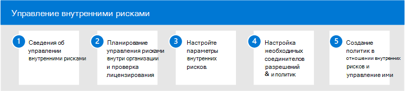

# Управление рисками внутри организации в Microsoft 365Insider risk management in Microsoft 365

Все чаще сотрудники имеют больше доступа к созданию, управлению и совместному доступу к данным на широком спектре платформ и служб.Increasingly, employees have more access to create, manage, and share data across a broad spectrum of platforms and services. В большинстве случаев организации имеют ограниченные ресурсы и средства для выявления и снижения рисков в масштабе организации, а также для соответствия требованиям и стандартам конфиденциальности сотрудников.In most cases, organizations have limited resources and tools to identify and mitigate organization-wide risks while also meeting compliance requirements and employee privacy standards. К этим рискам может относится кража данных путем убывающих сотрудников и утечка данных за пределы организации путем случайного переключение на службу или злонамеренное намерение.These risks may include data theft by departing employees and data leaks of information outside your organization by accidental oversharing or malicious intent.

Для управления рисками внутри организации в Microsoft 365 используются все службы и сторонние индикаторы, которые помогают быстро идентифицировать, реагировать на рискованные действия пользователей и реагировать на них.Insider risk management in Microsoft 365 uses the full breadth of service and 3rd-party indicators to help you quickly identify, triage, and act on risky user activity. Используя журналы из Microsoft 365 и Microsoft Graph, управление рисками внутри организации позволяет определить определенные политики для определения индикаторов рисков и принять меры по их снижению.By using logs from Microsoft 365 and Microsoft Graph, insider risk management allows you to define specific policies to identify risk indicators and to take action to mitigate these risks.

## Настройка управления insider risk management для Microsoft 365Configure insider risk management for Microsoft 365

Чтобы настроить управление рисками внутри организации, с помощью следующих действий:Use the following steps to configure insider risk management for your organization:

1. Узнайте об [управлении insider risk в](insider-risk-management.md) Microsoft 365Learn about [insider risk management](insider-risk-management.md) in Microsoft 365
2. Планирование управления рисками внутри организации [и проверка лицензирования](insider-risk-management-plan.md)Plan for [insider risk management and verify licensing](insider-risk-management-plan.md)
3. Настройка [параметров управления рисками внутри организации](insider-risk-management-settings.md)Configure [insider risk management settings](insider-risk-management-settings.md)
4. Настройка [необходимых разрешений](insider-risk-management-configure.md#step-1-enable-permissions-for-insider-risk-management) и [политик для & соединителов](insider-risk-management-configure.md#step-3-configure-prerequisites-for-templates)Configure [permissions](insider-risk-management-configure.md#step-1-enable-permissions-for-insider-risk-management) and [policy prerequisites & connectors](insider-risk-management-configure.md#step-3-configure-prerequisites-for-templates)
5. Создание и настройка [политик управления рисками внутри организации](insider-risk-management-configure.md#step-5-create-an-insider-risk-management-policy)Create and configure [insider risk management policies](insider-risk-management-configure.md#step-5-create-an-insider-risk-management-policy)

## Дополнительные сведения об управлении рисками внутри организацииMore information about insider risk management

- [Управление политиками insider riskManage insider risk policies](insider-risk-management-policies.md)
- [Расследование оповещений о внутренних рискахInvestigate insider risk alerts](insider-risk-management-alerts.md)
- [Действовать в отношении дел, связанных с внутриуголным рискомAct on insider risk cases](insider-risk-management-cases.md)