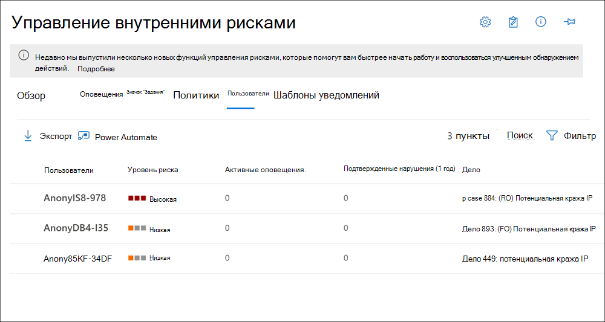

# Панель мониторинга пользователей управления рисками для участниковInsider risk management Users dashboard

**Информационная панель "Пользователи"** является важным инструментом в рабочем процессе управления рисками для оценки и помогает исследованиям и аналитикам более полное понимание действий риска.The **Users dashboard** is an important tool in the insider risk management workflow and helps investigators and analysts have a more complete understanding of risk activities. Эта панель мониторинга предлагает представления и функции управления для удовлетворения административных потребностей между созданием политик управления рисками для участников программы оценки и управления обращениями по управлению рисками для оценки.This dashboard offers views and management features to meet administrative needs between the creating insider risk management policies and managing insider risk management cases.

Когда пользователи добавляются к политикам управления рисками для оценки, фоновые процессы автоматически оценивают действия пользователей для [запуска индикаторов](insider-risk-management-settings.md#indicators).After users are added to insider risk management policies, background processes are automatically evaluating user activities for [triggering indicators](insider-risk-management-settings.md#indicators). После отображения индикаторов запуска для действий пользователей назначаются показатели риска.After triggering indicators are present, user activities are assigned risk scores. Некоторые из этих действий могут привести к оповещению о риске для оценки, но некоторые действия могут не соответствовать требованиям к минимальному уровню риска, и оповещение о риске для участников программы предварительной оценки не создается.Some of these activities may result in an insider risk alert, but some activities may not meet a minimum risk score level and an insider risk alert won't be created. **Панель мониторинга "Пользователи"** позволяет просматривать пользователей с этими типами индикаторов и показателей риска, а также пользователей, у которых есть активные оповещения о рисках для оценки.The **Users dashboard** allows you to view users with these types of indicators and risk scores, as well users that have active insider risk alerts.

Кроме того, могут возникнуть ситуации, в которых необходимо добавить временного пользователя для предварительной оценки политик риска после сообщения о необычном событии за преработкой из рабочего процесса управления рисками.Additionally, there may be scenarios where you need to add temporarily users to insider risk policies after an unusual event is reported outside of the insider risk management workflow. **Панель "Пользователи"** позволяет вручную добавлять пользователя в политику оценки риска в течение определенного периода времени и обходить требование пользователя с помощью индикатора триггера.The **Users dashboard** allows you to manually add a user to an insider risk policy for a specific amount of time and bypass the requirement for a user to have a triggering indicator. Эти пользователи всегда отображаются на панели мониторинга "Пользователи" при активном назначении политики.These users are always displayed in the Users dashboard when actively assigned to a policy.

Узнайте больше о том, как панель мониторинга "Пользователи" отображают пользователей в следующих сценариях:Learn more about how the Users dashboard displays users in the following scenarios:

- Пользователи панели мониторинга с активными оповещениями политики риска для оценкиDashboard users with active insider risk policy alerts
- Пользователи панели мониторинга с индикаторами запускаDashboard users with triggering indicators
- Пользователи панели мониторинга, добавленные временно к политикамDashboard users added temporarily to policies

## Пользователи панели мониторинга с активными оповещениями политики риска для оценкиDashboard users with active insider risk policy alerts

На **панели мониторинга "Пользователи"** автоматически отображаются все пользователи с активными оповещениями политики риска для оценки.The **Users dashboard** automatically displays all users with active insider risk policy alerts. Эти пользователи с оповещениями имеют индикатор триггера и показатель риска действия, которые соответствуют требованиям для создания оповещения о риске для оценки.These users with alerts have both a triggering indicator and an activity risk score that meets the requirements for creating an insider risk alert. Чтобы просмотреть действия для этих пользователей, выберите пользователя в **панели мониторинга "Пользователи** " и перейдите на вкладку **действия пользователя** .Activities for these users are viewed by selecting the user in the **Users dashboard** and navigating to the **User activity** tab.

## Пользователи панели мониторинга с индикаторами запускаDashboard users with triggering indicators

На **панели мониторинга "Пользователи"** автоматически отображаются все пользователи с индикаторами, но у которых нет оценки риска, которая создаст оповещение о риске для оценки.The **Users dashboard** automatically displays all users with triggering indicators, but that don't have an activity risk score that would create an insider risk alert. Например, отображается пользователь с указанными датой ресигнатион, так как это событие является индикатором триггера, но не является действием с показателем риска.For example, a user with a reported resignation date is displayed because this event is a triggering indicator but isn't an activity that has a risk score. Чтобы просмотреть действия для этих пользователей, выберите пользователя в **панели мониторинга "Пользователи** " и перейдите на вкладку **действия пользователя** .Activities for these users are viewed by selecting the user in the **Users dashboard** and navigating to the **User activity** tab.

## Пользователи панели мониторинга, добавленные временно к политикамDashboard users added temporarily to policies

**Панель мониторинга "Пользователи"** позволяет временно добавлять пользователей в существующую политику управления рисками для оценки после необычного события за преработкой из рабочего процесса "Управление рисками".The **Users dashboard** allows you to temporarily add users to an existing insider risk management policy after an unusual event outside of the insider risk management workflow. Временное добавление пользователей также позволяет добавлять пользователей в политику управления рисками для оценки, даже если необходимый соединитель не настроен.Temporarily adding users is also a way to add users to an insider risk management policy for testing the policy, even if a required connector isn't configured.

Когда пользователь вручную добавляется в политику, действия пользователей за последние 90 дней оцениваются и добавляются на временную шкалу **активности пользователей** .When a user is manually added to a policy, the user activities for the previous 90 days are scored and added to the **User activity** timeline. Например, пользователь, не являющийся областью в политике риска для оценки, и пользователь получил сведения об утечке данных в юридическом отделе Организации.For example, a user not currently in-scope in an insider risk policy and the user has data leak activities reported to the legal department in your organization. Юридический отдел рекомендует настроить новые краткосрочные требования к мониторингм для пользователя.The legal department recommends that you configure new short-term monitoring requirements for the user. Вы можете временно присвоить пользователю политику *утечек данных* для определенного периода времени (окно активации).You can temporarily assign the user to your *Data leaks* policy for a designated length of time (activation window). Все добавленные пользователи временно отображаются на **панели мониторинга "Пользователи"** , так как требования к индикатору запускаются.All users added temporarily are displayed in the **Users dashboard** because triggering indicator requirements are waived.

>[!NOTE]
>Новые пользователи, добавленные вручную, могут отображаться на **панели мониторинга "Пользователи"** в течение нескольких часов.It may take several hours for new manually-added users to appear in the **Users dashboard**. Для отображения действий за последние 90 дней для этих пользователей может потребоваться до 24 часов.Activities for the previous 90 days for these users may take up to 24 hours to display. Чтобы просмотреть действия для добавленных вручную пользователей, выберите пользователя на **панели мониторинга "Пользователи** " и откройте вкладку **действия пользователя** в области сведений.To view activities for manually added users, select the user on the **Users dashboard** and open the **User activity** tab on the details pane.

Пользователь автоматически удаляется из политики предварительной оценки и **панели мониторинга "Пользователи"** при истечении времени, определенного в **окне активации** , если:The user is automatically removed from the insider policy and the **Users dashboard** when the time defined in the **Activation window** expires if:

- у пользователя нет оповещений о триггерах или угрозах безопасности для участниковthe user doesn't have any triggering indicators or insider risk policy alerts, and
- Если длительность периода **активации** , заданная вручную, превышает длительность периода **активации** глобальной политики.if the manually defined **Activation window** duration is longer than the global policy **Activation window** duration. 

Параметр **окна активации** с максимальной длительностью всегда переопределяет параметр **окна активации** с более короткой длительностью.The **Activation window** setting with the longest duration always overrides the **Activation window** setting with a shorter duration. Например, вы настроили **окно активации** на вкладке глобальные **политики временных рамок** в глобальных параметрах управления рисками в течение 15 дней, которые автоматически применяются ко всем политикам риска оценки.For example, you've configured the **Activation window** on the global **Policy timeframes** tab in the insider risk management global settings for 15 days, which is automatically applied to all your insider risk policies. 

Вы временно добавляете пользователя в политику " *утечки данных* " и определите 30 дней в качестве **окна активации** для этого пользователя.You temporarily add a user to your *Data leaks* insider risk policy and define 30 days as the **Activation window** for this user. Значение параметра глобального **окна активации** 15 дней переопределяется путем определения параметра **периода активации** 30 дней для временного добавленного пользователя.The global **Activation window** setting of 15 days is overridden by defining the **Activation window** setting of 30 days for the temporarily added user. Временный пользователь остается в **панели мониторинга "Пользователи"** и находится в области действия политики в течение 30 дней.The temporarily added user will remain in the **Users dashboard** and be in-scope for the policy for 30 days.

В противном случае, когда параметр окно глобальной **активации** длиннее, чем параметр **окна активации** , определенный для временного добавленного пользователя, то **Настройка окна** " **Активация** " для временного добавленного пользователя будет переопределяться.In the opposite scenario where the global **Activation window** setting is longer than the **Activation window** setting defined for a temporarily added user, the global **Activation window** setting would override the **Activation window** setting for the temporarily added user. Временный пользователь останется в **панели мониторинга "Пользователи"** и должен находиться в области для политики в течение числа дней, определенных в параметрах глобального **окна активации** .The temporarily added user will remain in the **Users dashboard** and be in-scope for the policy for the number of days defined in the global **Activation window** settings.

## Просмотр сведений о пользователях на панели мониторинга "Пользователи"View user information on the Users dashboard

Каждый пользователь, отображаемый на **панели мониторинга "Пользователи"** , имеет следующие сведения:Each user displayed in the **Users dashboard** has the following information:

- **Пользователи**: имя пользователя.**Users**: The username for a user. Это поле является анонимным, если включена Глобальная настройка анонимности для управления рисками в программе-участнике.This field is anonymized if the global anonymization setting for insider risk management is enabled.
- **Уровень риска**: текущий рассчитанный уровень риска для пользователя.**Risk level**: The current calculated risk level of the user. Этот показатель вычисляется каждые 24 часа и использует показатели риска оповещений из всех активных оповещений, связанных с пользователем.This score is calculated every 24 hours and uses the alert risk scores from all active alerts associated to the user. Для пользователей, имеющих только индикаторы запуска, уровень риска равен нулю.For users with only triggering indicators, the risk level is zero.
- **Активные оповещения**: количество активных оповещений для всех политик.**Active alerts**: The number of active alerts for all policies.
- **Подтвержденные нарушения**: количество вариантов, разрешенных как *подтвержденное нарушение политики* для пользователя.**Confirmed violations**: The number of cases resolved as *confirmed policy violation* for the user.
- **Регистр**: текущее активное обращение для пользователя.**Case**: The current active case for the user.

>[!NOTE]
>Количество пользователей, отображаемых на **панели мониторинга "Пользователи"** , может быть ограничено в некоторых случаях в зависимости от объема активных оповещений и политик проверки подлинности.The number of users displayed on the **Users dashboard** may be limited in some instances, depending on the volume of active alerts and matching policies. Пользователи с активными оповещениями отображаются на **панели мониторинга "Пользователи"** во время создания оповещений, и в редких случаях при достижении максимального числа отображаемых пользователей могут возникать некоторые из них.Users with active alerts are displayed on the **Users dashboard** as the alerts are generated, and there may be rare cases when the maximum number of displayed users is reached. В этом случае пользователи с активными оповещениями, которые не отображаются, будут добавлены на **панель мониторинга "Пользователи** " в соответствии с рассмотрением текущих оповещений пользователей.If this happens, users with active alerts who aren't displayed will be added to the **Users dashboard** as existing user alerts are triaged.

## Просмотр сведений о пользователяхView user details

Чтобы просмотреть дополнительные сведения о действиях с рисками для пользователя, откройте область сведений о пользователях, дважды щелкнув пользователя на **панели мониторинга "Пользователи"**.To view more details about risk activity for a user, open the user details pane by double-clicking a user in the **Users dashboard**. В области сведений можно просмотреть следующие сведения:On the details pane, you can view the following information:

- Вкладка " **профиль пользователя** "**User profile** tab
    - **Имя и должность**: имя и должность пользователя из Azure Active Directory.**Name and title**: The name and position title for the user from Azure Active Directory. Эти поля пользователя будут анонимными или пустыми, если включена Глобальная настройка анонимности для управления рисками в программе-участнике.These user fields will be anonymized or empty if the global anonymization setting for insider risk management is enabled.
    - **Электронная почта пользователя**: адрес электронной почты пользователя.**User email**: The email address for the user.
    - **Псевдоним**: псевдоним сети для пользователя.**Alias**: The network alias for the user.
    - **Организация или отдел**: организация или отдел для пользователя.**Organization or department**: The organization or department for the user.

- Вкладка " **действия пользователя** "**User activity** tab
    - **Журнал недавних действий пользователя**: перечисляет индикаторы запуска и оценки риска для действий пользователей вплоть до последних 180 дней.**History of recent user activity**: Lists both triggering indicators and insider risk indicators for user activities up to the last 180 days. Все действия, относящиеся к показателям риска для участников программы оценки, также оцениваются, несмотря на то, что в действиях может быть создано оповещение о риске для участников программы оценки.All activities pertinent to insider risk indicators are also scored, though the activities may or may not have generated an insider risk alert. Примеры триггеров могут представлять собой дату ресигнатион или последнюю запланированную дату работы для пользователя.Triggering indicator examples may be a resignation date or the last scheduled date of work for the user. Индикаторы риска для предварительной оценки — это действия, которые связаны с элементом риска и определяются в политиках, в которых пользователь включен.Insider risk indicators are activities determined to have an element of risk and are defined in policies that the user is included in. Действия с событиями и рисками перечислены в списке последних элементов.Event and risk activities are listed with the most recent item listed first.

## Временное добавление пользователя в политикуTemporarily add a user to a policy

Чтобы временно добавить пользователя в политику управления рисками для оценки, вы будете использовать вкладку **Пользователи** в решении по **управлению рисками для оценки** в центре соответствия требованиям Microsoft 365.To temporarily add a user to an insider risk management policy, you'll use the **Users** tab in the **Insider risk management** solution in the Microsoft 365 compliance center. Пользователи добавляют требования к индикатору запуска вручную для политики, в которой они добавляются, и отображаются на **панели мониторинга "Пользователи"**.Users added manually bypass triggering indicator requirements for the policy they are added to and are displayed in the **Users dashboard**. Чтобы добавить пользователя в политику безопасности для предварительной оценки, воспользуйтесь мастером политики.To permanently add a user to an insider risk management policy, you'll use the policy wizard.

Выполните указанные ниже действия, чтобы добавить пользователя к существующей политике риска предварительной оценки.Complete the following steps to add a user to an existing insider risk policy:

1. В [центре соответствия требованиям Microsoft 365](https://compliance.microsoft.com)перейдите к разделу **Управление рисками для оценки** и выберите вкладку **Пользователи** .In the [Microsoft 365 compliance center](https://compliance.microsoft.com), go to **Insider risk management** and select the **Users** tab.
2. Выберите **Добавить пользователя в политику** на панели инструментов.Select **Add a user to a policy** on the toolbar.
3. В диалоговом окне **Добавление нового пользователя** начните ввод имени пользователя в поле **пользователь** .On the **Add a new user** dialog, start typing a user name in the **User** field. Выберите пользователя, которого вы хотите добавить в политику.Select the user you want to add to a policy.
4. Нажмите стрелку раскрывающегося списка для поля **Политика** , чтобы отобразить настроенные политики управления рисками для участников программы оценки.Select the dropdown arrow for the **Policy** field to display configured insider risk management policies. Выберите политику, в которую нужно добавить пользователя.Select the policy to add the user to.
5. Используйте ползунок **окна активации** , чтобы определить, как долго пользователь включен в политику и отображается на панели мониторинга "Пользователи".Use the **Activation window** slider control to define how long the user is included in a policy and displayed in the Users dashboard. Заданное время определяет, как долго политика будет активна для этого пользователя и будет запускаться при создании первого оповещения или при обнаружении индикатора запуска (например, согласования политики DLP).The time you specify determines how long the policy is active for this user and starts when the first alert is generated or a triggering indicator (like a DLP policy match) is detected. Диапазон для **окна активации** составляет от 5 до 30 дней.The range for the **Activation window** is 5 to 30 days.
6. Нажмите кнопку **Добавить** , а затем **Подтвердите** , чтобы добавить пользователя в политику.Select **Add** and then **Confirm** to add the user to the policy.

>[!NOTE]
>Новые пользователи, добавленные вручную, могут отображаться на **панели мониторинга "Пользователи"** в течение нескольких часов.It may take several hours for new manually-added users to appear in the **Users dashboard**. Для отображения действий за последние 90 дней для этих пользователей может потребоваться до 24 часов.Activities for the previous 90 days for these users may take up to 24 hours to display. Чтобы просмотреть действия для добавленных вручную пользователей, выберите пользователя на **панели мониторинга "Пользователи** " и откройте вкладку **действия пользователя** в области сведений.To view activities for manually added users, select the user on the **Users dashboard** and open the **User activity** tab on the details pane.
