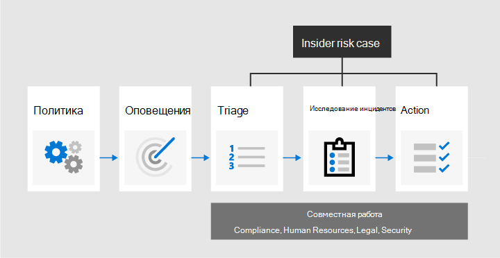
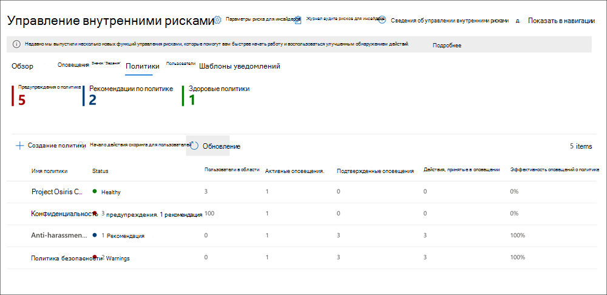
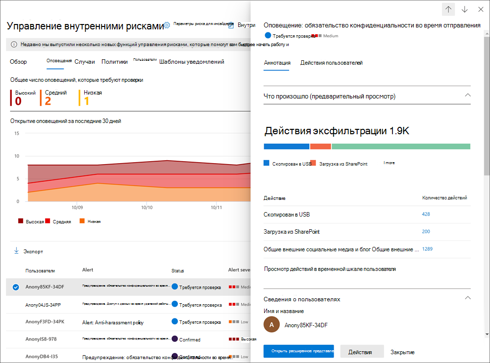
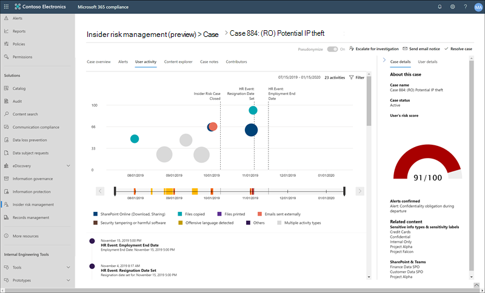

# Предварительная оценка управления рисками в Microsoft 365Insider risk management in Microsoft 365

Средство предварительной оценки риска — это решение для обеспечения соответствия требованиям в Microsoft 365, которое позволяет минимизировать внутренние риски, позволяя обнаруживать, изучать и исследовать от вредоносных и случайных действий в Организации.Insider risk management is a compliance solution in Microsoft 365 that helps minimize internal risks by enabling you to detect, investigate, and act on malicious and inadvertent activities in your organization. Политики риска для предварительной оценки позволяют определить типы рисков, которые необходимо определить и определить в Организации, в том числе работа с обращениями и эскалация обращений к расширенным обнаружениям электронных данных Майкрософт, если это необходимо.Insider risk policies allow you to define the types of risks to identify and detect in your organization, including acting on cases and escalating cases to Microsoft Advanced eDiscovery if needed. С помощью аналитик риска в Организации можно быстро выполнять соответствующие действия, чтобы убедиться, что пользователи соответствуют стандартам соответствия требованиям вашей организации.Risk analysts in your organization can quickly take appropriate actions to make sure users are compliant with your organization's compliance standards.

Посмотрите видео ниже, чтобы узнать, как управление рисками для оценки безопасности поможет вашей организации предотвратить, обнаруживать и содержать риски, при этом определяя приоритеты для значений в Организации, культуры и взаимодействия с пользователем.Watch the video below to learn how insider risk management can help your organization prevent, detect, and contain risks while prioritizing your organization values, culture, and user experience:
 
 
>[!VIDEO https://www.microsoft.com/videoplayer/embed/RE4j9CN]

## Вопросы, появляющиеся в современных рискахModern risk pain points

Управление и минимизация риска в Организации начинается с понимания типов рисков, обнаруженных на современном рабочем месте.Managing and minimizing risk in your organization starts with understanding the types of risks found in the modern workplace. Некоторые риски управляются внешними событиями и факторами, которые находятся за пределами прямого контроля.Some risks are driven by external events and factors that are outside of direct control. Другие риски определяются внутренними событиями и действиями пользователей, которые могут быть свернуты и не добегать.Other risks are driven by internal events and user activities that can be minimized and avoided. В некоторых примерах есть риски, связанные с незаконным, неприемлемым, несанкционированным действием и действиями пользователей в вашей организации.Some examples are risks from illegal, inappropriate, unauthorized, or unethical behavior and actions by users in your organization. К ним относятся разнообразные внутренние риски от пользователей:These behaviors include a broad range of internal risks from users:

- Утечки конфиденциальных данных и переноса данныхLeaks of sensitive data and data spillage
- Нарушения конфиденциальностиConfidentiality violations
- Хищение интеллектуальной собственности (IP)Intellectual property (IP) theft
- МошенническFraud
- Торговля для участников программы предварительной оценкиInsider trading
- Нарушения соответствия нормативным требованиямRegulatory compliance violations

Пользователи на современном рабочем месте имеют доступ для создания, управления и совместного использования данных в широком спектре платформ и служб.Users in the modern workplace have access to create, manage, and share data across a broad spectrum of platforms and services. В большинстве случаев Организации имеют ограниченные ресурсы и инструменты для определения и устранения рисков на уровне Организации, а также для собраний по стандартам конфиденциальности пользователей.In most cases, organizations have limited resources and tools to identify and mitigate organization-wide risks while also meeting user privacy standards.

Функция предварительной оценки управления рисками использует все индикаторы обслуживания и сторонних производителей, позволяющие быстро определить, рассмотреть и выполнить действия, влияющие на риски.Insider risk management uses the full breadth of service and 3rd-party indicators to help you quickly identify, triage, and act on risk activity. С помощью журналов из Microsoft 365 и Microsoft Graph управление рисками для оценки позволяет определить конкретные политики для определения индикаторов риска.By using logs from Microsoft 365 and Microsoft Graph, insider risk management allows you to define specific policies to identify risk indicators. Эти политики позволяют определять рискованные действия и действовать для устранения этих рисков.These policies allow you to identify risky activities and to act to mitigate these risks.

Управление рисками для предварительной оценки выравниваются по следующим принципам:Insider risk management is centered around the following principles:

- **Прозрачность**: Балансировка конфиденциальности пользователей и рисков в Организации с использованием архитектуры конфиденциальности.**Transparency**: Balance user privacy versus organization risk with privacy-by-design architecture.
- Возможность **настройки**: настраиваемые политики на основе отраслевых, географических и бизнес-групп.**Configurable**: Configurable policies based on industry, geographical, and business groups.
- **Интеграция**: интегрированный рабочий процесс для решений соответствия требованиям Microsoft 365.**Integrated**: Integrated workflow across Microsoft 365 compliance solutions.
- **Действия с действиями**: предоставляет аналитику, позволяющую пользователям получать уведомления о событиях, изучению данных и изучении пользователей.**Actionable**: Provides insights to enable user notifications, data investigations, and user investigations.

## Рабочий процессWorkflow

Рабочий процесс по управлению рисками для участников поможет определить, исследовать и принять меры по устранению внутренних рисков в Организации.The insider risk management workflow helps you identify, investigate, and take action to address internal risks in your organization. С помощью шаблонов политик с сортировкой, комплексных сигналов о действиях в службе Microsoft 365 и средств управления оповещениями и делами, вы можете использовать информацию по действию, чтобы быстро определить и действовать при возникновении рискованных действий.With focused policy templates, comprehensive activity signaling across the Microsoft 365 service, and alert and case management tools, you can use actionable insights to quickly identify and act on risky behavior.

Определение и разрешение проблем с внутренними рисками и проблем с соответствием требованиям к управлению рисками в Microsoft 365 использует следующий рабочий процесс:Identifying and resolving internal risk activities and compliance issues with insider risk management in Microsoft 365 uses the following workflow:

### ПолитикиPolicies

[Политики управления рисками для предварительной оценки](insider-risk-management-policies.md) создаются с помощью предопределенных шаблонов и условий политики, которые определяют, какие события запуска и индикаторы риска проверяются в вашей организации.[Insider risk management policies](insider-risk-management-policies.md) are created using pre-defined templates and policy conditions that define what triggering events and risk indicators are examined in your organization. Эти условия включают сведения о том, как индикаторы риска используются для оповещений, о том, какие пользователи включены в политику, какие службы имеют приоритет и за какой период времени мониторинга.These conditions include how risk indicators are used for alerts, what users are included in the policy, which services are prioritized, and the monitoring time period.

Вы можете выбрать следующие [шаблоны политики, чтобы быстро начать работу с управлением рисками для оценки безопасности:You can select from the following[policy templates to quickly get started with insider risk management:

- [Хищение данных за счет посторонних пользователейData theft by departing users](insider-risk-management-policies.md#data-theft-by-departing-users)
- [Общие утечки данныхGeneral data leaks](insider-risk-management-policies.md#general-data-leaks)
- [Утечки данных по приоритетным пользователям (Предварительная версия)Data leaks by priority users (preview)](insider-risk-management-policies.md#data-leaks-by-priority-users-preview)
- [Утечки данных пользователями дисгрунтлед (Предварительная версия)Data leaks by disgruntled users (preview)](insider-risk-management-policies.md#data-leaks-by-disgruntled-users-preview)
- [Общие нарушения политики безопасности (Предварительная версия)General security policy violations (preview)](insider-risk-management-policies.md#general-security-policy-violations-preview)
- [Нарушения политики безопасности за счет посторонних пользователей (Предварительная версия)Security policy violations by departing users (preview)](insider-risk-management-policies.md#security-policy-violations-by-departing-users-preview)
- [Нарушения политики безопасности по приоритету пользователей (Предварительная версия)Security policy violations by priority users (preview)](insider-risk-management-policies.md#security-policy-violations-by-priority-users-preview)
- [Нарушения политики безопасности пользователями дисгрунтлед (Предварительная версия)Security policy violations by disgruntled users (preview)](insider-risk-management-policies.md#security-policy-violations-by-disgruntled-users-preview)
- [Оскорбительный язык в сообщении электронной почтыOffensive language in email](insider-risk-management-policies.md#offensive-language-in-email)

### ОповещенияAlerts

Оповещения автоматически создаются индикаторами риска, которые удовлетворяют условиям политики и отображаются в [панели мониторинга оповещений](insider-risk-management-alerts.md).Alerts are automatically generated by risk indicators that match policy conditions and are displayed in the [Alerts dashboard](insider-risk-management-alerts.md). Эта панель мониторинга позволяет быстро просмотреть все оповещения, которые требуют проверки, открыть оповещения с течением времени и статистику оповещений для вашей организации.This dashboard enables a quick view of all alerts needing review, open alerts over time, and alert statistics for your organization. Все оповещения политики отображаются со следующими сведениями, которые помогут быстро определить состояние существующих оповещений и новые оповещения, требующие действия.All policy alerts are displayed with the following information to help you quickly identify the status of existing alerts and new alerts that need action:

- СтатусStatus
- SeveritySeverity
- Время обнаруженияTime detected
- СитуацияCase
- Состояние обращенияCase status

### СортировкиTriage

Новые действия пользователя, требующие расследования, автоматически создают оповещения, которым назначено состояние *проверки потребностей* .New user activities that need investigation automatically generate alerts that are assigned a *Needs review* status. Проверяющие могут быстро определять и просматривать, оценивать и рассматривать эти оповещения.Reviewers can quickly identify and review, evaluate, and triage these alerts.

Оповещения разрешаются с помощью открытия нового случая, назначения оповещения для существующего случая или закрытия оповещения.Alerts are resolved by opening a new case, assigning the alert to an existing case, or dismissing the alert. С помощью фильтров оповещений легко можно быстро определить оповещения по состоянию, серьезности или времени обнаружения.Using alert filters, it's easy to quickly identify alerts by status, severity, or time detected. В процессе рассмотрения проверяющие могут просматривать сведения о действиях, определяемых политикой, просматривать действия пользователей, связанные с назначением политики, просматривать сведения об активности пользователей, а также просматривать сведения о профилях пользователей.As part of the triage process, reviewers can view alert details for the activities identified by the policy, view user activity associated with the policy match, see the severity of the alert, and review user profile information.

### ИсследованиеInvestigate

[Обращения](insider-risk-management-cases.md) создаются для оповещений, которые требуют более глубокого рассмотрения и исследования сведений о действиях и обстоятельствах, связанных с назначением политики.[Cases](insider-risk-management-cases.md) are created for alerts that require deeper review and investigation of the activity details and circumstances around the policy match. **Панель мониторинга обращений** позволяет просматривать все активные обращения, открытые обращения с течением времени и статистику обращений в Организации.The **Case dashboard** provides an all-up view of all active cases, open cases over time, and case statistics for your organization. Проверяющие могут быстро фильтровать обращения по состоянию, дате открытия обращения и дате последнего обновления обращения.Reviewers can quickly filter cases by status, the date the case was opened, and the date the case was last updated.

Выбор варианта на панели мониторинга "обращение" открывает дело для исследования и рецензирования.Selecting a case on the case dashboard opens the case for investigation and review. Этот шаг является основой рабочего процесса по управлению рисками для оценки.This step is the heart of the insider risk management workflow. В этой области отображаются действия риска, условия политики, сведения о предупреждениях и сведения о пользователях, которые встроены в интегрированное представление для рецензентов.This area is where risk activities, policy conditions, alerts details, and user details are synthesized into an integrated view for reviewers. Основные средства расследования в этой области:The primary investigation tools in this area are:

- **Действия пользователя**: действия пользователя автоматически отображаются в интерактивной диаграмме, которая отображает действия с течением времени и по уровню риска для текущих или прошлых действий по риску.**User activity**: User activity is automatically displayed in an interactive chart that plots activities over time and by risk level for current or past risk activities. Проверяющие могут быстро фильтровать и просматривать весь журнал рисков для пользователя и подробные сведения об определенных действиях.Reviewers can quickly filter and view the entire risk history for the user and drill into specific activities for more details.
- **Обозреватель контента**: все файлы данных и сообщения электронной почты, связанные с действиями оповещений, автоматически фиксируются и отображаются в обозревателе контента.**Content Explorer**: All data files and email messages associated with alert activities are automatically captured and displayed in the Content Explorer. Рецензенты могут фильтровать и просматривать файлы и сообщения по источникам данных, типам файлов, тегам, беседам и многим другим атрибутам.Reviewers can filter and view files and messages by data source, file type, tags, conversation, and many more attributes.
- **Примечания к случаю**: рецензенты могут предоставлять заметки в разделе "Примечания к случаю".**Case notes**: Reviewers can provide notes for a case in the Case Notes section. Этот список объединяет все заметки в центральном представлении, включая сведения о рецензентах и дата их отправки.This list consolidates all notes in a central view and include reviewer and date submitted information.

### ДействиеAction

После изучения таких случаев проверяющие могут быстро решить проблему или сотрудничать с другими заинтересованными сторонами в Организации.After cases are investigated, reviewers can quickly act to resolve the case or collaborate with other risk stakeholders in your organization. Если пользователи случайно или случайно нарушают условия политики, можно отправить пользователю простое уведомление с напоминанием о шаблонах, которые можно настроить для Организации.If users accidentally or inadvertently violate policy conditions, a simple reminder notice can be sent to the user from notice templates you can customize for your organization. Эти уведомления могут отдаваться как простые напоминания или могут направлять пользователей на новые обучающие материалы или рекомендации по предотвращению нежелательного поведения в будущем.These notices may serve as simple reminders or may direct the user to refresher training or guidance to help prevent future risky behavior. Для получения дополнительных сведений см [шаблоны уведомлений "Управление рисками](insider-risk-management-notices.md)".For more information, see [Insider risk management notice templates](insider-risk-management-notices.md).

В более серьезных ситуациях вам может потребоваться поделиться сведениями об обращении для участников программы предварительной оценки об управлении рисками с другими проверяющими или службами в Организации.In the more serious situations, you may need to share the insider risk management case information with other reviewers or services in your organization. Управление рисками для предварительной оценки тесно интегрировано с другими решениями Microsoft 365 для обеспечения соответствия требованиям.Insider risk management is tightly integrated with other Microsoft 365 compliance solutions to help you with end-to-end risk resolution.

- **Расширенное обнаружение электронных**данных: эскалация обращения для расследования позволяет перенести данные и управлять обращением в расширенные функции обнаружения электронных данных в Microsoft 365.**Advanced eDiscovery**: Escalating a case for investigation allows you to transfer data and management of the case to Advanced eDiscovery in Microsoft 365. Расширенное обнаружение электронных данных предоставляет сквозной рабочий процесс для сохранения, сбора, проверки, анализа и экспорта содержимого, которое отвечает за внутреннее и внешнее расследования вашей организации.Advanced eDiscovery provides an end-to-end workflow to preserve, collect, review, analyze, and export content that's responsive to your organization's internal and external investigations. Она позволяет юридическим группам управлять всем рабочим процессом уведомления об удержаниях.It allows legal teams to manage the entire legal hold notification workflow. Дополнительные сведения о дополнительных возможностях обнаружения электронных данных приведены [в статье обзор расширенного обнаружения электронных данных в Microsoft 365](overview-ediscovery-20.md).To learn more about Advanced eDiscovery cases, see [Overview of Advanced eDiscovery in Microsoft 365](overview-ediscovery-20.md).
- **Servicenow (Предварительная версия)**: servicenow — это популярная платформа облачных вычислений, которая помогает организациям управлять цифровыми рабочими процессами для корпоративных операций.**ServiceNow (preview)**: ServiceNow is a popular cloud computing platform that helps organizations manage digital workflows for enterprise operations. Центр управления рисками для предварительной оценки поддерживает совместное использование оповещений о обращениях со службой ServiceNow и позволяет создавать инциденты и запросы на изменение, связанные с отдельными вариантами риска для оценки.Insider risk management supports sharing case alerts with your ServiceNow service and allows you to create incidents and change requests related to individual insider risk cases. Чтобы узнать больше об общем доступе к сведениям оповещений в ServiceNow, ознакомьтесь со статьей [общий доступ к обращению с servicenow](insider-risk-management-cases.md#share-the-case).To learn more about sharing alert information with ServiceNow, see [Share a case with ServiceNow](insider-risk-management-cases.md#share-the-case).
- **Интеграция API управления Office 365 (Предварительная версия)**: управление рисками для оценки безопасности поддерживает экспорт данных оповещений в службы безопасности и управления событиями (SIEM) с помощью API управления Office 365.**Office 365 Management APIs integration (preview)**: Insider risk management supports exporting alert information to security information and event management (SIEM) services via the Office 365 Management APIs. Имея доступ к сведениям оповещений в платформе, лучше всего подходит для процессов, влияющих на работу Организации, вы можете больше гибко реагировать на действия с рисками.Having access to alert information in the platform the best fits your organization's risk processes gives you more flexibility in how to act on risk activities. Дополнительные сведения об экспорте данных оповещений с помощью API управления Office 365 можно найти в статье [Export Alerts](insider-risk-management-settings.md#export-alerts-preview).To learn more about exporting alert information with Office 365 Management APIs, see [Export alerts](insider-risk-management-settings.md#export-alerts-preview).

## СценарииScenarios

Управление рисками для предварительной оценки помогает обнаруживать, анализировать и предпринимать меры по устранению внутренних рисков в Организации в нескольких распространенных сценариях.Insider risk management can help you detect, investigate, and take action to mitigate internal risks in your organization in several common scenarios:

### Хищение данных за счет посторонних пользователейData theft by departing users

Когда пользователи оставляют организацию, как добровольно, так и в результате увольнения, часто приходится учитывать, что данные о компании, клиентах и пользователях подвержены риску.When users leave an organization, either voluntarily or as the result of termination, there is often legitimate concerns that company, customer, and user data are at risk. Пользователи могут инноцентли предположить, что данные проекта не являются собственностью, или они могут быть незаконными для получения данных компании для личного усиления и нарушения политики компании и юридических стандартов.Users may innocently assume that project data isn't proprietary, or they may be tempted to take company data for personal gain and in violation of company policy and legal standards. Политики управления рисками для предварительной оценки, использующие шаблон " [хищение данных с помощью частичных](insider-risk-management-policies.md#policy-templates) посторонних пользователей", автоматически определяют действия, которые обычно связаны с этим типом кражи.Insider risk management policies that use the [Data theft by departing users](insider-risk-management-policies.md#policy-templates) policy template automatically detect activities typically associated with this type of theft. С помощью этой политики вы автоматически получаете оповещения о подозрительных действиях, связанных с хищением данных, отменяя пользователей, чтобы вы могли предпринять соответствующие исследования.With this policy, you'll automatically receive alerts for suspicious activities associated with data theft by departing users so you can take appropriate investigative actions. Для этого шаблона политики необходимо настроить [Microsoft 365 HR Connector](import-hr-data.md) для вашей организации.Configuring a [Microsoft 365 HR connector](import-hr-data.md) for your organization is required for this policy template.

### Неумышленное утечка конфиденциальной или конфиденциальной информацииIntentional or unintentional leak of sensitive or confidential information

В большинстве случаев пользователи пытаются правильно обрабатывать конфиденциальную или конфиденциальную информацию.In most cases, users try their best to properly handle sensitive or confidential information. Но иногда пользователи могут делать ошибки и данные случайно общими за пределами организации или в нарушение политик защиты информации.But occasionally users may make mistakes and information is accidentally shared outside your organization or in violation of your information protection policies. В других случаях пользователи могут умышленно отвлекаться или обмениваться конфиденциальной и конфиденциальной информацией с помощью вредоносных программ, а также для потенциального личного усиления.In other circumstances, users may intentionally leak or share sensitive and confidential information with malicious intent and for potential personal gain. Политики управления рисками, созданные с помощью следующих шаблонов политики, автоматически определяют действия, которые обычно связаны с общими конфиденциальными или конфиденциальными сведениями:Insider risk management policies created using the following Data leaks policy templates automatically detect activities typically associated with sharing sensitive or confidential information:

- [Общие утечки данныхGeneral data leaks](insider-risk-management-policies.md#general-data-leaks)
- [Утечки данных по приоритетным пользователям (Предварительная версия)Data leaks by priority users (preview)](insider-risk-management-policies.md#data-leaks-by-priority-users-preview)
- [Утечки данных пользователями дисгрунтлед (Предварительная версия)Data leaks by disgruntled users (preview)](insider-risk-management-policies.md#data-leaks-by-disgruntled-users-preview)

### Нежелательное поведение, нарушающее корпоративные политикиOffensive behavior that violates corporate policies

Частое взаимодействие между пользователями часто является источником неумышленного или злонамеренного нарушения корпоративных политик.User-to-user communications are often a source of inadvertent or malicious violations of corporate policies. Эти нарушения могут включать оскорбительный язык, угрозы и преследования пользователей.These violations can include offensive language, threats, and harassment between users. Этот тип действий участвует в рабочей среде злоумышленника и может привести к появлению юридических действий как для пользователей, так и для более крупной организации.This type of activity contributes to a hostile work environment and can result in legal actions against both users and the larger organization. Для минимизации этих рисков в управлении рисками для участников справки используются новые встроенные классификаторы Microsoft 365 и [нежелательные языки в](insider-risk-management-policies.md#offensive-language-in-email) шаблоне политики электронной почты.Insider risk management uses new built-in Microsoft 365 classifiers and the [Offensive language in email](insider-risk-management-policies.md#offensive-language-in-email) policy template to help minimize these risks. Этот шаблон политики помогает быстро настроить и включить политику для автоматического обнаружения и оповещения о данном типе поведения в Организации.This policy template helps you quickly configure and enable a policy to automatically detect and alert you of this kind of behavior in your organization.

## Преднамеренные или непреднамеренное нарушения политики безопасности (Предварительная версия)Intentional or unintentional security policy violations (preview)

Обычно пользователи имеют большой уровень контроля при управлении устройствами на современном рабочем месте.Users typically have a large degree of control when managing their devices in the modern workplace. Сюда могут относиться разрешения на установку или удаление приложений, необходимых для производительности их обязанностей, а также возможность временно отключить функции безопасности устройств.This may include permissions to install or uninstall applications needed in the performance of their duties or the ability to temporarily disable device security features. Независимо от того, является ли это действие случайным, случайным или злонамеренным, это может привести к снижению риска в Организации и послужить для минимизации.Whether this activity is inadvertent, accidental, or malicious, this conduct can pose risk to your organization and is important to identify and act to minimize. Чтобы обеспечить соблюдение этих рискованных действий по обеспечению безопасности, следующие шаблоны нарушений безопасности управления рисками для системы оценки безопасности оценивают индикаторы риска безопасности и используют оповещения для получения ценных сведений о действиях, связанных с безопасностью:To help identity these risky security activities, the following insider risk management security policy violation templates scores security risk indicators and uses Microsoft Defender Advanced Threat Protection (ATP) alerts to provide insights for security-related activities:

- [Общие нарушения политики безопасности (Предварительная версия)General security policy violations (preview)](insider-risk-management-policies.md#general-security-policy-violations-preview)
- [Нарушения политики безопасности за счет посторонних пользователей (Предварительная версия)Security policy violations by departing users (preview)](insider-risk-management-policies.md#security-policy-violations-by-departing-users-preview)
- [Нарушения политики безопасности по приоритету пользователей (Предварительная версия)Security policy violations by priority users (preview)](insider-risk-management-policies.md#security-policy-violations-by-priority-users-preview)
- [Нарушения политики безопасности пользователями дисгрунтлед (Предварительная версия)Security policy violations by disgruntled users (preview)](insider-risk-management-policies.md#security-policy-violations-by-disgruntled-users-preview)

## Политики для пользователей в зависимости от положения, уровня доступа или истории риска (Предварительная версия)Policies for users based on position, access level, or risk history (preview)

Пользователи в вашей организации могут иметь разные уровни риска в зависимости от их положения, уровня доступа к конфиденциальным сведениям или истории риска.Users in your organization may have different levels of risk depending on their position, level of access to sensitive information, or risk history. Сюда могут относиться участники рабочей группы руководителя Организации, ИТ — администраторы, обладающие расширенными правами на доступ к данным и сети, или пользователи с прошедшей историей рискованных действий.This may include members of your organization's executive leadership team, IT administrators that have extensive data and network access privileges, or users with a past history of risky activities. В этом случае важна более интенсивная проверка и более интенсивное рассмотрение рисков, которые помогают упростить анализ оповещений и быстрое действие.In these circumstances, closer inspection and more aggressive risk scoring are important to help surface alerts for investigation and quick action. Для определения рискованных действий для этих типов пользователей можно создавать группы приоритетов пользователей и создавать политики из следующих шаблонов политик:To help identify risky activities for these types of users, you can create priority user groups and create policies from the following policy templates:

- [Нарушения политики безопасности по приоритету пользователей (Предварительная версия)Security policy violations by priority users (preview)](insider-risk-management-policies.md#security-policy-violations-by-priority-users-preview)
- [Утечки данных по приоритетным пользователям (Предварительная версия)Data leaks by priority users (preview)](insider-risk-management-policies.md#data-leaks-by-priority-users-preview)

## Действия и варианты поведения пользователями дисгрунтлед (Предварительная версия)Actions and behaviors by disgruntled users (preview)

При нагрузки сотрудников события могут влиять на поведение пользователя несколькими способами, относящимися к угрозам для оценки.Employment stresses events can impact user behavior in several ways that relate to insider risks. Эти нагрузки могут относиться к снижению производительности, понижению положения или размещению пользователя в плане оценки производительности.These stressors may be a poor performance review, a position demotion, or the user being placement on a performance review plan. Несмотря на то, что большинство пользователей не реагируют на эти события, это может привести к тому, что некоторые пользователи будут выполнять определенные действия, которые обычно не рассматриваются в нормальных условиях.Though most users do not respond maliciously to these events, the stress of these actions may result in some users to take actions they may not normally consider during normal circumstances. Чтобы помочь идентифицировать эти типы рискованные действия, в следующих шаблонах политики управления рисками для предварительной оценки используется соединитель Microsoft 365 HR Connector и загружается индикатор риска, связанный с действиями, которые могут происходить почти с событиями стрессор занятости:To help identity these types risky activities, the following insider risk management policy templates use the Microsoft 365 HR connector and starts scoring risk indicators relating to behaviors that may occur near employment stressor events:

- [Утечки данных пользователями дисгрунтлед (Предварительная версия)Data leaks by disgruntled users (preview)](insider-risk-management-policies.md#data-leaks-by-disgruntled-users-preview)
- [Нарушения политики безопасности пользователями дисгрунтлед (Предварительная версия)Security policy violations by disgruntled users (preview)](insider-risk-management-policies.md#security-policy-violations-by-disgruntled-users-preview)

## Готовы приступить к работе?Ready to get started?

- В статье [Plan for Preview риски Management](insider-risk-management-plan.md) , как подготовиться к включению политик управления рисками для оценки в Организации.See [Plan for insider risk management](insider-risk-management-plan.md) for how to prepare to enable insider risk management policies in your organization.
- В статье Начало [работы с параметрами управления рисками для участников](insider-risk-management-settings.md) программы предварительной оценки можно настроить глобальные параметры для политик риска для оценки.See [Get started with insider risk management settings](insider-risk-management-settings.md) to configure global settings for insider risk policies.
- Чтобы настроить необходимые компоненты, создать политики и начать получать оповещения, ознакомьтесь с разпрограммным обеспечением [управления рисками для участников программы предварительной оценки](insider-risk-management-configure.md) .See [Get started with insider risk management](insider-risk-management-configure.md) to configure prerequisites, create policies, and start receiving alerts.
